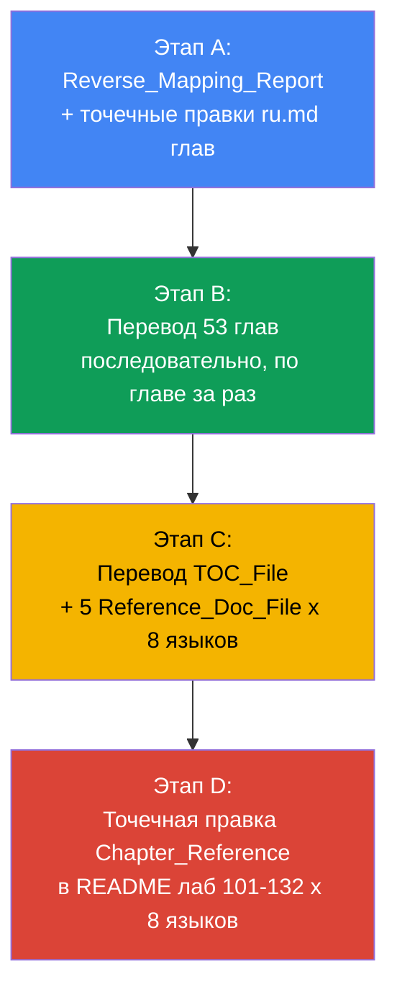
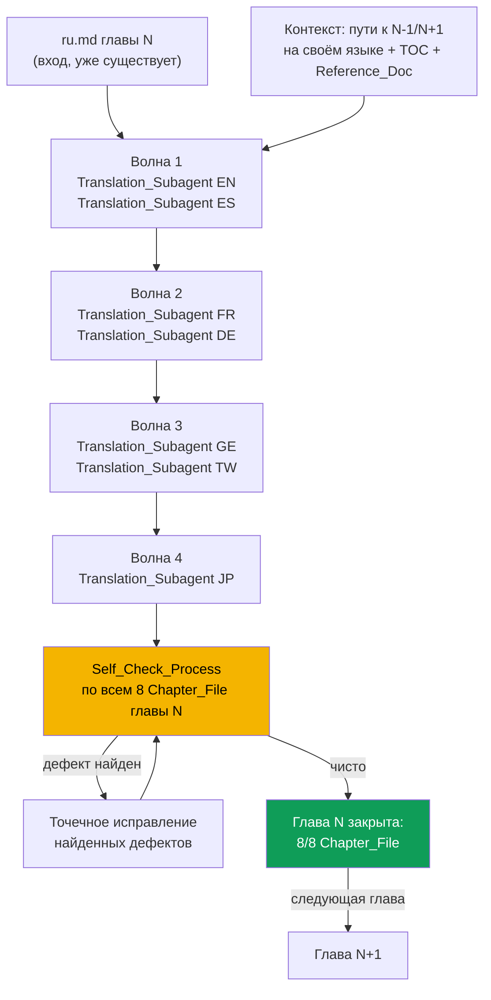

# Design Document

## Overview

Фича переводит курс EKS (`tasks/eks/course/`) с русского оригинала на 7 дополнительных
языков (EN, ES, FR, DE, GE - грузинский, TW - традиционный китайский, JP), используя ту же
языковую матрицу и конвенцию Language_Switcher, что уже отработана и закрыта в фиче
`eks-labs-translation-124-132` для лаб. Объём работы:

- **53 главы** (`00-1-aws`, `00-2-iam`, `00-3-vpc`, `00-4-ec2`, `00-5-tools`, `01`..`48`),
  каждая - полный комплект из 8 Chapter_File (`ru.md`, `en.md`, `es.md`, `fr.md`, `de.md`,
  `ge.md`, `tw.md`, `jp.md`), итого 424 файла (53 существующих `ru.md` + 371 новых).
- **1 оглавление курса** (TOC_File) - 8 файлов (`README_RU.md`, `README.md`,
  `README_ES.md`, `README_FR.md`, `README_DE.md`, `README_GE.md`, `README_TW.md`,
  `README_JP.md`).
- **5 справочников** (GLOSSARY, ADR, COST_MODEL, RUNBOOK, SCORECARD) x 8 языков = 40
  Reference_Doc_File.
- **Точечная правка обратных ссылок** в Lab_README_File лаб 101-132 на всех 8 языках (256
  файлов), заменяющая цель Chapter_Reference с `ru.md` на файл своего языка.

Планирующие файлы (`.chapter-spec.md`, `.content-notes.md`, `.labs-plan.tsv`,
`.labs-spec.md`, `.progress.md`) не переводятся и не входят в объём.

Как и в фиче с лабами, эта работа - генерация и точечная правка текстового markdown-контента
по фиксированному структурному шаблону, а не написание алгоритмического кода. Единица работы
- "файл, порождённый из файла-оригинала по правилам", а корректность проверяется
детерминированными структурными инвариантами (Self_Check_Process), а не тестами кода.

**Ключевое архитектурное отличие от фичи с лабами.** В `eks-labs-translation-124-132`
параллелизм шёл по лабам (два Translation_Subagent переводили две разные лабы одновременно,
каждый - весь набор языков своей лабы). Здесь это не годится: 53 главы образуют связный
граф навигации (Course_Chapter_Link на главу N-1/N+1 и на TOC_File), а сами эти ссылки
на соседние главы должны указывать на версии **того же языка**, которые ещё не существуют,
пока их не перевёл кто-то другой. Параллелить по главам означало бы, что сабагент,
переводящий главу 12 на DE, не может корректно сослаться на `13/de.md`, если глава 13 на DE
переводится другим сабагентом одновременно и её структура (например финальный список
служебных разделов) ещё не устоялась. Поэтому здесь:

- главы переводятся **строго последовательно, одна за раз** (не как в лабах, где 2 лабы шли
  параллельно);
- параллелизм переносится **внутрь перевода одной главы**, по языкам: 7 Translation_Subagent
  (один на язык), не более 2 одновременно, то есть 4 волны на главу.

## Architecture

### Порядок работы на уровне фичи

Работа состоит из четырёх последовательных этапов, каждый зависит от завершения предыдущего:



Порядок этапов - не произвольный, а обусловлен зависимостями по данным:

1. **Этап A должен идти первым**, потому что перевод глав должен опираться на уже
   согласованную (симметричную) привязку «глава <-> лаба» в RU-оригинале - иначе один и тот
   же Lab_Chapter_Mapping_Gap пришлось бы находить и чинить 8 раз (требование 5).
2. **Этап B** переводит 53 главы. Внутренние Course_Chapter_Link (на соседние главы) и
   Lab_Reference (на лабы) на этом этапе уже можно проставить правильно, потому что после
   этапа A привязка «глава -> лаба» в RU зафиксирована, а соседние главы своего языка
   появляются по мере последовательного прохода.
3. **Этап C идёт после этапа B**, потому что TOC_File и Reference_Doc_File ссылаются на
   Chapter_File всех 53 глав на своём языке - список этих путей окончательно известен только
   после того, как все главы переведены.
4. **Этап D идёт последним**, потому что это правка Lab_README_File (уже существующих на
   всех 8 языках), а не перевод - она заменяет цель Chapter_Reference с `ru.md` на файл
   своего языка, и делать это разумно только когда целевой файл (`XX.md` соответствующей
   главы) точно существует, то есть после этапа B.

### Этап B: перевод одной главы (4 волны по языкам)



Это прямая противоположность распределению работы в фиче с лабами: там ось параллелизма -
лаба (несколько лаб одновременно, каждая целиком на своём сабагенте), здесь ось параллелизма
- язык внутри одной главы, а сами главы идут строго по очереди. Оркестратор не переходит к
главе N+1, пока не завершён Self_Check_Process главы N (требование 9.1) - в отличие от лаб,
где допускалась гибкая разбивка (пара лаб или 4+4 языка одной лабы), тут порядок фиксирован
жёстко волнами `{EN,ES} -> {FR,DE} -> {GE,TW} -> {JP}`, лимит "не более 2 параллельно"
(требование 9.2) соблюдается по построению.

### Этап C: перевод TOC_File и Reference_Doc_File

Тот же принцип волн по языкам применяется к TOC_File (после которого известны все 53 x 8
путей к главам) и к 5 Reference_Doc_File. Поскольку TOC_File и Reference_Doc_File не образуют
граф ссылок друг на друга (Reference_Doc_File не ссылается на другой Reference_Doc_File,
только на главы), их можно переводить в любом относительном порядке между собой, но также
волнами по 2 языка максимум на каждый файл, чтобы не отступать от общего лимита параллелизма
фичи.

### Этап D: правка Chapter_Reference в лабах

Это не перевод, а точечная детерминированная правка существующего текста: в
Lab_README_File каждой лабы 101-132 на каждом из 8 языков находится Chapter_Reference (в
разделе «Цель»/«Objective» на ссылку на `../../course/NN/ru.md`) и целевой путь заменяется
на `../../course/NN/XX.md`, где `XX` - язык самого Lab_README_File. Выполняется
Chapter_Reference_Fixer (см. Components) - не Translation_Subagent, так как здесь нет
перевода текста, только замена пути ссылки.

## Components and Interfaces

### Translation_Subagent (роль, не код)

Тип: `general-task-execution`. Переводит один Chapter_File, TOC_File или Reference_Doc_File
на один язык за один вызов. Вход:

- полный текст `ru.md` переводимого файла (главы, TOC_File или Reference_Doc_File);
- для Chapter_File - пути к Chapter_File главы N-1 и главы N+1 **на своём целевом языке**
  (если уже существуют - в рамках последовательного прохода по главам они существуют для
  всех предыдущих глав; для соседней главы N+1, которая на момент перевода главы N ещё не
  переведена, передаётся ожидаемый путь по конвенции именования, а не проверенный факт
  существования - Course_Chapter_Link на неё будет синтаксически корректным сразу, содержимое
  появится когда дойдёт очередь);
- путь к TOC_File на своём целевом языке (по конвенции именования, не требует ожидания);
- перечень путей к 5 Reference_Doc_File на своём целевом языке (используются терминологией,
  если глава ссылается на глоссарий и т.п.);
- для Chapter_File - согласованный (после этапа A) список Lab_Reference из Practice_Section
  RU-оригинала главы и соответствующие пути к Lab_README_File лаб **на своём целевом языке**
  (`README_XX.MD`/`README.MD`);
- правило: Chapter_Number_Mention в прозе переводится как текст, не становится ссылкой
  (требование 4.3-4.4);
- правило: Non_Translatable_Term (команды, флаги, YAML, поля API, ARN, CIDR, типы
  инстансов, имена IAM-политик, теги, названия сервисов AWS, идентификаторы узлов mermaid) -
  не переводятся;
- правило: только обычный дефис `-`, без длинного тире `—`.

Выход: один переведённый файл с Language_Switcher первой строкой, с исправленными "внутри
своего языка" Course_Chapter_Link/Lab_Reference и сохранённой структурой (заголовки,
mermaid-диаграммы, таблицы, служебные разделы) относительно `ru.md`.

### Reverse_Mapping_Checker (роль оркестратора, не Translation_Subagent)

Детерминированная проверка (этап A), выполняется оркестратором напрямую (чтение файлов +
grep), не делегируется сабагенту - в отличие от перевода, здесь нет генерации текста:

1. Для каждой Lab 101-132 прочитать Chapter_Reference из «Цели» `README_RU.MD` и убедиться,
   что целевой Chapter_File существует.
2. Для каждой Chapter прочитать все Lab_Reference из Practice_Section `ru.md` и убедиться,
   что целевой Lab_README_File существует.
3. Построить обратное отображение: для каждой пары (Lab, Chapter) с Chapter_Reference
   Lab -> Chapter проверить наличие симметричного Lab_Reference Chapter -> Lab.
4. Зафиксировать каждое отсутствие симметрии как Lab_Chapter_Mapping_Gap, каждую ссылку на
   несуществующий файл - как битую ссылку. Результат - Reverse_Mapping_Report.
5. Подтвердить, что каждая Lab 101-132 упомянута хотя бы одним Lab_Reference хотя бы в одной
   Chapter на RU.

Найденные Lab_Chapter_Mapping_Gap исправляются точечно в `ru.md` затронутых глав (добавление
недостающего Lab_Reference и минимально необходимого текста в Practice_Section) до того, как
эта глава попадает в очередь перевода этапа B - иначе дефект переносится на все 7 языков.

### Chapter_Reference_Fixer (роль оркестратора, этап D)

Точечная правка, не перевод: для каждого Lab_README_File (32 лабы x 8 языков = 256 файлов)
находит строку с Chapter_Reference в разделе «Цель»/эквиваленте и заменяет суффикс целевого
пути `ru.md` на суффикс своего языка (`en.md`, `es.md`, ..., `jp.md`), не трогая подпись
ссылки, номер главы, окружающий текст или любой другой раздел файла (требование 6.4-6.5).
Реализуется как точечный `str_replace`/скриптовая замена по каждому файлу, не как вызов
Translation_Subagent - переводить здесь нечего, меняется только путь.

### Self_Check_Process

Как и в фиче с лабами - не отдельный программный компонент, а фиксированная
последовательность shell/grep-проверок, выполняемая оркестратором (не по отчёту
Translation_Subagent - требование 9.3):

**Для главы (после каждой из 53 глав, этап B), по всем 8 Chapter_File:**

1. Структурные счётчики: количество строк, `## `/`### ` заголовков, ```` ```mermaid ````
   блоков (и узлов в каждом), директив `style`, ```` ``` ```` code fence, markdown-таблиц -
   сравниваются между всеми 8 языковыми версиями главы; отличаться допустимо только
   количество строк.
2. Language_Switcher: ровно 7 ссылок первой строкой, порядок
   `RU -> EN -> ES -> FR -> DE -> GE -> TW -> JP` без своего языка.
3. Отсутствие `—` (длинное тире) - 0 вхождений в любом файле.
4. Отсутствие кириллицы вне Language_Switcher и вне Non_Translatable_Term - для всех
   Chapter_File, кроме `ru.md`.
5. **Новая проверка, специфичная для этой фичи (не было в лабах):** каждый
   Course_Chapter_Link и каждый Lab_Reference в Chapter_File языка `XX` указывает на файл
   того же языка `XX`, а не на `ru.md`/`README_RU.MD`. Это главный новый риск по сравнению с
   лабами: там переносимый файл-решение (`1.MD` -> `1_RU.MD`) был единственной "перекрёстной"
   ссылкой, здесь у каждой главы минимум 3 такие ссылки (N-1, N+1, TOC) плюс 0+ Lab_Reference,
   и все 53 главы связаны в общую цепочку - ошибка на одном языке одной главы легко
   остаётся незамеченной без явной автоматической проверки.
6. Сохранение порядка служебных разделов в конце файла (требование 7.5).

**Для TOC_File и Reference_Doc_File (после этапа C):** те же проверки 1-4, плюс проверка
5 в применении к спискам ссылок на главы/термины, плюс сравнение количества разделов/записей
с версией RU (требование 7.6).

**Для этапа D:** после правки Chapter_Reference - `grep` по каждому исправленному
Lab_README_File, подтверждающий, что путь Chapter_Reference заканчивается на суффикс своего
языка, а не на `ru.md`, и что `git status --porcelain` по остальным разделам файла и по
`worker/files/` пуст (правка не затронула ничего, кроме целевого пути ссылки).

## Data Models

Как и в фиче с лабами, модели здесь - формы файлов и метаданные для сравнения версий, а не
структуры данных программы.

### FileIdentity

| Роль | Language = RU | Language = EN | Language = XX (ES,FR,DE,GE,TW,JP) |
|------|----------------|-----------------|--------------------------------------|
| Chapter_File | `ru.md` | `en.md` | `xx.md` |
| TOC_File | `README_RU.md` | `README.md` | `README_XX.md` |
| Reference_Doc_File | `<DOC>_RU.md` | `<DOC>.md` | `<DOC>_XX.md` |
| Lab_README_File (не создаётся, только правится) | `README_RU.MD` | `README.MD` | `README_XX.MD` |

где `<DOC>` - одно из `GLOSSARY, ADR, COST_MODEL, RUNBOOK, SCORECARD`.

### LanguageSwitcher

Идентична конвенции из `eks-labs-translation-124-132`: первая строка файла, ровно 7 ссылок,
порядок `RU -> EN -> ES -> FR -> DE -> GE -> TW -> JP` с пропуском собственного языка,
подписи `Русская версия`, `Eng version`, `Versión en español`, `Version française`,
`Deutsche Version`, `ქართული ვერსია`, `繁體中文版`, `日本語版`.

### ChapterLinkSet

Специфично для этой фичи (у лаб не было цепочки навигации между собой). Набор исходящих
ссылок Chapter_File языка `XX`, каждая должна указывать на файл того же `XX`:

| Ссылка | Цель на языке RU (было) | Цель на языке XX (должно быть) |
|--------|--------------------------|-----------------------------------|
| Course_Chapter_Link "Оглавление" | `../README_RU.md` | TOC_File языка XX |
| Course_Chapter_Link "Глава N-1" | `../<N-1>/ru.md` | `../<N-1>/xx.md` |
| Course_Chapter_Link "Глава N+1" | `../<N+1>/ru.md` | `../<N+1>/xx.md` |
| Lab_Reference (0 или более) | `../../labs/<L>/README_RU.MD` | `../../labs/<L>/README_XX.MD` |

Первая/последняя глава каждой части курса (00-1-aws, 00-5-tools, 01, 48) может не иметь
одной из ссылок N-1/N+1 - это свойство RU-оригинала, сохраняется на всех языках без изменения
количества ссылок.

### StructuralFingerprint

Та же модель, что в фиче с лабами (количество строк, `## `/`### `, mermaid-блоки и узлы,
`style`, code fence, таблицы, `—`, ссылки в Language_Switcher), расширенная полем
`cross_language_link_violation_count` - количество Course_Chapter_Link/Lab_Reference,
указывающих не на файл своего языка; инвариант - всегда 0.

### ReverseMappingEntry

Одна строка Reverse_Mapping_Report: `(Lab, Chapter, Chapter_Reference_exists,
Lab_Reference_exists, gap_type)`, где `gap_type` - одно из `none`, `missing_lab_reference`,
`broken_chapter_reference`, `broken_lab_reference`.

## Error Handling

| Ситуация | Обнаружение | Действие |
|----------|-------------|----------|
| Lab_Chapter_Mapping_Gap: лаба ссылается на главу, глава не ссылается обратно на RU | Reverse_Mapping_Checker, этап A | Точечно дополнить Practice_Section `ru.md` главы недостающим Lab_Reference до начала перевода этой главы (требование 5.7-5.8) |
| Chapter_Reference или Lab_Reference в RU указывает на несуществующий файл | Reverse_Mapping_Checker, этап A | Зафиксировать в Reverse_Mapping_Report, исправить в RU до перевода затронутой главы |
| Chapter_File языка XX получил Language_Switcher не первой строкой или не из 7 ссылок | Self_Check_Process, пункт 2 | Добавить/исправить Language_Switcher первой строкой, повторить проверку |
| Course_Chapter_Link или Lab_Reference в файле языка XX указывает на `ru.md`/`README_RU.MD` вместо файла своего языка | Self_Check_Process, пункт 5 (новая проверка) | Точечно заменить целевой путь ссылки на файл языка XX, повторить проверку |
| Глава недопереведена (менее 8 Chapter_File по завершении волн) | Self_Check_Process, листинг каталога главы | Работа продолжается тем же или новым Translation_Subagent до 8/8, следующая глава не начинается (требование 9.1, 10.4) |
| Структурные счётчики версии XX не совпадают с эталоном `ru.md` (пропущен заголовок/mermaid-блок/таблица) | Self_Check_Process, пункт 1 | Точечно исправить файл языка XX, повторить проверку |
| Найдено длинное тире `—` в любом Chapter_File/TOC_File/Reference_Doc_File | Self_Check_Process, пункт 3 | Заменить на обычный дефис `-`, повторить проверку файла |
| Кириллица вне Language_Switcher и вне Non_Translatable_Term в файле языка != RU | Self_Check_Process, пункт 4 | Перевести пропущенную фразу, повторить проверку |
| Chapter_Number_Mention в прозе стал markdown-ссылкой на языке XX | Ручной просмотр + Self_Check_Process (нет отдельной ссылки, где её не было в RU) | Убрать ссылку, оставить текстовое упоминание номера главы |
| TOC_File или Reference_Doc_File языка XX ссылается на Chapter_File не своего языка | Self_Check_Process (этап C), пункт 5 в применении к спискам ссылок | Точечно исправить путь ссылки |
| После этапа D Chapter_Reference в Lab_README_File языка XX всё ещё указывает на `ru.md` | Self_Check_Process (этап D) | Повторить точечную замену для этого файла |
| Правка Chapter_Reference (этап D) случайно изменила другой раздел Lab_README_File или файл `worker/files/` | `git status --porcelain` за пределами исправленной строки | Откатить лишнее изменение, оставить только замену целевого пути ссылки |

## Testing Strategy

Property-based тестирование неприменимо к этой фиче по тем же причинам, что и к
`eks-labs-translation-124-132`: работа - генерация и точечная правка markdown-контента по
фиксированному шаблону из конечного, заранее известного набора входов (53 главы + 1 TOC + 5
справочников + 256 существующих файлов лаб для точечной правки), а не чистые функции с
большим или бесконечным пространством входов. Correctness Properties не пишутся, prework по
акцептанс-критериям для property-based тестирования не выполняется - это тот же случай
"markdown-контент/конфигурация", что и в руководстве по применимости PBT.

Вместо property-based тестов используется Self_Check_Process - тот же принцип, что в
фиче с лабами, расширенный проверкой направления межъязыковых ссылок (требование 9.6),
которой не было у лаб (у лаб не было графа ссылок между лабами). Проверки выполняются как
детерминированные shell/grep-команды оркестратором после каждой главы (этап B), после этапа
C и после этапа D - не по отчёту Translation_Subagent (требование 9.3).

Пример команд на одну главу (`DIR=tasks/eks/course/<chapter>`, `LANGS="ru en es fr de ge tw jp"`):

```bash
# 1. Структурные счётчики (пример для двух счётчиков, аналогично для остальных)
for l in $LANGS; do
  f="$DIR/$l.md"
  echo "$f: h2=$(grep -c '^## ' "$f") mermaid=$(grep -c '```mermaid' "$f") \
style=$(grep -c '^\s*style ' "$f") fence=$(grep -c '```' "$f") \
table=$(grep -c '^|' "$f") dash=$(grep -c '—' "$f")"
done

# 2. Language_Switcher - ровно 7 ссылок первой строкой
for l in $LANGS; do
  echo "$DIR/$l.md: links=$(head -1 "$DIR/$l.md" | grep -o '](' | wc -l)"
done

# 3. Кириллица вне переключателя (для всех языков, кроме ru)
for l in en es fr de ge tw jp; do
  tail -n +2 "$DIR/$l.md" | grep -n '[а-яА-Я]' && echo "CHECK $DIR/$l.md"
done

# 4. Новая проверка: все markdown-ссылки на .md ведут на файл своего языка
# (пример для de.md: каждая ссылка *.md должна оканчиваться на de.md, README_DE.md,
# либо быть внешним URL/Non_Translatable_Term)
grep -oE '\]\([^)]*\.md\)' "$DIR/de.md" | grep -viE '(de\.md|README_DE\.md)\)$' \
  && echo "CHECK $DIR/de.md: ссылка не на файл своего языка"

# 4b. То же для Lab_Reference на README лаб (пример для de.md)
grep -oE '\]\([^)]*README[^)]*\.MD\)' "$DIR/de.md" | grep -viE 'README_DE\.MD\)$' \
  && echo "CHECK $DIR/de.md: Lab_Reference не на README_DE.MD"
```

Пример команды для этапа D (правка Chapter_Reference в лабах, на одну лабу и язык, `L`=101..132, `XX`=DE):

```bash
grep -oE '\]\(\.\./\.\./course/[^)]*\.md\)' tasks/eks/labs/$L/README_XX.MD \
  | grep -viE 'xx\.md\)$' \
  && echo "CHECK README_XX.MD: Chapter_Reference не на файл языка XX"
git status --porcelain tasks/eks/labs/$L/README_XX.MD | grep -v '^ M README_XX.MD$' \
  && echo "CHECK: изменения затронули не только README_XX.MD"
```

Как и в фиче с лабами, отдельного тестового кода/фреймворка не требуется - весь набор
проверок укладывается в shell/grep-однострочники, запускаемые оркестратором через
`execute_bash` после каждого этапа. В tasks.md запуск Self_Check_Process должен быть
отдельным под-шагом после перевода каждой главы (этап B), после этапа C и после этапа D - не
опциональным, так как это обязательная часть критерия готовности (требование 9, 10).
