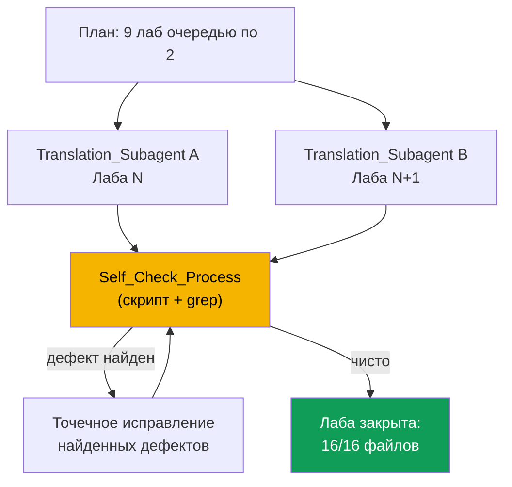
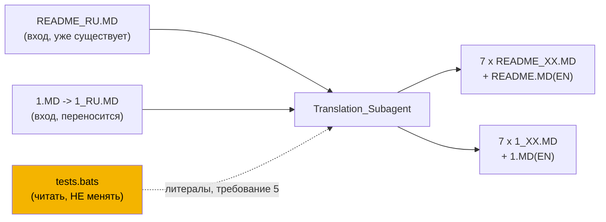

# Design Document

## Overview

Фича переводит 9 лаб курса EKS (`tasks/eks/labs/124` .. `132`) с русского оригинала на
7 дополнительных языков (EN, ES, FR, DE, GE, TW, JP), доводя каждую лабу до полного
`Lab_File_Set` из 16 файлов (8 README + 8 Solution), итого 144 файла. Это повторение уже
отработанного на лабах 101-123 процесса, без изменения самой конвенции - дизайн описывает,
как организовать работу так, чтобы не повторить три известных дефекта из истории проекта
(`.progress.md`, раздел «ПЕРЕВОДЫ ЛАБ EKS»):

1. `README_RU.MD` без переключателя языков первой строкой (лабы 108, 118, 119).
2. `README_RU.MD`, ссылающийся в разделе «Решение» на `1.MD` вместо `1_RU.MD` (лабы 118, 119).
3. Недоведённый до конца перевод - часть из 16 файлов не создана (лаба 122: остановились
   на 6 из 16).

Работа по каждой лабе не является написанием алгоритмического кода: это генерация текстового
контента (markdown) по строгому структурному шаблону и по фиксированному набору правил.
Соответственно единица работы - не "функция с входом/выходом", а "файл, порождённый по
шаблону из файла-оригинала". Корректность проверяется не property-based тестами, а
детерминированным набором структурных инвариантов (счётчики заголовков, блоков кода,
диаграмм, ссылок и литералов), которые одинаково применимы к любой лабе и любому языку -
это и есть Self_Check_Process из требования 7.

## Architecture

### Процесс на уровне фичи



Оркестрирующий агент (не Translation_Subagent) - владелец `tests.bats`-литералов и
Self_Check_Process. Он никогда не делегирует сабагенту финальную проверку "лаба готова" -
он проверяет сам, по правилу требования 7.2 ("не полагаясь только на отчёт
Translation_Subagent").

### Единица работы одной лабы



Каждый Translation_Subagent на входе получает: текст `README_RU.MD`, текст перенесённого
`worker/files/solutions/1_RU.MD` и точный список Test_Literal этой лабы (уже извлечённый
оркестратором из `tests.bats` при чтении файла непосредственно перед стартом перевода -
требование 5.12). Сабагент не открывает и не трогает `tests.bats` сам, чтобы исключить
риск случайной правки нередактируемого файла (требование 6) - список литералов ему
передаётся в промпте.

### Параллелизм

Не более 2 Translation_Subagent одновременно (требование 7.1), по одной лабе на сабагента.
9 лаб -> 5 волн (4 пары + 1 одиночная), в порядке возрастания номера: 124+125, 126+127,
128+129, 130+131, 132. Каждая волна завершается Self_Check_Process по обеим лабам волны
до запуска следующей волны - это и есть чекпоинт полноты из требования 8.3 ("работа
продолжается до достижения полного Lab_File_Set") применительно к процессу, а не только к
финальной сдаче.

Для лаб с большим объёмом (126, 128, 132 - самые длинные `1.MD`/`README_RU.MD`, 400+ строк
решения) допускается по требованию 7.1 разделить 8 языков одной лабы между двумя
Translation_Subagent (например 4+4 языка) вместо пары "лаба+лаба" - решение принимается по
факту объёма при старте волны, лимит "не более 2 параллельно" не нарушается в любом случае.

## Components and Interfaces

### Translation_Subagent (роль, не код)

Тип: `general-task-execution`. Вход одного вызова:
- полный текст `README_RU.MD` лабы (с переключателем языков, если уже есть, или без него);
- полный текст `worker/files/solutions/1_RU.MD` (уже переименованного оригинала);
- список Test_Literal лабы в форме "на языках, отличных от RU, использовать литерал X"
  (уже разрешённая конкретика из требования 5, а не сырой grep из `tests.bats`);
- перечень 7 целевых языков (или подмножества, если лаба разделена между двумя сабагентами)
  и правило именования файлов (требование 1);
- явный список запрещённых к изменению путей (требование 6.1-6.3).

Выход: N файлов (README_XX.MD и/или 1_XX.MD) плюс, при первом сабагенте лабы, исправленный
`README_RU.MD` (переключатель первой строкой) и `1_RU.MD` (перенесённый оригинал с
собственным переключателем и без внешних ссылок на 1.MD).

Обязанность сабагента (передаётся в промпте, а не проверяется автоматически на этом шаге):
- сохранить структуру 1:1 с оригиналом (требование 3);
- не переводить Non_Translatable_Term и Course_Chapter_Link (требование 4);
- использовать литералы из переданного списка на нерусских языках, где `tests.bats`
  допускает выбор языка (требование 5.10), и сохранить русский литерал буквально там, где
  альтернативы нет (требование 5.11, лаба 127 - `запрещён`);
- использовать только обычный дефис.

### Self_Check_Process (детерминированный скрипт + просмотр)

Не отдельный программный компонент фичи (это не библиотека, которую нужно писать и
покрывать тестами), а фиксированная последовательность shell-команд, выполняемая
оркестратором после каждой волны по каждому из 16 файлов лабы. Формально это тот же набор
проверок, что уже применялся к лабам 101-123 (см. `.progress.md`), формализованный здесь
как процессный компонент дизайна:

1. **Листинг полноты** (требование 8.2): `ls` корня лабы и `ls worker/files/solutions/`,
   сравнение с ожидаемым списком 16 имён.
2. **Структурные счётчики** (требование 3, 7.3) на каждый файл: количество строк,
   `grep -c '^## '`, `grep -c '```mermaid'`, `grep -c '^\s*style '`, `grep -c '```'`,
   `grep -c '—'`. Счётчики `## `, mermaid, style, fence должны совпадать между всеми 8
   языковыми версиями README (и отдельно - между всеми 8 версиями Solution); допустимо
   отличается только количество строк (из-за разной длины слов) и, в языковых версиях
   решения, число блоков bash - его тоже сравнивают со счётом README_RU/1_RU как эталона.
3. **Переключатель языков** (требование 1.6, 7.9): первая строка каждого файла содержит
   ровно 7 markdown-ссылок в порядке RU->EN->ES->FR->DE->GE->TW->JP без своего языка.
4. **Ссылка на решение** (требование 2, 7.5): в каждом README_File строка раздела
   «Решение»/«Solution» ссылается на Solution_File того же языка (grep по имени файла
   рядом с текстом раздела).
5. **Кириллица вне переключателя** (требование 7.4): `grep -n '[а-яА-Я]'` начиная со 2-й
   строки файла для всех языков, кроме RU; каждое совпадение сверяется со списком
   Test_Literal требования 5 для этой лабы - совпадение с литералом не дефект, всё
   остальное - дефект.
6. **Неизменность tests.bats** (требование 6.4, 7.6): `git status --porcelain` по пути
   `worker/files/tests.bats` этой лабы - ожидается пустой вывод.
7. **Длинное тире везде** (требование 4.4, 7.8): тот же `grep -c '—'`, уже учтён в пункте 2,
   но проверяется отдельно как самостоятельный критерий дефекта (в отличие от структурных
   счётчиков, здесь допустимое значение всегда 0, а не "равно эталону").

Пункты 1-7 выполняются оркестратором самостоятельно (bash/grep), не сабагентом, и не
считаются пройденными по отчёту сабагента "готово" - это прямая реализация требования 7.2.

### Литералы tests.bats по лабам (вход для промпта Translation_Subagent)

Список закрыт по факту повторного чтения всех 9 файлов `tests.bats` в рамках этого дизайна
(требование 5.12 выполняется на этапе задач индивидуально по каждой лабе непосредственно
перед переводом; ниже - контрольная таблица, зафиксированная в требованиях 5.1-5.9 и
подтверждённая построчным чтением):

| Лаба | Задание | grep в tests.bats | Что писать на языках != RU |
|------|---------|--------------------|------------------------------|
| 124 | 8 | `grep -qi 'управля'` | русский литерал `управля...` буквально (нет альтернативы) |
| 125 | 4 | `grep -qiE 'keyname\|ключ'` | `keyname` |
| 126 | 6 | `grep -qiE 'inbound\|входящ\|ingress'` | `inbound` или `ingress` |
| 127 | 3 | `grep -q 'запрещён'` (точное совпадение) | русский литерал `запрещён` буквально (нет альтернативы) |
| 128 | - | нет кириллических grep-литералов (проверено) | без ограничений |
| 129 | 5, 6 | `grep -qiE 'append\|rename\|середин'`, `grep -qiE 'snapshot\|снапшот'` | `append`/`rename` и `snapshot` |
| 130 | - | нет кириллических grep-литералов (проверено) | без ограничений |
| 131 | 5 | `grep -qiE 'crashloopbackoff\|нездоров'` | `crashloopbackoff` |
| 132 | 8 | `grep -qiE 'глава 8\|chapter 8'`, `grep -qi 'blue'` | `chapter 8`, `blue` (уже английское) |

Примечание по 124: тест 8 требует также точных слов `HPA` и `KEDA` (`grep -qi`, без
привязки к языку - это аббревиатуры, не литералы для перевода) - они уже
Non_Translatable_Term по требованию 4 и не нуждаются в отдельной обработке.

Примечание по 128 и 130: помимо отсутствия кириллических grep-литералов, в обеих лабах
проверяются литералы AWS/технические строки (`RefNotPermitted`, `ResolvedRefs`, `IMMUTABLE`,
`ImageTagAlreadyExists` и т.п.) - это Non_Translatable_Term по требованию 4.2, они не
переводятся ни в README, ни в Solution ни на одном языке, независимо от отсутствия
кириллицы; для дизайна это не отдельное правило, а частный случай уже описанного инварианта.

## Data Models

Модели этой фичи - не структуры данных программы, а формы файлов и метаданные, по которым
Self_Check_Process сравнивает версии. Три сущности:

### FileIdentity

Определяет имя файла по языку и роли:

| Роль | Language = EN | Language != EN |
|------|----------------|------------------|
| README | `README.MD` | `README_XX.MD` |
| Solution | `1.MD` | `1_XX.MD` |

где `XX` - один из `RU, ES, FR, DE, GE, TW, JP`.

### LanguageSwitcher

Первая строка файла, ровно 7 ссылок, порядок фиксирован
`RU -> EN -> ES -> FR -> DE -> GE -> TW -> JP` с пропуском собственного языка, подписи по
требованию 1.7:

```
[Русская версия](README_RU.MD) · [Eng version](README.MD) · [Versión en español](README_ES.MD) ·
[Version française](README_FR.MD) · [Deutsche Version](README_DE.MD) · [ქართული ვერსია](README_GE.MD) ·
[繁體中文版](README_TW.MD) · [日本語版](README_JP.MD)
```
(пример для версии на языке DE - собственный язык `Deutsche Version` пропущен бы в реальном
файле; выше показан полный список подписей для справки, а не готовая строка одного файла).

### StructuralFingerprint

Набор счётчиков одного файла, используемый для сравнения версий одной лабы между собой:

| Поле | Как считается | Инвариант |
|------|----------------|-----------|
| `h2_count` | `grep -c '^## '` | равен во всех 8 языках README лабы; равен во всех 8 языках Solution лабы (своё число для README и своё для Solution) |
| `mermaid_count` | `grep -c '```mermaid'` | равен во всех 8 языках README лабы |
| `style_count` | `grep -c '^\s*style '` | равен во всех 8 языках README лабы |
| `fence_count` | `grep -c '```'` | равен во всех 8 языках README лабы; равен во всех 8 языках Solution лабы |
| `em_dash_count` | `grep -c '—'` | равен 0 во всех файлах без исключений |
| `switcher_link_count` | ссылок в первой строке | равен 7 во всех файлах без исключений |
| `cyrillic_outside_switcher` | `grep -c '[а-яА-Я]'` со 2 строки, для языков != RU | равен 0, за исключением совпадений со списком Test_Literal лабы |

## Error Handling

| Ситуация | Обнаружение | Действие |
|----------|-------------|----------|
| `README_RU.MD` лабы не получил переключатель языков при переводе | Self_Check_Process, пункт 3 (не 7 ссылок в 1-й строке RU-файла) | Добавить переключатель первой строкой в `README_RU.MD`, повторить пункт 3-4 проверки |
| `README_RU.MD` ссылается на `1.MD` вместо `1_RU.MD` в разделе «Решение» | Self_Check_Process, пункт 4, отдельно для RU-версии | Исправить ссылку на `worker/files/solutions/1_RU.MD`, повторить проверку |
| Лаба недопереведена (меньше 16 файлов) | Self_Check_Process, пункт 1 (листинг) | Работа по лабе продолжается тем же или новым Translation_Subagent до 16/16, лаба не считается закрытой (требование 8.3) |
| Структурные счётчики версии на языке XX не совпадают с эталоном (пропущен заголовок, диаграмма, блок кода) | Self_Check_Process, пункт 2 | Дефект правится точечно в файле языка XX; при системном расхождении (например во всех нерусских версиях сразу) - пересмотр промпта следующей волны |
| Найдено длинное тире `—` в любом файле | Self_Check_Process, пункт 7 | Замена на обычный дефис `-`, повторная проверка этого файла |
| Кириллица вне переключателя, не входящая в список Test_Literal лабы | Self_Check_Process, пункт 5 | Считается дефектом перевода (забытая фраза), перевод фразы на целевой язык |
| `git status --porcelain` по `tests.bats` лабы непуст | Self_Check_Process, пункт 6 | Откат правки `tests.bats` немедленно, независимо от причины изменения - файл нередактируемый (требование 6) |
| Требуемый Test_Literal (например `запрещён` в лабе 127, `keyname` в 125) отсутствует в версии на языке XX | Целевая проверка литералов по таблице "Литералы tests.bats по лабам" | Добавить литерал буквально в текст задания версии XX, не заменяя переводом/транслитерацией |
| Лаба 128 или 130: при повторном чтении `tests.bats` перед переводом найден кириллический литерал, которого не было на момент этого дизайна | Требование 5.12, ручная проверка Translation_Subagent перед стартом | Зафиксировать новый литерал в промпте сабагента как для остальных лаб (требование 5.1-5.9), обновить таблицу перед переводом соответствующей лабы |

## Testing Strategy

Property-based тестирование неприменимо к этой фиче и Correctness Properties не пишутся.
Работа состоит из генерации и проверки текстового markdown-контента по фиксированному
человекочитаемому шаблону (перевод фраз, сохранение структуры документа), а не из чистых
функций с большим пространством входов, где имеет смысл формулировать универсальные
свойства вида "для всех X, P(X)". Здесь нет входного пространства, которое можно было бы
генерировать случайно и осмысленно - "вход" каждой единицы работы - это ровно один
конкретный существующий файл `README_RU.MD` и один `1_RU.MD` на лабу, всего 9
фиксированных пар документов, известных заранее. Это тот же случай, что "простой CRUD" или
"UI-рендеринг" в руководстве по применимости PBT - контент/конфигурация, а не логика с
большим пространством входов.

Вместо property-based тестов используется Self_Check_Process - фиксированный набор
детерминированных структурных инвариантов (см. "Components and Interfaces" выше и "Data
Models"), запускаемых как обычные shell/grep-проверки по каждому из 144 файлов после
перевода. Стратегия проверки полностью основана на этих проверках, выполняемых как shell-
команды после каждой волны перевода - без property-тестов, без unit-тестов в традиционном
смысле (нет кода приложения, которое можно юнит-тестировать), но с тем же уровнем строгости
за счёт стопроцентного покрытия всех 144 файлов одинаковым набором проверок.

**Self_Check_Process как "интеграционная проверка" фичи** (аналог integration-теста по
руководству PBT-против-integration: поведение не варьируется содержательно по случайному
входу, входов конечное известное число, стоимость повторного прогона низкая) выполняется:

1. После перевода каждой лабы (или пары лаб в одной волне) - до перехода к следующей волне.
2. Финально по всем 9 лабам вместе - сводная проверка листинга (144 файла) и того, что
   `git status --porcelain` по всем 9 `worker/files/tests.bats` пуст одновременно.

Конкретные команды (пример на одну лабу N, переменная `LANGS="RU EN ES FR DE GE TW JP"`):

```bash
# 1. Полнота
ls tasks/eks/labs/N/README*.MD
ls tasks/eks/labs/N/worker/files/solutions/1*.MD

# 2. Структурные счётчики по README (пример на одном счётчике, повторяется для каждого)
for f in tasks/eks/labs/N/README*.MD; do
  echo "$f: h2=$(grep -c '^## ' "$f") mermaid=$(grep -c '```mermaid' "$f") \
style=$(grep -c '^\s*style ' "$f") fence=$(grep -c '```' "$f") \
dash=$(grep -c '—' "$f")"
done

# 3. Переключатель - ровно 7 ссылок в первой строке
for f in tasks/eks/labs/N/README*.MD tasks/eks/labs/N/worker/files/solutions/1*.MD; do
  echo "$f: links=$(head -1 "$f" | grep -o '\]\(' | wc -l)"
done

# 4. Ссылка на решение своего языка (пример для FR)
grep -A2 '## Решение\|## Solution' tasks/eks/labs/N/README_FR.MD | grep '1_FR.MD'

# 5. Кириллица вне переключателя, все нерусские файлы
for f in tasks/eks/labs/N/README.MD tasks/eks/labs/N/README_{ES,FR,DE,GE,TW,JP}.MD; do
  tail -n +2 "$f" | grep -n '[а-яА-Я]' && echo "CHECK $f against Test_Literal table"
done

# 6. tests.bats не менялся
git status --porcelain tasks/eks/labs/N/worker/files/tests.bats
```

Эти команды применяются буквально так же, как применялись к лабам 101-123 (см.
`.progress.md`), меняется только номер лабы `N`. Отдельного тестового кода/фреймворка
писать не требуется - весь набор проверок укладывается в shell-однострочники, запускаемые
оркестратором вручную (через `execute_bash`) после каждой волны.

Задачи (tasks.md) явно включают запуск этого набора проверок как sub-task после перевода
каждой лабы - не помеченный опциональным `*`, так как это не тест кода в традиционном
смысле, а обязательная часть критерия готовности лабы (требование 8).
