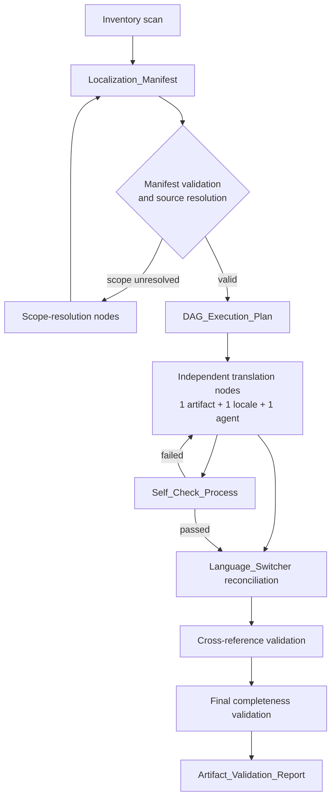

# Design Document

## Overview

Фича локализует **только отсутствующие** варианты материалов Istio Certified Associate (ICA) в `tasks/ica/course/` и `tasks/ica/labs/`. Объём не фиксируется предположением о полноте дерева: перед любыми переводами оркестратор строит снимок репозитория (`Localization_Manifest`), определяет обязательные локали и вычисляет конкретные отсутствующие артефакты. В базовый набор локалей входят RU, EN, ES, FR и DE; дополнительные локали допустимы только после явной записи утверждённой области в manifest.

Дизайн следует подходу `eks-course-chapters-translation`, но адаптирован для неполного и изменяющегося ICA-набора. В EKS объём языков и файлов был известен заранее; здесь inventory-first процесс является источником истины для количества узлов DAG, исходных файлов, соглашений об именах и зависимостей. После создания снимка любые новые локализованные файлы не считаются ошибкой текущего запуска: они фиксируются как входные данные следующей инвентаризации.

Реализация не переводит `tasks/ica/mock`, Terraform/Terragrunt-конфигурацию, `worker/`, тесты, ключи, манифесты Kubernetes и другие технические файлы. Локализуемыми могут быть только Markdown-артефакты, зарегистрированные в manifest: главы, индекс курса, README лабораторий и явно отмеченные пользовательские solution-материалы.

### Результат

Запуск выпускает четыре машиночитаемых результата:

1. `Localization_Manifest` — неизменяемый снимок обнаруженных артефактов, локалей и ссылок.
2. `DAG_Execution_Plan` — детерминированный граф работ, построенный исключительно из manifest.
3. Локализованные Markdown-файлы, созданные отдельными `Translation_Subagent` только для узлов со статусом `Missing_Localized_Artifact`.
4. `Artifact_Validation_Report` — результаты структурной проверки, проверки Language_Switcher, связей и итоговой полноты.

### Исследованные соглашения репозитория

Проверка существующих ICA-материалов показала текущую матрицу имён: Chapter_File используют `ru.md`, `en.md`, `es.md`, `fr.md`, `de.md`; Course_Index_File — `README_RU.md`, `README.md`, `README_ES.md`, `README_FR.md`, `README_DE.md`; Lab_README_File — аналогичные имена с расширением `.MD`. Уже существующие локализованные главы ссылаются на README лаборатории своего языка, а индекс — на главу своего языка. В видимом дереве не найдено solution-файлов по имени, поэтому их тип, локализуемость и схема имени не выводятся эвристически: они должны быть установлены inventory.

## Architecture

### Inventory-first конвейер



Процесс состоит из следующих фаз:

1. **Inventory.** Оркестратор обходит только `tasks/ica/course/` и `tasks/ica/labs/`, включая Course_Chapter `01`..`32`, корневой индекс курса и ICA_Lab `01`..`35`. Он распознаёт локализуемые Markdown-файлы, собирает их метаданные и все межфайловые ссылки.
2. **Manifest validation и scope resolution.** Оркестратор проверяет полноту записи Required_Locale_Set и выбирает source-language candidate. Неоднозначный источник или неутверждённая дополнительная локаль создают блокирующий узел scope resolution; перевод такого артефакта не планируется.
3. **DAG generation.** Из подтверждённого manifest строятся узлы перевода лишь для отсутствующих локалей. Исходные существующие файлы, файлы вне области и поздно появившиеся файлы не становятся дефектами или задачами текущего запуска.
4. **Localization.** Для каждого независимого узла выделяется ровно один Translation_Subagent, один Locale и один выходной путь. Агент не изменяет исходный документ, соседние локали или технические материалы.
5. **Reconciliation и validation.** После появления набора вариантов одного logical artifact оркестратор выравнивает Language_Switcher, затем проверяет локализованные ссылки независимо друг от друга. Каждый перевод проходит Self_Check_Process до допуска зависимых узлов.
6. **Finalization.** После успешного завершения всех плановых узлов оркестратор формирует итоговый отчёт с результатами снимка, пройденными узлами, неразрешёнными отношениями и остаточными missing artifacts.

### Детерминированное построение DAG

Узлы идентифицируются стабильным ключом:

```text
<phase>:<artifact-type>:<repository-relative-logical-path>:<locale>
```

Примеры: `translate:course-chapter:tasks/ica/course/13:DE` и `validate:cross-references:tasks/ica/labs/04:FR`. Стабильность обеспечивается repository-relative logical path и нормализованным кодом локали, а не порядком обхода файловой системы.

План содержит узлы `inventory`, `scope-resolution`, `translate`, `switcher-reconcile`, `cross-reference-validate` и `final-completeness-validate`. Каждый узел хранит `id`, `kind`, `artifact_type`, `logical_artifact_path`, `locale` (если применимо), `input_paths`, `output_paths`, `dependencies`, `validation_category`, `assigned_subagent` и `status` (`pending`, `blocked`, `running`, `passed`, `failed`, `skipped`).

Правила зависимостей:

- все узлы после inventory зависят от успешной проверки manifest;
- `translate:<artifact>:<locale>` зависит от source-language candidate и, при необходимости, от scope-resolution;
- узел перевода не зависит от параллельных переводов других локалей того же файла — ожидаемые пути допустимо передавать агенту как конвенцию, но существование целей проверяется позднее;
- `switcher-reconcile:<logical-artifact>` зависит от всех успешных translation-узлов для этого logical artifact и от всех уже существующих вариантов из его manifest-снимка;
- проверка Chapter_Reference, Lab_Reference или Solution_Reference зависит от source node и от target node только когда target соответствует обязательной локали и был запланирован как missing;
- cross-reference validation зависит от switcher reconciliation затронутых исходных артефактов;
- final-completeness validation зависит от всех не-`skipped` узлов и блокируется любым failed Self_Check_Process.

Два translation-узла помечаются `parallel_eligible=true`, если у них различны `output_paths`, между ними нет dependency edge и они не назначены на один и тот же файл. Одновременная работа над разными локалями возможна, поскольку каждый агент владеет только собственным языковым файлом; согласование общего Language_Switcher выполняется единым оркестратором после переводов. Это предотвращает гонки записи первой строки.

### Параллелизм и ответственность

`Translation_Subagent` выполняет один узел `translate` и имеет write-scope, равный ровно одному output path. Он переводит пользовательский Markdown-текст, сохраняет структуру, технические фрагменты и корректирует локальные цели ссылок, если target path выводится из manifest. Он не создаёт manifest, не меняет Required_Locale_Set, не правит Language_Switcher других вариантов и не подтверждает собственный результат вместо оркестратора.

Оркестратор является единственным владельцем inventory, выбора источника, DAG, reconciliation, Self_Check_Process, отчётов, узлов блокировки и финального статуса. При сбое Self_Check_Process его translation-узел помечается `failed`, а зависимые узлы остаются `blocked` до успешного повторного выполнения. Перевод может быть повторно назначен тому же или новому агенту, но только для того же Locale и output path.

## Components and Interfaces

### Inventory_Collector

Вход: repository root и ограниченная область `tasks/ica/course/`, `tasks/ica/labs/`.

Выход: `Localization_Manifest` в JSON или YAML с timestamp, базовыми путями, обнаруженными файлами и отношениями. Сканер классифицирует только:

- `Course_Chapter_File` в каталогах `course/01`..`course/32`;
- `Course_Index_File` в `tasks/ica/course/`;
- `Lab_README_File` в каталогах `labs/01`..`labs/35`;
- `Lab_Solution_File`, только если файл соответствует утверждённому inventory-признаку пользовательского решения.

Для каждого Markdown-файла scanner извлекает первую строку и все Markdown-ссылки, классифицируя найденные Language_Switcher, Chapter_Reference, Lab_Reference и Solution_Reference. Неудача чтения, недопустимое кодирование или неоднозначная классификация фиксируются в manifest как finding, а не замалчиваются.

### Manifest_Resolver

Этот компонент присваивает Required_Locale_Set каждому logical artifact на уровне артефакта. По умолчанию он равен `[RU, EN, ES, FR, DE]`; дополнительные локали включаются лишь с полями `locale`, `approval_scope` и `approval_reference`. Для каждого варианта он выбирает source-language candidate по зафиксированному приоритету: явно заданный source в manifest, затем существующий RU-вариант, иначе единственный утверждённый кандидат. Если кандидата нет или их несколько, `source_resolution_status=needs_resolution`; translation node не создаётся.

`Missing_Localized_Artifact` выводится только сравнением snapshot `available_locales` с Required_Locale_Set. Наличие файла вне Required_Locale_Set сохраняется в `extra_locales` и не является ошибкой. Файл, появившийся после `snapshot_created_at`, классифицируется `newly_discovered_input_next_snapshot`.

### Translation_Subagent interface

Входной контракт агента:

```json
{
  "node_id": "translate:lab-readme:tasks/ica/labs/04:DE",
  "source_path": "tasks/ica/labs/04/README_RU.MD",
  "output_path": "tasks/ica/labs/04/README_DE.MD",
  "locale": "DE",
  "source_locale": "RU",
  "required_locale_set": ["RU", "EN", "ES", "FR", "DE"],
  "known_equivalent_targets": [{"relationship": "chapter", "path": "tasks/ica/course/13/de.md"}],
  "preservation_rules": ["commands", "flags", "URLs", "paths", "identifiers", "code_blocks"]
}
```

Агент создаёт только `output_path`. Он должен сохранять номер главы/лабы, порядок заголовков, кодовых блоков, таблиц и Mermaid-диаграмм; не переводить команды, флаги, имена полей манифестов, идентификаторы, URL, пути и исполняемые блоки кода; и ставить ссылку на одноязычный эквивалент, когда такой target зарегистрирован. Агент возвращает статус и только собственные наблюдения; решение о прохождении принимает Self_Check_Process.

### Language_Switcher_Reconciler

Для каждого logical artifact оркестратор формирует первую строку каждого доступного варианта. Она содержит ровно одну Markdown-ссылку на каждый **доступный** Localization_Equivalent из Required_Locale_Set, кроме локали самого документа. Цели могут быть только файлами того же logical artifact. Порядок, видимые названия языков и файловые имена берутся из `localization_convention` manifest, а не из хардкода агента. После добавления локали reconciler обновляет все доступные варианты этого артефакта атомарным для группы проходом.

### Cross_Reference_Validator и Self_Check_Process

Validator проверяет каждую классифицированную ссылку по отдельности:

- Course_Index_File и Course_Chapter_File на Locale `XX` должны вести на Chapter_File/Index_File Locale `XX`;
- Course_Chapter_File на `XX` с Lab_Reference должен вести на Lab_README_File на `XX`;
- Lab_README_File на `XX` с Chapter_Reference должен вести на Course_Chapter_File на `XX`;
- Lab_README_File на `XX` с Solution_Reference должен вести на Lab_Solution_File на `XX`, только если manifest отмечает такой эквивалент.

Если эквивалента нет, validator создаёт unresolved finding с исходным путём, ожидаемым target path, locale и типом связи. Если одноязычный target существует, но ссылка ведёт на другую локаль, это defect. Никакой агрегированный результат не может скрыть ошибку во второй или последующей ссылке файла.

Self_Check_Process выполняется оркестратором после каждого translation node и повторно после reconciliation. Он сравнивает source и localized file по порядку headings, количеству code fences, таблиц, diagram blocks и ссылок, проверяет первую строку Language_Switcher и все локальные ссылки. Нормально отличающиеся длины строк и переводимый текст не считаются структурным расхождением.

## Data Models

### File naming convention

Manifest хранит конвенцию как данные, чтобы поддержать существующие ICA-имена и утверждённые будущие локали.

| Artifact type | RU | EN | ES / FR / DE | Правило расширения |
|---|---|---|---|---|
| Course_Chapter_File | `ru.md` | `en.md` | `es.md`, `fr.md`, `de.md` | lower-case `.md` |
| Course_Index_File | `README_RU.md` | `README.md` | `README_ES.md`, `README_FR.md`, `README_DE.md` | lower-case `.md` |
| Lab_README_File | `README_RU.MD` | `README.MD` | `README_ES.MD`, `README_FR.MD`, `README_DE.MD` | upper-case `.MD` |
| Lab_Solution_File | определяется inventory | определяется inventory | определяется inventory | только закреплённая в manifest схема |

Для дополнительной локали `XX` правило имени должно быть записано в `filename_pattern` целевого artifact type или конкретного logical artifact до создания узла. Нельзя выводить имя solution-файла по имени README или переносить конвенцию расширения без подтверждения manifest.

### Localization_Manifest

```json
{
  "schema_version": 1,
  "snapshot_created_at": "RFC-3339 timestamp",
  "inventory_roots": ["tasks/ica/course", "tasks/ica/labs"],
  "baseline_required_locales": ["RU", "EN", "ES", "FR", "DE"],
  "localization_convention": {
    "labels": {"RU": "RU version", "EN": "Eng version"},
    "filename_patterns": {"course_chapter": {"RU": "ru.md", "EN": "en.md"}}
  },
  "artifacts": [{
    "logical_path": "tasks/ica/course/13",
    "artifact_type": "course_chapter",
    "required_locale_set": ["RU", "EN", "ES", "FR", "DE"],
    "available_locales": {"RU": "tasks/ica/course/13/ru.md"},
    "extra_locales": [],
    "source_language_candidate": "RU",
    "source_resolution_status": "resolved",
    "missing_locales": ["EN", "ES", "FR", "DE"],
    "references": [],
    "solution_localizable": false
  }],
  "findings": []
}
```

`references` содержит `source_path`, `source_locale`, `relationship_type`, `raw_target`, `resolved_logical_target`, `resolved_target_locale` и `line`. Эти поля позволяют отчёту точно указать ошибку без повторной интерпретации текста.

### DAG_Execution_Plan и Artifact_Validation_Report

`DAG_Execution_Plan` материализует описанные выше node fields, а также `manifest_snapshot_id`; это не допускает запуска плана против другого состояния репозитория. Перед execution оркестратор повторно проверяет наличие входного source file и отсутствие конфликтующего output path. Если выходной файл успел появиться после снимка, узел помечается `skipped:newly_discovered_input` и переносится в следующий inventory, а не перезаписывает чужую работу.

`Artifact_Validation_Report` содержит `manifest_snapshot_id`, завершённые/заблокированные/failed узлы, все Self_Check measurements, unresolved references, defects и remaining Missing_Localized_Artifact. Finding имеет обязательные `artifact_path`, `locale`, `requirement_id`, `check`, `expected`, `observed`, `severity` и `node_id`. Артефакт считается `incomplete`, если для его Required_Locale_Set остаётся missing artifact, unresolved required relationship или defect.

## Correctness Properties

Отдельное property-based testing (PBT) для этой документационной локализации неприменимо: результатом являются конечный снимок Markdown-артефактов, файловые соглашения и межфайловые ссылки, а не чистая функция с широким пространством входов. Тем не менее следующие исполнимые свойства являются детерминированными инвариантами реализации. Они проверяются проверками из раздела **Testing Strategy** для каждого зафиксированного `Localization_Manifest` и соответствующего `DAG_Execution_Plan`.

### Property 1: Manifest является полным и снимок-детерминированным

Для любого завершённого inventory snapshot каждый включённый локализуемый Markdown-артефакт имеет repository-relative путь, тип, обнаруженную Locale, `Required_Locale_Set`, статус source-language candidate и все классифицированные Language_Switcher, Chapter_Reference, Lab_Reference и Solution_Reference. Множество `Missing_Localized_Artifact` в точности равно разности `Required_Locale_Set` и `available_locales` этого snapshot; extra locales и файлы, появившиеся после `snapshot_created_at`, не классифицируются как defects текущего запуска.

**Validates: Requirements 1.1, 1.2, 1.3, 1.4, 1.5, 1.6, 2.1, 2.3, 2.4, 2.5, 9.5**

### Property 2: DAG не допускает конфликтов записи и сохраняет ограничения зависимостей

Для любого `DAG_Execution_Plan`, построенного из одного и того же валидного manifest snapshot, идентификаторы узлов, входы, выходы и dependency edges совпадают. Каждый `translate`-узел имеет ровно один Locale, ровно один output path и ровно одного `Translation_Subagent`; два узла могут быть `parallel_eligible=true` только если у них различны output paths и отсутствует dependency edge. Узел cross-reference validation ожидает созданный required localized target, а любой failed `Self_Check_Process` блокирует все зависящие от него validation nodes.

**Validates: Requirements 2.6, 7.1, 7.2, 7.3, 7.4, 7.5, 7.6, 7.7, 8.1**

### Property 3: Language_Switcher согласован с доступными эквивалентами

Для любого доступного варианта включённого logical artifact первая строка содержит ровно один `Language_Switcher`. Он содержит ровно по одной Markdown-ссылке на каждый доступный `Localization_Equivalent` из `Required_Locale_Set`, кроме Locale самого файла, использует утверждённые manifest labels и не ссылается на другой logical artifact. После добавления доступного required Locale это свойство выполняется для каждого уже доступного варианта того же logical artifact.

**Validates: Requirements 5.1, 5.2, 5.3, 5.4, 5.5, 8.3**

### Property 4: Обязательные межфайловые ссылки сохраняют Locale

Для любой классифицированной Chapter_Reference, Lab_Reference или Solution_Reference из документа на Locale `XX`, если manifest фиксирует доступный соответствующий `Localization_Equivalent` на `XX`, ссылка разрешается именно в этот target на `XX`. Каждая ссылка проверяется независимо; если обязательный target отсутствует, результатом является unresolved finding с source path, ожидаемым target path и Locale, а ссылка на другую Locale при существующем target `XX` является defect.

**Validates: Requirements 3.5, 3.6, 4.4, 4.5, 6.1, 6.2, 6.3, 6.4, 6.5, 6.6, 8.4, 8.5**

### Property 5: Локализация соблюдает write-scope и сохраняет проверяемую структуру

Для любого завершённого `translate`-узла множество файлов, изменённых его `Translation_Subagent`, равно назначенному `output_path`; файлы вне manifest и невыбранные DAG-артефакты не изменяются. Назначенный output сохраняет порядок headings, количество fenced code blocks, таблиц, diagram blocks и ссылок своего source-language candidate, а также неизменными команды, флаги, поля манифестов, идентификаторы, URL, пути и исполняемые кодовые блоки, кроме целевых путей локализованных ссылок, разрешённых manifest.

**Validates: Requirements 3.3, 3.4, 4.3, 8.2, 9.1, 9.2, 9.3, 9.4**

## Error Handling

| Ситуация | Обнаружение | Действие |
|---|---|---|
| Не определён или неоднозначен source-language candidate | Manifest_Resolver | Создать `scope-resolution` node; не создавать translation node до решения. |
| Локаль вне baseline не утверждена | Manifest validation | Сохранить файл как extra locale; не планировать перевод по этой локали. |
| Output появился после snapshot | Pre-execution guard | Не перезаписывать; отметить newly discovered input для следующего inventory. |
| Файл solution не подтверждён как пользовательский | Inventory | Не создавать solution localization node; сохранить classification finding. |
| Нет одноязычного solution target | Cross_Reference_Validator | Не создавать фиктивный файл; записать unresolved Solution_Reference в отчёт. |
| Ссылка ведёт на другую локаль при существующем target `XX` | Cross_Reference_Validator | Defect; точечно исправить только назначенный исходный Markdown и повторить проверку. |
| Language_Switcher не на первой строке, дублирует цель или ведёт на другой logical artifact | Self_Check_Process | Reconciler восстанавливает строку по manifest и повторяет проверку группы. |
| Нарушены headings/code fences/tables/diagrams или изменён технический фрагмент | Self_Check_Process | Пометить translation node failed; агент исправляет только свой output path; зависимости остаются blocked. |
| Изменён файл вне назначенного output path | Write-scope / `git diff --name-only` | Failed node, откат лишнего изменения перед повтором; эскалация оркестратору. |
| Остались missing artifact или defects в финальном отчёте | Final completeness validation | Отметить logical artifact incomplete и не выдавать общий success. |

## Testing Strategy

Property-based testing как отдельный инструмент неприменимо. Фича не добавляет алгоритм или чистую функцию с большим пространством входов: её результатом являются Markdown-документы, файловые соглашения и ссылки в конечном snapshot репозитория. Требование 9.4 закрепляет детерминированную валидацию как подходящую форму acceptance validation; раздел Correctness Properties выше документирует проверяемые детерминированные инварианты, а prework для PBT не выполняется.

Вместо PBT оркестратор выполняет следующие детерминированные проверки:

1. **Inventory tests:** сверка всех допустимых course/lab каталогов, file identity, detected locale, source candidate, Required_Locale_Set и captured references с manifest snapshot.
2. **Manifest tests:** проверка, что missing artifacts получены исключительно разностью Required_Locale_Set и snapshot availability; дополнительные и поздние файлы не помечаются дефектами.
3. **Translation structural tests:** для каждого output сравнение с source: порядок headings, число fenced code blocks, таблиц, Mermaid/diagram blocks и ссылок; отдельно проверяется сохранность команд, флагов, URL, путей, идентификаторов и исполняемого кода.
4. **Language_Switcher tests:** первая строка, ровно одна ссылка на каждый доступный required equivalent кроме self, локализованные label и target того же logical artifact.
5. **Reference tests:** разрешение каждого Chapter/Lab/Solution reference, существование ожидаемого локального target, отсутствие cross-locale target при наличии одноязычного аналога и независимая проверка множества ссылок файла.
6. **DAG tests:** стабильность node IDs при повторном запуске на одном snapshot, корректность dependency edges, запрет параллельной записи в один output path и блокировка зависимостей после failed self-check.
7. **Scope and final tests:** подтверждение, что translation agents не меняли выходы за назначенным scope, и final report содержит все remaining missing artifacts, unresolved references и incomplete logical artifacts.

Проверки запускаются после каждого translation node, после каждой switcher-reconciliation группы и в конце DAG. Минимальный smoke check до завершения запуска — повторно прочитать manifest, проверить, что каждый passed output существует, и выполнить проверку ссылок по его классифицированным отношениям. Отдельный тестовый фреймворк и property-test library не требуются; результаты сохраняются в `Artifact_Validation_Report` и являются критерием готовности.