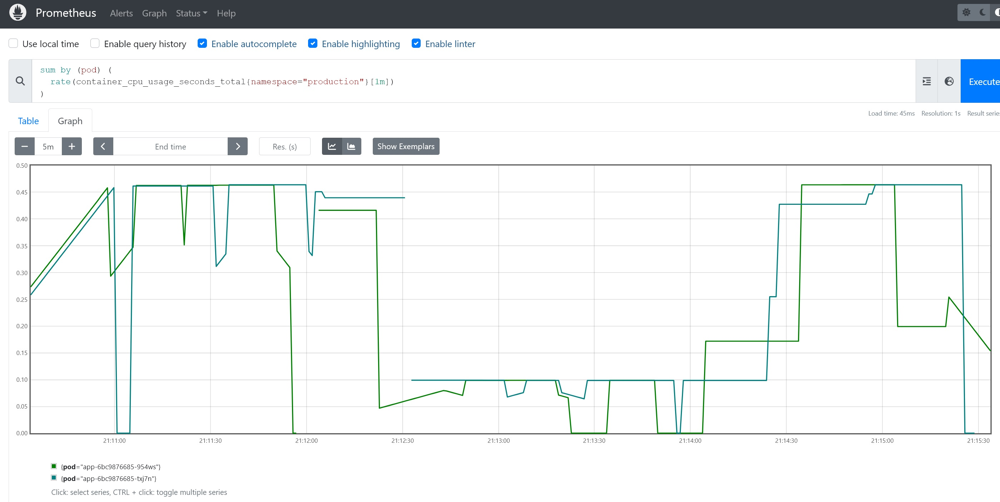

# 07

Port forward prometheus service to work PC

```sh
kubectl port-forward --address 0.0.0.0 svc/kube-prometheus-stack-prometheus 9090:9090 -n monitoring
```

Open in browser http://{worker_pc_IP}:9090

Check throttled containers by running the next query

```promql
sum by (pod) (
  rate(container_cpu_cfs_throttled_periods_total{namespace="production"}[1m])
)
```


Disable cpu limit for the pods

```sh
k edit deployments.apps -n production
```

```yaml
.......
        resources:
          limits:
#            cpu: 250m     # disable it
            memory: 20Mi
          requests:
            cpu: 100m
            memory: 10Mi
.......
```

Check cpu ussage

```promql
sum by (pod) (
  rate(container_cpu_usage_seconds_total{namespace="production"}[1m])
)
```



CPU usage is lees than 500m. Add 20% to it.
Set cpu limit for the pods  600m

```sh
k edit deployments.apps -n production
```

```yaml
.......
        resources:
          limits:
            cpu: 600m     # add it
            memory: 20Mi
          requests:
            cpu: 100m
            memory: 10Mi
.......
```

Check throttled containers again

```promql
sum by (pod) (
  rate(container_cpu_cfs_throttled_periods_total{namespace="production"}[1m])
)
```

If that's less then 1, task can be considered as done.
