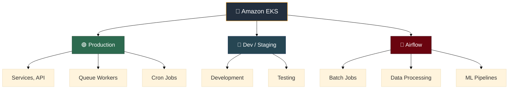
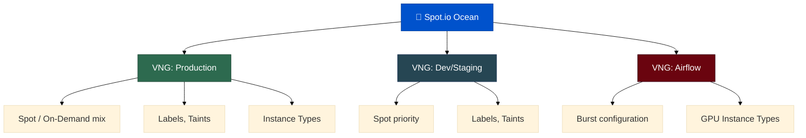
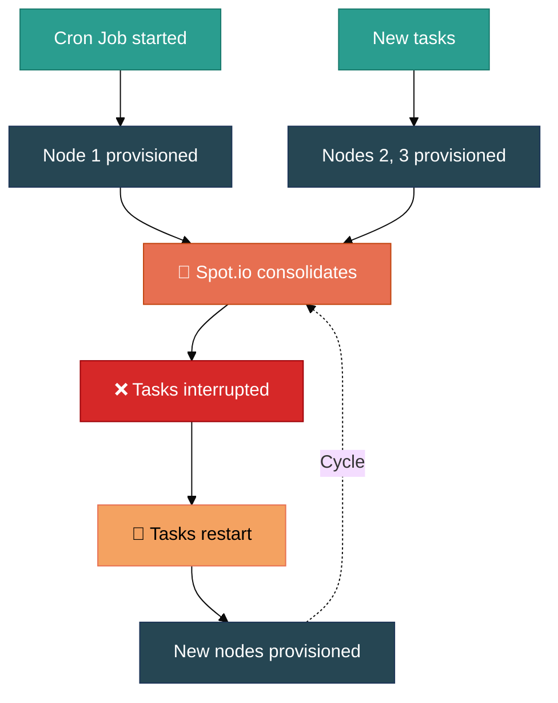
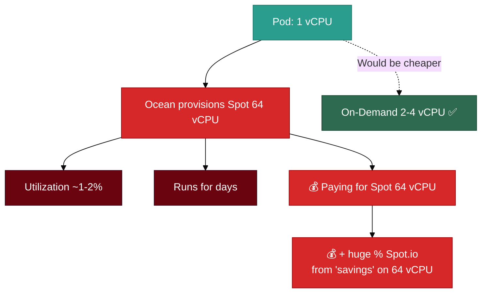
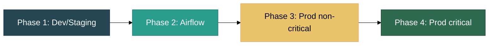
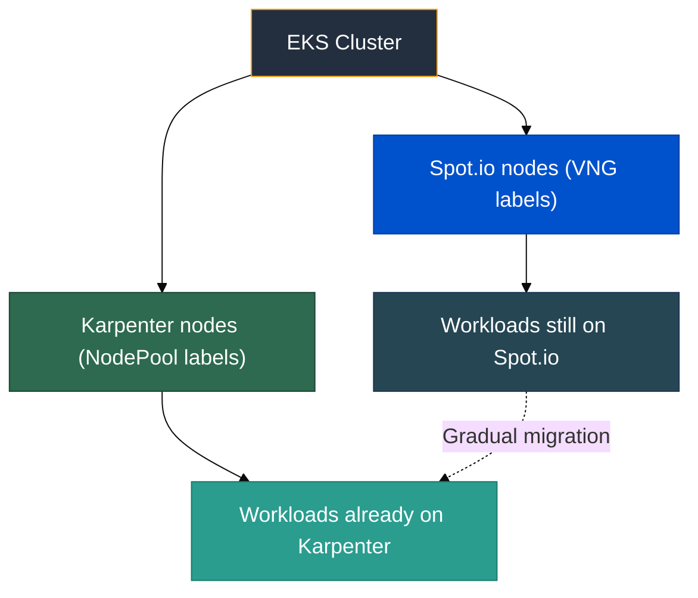
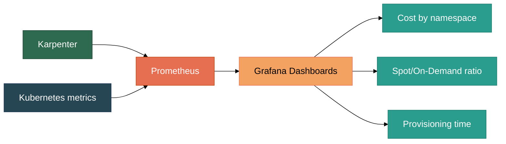
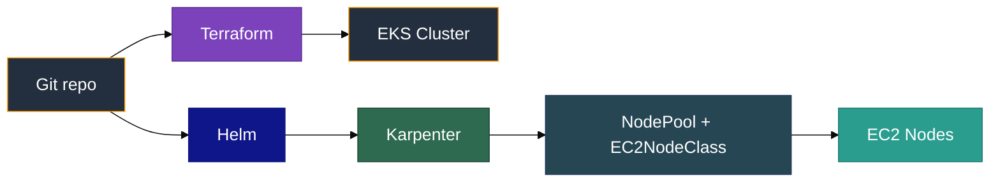
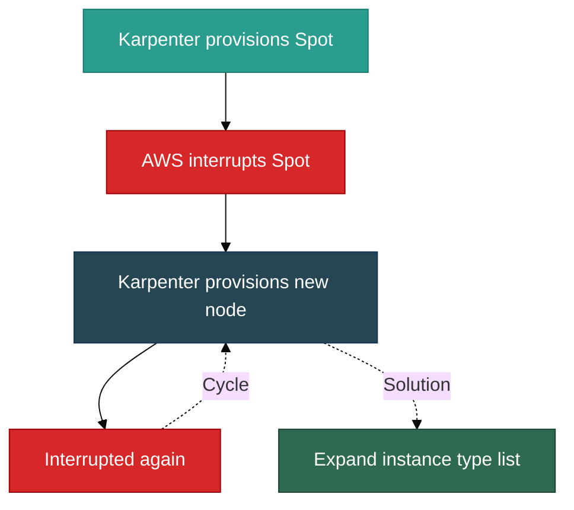
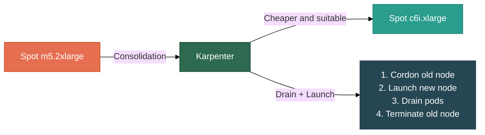

[RU version](readme_RU.MD)

# From Spot.io to Karpenter: Node Management Migration Experience in Kubernetes

## 1. Introduction

### 1.1. About Me and Our Team

My name is Viktar Mikalayeu, I'm a Tech Lead of the SRE department at Madlan. In addition to my main role, I'm a member of the [AWS Community Builders](https://aws.amazon.com/developer/community/community-builders/) program and the author of the open-source project [SRE Learning Platform](https://github.com/ViktorUJ/cks) - an educational platform for preparing for CKA, CKS, CKAD certifications and hands-on experience with AWS EKS.

Our team is responsible for Kubernetes infrastructure in production - maintaining dozens of clusters in AWS, from small dev environments to large production clusters with hundreds of nodes. Our scope covers everything related to cluster lifecycle: provisioning, scaling, cost optimization, upgrades, and ensuring stability for product teams.

We operate in a Platform Engineering model - providing internal teams with a convenient and predictable platform for running workloads, abstracting away infrastructure complexity. One of the key tasks is cluster node management: which instances to use, how to balance between Spot and On-Demand, how to handle interruptions while keeping costs under control.

### 1.2. Context: Infrastructure, Cluster Types, Tasks



Our infrastructure is built on Amazon EKS. Clusters differ by purpose and workload profile:

- **Production clusters** - primary workload, stability and SLA requirements. Running stateless services, API gateways, queue workers, and cron jobs for regular background tasks.
- **Dev/Staging clusters** - development and testing environments. Unpredictable load, but short-term disruptions are acceptable.
- **Airflow clusters** - clusters for analysts, combining batch jobs, data processing, and ML pipelines. Characterized by sharp resource consumption spikes followed by idle periods, as well as specific instance type requirements (including GPU nodes for model training and inference).

Each cluster type has its own scaling strategy requirements. Some need fast node provisioning, others prioritize cost minimization, and some require guaranteed availability of specific instance types.

Before migration, all clusters were managed through Spot.io (Ocean) - a SaaS solution for automatic Kubernetes node management focused on Spot instances. Over time, we encountered a number of limitations that led us to switch to Karpenter - an open-source node provisioner from AWS.

This article is a detailed breakdown of our journey: from migration reasons to results, problems, and practical recommendations.

## 2. History and Context

### 2.1. How Spot.io Was Used

When we started actively working with Spot instances, the choice of tools was limited. The only real alternative to Spot.io was Cluster Autoscaler, which worked through AWS Auto Scaling Groups (ASG). In practice, this meant:

- Slow scaling - ASG adds nodes through the chain "request → ASG → Launch Template → EC2", which took minutes instead of seconds.
- Rigid binding to instance types - each ASG was configured for a fixed set of instance types. If the needed type wasn't available, scaling simply didn't happen.
- Management complexity - different workloads required separate ASGs with different configurations, which quickly turned into a zoo.

Spot.io (Ocean) solved all these problems out of the box. It handled optimal instance type selection, automatically switched between Spot and On-Demand, quickly provisioned nodes, and provided a convenient monitoring dashboard. For us at that time, it was an obvious choice.

### 2.2. The Role of Virtual Node Groups (VNG)

The key abstraction in Spot.io Ocean is Virtual Node Groups (VNG) - logical node groups with specific parameters:

- Set of allowed instance types
- Spot/On-Demand strategy (percentage ratio)
- Labels and taints for workload binding
- Availability zone restrictions
- Autoscaling settings (min/max node count)



VNGs allowed flexible node separation by purpose. Each cluster type and workload group had its own VNG with appropriate parameters. Ocean automatically selected optimal instances within each group, considering current Spot prices and availability.

### 2.3. Key Advantages of Spot.io at the Start

At the time of adoption, Spot.io provided several tangible advantages over Cluster Autoscaler + ASG:

- **Scaling speed** - Ocean provisioned nodes significantly faster than ASG, through direct EC2 API interaction and pre-warming.
- **Automatic instance selection** - no need to manually pick types. Ocean determined the optimal instance type based on pod requirements and current prices.
- **Spot management** - built-in interruption handling logic: proactive pod migration before eviction, automatic On-Demand fallback.
- **Visualization and analytics** - convenient dashboard with cost, utilization, and Spot savings information. For management, this was important - savings could be clearly demonstrated.
- **Easy integration** - connecting to an existing EKS cluster took minimal time. A Terraform module, a couple of IAM roles - and Ocean manages the nodes.
- **Attractive pricing model** - Spot.io operated on a "percentage of savings" model: payment was calculated as a share of the difference between On-Demand instance cost and actual Spot instance cost. The more you save, the more you pay Spot.io, but you always come out ahead. The model was transparent and motivated both sides.

For a while, everything worked well. Spot.io covered our needs, savings were noticeable, and operational load on the team was minimal. Problems started appearing as infrastructure grew and requirements became more complex.

## 3. Migration Reasons

### 3.1. Limited Group Settings and Job Node Behavior

As infrastructure grew, we increasingly hit VNG limitations. Group settings weren't flexible enough for our scenarios:

- It was impossible to finely control node behavior for short-lived tasks. Job nodes provisioned for batch tasks or Airflow DAGs lived longer than needed - Ocean didn't always correctly determine when a node became empty and could be removed.
- Grace period and draining settings worked at the cluster or VNG level, without the ability to set behavior for a specific workload.
- When scaling job nodes, Ocean sometimes chose overly large instances "just in case", leading to low utilization and overspending.

Another serious problem - the inability to prevent node consolidation for cron job groups. The idea is simple: nodes in this group are launched for tasks, and while tasks are running - nodes cannot be moved or consolidated, because the task will be interrupted and restarted from scratch.

In practice, we repeatedly observed this scenario:

1. A node is provisioned for a task
2. New tasks arrive - more nodes are provisioned
3. Spot.io decides to consolidate nodes (merge pods onto fewer nodes)
4. Tasks are interrupted
5. Tasks restart - new nodes are provisioned
6. The cycle repeats



Spot.io does have a scale down prevention mechanism - the `spotinst.io/restrict-scale-down: true` label on a pod or the `restrictScaleDown` parameter at the VNG level ([documentation](https://docs.spot.io/ocean/features/scaling-kubernetes)). However, at the time of our migration, this mechanism wasn't flexible enough for our scenarios: it prevented node scale down but didn't protect against consolidation through bin packing. Additionally, managing this label for cron jobs required extra automation - dynamically adding and removing the label depending on task state. All this led to wasted compute time, task restarts, and unpredictable batch pipeline behavior.

### 3.2. On-Demand Fallback Errors and Overspending

One of the most painful problems - On-Demand fallback behavior. When Spot instances were unavailable, Ocean switched to On-Demand. This is correct in itself - workloads must run. But:

- Switching back to Spot didn't always happen. Nodes remained On-Demand longer than needed, even when Spot capacity returned.
- There was no transparent mechanism to track how many nodes were running On-Demand due to fallback vs. by configuration.
- As a result, we periodically discovered clusters where a significant portion of nodes had been running On-Demand for weeks, even though Spot was available. This led to substantial budget overruns.

A separate frequent situation - suboptimal instance size selection. Say a pod needs 1 vCPU. Ocean provisions a Spot node with 64 cores - simply because that Spot type is currently available. It would have been significantly cheaper to launch a small On-Demand instance with 2-4 vCPU. But Ocean didn't do that.

Such a node could run for days, utilizing 1-2% of resources. We even created special alerts to detect such situations, but it still required manual intervention - check, verify, recreate the node.

And what's especially unpleasant: Spot.io calculated savings as the difference between the On-Demand price of the same-sized instance and the actual Spot price. So for this huge 64-core Spot node, Spot.io charged itself a massive percentage - because formally the "savings" from the On-Demand price of a 64-core instance are enormous. In reality, we needed a 2 vCPU instance, and a small On-Demand would have been cheaper than Spot with 64 cores + Spot.io commission.



### 3.3. Spot.io Pricing Model Change

A critical factor was the change in Spot.io's pricing model. The original "percentage of savings" model was replaced with a fixed payment per managed vCPU per hour. This fundamentally changed the economics:

| | Old Model | New Model |
|---|---|---|
| Principle | % of savings (On-Demand - Spot) | Fixed price per vCPU/hour |
| Client risk | Minimal - pay only when saving | Pay always, regardless of savings |
| Predictability | Depends on Spot prices | Fixed, but grows with scale |
| Vendor motivation | Maximize Spot usage | Maximize managed vCPU count |

### 3.4. New Model Risks During Peak Loads

The new pricing model created especially serious risks for our Airflow clusters and any workloads with peak loads:

- During burst scenarios, vCPU count could grow several times for a short period. Under the new model, we paid Spot.io for every vCPU, even if the instance lived 10 minutes.
- Combined with the On-Demand fallback problem (section 3.2), the situation worsened: we paid both the full On-Demand price for the instance and Spot.io for managing that vCPU.
- Forecasting Spot.io costs became difficult - cost directly depended on peak values, not average load.

By our estimates, switching to the new model could increase Spot.io costs by 2-3x, while service quality remained the same. This became the final argument for seeking an alternative.

## 4. Choosing the Migration Approach

### 4.1. Considered Options

Having decided to move away from Spot.io, we considered several options:

| Criterion | Karpenter | Cluster Autoscaler + ASG | Hybrid: CA + Spot.io |
|---|---|---|---|
| Provisioning speed | ✅ Seconds (direct EC2 API) | ❌ Minutes (via ASG) | ⚠️ Depends on component |
| Instance selection | ✅ Automatic, by price and availability | ❌ Fixed set in ASG | ⚠️ Partially automatic |
| Solution cost | ✅ $0 (open-source) | ✅ $0 | ❌ Spot.io license |
| Management flexibility | ✅ NodePool + Disruption Budgets | ❌ Limited by ASG | ⚠️ Two-system conflicts |
| Operational complexity | ✅ Single system | ✅ Single system | ❌ Double complexity |
| EKS integration | ✅ Native (AWS) | ✅ Standard | ⚠️ External SaaS |
| Spot management | ✅ Built-in | ❌ None | ✅ Via Spot.io |

**Cluster Autoscaler + ASG** - return to the standard solution. We already knew its limitations: slow scaling via ASG, need to pre-define instance types, complexity of managing multiple ASGs for different workloads. Essentially, a step back to the problems we left for Spot.io.

**Hybrid: Cluster Autoscaler + Spot.io** - keep Spot.io for some clusters, use CA for others. Rejected quickly: double management complexity, potential conflicts between two autoscalers, and it didn't solve the Spot.io cost problem - just reduced the scale.

**Karpenter** - open-source node provisioner from AWS, designed specifically for Kubernetes on EKS. At the time of our choice, Karpenter had already exited beta and was actively developing.

### 4.2. Why We Chose Karpenter

Karpenter won on the combination of factors:

- **Direct EC2 API interaction** - Karpenter creates instances directly, bypassing ASG. This gives provisioning speed in seconds, not minutes.
- **Automatic instance selection** - based on pod requirements, Karpenter selects the optimal instance type from available ones, considering price, availability, and constraints.
- **NodePool and NodeClass** - flexible abstractions for managing node groups. NodePool defines requirements (instance types, capacity type, zones), and NodeClass defines infrastructure parameters (AMI, security groups, subnets).
- **Disruption management** - built-in consolidation, drift detection, and expiration mechanisms with fine-tuning through Disruption Budgets.
- **Zero cost** - open-source, no licenses or commissions. We only pay for EC2 instances.
- **Native AWS integration** - Karpenter is developed by AWS, deeply integrated with EKS, EC2 Fleet API, Spot interruption notices.

### 4.3. Key Karpenter Advantages for AWS

| Advantage | Description |
|---|---|
| ⚡ Provisioning in seconds | Direct EC2 API interaction, bypassing ASG |
| 🔧 NodePool / NodeClass | Flexible abstractions for node group management |
| 💰 $0 license | Open-source, pay only for EC2 |
| ☁️ Native for AWS EKS | Developed by AWS, deep EC2 Fleet API integration |
| 🛡️ Disruption Budgets | Fine-tuning consolidation, drift, expiration |
| 📊 Spot + On-Demand strategies | Automatic capacity type selection by price and availability |
| 📈 Prometheus metrics | Out-of-the-box metrics export, no external SaaS |
| 🔄 Drift Detection | Automatic detection and replacement of outdated nodes |

For our stack (EKS, Terraform, Prometheus/Grafana), Karpenter fit perfectly. Configuration is described in Kubernetes manifests, metrics are exported to Prometheus out of the box, and management is through standard kubectl commands. No separate SaaS account, additional third-party IAM integrations, or vendor lock-in needed.


## 5. Migration Model and Implementation Process

### 5.1. Proof of Concept and Testing on a Separate Cluster

We started the migration with a PoC on a separate dev cluster. The goal was to verify that Karpenter covers our main scenarios and gain configuration experience before going to production.

During the PoC we tested:

| Scenario | What We Tested |
|---|---|
| Basic provisioning | Node provisioning speed, instance type selection |
| Spot + On-Demand | Fallback correctness, return to Spot |
| Consolidation | Behavior under decreasing load, bin packing |
| Disruption Budgets | Workload protection from unwanted eviction |
| Cron Jobs | Nodes not consolidated while tasks are active |
| Drift Detection | Reaction to AMI, security group changes |

The PoC took about two weeks. During this time, we formed base NodePool and EC2NodeClass templates for each cluster type and documented behavioral differences compared to Spot.io.

### 5.2. Gradual Transition by Namespace and Workload Groups

We didn't switch entire clusters at once. Instead, we used a gradual approach - migrating workloads in groups:



**Phase 1: Dev/Staging** - minimal risk. Here we tested configurations, set up monitoring and alerts, identified first edge cases.

**Phase 2: Airflow clusters** - this is where we had the biggest problems with Spot.io (job node consolidation, oversized instances for small tasks). The transition gave a quick and noticeable effect.

**Phase 3: Production (non-critical services)** - queue workers, cron jobs, internal services. Workloads tolerant to short-term disruptions.

**Phase 4: Production (critical services)** - API gateways, core services with strict SLAs. Migrated last, after accumulating experience from previous phases.

At each phase, we maintained an observation period (1-2 weeks), compared cost and stability metrics with the previous Spot.io state, and only then moved forward.

### 5.3. Spot.io and Karpenter Running Together During Transition

During migration, Spot.io and Karpenter ran in parallel within the same cluster. This was possible through label and taint separation:

- Workloads migrated to Karpenter received nodeSelector/affinity for Karpenter nodes.
- Workloads remaining on Spot.io continued using VNGs with corresponding labels.
- The two controllers didn't conflict because each managed only "its own" nodes.



This approach allowed rollback at any moment - just switch the nodeSelector back to Spot.io labels. Throughout the entire migration, we only had to roll back one workload, and that was temporary - due to specific GPU instance behavior that we quickly fixed in the NodePool configuration.


## 6. Cost and Performance Monitoring

### 6.1. Pre-Migration Analysis Methods (Spot.io Dashboard, Cost Explorer)

Before migration, the main cost data sources were:

| Tool | What It Provided | Limitations |
|---|---|---|
| Spot.io Dashboard | Savings, Spot vs On-Demand ratio, cost by VNG | Data only inside Spot.io, no export to our stack |
| AWS Cost Explorer | Total EC2 cost by accounts and tags | No breakdown by cluster/namespace, 24-48h delay |
| AWS CUR (Cost & Usage Report) | Detailed data per instance | Complex processing, requires a separate pipeline |

The main problem - data was fragmented. Spot.io showed its savings picture, AWS Cost Explorer showed its own. Correlating them to get the real cost of a specific workload was difficult. We couldn't answer a simple question: "How much does namespace X in cluster Y cost for the last month?"

### 6.2. Post-Migration Analysis Methods (Prometheus, Grafana)

After switching to Karpenter, cost monitoring became part of our standard stack:

- **Karpenter metrics** - Karpenter exports metrics to Prometheus out of the box: node count, instance types, capacity type (Spot/On-Demand), provisioning time, disruption events.
- **kubecost / custom exporter** - for pod/namespace-level cost calculation, we use instance pricing data and resource consumption metrics.
- **Grafana dashboards** - single visualization point: cost by cluster, namespace, workload groups, Spot/On-Demand ratio dynamics.



The key difference - all data is now in one place, in our stack, with the ability to build any custom queries and alerts.

### 6.3. Approach to Comparing Results

For a fair "before" and "after" comparison, we used the following approach:

| Parameter | How We Compared |
|---|---|
| Total EC2 cost | AWS Cost Explorer, same tags and period |
| Spot/On-Demand ratio | Spot.io Dashboard vs Karpenter metrics in Prometheus |
| Spot.io license cost | Spot.io invoices vs $0 (Karpenter) |
| Provisioning time | Spot.io logs vs Karpenter metrics (scheduling-to-ready) |
| Incident count | Alerts in PagerDuty/Slack for comparable periods |
| Node utilization | Prometheus node_exporter, average CPU/Memory % |

Important: we didn't simply compare "a month on Spot.io" vs "a month on Karpenter", but identical workloads under identical conditions. The phased migration (section 5.2) was critical for this - we could see the difference on the same cluster before and after switching.


## 7. Migration Results

### 7.1. Cost Reduction and Improved Stability

The main result - a noticeable reduction in infrastructure costs:

| Metric | Before (Spot.io) | After (Karpenter) | Change |
|---|---|---|---|
| Node manager license cost | Spot.io commission (% of savings) | $0 | -100% |
| Spot/On-Demand ratio | ~60-70% Spot | ~80-90% Spot | +15-20% |
| "Stuck" On-Demand node cases | Regularly | Virtually none | Significant reduction |
| Oversized instances for small tasks | Frequently | Rarely (right-sizing) | Significant reduction |
| New node provisioning time | ~1-2 minutes | ~1-2 minutes | Comparable |

Karpenter is better at matching instance size to actual pod needs. Instead of a 64 vCPU Spot for a 1 vCPU task - Karpenter provisions an appropriately sized instance. This delivered noticeable savings, especially on Airflow clusters.

Stability also improved: "stuck" On-Demand node situations disappeared, cron job node consolidation cycles stopped, and the number of alerts requiring manual intervention decreased.

### 7.2. Simplified IAM and Configurations

Switching to Karpenter allowed us to significantly simplify the infrastructure layer:

| Aspect | Before (Spot.io) | After (Karpenter) |
|---|---|---|
| IAM | Roles for Spot.io controller + cross-account access | Standard IAM role for Karpenter in the cluster |
| Configuration | Terraform + Spot.io API + VNG in UI | Terraform + Kubernetes manifests (NodePool, EC2NodeClass) |
| Secret management | Spot.io API tokens | No external tokens, only IAM |
| Dependencies | External SaaS (Spot.io API, UI) | Only AWS API + Kubernetes API |
| Updates | Dependency on Spot.io releases | Helm chart, controlled updates |

By removing Spot.io, we eliminated an entire layer of external dependencies: API tokens, cross-account IAM roles, SaaS account, separate UI. All management is now through standard tools - kubectl, Terraform, Helm.

### 7.3. Improved Transparency and Control

One of the most valuable changes - full transparency of what's happening:

- **All decisions are visible** - Karpenter logs every provisioning/deprovisioning decision: why this instance type was chosen, why a node is being removed, which disruption budget applies.
- **Metrics in our stack** - Spot.io also had a Prometheus exporter, but Karpenter metrics are significantly more transparent. You can see why a particular node was replaced, how many Spot nodes were reclaimed by AWS, what decisions the autoscaler made and why. Everything in Grafana, alongside other cluster metrics.
- **Configuration as code** - we also stored VNG configs in Spot.io as code (Terraform), so that's parity. The difference is that NodePool and EC2NodeClass are native Kubernetes resources that live alongside other cluster manifests, not in a separate Terraform module for an external SaaS.
- **Predictable behavior** - Karpenter acts strictly according to configuration. No "black box" making decisions on the SaaS side.



For the team, this means: less "magic", more control, easier to debug problems.


## 8. Problems and Solutions (Karpenter Downsides)

Karpenter is not a silver bullet. After migration, we encountered a number of problems that we had to solve ourselves.

### 8.1. No Node Visualization - Grafana Dashboards

Spot.io had a convenient UI with node visualization: which instances are running, Spot or On-Demand, utilization, cost. Karpenter has nothing like this out of the box - only Prometheus metrics, logs, and NodeClaims (viewable via `kubectl get nodeclaims -o wide`).

Solution: we wrote our own console script that provides similar information - a list of nodes with instance type, capacity type, utilization, age. The data is pulled directly from the cluster via Kubernetes API, without caching on an external backend side. In Spot.io, UI data could lag behind reality due to caching on their backend - our script shows the actual state in real time.

Additionally, we built Grafana dashboards:

| Dashboard | What It Shows |
|---|---|
| Cluster Overview | Node count, Spot/On-Demand ratio, total capacity |
| Node Details | Node list with instance type, capacity type, age, utilization |
| Disruption Events | Node replacement history: reason, time, affected pods |
| Provisioning Latency | Time from pending pod to ready node |

This required initial time investment, but the dashboards ended up being more informative than Spot.io's UI because we built them for our specific needs.

### 8.2. Maintaining a Fixed Number of Nodes

In some scenarios, we need to guarantee a minimum number of nodes - for example, for production services with strict cold start latency requirements. In Spot.io, this was configured via min nodes in VNG.

Early Karpenter versions didn't have a direct "minimum N nodes" parameter. However, current versions support static NodePool with a `replicas` parameter that maintains a fixed number of nodes ([documentation](https://karpenter.sh/docs/concepts/nodepools/)). At the time of our migration, this feature didn't exist yet, so we used a combination of approaches:

- **Placeholder pods** - we create a Deployment with "empty" pods (minimal resource requests) and podAntiAffinity so each pod is guaranteed to run on a separate node. Minimum number of nodes = number of replicas in the Deployment. Placeholders consume virtually no resources, so there's no need to evict them - real workloads are placed on the same nodes alongside them.
- **NodePool limits** - we set maximum resources per NodePool to limit cluster growth and control budget.

### 8.3. Spot Interruptions - Missing instance_id in Logs

When AWS interrupts a Spot instance, it sends an interruption notice. Karpenter processes it and begins draining the node. The problem is that in Karpenter logs, it's not always easy to correlate an interruption with a specific instance_id - information is spread across multiple log entries.

Solution: we plan to add event collection through AWS EventBridge (Spot Interruption Warnings) and correlate them with Karpenter logs in our logging system. This will allow building a complete picture: which instance was interrupted, when, which pods were affected, where they moved. This isn't implemented yet and remains one of our growth areas.

### 8.4. No Cumulative Interruption Statistics

Spot.io maintained interruption statistics internally and used them for decision-making - it tried to select instances with lower interruption probability. But this data was closed to the user - we couldn't see which types were interrupted more often and in which AZs. Karpenter doesn't have such built-in analytics either - it doesn't consider interruption history when selecting instances.

Solution: we collect interruption data through:
- Karpenter metrics (`karpenter_nodeclaims_disrupted`) in Prometheus
- AWS EventBridge events (Spot Interruption Warning)
- Custom Grafana dashboard with aggregation by instance type, AZ, time of day

Over time, we accumulated enough data to make informed decisions about instance type selection and diversification strategy.

### 8.5. Price-Capacity Loop Behavior and Node Flapping

One of the non-obvious problems - a situation where Karpenter gets into a loop:

1. Karpenter provisions a Spot node
2. Spot capacity runs out, node is interrupted
3. Karpenter provisions a new node (possibly the same type)
4. Interrupted again
5. The cycle repeats

This leads to node "flapping" - pods are constantly moving, services are unstable.



Solution: maximize the list of allowed instance types in NodePool, but wisely. We use the following approach:

- **Generation restriction** - we specify a minimum instance generation (e.g., 4+) to avoid outdated types with worse price/performance ratio.
- **Excluding problematic types** - we obtained official AWS statistics on Spot instance interruption frequency and excluded types that were interrupted more often than others.
- **Wide range of families** - instead of specific types, we specify families (m5, m6i, m6a, c5, c6i, r5, r6i, etc.) with size filtering.
- **Multiple AZs** - distribution across availability zones increases the chances of finding available Spot capacity.


## 9. Pitfalls

Beyond the problems we solved (section 8), there are several pitfalls worth knowing about in advance.

### 9.1. Spot Shortage and Frequent Interruptions

In some regions and AZs, Spot capacity can be limited. If a NodePool is configured for a narrow set of instance types or a single AZ - you may face a situation where Karpenter simply cannot provision a node. Pods hang in Pending, alerts fire, and there's nothing you can do - there's no capacity.

Recommendations: instead of a single NodePool with fallback, it's better to use a cascade of NodePools with different weights. When multiple suitable NodePools exist, Karpenter selects the one with the highest weight. If the priority pool has no capacity - it moves to the next by weight ([documentation](https://karpenter.sh/docs/concepts/nodepools/)).

Cascading strategy example:

| Weight | NodePool | Capacity Type | Instance Types | AZ |
|---|---|---|---|---|
| 100 | spot-priority | Spot | Optimal types for the workload | Priority AZ (minimize cross-zone traffic) |
| 50 | spot-wide | Spot | Wide range of suitable types | All AZs |
| 25 | ondemand-priority | On-Demand | Suitable types | Priority AZ |
| 10 | ondemand-wide | On-Demand | Widest possible range | All AZs |

This approach provides:
- Spot priority in the needed AZ (savings + minimal cross-zone traffic)
- Expansion to all AZs if the priority one has no capacity
- Fallback to On-Demand in the needed AZ
- Last resort - On-Demand in any AZ with the widest type range

### 9.2. Unclear Logs and Missing Metrics

Karpenter logs are informative but not always intuitive. Examples:

| Situation | What We See in Logs | What's Missing |
|---|---|---|
| Spot interruption | "disrupting nodeclaim" | instance_id not always obvious |
| Consolidation | "consolidating nodes" | Which specific pods will be moved |
| Failed to provision node | "launching nodeclaim, capacity unavailable" | Which types were attempted |
| Drift detected | "drifted nodeclaim" | What exactly changed (AMI, SG, subnet) |

For production operations, we recommend setting up structured logging and parsing Karpenter logs into your logging system (ELK, Loki, etc.) so you can quickly search and correlate events.

### 9.3. Stability Issues with Limited Instance Types

If a NodePool has few instance types and Spot capacity for them is exhausted, Karpenter starts behaving unpredictably:

- Provisions a node, it's immediately interrupted
- Tries again with the same type (unavailability cache - 3 minutes)
- After cache expires - tries again and fails again
- Pods remain in Pending

This is especially critical for production services. The solution - always have On-Demand as fallback and sufficient type diversity. We follow the rule: minimum 10-15 allowed instance types in each NodePool.

### 9.4. Behavioral Differences Between Karpenter and Spot.io During Capacity Shortage

An important nuance to consider during migration:

| Behavior | Spot.io | Karpenter |
|---|---|---|
| No Spot of needed type | Provisions Spot of another type or On-Demand | Tries all allowed types, then falls back to On-Demand |
| No capacity at all | Waits, periodically retries | Caches unavailability for 3 min, then retries |
| Instance type selection | Based on internal interruption analytics | Based on price and availability (no interruption history) |
| Return to Spot from On-Demand | Didn't always happen (section 3.2) | Consolidation automatically replaces On-Demand with Spot |
| Instance size | Could choose an oversized one | Matches actual pod requests |

Key difference: Karpenter is more transparent and predictable, but requires more configuration responsibility from the team. Spot.io made some decisions for you (not always successfully), Karpenter does exactly what you configure.


## 10. Practical Aspects and Demo

### 10.1. Disruption Budget for Deployment

Disruption Budget on the Kubernetes side (PodDisruptionBudget, PDB) is the first line of defense for workloads against unwanted eviction. Karpenter respects PDB during consolidation and drift replacement.

PDB example for a production service:

```yaml
apiVersion: policy/v1
kind: PodDisruptionBudget
metadata:
  name: my-service-pdb
spec:
  maxUnavailable: 1
  selector:
    matchLabels:
      app: my-service
```

Key points:
- `maxUnavailable: 1` - Karpenter can evict at most 1 pod at a time. Other replicas continue running.
- For cron jobs and batch tasks, you can use `maxUnavailable: 0` - Karpenter won't touch the node until the task completes.
- PDB works in conjunction with `terminationGracePeriod` on NodePool - if PDB blocks eviction longer than the grace period, Karpenter will forcefully delete the pod.

### 10.2. Disruption Budget for NodePool

Karpenter has its own Disruption Budgets mechanism at the NodePool level, which limits the rate of node replacement:

```yaml
apiVersion: karpenter.sh/v1
kind: NodePool
metadata:
  name: production
spec:
  disruption:
    consolidationPolicy: WhenEmptyOrUnderutilized
    consolidateAfter: 5m
    budgets:
      - nodes: 10%
      # During business hours - don't touch nodes
      - schedule: "0 9 * * mon-fri"
        duration: 8h
        nodes: "0"
```

| Parameter | Description |
|---|---|
| `nodes: 10%` | Maximum 10% of nodes can be replaced simultaneously |
| `schedule` + `duration` | Time window when disruption is prohibited |
| `nodes: "0"` | Complete disruption ban during specified time |
| `consolidateAfter: 5m` | Wait 5 minutes after load change before consolidation |

This is analogous to a maintenance window - you can prohibit node replacement during business hours when load is at its peak.

### 10.3. Spot-to-Spot Replacement Mechanism

When Karpenter detects that the current Spot instance can be replaced with a cheaper or more suitable one, it performs a Spot-to-Spot replacement:



Process:
1. Karpenter finds a node that can be replaced with a cheaper one
2. Checks Disruption Budget (NodePool) and PDB (Deployment)
3. Launches a new node
4. Cordons the old node (blocks new pods)
5. Drains pods to the new node
6. Terminates the old node

Important: Spot-to-Spot replacement only happens with `consolidationPolicy: WhenEmptyOrUnderutilized`. With `WhenEmpty` - only empty nodes are removed.

### 10.4. Demo Tools and Visualization

For demonstrating and debugging Karpenter behavior, we use a set of tools:

| Tool | Purpose |
|---|---|
| `kubectl get nodeclaims -o wide` | Current nodes: type, capacity type, AZ, age |
| `kubectl get nodepools` | NodePool status: node count, resource consumption |
| `kubectl describe nodeclaim <name>` | Node details: events, conditions, labels |
| `kubectl logs -n kube-system -l app.kubernetes.io/name=karpenter` | Real-time Karpenter logs |
| Custom console script | Node summary: type, Spot/OD, utilization, cost |
| Grafana dashboards | Metrics visualization: provisioning, disruption, cost |

For presentations and demos, it's convenient to show:
- `kubectl get nodeclaims` before and after load changes - shows how Karpenter provisions/removes nodes
- Grafana dashboard with real-time Spot/On-Demand ratio
- Karpenter logs during Spot interruption - shows the entire node replacement process


## 11. Conclusions and Recommendations

### 11.1. Key Benefits of the Transition

| Benefit | Description |
|---|---|
| 💰 Cost reduction | No Spot.io license + better instance right-sizing |
| 🔍 Transparency | All decisions visible in logs and metrics, no "black box" |
| 🔧 Flexibility | NodePool, Disruption Budgets, weight - fine-tuning for each workload |
| 🛡️ Control | Configuration in Kubernetes manifests, no external SaaS dependency |
| 📉 Fewer incidents | "Stuck" On-Demand node issues and consolidation cycles eliminated |
| 🔄 Automatic return to Spot | Consolidation replaces On-Demand with Spot when capacity appears |
| 🏗️ Simplified infrastructure | Removed cross-account IAM, API tokens, external SaaS account |

### 11.2. What Can Be Improved Further

- Implement Spot Interruption event collection via AWS EventBridge for a complete interruption picture
- Automate excluded instance type list updates based on interruption statistics
- Add automatic canary tests when upgrading Karpenter versions
- Explore static NodePool with `replicas` as a replacement for placeholder pods
- Expand Grafana dashboards: add cost analytics at the namespace level

### 11.3. Practical Tips for Migration Preparation

If you're planning a transition from Spot.io (or another node manager) to Karpenter:

1. **Start with a PoC on a dev cluster** - don't go straight to production. Two weeks on a PoC will save months of problems.

2. **Document your current VNGs** - before migration, list all VNGs with their parameters: instance types, labels, taints, Spot/OD ratio. This becomes the foundation for NodePools.

3. **Use a NodePool cascade with weights** - don't put everything in one NodePool. Separate by priority: Spot in the needed AZ → Spot in all AZs → On-Demand.

4. **Set up monitoring in advance** - Grafana dashboards and alerts should be ready before migration starts, not after.

5. **Migrate in phases** - Dev → Airflow → Prod non-critical → Prod critical. At each phase - an observation period of 1-2 weeks.

6. **Keep Spot.io and Karpenter running in parallel** - label separation allows rollback at any moment.

7. **Expand instance types** - minimum 10-15 types per NodePool. Exclude frequently interrupted ones based on AWS statistics.

8. **Don't forget PDB** - Disruption Budget at the Deployment level protects workloads from unwanted eviction.

9. **Test Spot interruption** - use AWS FIS (Fault Injection Service) to simulate interruptions and verify Karpenter behavior.

10. **Plan a time budget** - migrating all clusters took us several months. This is not a weekend task.

---

The transition from Spot.io to Karpenter required effort, but the result was worth it. We got a more transparent, controllable, and cost-effective node management system. Karpenter isn't perfect - it has its own downsides and pitfalls. But for a team willing to invest time in configuration and monitoring, it's a powerful tool.

If you have questions about migration - feel free to reach out, happy to share our experience.

**Viktar Mikalayeu** - [LinkedIn](https://www.linkedin.com/in/viktar-mikalayeu-mns/) | [SRE Learning Platform](https://github.com/ViktorUJ/cks)
