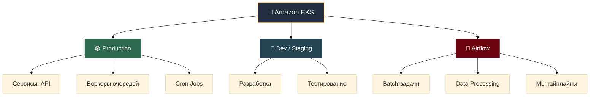
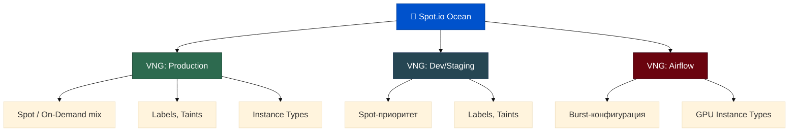
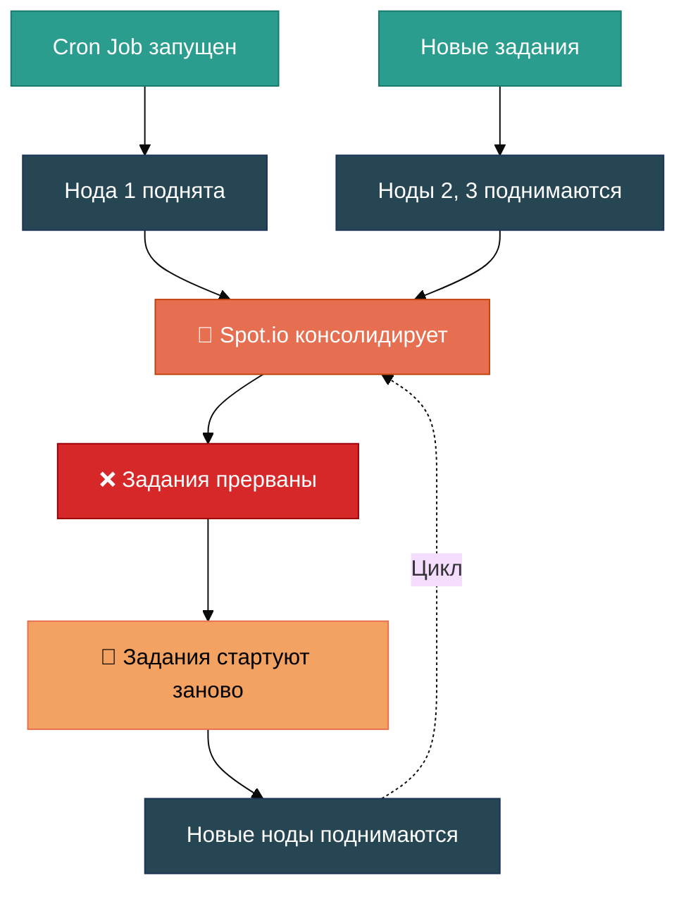
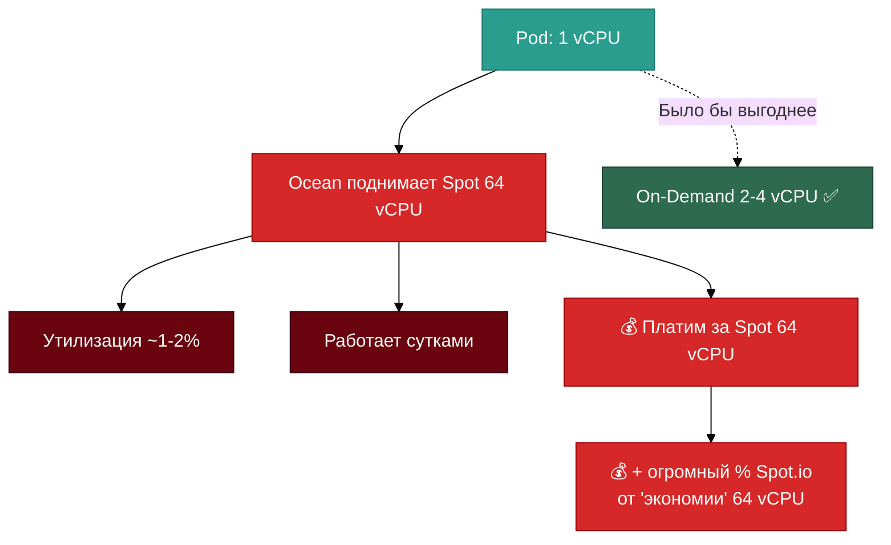
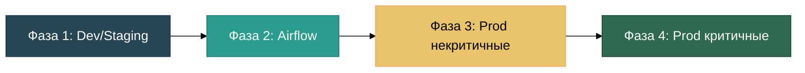
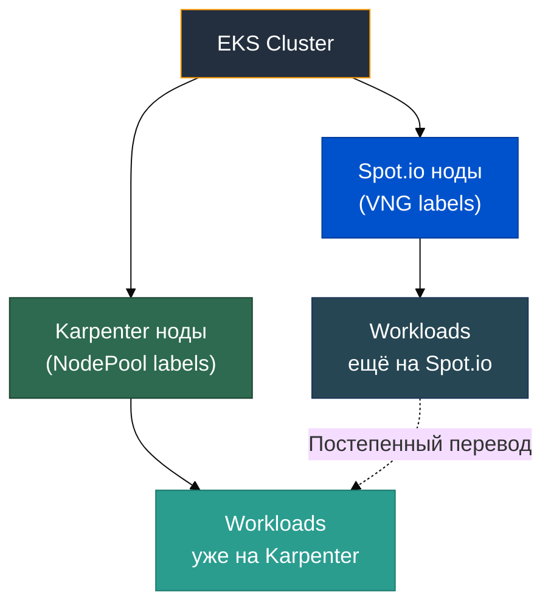
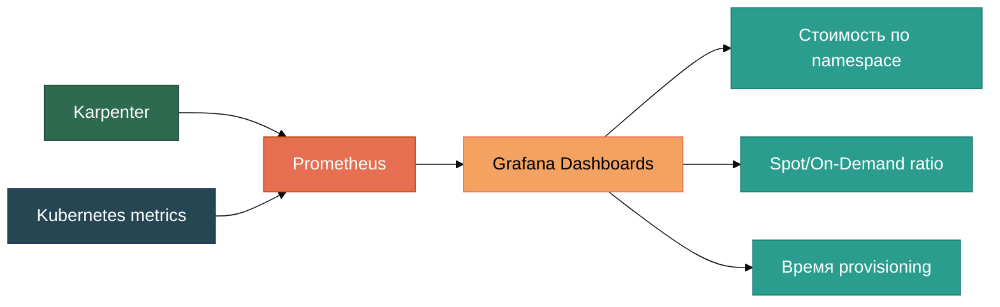
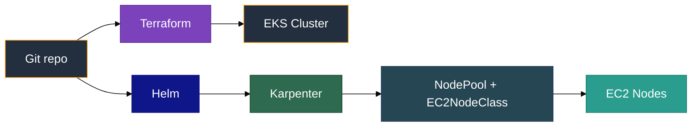
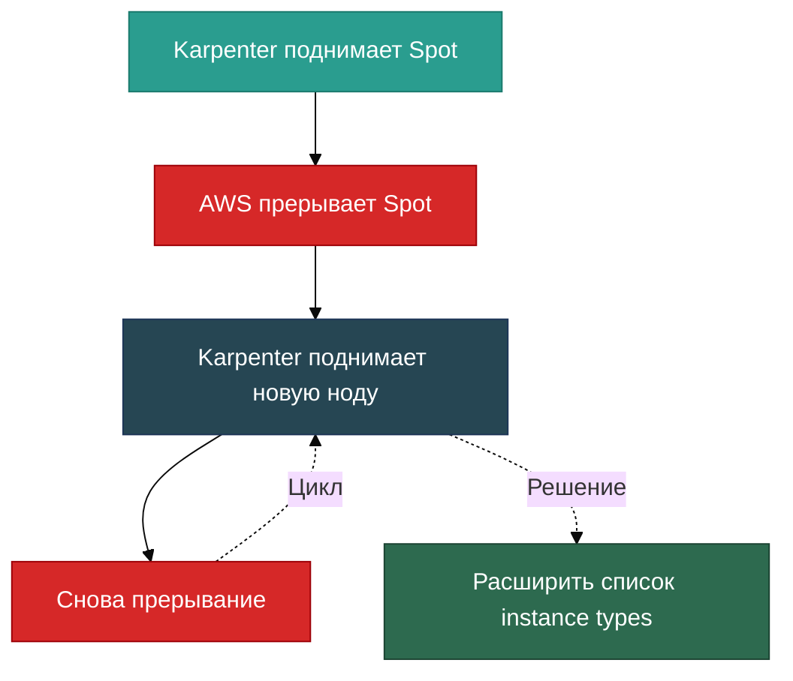
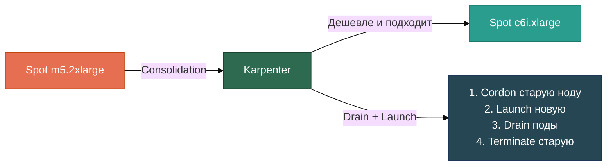

[EN version](readme.MD)


# От Spot.io к Karpenter: опыт миграции управления нодами в Kubernetes

## 1. Вступление

### 1.1. Кто я и чем занимается наша команда

Меня зовут Виктор Николаев (Viktar Mikalayeu), я Tech Lead SRE-отдела в компании Madlan. Помимо основной работы, я являюсь участником программы [AWS Community Builders](https://aws.amazon.com/developer/community/community-builders/) и автором open-source проекта [SRE Learning Platform](https://github.com/ViktorUJ/cks) - образовательной платформы для подготовки к сертификациям CKA, CKS, CKAD и практической работе с AWS EKS.

Наша команда отвечает за инфраструктуру Kubernetes в продакшене - сопровождает несколько десятков кластеров в AWS, от небольших dev-окружений до крупных production-кластеров с сотнями нод. В зону ответственности входит всё, что связано с жизненным циклом кластеров: provisioning, масштабирование, cost-оптимизация, обновления и обеспечение стабильности для продуктовых команд.

Мы работаем в модели Platform Engineering - предоставляем внутренним командам удобную и предсказуемую платформу для запуска workloads, скрывая за абстракциями сложность инфраструктуры. Одна из ключевых задач - управление нодами кластера: какие инстансы использовать, как балансировать между Spot и On-Demand, как реагировать на прерывания и при этом не переплачивать.

### 1.2. Контекст: инфраструктура, типы кластеров, задачи



Наша инфраструктура построена на Amazon EKS. Кластеры различаются по назначению и профилю нагрузки:

- **Production-кластеры** - основная нагрузка, требования к стабильности и SLA. Здесь работают stateless-сервисы, API-шлюзы, воркеры очередей, а также cron jobs для регулярных фоновых задач.
- **Dev/Staging-кластеры** - окружения для разработки и тестирования. Нагрузка непредсказуемая, но допустимы кратковременные перебои.
- **Airflow-кластеры** - кластеры для аналитиков, объединяющие batch-задачи, data processing и ML-пайплайны. Характерны резкие всплески потребления ресурсов с последующим простоем, а также специфические требования к типам инстансов (включая GPU-ноды для обучения моделей и inference).

Каждый тип кластера предъявляет свои требования к стратегии масштабирования. Где-то критична скорость поднятия новых нод, где-то - минимизация стоимости, а где-то - гарантия доступности определённых типов инстансов.

До миграции все кластеры управлялись через Spot.io (Ocean) - SaaS-решение для автоматического управления нодами в Kubernetes с фокусом на Spot-инстансы. Со временем мы столкнулись с рядом ограничений, которые привели нас к решению перейти на Karpenter - open-source node provisioner от AWS.

Эта статья - подробный разбор нашего пути: от причин миграции до результатов, проблем и практических рекомендаций.

## 2. История и контекст

### 2.1. Как использовался Spot.io

Когда мы начинали активно работать со Spot-инстансами, выбор инструментов был невелик. Единственной реальной альтернативой Spot.io был Cluster Autoscaler, который работал через AWS Auto Scaling Groups (ASG). На практике это означало:

- Медленное масштабирование - ASG добавляет ноды через цепочку «запрос → ASG → Launch Template → EC2», что занимало минуты вместо секунд.
- Жёсткая привязка к типам инстансов - каждая ASG настраивалась на фиксированный набор instance types. Если нужного типа не было в наличии, масштабирование просто не происходило.
- Сложность управления - для разных workloads приходилось создавать отдельные ASG с разными конфигурациями, что быстро превращалось в зоопарк.

Spot.io (Ocean) решал все эти проблемы «из коробки». Он брал на себя выбор оптимальных типов инстансов, автоматически переключался между Spot и On-Demand, быстро поднимал ноды и предоставлял удобный дашборд для мониторинга. Для нас на тот момент это был очевидный выбор.

### 2.2. Роль Virtual Node Groups (VNG)

Ключевой абстракцией в Spot.io Ocean являются Virtual Node Groups (VNG) - логические группы нод с определёнными параметрами:

- Набор допустимых типов инстансов
- Стратегия Spot/On-Demand (процентное соотношение)
- Labels и taints для привязки workloads
- Ограничения по availability zones
- Настройки autoscaling (min/max количество нод)



VNG позволяли гибко разделять ноды по назначению. Для каждого типа кластера и workload-группы создавалась своя VNG с подходящими параметрами. Ocean автоматически выбирал оптимальные инстансы внутри каждой группы, учитывая текущие цены на Spot и доступность.

### 2.3. Основные преимущества Spot.io на старте

На момент внедрения Spot.io давал нам ряд ощутимых преимуществ по сравнению с Cluster Autoscaler + ASG:

- **Скорость масштабирования** - Ocean поднимал ноды значительно быстрее, чем ASG, за счёт прямого взаимодействия с EC2 API и предварительного прогрева.
- **Автоматический выбор инстансов** - не нужно было вручную подбирать типы. Ocean сам определял оптимальный instance type на основе требований подов и текущих цен.
- **Spot-менеджмент** - встроенная логика обработки прерываний: заблаговременная миграция подов перед eviction, автоматический fallback на On-Demand.
- **Визуализация и аналитика** - удобный дашборд с информацией о стоимости, утилизации, экономии на Spot. Для менеджмента это было важно - можно было наглядно показать savings.
- **Простота интеграции** - подключение к существующему EKS-кластеру занимало минимум времени. Terraform-модуль, пара IAM-ролей - и Ocean управляет нодами.
- **Привлекательная ценовая модель** - Spot.io работал по модели «процент от экономии»: оплата рассчитывалась как доля от разницы между стоимостью On-Demand инстансов и фактической стоимостью использованных Spot-инстансов. Чем больше экономишь - тем больше платишь Spot.io, но при этом всегда остаёшься в плюсе. Модель была прозрачной и мотивировала обе стороны.

Какое-то время всё работало хорошо. Spot.io закрывал наши потребности, экономия была заметной, а операционная нагрузка на команду - минимальной. Проблемы начали проявляться по мере роста инфраструктуры и усложнения требований.

## 3. Причины миграции

### 3.1. Ограниченные настройки групп и поведение job-нод

По мере роста инфраструктуры мы всё чаще упирались в ограничения VNG. Настройки групп были недостаточно гибкими для наших сценариев:

- Невозможно было тонко управлять поведением нод для short-lived задач. Job-ноды, которые поднимались под batch-задачи или Airflow DAG, жили дольше, чем нужно - Ocean не всегда корректно определял момент, когда нода становилась пустой и её можно было удалить.
- Настройки grace period и draining работали на уровне всего кластера или VNG, без возможности задать поведение для конкретного workload.
- При масштабировании job-нод Ocean иногда выбирал слишком крупные инстансы «про запас», что приводило к низкой утилизации и перерасходу.

Ещё одна серьёзная проблема - невозможность запретить консолидацию нод для групп с cron jobs. Идея простая: ноды этой группы запускаются под задания, и пока задания выполняются - ноды нельзя перемещать и консолидировать, потому что задание прервётся и будет запущено заново с нуля.

На практике мы не раз наблюдали такой сценарий:

1. Поднимается нода для задания
2. Приходят новые задания - поднимаются ещё ноды
3. Spot.io решает консолидировать ноды (объединить поды на меньшее количество нод)
4. Задания прерываются
5. Задания стартуют заново - поднимаются новые ноды
6. Цикл повторяется



В Spot.io существует механизм предотвращения scale down - label `spotinst.io/restrict-scale-down: true` на поде или параметр `restrictScaleDown` на уровне VNG ([документация](https://docs.spot.io/ocean/features/scaling-kubernetes)). Однако на момент нашей миграции этот механизм работал недостаточно гибко для наших сценариев: он предотвращал scale down ноды, но не защищал от консолидации в рамках bin packing. Кроме того, управление этим label на уровне cron jobs требовало дополнительной автоматизации - нужно было динамически добавлять и убирать label в зависимости от состояния задания. Всё это приводило к потере вычислительного времени, повторным запускам и непредсказуемому поведению batch-пайплайнов.

### 3.2. Ошибки с On-Demand fallback и перерасход

Одна из самых болезненных проблем - поведение fallback на On-Demand. Когда Spot-инстансы были недоступны, Ocean переключался на On-Demand. Само по себе это правильно - workloads должны работать. Но:

- Обратное переключение на Spot происходило не всегда. Ноды оставались On-Demand дольше, чем нужно, даже когда Spot-ёмкость возвращалась.
- Не было прозрачного механизма отслеживания, сколько нод сейчас работает на On-Demand из-за fallback, а сколько - по конфигурации.
- В результате мы периодически обнаруживали кластеры, где значительная часть нод работала на On-Demand неделями, хотя Spot был доступен. Это приводило к существенному перерасходу бюджета.

Отдельная частая ситуация - неоптимальный выбор размера инстанса. Допустим, поду нужно 1 vCPU. Ocean поднимает Spot-ноду с 64 ядрами - просто потому что именно этот тип Spot сейчас доступен. При этом было бы значительно выгоднее запустить маленький On-Demand инстанс на 2-4 vCPU. Но Ocean этого не делал.

Такая нода могла работать сутками, утилизируя 1-2% ресурсов. Мы даже создали специальные алерты для обнаружения подобных ситуаций, но всё равно это требовало ручного вмешательства - зайти, проверить, пересоздать ноду.

И что особенно неприятно: Spot.io считал savings как разницу между стоимостью On-Demand инстанса такого же размера и фактической ценой Spot. То есть за эту огромную Spot-ноду с 64 ядрами Spot.io начислял себе огромный процент - ведь формально «экономия» от On-Demand цены 64-ядерного инстанса колоссальная. А по факту нам нужен был инстанс на 2 vCPU, и маленький On-Demand обошёлся бы дешевле, чем Spot на 64 ядра + комиссия Spot.io.



### 3.3. Изменение модели ценообразования Spot.io

Критическим фактором стало изменение ценовой модели Spot.io. Изначальная модель «процент от экономии» была заменена на фиксированную оплату за каждый управляемый vCPU в час. Это принципиально меняло экономику:

| | Старая модель | Новая модель |
|---|---|---|
| Принцип | % от savings (On-Demand − Spot) | Фиксированная цена за vCPU/час |
| Риск для клиента | Минимальный - платишь только при экономии | Платишь всегда, независимо от экономии |
| Предсказуемость | Зависит от Spot-цен | Фиксированная, но растёт с масштабом |
| Мотивация вендора | Максимизировать Spot-использование | Максимизировать количество управляемых vCPU |

### 3.4. Риски новой модели при пиковых нагрузках

Новая модель ценообразования создавала особенно серьёзные риски для наших Airflow-кластеров и любых workloads с пиковыми нагрузками:

- При burst-сценариях количество vCPU могло вырастать в разы на короткое время. По новой модели мы платили Spot.io за каждый vCPU, даже если инстанс жил 10 минут.
- В сочетании с проблемой fallback на On-Demand (п. 3.2) ситуация усугублялась: мы платили и полную цену On-Demand за инстанс, и Spot.io за управление этим vCPU.
- Прогнозирование затрат на Spot.io становилось сложным - стоимость напрямую зависела от пиковых значений, а не от средней нагрузки.

По нашим расчётам, при переходе на новую модель стоимость Spot.io могла вырасти в 2-3 раза, при этом качество сервиса оставалось прежним. Это стало финальным аргументом в пользу поиска альтернативы.

## 4. Выбор подхода к миграции

### 4.1. Рассмотренные варианты

Приняв решение уходить от Spot.io, мы рассмотрели несколько вариантов:

| Критерий | Karpenter | Cluster Autoscaler + ASG | Гибрид: CA + Spot.io |
|---|---|---|---|
| Скорость provisioning | ✅ Секунды (прямой EC2 API) | ❌ Минуты (через ASG) | ⚠️ Зависит от компонента |
| Выбор инстансов | ✅ Автоматический, по цене и доступности | ❌ Фиксированный набор в ASG | ⚠️ Частично автоматический |
| Стоимость решения | ✅ $0 (open-source) | ✅ $0 | ❌ Лицензия Spot.io |
| Гибкость управления | ✅ NodePool + Disruption Budgets | ❌ Ограничена ASG | ⚠️ Конфликты двух систем |
| Сложность эксплуатации | ✅ Единая система | ✅ Единая система | ❌ Двойная сложность |
| Интеграция с EKS | ✅ Нативная (AWS) | ✅ Стандартная | ⚠️ Внешний SaaS |
| Spot-менеджмент | ✅ Встроенный | ❌ Нет | ✅ Через Spot.io |

**Cluster Autoscaler + ASG** - возврат к стандартному решению. Мы уже знали его ограничения: медленное масштабирование через ASG, необходимость заранее определять типы инстансов, сложность управления множеством ASG для разных workloads. По сути, это был шаг назад к тем проблемам, от которых мы ушли к Spot.io.

**Гибрид: Cluster Autoscaler + Spot.io** - оставить Spot.io для части кластеров, а для остальных использовать CA. Вариант отвергли быстро: двойная сложность в управлении, потенциальные конфликты между двумя autoscaler-ами, и это не решало проблему стоимости Spot.io - просто уменьшало масштаб.

**Karpenter** - open-source node provisioner от AWS, спроектированный специально для Kubernetes на EKS. На момент нашего выбора Karpenter уже вышел из beta и активно развивался.

### 4.2. Почему остановились на Karpenter

Karpenter выиграл по совокупности факторов:

- **Прямая работа с EC2 API** - Karpenter создаёт инстансы напрямую, минуя ASG. Это даёт скорость provisioning в секундах, а не минутах.
- **Автоматический подбор инстансов** - на основе requirements подов Karpenter сам выбирает оптимальный тип инстанса из доступных, учитывая цену, доступность и constraints.
- **NodePool и NodeClass** - гибкие абстракции для управления группами нод. NodePool определяет requirements (instance types, capacity type, zones), а NodeClass - параметры инфраструктуры (AMI, security groups, subnets).
- **Disruption management** - встроенные механизмы consolidation, drift detection и expiration с возможностью тонкой настройки через Disruption Budgets.
- **Нулевая стоимость** - open-source, никаких лицензий и комиссий. Платим только за EC2-инстансы.
- **Нативная интеграция с AWS** - Karpenter разработан AWS, глубоко интегрирован с EKS, EC2 Fleet API, Spot interruption notices.

### 4.3. Ключевые преимущества Karpenter для AWS

| Преимущество | Описание |
|---|---|
| ⚡ Provisioning за секунды | Прямая работа с EC2 API, минуя ASG |
| 🔧 NodePool / NodeClass | Гибкие абстракции для управления группами нод |
| 💰 $0 за лицензию | Open-source, платим только за EC2 |
| ☁️ Нативный для AWS EKS | Разработан AWS, глубокая интеграция с EC2 Fleet API |
| 🛡️ Disruption Budgets | Тонкая настройка consolidation, drift, expiration |
| 📊 Spot + On-Demand стратегии | Автоматический выбор capacity type по цене и доступности |
| 📈 Prometheus-метрики | Экспорт метрик из коробки, без внешних SaaS |
| 🔄 Drift Detection | Автоматическое обнаружение и замена устаревших нод |

Для нашего стека (EKS, Terraform, Prometheus/Grafana) Karpenter вписывался идеально. Конфигурация описывается в Kubernetes-манифестах, метрики экспортируются в Prometheus из коробки, а управление - через стандартные kubectl-команды. Не нужен отдельный SaaS-аккаунт, дополнительные IAM-интеграции с третьей стороной или vendor lock-in.

## 5. Модель миграции и процесс внедрения

### 5.1. Proof of Concept и тестирование на отдельном кластере

Миграцию мы начали с PoC на отдельном dev-кластере. Цель - убедиться, что Karpenter закрывает наши основные сценарии, и набить руку на конфигурации до выхода в production.

На этапе PoC мы проверяли:

| Сценарий | Что тестировали |
|---|---|
| Базовый provisioning | Скорость поднятия нод, выбор instance types |
| Spot + On-Demand | Корректность fallback, возврат на Spot |
| Consolidation | Поведение при снижении нагрузки, bin packing |
| Disruption Budgets | Защита workloads от нежелательных eviction |
| Cron Jobs | Ноды не консолидируются, пока задания активны |
| Drift Detection | Реакция на изменение AMI, security groups |

PoC занял около двух недель. За это время мы сформировали базовые шаблоны NodePool и EC2NodeClass для каждого типа кластера и задокументировали отличия в поведении по сравнению со Spot.io.

### 5.2. Постепенный переход по namespace и workload-группам

Мы не переключали кластеры целиком за один раз. Вместо этого использовали постепенный подход - переводили workloads группами:



**Фаза 1: Dev/Staging** - минимальный риск. Здесь мы обкатали конфигурации, настроили мониторинг и алерты, выявили первые edge cases.

**Фаза 2: Airflow-кластеры** - именно здесь были самые большие проблемы со Spot.io (консолидация job-нод, избыточно крупные инстансы под мелкие задачи). Переход дал быстрый и заметный эффект.

**Фаза 3: Production (некритичные сервисы)** - воркеры очередей, cron jobs, внутренние сервисы. Workloads, которые толерантны к кратковременным перебоям.

**Фаза 4: Production (критичные сервисы)** - API-шлюзы, основные сервисы с жёсткими SLA. Переводили последними, после накопления опыта на предыдущих фазах.

На каждой фазе мы выдерживали период наблюдения (1-2 недели), сравнивали метрики стоимости и стабильности с предыдущим состоянием на Spot.io, и только после этого двигались дальше.

### 5.3. Совместная работа Spot.io и Karpenter на переходном этапе

Во время миграции Spot.io и Karpenter работали параллельно в одном кластере. Это было возможно благодаря разделению через labels и taints:

- Workloads, переведённые на Karpenter, получали nodeSelector/affinity на ноды Karpenter.
- Workloads, оставшиеся на Spot.io, продолжали использовать VNG с соответствующими labels.
- Два контроллера не конфликтовали, потому что каждый управлял только «своими» нодами.



Такой подход позволял откатиться в любой момент - достаточно было вернуть nodeSelector на Spot.io labels. За всё время миграции нам пришлось откатить только один workload, и то временно - из-за специфичного поведения с GPU-инстансами, которое мы быстро поправили в конфигурации NodePool.

## 6. Мониторинг стоимости и производительности

### 6.1. Методы анализа до миграции (Spot.io Dashboard, Cost Explorer)

До миграции основными источниками данных о стоимости были:

| Инструмент | Что давал | Ограничения |
|---|---|---|
| Spot.io Dashboard | Savings, Spot vs On-Demand ratio, стоимость по VNG | Данные только внутри Spot.io, нет экспорта в наш стек |
| AWS Cost Explorer | Общая стоимость EC2 по аккаунтам и тегам | Нет разбивки по кластерам/namespace, задержка 24-48ч |
| AWS CUR (Cost & Usage Report) | Детальные данные по каждому инстансу | Сложная обработка, требует отдельного пайплайна |

Основная проблема - данные были разрозненными. Spot.io показывал свою картину savings, AWS Cost Explorer - свою. Сопоставить их и получить реальную стоимость конкретного workload было сложно. Мы не могли ответить на простой вопрос: "Сколько стоит namespace X в кластере Y за последний месяц?"

### 6.2. Методы анализа после миграции (Prometheus, Grafana)

После перехода на Karpenter мониторинг стоимости стал частью нашего стандартного стека:

- **Karpenter metrics** - Karpenter экспортирует метрики в Prometheus из коробки: количество нод, типы инстансов, capacity type (Spot/On-Demand), время provisioning, disruption events.
- **kubecost / custom exporter** - для расчёта стоимости на уровне pod/namespace мы используем данные о ценах инстансов и метрики потребления ресурсов.
- **Grafana dashboards** - единая точка визуализации: стоимость по кластерам, namespace, workload-группам, динамика Spot/On-Demand ratio.



Ключевое отличие - все данные теперь в одном месте, в нашем стеке, с возможностью строить любые кастомные запросы и алерты.

### 6.3. Подход к сравнению результатов

Для корректного сравнения "до" и "после" мы использовали следующий подход:

| Параметр | Как сравнивали |
|---|---|
| Общая стоимость EC2 | AWS Cost Explorer, одинаковые теги и период |
| Spot/On-Demand ratio | Spot.io Dashboard vs Karpenter metrics в Prometheus |
| Стоимость Spot.io лицензии | Счета от Spot.io vs $0 (Karpenter) |
| Время provisioning | Логи Spot.io vs метрики Karpenter (scheduling-to-ready) |
| Количество инцидентов | Алерты в PagerDuty/Slack за сопоставимые периоды |
| Утилизация нод | Prometheus node_exporter, средний % CPU/Memory |

Важно: мы сравнивали не просто "месяц на Spot.io" vs "месяц на Karpenter", а одинаковые workloads в одинаковых условиях. Для этого миграция по фазам (п. 5.2) была критична - мы могли видеть разницу на одном и том же кластере до и после переключения.

## 7. Результаты миграции

### 7.1. Снижение затрат и повышение стабильности

Главный результат - ощутимое снижение затрат на инфраструктуру:

| Метрика | До (Spot.io) | После (Karpenter) | Изменение |
|---|---|---|---|
| Стоимость лицензии node manager | Комиссия Spot.io (% от savings) | $0 | -100% |
| Spot/On-Demand ratio | ~60-70% Spot | ~80-90% Spot | +15-20% |
| Случаи "застрявших" On-Demand нод | Регулярно | Практически нет | Значительное снижение |
| Избыточно крупные инстансы под мелкие задачи | Часто | Редко (right-sizing) | Значительное снижение |
| Время provisioning новой ноды | ~1-2 минуты | ~1-2 минуты | Сопоставимо |

Karpenter лучше подбирает размер инстанса под реальные потребности подов. Вместо Spot на 64 vCPU под задачу в 1 vCPU - Karpenter поднимает инстанс подходящего размера. Это дало заметную экономию, особенно на Airflow-кластерах.

Стабильность тоже выросла: пропали ситуации с "зависшими" On-Demand нодами, прекратились циклы консолидации cron job нод, уменьшилось количество алертов, требующих ручного вмешательства.

### 7.2. Упрощение IAM и конфигураций

Переход на Karpenter позволил существенно упростить инфраструктурный слой:

| Аспект | До (Spot.io) | После (Karpenter) |
|---|---|---|
| IAM | Роли для Spot.io controller + cross-account доступ | Стандартная IAM-роль для Karpenter в кластере |
| Конфигурация | Terraform + Spot.io API + VNG в UI | Terraform + Kubernetes-манифесты (NodePool, EC2NodeClass) |
| Управление секретами | API-токены Spot.io | Нет внешних токенов, только IAM |
| Зависимости | Внешний SaaS (Spot.io API, UI) | Только AWS API + Kubernetes API |
| Обновления | Зависимость от релизов Spot.io | Helm chart, контролируемые обновления |

Убрав Spot.io, мы убрали целый слой внешних зависимостей: API-токены, cross-account IAM-роли, SaaS-аккаунт, отдельный UI. Всё управление теперь через стандартные инструменты - kubectl, Terraform, Helm.

### 7.3. Повышение прозрачности и контроля

Одно из самых ценных изменений - полная прозрачность происходящего:

- **Все решения видны** - Karpenter логирует каждое решение о provisioning/deprovisioning: почему выбран этот тип инстанса, почему нода удаляется, какой disruption budget применяется.
- **Метрики в нашем стеке** - у Spot.io тоже был экспортер в Prometheus, но у Karpenter метрики значительно прозрачнее. Видно, почему была заменена та или иная нода, сколько Spot-нод было забрано AWS, какие решения принимал autoscaler и по какой причине. Всё в Grafana, рядом с остальными метриками кластера.
- **Конфигурация как код** - VNG в Spot.io мы тоже хранили в коде (Terraform), так что тут паритет. Разница в том, что NodePool и EC2NodeClass - это нативные Kubernetes-ресурсы, которые живут рядом с остальными манифестами кластера, а не в отдельном Terraform-модуле для внешнего SaaS.
- **Предсказуемое поведение** - Karpenter действует строго по конфигурации. Нет "чёрного ящика", который принимает решения на стороне SaaS.



Для команды это означает: меньше "магии", больше контроля, проще дебажить проблемы.

## 8. Проблемы и решения (минусы Karpenter)

Karpenter - не серебряная пуля. После миграции мы столкнулись с рядом проблем, которые пришлось решать самостоятельно.

### 8.1. Отсутствие визуализации по нодам - дашборды в Grafana

У Spot.io был удобный UI с визуализацией нод: какие инстансы работают, Spot или On-Demand, утилизация, стоимость. У Karpenter ничего подобного из коробки нет - только метрики в Prometheus, логи и NodeClaims (можно посмотреть в разрезе `kubectl get nodeclaims`, `kubectl top node`).

Решение: мы написали собственный консольный скрипт, который выдаёт похожую информацию - список нод с типом инстанса, capacity type, утилизацией, возрастом. Причём данные берутся напрямую из кластера через Kubernetes API, без кэширования на стороне внешнего бэкенда. В Spot.io данные в UI могли отставать от реальности из-за кэширования на стороне их бэкенда - наш скрипт показывает актуальное состояние в реальном времени.

Дополнительно мы построили Grafana-дашборды:

| Дашборд | Что показывает |
|---|---|
| Cluster Overview | Количество нод, Spot/On-Demand ratio, общая ёмкость |
| Node Details | Список нод с типом инстанса, capacity type, возрастом, утилизацией |
| Disruption Events | История замен нод: причина, время, затронутые поды |
| Provisioning Latency | Время от pending pod до ready node |

Это потребовало начальных вложений времени, но в итоге дашборды получились более информативными, чем UI Spot.io, потому что мы строили их под свои задачи.

### 8.2. Поддержание фиксированного числа нод

В некоторых сценариях нам нужно гарантировать минимальное количество нод - например, для production-сервисов с жёсткими требованиями к latency при cold start. В Spot.io это настраивалось через min nodes в VNG.

В ранних версиях Karpenter не было прямого параметра "минимум N нод". Однако в текущих версиях появилась поддержка static NodePool с параметром `replicas`, который позволяет поддерживать фиксированное количество нод ([документация](https://karpenter.sh/docs/concepts/nodepools/)). На момент нашей миграции этой функции ещё не было, поэтому мы использовали комбинацию подходов:

- **Placeholder pods** - создаём Deployment с "пустыми" подами (минимальные resource requests) и podAntiAffinity, чтобы каждый под гарантированно поднимался на отдельной ноде. Минимальное количество нод = количество реплик в Deployment. Placeholder практически не потребляет ресурсов, поэтому вытеснять его не нужно - реальные workloads спокойно размещаются на тех же нодах рядом с ним.
- **NodePool limits** - задаём максимум ресурсов по NodePool, чтобы ограничить рост кластера и контролировать бюджет.

### 8.3. Прерывания Spot - отсутствие instance_id в логах

При прерывании Spot-инстанса AWS отправляет interruption notice. Karpenter обрабатывает его и начинает draining ноды. Проблема в том, что в логах Karpenter не всегда легко сопоставить прерывание с конкретным instance_id - информация размазана по нескольким log entries.

Решение: в планах - добавить сбор событий через AWS EventBridge (Spot Interruption Warnings) и коррелировать их с логами Karpenter в нашей системе логирования. Это позволит построить полную картину: какой инстанс был прерван, когда, какие поды были затронуты, куда переехали. Пока этого нет, и это одна из точек роста.

### 8.4. Нет накопительной статистики по прерываниям

Spot.io вёл статистику прерываний на своей стороне и использовал её для принятия решений - старался выбирать инстансы с меньшей вероятностью прерывания. Но эта статистика была закрыта от пользователя - мы не видели, какие типы прерываются чаще и в каких AZ. У Karpenter такой встроенной аналитики тоже нет - он не учитывает историю прерываний при выборе инстансов.

Решение: собираем данные о прерываниях через:
- Karpenter metrics (`karpenter_nodeclaims_disrupted`) в Prometheus
- AWS EventBridge events (Spot Interruption Warning)
- Собственный Grafana-дашборд с агрегацией по instance type, AZ, времени суток

Со временем мы накопили достаточно данных, чтобы принимать обоснованные решения о выборе instance types и diversification strategy.

### 8.5. Поведение при price-capacity loop и флаппинг нод

Одна из неочевидных проблем - ситуация, когда Karpenter попадает в цикл:

1. Karpenter поднимает Spot-ноду
2. Spot-ёмкость заканчивается, нода прерывается
3. Karpenter поднимает новую ноду (возможно, того же типа)
4. Снова прерывание
5. Цикл повторяется

Это приводит к "флаппингу" нод - поды постоянно перемещаются, сервисы нестабильны.



Решение: максимально расширять список допустимых instance types в NodePool, но с умом. Мы используем следующий подход:

- **Ограничение по генерации** - указываем минимальную генерацию инстансов (например, 4+), чтобы не получать устаревшие типы с худшим соотношением цена/производительность.
- **Исключение проблемных типов** - мы получали официальную статистику AWS по частоте прерываний Spot-инстансов и добавляли в исключения типы, которые прерывались чаще остальных.
- **Широкий набор семейств** - вместо конкретных типов указываем семейства (m5, m6i, m6a, c5, c6i, r5, r6i и т.д.) с фильтрацией по размеру.
- **Несколько AZ** - распределение по availability zones увеличивает шансы найти доступный Spot.

## 9. Подводные камни (Pitfalls)

Помимо проблем, которые мы решили (раздел 8), есть ряд подводных камней, о которых стоит знать заранее.

### 9.1. Недостаток спотов и частые прерывания

В некоторых регионах и AZ Spot-ёмкость бывает ограничена. Если NodePool настроен на узкий набор instance types или одну AZ - можно столкнуться с ситуацией, когда Karpenter просто не может поднять ноду. Поды висят в Pending, алерты срабатывают, а сделать ничего нельзя - ёмкости нет.

Рекомендации: вместо одного NodePool с fallback лучше использовать каскад NodePool с разными weight. Karpenter при наличии нескольких подходящих NodePool выбирает тот, у которого weight выше. Если в приоритетном пуле нет ёмкости - переходит к следующему по весу ([документация](https://karpenter.sh/docs/concepts/nodepools/)).

Пример каскадной стратегии:

| Weight | NodePool | Capacity Type | Instance Types | AZ |
|---|---|---|---|---|
| 100 | spot-priority | Spot | Оптимальные типы для нагрузки | Приоритетная AZ (минимизация межзонного трафика) |
| 50 | spot-wide | Spot | Широкий набор подходящих типов | Все AZ |
| 25 | ondemand-priority | On-Demand | Подходящие типы | Приоритетная AZ |
| 10 | ondemand-wide | On-Demand | Максимально широкий набор | Все AZ |

Такой подход даёт:
- Приоритет Spot в нужной AZ (экономия + минимум межзонного трафика)
- Расширение на все AZ если в приоритетной нет ёмкости
- Fallback на On-Demand в нужной AZ
- Последний рубеж - On-Demand в любой AZ с максимальным набором типов

### 9.2. Неясность логов и отсутствующие метрики

Логи Karpenter информативны, но не всегда интуитивны. Примеры:

| Ситуация | Что видим в логах | Чего не хватает |
|---|---|---|
| Spot прерывание | "disrupting nodeclaim" | instance_id не всегда очевиден |
| Consolidation | "consolidating nodes" | Какие именно поды будут перемещены |
| Не удалось поднять ноду | "launching nodeclaim, capacity unavailable" | Какие типы были попробованы |
| Drift detected | "drifted nodeclaim" | Что именно изменилось (AMI, SG, subnet) |

Для production-эксплуатации мы рекомендуем настроить structured logging и парсинг логов Karpenter в вашу систему логирования (ELK, Loki и т.д.), чтобы можно было быстро искать и коррелировать события.

### 9.3. Проблема со стабильностью при дефиците типов

Если в NodePool указано мало instance types и Spot-ёмкость по ним исчерпана, Karpenter начинает вести себя непредсказуемо:

- Поднимает ноду, она тут же прерывается
- Пытается снова тот же тип (кэш недоступности - 3 минуты)
- После истечения кэша - снова пробует и снова неудача
- Поды остаются в Pending

Это особенно критично для production-сервисов. Решение - всегда иметь On-Demand как fallback и достаточное разнообразие типов. Мы придерживаемся правила: минимум 10-15 допустимых instance types в каждом NodePool.

### 9.4. Отличие поведения Karpenter и Spot.io при нехватке ёмкости

Важный нюанс, который стоит учитывать при миграции:

| Поведение | Spot.io | Karpenter |
|---|---|---|
| Нет Spot нужного типа | Поднимает Spot другого типа или On-Demand | Пробует все допустимые типы, потом fallback на On-Demand |
| Нет ёмкости вообще | Ждёт, периодически пробует | Кэширует недоступность на 3 мин, потом пробует снова |
| Выбор типа инстанса | На основе внутренней аналитики прерываний | На основе цены и доступности (без истории прерываний) |
| Возврат на Spot с On-Demand | Не всегда происходил (п. 3.2) | Consolidation автоматически заменяет On-Demand на Spot |
| Размер инстанса | Мог выбрать избыточно крупный | Подбирает под реальные requests подов |

Ключевое отличие: Karpenter прозрачнее и предсказуемее, но требует от команды больше ответственности за конфигурацию. Spot.io принимал часть решений за вас (не всегда удачно), Karpenter делает ровно то, что вы настроили.

## 10. Практические аспекты и демо

### 10.1. Disruption Budget для Deployment

Disruption Budget на стороне Kubernetes (PodDisruptionBudget, PDB) - первая линия защиты workloads от нежелательных eviction. Karpenter уважает PDB при consolidation и drift replacement.

Пример PDB для production-сервиса:

```yaml
apiVersion: policy/v1
kind: PodDisruptionBudget
metadata:
  name: my-service-pdb
spec:
  maxUnavailable: 1
  selector:
    matchLabels:
      app: my-service
```

Ключевые моменты:
- `maxUnavailable: 1` - Karpenter может evict максимум 1 под за раз. Остальные реплики продолжают работать.
- Для cron jobs и batch-задач можно использовать `maxUnavailable: 0` - Karpenter не будет трогать ноду, пока задание не завершится.
- PDB работает в связке с `terminationGracePeriod` на NodePool - если PDB блокирует eviction дольше grace period, Karpenter принудительно удалит под.

### 10.2. Disruption Budget для NodePool

Karpenter имеет собственный механизм Disruption Budgets на уровне NodePool, который ограничивает скорость замены нод:

```yaml
apiVersion: karpenter.sh/v1
kind: NodePool
metadata:
  name: production
spec:
  disruption:
    consolidationPolicy: WhenEmptyOrUnderutilized
    consolidateAfter: 5m
    budgets:
      - nodes: 10%
      # В рабочие часы - не трогать ноды
      - schedule: "0 9 * * mon-fri"
        duration: 8h
        nodes: "0"
```

| Параметр | Описание |
|---|---|
| `nodes: 10%` | Максимум 10% нод могут быть заменены одновременно |
| `schedule` + `duration` | Временное окно, когда disruption запрещён |
| `nodes: "0"` | Полный запрет на disruption в указанное время |
| `consolidateAfter: 5m` | Ждать 5 минут после изменения нагрузки перед consolidation |

Это аналог maintenance window - можно запретить замену нод в рабочие часы, когда нагрузка максимальна.

### 10.3. Механизм Spot-to-Spot замены

Когда Karpenter обнаруживает, что текущий Spot-инстанс можно заменить на более дешёвый или подходящий, он выполняет Spot-to-Spot замену:



Процесс:
1. Karpenter находит ноду, которую можно заменить на более дешёвую
2. Проверяет Disruption Budget (NodePool) и PDB (Deployment)
3. Запускает новую ноду
4. Cordons старую ноду (запрет новых подов)
5. Drain подов на новую ноду
6. Terminate старой ноды

Важно: Spot-to-Spot замена происходит только при `consolidationPolicy: WhenEmptyOrUnderutilized`. При `WhenEmpty` - только пустые ноды удаляются.

### 10.4. Демо-инструменты и визуализация

Для демонстрации и отладки поведения Karpenter мы используем набор инструментов:

| Инструмент | Назначение |
|---|---|
| `kubectl get nodeclaims -o wide` | Текущие ноды: тип, capacity type, AZ, возраст |
| `kubectl get nodepools` | Статус NodePool: количество нод, потребление ресурсов |
| `kubectl describe nodeclaim <name>` | Детали ноды: events, conditions, labels |
| `kubectl logs -n kube-system -l app.kubernetes.io/name=karpenter` | Логи Karpenter в реальном времени |
| Собственный консольный скрипт | Сводка по нодам: тип, Spot/OD, утилизация, стоимость |
| Grafana dashboards | Визуализация метрик: provisioning, disruption, cost |

Для презентаций и демо удобно показывать:
- `kubectl get nodeclaims` до и после изменения нагрузки - видно как Karpenter поднимает/удаляет ноды
- Grafana dashboard с Spot/On-Demand ratio в реальном времени
- Логи Karpenter при Spot interruption - видно весь процесс замены ноды

## 11. Выводы и рекомендации

### 11.1. Главные плюсы перехода

| Плюс | Описание |
|---|---|
| 💰 Снижение затрат | Нет лицензии Spot.io + лучший right-sizing инстансов |
| 🔍 Прозрачность | Все решения видны в логах и метриках, нет "чёрного ящика" |
| 🔧 Гибкость | NodePool, Disruption Budgets, weight - тонкая настройка под каждый workload |
| 🛡️ Контроль | Конфигурация в Kubernetes-манифестах, нет зависимости от внешнего SaaS |
| 📉 Меньше инцидентов | Пропали проблемы с "застрявшими" On-Demand нодами и циклами консолидации |
| 🔄 Автоматический возврат на Spot | Consolidation заменяет On-Demand на Spot, когда ёмкость появляется |
| 🏗️ Упрощение инфраструктуры | Убрали cross-account IAM, API-токены, внешний SaaS-аккаунт |

### 11.2. Что можно улучшить дальше

- Внедрить сбор Spot Interruption events через AWS EventBridge для полной картины прерываний
- Автоматизировать обновление списка исключённых instance types на основе статистики прерываний
- Добавить автоматические canary-тесты при обновлении версии Karpenter
- Исследовать static NodePool с `replicas` как замену placeholder pods
- Расширить Grafana-дашборды: добавить cost-аналитику на уровне namespace

### 11.3. Практические советы по подготовке миграции

Если вы планируете переход с Spot.io (или другого node manager) на Karpenter:

1. **Начните с PoC на dev-кластере** - не идите сразу в production. Две недели на PoC сэкономят месяцы проблем.

2. **Задокументируйте текущие VNG** - перед миграцией выпишите все VNG с их параметрами: instance types, labels, taints, Spot/OD ratio. Это станет основой для NodePool.

3. **Используйте каскад NodePool с weight** - не кладите всё в один NodePool. Разделите по приоритетам: Spot в нужной AZ → Spot во всех AZ → On-Demand.

4. **Настройте мониторинг заранее** - Grafana-дашборды и алерты должны быть готовы до начала миграции, а не после.

5. **Мигрируйте по фазам** - Dev → Airflow → Prod некритичные → Prod критичные. На каждой фазе - период наблюдения 1-2 недели.

6. **Держите Spot.io и Karpenter параллельно** - разделение через labels позволяет откатиться в любой момент.

7. **Расширяйте instance types** - минимум 10-15 типов в NodePool. Исключайте часто прерываемые на основе статистики AWS.

8. **Не забывайте про PDB** - Disruption Budget на уровне Deployment защищает workloads от нежелательных eviction.

9. **Тестируйте Spot interruption** - используйте AWS FIS (Fault Injection Service) для симуляции прерываний и проверки поведения Karpenter.

10. **Планируйте бюджет времени** - миграция всех кластеров заняла у нас несколько месяцев. Это не задача на выходные.

---

Переход с Spot.io на Karpenter потребовал усилий, но результат того стоил. Мы получили более прозрачную, контролируемую и экономичную систему управления нодами. Karpenter не идеален - у него есть свои минусы и подводные камни. Но для команды, которая готова инвестировать время в настройку и мониторинг, это сильный инструмент.

Если у вас есть вопросы по миграции - пишите, буду рад поделиться опытом.

**Viktar Mikalayeu** - [LinkedIn](https://www.linkedin.com/in/viktar-mikalayeu-mns/) | [SRE Learning Platform](https://github.com/ViktorUJ/cks)
