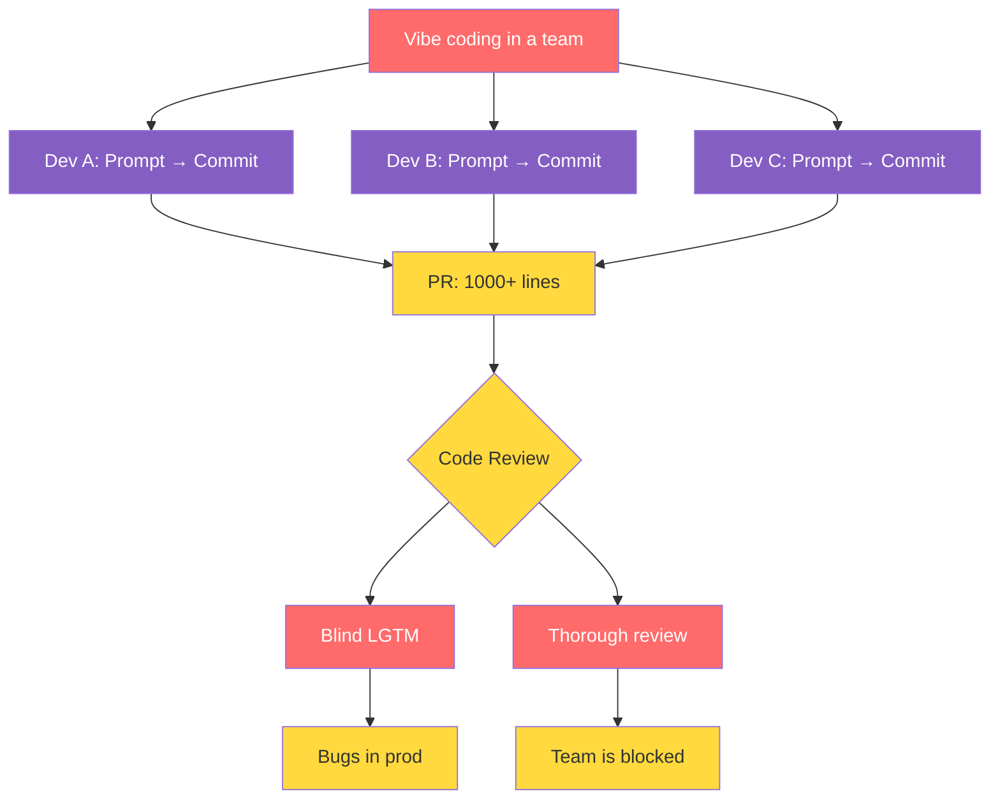
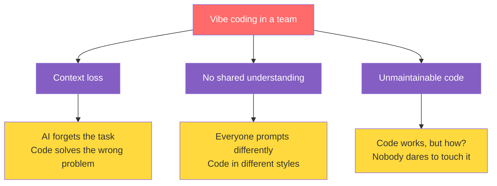
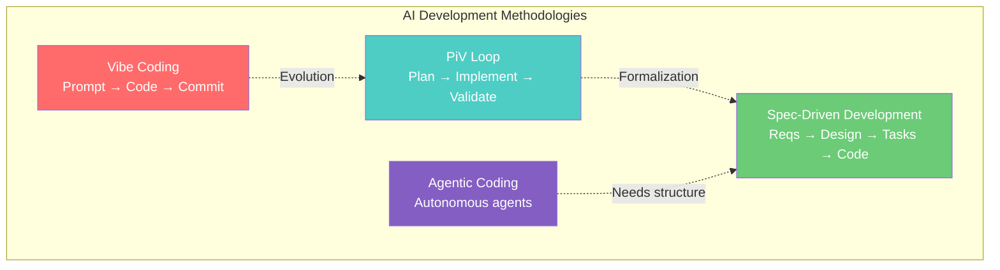
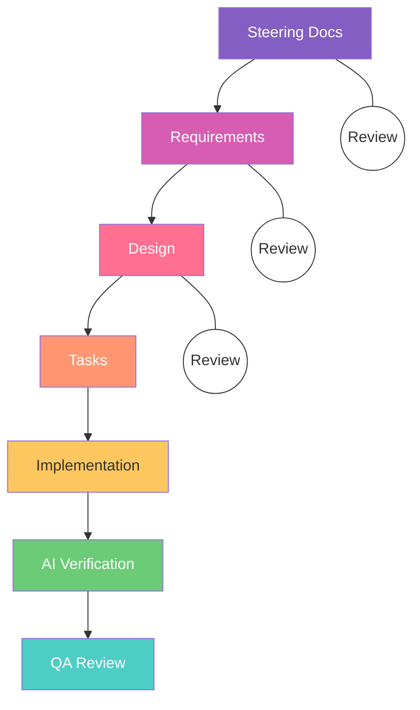
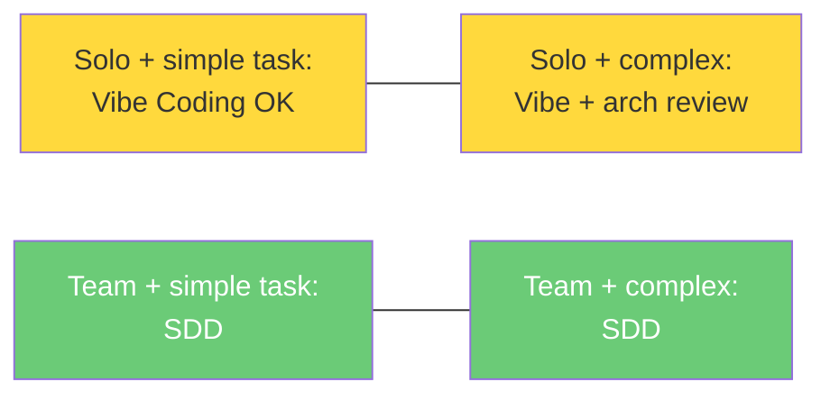

[RU version](README_RU.md)
# Vibe Coding → Spec-Driven: How AI Development Found an Engineering Approach

*AI generates code faster than we can understand it. And that's a problem.*

---

## Vibe Coding: what it is and why everyone does it

The term was coined by Andrej Karpathy. The idea is simple: write a prompt, get code, if it works, commit. Don't dig into details, trust the vibes.

When you work solo, it's fine:
- Ship an MVP in one evening
- Write a one-off script
- Experiment with a new library

But the moment a team gets involved, things fall apart.

---

## What happens when vibe coding hits a team



The trap is that both paths are bad:
- Shallow review → bugs in production
- Deep review → team velocity drops

---

## Three core pains of vibe coding in a team



Sound familiar? A developer goes on vacation, and their AI-generated module becomes a black box for the entire team.

---

## The root cause: we're reviewing the wrong thing

A typical vibe coding workflow:


Verification happens too late. When you're looking at 1000 lines of code, fixing a fundamental error in requirements or architecture is already expensive.

---

## The fix: Shift Left. Verify intent, not code


The difference is fundamental:
- Instead of reviewing 1000 lines of code → review a two-page requirements doc
- Instead of "it works, let's commit" → "it matches the spec, let's deploy"
- Instead of blindly trusting AI → an AI verifier checks code against the plan

---

## Market landscape: ideas and tools

Before jumping into practice, let's look at what approaches and tools exist today. Everything splits into two levels: methodologies (ideas) and tools that implement them.

### Ideas and methodologies



Four key approaches:

- Vibe Coding: go with the vibes. Fast, fun, unpredictable. Great for prototypes, risky for production.
- PiV Loop (Cole Medin): Plan, Implement, Validate. Plan in Markdown first, then implement, then validate. Manual setup, but it builds discipline.
- Spec-Driven Development: PiV formalized into a tool. Requirements, Design, Tasks, all in files, all reviewed by the team before any code is written.
- Agentic Coding: autonomous agents that decompose tasks, write code, run tests on their own. Powerful, but without structure it becomes expensive vibe coding.

### Spec-Driven tools

---

## Spec-Driven tools: comparison

| Feature | Spec-Kit (GitHub) | OpenSpec (Fission AI) | Tessl (ex-Snyk) | CodeConductor | Archon (oTTomator) | Kiro (AWS) |
|---|---|---|---|---|---|---|
| Type | CLI toolkit | CLI framework | Platform + Registry | No-code platform | AI Agent Builder | IDE (VS Code fork) |
| Control level | 🟢 High | 🟡 Medium | 🟢 Maximum | 🔴 Low | 🟢 High | 🟢 High |
| Key advantage | GitHub standards, project "constitution" | Vendor-agnostic, any LLM | Code-as-Artifact, 10k+ ready specs | Idea → app in minutes | RAG indexing, anti-hallucination | Full SDD cycle + AI Verifier in IDE |
| Open Source | ✅ (39k ⭐) | ✅ (4k ⭐) | ❌ | ❌ | ✅ | ❌ |
| Workflow | Specify → Plan → Tasks → Implement | Proposal → Review → Implement → Archive | Spec → Agent → Code → Verify | Prompt → App | Index → Search → Generate | Steering → Reqs → Design → Tasks → Code → Verify |
| Greenfield (0→1) | ✅ Excellent | ⚠️ Possible | ✅ Good | ✅ Excellent | ✅ Good | ✅ Excellent |
| Brownfield (legacy) | ⚠️ Needs adaptation | ✅ Built for this | ✅ Good | ❌ | ✅ Good | ⚠️ Possible |
| Team spec review | ✅ Gated process | ✅ Spec delta + audit | ✅ Specs = source of truth | ❌ No specs | ⚠️ Not the main focus | ✅ Review at every step |
| AI verification code ↔ spec | ❌ | ❌ | ✅ Strict binding | ❌ | ⚠️ Partial (RAG) | ✅ Built-in AI Verifier |
| Hallucination prevention | ⚠️ Via spec context | ⚠️ Via spec context | ✅ Spec Registry (10k+ libs) | ❌ | ✅ RAG + smart indexing | ✅ Steering Docs + context |
| Vendor lock-in | No (agent-agnostic) | No (any LLM) | Yes (Tessl platform) | Yes | No | Partial (AWS/Anthropic) |
| Entry barrier | Medium (CLI + templates) | Low (npm install) | High (new platform) | Very low | High (agent setup) | Low (familiar VS Code) |
| Pricing | Free | Free | Commercial | $49+/mo | Free | Free (50 req) / Pro $20 / Pro+ $40 / Power $200 |
| Best for | Engineering teams, enterprise | Teams with legacy code | Teams with high quality bar | Startups, non-developers | DevOps, AI engineers | Dev teams of any size |

---

## Spec-Driven Development in practice (Kiro)



The team reviews documents at the first three steps. It takes minutes, not hours. Code is generated from an approved plan, the AI verifier checks it against the spec, and QA reviews the final result.

---

## The quality formula

```
Spec (Plan) + Code (Fact) + AI Verifier = Predictable result
```

AI can be used not just as a code generator, but as a QA engineer. One agent writes code, another verifies it against requirements. Essentially, it's automated quality control for logic.

---

## When to use which approach



Vibe coding isn't evil. It's a solid tool for prototypes and pet projects. But for team engineering work, you need a different approach.

---

## Takeaway

Stop reviewing 1000 lines of AI-generated code. Start reviewing specs.

- 🏄 Vibe Coding → pet projects, quick fixes, experiments
- 👷 Spec-Driven Development → teamwork, production, complex systems

AI is already here. The question isn't whether to use it. The question is whether we control the outcome.

---

*How does your team handle AI-generated code? Share in the comments.*
