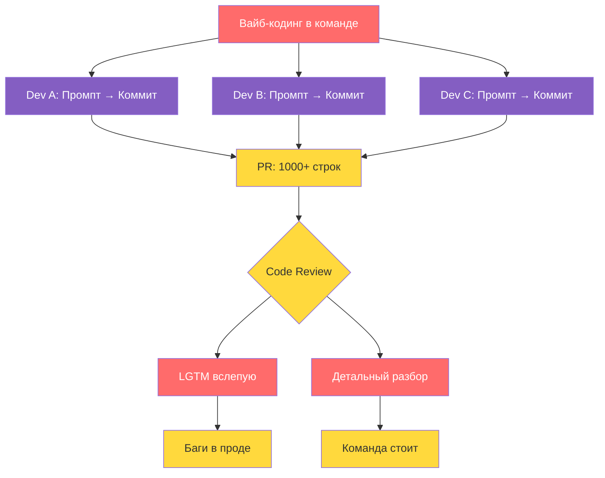
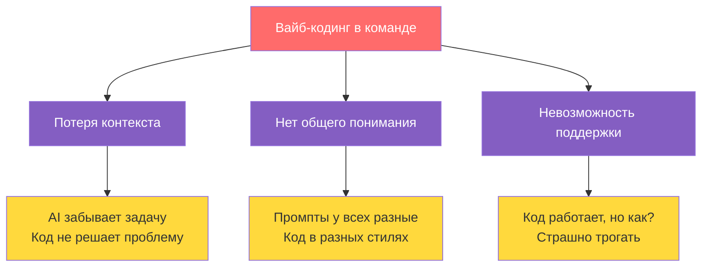
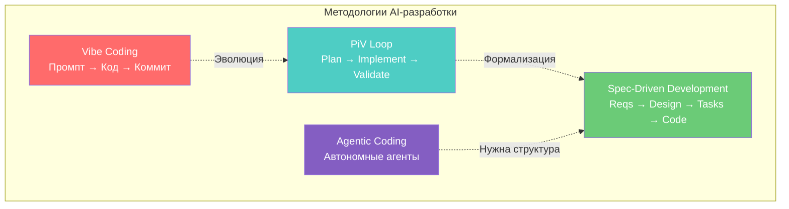
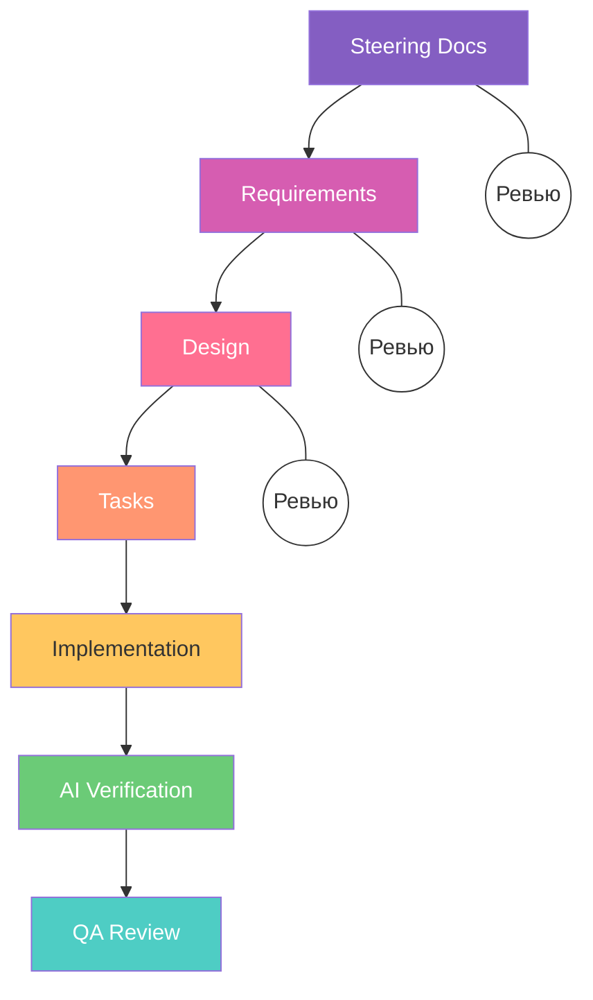
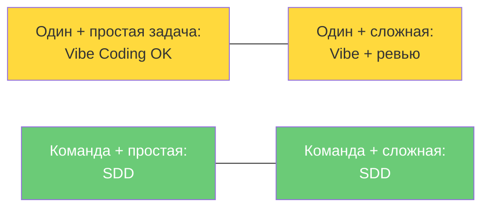

[ENG version](README.md)

# Vibe Coding → Spec-Driven: как AI-разработка нашла инженерный подход

*AI генерирует код быстрее, чем мы успеваем его понять. И это проблема.*

---

## Вайб-кодинг: что это и почему все так делают

Термин придумал Andrej Karpathy. Суть простая: пишешь промпт, получаешь код, если работает, коммитишь. Не вникаешь в детали, доверяешь ощущениям.

Когда работаешь один, это нормально:
- Собрать MVP за вечер
- Написать скрипт на один раз
- Поэкспериментировать с новой библиотекой

Но как только появляется команда, начинается хаос.

---

## Что происходит, когда вайб-кодинг попадает в команду



Ловушка в том, что оба пути плохие:
- Ревьюишь поверхностно → баги в проде
- Ревьюишь детально → команда стоит

---

## Три главные боли вайб-кодинга в команде



Знакомая ситуация? Разработчик уходит в отпуск, и его AI-сгенерированный модуль превращается в чёрный ящик для всей команды.

---

## Корень проблемы: мы ревьюим не то

Типичный процесс с вайб-кодингом:


Верификация происходит слишком поздно. Когда смотришь на 1000 строк кода, исправлять фундаментальную ошибку в требованиях или архитектуре уже дорого.

---

## Решение: Shift Left. Проверяй намерение, а не код


Разница принципиальная:
- Вместо ревью 1000 строк кода → ревью двухстраничного документа с требованиями
- Вместо «работает, коммитим» → «соответствует спеке, деплоим»
- Вместо слепого доверия AI → AI-верификатор проверяет код на соответствие плану

---

## Ландшафт рынка: идеи и инструменты

Прежде чем переходить к практике, стоит разобраться, какие подходы и инструменты сейчас есть на рынке. Всё делится на два уровня: методологии (идеи) и инструменты, которые их реализуют.

### Идеи и методологии



Четыре ключевых подхода:

- Vibe Coding: «на ощущениях». Быстро, весело, непредсказуемо. Хорош для прототипов, опасен для продакшна.
- PiV Loop (Cole Medin): Plan, Implement, Validate. Сначала план в Markdown, потом реализация, потом валидация. Ручная настройка, но дисциплинирует.
- Spec-Driven Development: формализация PiV в инструменте. Requirements, Design, Tasks, всё в файлах, всё ревьюится командой до написания кода.
- Agentic Coding: автономные агенты, которые сами декомпозируют задачу, пишут код, запускают тесты. Мощно, но без структуры превращается в дорогой вайб-кодинг.

### Инструменты Spec-Driven подхода

---

## Spec-Driven инструменты: сводное сравнение

| Характеристика | Spec-Kit (GitHub) | OpenSpec (Fission AI) | Tessl (ex-Snyk) | CodeConductor | Archon (oTTomator) | Kiro (AWS) |
|---|---|---|---|---|---|---|
| Тип | CLI-тулкит | CLI-фреймворк | Платформа + Registry | No-code платформа | AI Agent Builder | IDE (форк VS Code) |
| Уровень контроля | 🟢 Высокий | 🟡 Средний | 🟢 Максимальный | 🔴 Низкий | 🟢 Высокий | 🟢 Высокий |
| Главное преимущество | Стандарты GitHub, «конституция» проекта | Vendor-agnostic, любые LLM | Code-as-Artifact, 10k+ готовых спек | Идея → приложение за минуты | RAG-индексация, anti-hallucination | Полный SDD-цикл + AI Verifier в IDE |
| Open Source | ✅ (39k ⭐) | ✅ (4k ⭐) | ❌ | ❌ | ✅ | ❌ |
| Workflow | Specify → Plan → Tasks → Implement | Proposal → Review → Implement → Archive | Spec → Agent → Code → Verify | Промпт → Приложение | Index → Search → Generate | Steering → Reqs → Design → Tasks → Code → Verify |
| Greenfield (0→1) | ✅ Отлично | ⚠️ Можно | ✅ Хорошо | ✅ Отлично | ✅ Хорошо | ✅ Отлично |
| Brownfield (legacy) | ⚠️ Требует адаптации | ✅ Заточен под это | ✅ Хорошо | ❌ | ✅ Хорошо | ⚠️ Можно |
| Командное ревью спек | ✅ Гейтовый процесс | ✅ Spec delta + аудит | ✅ Спеки = source of truth | ❌ Нет спек | ⚠️ Не основной фокус | ✅ Ревью на каждом шаге |
| AI-верификация код ↔ спека | ❌ | ❌ | ✅ Строгая привязка | ❌ | ⚠️ Частично (RAG) | ✅ Встроенный AI Verifier |
| Предотвращение галлюцинаций | ⚠️ Через контекст спек | ⚠️ Через контекст спек | ✅ Spec Registry (10k+ библиотек) | ❌ | ✅ RAG + умная индексация | ✅ Steering Docs + контекст |
| Привязка к вендору | Нет (agent-agnostic) | Нет (любые LLM) | Да (Tessl платформа) | Да | Нет | Частично (AWS/Anthropic) |
| Порог входа | Средний (CLI + шаблоны) | Низкий (npm install) | Высокий (новая платформа) | Очень низкий | Высокий (настройка агентов) | Низкий (знакомый VS Code) |
| Цена | Бесплатно | Бесплатно | Коммерческая | $49+/мес | Бесплатно | Free (50 req) / Pro $20 / Pro+ $40 / Power $200 |
| Для кого | Инженерные команды, enterprise | Команды с legacy-кодом | Команды с высокими требованиями к качеству | Стартапы, не-разработчики | DevOps, AI-инженеры | Команды разработки любого размера |

---

## Spec-Driven Development на практике (Kiro)



Команда ревьюит документы на первых трёх шагах. Это занимает минуты, не часы. Код генерируется по утверждённому плану, AI-верификатор проверяет соответствие спеке, а результат смотрит QA.

---

## Формула качества

```
Spec (План) + Code (Факт) + AI Verifier = Предсказуемый результат
```

AI можно использовать не только как генератор кода, но и как QA-инженера. Один агент пишет код, другой проверяет его соответствие требованиям. По сути, это автоматический контроль качества логики.

---

## Когда какой подход использовать



Вайб-кодинг не зло. Это рабочий инструмент для прототипов и пет-проектов. Но для командной инженерной работы нужен другой подход.

---

## Итог

Перестаньте ревьюить 1000 строк AI-сгенерированного кода. Начните ревьюить спеки.

- 🏄 Vibe Coding → пет-проекты, быстрые фиксы, эксперименты
- 👷 Spec-Driven Development → командная работа, продакшн, сложные системы

AI уже здесь. Вопрос не в том, использовать его или нет. Вопрос в том, контролируем ли мы результат.

---

*Как в вашей команде устроен процесс работы с AI-сгенерированным кодом? Делитесь в комментариях.*
