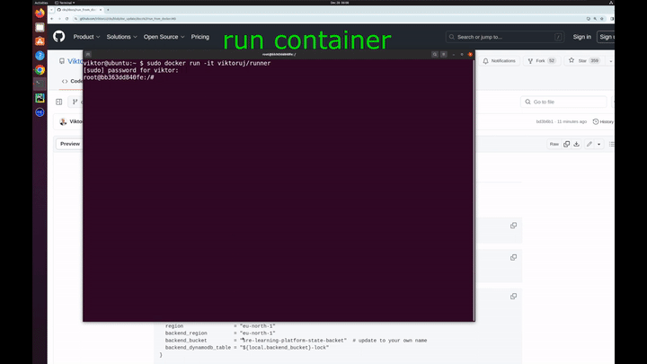

## Run platform via docker

- Change **backend_bucket** (**region** , **backend_region** optional) in [terraform/environments/terragrunt.hcl](https://github.com/ViktorUJ/cks/blob/master/terraform/environments/terragrunt.hcl#L4):

## Command

Every command should be run from the project's root directory.

### CMDB

- ``make cmdb_get_env_all`` - get a list of all resources in CMDB
- ``USER_ID='myuser' ENV_ID='01' make cmdb_get_user_env_data`` - show all created resources of user **myuser** in environment **01**
- ``USER_ID='myuser' ENV_ID='01' make cmdb_get_user_env_lock`` - show all lock resources of user **myuser** in environment **01**
- ``USER_ID='myuser' ENV_ID='01' make cmdb_get_user_env_lock`` - show all lock resources of user **myuser** in environment **01**
- ``USER_ID='myuser' make cmdb_get_user_env_lock`` - show all lock resources of user **myuser** in **all** environment
- ``USER_ID='myuser' make cmdb_get_user_env_data`` - show all data resources of user **myuser** in **all** environment
- ``CMDB_ITEM='CMDB_data_myuser_02_k8s_cluster1' make cmdb_get_item`` - getting detailed information about **CMDB_data_myuser_02_k8s_cluster1** resource.

### CKA

#### CKA task

- ``TASK=01 make run_cka_task`` - create cka lab number 01
- ``TASK=01 make delete_cka_task`` - delete cka hands-on labs
- ``TASK=01 make run_cka_task_clean`` - run cka_task with clean terragrunt cache for cka_task
- ``make output_cka_task`` - show **outputs** from **cka_task**

#### CKA mock

- ``TASK=01 make run_cka_mock`` - create mock CKA exam number 1
- ``make delete_cka_mock`` - delete mock CKA exam
- ``TASK=01 make run_cka_mock_clean`` - create mock CKA exam with clean terragrunt cache
- ``make output_cka_mock`` - show **outputs** from **cka_mock**

### CKAD

#### CKAD mock

- ``TASK=01 make run_ckad_mock`` - create mock CKAD exam number 01
- ``make delete_ckad_mock`` - delete mock CKAD exam
- ``TASK=01 make run_ckad_mock_clean`` - create mock CKAD exam number 01 with clean terragrunt cache
- ``make output_ckad_mock`` - show **outputs** from **ckad_mock**

### CKS

#### CKS task

- ``TASK=10 make run_cks_task`` - create cks lab number 10
- ``TASK=10 make delete_cks_task`` - delete cks hands-on labs
- ``TASK=10 make run_cks_task_clean`` - run cks_task with clean terragrunt cache for cks_task
- ``make output_cks_task`` - show **outputs** from **cks_task**

#### CKS mock

- ``TASK=01 make run_cks_mock`` - create mock CKS exam number 01
- ``make delete_cks_mock`` - delete mock CKS exam
- ``TASK=01 make run_cks_mock_clean`` - create mock CKS exam number 01 with clean terragrunt cache
- ``make output_cks_mock`` - show **outputs** from  **cks_mock**

### LFCS

#### lfcs mock

- ``TASK=01 make run_lfcs_mock`` - create mock LFCS exam number 01
- ``make delete_lfcs_mock`` - delete mock LFCS exam
- ``TASK=01 make delete_lfcs_mock_clean`` - delete mock LFCS exam number 01 with clean terragrunt cache
- ``make output_lfcs_mock`` - show **outputs** from **lfcs_mock**

### HR

- ``TASK=01 make run_hr_mock`` - create mock hr exam number 01
- ``make delete_hr_mock`` - delete mock hr exam
- ``TASK=01 make run_hr_mock_clean`` - create mock CKS exam number 01 with clean terragrunt cache
- ``make output_hr_mock`` - show **outputs** from **hr_mock**

### EKS

- ``TASK={lab_number} make run_eks_task`` create hands-on lab
- ``make delete_eks_task`` delete eks lab cluster

### DEV

- ``make lint`` run linter on the project

## Usage scenarios

### CKA hands-on lab

- choose [a hands-on lab](./CKA/Labs/01.md) number
- create cka lab cluster ``TASK={lab_number} make run_cka_task``
- find `{master_external_ip}` in terraform output
- log in to master node via ssh ``ssh ubuntu@{master_external_ip} -i {key}``
- check init logs `` tail -f /var/log/cloud-init-output.log ``
- read lab descriptions in ``{lab_number}/README.MD``
- check solution in ``{lab_number}/SOLUTION.MD``
- delete cka lab cluster ``make delete_cka_task``
- clean cka lab cluster ``.terraform`` folder ``make clean_cka_task``

### Mock CKA exam

[Video instruction for launching **CKA mock exam**](https://www.youtube.com/watch?v=P-YYX4CTWIg)

- choose [a mock exam](./CKA/Mock%20exams/01.md) number
- change instance type from ``spot`` to ``ondemand`` in ``{mock_number}/env.hcl`` if you need
- create mock CKA exam ``TASK={mock_number} make run_cka_mock``
- find ``worker_pc_ip`` in ``terraform output``
- connect to ``worker_pc_ip`` with your ssh key and user ``ubuntu``
- open questions list ``{mock_number}/README.MD`` and do tasks
- use ``ssh {kubernetes_nodename}`` from work pc to connect to node
- run ``time_left`` on work pc to check time
- run ``check_result`` on work pc to check result
- delete mock CKA exam `make delete_cka_mock`
- find exam solutions in ``{mock_number}/worker/files/solutions)`` and * [Video](https://youtu.be/IZsqAPpbBxM) for [mock 01](./CKA/Mock%20exams/01.md) .
- find exam tests in ``{mock_number}/worker/files/tests.bats)``

### CKS hands-on lab

- choose [CKS lab](./CKS/Labs/01.md) number
- change **ami_id** in ``{lab_number}/scripts/terragrunt.hcl`` if you changed **region**
- create cka lab cluster ``TASK={lab_number} make run_cks_task``
- find `{master_external_ip}` in terraform output
- log in to master node via ssh ``ssh ubuntu@{master_external_ip} -i {key}``
- check init logs `` tail -f /var/log/cloud-init-output.log ``
- read lab descriptions in ``{lab_number}/README.MD``
- check solution in ``{lab_number}/SOLUTION.MD``
- delete cks lab cluster ``make delete_cks_task``
- clean cks lab cluster ``.terraform`` folder ``make clean_cks_task``

### Mock CKS exam

[Video instruction for launching **CKS mock exam**](https://youtu.be/_GbsBOMaJ9Q)

- choose [a mock exam](./CKS/Mock%20exams/01.md) number
- change **ubuntu_version** in ``{mock_number}/env.hcl`` if you need
- change instance type from ``spot`` to ``ondemand`` in ``{mock_number}/env.hcl`` if you need
- create mock CKS exam ``TASK={mock_number} make run_cks_mock`` or ``TASK={mock_number} make run_cks_mock_clean`` if you'd like to run with **clean** terragrunt cache
- find ``worker_pc_ip`` in ``terraform output``
- connect to ``worker_pc_ip`` with your ssh key and user ``ubuntu``
- open questions list ``{mock_number}/README.MD`` and do tasks
- use ``ssh {kubernetes_nodename}`` from work pc to connect to node
- run ``time_left`` on work pc to check time
- run ``check_result`` on work pc to check result
- delete mock CKS exam `make delete_cks_mock`
- find exam solutions in ``{mock_number}/worker/files/solutions`` [Mock 1 solutions](./CKS/Mock%20exams/Solutions/01.md) and [video](https://youtu.be/I8CPwcGbrG8)
- find exam tests in ``{mock_number}/worker/files/tests.bats``

### Mock CKAD exam

[Video instruction for launching **CKAD mock exam**](https://youtu.be/7X4Y9QhbTsk)

- choose [a mock exam](./CKAD/Mock%20exams/01.md) number
- change **ubuntu_version** in ``{mock_number}/env.hcl`` if you need
- change instance type from ``spot`` to ``ondemand`` in ``{mock_number}/env.hcl`` if you need
- create mock CKAD exam ``TASK={mock_number} make run_ckad_mock`` or ``TASK={mock_number} make run_ckad_mock_clean`` if you'd like to run with **clean** terragrunt cache
- find ``worker_pc_ip`` in ``terraform output``
- connect to ``worker_pc_ip`` with your ssh key and user ``ubuntu``
- open questions list ``{mock_number}/README.MD`` and do tasks
- use ``ssh {kubernetes_nodename}`` from work pc to connect to node
- run ``time_left`` on work pc to check time
- run ``check_result`` on work pc to check result
- delete mock CKAD exam `make delete_ckad_mock`
- find exam solutions in ``{mock_number}/worker/files/solutions`` mock 1 solutions and [video](https://youtu.be/yQK7Ca8d-yw)
- find exam tests in ``{mock_number}/worker/files/tests.bats``

### Mock HR exam

[Video instruction for launching **HR mock exam**](https://youtu.be/4CTC1jl8lxE)

https://github.com/ViktorUJ/cks/tree/master/tasks/hr/mock/01

- choose mock number [tasks/hr/mock] (https://github.com/ViktorUJ/cks/tree/master/tasks/hr/mock/01)
- change **ubuntu_version** in ``{mock_number}/env.hcl`` if you need
- change instance type from ``spot`` to ``ondemand`` in ``{mock_number}/env.hcl`` if you need
- create mock CKS exam ``TASK={mock_number} make run_hr_mock`` or ``TASK={mock_number} make run_hr_mock_clean`` if you'd like to run with **clean** terragrunt cache
- find ``worker_pc_ip`` in ``terraform output``
- connect to ``worker_pc_ip`` with your ssh key and user ``ubuntu``
- open questions list ``{mock_number}/README.MD`` and do tasks
- use ``ssh {kubernetes_nodename}`` from work pc to connect to node
- run ``time_left`` on work pc to check time
- run ``check_result`` on work pc to check result
- delete mock CKA exam `make delete_hr_mock`
- find exam solutions in ``{mock_number}/worker/files/solutions`` and [video](https://youtu.be/4CTC1jl8lxE)
- find exam tests in ``{mock_number}/worker/files/tests.bats``

### EKS hands-on lab

- choose [labs](https://github.com/ViktorUJ/cks/tree/master/tasks/eks/labs/) number
- create hands-on lab `` TASK={lab_number} make run_eks_task ``
- find ``worker_pc_ip`` in ``terraform output``
- log in to worker_pc node via ssh ``ssh ubuntu@{worker_pc_ip} -i {key}``
- read lab descriptions in ``{lab_number}/README.MD``
- check solution in ``{lab_number}/SOLUTION.MD``
- delete eks lab cluster ``make delete_eks_task``

## Multiple users environments

### Why is it needed ?

- to create many identical independent environments. e.g. for a group of students.

- to create several independent environments for one student with different tasks.

To create an independent environment you need to set additional variables USER_ID='myuser' ENV_ID='01' before running the make command.

[for example](https://youtu.be/3H0RMLXGmgg):

- `USER_ID='myuser' ENV_ID='3' TASK=01 make run_ckad_mock` - create environment **3** for user **myuser** with task set **01** ckad mock
- `USER_ID='myuser' ENV_ID='3' TASK=01 make delete_ckad_mock` -  delete environment **3** for user **myuser** with job set **01** ckad mock

- ``make cmdb_get_env_all`` - get a list of all resources in CMDB
- ``USER_ID='myuser' ENV_ID='01' make cmdb_get_user_env_data`` - show all created resources of user **myuser** in environment **01**
- ``USER_ID='myuser' ENV_ID='01' make cmdb_get_user_env_lock`` - show all lock resources of user **myuser** in environment **01**
- ``USER_ID='myuser' ENV_ID='01' make cmdb_get_user_env_lock`` - show all lock resources of user **myuser** in environment **01**
- ``USER_ID='myuser' make cmdb_get_user_env_lock`` - show all lock resources of user **myuser** in **all** environment
- ``USER_ID='myuser' make cmdb_get_user_env_data`` - show all data resources of user **myuser** in **all** environment
- ``CMDB_ITEM='CMDB_data_myuser_01_k8s_cluster1' make cmdb_get_item`` - getting detailed information about **CMDB_data_myuser_01_k8s_cluster1** resource.