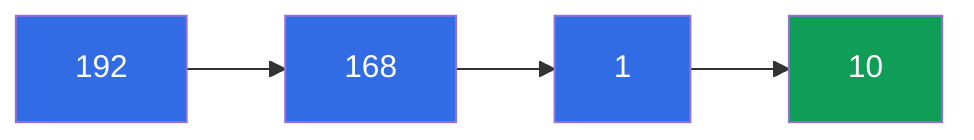
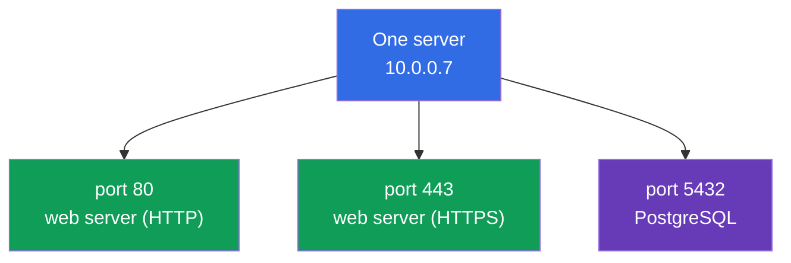
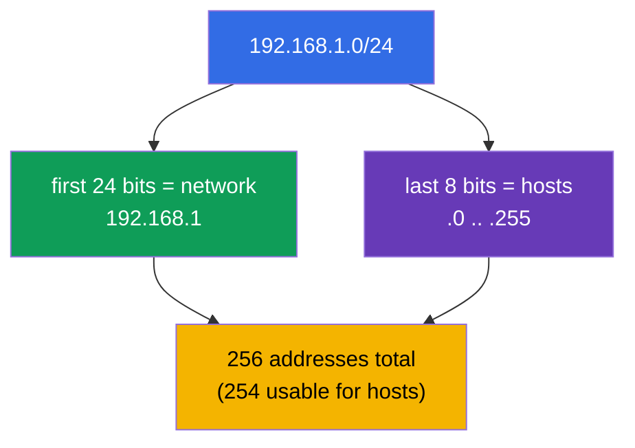
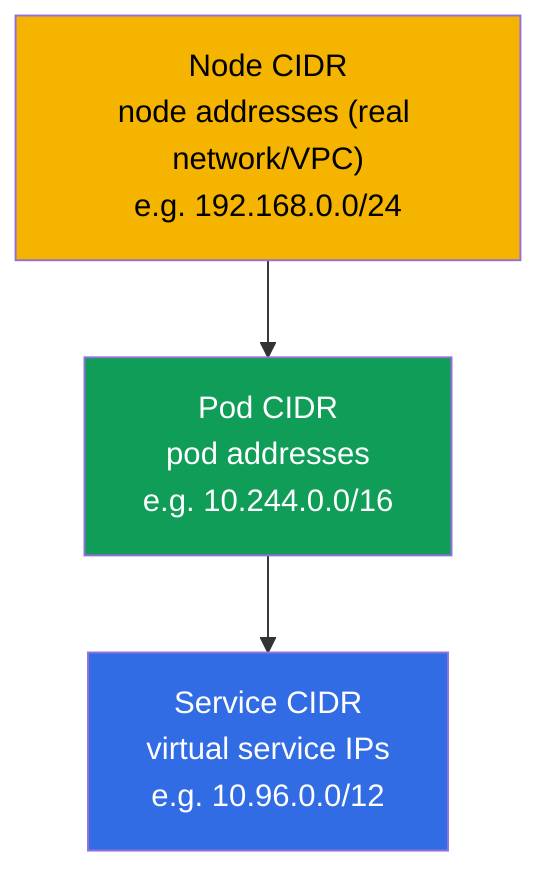
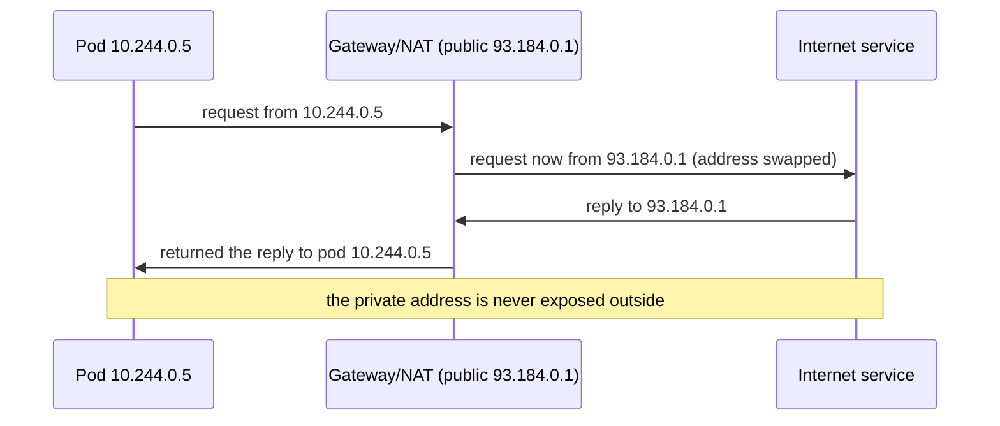

[Русская версия](ru.md) · [Versión en español](es.md) · [Version française](fr.md) · [Deutsche Version](de.md) · [ქართული ვერსია](ge.md)

# Chapter 0.1. Networking from scratch: IP, ports, CIDR, and NAT

> **Who this chapter is for.** This is a Part 0 chapter - the "zero" foundation for
> those who come to Kubernetes without a solid networking background. If you can
> confidently explain what an IP address, a subnet mask, the notation `10.0.0.0/16`,
> a port, and NAT are, feel free to skip it and start with Chapter 1. But if the
> words "CIDR" or "private network" give you pause, spend half an hour here: almost
> the entire Services & Networking domain of both exams and all of network
> troubleshooting rest on these concepts. We'll explain everything from scratch,
> without academic fluff, and tie it right away to where it shows up in Kubernetes.

## 0.1.1. Why a networking beginner needs this in a Kubernetes course

Kubernetes is first and foremost a distributed network: pods get IPs, services live
on virtual IPs, traffic flows between nodes, and `Pod CIDR` and `Service CIDR` are
set when the cluster is installed. When in Chapter 30 you see `--pod-network-cidr=
10.244.0.0/16`, and in Chapter 7 a `ClusterIP` from the `10.96.0.0/12` range, all of
it should read as easily as plain text. Let's go through the building blocks in order.

## 0.1.2. IP address: your address on the network

An **IP address** is the numeric address of a device on a network, like the postal
address of a house. For now we'll talk about the most common variant - **IPv4**: four
numbers from 0 to 255 separated by dots, for example `192.168.1.10`. Each of the four
numbers is one **octet** (8 bits), and the whole address is 32 bits.

It's important from the very start to distinguish two kinds of addresses:

| Kind | Ranges | Where it lives | Example |
|------|--------|----------------|---------|
| **Private** | `10.0.0.0/8`, `172.16.0.0/12`, `192.168.0.0/16` | inside your network, not visible on the internet | `10.244.0.5` (pod) |
| **Public** | everything else | visible on the internet directly | `93.184.216.34` |

Kubernetes pods and services almost always live in **private** ranges. That's exactly
why a pod with the address `10.244.0.5` is not reachable from the internet directly -
it needs a Service, Ingress, or NAT (more on that below and in Chapter 7).

## 0.1.3. Port: which application on the device

An IP address points to a device, but dozens of programs run on a single device. To
tell which program traffic is addressed to, a **port** is used - a number from 0 to
65535. The "IP + port" pair unambiguously points to a specific application.

A few ports are worth knowing by heart - they come up constantly in the course:

| Port | What usually listens |
|------|----------------------|
| **80** | HTTP (web without encryption) |
| **443** | HTTPS (web with TLS, Chapter 0.3) |
| **53** | DNS (Chapter 0.2) |
| **22** | SSH (we log into nodes in the labs) |
| **6443** | kube-apiserver (the heart of the control plane) |
| **2379/2380** | etcd (the cluster store, Chapter 37) |
| **10250** | kubelet |

When in a pod manifest you write `containerPort: 8080`, and in a Service `targetPort:
8080` and `port: 80`, you are working with exactly these concepts: which port the
application listens on and which port traffic arrives at.

## 0.1.4. Subnet mask and CIDR notation

Having an address isn't enough - you need to understand the **network boundaries**:
which addresses are "local" (in the same LAN, reachable directly) and which are
"foreign" (behind a router). This is defined by the **subnet mask**.

The idea is simple: the address is split into two parts - the **network address**
(shared by all neighbors) and the **host address** (unique within the network). The
mask says how many of the leading bits are the network.

Masks used to be written as `255.255.255.0`. Today the compact **CIDR** notation
(Classless Inter-Domain Routing) is used: after the address you put `/N`, where `N`
is the number of bits allocated to the network.

Read `/N` this way: **the larger N, the smaller the network** (fewer addresses, but
more bits fixed for the network).

| CIDR | Network bits | Addresses in the network | Typical use |
|------|--------------|--------------------------|-------------|
| `/8` | 8 | ~16.7 million | huge private block `10.0.0.0/8` |
| `/16` | 16 | 65,536 | VPC network, cluster `Pod CIDR` |
| `/24` | 24 | 256 | ordinary subnet/segment |
| `/32` | 32 | 1 | exactly one address (a single host) |

Three numbers are simply worth memorizing: `/24` = 256 addresses, `/16` = 65,536,
`/8` = ~16 million. That's enough to eyeball network sizes in a cluster.

## 0.1.5. Where CIDR shows up in Kubernetes

This isn't abstract - in Kubernetes there are three different CIDR spaces, and you
must not confuse them (details in Chapter 30):

- **Node CIDR** - which network the servers (nodes) themselves are in.
- **Pod CIDR** (`--pod-network-cidr`) - the range pods get their addresses from.
- **Service CIDR** (`--service-cidr`) - the range the virtual `ClusterIP`s of
  services are handed out from.

A rule that saves you pain: **these three ranges must not overlap** - neither with
each other nor with the corporate network. Overlapping CIDRs are the classic cause of
"pods can't see each other" and "the cluster won't come up".

## 0.1.6. NAT: how a private address gets out

Private addresses (`10.x`, `192.168.x`) aren't routed on the internet. So how does a
pod with the address `10.244.0.5` pull an image from the internet? Through **NAT
(Network Address Translation)** - address substitution on the router: outbound
traffic "pretends" to come from the gateway's public address, and the replies come
back to the right sender.

The key link to the Kubernetes network model (Chapter 30): **inside** the cluster
pods communicate **without NAT** (a flat network, each one sees the other's real IP),
while **outbound** traffic goes **through NAT**. This rule is easy to remember: "local
- directly, foreign - through the gateway".

## 0.1.7. How this is applied in production

- **Plan CIDR up front, not later.** The Pod/Service/Node ranges are agreed with the
  company network before the cluster is created. Too small a `Pod CIDR` hits the
  ceiling on the number of pods as you grow - painful to redo.
- **Private clusters.** Nodes and pods sit in private subnets, go out through a NAT
  gateway, and inbound traffic is accepted by a load balancer/Ingress. This is the
  security standard in the cloud.
- **Ports and firewall.** Specific ports must be open between nodes (6443,
  2379/2380, 10250, and so on). "The cluster didn't come up" is often = a closed port
  on the firewall/Security Group.
- **Diagnosis by the IP+port pair.** During an incident, an engineer first checks: the
  right IP, the right port, the right subnet, no CIDR overlap. This is the language in
  which network problems are described.

## 0.1.8. Mini-glossary

- **IP address** - the numeric address of a device on a network (IPv4: four octets,
  32 bits).
- **Octet** - one of the four numbers of an IPv4 address (8 bits, 0-255).
- **Private / public address** - an address inside your own network / one visible on
  the internet.
- **Port** - a number 0-65535 identifying an application on a device.
- **Subnet mask** - what in the address is the network and what is the host.
- **CIDR** - the notation `address/N`, where `N` is the number of network bits; larger
  N - smaller network.
- **Network address / host address** - the part shared by neighbors / the part unique
  to a device.
- **NAT** - address substitution at the gateway so private traffic can get out.
- **Pod / Service / Node CIDR** - ranges of pod addresses / virtual service IPs /
  nodes; must not overlap.

## 0.1.9. Chapter summary

- An IP address (IPv4) is 32 bits, four octets; it can be private (inside a network)
  or public (on the internet). Pods and services live in private ranges.
- A port (0-65535) identifies an application; the "IP + port" pair is a specific
  service.
- CIDR notation `/N` sets the network boundary: the larger N, the fewer addresses
  (`/24` = 256, `/16` = 65,536, `/8` = ~16 million).
- In Kubernetes there are three non-overlapping CIDRs: Node, Pod, Service. Overlap is
  a frequent cause of network failures.
- NAT substitutes addresses at the gateway so private traffic can get out; inside the
  cluster pods communicate without NAT (a flat network, Chapter 30).

## 0.1.10. How this helps: on the exam and in real work

**On the exam.** There are no direct "calculate the mask" tasks, but without this
foundation you won't understand cluster installation (Chapter 35: `--pod-network-cidr`),
the network model (Chapter 30), and network troubleshooting (30% of CKA). Being able
to read `10.244.0.0/16` and `10.96.0.0/12` and not confuse Pod/Service CIDR saves time
in every networking task.

**In real work.** Planning the cluster's address space, configuring firewalls and NAT,
investigating "the pod couldn't reach the service" incidents - all of this is a
platform engineer's daily work, and all of it speaks the language of IPs, ports, and
CIDR.

## 0.1.11. Self-check questions

1. How many bits make up an IPv4 address, and what is an octet?
2. How does a private address differ from a public one? In which range do pods live?
3. What does the notation `10.244.0.0/16` mean, and roughly how many addresses are in
   it?
4. Why does a larger `N` in `/N` give a smaller network?
5. Name the three CIDR spaces of Kubernetes. Why must they not overlap?
6. What does NAT do, and why do pods inside the cluster communicate without NAT?

## Practice

There's no separate lab for Part 0 - it's a preparatory foundation. Practice begins
when, in Chapter 1, you bring up a training cluster, and you'll drill networking
topics in the networking labs. Next up - how names turn into addresses.

---
[Contents](../README.md) · [Chapter 0.2](../00-2-dns/README.md)
