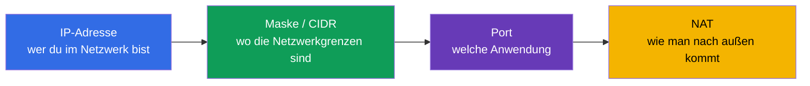
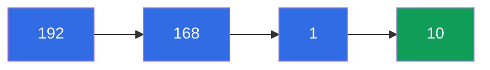
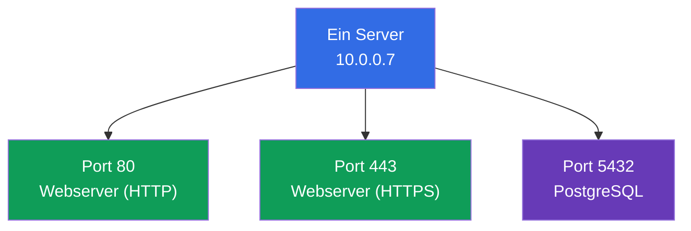
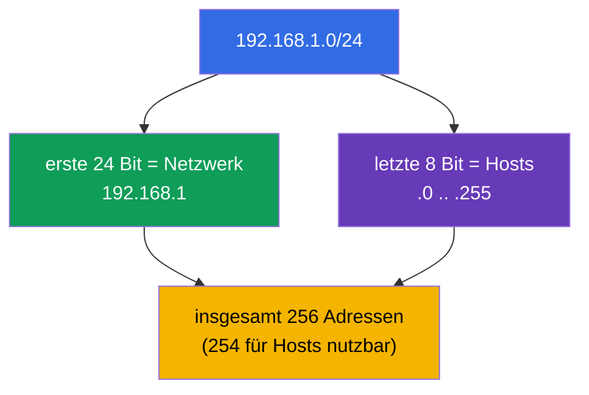
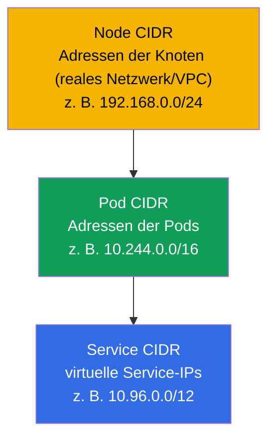
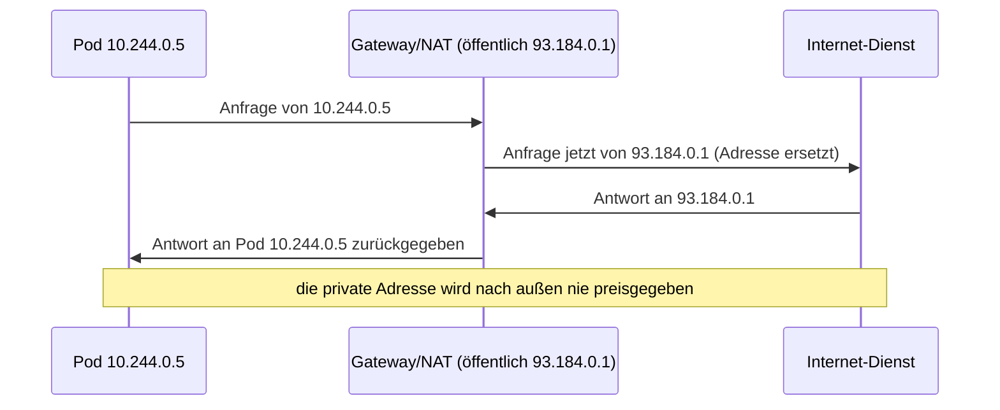

[Русская версия](ru.md) · [Eng version](README.md) · [Versión en español](es.md) · [Version française](fr.md) · [ქართული ვერსია](ge.md)

# Kapitel 0.1. Netzwerke von Grund auf: IP, Ports, CIDR und NAT

> **Für wen dieses Kapitel ist.** Dies ist ein Kapitel aus Teil 0 - dem "Null"-Fundament
> für alle, die ohne solide Netzwerkgrundlagen zu Kubernetes kommen. Wenn Sie sicher
> erklären können, was eine IP-Adresse, eine Subnetzmaske, die Notation `10.0.0.0/16`,
> ein Port und NAT sind, überspringen Sie es ruhig und beginnen Sie mit Kapitel 1.
> Wenn Ihnen aber die Wörter „CIDR“ oder „privates Netzwerk“ Schwierigkeiten bereiten,
> investieren Sie hier eine halbe Stunde: fast die gesamte Domäne Services & Networking
> beider Prüfungen und das gesamte Netzwerk-Troubleshooting bauen auf diesen Begriffen
> auf. Wir erklären alles von Grund auf, ohne akademisches Beiwerk, und verknüpfen es
> sofort damit, wo es in Kubernetes auftaucht.

## 0.1.1. Warum ein Netzwerk-Neuling das in einem Kubernetes-Kurs braucht

Kubernetes ist in erster Linie ein verteiltes Netzwerk: Pods erhalten IPs, Services
leben auf virtuellen IPs, der Verkehr fließt zwischen den Knoten, und `Pod CIDR` und
`Service CIDR` werden bei der Cluster-Installation festgelegt. Wenn Sie in Kapitel 30
`--pod-network-cidr=10.244.0.0/16` sehen und in Kapitel 7 eine `ClusterIP` aus dem
Bereich `10.96.0.0/12`, sollte sich all das so leicht lesen wie ein normaler Text.
Gehen wir die Bausteine der Reihe nach durch.

## 0.1.2. IP-Adresse: deine Adresse im Netzwerk

Eine **IP-Adresse** ist die numerische Adresse eines Geräts in einem Netzwerk, wie die
Postanschrift eines Hauses. Vorerst sprechen wir über die verbreitetste Variante -
**IPv4**: vier Zahlen von 0 bis 255, durch Punkte getrennt, zum Beispiel
`192.168.1.10`. Jede der vier Zahlen ist ein **Oktett** (8 Bit), und die gesamte
Adresse umfasst 32 Bit.

Es ist von Anfang an wichtig, zwei Arten von Adressen zu unterscheiden:

| Art | Bereiche | Wo sie lebt | Beispiel |
|-----|----------|-------------|----------|
| **Privat** | `10.0.0.0/8`, `172.16.0.0/12`, `192.168.0.0/16` | innerhalb deines Netzwerks, im Internet nicht sichtbar | `10.244.0.5` (Pod) |
| **Öffentlich** | alles Übrige | direkt im Internet sichtbar | `93.184.216.34` |

Kubernetes-Pods und -Services leben fast immer in **privaten** Bereichen. Genau deshalb
ist ein Pod mit der Adresse `10.244.0.5` nicht direkt aus dem Internet erreichbar - er
braucht einen Service, ein Ingress oder NAT (mehr dazu unten und in Kapitel 7).

## 0.1.3. Port: welche Anwendung auf dem Gerät

Eine IP-Adresse verweist auf ein Gerät, aber auf einem einzigen Gerät laufen Dutzende
Programme. Um zu erkennen, an welches Programm der Verkehr gerichtet ist, dient ein
**Port** - eine Zahl von 0 bis 65535. Das Paar „IP + Port“ verweist eindeutig auf eine
konkrete Anwendung.

Ein paar Ports sollte man auswendig kennen - sie kommen im Kurs ständig vor:

| Port | Was üblicherweise lauscht |
|------|---------------------------|
| **80** | HTTP (Web ohne Verschlüsselung) |
| **443** | HTTPS (Web mit TLS, Kapitel 0.3) |
| **53** | DNS (Kapitel 0.2) |
| **22** | SSH (wir melden uns in den Übungen an den Knoten an) |
| **6443** | kube-apiserver (das Herz des Control Plane) |
| **2379/2380** | etcd (der Cluster-Speicher, Kapitel 37) |
| **10250** | kubelet |

Wenn Sie im Manifest eines Pods `containerPort: 8080` schreiben und in einem Service
`targetPort: 8080` und `port: 80`, arbeiten Sie genau mit diesen Begriffen: auf welchem
Port die Anwendung lauscht und an welchem Port der Verkehr ankommt.

## 0.1.4. Subnetzmaske und CIDR-Notation

Eine Adresse zu haben reicht nicht - man muss die **Netzwerkgrenzen** verstehen: welche
Adressen „eigen“ sind (im selben lokalen Netzwerk, direkt erreichbar) und welche
„fremd“ sind (hinter einem Router). Das legt die **Subnetzmaske** fest.

Die Idee ist einfach: Die Adresse wird in zwei Teile geteilt - die **Netzwerkadresse**
(allen Nachbarn gemeinsam) und die **Host-Adresse** (eindeutig innerhalb des
Netzwerks). Die Maske gibt an, wie viele der ersten Bits das Netzwerk sind.

Früher schrieb man die Maske als `255.255.255.0`. Heute verwendet man die kompakte
**CIDR**-Notation (Classless Inter-Domain Routing): nach der Adresse setzt man `/N`,
wobei `N` die Anzahl der für das Netzwerk reservierten Bits ist.

`/N` liest man so: **je größer N, desto kleiner das Netzwerk** (weniger Adressen, aber
mehr Bits für das Netzwerk festgelegt).

| CIDR | Netzwerk-Bits | Adressen im Netzwerk | Typische Verwendung |
|------|---------------|----------------------|---------------------|
| `/8` | 8 | ~16,7 Mio. | riesiger privater Block `10.0.0.0/8` |
| `/16` | 16 | 65 536 | VPC-Netzwerk, `Pod CIDR` des Clusters |
| `/24` | 24 | 256 | übliches Subnetz/Segment |
| `/32` | 32 | 1 | genau eine Adresse (ein einzelner Host) |

Drei Zahlen sollte man sich einfach merken: `/24` = 256 Adressen, `/16` = 65 536, `/8`
= ~16 Mio. Das genügt, um Netzwerkgrößen im Cluster „über den Daumen“ einzuschätzen.

## 0.1.5. Wo CIDR in Kubernetes auftaucht

Das ist keine Abstraktion - in Kubernetes gibt es drei verschiedene CIDR-Räume, und man
darf sie nicht verwechseln (ausführlich in Kapitel 30):

- **Node CIDR** - in welchem Netzwerk sich die Server (Knoten) selbst befinden.
- **Pod CIDR** (`--pod-network-cidr`) - aus welchem Bereich die Pods ihre Adressen
  erhalten.
- **Service CIDR** (`--service-cidr`) - aus welchem Bereich die virtuellen `ClusterIP`s
  der Services vergeben werden.

Eine Regel, die Schmerzen erspart: **diese drei Bereiche dürfen sich nicht
überschneiden** - weder untereinander noch mit dem Unternehmensnetzwerk. Sich
überschneidende CIDRs sind die klassische Ursache für „Pods sehen einander nicht“ und
„der Cluster startet nicht“.

## 0.1.6. NAT: wie eine private Adresse nach außen gelangt

Private Adressen (`10.x`, `192.168.x`) werden im Internet nicht geroutet. Wie lädt dann
ein Pod mit der Adresse `10.244.0.5` ein Image aus dem Internet? Über **NAT (Network
Address Translation)** - die Adressersetzung am Router: der ausgehende Verkehr „gibt
sich als“ vom öffentlichen Adressraum des Gateways kommend aus, und die Antworten kehren
zum richtigen Absender zurück.

Die zentrale Verbindung zum Netzwerkmodell von Kubernetes (Kapitel 30): **innerhalb**
des Clusters kommunizieren Pods **ohne NAT** (flaches Netzwerk, jeder sieht die reale IP
des anderen), während **nach außen** der Verkehr **über NAT** geht. Diese Regel lässt
sich leicht merken: „die eigenen - direkt, die fremden - über das Gateway“.

## 0.1.7. Wie das in der Produktion angewendet wird

- **CIDR am Anfang planen, nicht später.** Die Bereiche Pod/Service/Node werden vor der
  Cluster-Erstellung mit dem Unternehmensnetzwerk abgestimmt. Ein zu kleiner `Pod CIDR`
  stößt beim Wachstum an die Obergrenze der Pod-Anzahl - das Nachbessern tut weh.
- **Private Cluster.** Knoten und Pods sitzen in privaten Subnetzen, gehen über ein
  NAT-Gateway nach außen, und der eingehende Verkehr wird von einem
  Load-Balancer/Ingress angenommen. Das ist der Sicherheitsstandard in der Cloud.
- **Ports und Firewall.** Zwischen den Knoten müssen bestimmte Ports offen sein (6443,
  2379/2380, 10250 usw.). „Der Cluster ist nicht gestartet“ = oft ein geschlossener
  Port an der Firewall/Security Group.
- **Diagnose über das Paar IP+Port.** Bei einem Vorfall prüft der Ingenieur zuerst: die
  richtige IP, der richtige Port, das richtige Subnetz, keine CIDR-Überschneidung. Das
  ist die Sprache, in der Netzwerkprobleme beschrieben werden.

## 0.1.8. Mini-Glossar

- **IP-Adresse** - die numerische Adresse eines Geräts in einem Netzwerk (IPv4: vier
  Oktette, 32 Bit).
- **Oktett** - eine der vier Zahlen einer IPv4-Adresse (8 Bit, 0-255).
- **Private / öffentliche Adresse** - eine Adresse innerhalb des eigenen Netzwerks / im
  Internet sichtbar.
- **Port** - eine Zahl 0-65535, die eine Anwendung auf einem Gerät kennzeichnet.
- **Subnetzmaske** - was an der Adresse zum Netzwerk und was zum Host gehört.
- **CIDR** - die Notation `Adresse/N`, wobei `N` die Anzahl der Netzwerk-Bits ist;
  größeres N - kleineres Netzwerk.
- **Netzwerkadresse / Host-Adresse** - der bei Nachbarn gemeinsame Teil / der für ein
  Gerät eindeutige Teil.
- **NAT** - die Adressersetzung am Gateway, damit privater Verkehr nach außen gelangt.
- **Pod / Service / Node CIDR** - Bereiche der Pod-Adressen / virtuellen Service-IPs /
  Knoten; dürfen sich nicht überschneiden.

## 0.1.9. Zusammenfassung des Kapitels

- Eine IP-Adresse (IPv4) umfasst 32 Bit, vier Oktette; sie kann privat (innerhalb eines
  Netzwerks) oder öffentlich (im Internet) sein. Pods und Services leben in privaten
  Bereichen.
- Ein Port (0-65535) kennzeichnet eine Anwendung; das Paar „IP + Port“ ist ein konkreter
  Dienst.
- Die CIDR-Notation `/N` legt die Netzwerkgrenze fest: je größer N, desto weniger
  Adressen (`/24` = 256, `/16` = 65 536, `/8` = ~16 Mio.).
- In Kubernetes gibt es drei sich nicht überschneidende CIDRs: Node, Pod, Service. Eine
  Überschneidung ist eine häufige Ursache für Netzwerkstörungen.
- NAT ersetzt Adressen am Gateway, damit privater Verkehr nach außen gelangt; innerhalb
  des Clusters kommunizieren Pods ohne NAT (flaches Netzwerk, Kapitel 30).

## 0.1.10. Wozu das nützt: in der Prüfung und im echten Arbeitsalltag

**In der Prüfung.** Es gibt keine direkten Aufgaben „berechne die Maske“, aber ohne
dieses Fundament versteht man die Cluster-Installation (Kapitel 35:
`--pod-network-cidr`), das Netzwerkmodell (Kapitel 30) und das Netzwerk-Troubleshooting
(30 % der CKA) nicht. `10.244.0.0/16` und `10.96.0.0/12` lesen zu können, ohne
Pod/Service CIDR zu verwechseln, spart Zeit in jeder Netzwerkaufgabe.

**Im echten Arbeitsalltag.** Den Adressraum des Clusters planen, Firewalls und NAT
konfigurieren, Vorfälle „der Pod hat den Service nicht erreicht“ analysieren - all das
ist der Alltag eines Plattform-Ingenieurs, und alles spricht die Sprache von IPs, Ports
und CIDR.

## 0.1.11. Fragen zur Selbstüberprüfung

1. Aus wie vielen Bit besteht eine IPv4-Adresse, und was ist ein Oktett?
2. Worin unterscheidet sich eine private von einer öffentlichen Adresse? In welchem
   Bereich leben die Pods?
3. Was bedeutet die Notation `10.244.0.0/16`, und wie viele Adressen enthält sie
   ungefähr?
4. Warum ergibt ein größeres `N` in `/N` ein kleineres Netzwerk?
5. Nennen Sie die drei CIDR-Räume von Kubernetes. Warum dürfen sie sich nicht
   überschneiden?
6. Was macht NAT, und warum kommunizieren Pods innerhalb des Clusters ohne NAT?

## Praxis

Für Teil 0 gibt es keine eigene Übung - es ist ein vorbereitendes Fundament. Die Praxis
beginnt, wenn Sie in Kapitel 1 einen Übungscluster hochfahren, und die Netzwerkthemen
üben Sie in den Netzwerk-Übungen. Als Nächstes - wie Namen zu Adressen werden.

---
[Inhalt](../README_DE.md) · [Kapitel 0.2](../00-2-dns/de.md)
