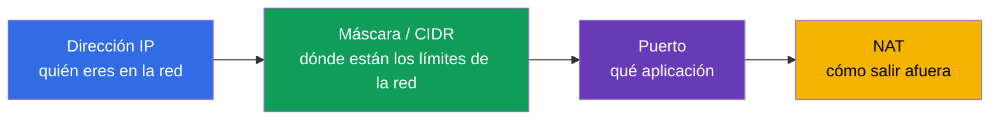
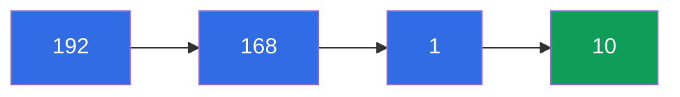
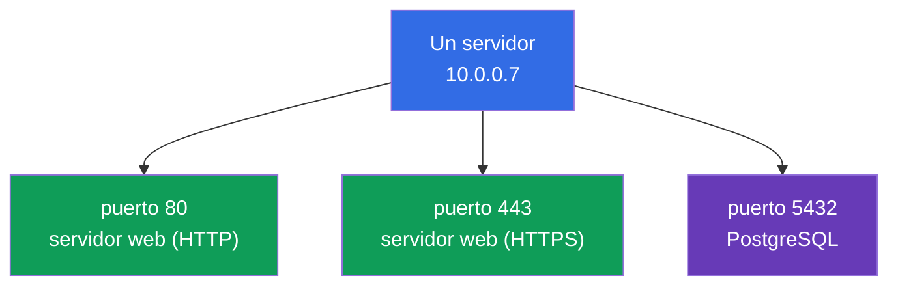
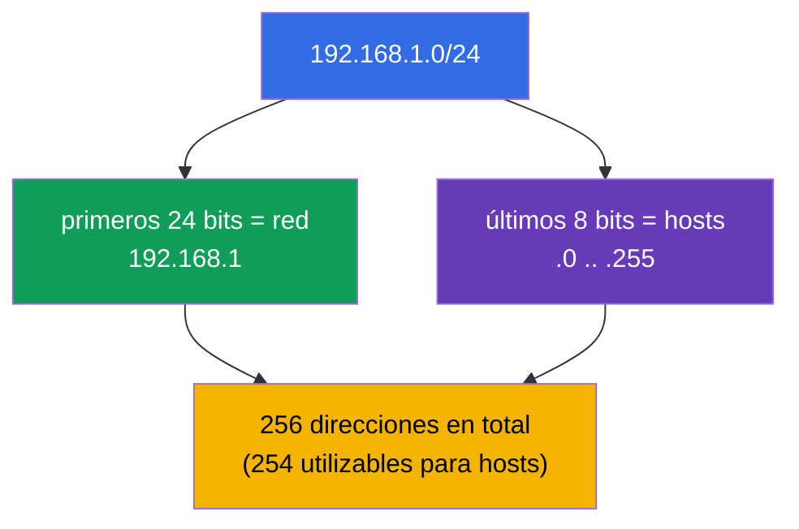
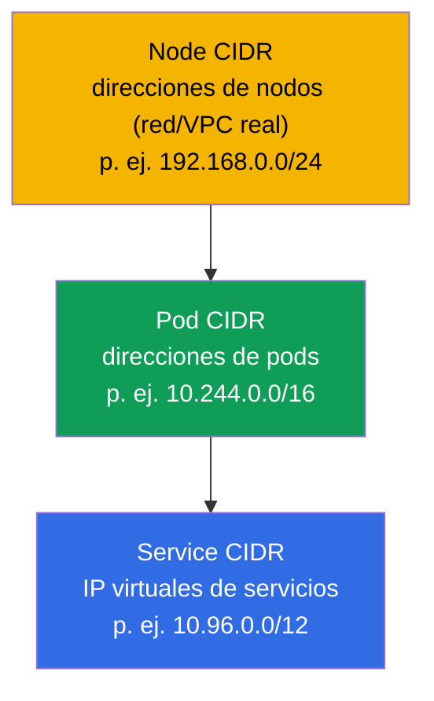
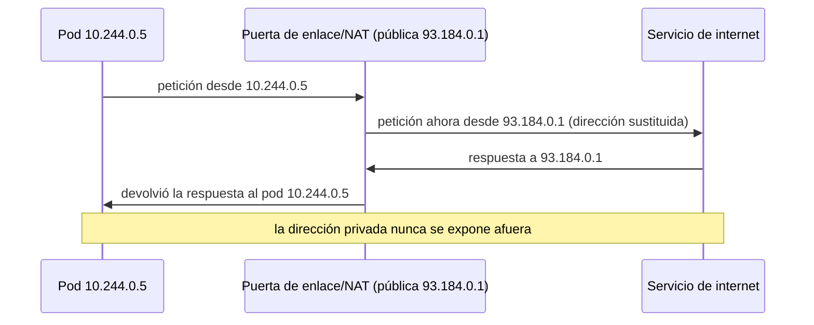

[Русская версия](ru.md) · [Eng version](README.md) · [Version française](fr.md) · [Deutsche Version](de.md) · [ქართული ვერსია](ge.md) · [繁體中文版](tw.md) · [日本語版](jp.md)

# Capítulo 0.1. Redes desde cero: IP, puertos, CIDR y NAT

> **Para quién es este capítulo.** Es un capítulo de la Parte 0 - la base "cero" para
> quienes llegan a Kubernetes sin una base sólida de redes. Si puedes explicar con
> confianza qué es una dirección IP, una máscara de subred, la notación `10.0.0.0/16`,
> un puerto y NAT, sáltatelo sin problema y empieza por el Capítulo 1. Pero si las
> palabras "CIDR" o "red privada" te hacen dudar, dedica aquí media hora: casi todo el
> dominio Services & Networking de ambos exámenes y toda la resolución de problemas de
> red se apoyan en estos conceptos. Lo explicaremos todo desde cero, sin academicismo,
> y lo enlazaremos enseguida con dónde aparece en Kubernetes.

## 0.1.1. Por qué un principiante en redes necesita esto en un curso de Kubernetes

Kubernetes es ante todo una red distribuida: los pods reciben IP, los servicios viven
en IP virtuales, el tráfico circula entre nodos, y `Pod CIDR` y `Service CIDR` se
definen al instalar el clúster. Cuando en el Capítulo 30 veas `--pod-network-cidr=
10.244.0.0/16`, y en el Capítulo 7 un `ClusterIP` del rango `10.96.0.0/12`, todo eso
debería leerse tan fácil como un texto normal. Repasemos las piezas una a una.

## 0.1.2. Dirección IP: tu dirección en la red

Una **dirección IP** es la dirección numérica de un dispositivo en una red, como la
dirección postal de una casa. De momento hablamos de la variante más común - **IPv4**:
cuatro números del 0 al 255 separados por puntos, por ejemplo `192.168.1.10`. Cada uno
de los cuatro números es un **octeto** (8 bits), y la dirección completa son 32 bits.

Es importante distinguir desde el principio dos tipos de direcciones:

| Tipo | Rangos | Dónde vive | Ejemplo |
|------|--------|------------|---------|
| **Privada** | `10.0.0.0/8`, `172.16.0.0/12`, `192.168.0.0/16` | dentro de tu red, no visible en internet | `10.244.0.5` (pod) |
| **Pública** | todo lo demás | visible en internet directamente | `93.184.216.34` |

Los pods y servicios de Kubernetes casi siempre viven en rangos **privados**. Por eso
mismo un pod con la dirección `10.244.0.5` no es accesible desde internet directamente
- necesita un Service, un Ingress o NAT (más sobre esto abajo y en el Capítulo 7).

## 0.1.3. Puerto: qué aplicación en el dispositivo

Una dirección IP apunta a un dispositivo, pero en un solo dispositivo se ejecutan
decenas de programas. Para saber a qué programa va dirigido el tráfico se usa un
**puerto** - un número del 0 al 65535. El par "IP + puerto" apunta de forma
inequívoca a una aplicación concreta.

Vale la pena saberse de memoria unos cuantos puertos - aparecen constantemente en el
curso:

| Puerto | Qué suele escuchar |
|--------|--------------------|
| **80** | HTTP (web sin cifrado) |
| **443** | HTTPS (web con TLS, Capítulo 0.3) |
| **53** | DNS (Capítulo 0.2) |
| **22** | SSH (entramos en los nodos en las prácticas) |
| **6443** | kube-apiserver (el corazón del control plane) |
| **2379/2380** | etcd (el almacén del clúster, Capítulo 37) |
| **10250** | kubelet |

Cuando en el manifiesto de un pod escribes `containerPort: 8080`, y en un Service
`targetPort: 8080` y `port: 80`, trabajas exactamente con estos conceptos: en qué
puerto escucha la aplicación y a qué puerto llega el tráfico.

## 0.1.4. Máscara de subred y notación CIDR

Tener una dirección no basta - hay que entender los **límites de la red**: qué
direcciones son "propias" (en la misma red local, accesibles directamente) y cuáles
son "ajenas" (detrás de un router). Esto lo define la **máscara de subred**.

La idea es simple: la dirección se divide en dos partes - la **dirección de red**
(común a todos los vecinos) y la **dirección de host** (única dentro de la red). La
máscara dice cuántos de los primeros bits son la red.

Antes la máscara se escribía como `255.255.255.0`. Hoy se usa la notación compacta
**CIDR** (Classless Inter-Domain Routing): después de la dirección se pone `/N`, donde
`N` es el número de bits reservados para la red.

`/N` se lee así: **cuanto mayor es N, menor es la red** (menos direcciones, pero más
bits fijados para la red).

| CIDR | Bits de red | Direcciones en la red | Uso típico |
|------|-------------|-----------------------|------------|
| `/8` | 8 | ~16,7 millones | bloque privado enorme `10.0.0.0/8` |
| `/16` | 16 | 65 536 | red VPC, `Pod CIDR` del clúster |
| `/24` | 24 | 256 | subred/segmento habitual |
| `/32` | 32 | 1 | exactamente una dirección (un solo host) |

Basta con memorizar tres números: `/24` = 256 direcciones, `/16` = 65 536, `/8` = ~16
millones. Con eso alcanza para estimar "a ojo" los tamaños de red en un clúster.

## 0.1.5. Dónde aparece CIDR en Kubernetes

Esto no es una abstracción - en Kubernetes hay tres espacios CIDR distintos, y no se
pueden confundir (con detalle en el Capítulo 30):

- **Node CIDR** - en qué red están los propios servidores (nodos).
- **Pod CIDR** (`--pod-network-cidr`) - de qué rango obtienen su dirección los pods.
- **Service CIDR** (`--service-cidr`) - de qué rango se reparten los `ClusterIP`
  virtuales de los servicios.

Una regla que ahorra dolores: **estos tres rangos no deben solaparse** - ni entre sí
ni con la red corporativa. El solapamiento de CIDR es la causa clásica de "los pods no
se ven entre sí" y "el clúster no arranca".

## 0.1.6. NAT: cómo sale afuera una dirección privada

Las direcciones privadas (`10.x`, `192.168.x`) no se enrutan en internet. Entonces,
¿cómo descarga una imagen de internet un pod con la dirección `10.244.0.5`? Mediante
**NAT (Network Address Translation)** - la sustitución de direcciones en el router: el
tráfico saliente "finge" venir de la dirección pública de la puerta de enlace, y las
respuestas vuelven al remitente correcto.

El enlace clave con el modelo de red de Kubernetes (Capítulo 30): **dentro** del
clúster los pods se comunican **sin NAT** (red plana, cada uno ve la IP real del otro),
y **hacia afuera** el tráfico sale **a través de NAT**. Esta regla es fácil de
recordar: "los propios - directamente, los ajenos - por la puerta de enlace".

## 0.1.7. Cómo se aplica esto en producción

- **Planificar el CIDR al inicio, no después.** Los rangos Pod/Service/Node se acuerdan
  con la red de la empresa antes de crear el clúster. Un `Pod CIDR` demasiado pequeño
  choca contra el techo del número de pods al crecer - rehacerlo duele.
- **Clústeres privados.** Los nodos y pods están en subredes privadas, salen a través
  de una puerta de enlace NAT, y el tráfico entrante lo recibe un balanceador de
  carga/Ingress. Es el estándar de seguridad en la nube.
- **Puertos y firewall.** Entre los nodos deben estar abiertos puertos concretos (6443,
  2379/2380, 10250, etc.). "El clúster no arrancó" a menudo = un puerto cerrado en el
  firewall/Security Group.
- **Diagnóstico por el par IP+puerto.** En un incidente, el ingeniero mira primero: si
  es la IP correcta, el puerto correcto, la subred correcta, si no hay solapamiento de
  CIDR. Es el lenguaje en el que se describen los problemas de red.

## 0.1.8. Miniglosario

- **Dirección IP** - la dirección numérica de un dispositivo en una red (IPv4: cuatro
  octetos, 32 bits).
- **Octeto** - uno de los cuatro números de una dirección IPv4 (8 bits, 0-255).
- **Dirección privada / pública** - una dirección dentro de tu propia red / visible en
  internet.
- **Puerto** - un número 0-65535 que identifica una aplicación en un dispositivo.
- **Máscara de subred** - qué parte de la dirección es la red y qué parte es el host.
- **CIDR** - la notación `dirección/N`, donde `N` es el número de bits de red; mayor N
  - menor red.
- **Dirección de red / dirección de host** - la parte común a los vecinos / la parte
  única de un dispositivo.
- **NAT** - la sustitución de direcciones en la puerta de enlace para que el tráfico
  privado salga afuera.
- **Pod / Service / Node CIDR** - rangos de direcciones de pods / IP virtuales de
  servicios / nodos; no deben solaparse.

## 0.1.9. Resumen del capítulo

- Una dirección IP (IPv4) son 32 bits, cuatro octetos; puede ser privada (dentro de una
  red) o pública (en internet). Los pods y servicios viven en rangos privados.
- Un puerto (0-65535) identifica una aplicación; el par "IP + puerto" es un servicio
  concreto.
- La notación CIDR `/N` fija el límite de la red: cuanto mayor es N, menos direcciones
  (`/24` = 256, `/16` = 65 536, `/8` = ~16 millones).
- En Kubernetes hay tres CIDR que no se solapan: Node, Pod, Service. El solapamiento es
  una causa frecuente de fallos de red.
- NAT sustituye direcciones en la puerta de enlace para que el tráfico privado salga
  afuera; dentro del clúster los pods se comunican sin NAT (red plana, Capítulo 30).

## 0.1.10. Para qué sirve: en el examen y en el trabajo real

**En el examen.** No hay tareas directas de "calcula la máscara", pero sin esta base no
se entiende la instalación del clúster (Capítulo 35: `--pod-network-cidr`), el modelo
de red (Capítulo 30) ni la resolución de problemas de red (30% del CKA). Saber leer
`10.244.0.0/16` y `10.96.0.0/12` y no confundir Pod/Service CIDR ahorra tiempo en cada
tarea de red.

**En el trabajo real.** Planificar el espacio de direcciones del clúster, configurar
firewalls y NAT, analizar incidentes de "el pod no llegó al servicio" - todo esto es el
trabajo diario de un ingeniero de plataforma, y todo habla el idioma de las IP, los
puertos y el CIDR.

## 0.1.11. Preguntas de autoevaluación

1. ¿De cuántos bits consta una dirección IPv4 y qué es un octeto?
2. ¿En qué se diferencia una dirección privada de una pública? ¿En qué rango viven los
   pods?
3. ¿Qué significa la notación `10.244.0.0/16` y cuántas direcciones tiene
   aproximadamente?
4. ¿Por qué una `N` mayor en `/N` da una red menor?
5. Nombra los tres espacios CIDR de Kubernetes. ¿Por qué no deben solaparse?
6. ¿Qué hace NAT y por qué los pods dentro del clúster se comunican sin NAT?

## Práctica

No hay una práctica aparte para la Parte 0 - es una base preparatoria. La práctica
empieza cuando, en el Capítulo 1, levantes un clúster de aprendizaje, y los temas de
red los ejercitarás en las prácticas de red. A continuación - cómo se convierten los
nombres en direcciones.

---
[Índice](../README_ES.md) · [Capítulo 0.2](../00-2-dns/es.md)
