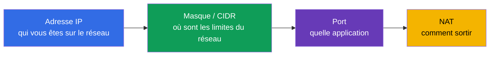
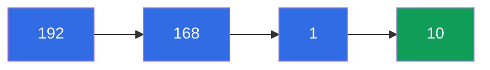
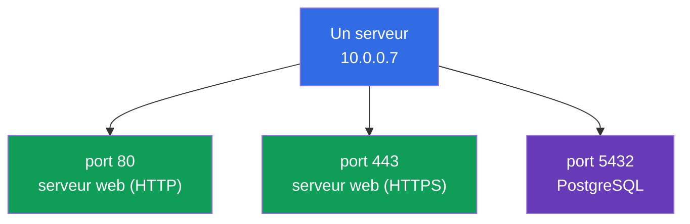
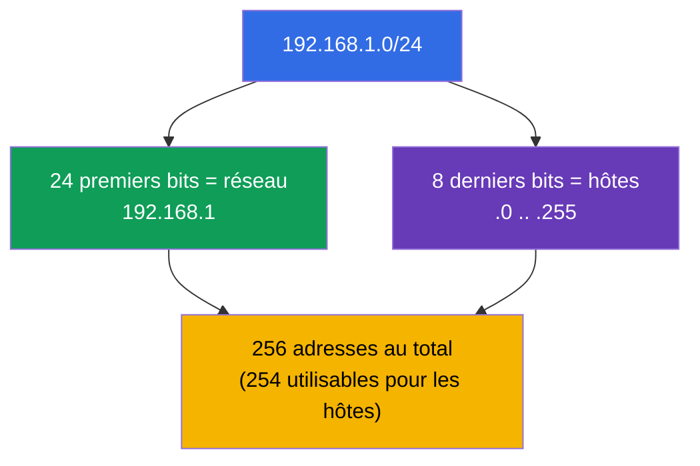
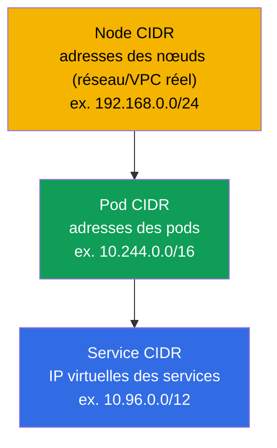
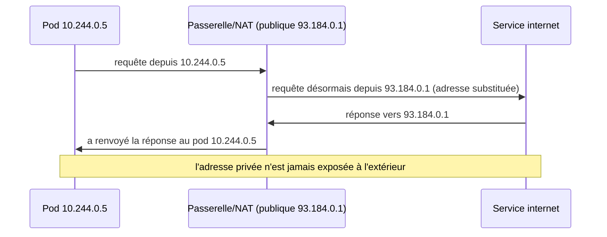

[Русская версия](ru.md) · [Eng version](README.md) · [Versión en español](es.md) · [Deutsche Version](de.md) · [ქართული ვერსია](ge.md) · [繁體中文版](tw.md) · [日本語版](jp.md)

# Chapitre 0.1. Les réseaux depuis zéro : IP, ports, CIDR et NAT

> **À qui s'adresse ce chapitre.** C'est un chapitre de la Partie 0 - la base "zéro"
> pour celles et ceux qui arrivent à Kubernetes sans socle solide en réseau. Si vous
> savez expliquer avec assurance ce qu'est une adresse IP, un masque de sous-réseau,
> la notation `10.0.0.0/16`, un port et le NAT, passez-le sans hésiter et commencez au
> Chapitre 1. Mais si les mots « CIDR » ou « réseau privé » vous font hésiter, passez
> une demi-heure ici : presque tout le domaine Services & Networking des deux examens
> et tout le dépannage réseau reposent sur ces notions. Nous expliquerons tout depuis
> zéro, sans académisme, et le relierons tout de suite à l'endroit où cela apparaît
> dans Kubernetes.

## 0.1.1. Pourquoi un débutant en réseau a besoin de ceci dans un cours Kubernetes

Kubernetes est avant tout un réseau distribué : les pods reçoivent des IP, les services
vivent sur des IP virtuelles, le trafic circule entre les nœuds, et `Pod CIDR` et
`Service CIDR` sont définis à l'installation du cluster. Quand, au Chapitre 30, vous
verrez `--pod-network-cidr=10.244.0.0/16`, et au Chapitre 7 un `ClusterIP` de la plage
`10.96.0.0/12`, tout cela devrait se lire aussi facilement qu'un texte ordinaire.
Passons les briques en revue une par une.

## 0.1.2. Adresse IP : votre adresse sur le réseau

Une **adresse IP** est l'adresse numérique d'un appareil sur un réseau, comme
l'adresse postale d'une maison. Pour l'instant, parlons de la variante la plus
répandue - **IPv4** : quatre nombres de 0 à 255 séparés par des points, par exemple
`192.168.1.10`. Chacun des quatre nombres est un **octet** (8 bits), et l'adresse
entière fait 32 bits.

Il est important, dès le départ, de distinguer deux types d'adresses :

| Type | Plages | Où elle vit | Exemple |
|------|--------|-------------|---------|
| **Privée** | `10.0.0.0/8`, `172.16.0.0/12`, `192.168.0.0/16` | à l'intérieur de votre réseau, invisible sur internet | `10.244.0.5` (pod) |
| **Publique** | tout le reste | visible directement sur internet | `93.184.216.34` |

Les pods et services Kubernetes vivent presque toujours dans des plages **privées**.
C'est justement pourquoi un pod avec l'adresse `10.244.0.5` n'est pas joignable
directement depuis internet - il lui faut un Service, un Ingress ou du NAT (voir
ci-dessous et au Chapitre 7).

## 0.1.3. Port : quelle application sur l'appareil

Une adresse IP désigne un appareil, mais des dizaines de programmes tournent sur un
même appareil. Pour savoir à quel programme le trafic est destiné, on utilise un
**port** - un nombre de 0 à 65535. Le couple « IP + port » désigne sans ambiguïté une
application précise.

Quelques ports méritent d'être connus par cœur - ils reviennent sans cesse dans le
cours :

| Port | Ce qui écoute habituellement |
|------|------------------------------|
| **80** | HTTP (web sans chiffrement) |
| **443** | HTTPS (web avec TLS, Chapitre 0.3) |
| **53** | DNS (Chapitre 0.2) |
| **22** | SSH (on se connecte aux nœuds dans les TP) |
| **6443** | kube-apiserver (le cœur du control plane) |
| **2379/2380** | etcd (le stockage du cluster, Chapitre 37) |
| **10250** | kubelet |

Quand, dans le manifeste d'un pod, vous écrivez `containerPort: 8080`, et dans un
Service `targetPort: 8080` et `port: 80`, vous manipulez exactement ces notions : sur
quel port l'application écoute et sur quel port arrive le trafic.

## 0.1.4. Masque de sous-réseau et notation CIDR

Avoir une adresse ne suffit pas - il faut comprendre les **limites du réseau** : quelles
adresses sont « locales » (dans le même réseau local, joignables directement) et
lesquelles sont « distantes » (derrière un routeur). C'est ce que définit le **masque
de sous-réseau**.

L'idée est simple : l'adresse se divise en deux parties - l'**adresse réseau** (commune
à tous les voisins) et l'**adresse hôte** (unique au sein du réseau). Le masque indique
combien des premiers bits constituent le réseau.

Autrefois, on écrivait le masque `255.255.255.0`. Aujourd'hui on utilise la notation
compacte **CIDR** (Classless Inter-Domain Routing) : après l'adresse, on met `/N`, où
`N` est le nombre de bits attribués au réseau.

`/N` se lit ainsi : **plus N est grand, plus le réseau est petit** (moins d'adresses,
mais plus de bits figés pour le réseau).

| CIDR | Bits réseau | Adresses dans le réseau | Usage typique |
|------|-------------|-------------------------|---------------|
| `/8` | 8 | ~16,7 millions | énorme bloc privé `10.0.0.0/8` |
| `/16` | 16 | 65 536 | réseau VPC, `Pod CIDR` du cluster |
| `/24` | 24 | 256 | sous-réseau/segment habituel |
| `/32` | 32 | 1 | exactement une adresse (un seul hôte) |

Trois nombres sont simplement à retenir : `/24` = 256 adresses, `/16` = 65 536, `/8` =
~16 millions. Cela suffit pour estimer « à l'œil » les tailles de réseau dans un
cluster.

## 0.1.5. Où le CIDR apparaît dans Kubernetes

Ce n'est pas une abstraction - dans Kubernetes il y a trois espaces CIDR différents, et
il ne faut pas les confondre (en détail au Chapitre 30) :

- **Node CIDR** - dans quel réseau se trouvent les serveurs (nœuds) eux-mêmes.
- **Pod CIDR** (`--pod-network-cidr`) - la plage à partir de laquelle les pods
  obtiennent leur adresse.
- **Service CIDR** (`--service-cidr`) - la plage à partir de laquelle sont attribués
  les `ClusterIP` virtuels des services.

Une règle qui évite bien des douleurs : **ces trois plages ne doivent pas se
chevaucher** - ni entre elles, ni avec le réseau de l'entreprise. Le chevauchement de
CIDR est la cause classique des « les pods ne se voient pas » et « le cluster ne
démarre pas ».

## 0.1.6. NAT : comment une adresse privée sort à l'extérieur

Les adresses privées (`10.x`, `192.168.x`) ne sont pas routées sur internet. Alors
comment un pod avec l'adresse `10.244.0.5` télécharge-t-il une image depuis internet ?
Grâce au **NAT (Network Address Translation)** - la substitution d'adresses sur le
routeur : le trafic sortant « fait comme s'il » venait de l'adresse publique de la
passerelle, et les réponses reviennent au bon expéditeur.

Le lien clé avec le modèle réseau de Kubernetes (Chapitre 30) : **à l'intérieur** du
cluster, les pods communiquent **sans NAT** (réseau plat, chacun voit l'IP réelle de
l'autre), tandis que **vers l'extérieur** le trafic passe **par du NAT**. Cette règle
est facile à retenir : « les locaux - directement, les distants - par la passerelle ».

## 0.1.7. Comment cela s'applique en production

- **Planifier le CIDR au départ, pas après.** Les plages Pod/Service/Node sont
  accordées avec le réseau de l'entreprise avant la création du cluster. Un `Pod CIDR`
  trop petit atteint le plafond du nombre de pods à la croissance - le refaire fait
  mal.
- **Clusters privés.** Les nœuds et les pods sont dans des sous-réseaux privés, sortent
  via une passerelle NAT, et le trafic entrant est reçu par un répartiteur de
  charge/Ingress. C'est le standard de sécurité dans le cloud.
- **Ports et pare-feu.** Des ports précis doivent être ouverts entre les nœuds (6443,
  2379/2380, 10250, etc.). « Le cluster n'a pas démarré » = souvent un port fermé sur
  le pare-feu/Security Group.
- **Diagnostic par le couple IP+port.** Lors d'un incident, l'ingénieur regarde
  d'abord : la bonne IP, le bon port, le bon sous-réseau, l'absence de chevauchement de
  CIDR. C'est le langage dans lequel on décrit les problèmes réseau.

## 0.1.8. Mini-glossaire

- **Adresse IP** - l'adresse numérique d'un appareil sur un réseau (IPv4 : quatre
  octets, 32 bits).
- **Octet** - l'un des quatre nombres d'une adresse IPv4 (8 bits, 0-255).
- **Adresse privée / publique** - une adresse à l'intérieur de votre propre réseau /
  visible sur internet.
- **Port** - un nombre 0-65535 identifiant une application sur un appareil.
- **Masque de sous-réseau** - ce qui, dans l'adresse, relève du réseau et ce qui relève
  de l'hôte.
- **CIDR** - la notation `adresse/N`, où `N` est le nombre de bits réseau ; plus N est
  grand - plus le réseau est petit.
- **Adresse réseau / adresse hôte** - la partie commune aux voisins / la partie propre à
  un appareil.
- **NAT** - la substitution d'adresses sur la passerelle pour que le trafic privé sorte
  à l'extérieur.
- **Pod / Service / Node CIDR** - plages d'adresses de pods / IP virtuelles de services
  / nœuds ; ne doivent pas se chevaucher.

## 0.1.9. Récapitulatif du chapitre

- Une adresse IP (IPv4) fait 32 bits, quatre octets ; elle peut être privée (dans un
  réseau) ou publique (sur internet). Les pods et services vivent dans des plages
  privées.
- Un port (0-65535) identifie une application ; le couple « IP + port » est un service
  précis.
- La notation CIDR `/N` fixe la limite du réseau : plus N est grand, moins il y a
  d'adresses (`/24` = 256, `/16` = 65 536, `/8` = ~16 millions).
- Dans Kubernetes, il y a trois CIDR qui ne se chevauchent pas : Node, Pod, Service. Le
  chevauchement est une cause fréquente de pannes réseau.
- Le NAT substitue les adresses sur la passerelle pour que le trafic privé sorte ; à
  l'intérieur du cluster, les pods communiquent sans NAT (réseau plat, Chapitre 30).

## 0.1.10. À quoi cela sert : à l'examen et dans le travail réel

**À l'examen.** Il n'y a pas de tâches directes « calculez le masque », mais sans cette
base on ne comprend pas l'installation du cluster (Chapitre 35 : `--pod-network-cidr`),
le modèle réseau (Chapitre 30) ni le dépannage réseau (30 % du CKA). Savoir lire
`10.244.0.0/16` et `10.96.0.0/12` sans confondre Pod/Service CIDR fait gagner du temps
dans chaque tâche réseau.

**Dans le travail réel.** Planifier l'espace d'adressage du cluster, configurer les
pare-feu et le NAT, analyser les incidents « le pod n'a pas atteint le service » - tout
cela est le quotidien d'un ingénieur plateforme, et tout parle le langage des IP, des
ports et du CIDR.

## 0.1.11. Questions d'auto-évaluation

1. De combien de bits se compose une adresse IPv4 et qu'est-ce qu'un octet ?
2. En quoi une adresse privée diffère-t-elle d'une adresse publique ? Dans quelle plage
   vivent les pods ?
3. Que signifie la notation `10.244.0.0/16` et combien d'adresses contient-elle environ ?
4. Pourquoi un `N` plus grand dans `/N` donne-t-il un réseau plus petit ?
5. Nommez les trois espaces CIDR de Kubernetes. Pourquoi ne doivent-ils pas se
   chevaucher ?
6. Que fait le NAT et pourquoi les pods à l'intérieur du cluster communiquent-ils sans
   NAT ?

## Pratique

Il n'y a pas de TP à part pour la Partie 0 - c'est un socle préparatoire. La pratique
commence lorsque, au Chapitre 1, vous monterez un cluster d'entraînement, et vous
travaillerez les sujets réseau dans les TP réseau. Ensuite - comment les noms se
transforment en adresses.

---
[Sommaire](../README_FR.md) · [Chapitre 0.2](../00-2-dns/fr.md)
