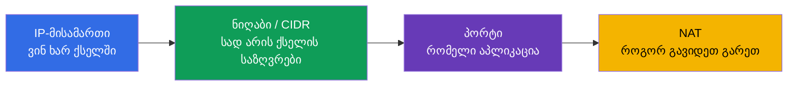
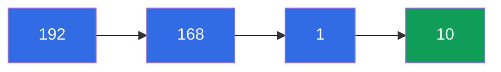
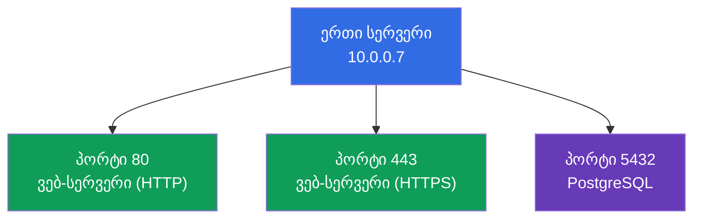
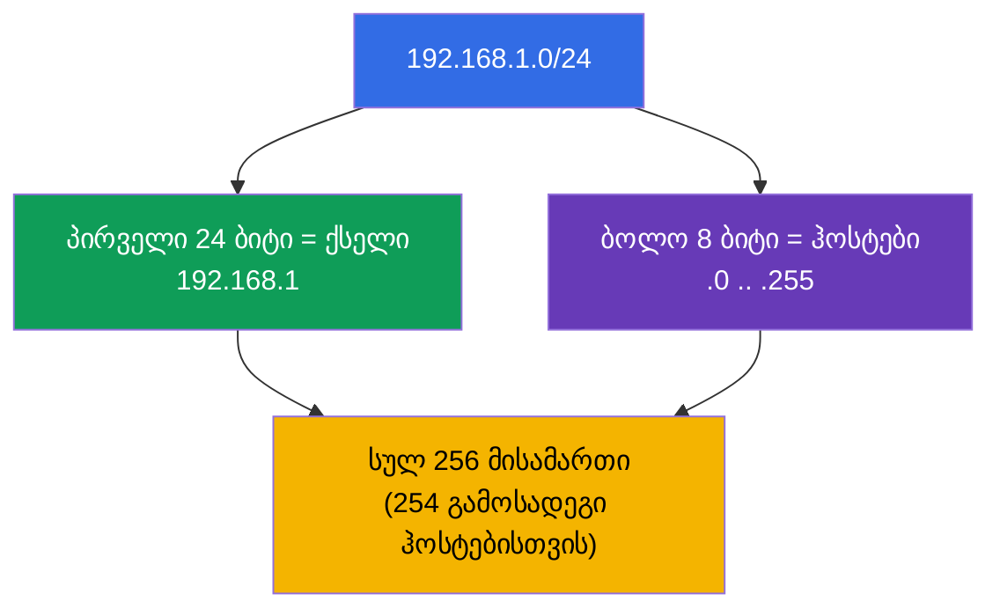
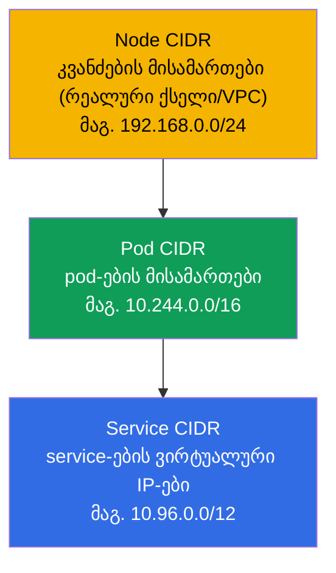
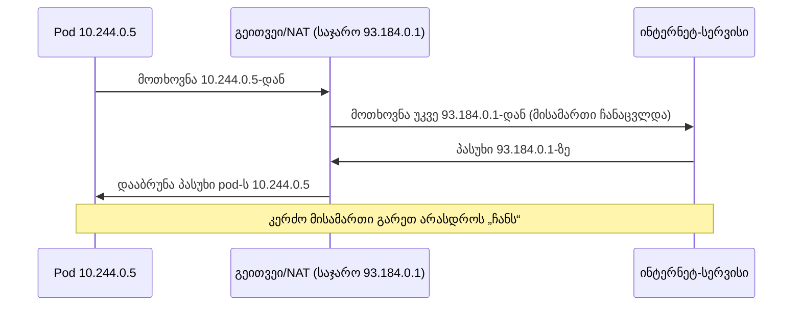

[Русская версия](ru.md) · [Eng version](README.md) · [Versión en español](es.md) · [Version française](fr.md) · [Deutsche Version](de.md) · [繁體中文版](tw.md) · [日本語版](jp.md)

# თავი 0.1. ქსელი ნულიდან: IP, პორტები, CIDR და NAT

> **ვისთვისაა ეს თავი.** ეს არის ნაწილ 0-ის თავი - „ნულოვანი“ საფუძველი მათთვის, ვინც
> Kubernetes-ში მოდის ქსელების მყარი ბაზის გარეშე. თუ თავდაჯერებულად ხსნით, რა არის
> IP-მისამართი, ქვექსელის ნიღაბი, ჩანაწერი `10.0.0.0/16`, პორტი და NAT, - თამამად
> გამოტოვეთ იგი და დაიწყეთ პირველი თავიდან. მაგრამ თუ სიტყვები „CIDR“ ან „კერძო ქსელი“
> გაფიქრებთ, დაუთმეთ აქ ნახევარი საათი: ორივე გამოცდის თითქმის მთელი დომენი
> Services & Networking და ქსელის მთელი troubleshooting ამ ცნებებზე დგას. ჩვენ ავხსნით
> ყველაფერს ნულიდან, აკადემიზმის გარეშე, და მაშინვე დავაკავშირებთ იმასთან, სად
> გამოჩნდება ეს Kubernetes-ში.

## 0.1.1. რატომ სჭირდება ქსელის დამწყებს ეს Kubernetes-ის კურსში

Kubernetes უპირველეს ყოვლისა განაწილებული ქსელია: pod-ები იღებენ IP-ს, service-ები
ცხოვრობენ ვირტუალურ IP-ებზე, ტრაფიკი მიდის კვანძებს შორის, `Pod CIDR` და `Service CIDR`
განისაზღვრება კლასტერის ინსტალაციისას. როცა 30-ე თავში დაინახავთ `--pod-network-cidr=
10.244.0.0/16`-ს, ხოლო მე-7 თავში - `ClusterIP`-ს დიაპაზონიდან `10.96.0.0/12`, ეს
ყველაფერი უნდა იკითხებოდეს ისე მარტივად, როგორც ჩვეულებრივი ტექსტი. განვიხილოთ აგურები
რიგრიგობით.

## 0.1.2. IP-მისამართი: შენი მისამართი ქსელში

**IP-მისამართი** არის მოწყობილობის რიცხვითი მისამართი ქსელში, როგორც სახლის საფოსტო
მისამართი. ჯერჯერობით ვსაუბრობთ ყველაზე გავრცელებულ ვარიანტზე - **IPv4**: ოთხი რიცხვი
0-დან 255-მდე, წერტილებით გამოყოფილი, მაგალითად `192.168.1.10`. ოთხი რიცხვიდან
თითოეული არის ერთი **ოქტეტი** (8 ბიტი), ხოლო მთელი მისამართი - 32 ბიტი.

მნიშვნელოვანია თავიდანვე განვასხვავოთ ორი სახის მისამართი:

| სახე | დიაპაზონები | სად ცხოვრობს | მაგალითი |
|------|-------------|--------------|----------|
| **კერძო** | `10.0.0.0/8`, `172.16.0.0/12`, `192.168.0.0/16` | თქვენი ქსელის შიგნით, ინტერნეტში არ ჩანს | `10.244.0.5` (pod) |
| **საჯარო** | ყველა დანარჩენი | ინტერნეტში პირდაპირ ჩანს | `93.184.216.34` |

Kubernetes-ის pod-ები და service-ები თითქმის ყოველთვის ცხოვრობენ **კერძო**
დიაპაზონებში. სწორედ ამიტომ pod მისამართით `10.244.0.5` მიუწვდომელია ინტერნეტიდან
პირდაპირ - მას სჭირდება Service, Ingress ან NAT (ამის შესახებ ქვემოთ და მე-7 თავში).

## 0.1.3. პორტი: რომელი აპლიკაცია მოწყობილობაზე

IP-მისამართი მიუთითებს მოწყობილობაზე, მაგრამ ერთ მოწყობილობაზე ათობით პროგრამა
მუშაობს. იმის გასაგებად, რომელ პროგრამას მიემართება ტრაფიკი, გამოიყენება **პორტი** -
რიცხვი 0-დან 65535-მდე. წყვილი „IP + პორტი“ ცალსახად მიუთითებს კონკრეტულ აპლიკაციაზე.

რამდენიმე პორტი ღირს ზეპირად ცოდნა - ისინი კურსში მუდმივად გვხვდება:

| პორტი | რა უსმენს ჩვეულებრივ |
|-------|----------------------|
| **80** | HTTP (ვები დაშიფვრის გარეშე) |
| **443** | HTTPS (ვები TLS-ით, თავი 0.3) |
| **53** | DNS (თავი 0.2) |
| **22** | SSH (ლაბებში კვანძებზე შევდივართ) |
| **6443** | kube-apiserver (control plane-ის გული) |
| **2379/2380** | etcd (კლასტერის საცავი, თავი 37) |
| **10250** | kubelet |

როცა pod-ის მანიფესტში წერთ `containerPort: 8080`-ს, ხოლო Service-ში `targetPort:
8080`-ს და `port: 80`-ს, თქვენ მუშაობთ ზუსტად ამ ცნებებთან: რომელ პორტზე უსმენს
აპლიკაცია და რომელ პორტზე მოდის ტრაფიკი.

## 0.1.4. ქვექსელის ნიღაბი და CIDR-ჩანაწერი

მისამართის ქონა საკმარისი არ არის - საჭიროა გავიგოთ **ქსელის საზღვრები**: რომელი
მისამართებია „საკუთარი“ (იმავე ლოკალურ ქსელში, პირდაპირ მისაწვდომი), ხოლო რომელი -
„უცხო“ (რაუტერის მიღმა). ამას განსაზღვრავს **ქვექსელის ნიღაბი**.

იდეა მარტივია: მისამართი იყოფა ორ ნაწილად - **ქსელის მისამართი** (საერთო ყველა
მეზობლისთვის) და **ჰოსტის მისამართი** (უნიკალური ქსელის შიგნით). ნიღაბი ამბობს, პირველი
რამდენი ბიტია ქსელი.

ადრე ნიღაბს წერდნენ როგორც `255.255.255.0`. დღეს იყენებენ კომპაქტურ **CIDR**-ჩანაწერს
(Classless Inter-Domain Routing): მისამართის შემდეგ სვამენ `/N`-ს, სადაც `N` არის
ქსელისთვის გამოყოფილი ბიტების რაოდენობა.

`/N` ასე უნდა წაიკითხოთ: **რაც მეტია N, მით ნაკლებია ქსელი** (ნაკლები მისამართი, მაგრამ
მეტი ბიტი ფიქსირებული ქსელისთვის).

| CIDR | ბიტი ქსელისთვის | მისამართები ქსელში | ტიპური გამოყენება |
|------|-----------------|--------------------|-------------------|
| `/8` | 8 | ~16,7 მლნ | უზარმაზარი კერძო ბლოკი `10.0.0.0/8` |
| `/16` | 16 | 65 536 | VPC ქსელი, კლასტერის `Pod CIDR` |
| `/24` | 24 | 256 | ჩვეულებრივი ქვექსელი/სეგმენტი |
| `/32` | 32 | 1 | ზუსტად ერთი მისამართი (ერთი ჰოსტი) |

სამი რიცხვი უბრალოდ ღირს დამახსოვრება: `/24` = 256 მისამართი, `/16` = 65 536, `/8` =
~16 მლნ. ეს საკმარისია კლასტერში ქსელების ზომების „თვალით“ შესაფასებლად.

## 0.1.5. სად გამოჩნდება CIDR Kubernetes-ში

ეს აბსტრაქცია არ არის - Kubernetes-ში სამი განსხვავებული CIDR-სივრცეა, და მათი აღრევა
არ შეიძლება (დაწვრილებით 30-ე თავში):

- **Node CIDR** - რომელ ქსელში არიან თავად სერვერები (კვანძები).
- **Pod CIDR** (`--pod-network-cidr`) - რომელი დიაპაზონიდან იღებენ pod-ები მისამართებს.
- **Service CIDR** (`--service-cidr`) - რომელი დიაპაზონიდან გაიცემა service-ების
  ვირტუალური `ClusterIP`-ები.

წესი, რომელიც ტკივილისგან გიხსნით: **ეს სამი დიაპაზონი არ უნდა იკვეთებოდეს** - არც
ერთმანეთთან, არც კორპორაციულ ქსელთან. CIDR-ების გადაფარვა კლასიკური მიზეზია „pod-ები
ერთმანეთს ვერ ხედავენ“ და „კლასტერი არ იწევს“.

## 0.1.6. NAT: როგორ გადის კერძო მისამართი გარეთ

კერძო მისამართები (`10.x`, `192.168.x`) ინტერნეტში არ მარშრუტიზდება. მაშ, როგორ
ჩამოტვირთავს ინტერნეტიდან იმიჯს pod მისამართით `10.244.0.5`? **NAT-ის (Network Address
Translation)** მეშვეობით - მისამართების ჩანაცვლება რაუტერზე: გამავალი ტრაფიკი „თავს
აჩვენებს“ ისე, თითქოს გეითვეის საჯარო მისამართიდან მოდის, ხოლო პასუხები ბრუნდება საჭირო
გამგზავნთან.

მთავარი კავშირი Kubernetes-ის ქსელურ მოდელთან (თავი 30): კლასტერის **შიგნით** pod-ები
ურთიერთობენ **NAT-ის გარეშე** (ბრტყელი ქსელი, თითოეული ხედავს მეორის რეალურ IP-ს),
ხოლო **გარეთ** ტრაფიკი გადის **NAT-ის გავლით**. ეს წესი ადვილი დასამახსოვრებელია:
„საკუთრები - პირდაპირ, უცხოები - გეითვეის გავლით“.

## 0.1.7. როგორ გამოიყენება ეს პროდაქშენში

- **CIDR-ის დაგეგმვა - თავიდანვე, არა მერე.** Pod/Service/Node დიაპაზონები კომპანიის
  ქსელთან თანხმდება კლასტერის შექმნამდე. ძალიან პატარა `Pod CIDR` ზრდისას pod-ების
  რაოდენობის ჭერს აწყდება - გადაკეთება მტკივნეულია.
- **კერძო კლასტერები.** კვანძები და pod-ები კერძო ქვექსელებში სხედან, გარეთ
  NAT-გეითვეის გავლით გადიან, ხოლო შემომავალ ტრაფიკს იღებს ბალანსერი/Ingress. ეს
  უსაფრთხოების სტანდარტია ღრუბლებში.
- **პორტები და firewall.** კვანძებს შორის უნდა იყოს ღია კონკრეტული პორტები (6443,
  2379/2380, 10250 და ა.შ.). „კლასტერი არ აიწია“ ხშირად = დახურული პორტი
  firewall/Security Group-ზე.
- **დიაგნოსტიკა წყვილით IP+პორტი.** ინციდენტში ინჟინერი პირველ რიგში უყურებს: ის IP-ა,
  ის პორტია, ის ქვექსელია, ხომ არ იკვეთება CIDR. ეს ის ენაა, რომლითაც ქსელურ
  პრობლემებს აღწერენ.

## 0.1.8. მინი-ლექსიკონი

- **IP-მისამართი** - მოწყობილობის რიცხვითი მისამართი ქსელში (IPv4: ოთხი ოქტეტი, 32
  ბიტი).
- **ოქტეტი** - IPv4-მისამართის ოთხი რიცხვიდან ერთ-ერთი (8 ბიტი, 0-255).
- **კერძო / საჯარო მისამართი** - მისამართი საკუთარი ქსელის შიგნით / ინტერნეტში ხილული.
- **პორტი** - რიცხვი 0-65535, რომელიც მოწყობილობაზე აპლიკაციას მიუთითებს.
- **ქვექსელის ნიღაბი** - რა მიეკუთვნება მისამართში ქსელს და რა - ჰოსტს.
- **CIDR** - ჩანაწერი `მისამართი/N`, სადაც `N` არის ქსელის ბიტების რაოდენობა; მეტი N -
  ნაკლები ქსელი.
- **ქსელის მისამართი / ჰოსტის მისამართი** - მეზობლების საერთო ნაწილი / მოწყობილობის
  უნიკალური ნაწილი.
- **NAT** - მისამართების ჩანაცვლება გეითვეიზე, რომ კერძო ტრაფიკი გარეთ გავიდეს.
- **Pod / Service / Node CIDR** - pod-ების მისამართების / service-ების ვირტუალური
  IP-ების / კვანძების დიაპაზონები; არ უნდა იკვეთებოდეს.

## 0.1.9. თავის შეჯამება

- IP-მისამართი (IPv4) - 32 ბიტი, ოთხი ოქტეტი; შეიძლება იყოს კერძო (ქსელის შიგნით) და
  საჯარო (ინტერნეტში). Pod-ები და service-ები კერძო დიაპაზონებში ცხოვრობენ.
- პორტი (0-65535) მიუთითებს აპლიკაციას; წყვილი „IP + პორტი“ - კონკრეტული სერვისი.
- CIDR-ჩანაწერი `/N` აყენებს ქსელის საზღვარს: რაც მეტია N, მით ნაკლები მისამართი
  (`/24` = 256, `/16` = 65 536, `/8` = ~16 მლნ).
- Kubernetes-ში სამი გადაუფარავი CIDR-ია: Node, Pod, Service. გადაფარვა ქსელური
  ხარვეზების ხშირი მიზეზია.
- NAT ცვლის მისამართებს გეითვეიზე კერძო ტრაფიკის გასაყვანად; კლასტერის შიგნით pod-ები
  ურთიერთობენ NAT-ის გარეშე (ბრტყელი ქსელი, თავი 30).

## 0.1.10. როგორ გამოგადგებათ: გამოცდაზე და რეალურ სამუშაოში

**გამოცდაზე.** პირდაპირი დავალებები „გამოთვალე ნიღაბი“ არ არის, მაგრამ ამ საფუძვლის
გარეშე ვერ გაიგებთ კლასტერის ინსტალაციას (თავი 35: `--pod-network-cidr`), ქსელურ
მოდელს (თავი 30) და ქსელურ troubleshooting-ს (CKA-ს 30%). `10.244.0.0/16`-ისა და
`10.96.0.0/12`-ის წაკითხვის უნარი Pod/Service CIDR-ის აღრევის გარეშე დროს ზოგავს ყოველ
ქსელურ ამოცანაში.

**რეალურ სამუშაოში.** კლასტერის მისამართთა სივრცის დაგეგმვა, firewall-ისა და NAT-ის
კონფიგურაცია, ინციდენტების „pod-მა ვერ მიაღწია service-ს“ გარჩევა - ეს ყველაფერი
პლატფორმის ინჟინრის ყოველდღიური სამუშაოა, და ის მთლიანად IP-ების, პორტებისა და CIDR-ის
ენაზე ლაპარაკობს.

## 0.1.11. თვითშემოწმების კითხვები

1. რამდენი ბიტისგან შედგება IPv4-მისამართი და რა არის ოქტეტი?
2. რით განსხვავდება კერძო მისამართი საჯაროსგან? რომელ დიაპაზონში ცხოვრობენ pod-ები?
3. რას ნიშნავს ჩანაწერი `10.244.0.0/16` და დაახლოებით რამდენი მისამართია მასში?
4. რატომ იძლევა უფრო დიდი `N` `/N`-ში უფრო პატარა ქსელს?
5. დაასახელეთ Kubernetes-ის სამი CIDR-სივრცე. რატომ არ უნდა იკვეთებოდეს ისინი?
6. რას აკეთებს NAT და რატომ ურთიერთობენ pod-ები კლასტერის შიგნით NAT-ის გარეშე?

## პრაქტიკა

ნაწილ 0-ისთვის ცალკე ლაბი არ არის - ეს მოსამზადებელი საფუძველია. პრაქტიკა დაიწყება,
როცა პირველ თავში ასაწევთ სასწავლო კლასტერს, ხოლო ქსელურ თემებს ქსელის ლაბებში
დაამუშავებთ. შემდეგ - როგორ იქცევა სახელები მისამართებად.

---
[სარჩევი](../README_GE.md) · [თავი 0.2](../00-2-dns/ge.md)
