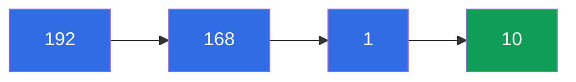
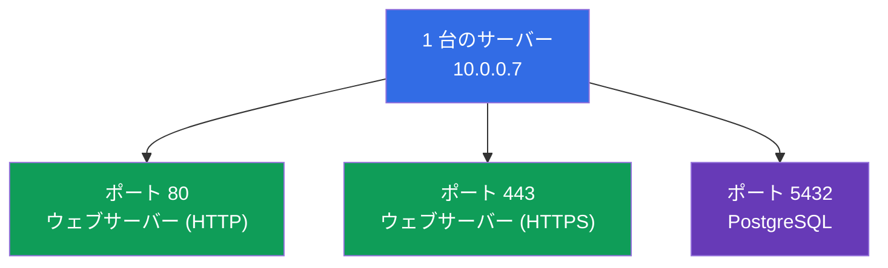
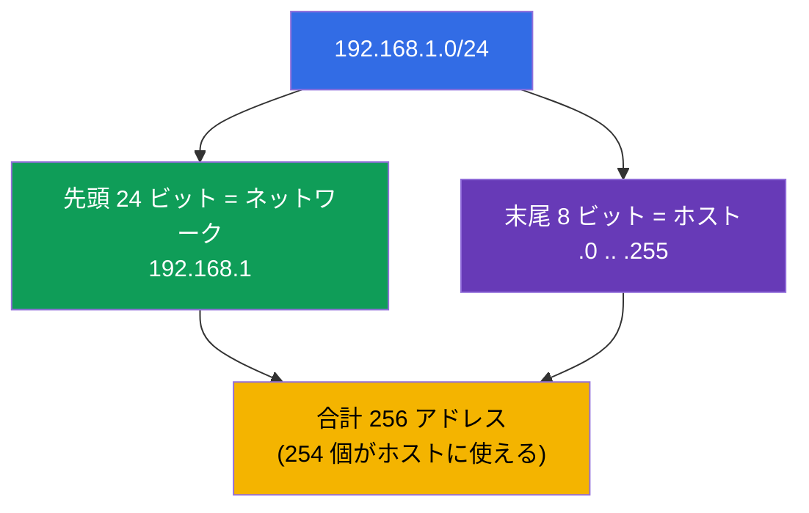
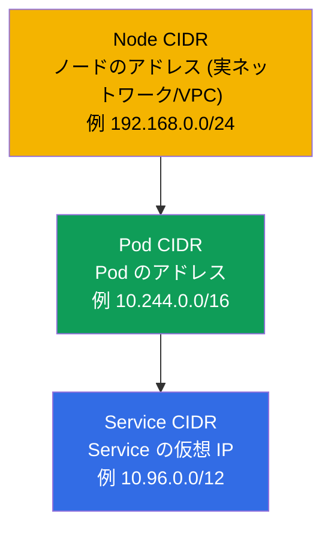
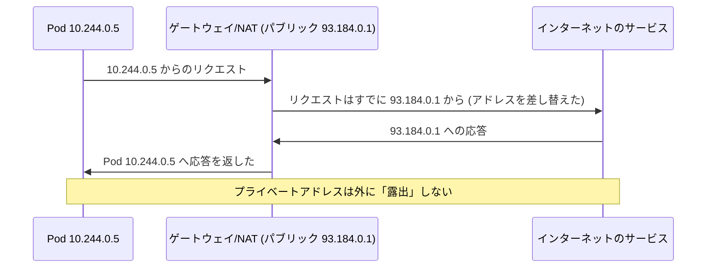

[Русская версия](ru.md) · [Eng version](README.md) · [Versión en español](es.md) · [Version française](fr.md) · [Deutsche Version](de.md) · [ქართული ვერსია](ge.md) · [繁體中文版](tw.md)

# 第 0.1 章。ゼロから学ぶネットワーク：IP、ポート、CIDR、NAT

> **この章は誰のためか。** これはパート 0 の章 - ネットワークの確かな基礎を
> 持たずに Kubernetes へ入ってくる人のための「ゼロ番目」の土台です。IP アドレス、
> サブネットマスク、`10.0.0.0/16` という表記、ポート、NAT が何かを自信をもって
> 説明できるなら、遠慮なく飛ばして第 1 章から始めてください。逆に「CIDR」や
> 「プライベートネットワーク」という言葉で手が止まるなら、ここに 30 分使って
> ください：両方の試験の Services & Networking 領域のほぼ全体と、ネットワークの
> troubleshooting のすべてが、これらの概念の上に立っています。学術的な言い回しは
> 使わずゼロから説明し、それが Kubernetes のどこで出てくるかをすぐに結びつけます。

## 0.1.1. ネットワーク初心者に Kubernetes のコースでこれが必要な理由

Kubernetes はまず何よりも分散ネットワークです：Pod は IP を受け取り、Service は
仮想 IP 上に存在し、トラフィックはノードの間を流れ、`Pod CIDR` と `Service CIDR` は
クラスタのインストール時に指定されます。第 30 章で `--pod-network-cidr=
10.244.0.0/16` を見たとき、第 7 章で `10.96.0.0/12` の範囲から取られた `ClusterIP` を
見たとき、そのすべてが普通の文章と同じくらい楽に読めるべきです。基本のブロックを
順番に分解していきましょう。

## 0.1.2. IP アドレス：ネットワーク内のアドレス

**IP アドレス** とは、ネットワーク上の機器の数値アドレスで、家の郵便の住所のような
ものです。ここではもっとも普及しているバージョン - **IPv4** の話をします：0 から 255
までの 4 つの数字をドットで区切ったもので、たとえば `192.168.1.10` です。4 つの数字の
それぞれが 1 つの **オクテット**（8 ビット）で、アドレス全体は 32 ビットです。

最初から 2 種類のアドレスを区別しておくことが重要です：

| 種類 | 範囲 | どこに存在するか | 例 |
|-----|-----------|-----------|--------|
| **プライベート** | `10.0.0.0/8`, `172.16.0.0/12`, `192.168.0.0/16` | 自分のネットワークの内部。インターネットからは見えない | `10.244.0.5`（Pod） |
| **パブリック** | それ以外すべて | インターネットから直接見える | `93.184.216.34` |

Kubernetes の Pod と Service は、ほぼ常に **プライベート** な範囲に存在します。だから
こそアドレス `10.244.0.5` の Pod はインターネットから直接アクセスできません - それには
Service、Ingress、または NAT が必要です（この下と、パート 7 で説明します）。

## 0.1.3. ポート：機器上のどのアプリケーションか

IP アドレスは機器を指しますが、1 台の機器では何十ものプログラムが動いています。
トラフィックがどのプログラム宛てなのかを知るために **ポート** - 0 から 65535 までの
数字 - を使います。「IP + ポート」の組み合わせは、具体的なアプリケーションを一意に
指し示します。

いくつかのポートは暗記しておく価値があります - コースの中で絶えず出てきます：

| ポート | 通常なにが待ち受けているか |
|------|--------------------|
| **80** | HTTP（暗号化なしのウェブ） |
| **443** | HTTPS（TLS 付きのウェブ、第 0.3 章） |
| **53** | DNS（第 0.2 章） |
| **22** | SSH（ラボでノードにログインします） |
| **6443** | kube-apiserver（control plane の心臓部） |
| **2379/2380** | etcd（クラスタのストレージ、第 37 章） |
| **10250** | kubelet |

Pod のマニフェストに `containerPort: 8080` と書き、Service に `targetPort:
8080` と `port: 80` と書くとき、あなたが扱っているのはまさにこれらの概念です：
アプリケーションがどのポートで待ち受けるのか、そしてトラフィックがどのポートに届くのか。

## 0.1.4. サブネットマスクと CIDR 表記

アドレスを持っているだけでは足りません - **ネットワークの境界** を理解する必要が
あります：どのアドレスが「身内」（同じローカルネットワークにいて、直接アクセスできる）で、
どれが「他人」（ルーターの向こう側）なのか。これを決めるのが **サブネットマスク** です。

考え方は単純です：アドレスは 2 つの部分に分かれます - **ネットワークアドレス**（すべての
隣人で共通）と **ホストアドレス**（ネットワーク内部で一意）です。マスクは、先頭の何ビットが
ネットワークなのかを示します。

昔はマスクを `255.255.255.0` のように書いていました。今はコンパクトな **CIDR** 表記
(Classless Inter-Domain Routing) を使います：アドレスのあとに `/N` を付け、`N` は
ネットワークに割り当てられたビット数です。

`/N` はこう読みます：**N が大きいほどネットワークは小さい**（アドレスは少なくなりますが、
ネットワークに固定されるビットは多くなります）。

| CIDR | ネットワークのビット数 | ネットワーク内のアドレス数 | 典型的な用途 |
|------|--------------|----------------|---------------------|
| `/8` | 8 | 約 1670 万 | 巨大なプライベートブロック `10.0.0.0/8` |
| `/16` | 16 | 65 536 | VPC のネットワーク、クラスタの `Pod CIDR` |
| `/24` | 24 | 256 | 普通のサブネット/セグメント |
| `/32` | 32 | 1 | ちょうど 1 アドレス（1 台のホスト） |

3 つの数字はそのまま覚えてしまいましょう：`/24` = 256 アドレス、`/16` = 65 536、`/8` = 約 1670 万。
これだけあれば、クラスタ内のネットワークの大きさを「ざっと」見積もれます。

## 0.1.5. CIDR が Kubernetes のどこで出てくるか

これは抽象論ではありません - Kubernetes には 3 つの異なる CIDR 空間があり、混同しては
いけません（詳しくは第 30 章）：

- **Node CIDR** - サーバー（ノード）自身がどのネットワークにいるか。
- **Pod CIDR** (`--pod-network-cidr`) - Pod がどの範囲からアドレスを受け取るか。
- **Service CIDR** (`--service-cidr`) - Service の仮想 `ClusterIP` がどの範囲から
  払い出されるか。

痛みから救ってくれるルール：**この 3 つの範囲は互いに重なってはいけません**。社内
ネットワークとも重なってはいけません。CIDR の重複は「Pod どうしが見えない」
「クラスタが立ち上がらない」の古典的な原因です。

## 0.1.6. NAT：プライベートアドレスはどうやって外に出るのか

プライベートアドレス（`10.x`、`192.168.x`）はインターネットではルーティングされません。では
アドレス `10.244.0.5` の Pod は、どうやってインターネットからイメージをダウンロードするの
でしょうか。**NAT (Network Address Translation)** - ルーター上でアドレスを差し替える
仕組み - を通してです：外向きのトラフィックはゲートウェイのパブリックアドレスから
来たかのように「装い」、応答は正しい送信元へ戻されます。

Kubernetes のネットワークモデルとの重要なつながり（第 30 章）：クラスタの **内部** では
Pod どうしは **NAT なし** で通信し（フラットなネットワークで、互いに相手の実際の IP が
見えます）、**外向き** のトラフィックは **NAT を通って** 出ていきます。このルールは
覚えやすいです：「身内へは直接、他人へはゲートウェイ経由」。

## 0.1.7. 本番環境でこれをどう使うか

- **CIDR の設計は最初に、あとからではなく。** Pod/Service/Node の範囲は、クラスタを
  作る前に会社のネットワークと調整します。`Pod CIDR` が小さすぎると、成長したときに
  Pod 数の上限にぶつかります - 作り直すのは痛みを伴います。
- **プライベートクラスタ。** ノードと Pod はプライベートサブネットに置き、外へは
  NAT ゲートウェイを通って出ていき、入ってくるトラフィックはロードバランサー/Ingress が
  受けます。これはクラウドにおけるセキュリティの標準です。
- **ポートと firewall。** ノードの間では特定のポートが開いている必要があります（6443、
  2379/2380、10250 など）。「クラスタが立ち上がらなかった」はしばしば、
  firewall/Security Group でポートが閉じているという意味です。
- **IP+ポートの組み合わせによる診断。** インシデントでエンジニアが最初に見るのは：IP は
  合っているか、ポートは合っているか、サブネットは合っているか、CIDR の重複はないか。これが
  ネットワークの問題を説明するときの言語です。

## 0.1.8. ミニ用語集

- **IP アドレス** - ネットワーク上の機器の数値アドレス (IPv4：4 つのオクテット、32 ビット)。
- **オクテット** - IPv4 アドレスの 4 つの数字のうちの 1 つ（8 ビット、0-255）。
- **プライベート / パブリックアドレス** - 自分のネットワーク内部のアドレス / インターネットから見えるアドレス。
- **ポート** - 0-65535 の数字で、機器上のアプリケーションを指し示すもの。
- **サブネットマスク** - アドレスのどこがネットワークに属し、どこがホストに属するのか。
- **CIDR** - `アドレス/N` という表記。`N` はネットワークのビット数で、N が大きいほどネットワークは小さい。
- **ネットワークアドレス / ホストアドレス** - 隣人と共通の部分 / 機器に固有の部分。
- **NAT** - プライベートなトラフィックが外に出られるように、ゲートウェイでアドレスを差し替えること。
- **Pod / Service / Node CIDR** - Pod のアドレス / Service の仮想 IP /
  ノードのアドレスの範囲。互いに重なってはいけません。

## 0.1.9. 本章のまとめ

- IP アドレス (IPv4) - 32 ビット、4 つのオクテット。プライベート（ネットワーク内部）と
  パブリック（インターネット上）があります。Pod と Service はプライベートな範囲に存在します。
- ポート (0-65535) はアプリケーションを指し示します。「IP + ポート」の組み合わせが具体的なサービスです。
- CIDR 表記 `/N` はネットワークの境界を決めます：N が大きいほどアドレスは少なくなります（`/24` = 256、
  `/16` = 65 536、`/8` = 約 1670 万）。
- Kubernetes には互いに重ならない 3 つの CIDR があります：Node、Pod、Service。重複はネットワーク
  障害のよくある原因です。
- NAT はプライベートなトラフィックを外に出すためにゲートウェイでアドレスを差し替えます。クラスタ内部では
  Pod どうしは NAT なしで通信します（フラットなネットワーク、第 30 章）。

## 0.1.10. これがどう役に立つか：試験と実際の仕事で

**試験では。** 「マスクを計算せよ」という直接の問題はありませんが、この基礎がないと
クラスタのインストール（第 35 章：`--pod-network-cidr`）、ネットワークモデル（第 30 章）、
ネットワークの troubleshooting（CKA の 30%）が理解できません。`10.244.0.0/16` と `10.96.0.0/12`
を読めて Pod/Service CIDR を混同しないことは、すべてのネットワークの問題で時間を節約します。

**実際の仕事では。** クラスタのアドレス空間の設計、firewall と NAT の設定、「Pod が
Service に届かない」というインシデントの調査 - これらはすべてプラットフォームエンジニアの
日常業務であり、そのすべてが IP、ポート、CIDR の言語で語られます。

## 0.1.11. 自己チェックの質問

1. IPv4 アドレスは何ビットからなり、オクテットとは何ですか？
2. プライベートアドレスはパブリックアドレスとどう違いますか？Pod はどの範囲に存在しますか？
3. `10.244.0.0/16` という表記は何を意味し、そこにはおよそいくつのアドレスがありますか？
4. なぜ `/N` の `N` が大きいほど、ネットワークは小さくなるのですか？
5. Kubernetes の 3 つの CIDR 空間を挙げてください。なぜ重なってはいけないのですか？
6. NAT は何をしますか。そしてなぜクラスタ内部の Pod どうしは NAT なしで通信するのですか？

## 演習

パート 0 には独立したラボはありません - これは準備のための土台です。演習は、第 1 章で
学習用クラスタを立ち上げるときに始まり、ネットワークのテーマはネットワーク関連の
ラボで練習していきます。次は - 名前がどのようにアドレスへ変わるのか。

---
[目次](../README_JP.md) · [第 0.2 章](../00-2-dns/jp.md)
