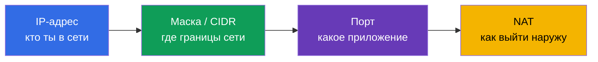
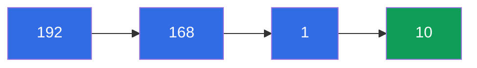
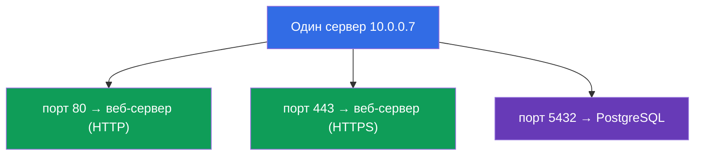
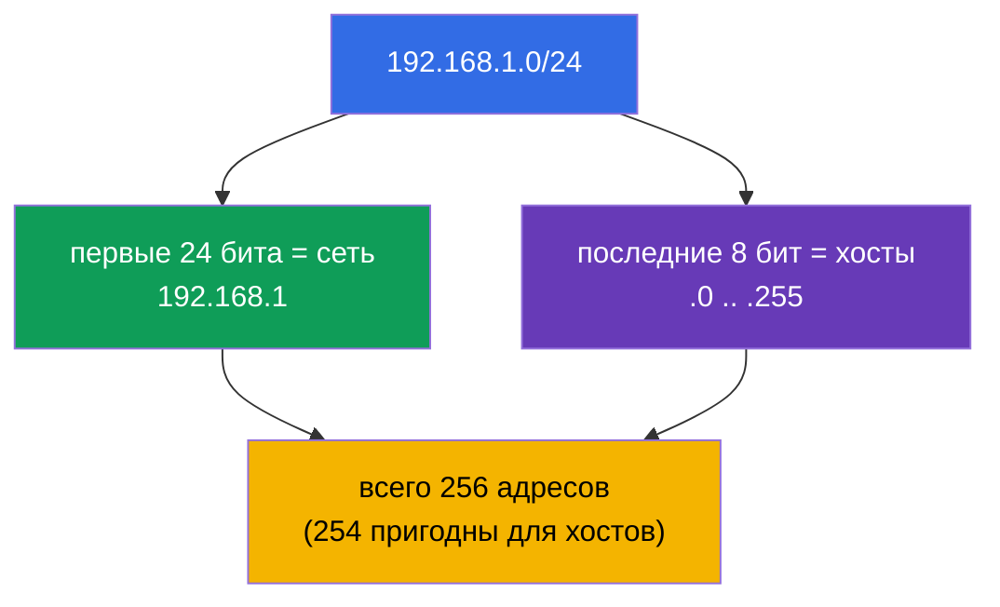
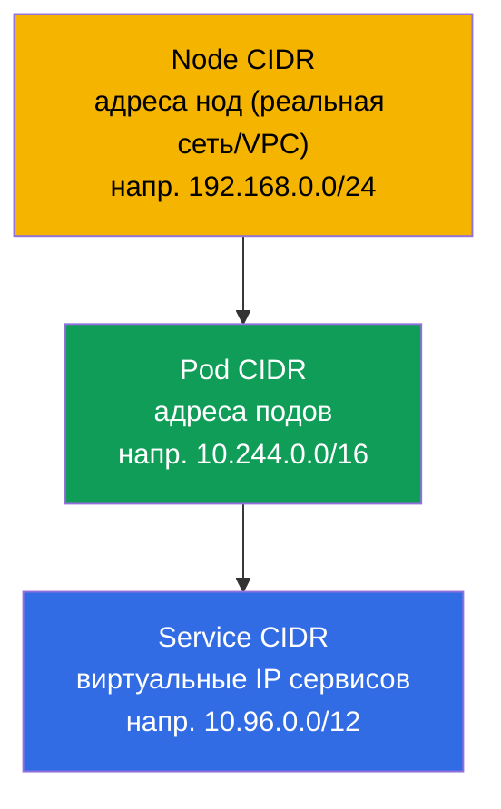
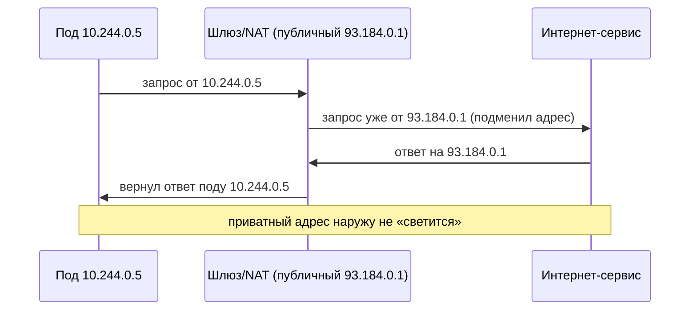

# Глава 0.1. Сеть с нуля: IP, порты, CIDR и NAT

> **Для кого эта глава.** Это глава части 0 - «нулевого» фундамента для тех, кто
> приходит в Kubernetes без крепкой базы по сетям. Если вы уверенно объясняете, что
> такое IP-адрес, маска подсети, запись `10.0.0.0/16`, порт и NAT, - смело
> пропускайте её и начинайте с главы 1. Если же слова «CIDR» или «приватная сеть»
> вызывают заминку, потратьте здесь полчаса: почти весь домен Services & Networking
> обоих экзаменов и весь сетевой troubleshooting стоят на этих понятиях. Мы объясним
> всё с нуля, без академизма, и сразу свяжем с тем, где это всплывёт в Kubernetes.

## 0.1.1. Зачем сетевику-новичку это в курсе по Kubernetes

Kubernetes - это в первую очередь распределённая сеть: поды получают IP, сервисы
живут на виртуальных IP, трафик ходит между нодами, `Pod CIDR` и `Service CIDR`
задаются при установке кластера. Когда в главе 30 вы увидите `--pod-network-cidr=
10.244.0.0/16`, а в главе 7 - `ClusterIP` из диапазона `10.96.0.0/12`, всё это должно
читаться так же легко, как обычный текст. Разберём кирпичики по порядку.

## 0.1.2. IP-адрес: адрес в сети

**IP-адрес** - это числовой адрес устройства в сети, как почтовый адрес дома. Пока
говорим про самый распространённый вариант - **IPv4**: четыре числа от 0 до 255,
разделённые точками, например `192.168.1.10`. Каждое из четырёх чисел - это один
**октет** (8 бит), а весь адрес - 32 бита.

Важно с самого начала различать два вида адресов:

| Вид | Диапазоны | Где живёт | Пример |
|-----|-----------|-----------|--------|
| **Приватный** | `10.0.0.0/8`, `172.16.0.0/12`, `192.168.0.0/16` | внутри вашей сети, не виден в интернете | `10.244.0.5` (под) |
| **Публичный** | всё остальное | виден в интернете напрямую | `93.184.216.34` |

Поды и сервисы Kubernetes почти всегда живут в **приватных** диапазонах. Именно
поэтому под с адресом `10.244.0.5` недоступен из интернета напрямую - к нему нужен
Service, Ingress или NAT (об этом ниже и в части 7).

## 0.1.3. Порт: какое приложение на устройстве

IP-адрес указывает на устройство, но на одном устройстве работают десятки программ.
Чтобы понять, какой именно программе адресован трафик, используется **порт** - число
от 0 до 65535. Пара «IP + порт» однозначно указывает на конкретное приложение.

Несколько портов стоит знать наизусть - они постоянно встречаются в курсе:

| Порт | Что обычно слушает |
|------|--------------------|
| **80** | HTTP (веб без шифрования) |
| **443** | HTTPS (веб с TLS, глава 0.3) |
| **53** | DNS (глава 0.2) |
| **22** | SSH (заходим на ноды в лабах) |
| **6443** | kube-apiserver (сердце control plane) |
| **2379/2380** | etcd (хранилище кластера, глава 37) |
| **10250** | kubelet |

Когда в манифесте пода вы пишете `containerPort: 8080`, а в Service - `targetPort:
8080` и `port: 80`, вы работаете ровно с этими понятиями: на каком порту слушает
приложение и на какой порт приходит трафик.

## 0.1.4. Маска подсети и запись CIDR

Адрес мало иметь - надо понимать **границы сети**: какие адреса «свои» (в той же
локальной сети, доступны напрямую), а какие - «чужие» (за маршрутизатором). Это
задаёт **маска подсети**.

Идея простая: адрес делится на две части - **адрес сети** (общий для всех соседей) и
**адрес хоста** (уникальный внутри сети). Маска говорит, сколько первых бит - это сеть.

Раньше маску писали как `255.255.255.0`. Сегодня используют компактную запись **CIDR**
(Classless Inter-Domain Routing): после адреса ставят `/N`, где `N` - число бит,
отведённых под сеть.

Читать `/N` нужно так: **чем больше N, тем меньше сеть** (меньше адресов, но больше
бит зафиксировано под сеть).

| CIDR | Бит под сеть | Адресов в сети | Типичное применение |
|------|--------------|----------------|---------------------|
| `/8` | 8 | ~16,7 млн | огромный приватный блок `10.0.0.0/8` |
| `/16` | 16 | 65 536 | сеть VPC, `Pod CIDR` кластера |
| `/24` | 24 | 256 | обычная подсеть/сегмент |
| `/32` | 32 | 1 | ровно один адрес (один хост) |

Три числа стоит просто запомнить: `/24` = 256 адресов, `/16` = 65 536, `/8` = ~16 млн.
Этого хватит, чтобы «на глаз» оценивать размеры сетей в кластере.

## 0.1.5. Где CIDR всплывает в Kubernetes

Это не абстракция - в Kubernetes три разных CIDR-пространства, и путать их нельзя
(подробно в главе 30):

- **Node CIDR** - в какой сети находятся сами серверы (ноды).
- **Pod CIDR** (`--pod-network-cidr`) - из какого диапазона поды получают адреса.
- **Service CIDR** (`--service-cidr`) - из какого диапазона выдаются виртуальные
  `ClusterIP` сервисов.

Правило, которое спасает от боли: **эти три диапазона не должны пересекаться** ни
между собой, ни с корпоративной сетью. Пересечение CIDR - классическая причина
«поды не видят друг друга» и «кластер не поднимается».

## 0.1.6. NAT: как приватный адрес выходит наружу

Приватные адреса (`10.x`, `192.168.x`) не маршрутизируются в интернете. Как же под с
адресом `10.244.0.5` скачивает образ из интернета? Через **NAT (Network Address
Translation)** - подмену адресов на маршрутизаторе: исходящий трафик «прикидывается»
идущим от публичного адреса шлюза, а ответы возвращаются обратно нужному отправителю.

Ключевая связка с сетевой моделью Kubernetes (глава 30): **внутри** кластера поды
общаются **без NAT** (плоская сеть, каждый видит реальный IP другого), а **наружу**
трафик выходит **через NAT**. Это правило легко запомнить: «свои - напрямую, чужие -
через шлюз».

## 0.1.7. Как это применяют в продакшене

- **Планирование CIDR - на старте, не потом.** Диапазоны Pod/Service/Node
  согласуют с сетью компании до создания кластера. Слишком маленький `Pod CIDR`
  упирается в потолок числа подов при росте - переделывать больно.
- **Приватные кластеры.** Ноды и поды сидят в приватных подсетях, наружу ходят через
  NAT-шлюз, а входящий трафик принимает балансировщик/Ingress. Это стандарт
  безопасности в облаках.
- **Порты и firewall.** Между нодами должны быть открыты конкретные порты (6443,
  2379/2380, 10250 и т.д.). «Кластер не поднялся» часто = закрытый порт на
  firewall/Security Group.
- **Диагностика по паре IP+порт.** Инженер в инциденте первым делом смотрит: тот ли
  IP, тот ли порт, та ли подсеть, нет ли пересечения CIDR. Это язык, на котором
  описывают сетевые проблемы.

## 0.1.8. Мини-глоссарий

- **IP-адрес** - числовой адрес устройства в сети (IPv4: четыре октета, 32 бита).
- **Октет** - одно из четырёх чисел IPv4-адреса (8 бит, 0-255).
- **Приватный / публичный адрес** - адрес внутри своей сети / видимый в интернете.
- **Порт** - число 0-65535, указывающее приложение на устройстве.
- **Маска подсети** - что в адресе относится к сети, а что к хосту.
- **CIDR** - запись `адрес/N`, где `N` - число бит под сеть; больше N - меньше сеть.
- **Адрес сети / адрес хоста** - общая часть соседей / уникальная часть устройства.
- **NAT** - подмена адресов на шлюзе, чтобы приватный трафик вышел наружу.
- **Pod / Service / Node CIDR** - диапазоны адресов подов / виртуальных IP сервисов /
  нод; не должны пересекаться.

## 0.1.9. Итоги главы

- IP-адрес (IPv4) - 32 бита, четыре октета; бывает приватным (внутри сети) и
  публичным (в интернете). Поды и сервисы живут в приватных диапазонах.
- Порт (0-65535) указывает приложение; пара «IP + порт» - конкретный сервис.
- CIDR-запись `/N` задаёт границу сети: чем больше N, тем меньше адресов (`/24` = 256,
  `/16` = 65 536, `/8` = ~16 млн).
- В Kubernetes три непересекающихся CIDR: Node, Pod, Service. Пересечение - частая
  причина сетевых сбоев.
- NAT подменяет адреса на шлюзе для выхода приватного трафика наружу; внутри кластера
  поды общаются без NAT (плоская сеть, глава 30).

## 0.1.10. Как это пригодится: на экзамене и в реальной работе

**На экзамене.** Прямых заданий «посчитай маску» нет, но без этой базы не понять
установку кластера (глава 35: `--pod-network-cidr`), сетевую модель (глава 30) и
сетевой troubleshooting (30% CKA). Умение прочитать `10.244.0.0/16` и `10.96.0.0/12`
и не спутать Pod/Service CIDR экономит время в каждой сетевой задаче.

**В реальной работе.** Планирование адресного пространства кластера, настройка
firewall и NAT, разбор инцидентов «под не достучался до сервиса» - всё это ежедневная
работа платформенного инженера, и вся она говорит на языке IP, портов и CIDR.

## 0.1.11. Вопросы для самопроверки

1. Из скольких бит состоит IPv4-адрес и что такое октет?
2. Чем приватный адрес отличается от публичного? В каком диапазоне живут поды?
3. Что означает запись `10.244.0.0/16` и сколько в ней примерно адресов?
4. Почему больший `N` в `/N` даёт меньшую сеть?
5. Назовите три CIDR-пространства Kubernetes. Почему они не должны пересекаться?
6. Что делает NAT и почему поды внутри кластера общаются без NAT?

## Практика

Отдельной лабы для части 0 нет - это подготовительный фундамент. Практика начнётся,
когда в главе 1 вы поднимете учебный кластер, а сетевые темы будете отрабатывать в
лабах по сети. Дальше - как имена превращаются в адреса.

---
[Оглавление](../README_RU.md) · [Глава 0.2](../00-2-dns/ru.md)
