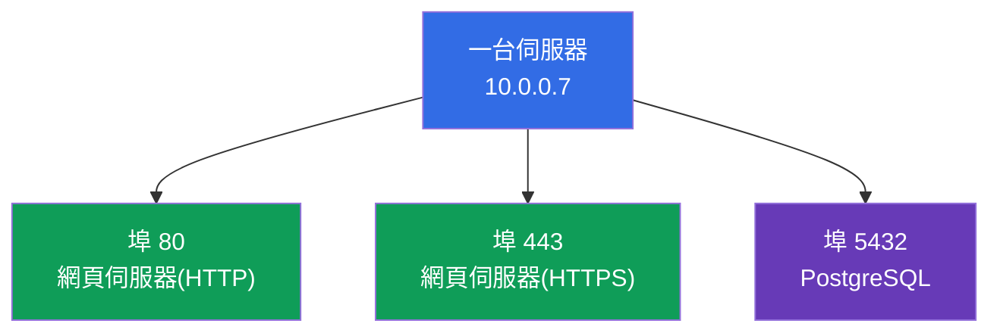
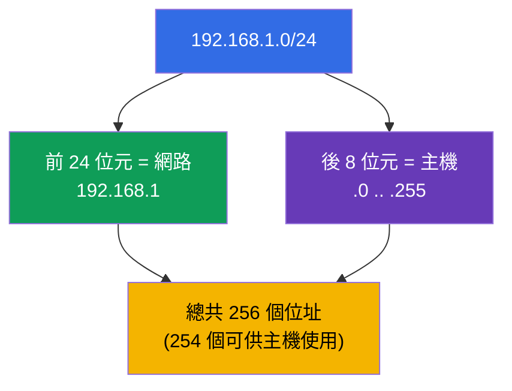
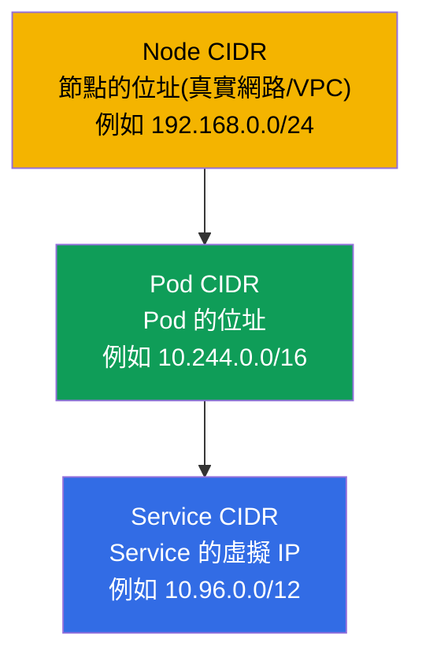
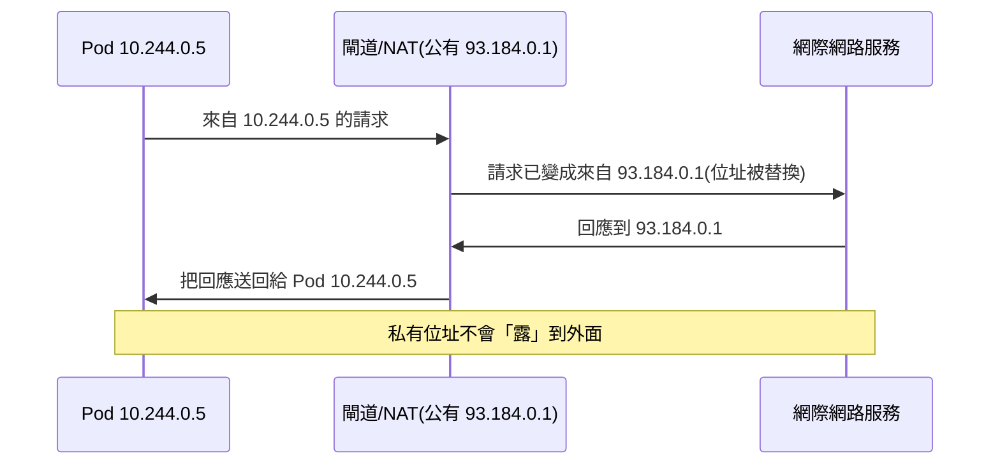

[Русская версия](ru.md) · [Eng version](README.md) · [Versión en español](es.md) · [Version française](fr.md) · [Deutsche Version](de.md) · [ქართული ვერსია](ge.md) · [日本語版](jp.md)

# 第 0.1 章。從零開始學網路:IP、埠、CIDR 與 NAT

> **這一章適合誰。** 這是第 0 部分的章節 - 為那些沒有紮實網路基礎就
> 進入 Kubernetes 的人準備的「零號」地基。如果你能自信地說明什麼是
> IP 位址、子網路遮罩、`10.0.0.0/16` 這種寫法、埠與 NAT,那就大方
> 跳過它,直接從第 1 章開始。但如果「CIDR」或「私有網路」這些詞會讓你
> 卡住,就在這裡花上半小時:兩場考試的 Services & Networking 領域幾乎
> 全部內容,以及所有網路 troubleshooting,都建立在這些概念之上。我們會
> 從零講起,不談學術腔,並立刻連結到它們在 Kubernetes 中出現的地方。

## 0.1.1. 為什麼網路新手在 Kubernetes 課程中需要這一章

Kubernetes 首先是一個分散式網路:Pod 取得 IP、Service 活在虛擬 IP 上、
流量在節點之間流動,而 `Pod CIDR` 與 `Service CIDR` 在安裝叢集時就已指定。
當你在第 30 章看到 `--pod-network-cidr=
10.244.0.0/16`,在第 7 章看到來自 `10.96.0.0/12` 範圍的 `ClusterIP`,這一切
都應該像普通文字一樣好讀。我們按順序把這些基礎磚塊拆開來看。

## 0.1.2. IP 位址:網路中的位址

**IP 位址** 是裝置在網路中的數字位址,就像房子的郵政地址。目前我們
談的是最常見的版本 - **IPv4**:四個從 0 到 255 的數字,以點分隔,
例如 `192.168.1.10`。這四個數字中的每一個就是一個
**八位元組**(8 位元),而整個位址是 32 位元。

從一開始就必須區分兩種位址:

| 類型 | 範圍 | 存在於哪裡 | 範例 |
|-----|-----------|-----------|--------|
| **私有** | `10.0.0.0/8`, `172.16.0.0/12`, `192.168.0.0/16` | 在你自己的網路內部,在網際網路上看不到 | `10.244.0.5`(Pod) |
| **公有** | 其他全部 | 在網際網路上直接可見 | `93.184.216.34` |

Kubernetes 的 Pod 與 Service 幾乎總是活在 **私有** 範圍中。正因如此,
位址為 `10.244.0.5` 的 Pod 無法從網際網路直接存取 - 它需要
Service、Ingress 或 NAT(下面以及第 7 部分會談到)。

## 0.1.3. 埠:裝置上的哪個應用程式

IP 位址指向裝置,但一台裝置上會執行數十個程式。
為了知道流量究竟是寄給哪個程式,就要用 **埠** - 一個
從 0 到 65535 的數字。「IP + 埠」這一組能明確指向某個具體的應用程式。

有幾個埠值得背下來 - 它們在課程中不斷出現:

| 埠 | 通常在監聽什麼 |
|------|--------------------|
| **80** | HTTP(未加密的網頁) |
| **443** | HTTPS(帶 TLS 的網頁,第 0.3 章) |
| **53** | DNS(第 0.2 章) |
| **22** | SSH(在實驗中登入節點) |
| **6443** | kube-apiserver(control plane 的心臟) |
| **2379/2380** | etcd(叢集的儲存,第 37 章) |
| **10250** | kubelet |

當你在 Pod 的 manifest 中寫 `containerPort: 8080`,而在 Service 中寫 `targetPort:
8080` 與 `port: 80` 時,你處理的正是這些概念:應用程式在哪個埠上監聽,
以及流量到達哪個埠。

## 0.1.4. 子網路遮罩與 CIDR 寫法

光有位址還不夠 - 還要理解 **網路邊界**:哪些位址是「自己人」(在同一個
區域網路內,可直接存取),哪些是「外人」(在路由器後面)。這由
**子網路遮罩** 決定。

想法很簡單:位址分成兩部分 - **網路位址**(所有鄰居共用)與
**主機位址**(在網路內部唯一)。遮罩說明前面有多少位元屬於網路。

以前遮罩寫成 `255.255.255.0`。今天使用緊湊的 **CIDR** 寫法
(Classless Inter-Domain Routing):在位址後面加上 `/N`,其中 `N` 是
分配給網路的位元數。

`/N` 要這樣讀:**N 越大,網路越小**(位址更少,但有更多
位元被固定給網路)。

| CIDR | 網路位元數 | 網路中的位址數 | 典型用途 |
|------|--------------|----------------|---------------------|
| `/8` | 8 | 約 1670 萬 | 巨大的私有區塊 `10.0.0.0/8` |
| `/16` | 16 | 65 536 | VPC 網路、叢集的 `Pod CIDR` |
| `/24` | 24 | 256 | 一般的子網路/網段 |
| `/32` | 32 | 1 | 剛好一個位址(單一主機) |

有三個數字值得直接記住:`/24` = 256 個位址,`/16` = 65 536,`/8` = 約 1670 萬。
這足以讓你「憑感覺」估算叢集中網路的大小。

## 0.1.5. CIDR 在 Kubernetes 中出現在哪裡

這不是抽象概念 - 在 Kubernetes 中有三個不同的 CIDR 空間,不能混淆
(詳見第 30 章):

- **Node CIDR** - 伺服器(節點)本身位於哪個網路。
- **Pod CIDR**(`--pod-network-cidr`) - Pod 從哪個範圍取得位址。
- **Service CIDR**(`--service-cidr`) - Service 的虛擬 `ClusterIP`
  從哪個範圍發出。

一條能免除痛苦的規則:**這三個範圍不能互相重疊**,也不能
與公司網路重疊。CIDR 重疊是「Pod 之間看不到彼此」與
「叢集起不來」的經典原因。

## 0.1.6. NAT:私有位址如何連到外面

私有位址(`10.x`、`192.168.x`)在網際網路上不會被路由。那麼位址為
`10.244.0.5` 的 Pod 是怎麼從網際網路下載映像的?透過 **NAT(Network Address
Translation)** - 在路由器上替換位址:出去的流量「假裝」成
來自閘道的公有位址,而回應會被送回給正確的發送者。

與 Kubernetes 網路模型的關鍵連結(第 30 章):在叢集 **內部**,Pod
之間 **不經過 NAT** 通訊(扁平網路,彼此都看到對方真實的 IP),而 **對外**
流量則 **經過 NAT**。這條規則很好記:「自己人 - 直接走,外人 -
走閘道」。

## 0.1.7. 這在生產環境中如何應用

- **CIDR 規劃要在一開始做,不是事後。** Pod/Service/Node 的範圍
  要在建立叢集之前與公司網路協調好。`Pod CIDR` 太小,
  在成長時會撞到 Pod 數量的天花板 - 重做很痛苦。
- **私有叢集。** 節點與 Pod 位於私有子網路中,對外透過
  NAT 閘道連線,而進來的流量由負載平衡器/Ingress 接收。這是雲端上的
  安全標準。
- **埠與 firewall。** 節點之間必須開放特定的埠(6443、
  2379/2380、10250 等)。「叢集起不來」常常等於 firewall/Security Group
  上有埠被關閉。
- **用 IP+埠這一組來診斷。** 工程師在事故中第一件事就是看:IP 對不對、
  埠對不對、子網路對不對、CIDR 有沒有重疊。這就是描述
  網路問題所用的語言。

## 0.1.8. 迷你詞彙表

- **IP 位址** - 裝置在網路中的數字位址(IPv4:四個八位元組,32 位元)。
- **八位元組** - IPv4 位址中四個數字之一(8 位元,0-255)。
- **私有 / 公有位址** - 在自己網路內部的位址 / 在網際網路上可見的位址。
- **埠** - 0-65535 的數字,指出裝置上的應用程式。
- **子網路遮罩** - 位址中哪部分屬於網路,哪部分屬於主機。
- **CIDR** - `位址/N` 這種寫法,其中 `N` 是網路的位元數;N 越大 - 網路越小。
- **網路位址 / 主機位址** - 鄰居共用的部分 / 裝置獨有的部分。
- **NAT** - 在閘道上替換位址,讓私有流量能連到外面。
- **Pod / Service / Node CIDR** - Pod 位址 / Service 虛擬 IP /
  節點的位址範圍;不能重疊。

## 0.1.9. 本章總結

- IP 位址(IPv4) - 32 位元,四個八位元組;可以是私有的(在網路內部)或
  公有的(在網際網路上)。Pod 與 Service 活在私有範圍中。
- 埠(0-65535)指出應用程式;「IP + 埠」這一組就是一個具體的服務。
- CIDR 寫法 `/N` 決定網路邊界:N 越大,位址越少(`/24` = 256,
  `/16` = 65 536,`/8` = 約 1670 萬)。
- 在 Kubernetes 中有三個互不重疊的 CIDR:Node、Pod、Service。重疊是網路
  故障的常見原因。
- NAT 在閘道上替換位址,讓私有流量能連到外面;在叢集內部
  Pod 之間不經過 NAT 通訊(扁平網路,第 30 章)。

## 0.1.10. 這些知識用在哪裡:考試與實際工作

**在考試中。** 沒有直接「算遮罩」的題目,但少了這個基礎,就看不懂
叢集安裝(第 35 章:`--pod-network-cidr`)、網路模型(第 30 章)與
網路 troubleshooting(CKA 的 30%)。能讀懂 `10.244.0.0/16` 與 `10.96.0.0/12`
並且不把 Pod/Service CIDR 搞混,能在每一道網路題上省下時間。

**在實際工作中。** 規劃叢集的位址空間、設定 firewall 與
NAT、分析「Pod 連不到 Service」這類事故 - 這一切都是平台工程師的
日常工作,而它們全都講著 IP、埠與 CIDR 的語言。

## 0.1.11. 自我檢查問題

1. IPv4 位址由多少位元組成,什麼是八位元組?
2. 私有位址與公有位址有什麼不同?Pod 活在哪個範圍中?
3. `10.244.0.0/16` 這個寫法是什麼意思,裡面大約有多少個位址?
4. 為什麼 `/N` 中的 `N` 越大,網路反而越小?
5. 說出 Kubernetes 的三個 CIDR 空間。為什麼它們不能重疊?
6. NAT 做什麼,以及為什麼叢集內部的 Pod 之間不經過 NAT 通訊?

## 實務練習

第 0 部分沒有獨立的實驗 - 這是準備性的地基。實務練習會在第 1 章
你架起學習用叢集時開始,而網路主題則會在網路相關的
實驗中操練。接下來 - 名稱如何變成位址。

---
[目錄](../README_TW.md) · [第 0.2 章](../00-2-dns/tw.md)
