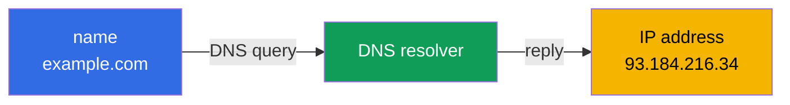
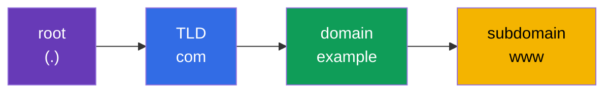
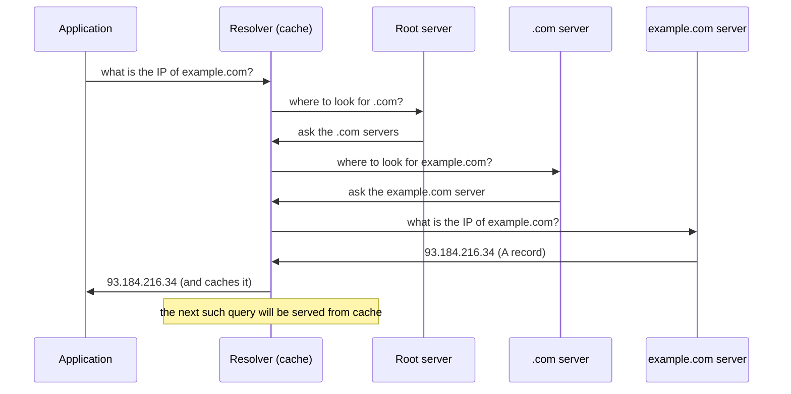
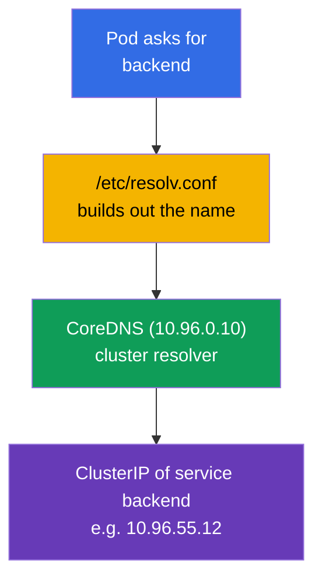

[Русская версия](ru.md) · [Versión en español](es.md) · [Version française](fr.md) · [Deutsche Version](de.md) · [ქართული ვერსია](ge.md) · [繁體中文版](tw.md) · [日本語版](jp.md)

# Chapter 0.2. DNS from scratch: how names turn into addresses

> **Who this chapter is for.** We continue the zero foundation. If you understand what
> DNS, an A record, and recursive resolution are, - skip ahead to Chapter 0.3. If not -
> this chapter gives exactly the minimum without which you can't understand CoreDNS
> (Chapter 31), service names like `backend.default.svc.cluster.local`, and half of
> network troubleshooting. In a cluster almost everything communicates by names, not by
> IP, so DNS is not a detail but a load-bearing structure.

## 0.2.1. The problem DNS solves

IP addresses change, they're impossible to remember, and in Kubernetes a pod's IP is
temporary altogether: the pod was recreated - a different address. You can't rely on
"raw" IPs. **DNS (Domain Name System)** solves this: it translates a **human-readable
name** into an IP address, just as a phone book translates a contact's name into a
number.



The main idea: the application works with a **name**, while the infrastructure (DNS)
substitutes the current **address** beneath it. The name is stable, the address behind
it can change - this is exactly the decoupling on which Services and microservices rest.

## 0.2.2. How a domain name is structured

A name is read **right to left**, from general to specific. Dots separate the levels.



- **Root** - the invisible dot at the very end (`example.com.`).
- **TLD** (top-level domain) - `com`, `org`, `ru`.
- **Second-level domain** - `example`.
- **Subdomain** - `www`, `api`, `mail`.

Names in Kubernetes are structured exactly the same way, only with their own levels:
`backend.default.svc.cluster.local` = service `backend` in namespace `default`, section
`svc`, cluster zone `cluster.local`. After reading the chapter, you'll parse such names
automatically.

## 0.2.3. Record types you need to know

DNS stores more than just "name → IPv4". Several record types come up constantly:

| Record | What it sets | Example |
|--------|--------------|---------|
| **A** | name → IPv4 | `example.com → 93.184.216.34` |
| **AAAA** | name → IPv6 | `example.com → 2606:2800:220:1:...` |
| **CNAME** | alias → another name | `www.example.com → example.com` |
| **PTR** | IP → name (reverse resolution) | `34.216.184.93.in-addr.arpa → example.com` |
| **SRV** | service/port for a name | used for headless services |

For the course, the most important are **A** (direct name→IP mapping) and understanding
that **reverse resolution** exists (PTR: find a name by IP). CoreDNS in the cluster
(Chapter 31) serves exactly such records for services and pods.

## 0.2.4. How resolution happens: the path of a query

When a program wants to find out an IP by name, it doesn't ask "the internet's main
server". The query travels along a chain where each level points to the next.



Two points critical for troubleshooting:

- **Caching and TTL.** Each record has a **TTL** (time to live) - how many seconds it
  may be kept in the cache. While the TTL hasn't expired, the answer is taken from the
  cache instead of being asked again. Hence the classic: "I changed the record, but the
  old address still answers" - we wait out the TTL.
- **The resolver** - the one that does this whole walk on the application's behalf. In
  the cluster the role of the resolver is played by **CoreDNS**.

## 0.2.5. Where the application gets the DNS server address

On Linux the list of DNS servers and the name search rules live in the file
`/etc/resolv.conf`:

```text
nameserver 10.96.0.10
search default.svc.cluster.local svc.cluster.local cluster.local
```

- `nameserver` - where to send DNS queries (in the cluster this is the ClusterIP of the
  CoreDNS service).
- `search` - which suffixes to append to short names. Thanks to this, inside a pod it's
  enough to write `backend`, and the system builds out
  `backend.default.svc.cluster.local` on its own.

This is exactly why in Chapter 31 a short service name resolves "magically" - behind the
magic stands this `search` list, which kubelet writes into the pod automatically.

## 0.2.6. DNS in Kubernetes: a short bridge to Chapter 31



Service name resolution scheme: the pod asks for a short name → `resolv.conf` builds out
the full one → CoreDNS returns the ClusterIP → traffic goes to the service. All of this
is ordinary DNS, only the resolver is internal. We'll go through it in detail in
Chapter 31.

## 0.2.7. How this is applied in production

- **Service discovery via DNS.** Microservices find each other by names, not by IP: pod
  addresses are ephemeral, while a service name is stable. This is the foundation of
  application connectivity.
- **DNS is a frequent root of incidents.** "Nothing works" is surprisingly often = DNS:
  CoreDNS went down, a wrong `search` domain, a stuck TTL after a move. Checking DNS is
  one of the first diagnostic steps.
- **TTL as a tool.** Before migrating a service, the TTL is lowered in advance so that
  the address switch propagates quickly, without "half the clients on the old IP".
- **Internal and external DNS.** Inside the cluster names are resolved by CoreDNS;
  outward, public names lead to a load balancer/Ingress. Understanding both sides is
  needed to trace the path of a request from user to pod.

## 0.2.8. Mini-glossary

- **DNS** - the system for translating domain names into IP addresses.
- **Resolver** - the component that performs DNS queries on behalf of the application
  (in the cluster - CoreDNS).
- **TLD** - the top-level domain (`com`, `org`, `ru`).
- **A record / AAAA record** - name → IPv4 / name → IPv6.
- **CNAME** - an alias pointing to another name.
- **PTR** - the reverse record: IP → name.
- **TTL** - the record's lifetime in the cache (in seconds).
- **`/etc/resolv.conf`** - the file with DNS server addresses and `search` suffixes.
- **search domain** - a suffix automatically appended to short names.
- **FQDN** - the fully qualified domain name with all levels (e.g. `backend.default.svc.cluster.local`).

## 0.2.9. Chapter summary

- DNS translates stable names into changeable IPs - the decoupling on which services and
  microservices rest.
- A name is read right to left: root → TLD → domain → subdomain; Kubernetes names are
  structured the same way (`svc.cluster.local`).
- Key records: A (name→IPv4), AAAA (IPv6), CNAME (alias), PTR (reverse).
- Resolution goes along a chain of servers with caching; TTL determines how long an
  answer lives in the cache.
- `/etc/resolv.conf` sets the DNS server and `search` suffixes; in a pod kubelet writes
  them, so short service names resolve (Chapter 31).

## 0.2.10. How this helps: on the exam and in real work

**On the exam.** DNS is the foundation of Chapter 31 (CoreDNS) and of network
troubleshooting. Tasks like "the pod doesn't resolve the service", "check DNS" can only
be solved if you understand how resolution, `search` domains, and the full service name
work. The `nslookup`/`dig` utilities from a pod are a standard diagnostic technique.

**In real work.** Service discovery, analyzing CoreDNS incidents, managing TTL during
migrations, connecting internal and external DNS - constant operational tasks. DNS
problems are treacherous because they masquerade as "anything not working", so the
basics save hours.

## 0.2.11. Self-check questions

1. What problem does DNS solve, and why in Kubernetes can't you rely on pod IPs?
2. How is a domain name read, and how does that relate to `backend.default.svc.cluster.local`?
3. How does an A record differ from CNAME and PTR?
4. What is TTL, and how does a "stuck" cache manifest after an address change?
5. Why is a `search` domain needed in `/etc/resolv.conf`, and how does it help short names?
6. Who plays the role of the resolver inside the cluster?

## Practice

There's no separate lab for Part 0. You'll practice service name resolution hands-on in
the networking labs, once you reach CoreDNS (Chapter 31). Next up - how traffic is
protected: TLS and certificates.

---
[Contents](../README.md) · [Chapter 0.1](../00-1-net/README.md) · [Chapter 0.3](../00-3-tls/README.md)
