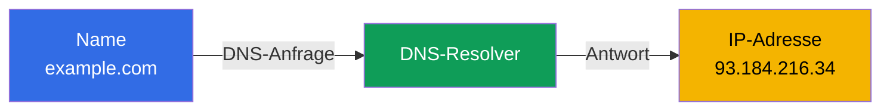
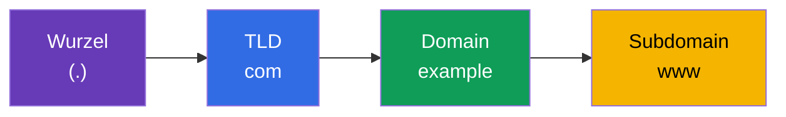
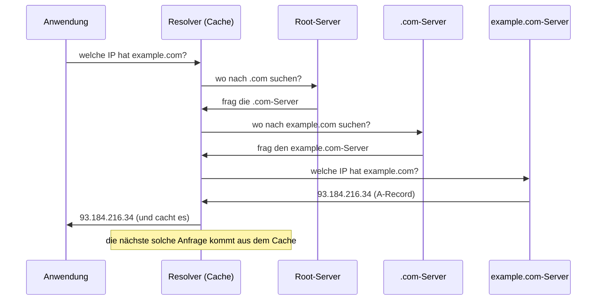
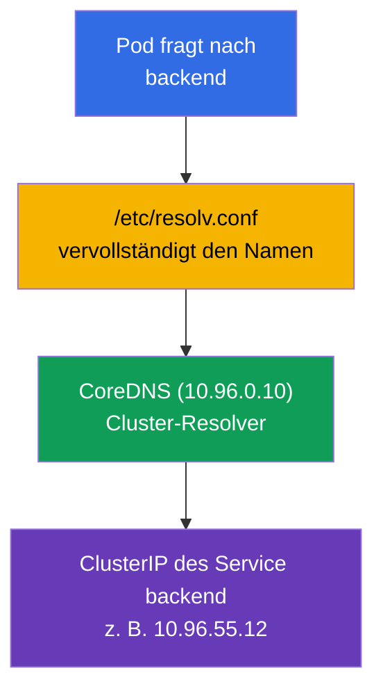

[Русская версия](ru.md) · [Eng version](README.md) · [Versión en español](es.md) · [Version française](fr.md) · [ქართული ვერსია](ge.md)

# Kapitel 0.2. DNS von Grund auf: wie Namen zu Adressen werden

> **Für wen dieses Kapitel ist.** Wir setzen das Null-Fundament fort. Wenn Sie
> verstehen, was DNS, ein A-Record und rekursive Auflösung sind, - springen Sie zu
> Kapitel 0.3. Wenn nicht - dieses Kapitel liefert genau das Minimum, ohne das man
> CoreDNS (Kapitel 31), Servicenamen wie `backend.default.svc.cluster.local` und die
> Hälfte des Netzwerk-Troubleshootings nicht versteht. In einem Cluster kommuniziert
> fast alles über Namen, nicht über IP, deshalb ist DNS kein Detail, sondern eine
> tragende Konstruktion.

## 0.2.1. Das Problem, das DNS löst

IP-Adressen ändern sich, sie sind unmöglich zu merken, und in Kubernetes ist die IP
eines Pods überhaupt temporär: Der Pod wurde neu erstellt - eine andere Adresse. Mit
"rohen" IPs zu arbeiten geht nicht. **DNS (Domain Name System)** löst das: Es übersetzt
einen **menschenlesbaren Namen** in eine IP-Adresse, so wie ein Telefonbuch den Namen
eines Kontakts in eine Nummer übersetzt.



Der Grundgedanke: Die Anwendung arbeitet mit einem **Namen**, und die Infrastruktur
(DNS) setzt darunter die aktuelle **Adresse** ein. Der Name ist stabil, die Adresse
dahinter kann sich ändern - genau das ist die Entkopplung, auf der Service und
Microservices ruhen.

## 0.2.2. Wie ein Domainname aufgebaut ist

Ein Name wird **von rechts nach links** gelesen, vom Allgemeinen zum Speziellen. Punkte
trennen die Ebenen.



- **Wurzel** - der unsichtbare Punkt ganz am Ende (`example.com.`).
- **TLD** (top-level domain) - `com`, `org`, `ru`.
- **Domain zweiter Ebene** - `example`.
- **Subdomain** - `www`, `api`, `mail`.

Genauso sind die Namen in Kubernetes aufgebaut, nur mit eigenen Ebenen:
`backend.default.svc.cluster.local` = Service `backend` im Namespace `default`,
Abschnitt `svc`, Cluster-Zone `cluster.local`. Nach dem Lesen des Kapitels zerlegen Sie
solche Namen automatisch.

## 0.2.3. Record-Typen, die man kennen muss

DNS speichert nicht nur "Name → IPv4". Mehrere Record-Typen begegnen einem ständig:

| Record | Was er festlegt | Beispiel |
|--------|-----------------|----------|
| **A** | Name → IPv4 | `example.com → 93.184.216.34` |
| **AAAA** | Name → IPv6 | `example.com → 2606:2800:220:1:...` |
| **CNAME** | Alias → anderer Name | `www.example.com → example.com` |
| **PTR** | IP → Name (Reverse-Auflösung) | `34.216.184.93.in-addr.arpa → example.com` |
| **SRV** | Service/Port für einen Namen | wird für Headless-Services verwendet |

Für den Kurs am wichtigsten sind **A** (direkte Zuordnung Name→IP) und das Verständnis,
dass es die **Reverse-Auflösung** gibt (PTR: über die IP einen Namen finden). CoreDNS im
Cluster (Kapitel 31) liefert genau solche Records für Services und Pods.

## 0.2.4. Wie die Auflösung abläuft: der Weg einer Anfrage

Wenn ein Programm die IP zu einem Namen herausfinden will, fragt es nicht den
"Hauptserver des Internets". Die Anfrage läuft über eine Kette, in der jede Ebene die
nächste angibt.



Zwei für das Troubleshooting entscheidende Punkte:

- **Caching und TTL.** Jeder Record hat eine **TTL** (time to live) - wie viele Sekunden
  er im Cache gehalten werden darf. Solange die TTL nicht abgelaufen ist, wird die
  Antwort aus dem Cache genommen statt erneut abgefragt. Daher der Klassiker: "Ich habe
  den Record geändert, aber die alte Adresse antwortet noch" - wir warten die TTL ab.
- **Der Resolver** - derjenige, der diesen ganzen Durchlauf für die Anwendung erledigt.
  Im Cluster spielt **CoreDNS** die Rolle des Resolvers.

## 0.2.5. Woher die Anwendung die Adresse des DNS-Servers nimmt

Unter Linux liegen die Liste der DNS-Server und die Regeln für die Namenssuche in der
Datei `/etc/resolv.conf`:

```text
nameserver 10.96.0.10
search default.svc.cluster.local svc.cluster.local cluster.local
```

- `nameserver` - wohin DNS-Anfragen gesendet werden (im Cluster ist das der ClusterIP
  des CoreDNS-Service).
- `search` - welche Suffixe an kurze Namen angehängt werden. Dadurch genügt es, in einem
  Pod `backend` zu schreiben, und das System vervollständigt selbst
  `backend.default.svc.cluster.local`.

Genau deshalb löst sich in Kapitel 31 ein kurzer Servicename "wie von Zauberhand" auf -
hinter dem Zauber steht diese `search`-Liste, die kubelet automatisch in den Pod
schreibt.

## 0.2.6. DNS in Kubernetes: eine kurze Brücke zu Kapitel 31



Schema der Auflösung eines Servicenamens: Der Pod fragt nach einem kurzen Namen →
`resolv.conf` vervollständigt den vollen → CoreDNS liefert den ClusterIP → der Traffic
geht zum Service. All das ist gewöhnliches DNS, nur der Resolver ist intern. Ausführlich
behandeln wir das in Kapitel 31.

## 0.2.7. Wie man das in der Produktion anwendet

- **Service Discovery über DNS.** Microservices finden einander über Namen, nicht über
  IP: Pod-Adressen sind flüchtig, während ein Servicename stabil ist. Das ist die
  Grundlage der Konnektivität von Anwendungen.
- **DNS ist eine häufige Ursache von Vorfällen.** "Nichts funktioniert" ist erstaunlich
  oft = DNS: CoreDNS ist ausgefallen, eine falsche `search`-Domain, eine hängen
  gebliebene TTL nach einem Umzug. Das Prüfen von DNS ist einer der ersten
  Diagnoseschritte.
- **TTL als Werkzeug.** Vor der Migration eines Service senkt man die TTL im Voraus,
  damit der Adresswechsel sich schnell verbreitet, ohne "die Hälfte der Clients auf der
  alten IP".
- **Internes und externes DNS.** Innerhalb des Clusters löst CoreDNS die Namen auf; nach
  außen führen öffentliche Namen zu einem Load Balancer/Ingress. Das Verständnis beider
  Seiten ist nötig, um den Weg einer Anfrage vom Benutzer bis zum Pod zu verfolgen.

## 0.2.8. Mini-Glossar

- **DNS** - das System zur Übersetzung von Domainnamen in IP-Adressen.
- **Resolver** - die Komponente, die DNS-Anfragen für die Anwendung ausführt (im Cluster
  - CoreDNS).
- **TLD** - die Top-Level-Domain (`com`, `org`, `ru`).
- **A-Record / AAAA-Record** - Name → IPv4 / Name → IPv6.
- **CNAME** - ein Alias, der auf einen anderen Namen zeigt.
- **PTR** - der Reverse-Record: IP → Name.
- **TTL** - die Lebensdauer des Records im Cache (in Sekunden).
- **`/etc/resolv.conf`** - die Datei mit den Adressen der DNS-Server und den
  `search`-Suffixen.
- **search-Domain** - ein Suffix, das automatisch an kurze Namen angehängt wird.
- **FQDN** - der vollständige Domainname mit allen Ebenen (z. B. `backend.default.svc.cluster.local`).

## 0.2.9. Zusammenfassung des Kapitels

- DNS übersetzt stabile Namen in veränderliche IPs - die Entkopplung, auf der Services
  und Microservices ruhen.
- Ein Name wird von rechts nach links gelesen: Wurzel → TLD → Domain → Subdomain;
  Kubernetes-Namen sind genauso aufgebaut (`svc.cluster.local`).
- Wichtige Records: A (Name→IPv4), AAAA (IPv6), CNAME (Alias), PTR (Reverse).
- Die Auflösung läuft über eine Kette von Servern mit Caching; die TTL bestimmt, wie
  lange eine Antwort im Cache lebt.
- `/etc/resolv.conf` legt den DNS-Server und die `search`-Suffixe fest; im Pod schreibt
  kubelet sie, deshalb lösen sich kurze Servicenamen auf (Kapitel 31).

## 0.2.10. Wozu das nützt: in der Prüfung und in der realen Arbeit

**In der Prüfung.** DNS ist das Fundament von Kapitel 31 (CoreDNS) und des
Netzwerk-Troubleshootings. Aufgaben wie "der Pod löst den Service nicht auf", "prüfe das
DNS" lassen sich nur lösen, wenn man versteht, wie die Auflösung, die `search`-Domains
und der vollständige Servicename funktionieren. Die Werkzeuge `nslookup`/`dig` aus einem
Pod sind ein Standardgriff der Diagnose.

**In der realen Arbeit.** Service Discovery, das Analysieren von CoreDNS-Vorfällen, das
Verwalten der TTL bei Migrationen, das Verbinden von internem und externem DNS - ständige
Betriebsaufgaben. DNS-Probleme sind tückisch, weil sie sich als "irgendetwas funktioniert
nicht" tarnen, deshalb spart die Grundlage Stunden.

## 0.2.11. Fragen zur Selbstkontrolle

1. Welches Problem löst DNS und warum kann man in Kubernetes nicht über die Pod-IPs arbeiten?
2. Wie wird ein Domainname gelesen und wie hängt das mit `backend.default.svc.cluster.local` zusammen?
3. Wodurch unterscheidet sich ein A-Record von CNAME und PTR?
4. Was ist TTL und wie äußert sich ein "hängen gebliebener" Cache nach einem Adresswechsel?
5. Wozu braucht man eine `search`-Domain in `/etc/resolv.conf` und wie hilft sie kurzen Namen?
6. Wer spielt die Rolle des Resolvers innerhalb des Clusters?

## Praxis

Für Teil 0 gibt es kein eigenes Lab. Die Auflösung von Servicenamen üben Sie praktisch in
den Netzwerk-Labs, sobald Sie zu CoreDNS (Kapitel 31) kommen. Als Nächstes - wie der
Traffic geschützt wird: TLS und Zertifikate.

---
[Inhalt](../README_DE.md) · [Kapitel 0.1](../00-1-net/de.md) · [Kapitel 0.3](../00-3-tls/de.md)
