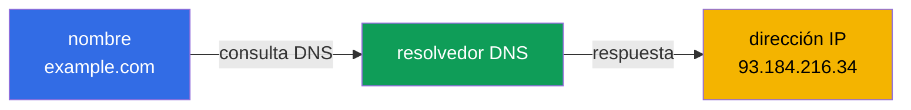
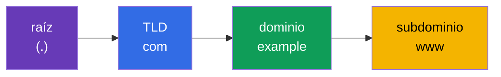
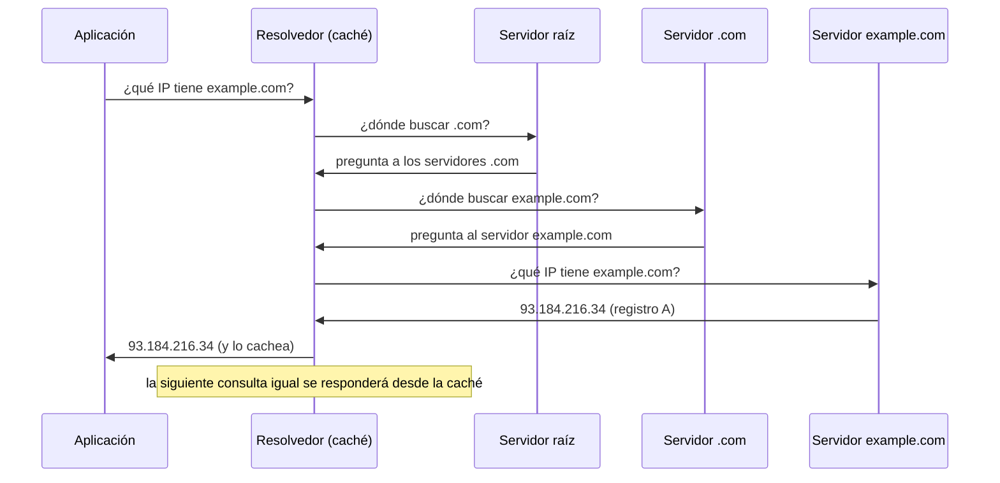
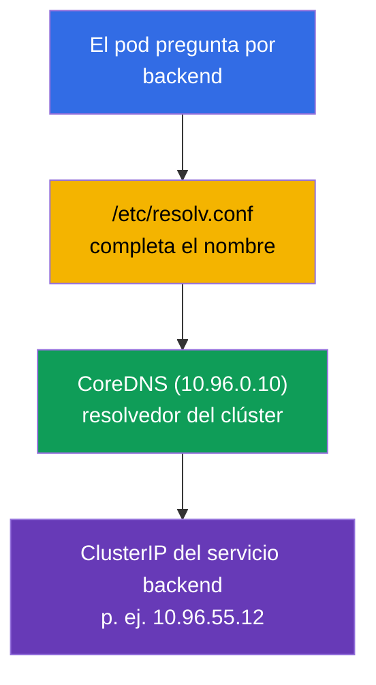

[Русская версия](ru.md) · [Eng version](README.md) · [Version française](fr.md) · [Deutsche Version](de.md) · [ქართული ვერსია](ge.md)

# Capítulo 0.2. DNS desde cero: cómo los nombres se convierten en direcciones

> **Para quién es este capítulo.** Seguimos con la base "cero". Si entiendes qué son
> DNS, un registro A y la resolución recursiva, - pasa al Capítulo 0.3. Si no - este
> capítulo te da justo el mínimo sin el cual no se entiende CoreDNS (Capítulo 31), los
> nombres de servicio del tipo `backend.default.svc.cluster.local` y la mitad de la
> resolución de problemas de red. En un clúster casi todo se comunica por nombres, no
> por IP, por eso DNS no es un detalle sino una estructura portante.

## 0.2.1. El problema que resuelve DNS

Las direcciones IP cambian, es imposible memorizarlas, y en Kubernetes la IP de un pod
es directamente temporal: el pod se recreó - la dirección es otra. No se puede usar IP
"en crudo". **DNS (Domain Name System)** lo resuelve: traduce un **nombre legible por
humanos** a una dirección IP, igual que una guía telefónica traduce el nombre de un
contacto a un número.



La idea principal: la aplicación trabaja con un **nombre**, y la infraestructura (DNS)
coloca por debajo la **dirección** vigente. El nombre es estable, la dirección detrás de
él puede cambiar - ese es justamente el desacoplamiento sobre el que se sostienen los
Service y los microservicios.

## 0.2.2. Cómo se estructura un nombre de dominio

El nombre se lee **de derecha a izquierda**, de lo general a lo particular. Los puntos
separan los niveles.



- **Raíz** - el punto invisible al final del todo (`example.com.`).
- **TLD** (top-level domain) - `com`, `org`, `ru`.
- **Dominio de segundo nivel** - `example`.
- **Subdominio** - `www`, `api`, `mail`.

Los nombres en Kubernetes están estructurados exactamente igual, solo que con sus
propios niveles: `backend.default.svc.cluster.local` = servicio `backend` en el
namespace `default`, sección `svc`, zona del clúster `cluster.local`. Tras leer el
capítulo, analizarás esos nombres automáticamente.

## 0.2.3. Tipos de registros que hay que conocer

DNS no solo guarda "nombre → IPv4". Varios tipos de registros aparecen constantemente:

| Registro | Qué define | Ejemplo |
|----------|------------|---------|
| **A** | nombre → IPv4 | `example.com → 93.184.216.34` |
| **AAAA** | nombre → IPv6 | `example.com → 2606:2800:220:1:...` |
| **CNAME** | alias → otro nombre | `www.example.com → example.com` |
| **PTR** | IP → nombre (resolución inversa) | `34.216.184.93.in-addr.arpa → example.com` |
| **SRV** | servicio/puerto para un nombre | se usa para servicios headless |

Para el curso lo más importante son **A** (correspondencia directa nombre→IP) y entender
que existe la **resolución inversa** (PTR: encontrar un nombre por IP). CoreDNS en el
clúster (Capítulo 31) entrega precisamente esos registros para servicios y pods.

## 0.2.4. Cómo ocurre la resolución: el camino de una consulta

Cuando un programa quiere averiguar la IP por un nombre, no le pregunta al "servidor
principal de internet". La consulta va por una cadena en la que cada nivel indica el
siguiente.



Dos puntos críticos para la resolución de problemas:

- **Caché y TTL.** Cada registro tiene un **TTL** (time to live) - cuántos segundos se
  puede mantener en la caché. Mientras el TTL no expire, la respuesta se toma de la
  caché en lugar de volver a preguntar. De ahí el clásico: "cambié el registro, pero la
  dirección vieja sigue respondiendo" - esperamos a que pase el TTL.
- **El resolvedor** - quien realiza todo ese recorrido en lugar de la aplicación. En el
  clúster el papel de resolvedor lo desempeña **CoreDNS**.

## 0.2.5. De dónde saca la aplicación la dirección del servidor DNS

En Linux la lista de servidores DNS y las reglas de búsqueda de nombres están en el
archivo `/etc/resolv.conf`:

```text
nameserver 10.96.0.10
search default.svc.cluster.local svc.cluster.local cluster.local
```

- `nameserver` - a dónde enviar las consultas DNS (en el clúster es el ClusterIP del
  servicio CoreDNS).
- `search` - qué sufijos añadir a los nombres cortos. Gracias a esto, dentro de un pod
  basta con escribir `backend`, y el sistema completa por sí mismo
  `backend.default.svc.cluster.local`.

Justamente por eso en el Capítulo 31 un nombre corto de servicio se resuelve "por
arte de magia" - detrás de la magia está esta lista `search`, que kubelet escribe en el
pod automáticamente.

## 0.2.6. DNS en Kubernetes: un puente corto hacia el Capítulo 31



Esquema de resolución del nombre de un servicio: el pod pregunta por un nombre corto →
`resolv.conf` completa el completo → CoreDNS entrega el ClusterIP → el tráfico va al
servicio. Todo esto es DNS común, solo que el resolvedor es interno. Lo veremos en
detalle en el Capítulo 31.

## 0.2.7. Cómo se aplica esto en producción

- **Descubrimiento de servicios por DNS.** Los microservicios se encuentran entre sí por
  nombres, no por IP: las direcciones de los pods son efímeras, mientras que el nombre
  de un servicio es estable. Es la base de la conectividad de las aplicaciones.
- **DNS es una raíz frecuente de incidentes.** "No funciona nada" sorprendentemente a
  menudo = DNS: cayó CoreDNS, un dominio `search` mal puesto, un TTL atascado tras una
  mudanza. Comprobar el DNS es uno de los primeros pasos del diagnóstico.
- **TTL como herramienta.** Antes de migrar un servicio se baja el TTL de antemano para
  que el cambio de direcciones se propague rápido, sin "la mitad de los clientes en la
  IP vieja".
- **DNS interno y externo.** Dentro del clúster los nombres los resuelve CoreDNS; hacia
  afuera, los nombres públicos llevan a un balanceador de carga/Ingress. Entender ambos
  lados es necesario para trazar el camino de una petición desde el usuario hasta el pod.

## 0.2.8. Miniglosario

- **DNS** - el sistema de traducción de nombres de dominio a direcciones IP.
- **Resolvedor** - el componente que ejecuta las consultas DNS en lugar de la aplicación
  (en el clúster - CoreDNS).
- **TLD** - el dominio de nivel superior (`com`, `org`, `ru`).
- **Registro A / registro AAAA** - nombre → IPv4 / nombre → IPv6.
- **CNAME** - un alias que apunta a otro nombre.
- **PTR** - el registro inverso: IP → nombre.
- **TTL** - el tiempo de vida del registro en la caché (en segundos).
- **`/etc/resolv.conf`** - el archivo con las direcciones de los servidores DNS y los
  sufijos `search`.
- **dominio search** - un sufijo que se añade automáticamente a los nombres cortos.
- **FQDN** - el nombre de dominio completo con todos los niveles (p. ej. `backend.default.svc.cluster.local`).

## 0.2.9. Resumen del capítulo

- DNS traduce nombres estables a IP cambiantes - el desacoplamiento sobre el que se
  sostienen los servicios y los microservicios.
- El nombre se lee de derecha a izquierda: raíz → TLD → dominio → subdominio; los nombres
  de Kubernetes están estructurados igual (`svc.cluster.local`).
- Registros clave: A (nombre→IPv4), AAAA (IPv6), CNAME (alias), PTR (inverso).
- La resolución va por una cadena de servidores con caché; el TTL determina cuánto vive
  una respuesta en la caché.
- `/etc/resolv.conf` define el servidor DNS y los sufijos `search`; en un pod los escribe
  kubelet, por eso los nombres cortos de servicio se resuelven (Capítulo 31).

## 0.2.10. Para qué sirve: en el examen y en el trabajo real

**En el examen.** DNS es la base del Capítulo 31 (CoreDNS) y de la resolución de
problemas de red. Tareas como "el pod no resuelve el servicio", "comprueba el DNS" solo
se resuelven si se entiende cómo funcionan la resolución, los dominios `search` y el
nombre completo del servicio. Las utilidades `nslookup`/`dig` desde un pod son una
técnica estándar de diagnóstico.

**En el trabajo real.** Descubrimiento de servicios, análisis de incidentes con CoreDNS,
gestión del TTL en migraciones, unión del DNS interno y externo - tareas constantes de
operación. Los problemas de DNS son traicioneros porque se disfrazan de "cualquier cosa
no funciona", por eso la base ahorra horas.

## 0.2.11. Preguntas de autoevaluación

1. ¿Qué problema resuelve DNS y por qué en Kubernetes no se puede usar la IP de los pods?
2. ¿Cómo se lee un nombre de dominio y cómo se relaciona con `backend.default.svc.cluster.local`?
3. ¿En qué se diferencia un registro A de CNAME y PTR?
4. ¿Qué es el TTL y cómo se manifiesta una caché "atascada" tras un cambio de dirección?
5. ¿Para qué sirve un dominio `search` en `/etc/resolv.conf` y cómo ayuda a los nombres cortos?
6. ¿Quién desempeña el papel de resolvedor dentro del clúster?

## Práctica

No hay una práctica aparte para la Parte 0. La resolución de nombres de servicio la
practicarás con las manos en las prácticas de red, cuando llegues a CoreDNS (Capítulo
31). A continuación - cómo se protege el tráfico: TLS y certificados.

---
[Índice](../README_ES.md) · [Capítulo 0.1](../00-1-net/es.md) · [Capítulo 0.3](../00-3-tls/es.md)
