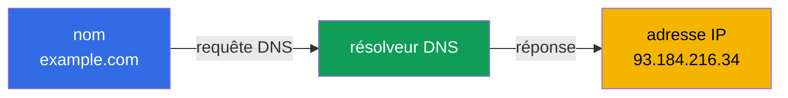
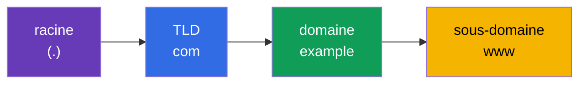
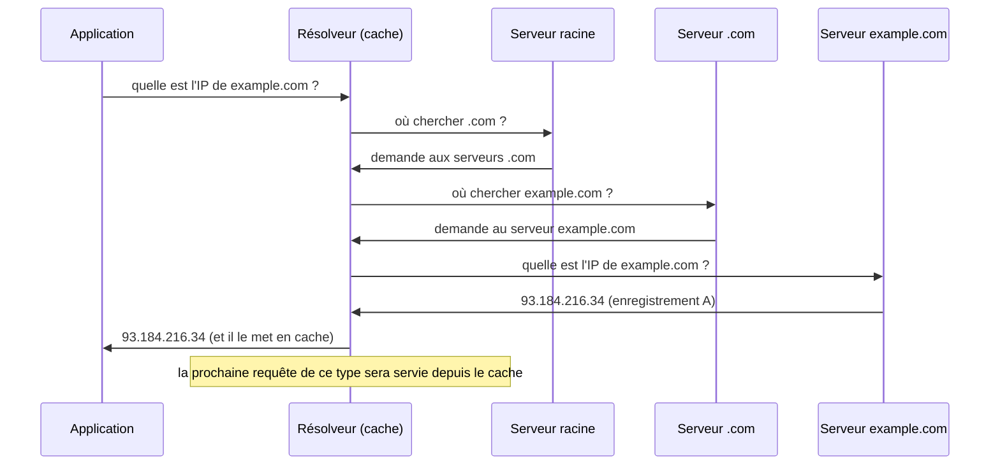
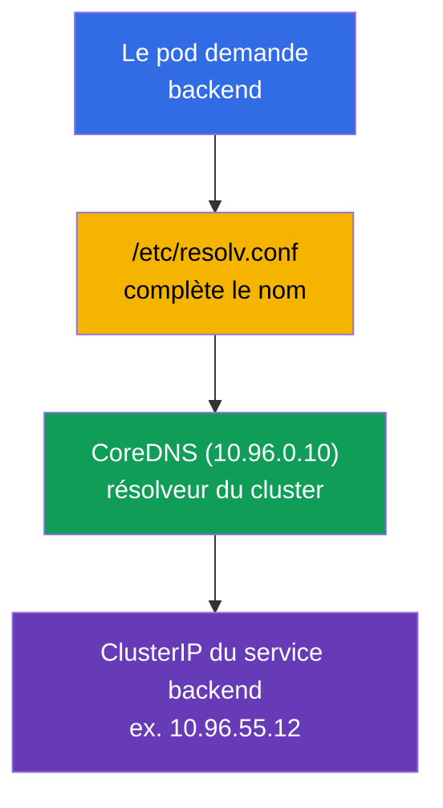

[Русская версия](ru.md) · [Eng version](README.md) · [Versión en español](es.md) · [Deutsche Version](de.md) · [ქართული ვერსია](ge.md)

# Chapitre 0.2. Le DNS depuis zéro : comment les noms se transforment en adresses

> **À qui s'adresse ce chapitre.** Nous poursuivons le socle "zéro". Si vous comprenez
> ce que sont le DNS, un enregistrement A et la résolution récursive, - passez au
> Chapitre 0.3. Sinon - ce chapitre donne exactement le minimum sans lequel on ne
> comprend pas CoreDNS (Chapitre 31), les noms de service du type
> `backend.default.svc.cluster.local` et la moitié du dépannage réseau. Dans un cluster,
> presque tout communique par noms, et non par IP, c'est pourquoi le DNS n'est pas un
> détail mais une structure porteuse.

## 0.2.1. Le problème que résout le DNS

Les adresses IP changent, elles sont impossibles à mémoriser, et dans Kubernetes l'IP
d'un pod est carrément temporaire : le pod a été recréé - l'adresse est différente. On
ne peut pas s'appuyer sur des IP "brutes". Le **DNS (Domain Name System)** résout cela :
il traduit un **nom lisible par un humain** en adresse IP, comme un annuaire téléphonique
traduit le nom d'un contact en numéro.



L'idée principale : l'application travaille avec un **nom**, et l'infrastructure (le DNS)
place en dessous l'**adresse** actuelle. Le nom est stable, l'adresse derrière lui peut
changer - c'est exactement le découplage sur lequel reposent les Service et les
microservices.

## 0.2.2. Comment est structuré un nom de domaine

Un nom se lit **de droite à gauche**, du général au particulier. Les points séparent les
niveaux.



- **Racine** - le point invisible tout à la fin (`example.com.`).
- **TLD** (top-level domain) - `com`, `org`, `ru`.
- **Domaine de second niveau** - `example`.
- **Sous-domaine** - `www`, `api`, `mail`.

Les noms dans Kubernetes sont structurés exactement de la même manière, seuls les niveaux
sont propres : `backend.default.svc.cluster.local` = service `backend` dans le namespace
`default`, section `svc`, zone du cluster `cluster.local`. Après avoir lu le chapitre,
vous décomposerez ces noms automatiquement.

## 0.2.3. Les types d'enregistrements à connaître

Le DNS ne stocke pas seulement "nom → IPv4". Plusieurs types d'enregistrements reviennent
en permanence :

| Enregistrement | Ce qu'il définit | Exemple |
|----------------|------------------|---------|
| **A** | nom → IPv4 | `example.com → 93.184.216.34` |
| **AAAA** | nom → IPv6 | `example.com → 2606:2800:220:1:...` |
| **CNAME** | alias → un autre nom | `www.example.com → example.com` |
| **PTR** | IP → nom (résolution inverse) | `34.216.184.93.in-addr.arpa → example.com` |
| **SRV** | service/port pour un nom | utilisé pour les services headless |

Pour le cours, le plus important est **A** (correspondance directe nom→IP) et comprendre
qu'il existe une **résolution inverse** (PTR : trouver un nom à partir d'une IP). CoreDNS
dans le cluster (Chapitre 31) sert précisément de tels enregistrements pour les services
et les pods.

## 0.2.4. Comment se déroule la résolution : le chemin d'une requête

Quand un programme veut connaître l'IP à partir d'un nom, il ne demande pas au "serveur
principal d'internet". La requête suit une chaîne où chaque niveau indique le suivant.



Deux points critiques pour le dépannage :

- **Mise en cache et TTL.** Chaque enregistrement a un **TTL** (time to live) - combien
  de secondes il peut être conservé dans le cache. Tant que le TTL n'a pas expiré, la
  réponse est prise dans le cache au lieu d'être redemandée. D'où le classique : « j'ai
  changé l'enregistrement, mais l'ancienne adresse répond encore » - on attend la fin du
  TTL.
- **Le résolveur** - celui qui effectue tout ce parcours à la place de l'application.
  Dans le cluster, le rôle de résolveur est joué par **CoreDNS**.

## 0.2.5. Où l'application obtient l'adresse du serveur DNS

Sous Linux, la liste des serveurs DNS et les règles de recherche de noms se trouvent dans
le fichier `/etc/resolv.conf` :

```text
nameserver 10.96.0.10
search default.svc.cluster.local svc.cluster.local cluster.local
```

- `nameserver` - où envoyer les requêtes DNS (dans le cluster, c'est le ClusterIP du
  service CoreDNS).
- `search` - quels suffixes ajouter aux noms courts. Grâce à cela, dans un pod il suffit
  d'écrire `backend`, et le système complète de lui-même
  `backend.default.svc.cluster.local`.

C'est justement pourquoi, au Chapitre 31, un nom court de service se résout « comme par
magie » - derrière la magie se trouve cette liste `search`, que kubelet inscrit dans le
pod automatiquement.

## 0.2.6. Le DNS dans Kubernetes : un court pont vers le Chapitre 31



Schéma de résolution du nom d'un service : le pod demande un nom court → `resolv.conf`
complète le nom complet → CoreDNS renvoie le ClusterIP → le trafic va vers le service.
Tout cela est du DNS ordinaire, seul le résolveur est interne. Nous l'examinerons en
détail au Chapitre 31.

## 0.2.7. Comment cela s'applique en production

- **Découverte de services par DNS.** Les microservices se trouvent les uns les autres
  par noms, et non par IP : les adresses des pods sont éphémères, tandis que le nom d'un
  service est stable. C'est la base de la connectivité des applications.
- **Le DNS est une racine fréquente des incidents.** « Rien ne marche » est
  étonnamment souvent = DNS : CoreDNS est tombé, un domaine `search` erroné, un TTL
  bloqué après un déménagement. Vérifier le DNS est l'une des premières étapes du
  diagnostic.
- **Le TTL comme outil.** Avant de migrer un service, on abaisse le TTL à l'avance pour
  que le basculement des adresses se propage vite, sans « la moitié des clients sur
  l'ancienne IP ».
- **DNS interne et externe.** À l'intérieur du cluster, les noms sont résolus par
  CoreDNS ; vers l'extérieur, les noms publics mènent à un répartiteur de charge/Ingress.
  Comprendre les deux côtés est nécessaire pour tracer le chemin d'une requête, de
  l'utilisateur jusqu'au pod.

## 0.2.8. Mini-glossaire

- **DNS** - le système de traduction des noms de domaine en adresses IP.
- **Résolveur** - le composant qui exécute les requêtes DNS à la place de l'application
  (dans le cluster - CoreDNS).
- **TLD** - le domaine de premier niveau (`com`, `org`, `ru`).
- **Enregistrement A / enregistrement AAAA** - nom → IPv4 / nom → IPv6.
- **CNAME** - un alias pointant vers un autre nom.
- **PTR** - l'enregistrement inverse : IP → nom.
- **TTL** - la durée de vie de l'enregistrement dans le cache (en secondes).
- **`/etc/resolv.conf`** - le fichier avec les adresses des serveurs DNS et les suffixes
  `search`.
- **domaine search** - un suffixe ajouté automatiquement aux noms courts.
- **FQDN** - le nom de domaine complet avec tous les niveaux (ex. `backend.default.svc.cluster.local`).

## 0.2.9. Récapitulatif du chapitre

- Le DNS traduit des noms stables en IP changeantes - le découplage sur lequel reposent
  les services et les microservices.
- Un nom se lit de droite à gauche : racine → TLD → domaine → sous-domaine ; les noms de
  Kubernetes sont structurés de la même façon (`svc.cluster.local`).
- Enregistrements clés : A (nom→IPv4), AAAA (IPv6), CNAME (alias), PTR (inverse).
- La résolution suit une chaîne de serveurs avec mise en cache ; le TTL détermine combien
  de temps une réponse vit dans le cache.
- `/etc/resolv.conf` définit le serveur DNS et les suffixes `search` ; dans un pod,
  kubelet les inscrit, c'est pourquoi les noms courts de service se résolvent (Chapitre
  31).

## 0.2.10. À quoi cela sert : à l'examen et dans le travail réel

**À l'examen.** Le DNS est le fondement du Chapitre 31 (CoreDNS) et du dépannage réseau.
Les tâches « le pod ne résout pas le service », « vérifie le DNS » ne se résolvent que si
l'on comprend comment fonctionnent la résolution, les domaines `search` et le nom complet
du service. Les utilitaires `nslookup`/`dig` depuis un pod sont une technique de
diagnostic standard.

**Dans le travail réel.** Découverte de services, analyse des incidents avec CoreDNS,
gestion du TTL lors des migrations, jonction du DNS interne et externe - des tâches
d'exploitation constantes. Les problèmes de DNS sont traîtres parce qu'ils se déguisent
en « n'importe quoi ne marche pas », c'est pourquoi les bases font gagner des heures.

## 0.2.11. Questions d'auto-évaluation

1. Quel problème résout le DNS et pourquoi, dans Kubernetes, ne peut-on pas s'appuyer sur les IP des pods ?
2. Comment se lit un nom de domaine et comment cela se rapporte-t-il à `backend.default.svc.cluster.local` ?
3. En quoi un enregistrement A diffère-t-il de CNAME et PTR ?
4. Qu'est-ce que le TTL et comment un cache « bloqué » se manifeste-t-il après un changement d'adresse ?
5. À quoi sert un domaine `search` dans `/etc/resolv.conf` et comment aide-t-il les noms courts ?
6. Qui joue le rôle de résolveur à l'intérieur du cluster ?

## Pratique

Il n'y a pas de TP à part pour la Partie 0. Vous exercerez la résolution des noms de
service à la main dans les TP réseau, une fois arrivé à CoreDNS (Chapitre 31). Ensuite -
comment le trafic est protégé : TLS et certificats.

---
[Sommaire](../README_FR.md) · [Chapitre 0.1](../00-1-net/fr.md) · [Chapitre 0.3](../00-3-tls/fr.md)
