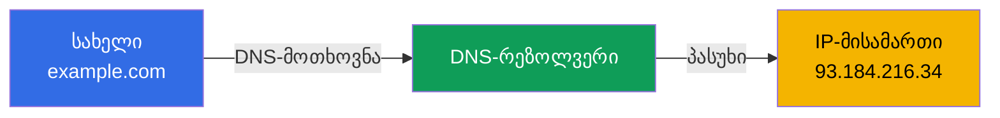
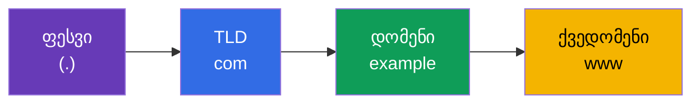
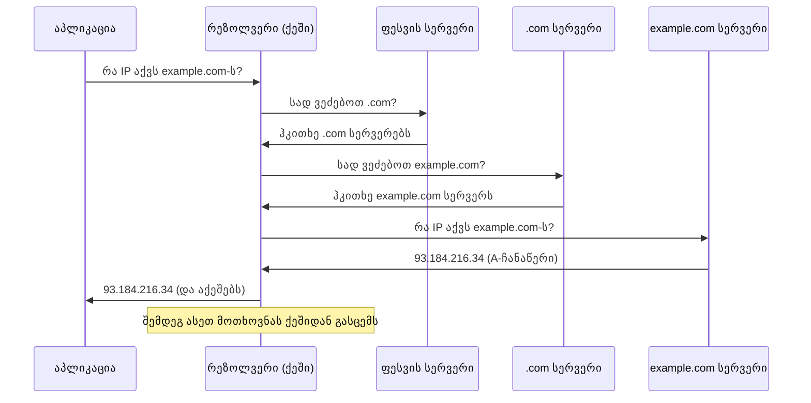
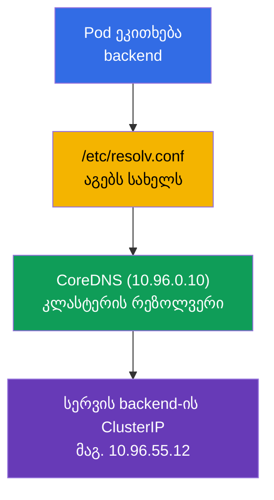

[Русская версия](ru.md) · [Eng version](README.md) · [Versión en español](es.md) · [Version française](fr.md) · [Deutsche Version](de.md)

# თავი 0.2. DNS ნულიდან: როგორ იქცევა სახელები მისამართებად

> **ვისთვისაა ეს თავი.** ვაგრძელებთ ნულოვან საფუძველს. თუ გესმით, რა არის DNS, A-ჩანაწერი
> და რეკურსიული რეზოლვინგი, - გადადით თავზე 0.3. თუ არა - ეს თავი მოგცემთ ზუსტად იმ
> მინიმუმს, რომლის გარეშეც ვერ გაიგებთ CoreDNS-ს (თავი 31), სერვისულ სახელებს ტიპისა
> `backend.default.svc.cluster.local` და ქსელური troubleshooting-ის ნახევარს. კლასტერში
> თითქმის ყველაფერი სახელებით ურთიერთობს და არა IP-თი, ამიტომ DNS არ არის დეტალი, არამედ
> მზიდი კონსტრუქცია.

## 0.2.1. პრობლემა, რომელსაც DNS წყვეტს

IP-მისამართები იცვლება, მათი დამახსოვრება შეუძლებელია, ხოლო Kubernetes-ში pod-ის IP
საერთოდ დროებითია: pod ხელახლა შეიქმნა - მისამართი სხვაა. „ნედლი“ IP-ებით მუშაობა არ
შეიძლება. **DNS (Domain Name System)** ამას წყვეტს: ის თარგმნის **ადამიანისთვის
წასაკითხ სახელს** IP-მისამართად, როგორც სატელეფონო წიგნი თარგმნის კონტაქტის სახელს
ნომრად.



მთავარი აზრი: აპლიკაცია მუშაობს **სახელთან**, ხოლო ინფრასტრუქტურა (DNS) მის ქვეშ სვამს
აქტუალურ **მისამართს**. სახელი სტაბილურია, მის უკან მდგომი მისამართი შეიძლება იცვლებოდეს
- სწორედ ეს არის ის განცალკევება, რომელზეც დგას Service და მიკროსერვისები.

## 0.2.2. როგორ არის მოწყობილი დომენური სახელი

სახელი იკითხება **მარჯვნიდან მარცხნივ**, ზოგადიდან კონკრეტულისკენ. წერტილები ჰყოფს
დონეებს.



- **ფესვი** - უხილავი წერტილი ბოლოში (`example.com.`).
- **TLD** (top-level domain) - `com`, `org`, `ru`.
- **მეორე დონის დომენი** - `example`.
- **ქვედომენი** - `www`, `api`, `mail`.

ზუსტად ასევეა მოწყობილი სახელები Kubernetes-ში, მხოლოდ დონეები საკუთარია:
`backend.default.svc.cluster.local` = სერვისი `backend` namespace `default`-ში, სექცია
`svc`, კლასტერის ზონა `cluster.local`. თავის წაკითხვის შემდეგ ასეთ სახელებს
ავტომატურად გაარჩევთ.

## 0.2.3. ჩანაწერების ტიპები, რომლებიც უნდა იცოდეთ

DNS ინახავს არა მხოლოდ „სახელი → IPv4“-ს. რამდენიმე ტიპის ჩანაწერი მუდმივად გვხვდება:

| ჩანაწერი | რას აყენებს | მაგალითი |
|----------|-------------|----------|
| **A** | სახელი → IPv4 | `example.com → 93.184.216.34` |
| **AAAA** | სახელი → IPv6 | `example.com → 2606:2800:220:1:...` |
| **CNAME** | ფსევდონიმი → სხვა სახელი | `www.example.com → example.com` |
| **PTR** | IP → სახელი (შებრუნებული რეზოლვინგი) | `34.216.184.93.in-addr.arpa → example.com` |
| **SRV** | სერვისი/პორტი სახელისთვის | გამოიყენება headless-სერვისებისთვის |

კურსისთვის ყველაზე მნიშვნელოვანია **A** (პირდაპირი შესაბამისობა სახელი→IP) და იმის
გაგება, რომ არსებობს **შებრუნებული რეზოლვინგი** (PTR: IP-ით სახელის პოვნა). CoreDNS
კლასტერში (თავი 31) სწორედ ასეთ ჩანაწერებს გასცემს სერვისებისა და pod-ებისთვის.

## 0.2.4. როგორ ხდება რეზოლვინგი: მოთხოვნის გზა

როცა პროგრამას სურს სახელით IP-ს გაგება, ის არ ეკითხება „ინტერნეტის მთავარ სერვერს“.
მოთხოვნა მიდის ჯაჭვით, სადაც ყოველი დონე მიუთითებს შემდეგს.



ორი მომენტი, კრიტიკული troubleshooting-ისთვის:

- **ქეშირება და TTL.** ყოველ ჩანაწერს აქვს **TTL** (time to live) - რამდენი წამი
  შეიძლება მისი ქეშში შენახვა. სანამ TTL არ ამოიწურება, პასუხი ქეშიდან იღება და ხელახლა
  არ იკითხება. აქედან კლასიკა: „შევცვალე ჩანაწერი, მაგრამ ძველი მისამართი ჯერ კიდევ
  პასუხობს“ - ველოდებით TTL-ს.
- **რეზოლვერი** - ის, ვინც მთელ ამ შემოვლას აპლიკაციის ნაცვლად ატარებს. კლასტერში
  რეზოლვერის როლს **CoreDNS** ასრულებს.

## 0.2.5. საიდან იღებს აპლიკაცია DNS-სერვერის მისამართს

Linux-ზე DNS-სერვერების სია და სახელების ძებნის წესები დევს ფაილში `/etc/resolv.conf`:

```text
nameserver 10.96.0.10
search default.svc.cluster.local svc.cluster.local cluster.local
```

- `nameserver` - სად გავაგზავნოთ DNS-მოთხოვნები (კლასტერში ეს არის CoreDNS სერვისის
  ClusterIP).
- `search` - რომელი სუფიქსები მივუწეროთ მოკლე სახელებს. ამის წყალობით pod-ის შიგნით
  საკმარისია დაწერო `backend`, და სისტემა თავად ააგებს
  `backend.default.svc.cluster.local`-ს.

სწორედ ამიტომ 31-ე თავში სერვისის მოკლე სახელი „ჯადოსნურად“ რეზოლვდება - ჯადოს უკან დგას
ეს `search`-სია, რომელსაც kubelet ავტომატურად წერს pod-ში.

## 0.2.6. DNS Kubernetes-ში: მოკლე ხიდი 31-ე თავისკენ



სერვისის სახელის რეზოლვინგის სქემა: pod ეკითხება მოკლე სახელს → `resolv.conf` აგებს
სრულს → CoreDNS გასცემს ClusterIP-ს → ტრაფიკი მიდის სერვისზე. ეს ყველაფერი ჩვეულებრივი
DNS-ია, უბრალოდ რეზოლვერი შიდაა. დაწვრილებით განვიხილავთ 31-ე თავში.

## 0.2.7. როგორ გამოიყენება ეს პროდაქშენში

- **სერვის-დისქავერი DNS-ით.** მიკროსერვისები ერთმანეთს პოულობენ სახელებით და არა IP-თი:
  pod-ების მისამართები ეფემერულია, ხოლო სერვისის სახელი სტაბილური. ეს არის აპლიკაციების
  კავშირიანობის საფუძველი.
- **DNS - ინციდენტების ხშირი ფესვი.** „არაფერი მუშაობს“ საოცრად ხშირად = DNS: CoreDNS
  ჩამოვარდა, მცდარი `search`-დომენი, დაჭედებული TTL გადატანის შემდეგ. DNS-ის შემოწმება -
  დიაგნოსტიკის ერთ-ერთი პირველი ნაბიჯი.
- **TTL როგორც ინსტრუმენტი.** სერვისის მიგრაციამდე წინასწარ ამცირებენ TTL-ს, რომ
  მისამართების გადართვა სწრაფად გავრცელდეს, „კლიენტების ნახევარი ძველ IP-ზე“ სიტუაციის
  გარეშე.
- **შიდა და გარე DNS.** კლასტერის შიგნით სახელებს რეზოლვავს CoreDNS; გარეთ საჯარო
  სახელები მიდის ბალანსერზე/Ingress-ზე. ორივე მხარის გაგება საჭიროა მომხმარებლიდან
  pod-მდე მოთხოვნის გზის ტრასირებისთვის.

## 0.2.8. მინი-ლექსიკონი

- **DNS** - დომენური სახელების IP-მისამართებად თარგმნის სისტემა.
- **რეზოლვერი** - კომპონენტი, რომელიც აპლიკაციის ნაცვლად ასრულებს DNS-მოთხოვნებს
  (კლასტერში - CoreDNS).
- **TLD** - ზედა დონის დომენი (`com`, `org`, `ru`).
- **A-ჩანაწერი / AAAA-ჩანაწერი** - სახელი → IPv4 / სახელი → IPv6.
- **CNAME** - ფსევდონიმი, რომელიც სხვა სახელზე მიუთითებს.
- **PTR** - შებრუნებული ჩანაწერი: IP → სახელი.
- **TTL** - ჩანაწერის ქეშში სიცოცხლის დრო (წამებში).
- **`/etc/resolv.conf`** - ფაილი DNS-სერვერების მისამართებითა და `search`-სუფიქსებით.
- **search-დომენი** - სუფიქსი, რომელიც ავტომატურად მიეწერება მოკლე სახელებს.
- **FQDN** - სრული დომენური სახელი ყველა დონით (მაგ. `backend.default.svc.cluster.local`).

## 0.2.9. თავის შეჯამება

- DNS თარგმნის სტაბილურ სახელებს ცვალებად IP-ებად - განცალკევება, რომელზეც დგას
  სერვისები და მიკროსერვისები.
- სახელი იკითხება მარჯვნიდან მარცხნივ: ფესვი → TLD → დომენი → ქვედომენი; Kubernetes-ის
  სახელები ასევეა მოწყობილი (`svc.cluster.local`).
- ძირითადი ჩანაწერები: A (სახელი→IPv4), AAAA (IPv6), CNAME (ფსევდონიმი), PTR
  (შებრუნებული).
- რეზოლვინგი მიდის სერვერების ჯაჭვით ქეშირებით; TTL განსაზღვრავს, რამდენ ხანს ცოცხლობს
  პასუხი ქეშში.
- `/etc/resolv.conf` აყენებს DNS-სერვერსა და `search`-სუფიქსებს; pod-ში მათ წერს kubelet,
  ამიტომ სერვისების მოკლე სახელები რეზოლვდება (თავი 31).

## 0.2.10. როგორ გამოგადგებათ: გამოცდაზე და რეალურ სამუშაოში

**გამოცდაზე.** DNS არის 31-ე თავის (CoreDNS) და ქსელური troubleshooting-ის საფუძველი.
დავალებები „pod სერვისს ვერ რეზოლვავს“, „შეამოწმე DNS“ მხოლოდ მაშინ იხსნება, თუ გასაგებია,
როგორ მუშაობს რეზოლვინგი, `search`-დომენები და სერვისის სრული სახელი. უტილიტები
`nslookup`/`dig` pod-იდან - დიაგნოსტიკის სტანდარტული ხერხი.

**რეალურ სამუშაოში.** სერვის-დისქავერი, CoreDNS-ის ინციდენტების გარჩევა, TTL-ის მართვა
მიგრაციებისას, შიდა და გარე DNS-ის შეერთება - ექსპლუატაციის მუდმივი ამოცანები.
DNS-პრობლემები მზაკვრულია იმით, რომ იმალებიან „რაღაც არ მუშაობს“-ის ქვეშ, ამიტომ ბაზა
საათებს ზოგავს.

## 0.2.11. თვითშემოწმების კითხვები

1. რომელ პრობლემას წყვეტს DNS და რატომ არ შეიძლება Kubernetes-ში pod-ების IP-ებით მუშაობა?
2. როგორ იკითხება დომენური სახელი და როგორ უკავშირდება ეს `backend.default.svc.cluster.local`-ს?
3. რით განსხვავდება A-ჩანაწერი CNAME-ისა და PTR-ისგან?
4. რა არის TTL და როგორ ვლინდება „დაჭედებული“ ქეში მისამართის შეცვლის შემდეგ?
5. რისთვისაა საჭირო `search`-დომენი `/etc/resolv.conf`-ში და როგორ ეხმარება მოკლე სახელებს?
6. ვინ ასრულებს რეზოლვერის როლს კლასტერის შიგნით?

## პრაქტიკა

ნაწილ 0-ისთვის ცალკე ლაბი არ არის. სერვისების სახელების რეზოლვინგს ხელით დაამუშავებთ
ქსელის ლაბებში, როცა CoreDNS-მდე მიხვალთ (თავი 31). შემდეგ - როგორ იცავს ტრაფიკს: TLS და
სერტიფიკატები.

---
[სარჩევი](../README_GE.md) · [თავი 0.1](../00-1-net/ge.md) · [თავი 0.3](../00-3-tls/ge.md)
