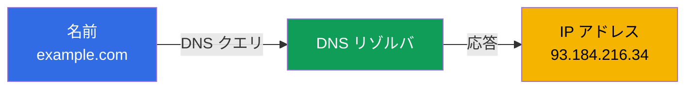
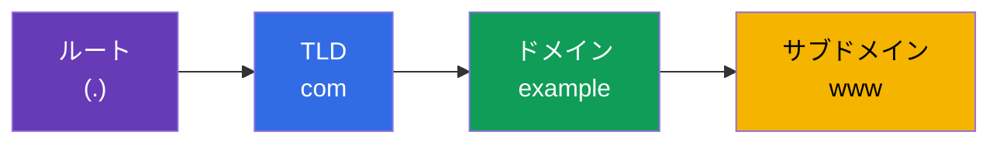
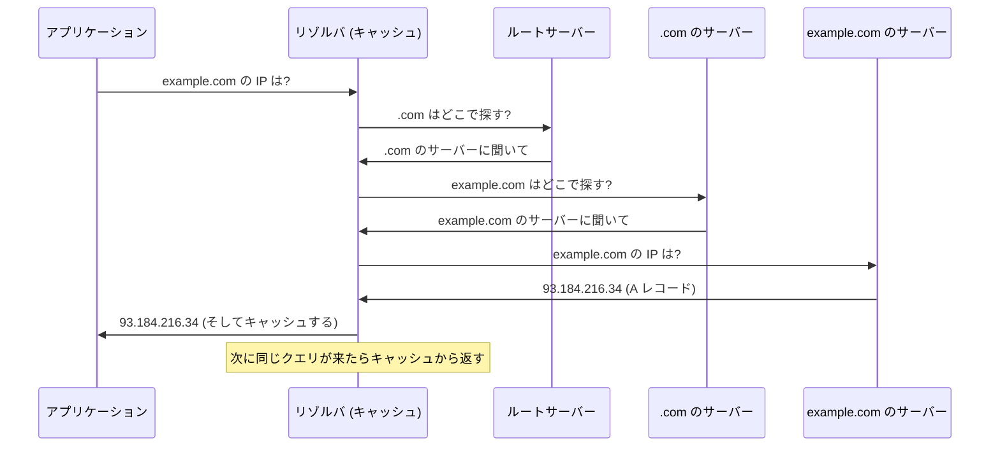
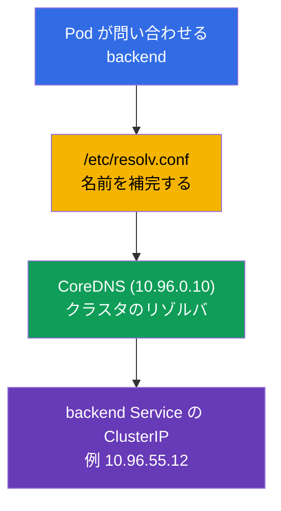

[Русская версия](ru.md) · [Eng version](README.md) · [Versión en español](es.md) · [Version française](fr.md) · [Deutsche Version](de.md) · [ქართული ვერსია](ge.md) · [繁體中文版](tw.md)

# 第 0.2 章。DNS をゼロから：名前はどのようにアドレスへ変わるのか

> **この章は誰のためか。** ゼロからの土台づくりを続けます。DNS とは何か、A レコード
> とは何か、再帰的な名前解決とは何かを理解しているなら、第 0.3 章へ進んでください。
> そうでなければ、この章では CoreDNS（第 31 章）、`backend.default.svc.cluster.local`
> のようなサービス名、そしてネットワークのトラブルシューティングの半分を理解するために
> 欠かせない最小限の知識を身につけます。クラスタではほぼすべてが IP ではなく名前で
> 通信するため、DNS は細部ではなく構造を支える柱です。

## 0.2.1. DNS が解決する問題

IP アドレスは変わりますし、覚えることもできません。Kubernetes では Pod の IP はそもそも
一時的なものです：Pod が再作成されればアドレスは別のものになります。「生の」IP で
アクセスするわけにはいきません。**DNS (Domain Name System)** がこれを解決します。
電話帳が連絡先の名前を番号に変えるように、**人が読める名前**を IP アドレスに変換します。



要点はこうです。アプリケーションは**名前**を扱い、その裏でインフラ（DNS）が現在の
**アドレス**を差し替えます。名前は安定していて、その裏のアドレスは変わりうる - これが
Service とマイクロサービスを成り立たせている疎結合です。

## 0.2.2. ドメイン名の構造

名前は**右から左へ**、大きい単位から小さい単位へと読みます。ドットが階層を区切ります。



- **ルート** - 名前のいちばん末尾にある見えないドット（`example.com.`）。
- **TLD** (top-level domain) - `com`、`org`、`ru`。
- **セカンドレベルドメイン** - `example`。
- **サブドメイン** - `www`、`api`、`mail`。

Kubernetes の名前もまったく同じ仕組みで、階層の意味だけが独自です：
`backend.default.svc.cluster.local` = Namespace `default` にある Service `backend`、
区分 `svc`、クラスタのゾーン `cluster.local`。この章を読み終えれば、こうした名前を
自動的に読み解けるようになります。

## 0.2.3. 知っておくべきレコードの種類

DNS が保持するのは「名前 → IPv4」だけではありません。次のいくつかの種類は絶えず登場します：

| レコード | 何を定義するか | 例 |
|--------|------------|-------|
| **A** | 名前 → IPv4 | `example.com → 93.184.216.34` |
| **AAAA** | 名前 → IPv6 | `example.com → 2606:2800:220:1:...` |
| **CNAME** | 別名 → 別の名前 | `www.example.com → example.com` |
| **PTR** | IP → 名前（逆引き） | `34.216.184.93.in-addr.arpa → example.com` |
| **SRV** | 名前に対するサービス/ポート | headless Service で使われる |

このコースでもっとも重要なのは **A**（名前→IP の直接の対応）と、**逆引き**（PTR: IP から
名前を求める）があると知っていることです。クラスタ内の CoreDNS（第 31 章）は、Service や
Pod に対してまさにこうしたレコードを返します。

## 0.2.4. 名前解決の流れ：クエリの旅路

プログラムが名前から IP を知りたいとき、「インターネットの中央サーバー」に尋ねるわけでは
ありません。クエリは、各段階が次の段階を教えてくれる連鎖をたどっていきます。



トラブルシューティングで決定的に重要な点が 2 つあります：

- **キャッシュと TTL。** 各レコードには **TTL** (time to live) があり、そのレコードを何秒
  キャッシュに保持してよいかを示します。TTL が切れるまでは応答はキャッシュから取られ、
  改めて問い合わせは行われません。ここから定番の現象が生まれます：「レコードを変えたのに
  古いアドレスがまだ応答する」 - TTL を待ちます。
- **リゾルバ** - アプリケーションの代わりにこの探索をすべて行う存在です。クラスタでは
  リゾルバの役割を **CoreDNS** が担います。

## 0.2.5. アプリケーションはどこから DNS サーバーのアドレスを得るのか

Linux では、DNS サーバーの一覧と名前検索のルールは `/etc/resolv.conf` にあります：

```text
nameserver 10.96.0.10
search default.svc.cluster.local svc.cluster.local cluster.local
```

- `nameserver` - DNS クエリの送り先（クラスタでは CoreDNS の Service の ClusterIP）。
- `search` - 短い名前に付け足す接尾辞。これがあるおかげで Pod の中では `backend` と
  書くだけで、システムが自動で `backend.default.svc.cluster.local` を組み立てます。

だからこそ第 31 章では Service の短い名前が「魔法のように」解決されます。その魔法の
裏にあるのが、kubelet が Pod に自動で書き込むこの `search` リストです。

## 0.2.6. Kubernetes における DNS：第 31 章への短い橋渡し



Service 名の解決の流れ：Pod が短い名前を問い合わせる → `resolv.conf` が完全な名前に
補完する → CoreDNS が ClusterIP を返す → トラフィックが Service へ向かう。これらは
すべて普通の DNS で、リゾルバが内部にあるだけです。第 31 章で詳しく見ていきます。

## 0.2.7. 本番環境での使われ方

- **DNS によるサービスディスカバリ。** マイクロサービスは IP ではなく名前で互いを
  見つけます：Pod のアドレスは短命ですが、Service 名は安定しています。これが
  アプリケーション間の接続性の土台です。
- **DNS は障害の原因になりやすい。** 「何も動かない」の正体が DNS であることは驚くほど
  多いです：CoreDNS が落ちた、`search` ドメインが間違っている、移転後に TTL が残っている。
  DNS の確認は診断の最初のステップの一つです。
- **道具としての TTL。** サービスの移行前にはあらかじめ TTL を下げ、アドレスの切り替えが
  速く行き渡るようにします。「クライアントの半分が古い IP のまま」を避けるためです。
- **内部 DNS と外部 DNS。** クラスタ内では CoreDNS が名前を解決し、外向きには公開名が
  ロードバランサー/Ingress に向きます。ユーザーから Pod までのクエリ経路をたどるには、
  両側を理解しておく必要があります。

## 0.2.8. ミニ用語集

- **DNS** - ドメイン名を IP アドレスに変換するシステム。
- **リゾルバ** - アプリケーションの代わりに DNS クエリを実行するコンポーネント
  （クラスタでは CoreDNS）。
- **TLD** - トップレベルドメイン（`com`、`org`、`ru`）。
- **A レコード / AAAA レコード** - 名前 → IPv4 / 名前 → IPv6。
- **CNAME** - 別の名前を指す別名。
- **PTR** - 逆引きレコード：IP → 名前。
- **TTL** - キャッシュ内でのレコードの生存時間（秒）。
- **`/etc/resolv.conf`** - DNS サーバーのアドレスと `search` 接尾辞を記したファイル。
- **search ドメイン** - 短い名前に自動で付け足される接尾辞。
- **FQDN** - すべての階層を含む完全修飾ドメイン名（例 `backend.default.svc.cluster.local`）。

## 0.2.9. 章のまとめ

- DNS は安定した名前を変わりうる IP に変換する - Service とマイクロサービスを支える
  疎結合の仕組みです。
- 名前は右から左へ読みます：ルート → TLD → ドメイン → サブドメイン。Kubernetes の名前も
  同じ構造です（`svc.cluster.local`）。
- 主要なレコード：A（名前→IPv4）、AAAA（IPv6）、CNAME（別名）、PTR（逆引き）。
- 名前解決はサーバーの連鎖をたどり、キャッシュされます。TTL は応答がキャッシュに
  どれだけ生き残るかを決めます。
- `/etc/resolv.conf` が DNS サーバーと `search` 接尾辞を定めます。Pod では kubelet が
  それらを書き込むため、Service の短い名前が解決されます（第 31 章）。

## 0.2.10. どこで役に立つか：試験と実務

**試験では。** DNS は第 31 章（CoreDNS）とネットワークのトラブルシューティングの土台です。
「Pod が Service を解決できない」「DNS を確認せよ」といった課題は、名前解決の仕組み、
`search` ドメイン、Service の完全な名前を理解していて初めて解けます。Pod からの
`nslookup`/`dig` は診断の定石です。

**実務では。** サービスディスカバリ、CoreDNS 障害の切り分け、移行時の TTL 管理、内部 DNS と
外部 DNS の接続 - どれも運用の日常業務です。DNS の問題は「何もかも動かない」ように
見えてしまうのが厄介なので、基礎があると何時間も節約できます。

## 0.2.11. 自己確認のための質問

1. DNS はどんな問題を解決しますか。また Kubernetes で Pod の IP に直接アクセスできないのはなぜですか。
2. ドメイン名はどう読みますか。それは `backend.default.svc.cluster.local` とどう対応しますか。
3. A レコードは CNAME や PTR とどう違いますか。
4. TTL とは何ですか。アドレス変更後に「残った」キャッシュはどのように現れますか。
5. `/etc/resolv.conf` の `search` ドメインは何のためにあり、短い名前をどう助けますか。
6. クラスタ内でリゾルバの役割を担うのは誰ですか。

## 演習

パート 0 には専用のラボはありません。Service 名の解決は、CoreDNS（第 31 章）まで進んだ
ときにネットワークのラボで実際に手を動かして練習します。次は、トラフィックがどう
守られるか：TLS と証明書です。

---
[目次](../README_JP.md) · [第 0.1 章](../00-1-net/jp.md) · [第 0.3 章](../00-3-tls/jp.md)
