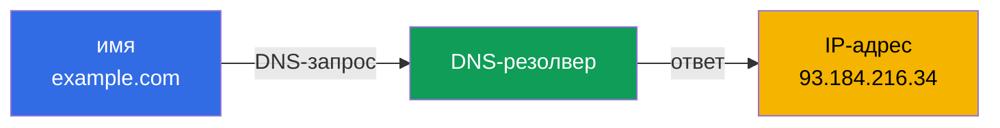
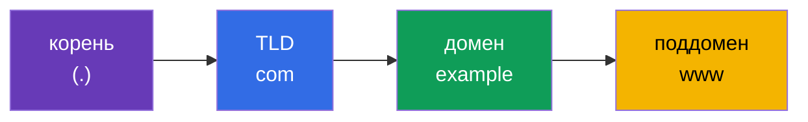
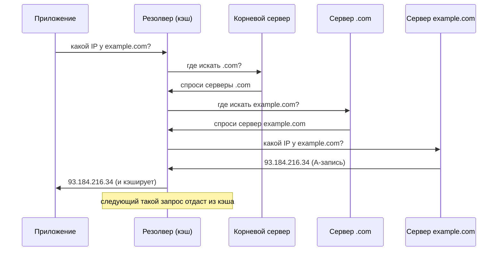
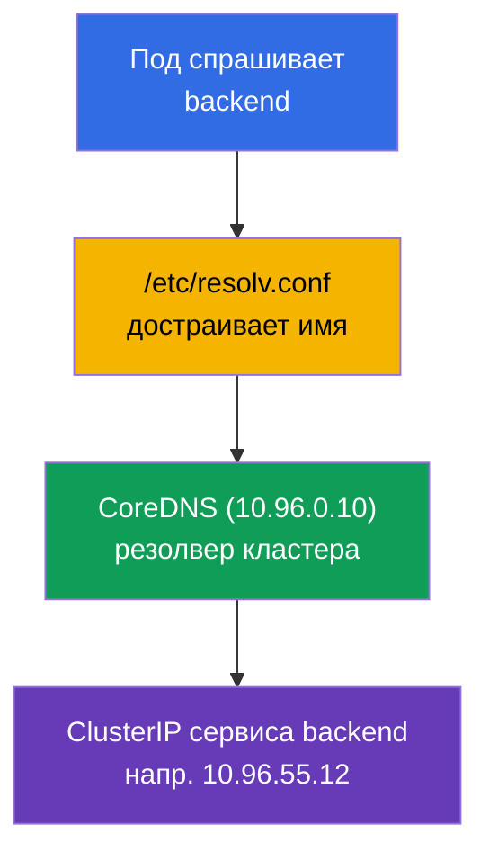

# Глава 0.2. DNS с нуля: как имена превращаются в адреса

> **Для кого эта глава.** Продолжаем нулевой фундамент. Если вы понимаете, что такое
> DNS, A-запись и рекурсивный резолвинг, - переходите к главе 0.3. Если нет - эта
> глава даст ровно тот минимум, без которого не понять CoreDNS (глава 31), сервисные
> имена вида `backend.default.svc.cluster.local` и половину сетевого
> troubleshooting. В кластере почти всё общается по именам, а не по IP, поэтому DNS -
> не деталь, а несущая конструкция.

## 0.2.1. Проблема, которую решает DNS

IP-адреса меняются, их невозможно запоминать, а в Kubernetes IP пода вообще временный:
под пересоздался - адрес другой. Обращаться по «сырым» IP нельзя. **DNS (Domain Name
System)** решает это: он переводит **человекочитаемое имя** в IP-адрес, как телефонная
книга переводит имя контакта в номер.



Главная мысль: приложение работает с **именем**, а инфраструктура (DNS) под ним
подставляет актуальный **адрес**. Имя стабильно, адрес за ним может меняться - это и
есть развязка, на которой держатся Service и микросервисы.

## 0.2.2. Как устроено доменное имя

Имя читается **справа налево**, от общего к частному. Точки разделяют уровни.



- **Корень** - невидимая точка в самом конце (`example.com.`).
- **TLD** (top-level domain) - `com`, `org`, `ru`.
- **Домен второго уровня** - `example`.
- **Поддомен** - `www`, `api`, `mail`.

Ровно так же устроены имена в Kubernetes, только уровни свои:
`backend.default.svc.cluster.local` = сервис `backend` в неймспейсе `default`,
раздел `svc`, зона кластера `cluster.local`. Прочитав главу, вы будете разбирать
такие имена автоматически.

## 0.2.3. Типы записей, которые надо знать

DNS хранит не только «имя → IPv4». Несколько типов записей встречаются постоянно:

| Запись | Что задаёт | Пример |
|--------|------------|--------|
| **A** | имя → IPv4 | `example.com → 93.184.216.34` |
| **AAAA** | имя → IPv6 | `example.com → 2606:2800:220:1:...` |
| **CNAME** | псевдоним → другое имя | `www.example.com → example.com` |
| **PTR** | IP → имя (обратный резолвинг) | `34.216.184.93.in-addr.arpa → example.com` |
| **SRV** | сервис/порт для имени | используется для headless-сервисов |

Для курса важнее всего **A** (прямое соответствие имя→IP) и понимание, что бывает
**обратный резолвинг** (PTR: по IP найти имя). CoreDNS в кластере (глава 31) отдаёт
именно такие записи для сервисов и подов.

## 0.2.4. Как происходит резолвинг: путь запроса

Когда программа хочет узнать IP по имени, она не спрашивает «главный сервер интернета».
Запрос идёт по цепочке, где каждый уровень подсказывает следующий.



Два момента, критичных для troubleshooting:

- **Кэширование и TTL.** У каждой записи есть **TTL** (time to live) - сколько секунд
  её можно держать в кэше. Пока TTL не истёк, ответ берётся из кэша, а не спрашивается
  заново. Отсюда классика: «поменял запись, а старый адрес ещё отвечает» - ждём TTL.
- **Резолвер** - тот, кто ведёт весь этот обход за приложение. В кластере роль
  резолвера играет **CoreDNS**.

## 0.2.5. Где приложение берёт адрес DNS-сервера

На Linux список DNS-серверов и правила поиска имён лежат в файле `/etc/resolv.conf`:

```text
nameserver 10.96.0.10
search default.svc.cluster.local svc.cluster.local cluster.local
```

- `nameserver` - куда слать DNS-запросы (в кластере это ClusterIP сервиса CoreDNS).
- `search` - какие суффиксы дописывать к коротким именам. Благодаря этому внутри пода
  достаточно написать `backend`, и система сама достроит
  `backend.default.svc.cluster.local`.

Именно поэтому в главе 31 короткое имя сервиса «магически» резолвится - за магией
стоит этот `search`-список, который kubelet прописывает в под автоматически.

## 0.2.6. DNS в Kubernetes: короткий мостик к главе 31



Схема резолвинга имени сервиса: под спрашивает короткое имя → `resolv.conf` достраивает
полное → CoreDNS отдаёт ClusterIP → трафик идёт на сервис. Всё это - обычный DNS,
только резолвер внутренний. Разберём подробно в главе 31.

## 0.2.7. Как это применяют в продакшене

- **Сервис-дискавери по DNS.** Микросервисы находят друг друга по именам, а не по IP:
  адреса подов эфемерны, а имя сервиса стабильно. Это основа связности приложений.
- **DNS - частый корень инцидентов.** «Ничего не работает» удивительно часто = DNS:
  упал CoreDNS, кривой `search`-домен, залипший TTL после переезда. Проверка DNS -
  один из первых шагов диагностики.
- **TTL как инструмент.** Перед миграцией сервиса заранее снижают TTL, чтобы
  переключение адресов разошлось быстро, без «половина клиентов на старом IP».
- **Внутренний и внешний DNS.** Внутри кластера имена резолвит CoreDNS; наружу
  публичные имена ведут на балансировщик/Ingress. Понимание обеих сторон нужно, чтобы
  трассировать путь запроса от пользователя до пода.

## 0.2.8. Мини-глоссарий

- **DNS** - система перевода доменных имён в IP-адреса.
- **Резолвер** - компонент, который выполняет DNS-запросы за приложение (в кластере -
  CoreDNS).
- **TLD** - домен верхнего уровня (`com`, `org`, `ru`).
- **A-запись / AAAA-запись** - имя → IPv4 / имя → IPv6.
- **CNAME** - псевдоним, указывающий на другое имя.
- **PTR** - обратная запись: IP → имя.
- **TTL** - время жизни записи в кэше (в секундах).
- **`/etc/resolv.conf`** - файл с адресами DNS-серверов и `search`-суффиксами.
- **search-домен** - суффикс, автоматически дописываемый к коротким именам.
- **FQDN** - полное доменное имя со всеми уровнями (напр. `backend.default.svc.cluster.local`).

## 0.2.9. Итоги главы

- DNS переводит стабильные имена в изменяемые IP - развязка, на которой держатся
  сервисы и микросервисы.
- Имя читается справа налево: корень → TLD → домен → поддомен; имена Kubernetes
  устроены так же (`svc.cluster.local`).
- Ключевые записи: A (имя→IPv4), AAAA (IPv6), CNAME (псевдоним), PTR (обратная).
- Резолвинг идёт по цепочке серверов с кэшированием; TTL определяет, сколько ответ
  живёт в кэше.
- `/etc/resolv.conf` задаёт DNS-сервер и `search`-суффиксы; в поде их прописывает
  kubelet, поэтому короткие имена сервисов резолвятся (глава 31).

## 0.2.10. Как это пригодится: на экзамене и в реальной работе

**На экзамене.** DNS - фундамент главы 31 (CoreDNS) и сетевого troubleshooting.
Задачи «под не резолвит сервис», «проверь DNS» решаются, только если понятно, как
работает резолвинг, `search`-домены и полное имя сервиса. Утилиты `nslookup`/`dig` из
пода - стандартный приём диагностики.

**В реальной работе.** Сервис-дискавери, разбор инцидентов с CoreDNS, управление TTL
при миграциях, стыковка внутреннего и внешнего DNS - постоянные задачи эксплуатации.
DNS-проблемы коварны тем, что маскируются под «что угодно не работает», поэтому база
экономит часы.

## 0.2.11. Вопросы для самопроверки

1. Какую проблему решает DNS и почему в Kubernetes нельзя обращаться по IP подов?
2. Как читается доменное имя и как это соотносится с `backend.default.svc.cluster.local`?
3. Чем A-запись отличается от CNAME и PTR?
4. Что такое TTL и как «залипший» кэш проявляется после смены адреса?
5. Зачем нужен `search`-домен в `/etc/resolv.conf` и как он помогает коротким именам?
6. Кто играет роль резолвера внутри кластера?

## Практика

Отдельной лабы для части 0 нет. Резолвинг имён сервисов вы отработаете руками в лабах
по сети, когда дойдёте до CoreDNS (глава 31). Дальше - как защищается трафик: TLS и
сертификаты.

---
[Оглавление](../README_RU.md) · [Глава 0.1](../00-1-net/ru.md) · [Глава 0.3](../00-3-tls/ru.md)
