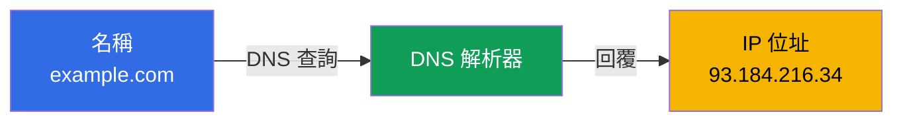
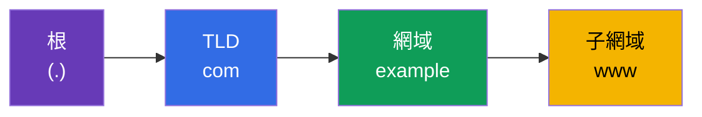
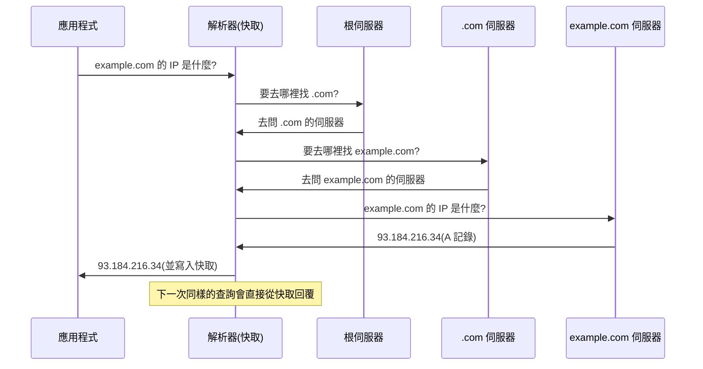
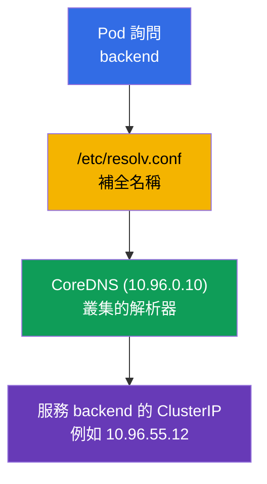

[Русская версия](ru.md) · [Eng version](README.md) · [Versión en español](es.md) · [Version française](fr.md) · [Deutsche Version](de.md) · [ქართული ვერსია](ge.md) · [日本語版](jp.md)

# 第 0.2 章。DNS 從零開始:名稱如何變成位址

> **這一章適合誰。** 我們繼續打好零基礎。如果你已經知道什麼是
> DNS、A 記錄與遞迴解析,- 可以直接跳到第 0.3 章。如果還不知道 - 這一
> 章會給你剛好足夠的最小知識,少了它就無法理解 CoreDNS(第 31 章)、形如
> `backend.default.svc.cluster.local` 的服務名稱,以及一半的網路
> troubleshooting。在叢集中幾乎所有東西都靠名稱溝通,而不是靠 IP,所以 DNS -
> 不是細節,而是承重結構。

## 0.2.1. DNS 解決的問題

IP 位址會變動,人也記不住,而在 Kubernetes 中 Pod 的 IP 更是暫時的:
Pod 一被重建 - 位址就不一樣了。不能直接用「原始」IP 來存取。**DNS(Domain Name
System)** 解決了這件事:它把**人類可讀的名稱**翻譯成 IP 位址,就像電話
簿把聯絡人的名字翻譯成號碼。



主要的想法:應用程式操作的是**名稱**,而基礎設施(DNS)在它之下
替換成目前的**位址**。名稱是穩定的,名稱背後的位址可以改變 - 這正
是 Service 與微服務所依賴的解耦。

## 0.2.2. 網域名稱的結構

名稱要**從右往左**讀,由一般到具體。點號分隔各個層級。



- **根** - 位於最尾端的隱形點號(`example.com.`)。
- **TLD**(top-level domain) - `com`、`org`、`ru`。
- **二級網域** - `example`。
- **子網域** - `www`、`api`、`mail`。

Kubernetes 中的名稱結構完全一樣,只是層級是自己的:
`backend.default.svc.cluster.local` = namespace `default` 中的服務 `backend`、
區段 `svc`、叢集區域 `cluster.local`。讀完這一章,你就能自動
拆解這樣的名稱。

## 0.2.3. 必須知道的記錄類型

DNS 儲存的不只是「名稱 → IPv4」。有幾種記錄類型會不斷出現:

| 記錄 | 設定什麼 | 範例 |
|--------|------------|--------|
| **A** | 名稱 → IPv4 | `example.com → 93.184.216.34` |
| **AAAA** | 名稱 → IPv6 | `example.com → 2606:2800:220:1:...` |
| **CNAME** | 別名 → 另一個名稱 | `www.example.com → example.com` |
| **PTR** | IP → 名稱(反向解析) | `34.216.184.93.in-addr.arpa → example.com` |
| **SRV** | 名稱對應的服務/埠 | 用於 headless 服務 |

對課程來說最重要的是 **A**(名稱→IP 的直接對應),以及知道還有
**反向解析**(PTR:用 IP 找出名稱)。叢集中的 CoreDNS(第 31 章)提供的
正是服務與 Pod 的這類記錄。

## 0.2.4. 解析如何進行:一個查詢的路徑

當程式想用名稱查出 IP 時,它並不是去問「網際網路的主伺服器」。
查詢會沿著一條鏈往下走,每一層都指出下一層在哪。



對 troubleshooting 而言有兩個關鍵點:

- **快取與 TTL。** 每一筆記錄都有 **TTL**(time to live) - 表示它可以在快取中
  保留幾秒。只要 TTL 還沒過期,答案就從快取取得,而不會再去
  重新詢問。於是就有了經典狀況:「記錄改了,舊位址卻還在回應」 - 等 TTL 過期。
- **解析器** - 就是替應用程式走完整個查詢流程的角色。在叢集中,解析器的
  角色由 **CoreDNS** 擔任。

## 0.2.5. 應用程式從哪裡取得 DNS 伺服器位址

在 Linux 上,DNS 伺服器清單與名稱搜尋規則放在檔案 `/etc/resolv.conf` 裡:

```text
nameserver 10.96.0.10
search default.svc.cluster.local svc.cluster.local cluster.local
```

- `nameserver` - DNS 查詢要送到哪裡(在叢集中這是 CoreDNS 服務的 ClusterIP)。
- `search` - 要為短名稱補上哪些後綴。多虧了它,在 Pod 內部
  只要寫 `backend`,系統就會自己補全成
  `backend.default.svc.cluster.local`。

正因如此,在第 31 章裡短的服務名稱才會「神奇地」被解析 - 魔法背後
就是這份 `search` 清單,kubelet 會自動把它寫進 Pod。

## 0.2.6. Kubernetes 中的 DNS:通往第 31 章的短橋



服務名稱的解析流程:Pod 詢問短名稱 → `resolv.conf` 補全成
完整名稱 → CoreDNS 回覆 ClusterIP → 流量前往服務。這一切都是普通的 DNS,
只是解析器在內部。我們會在第 31 章詳細說明。

## 0.2.7. 在生產環境中如何應用

- **透過 DNS 做服務發現。** 微服務之間用名稱互相尋找,而不是用 IP:
  Pod 的位址是短暫的,而服務名稱是穩定的。這是應用程式連通性的基礎。
- **DNS - 事故的常見根源。** 「什麼都不能用」意外地常常等於 DNS:
  CoreDNS 掛了、`search` 網域寫錯、搬遷之後 TTL 卡住。檢查 DNS -
  是診斷的第一批步驟之一。
- **把 TTL 當成工具。** 遷移服務之前會事先降低 TTL,讓
  位址切換可以快速擴散,不會出現「一半的用戶端還在舊 IP」。
- **內部與外部 DNS。** 叢集內部由 CoreDNS 解析名稱;對外
  公開的名稱則指向負載平衡器/Ingress。要追蹤請求從使用者到 Pod 的路徑,
  就必須理解這兩側。

## 0.2.8. 迷你詞彙表

- **DNS** - 把網域名稱翻譯成 IP 位址的系統。
- **解析器** - 代替應用程式執行 DNS 查詢的元件(在叢集中就是 -
  CoreDNS)。
- **TLD** - 頂級網域(`com`、`org`、`ru`)。
- **A 記錄 / AAAA 記錄** - 名稱 → IPv4 / 名稱 → IPv6。
- **CNAME** - 指向另一個名稱的別名。
- **PTR** - 反向記錄:IP → 名稱。
- **TTL** - 記錄在快取中的存活時間(以秒為單位)。
- **`/etc/resolv.conf`** - 存放 DNS 伺服器位址與 `search` 後綴的檔案。
- **search 網域** - 會自動補到短名稱後面的後綴。
- **FQDN** - 包含所有層級的完整網域名稱(例如 `backend.default.svc.cluster.local`)。

## 0.2.9. 本章總結

- DNS 把穩定的名稱翻譯成會變動的 IP - 這是服務與微服務所依賴的
  解耦。
- 名稱從右往左讀:根 → TLD → 網域 → 子網域;Kubernetes 的名稱
  結構也一樣(`svc.cluster.local`)。
- 關鍵記錄:A(名稱→IPv4)、AAAA(IPv6)、CNAME(別名)、PTR(反向)。
- 解析沿著伺服器鏈進行並帶有快取;TTL 決定一個答案在快取中
  能活多久。
- `/etc/resolv.conf` 設定 DNS 伺服器與 `search` 後綴;在 Pod 中由
  kubelet 寫入,所以短的服務名稱才能解析(第 31 章)。

## 0.2.10. 這些知識有什麼用:在考試中與在真實工作中

**在考試中。** DNS 是第 31 章(CoreDNS)與網路 troubleshooting 的基礎。
「Pod 無法解析服務」、「檢查 DNS」這類題目,只有在理解解析如何
運作、`search` 網域與服務的完整名稱之後才解得出來。從 Pod 內使用
`nslookup`/`dig` 工具 - 是標準的診斷手法。

**在真實工作中。** 服務發現、分析 CoreDNS 事故、遷移時管理 TTL、
銜接內部與外部 DNS - 都是日常運維的工作。
DNS 問題狡猾的地方在於它會偽裝成「什麼都不能用」,所以基礎
能省下好幾個小時。

## 0.2.11. 自我檢測問題

1. DNS 解決什麼問題,為什麼在 Kubernetes 中不能直接用 Pod 的 IP 存取?
2. 網域名稱要怎麼讀,這和 `backend.default.svc.cluster.local` 有什麼關聯?
3. A 記錄和 CNAME、PTR 有什麼不同?
4. TTL 是什麼,位址變更之後「卡住」的快取會有什麼表現?
5. `/etc/resolv.conf` 裡為什麼需要 `search` 網域,它對短名稱有什麼幫助?
6. 在叢集內部是誰擔任解析器的角色?

## 實作

第 0 部分沒有單獨的實驗。服務名稱的解析你會在網路相關的實驗中
親手練習,等你走到 CoreDNS(第 31 章)的時候。接下來 - 流量如何被保護:TLS 與
憑證。

---
[目錄](../README_TW.md) · [第 0.1 章](../00-1-net/tw.md) · [第 0.3 章](../00-3-tls/tw.md)
