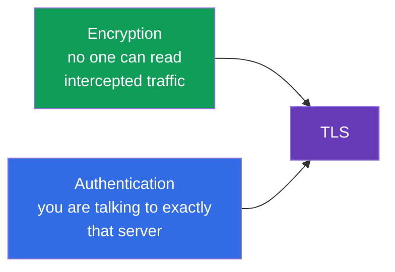
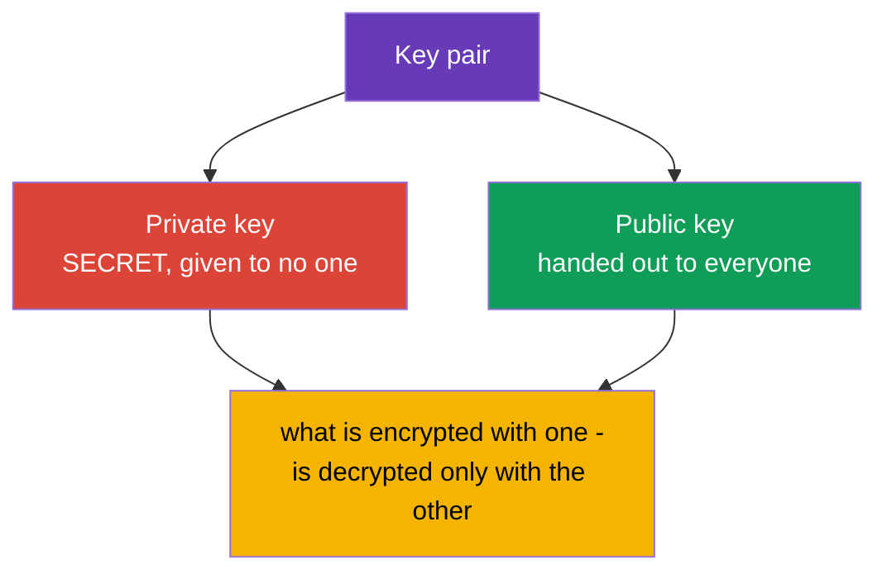
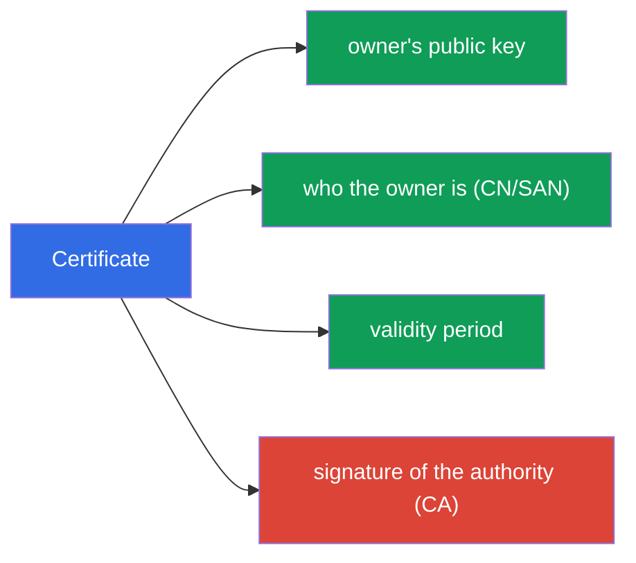
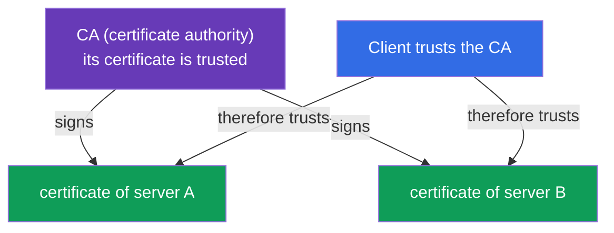
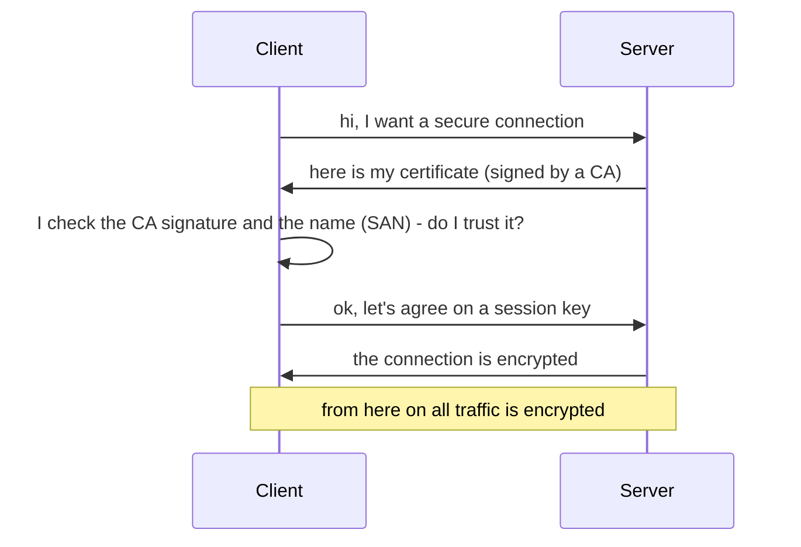

[Русская версия](ru.md) · [Versión en español](es.md) · [Version française](fr.md) · [Deutsche Version](de.md) · [ქართული ვერსია](ge.md)

# Chapter 0.3. TLS and certificates from scratch: HTTPS, keys, and certificate authorities

> **Who this chapter is for.** The third brick of the foundation. TLS feels like "magic
> with a little lock in the browser", but the entire security of Kubernetes rests on it:
> kube-apiserver, kubelet, etcd - everything talks over TLS, and the administrator's
> access is described by certificates in kubeconfig. If you can already confidently
> explain how a private key differs from a certificate and why a CA is needed - go
> straight to Chapter 0.4. If not - this chapter gives the minimum without which
> Chapters 39 (TLS and the CSR API) and 21 (authentication) read like a cipher.

## 0.3.1. Two problems that TLS solves

When data travels over the network, there are two risks: it can be **spied on** and it
can be **tampered with** (or something can pretend to be a different server). **TLS
(Transport Layer Security)** is the protocol that closes both risks. It is that very
"S" in HTTP**S**.

- **Encryption** - the traffic is unreadable to whoever intercepted it.
- **Authentication** - you make sure the other end really is who it claims to be (and
  not a fake server).

## 0.3.2. The key pair: private and public

At the heart of TLS lies **asymmetric cryptography** - a pair of mathematically related
keys:

The key property: what is encrypted with the **public** key is decrypted **only with the
private** one, and vice versa. The private key **never** leaves its owner - its leak
equals compromise. This rule carries over directly into Kubernetes: the private keys of
the components sit on the nodes in `/etc/kubernetes/pki` and are guarded as the most
valuable thing.

## 0.3.3. Certificate: a public key plus a signature

A public key by itself does not say **whom** it belongs to. This problem is solved by a
**certificate** - it is a public key plus information about the owner (name, validity
period), attested by the signature of a trusted party.

An analogy: the private key is your signature, and the certificate is a passport where
this signature is attested by the state. The passport can be shown to everyone, the
signature is kept to yourself.

## 0.3.4. Certificate authority (CA): the root of trust

Who attests certificates? A **CA (Certificate Authority)** - a certificate authority
that is trusted. With its private key it **signs** other parties' certificates. If you
trust the CA, then you automatically trust everything it has signed.

On the internet the list of trusted CAs is built into the browser and the OS. In
Kubernetes it is different and simpler: the cluster has **its own CA** (created at
`kubeadm init`), and it signs the certificates of all the components - apiserver,
kubelet, etcd, as well as administrators. This cluster CA is the root of trust of the
entire cluster (Chapters 35 and 39).

## 0.3.5. The TLS handshake: how it all comes together

When a client connects to a server over TLS, a **handshake** takes place:

Let's unpack the check at step 3 - it is the very essence of the security:

- the client looks at whether the server's certificate is **signed** by a trusted CA;
- it checks that the **name** in the certificate (the SAN/CN field) matches the one it
  is connecting to;
- it checks the **validity period**.

If anything doesn't match - the connection is rejected (this is what "certificate
expired" or "untrusted certificate" is). An expired certificate is a common cause of
"the cluster suddenly stopped working"; in Chapter 39 we'll look at how to renew them.

## 0.3.6. mTLS: both sides present a certificate

Ordinary HTTPS checks only the server (the client makes sure the server is genuine). In
Kubernetes **mTLS (mutual TLS)** is often used - mutual verification: **both** sides
present certificates. This way the apiserver makes sure the request came from a genuine
kubelet or administrator, and not from an impostor.

It is precisely on mTLS that certificate authentication is built (Chapter 21): the
cluster understands "who you are" by which certificate signed your request, and the
"group/name" are taken from the certificate's fields.

## 0.3.7. How this is applied in production

- **Certificate rotation.** Certificates have an expiry date; they are **renewed in
  advance** (`kubeadm certs renew`, Chapter 39). Miss the deadline - and the control
  plane goes down. In production this is watched with monitoring "N days before
  expiry".
- **Your own CA and protecting its key.** The private key of the cluster CA is the most
  valuable secret: whoever holds it can issue an "administrator" certificate and gain
  full access. It is guarded especially.
- **TLS termination at the Ingress.** External HTTPS is usually decrypted at the Ingress
  controller (Chapter 32): the certificate sits in a Secret of type `tls`, and further
  inside the cluster the traffic goes over the internal network.
- **Automating issuance.** Tools like cert-manager automatically issue and renew
  certificates (including from Let's Encrypt), so you don't have to do it by hand.

## 0.3.8. Mini-glossary

- **TLS** - a protocol for encrypting and authenticating traffic (the letter "S" in
  HTTPS).
- **Asymmetric cryptography** - a pair of related keys: private and public.
- **Private key** - the owner's secret key, never transmitted.
- **Public key** - the open key, handed out to everyone.
- **Certificate** - a public key + owner data + a CA signature.
- **CA (Certificate Authority)** - the authority that signs certificates; the root of
  trust.
- **Handshake** - the procedure of establishing a TLS connection.
- **SAN / CN** - the owner's name(s) in the certificate, checked at connection time.
- **mTLS** - mutual TLS: both sides present certificates.
- **TLS termination** - decrypting HTTPS at the entrance (e.g. at the Ingress).

## 0.3.9. Chapter summary

- TLS solves two problems: encryption (no one spies) and authentication (is it the right
  server).
- At the core is a key pair: private (secret) and public (open); what is encrypted with
  one is decrypted only with the other.
- A certificate = a public key + owner data + a CA signature; the key itself doesn't
  reveal whom it belongs to - the signature is responsible for that.
- A CA is the root of trust: you trust the CA - you trust everything it signed. The
  cluster has its own CA, created at installation.
- At the handshake the client checks the CA signature, the name (SAN), and the validity
  period; a mismatch - rejection.
- mTLS (mutual verification) is the basis of authentication for components and users in
  the cluster (Chapters 21, 39).

## 0.3.10. How this helps: on the exam and in real work

**On the exam.** Without a TLS foundation you won't understand Chapter 39 (certificates,
kubeconfig, the CSR API) and Chapter 21 (certificate authentication). Tasks like "issue
a certificate via CSR", "fix an expired certificate", "assemble a kubeconfig" rely
exactly on the concepts of private key / certificate / CA. The same is needed for an
Ingress with TLS (a Secret of type `tls`).

**In real work.** Certificate rotation, protecting the CA key, TLS termination at the
Ingress, automation via cert-manager - constant tasks. An expired certificate is a
classic middle-of-the-night incident, and understanding the trust model speeds up the
investigation.

## 0.3.11. Self-check questions

1. Which two problems does TLS solve?
2. How does a private key differ from a public one, and why must the private one not be
   transmitted?
3. What does a certificate contain and why is a CA signature needed?
4. How does a client decide whether to trust a server's certificate during the
   handshake?
5. How does mTLS differ from ordinary HTTPS and where is it used in Kubernetes?
6. Why can an expired certificate "bring down" the control plane?

## Practice

There is no separate lab for Part 0. You'll get hands-on with certificates in the labs
on security and administration (the CSR API, kubeconfig, TLS on the Ingress). Next up -
the last brick of the foundation: containers and images.

---
[Contents](../README.md) · [Chapter 0.2](../00-2-dns/README.md) · [Chapter 0.4](../00-4-containers/README.md)
