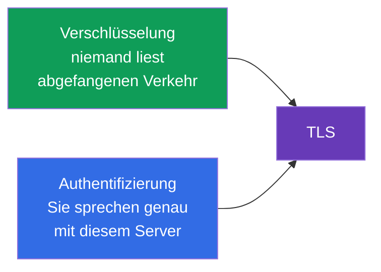
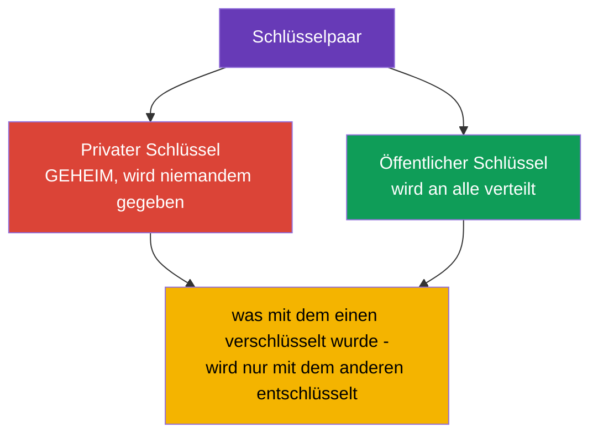
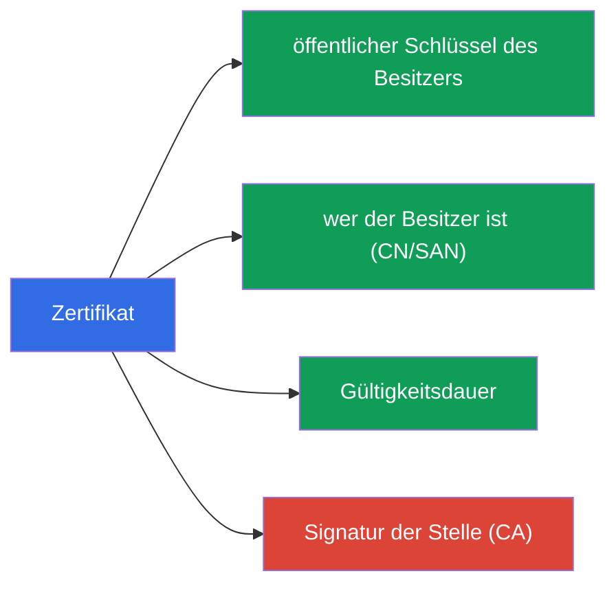
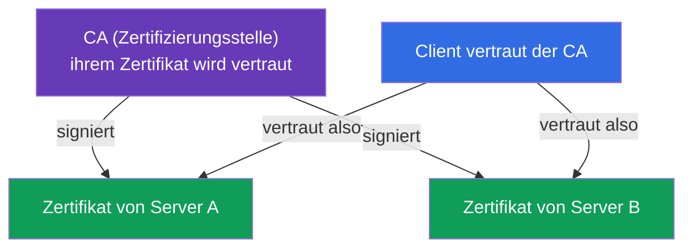
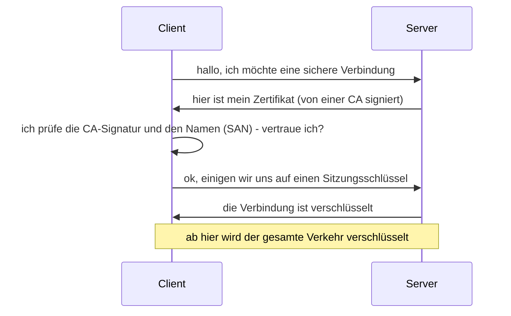

[Русская версия](ru.md) · [Eng version](README.md) · [Versión en español](es.md) · [Version française](fr.md) · [ქართული ვერსია](ge.md)

# Kapitel 0.3. TLS und Zertifikate von Grund auf: HTTPS, Schlüssel und Zertifizierungsstellen

> **Für wen dieses Kapitel ist.** Der dritte Baustein des Fundaments. TLS wirkt wie
> „Magie mit einem Schlösschen im Browser“, doch auf ihm ruht die gesamte Sicherheit von
> Kubernetes: kube-apiserver, kubelet, etcd - alles kommuniziert über TLS, und der Zugang
> des Administrators wird durch Zertifikate in kubeconfig beschrieben. Wenn Sie bereits
> sicher erklären können, wie sich ein privater Schlüssel von einem Zertifikat
> unterscheidet und wozu eine CA nötig ist - gehen Sie direkt zu Kapitel 0.4. Wenn nicht
> - dieses Kapitel gibt das Minimum, ohne das die Kapitel 39 (TLS und die CSR-API) und 21
> (Authentifizierung) wie eine Geheimschrift zu lesen sind.

## 0.3.1. Zwei Probleme, die TLS löst

Wenn Daten über das Netzwerk gehen, gibt es zwei Risiken: sie können **ausspioniert** und
sie können **manipuliert** werden (oder etwas kann sich als ein anderer Server ausgeben).
**TLS (Transport Layer Security)** ist das Protokoll, das beide Risiken schließt. Es ist
genau jenes „S“ in HTTP**S**.

- **Verschlüsselung** - der Verkehr ist für denjenigen, der ihn abgefangen hat,
  unlesbar.
- **Authentifizierung** - Sie vergewissern sich, dass am anderen Ende wirklich der ist,
  für den er sich ausgibt (und kein untergeschobener Server).

## 0.3.2. Das Schlüsselpaar: privat und öffentlich

Der Kern von TLS ist die **asymmetrische Kryptografie** - ein Paar mathematisch
verknüpfter Schlüssel:

Die zentrale Eigenschaft: Was mit dem **öffentlichen** Schlüssel verschlüsselt wurde,
wird **nur mit dem privaten** entschlüsselt und umgekehrt. Der private Schlüssel verlässt
seinen Besitzer **niemals** - sein Leck kommt einer Kompromittierung gleich. Diese Regel
überträgt sich direkt auf Kubernetes: Die privaten Schlüssel der Komponenten liegen auf
den Knoten in `/etc/kubernetes/pki` und werden wie das Wertvollste gehütet.

## 0.3.3. Zertifikat: ein öffentlicher Schlüssel plus eine Signatur

Ein öffentlicher Schlüssel allein sagt nicht, **wem** er gehört. Dieses Problem löst ein
**Zertifikat** - es ist ein öffentlicher Schlüssel plus Informationen über den Besitzer
(Name, Gültigkeitsdauer), beglaubigt durch die Signatur einer vertrauenswürdigen Partei.

Eine Analogie: Der private Schlüssel ist Ihre Unterschrift, und das Zertifikat ist ein
Reisepass, in dem diese Unterschrift vom Staat beglaubigt ist. Den Reisepass kann man
allen zeigen, die Unterschrift behält man für sich.

## 0.3.4. Zertifizierungsstelle (CA): die Wurzel des Vertrauens

Wer beglaubigt Zertifikate? Eine **CA (Certificate Authority)** - eine
Zertifizierungsstelle, der vertraut wird. Mit ihrem privaten Schlüssel **signiert** sie
fremde Zertifikate. Wenn Sie der CA vertrauen, dann vertrauen Sie automatisch allem, was
sie signiert hat.

Im Internet ist die Liste der vertrauenswürdigen CAs in den Browser und das
Betriebssystem eingebaut. In Kubernetes ist es anders und einfacher: Der Cluster hat
**seine eigene CA** (wird bei `kubeadm init` erstellt), und sie signiert die Zertifikate
aller Komponenten - apiserver, kubelet, etcd sowie der Administratoren. Diese Cluster-CA
ist die Wurzel des Vertrauens des gesamten Clusters (Kapitel 35 und 39).

## 0.3.5. Der TLS-Handshake: wie es zusammenkommt

Wenn ein Client sich über TLS mit einem Server verbindet, findet ein **Handshake**
statt:

Zerlegen wir die Prüfung in Schritt 3 - sie ist der eigentliche Kern der Sicherheit:

- der Client schaut, ob das Zertifikat des Servers von einer vertrauenswürdigen CA
  **signiert** ist;
- er prüft, dass der **Name** im Zertifikat (das Feld SAN/CN) mit dem übereinstimmt, mit
  dem er sich verbindet;
- er prüft die **Gültigkeitsdauer**.

Stimmt irgendetwas nicht - wird die Verbindung abgelehnt (das ist es, was „Zertifikat
abgelaufen“ oder „nicht vertrauenswürdiges Zertifikat“ bedeutet). Ein abgelaufenes
Zertifikat ist eine häufige Ursache für „der Cluster hat plötzlich aufgehört zu
funktionieren“; in Kapitel 39 sehen wir uns an, wie man sie erneuert.

## 0.3.6. mTLS: beide Seiten legen ein Zertifikat vor

Gewöhnliches HTTPS prüft nur den Server (der Client vergewissert sich, dass der Server
echt ist). In Kubernetes wird oft **mTLS (mutual TLS)** verwendet - gegenseitige Prüfung:
**beide** Seiten legen Zertifikate vor. So vergewissert sich der apiserver, dass die
Anfrage von einem echten kubelet oder Administrator kam und nicht von einem Betrüger.

Genau auf mTLS baut die Authentifizierung per Zertifikat auf (Kapitel 21): Der Cluster
versteht „wer du bist“ daran, mit welchem Zertifikat deine Anfrage signiert wurde, und
„Gruppe/Name“ werden aus den Feldern des Zertifikats entnommen.

## 0.3.7. Wie das in der Produktion angewendet wird

- **Zertifikatsrotation.** Zertifikate haben ein Ablaufdatum; sie werden **im Voraus
  erneuert** (`kubeadm certs renew`, Kapitel 39). Verpasst man die Frist - steht der
  Control Plane. In der Produktion wird das mit einer Überwachung „N Tage vor Ablauf“
  verfolgt.
- **Eigene CA und der Schutz ihres Schlüssels.** Der private Schlüssel der Cluster-CA ist
  das wertvollste Geheimnis: Wer ihn besitzt, kann ein „Administrator“-Zertifikat
  ausstellen und vollen Zugriff erlangen. Er wird besonders gehütet.
- **TLS-Terminierung am Ingress.** Externes HTTPS wird üblicherweise am
  Ingress-Controller entschlüsselt (Kapitel 32): Das Zertifikat liegt in einem Secret vom
  Typ `tls`, und weiter im Cluster geht der Verkehr bereits über das interne Netzwerk.
- **Automatisierung der Ausstellung.** Werkzeuge wie cert-manager stellen Zertifikate
  automatisch aus und erneuern sie (auch von Let's Encrypt), damit man es nicht von Hand
  tun muss.

## 0.3.8. Mini-Glossar

- **TLS** - Protokoll zur Verschlüsselung und Authentifizierung des Verkehrs (der
  Buchstabe „S“ in HTTPS).
- **Asymmetrische Kryptografie** - ein Paar verknüpfter Schlüssel: privat und öffentlich.
- **Privater Schlüssel** - der geheime Schlüssel des Besitzers, wird nie übertragen.
- **Öffentlicher Schlüssel** - der offene Schlüssel, wird an alle verteilt.
- **Zertifikat** - öffentlicher Schlüssel + Besitzerdaten + CA-Signatur.
- **CA (Certificate Authority)** - die Stelle, die Zertifikate signiert; die Wurzel des
  Vertrauens.
- **Handshake** - die Prozedur des Aufbaus einer TLS-Verbindung.
- **SAN / CN** - der/die Name(n) des Besitzers im Zertifikat, geprüft beim Verbinden.
- **mTLS** - gegenseitiges TLS: die Zertifikate legen beide Seiten vor.
- **TLS-Terminierung** - das Entschlüsseln von HTTPS am Eingang (z. B. am Ingress).

## 0.3.9. Zusammenfassung des Kapitels

- TLS löst zwei Probleme: Verschlüsselung (niemand spioniert) und Authentifizierung (ist
  es der richtige Server).
- Im Kern steht ein Schlüsselpaar: privat (geheim) und öffentlich (offen); was mit dem
  einen verschlüsselt wurde, wird nur mit dem anderen entschlüsselt.
- Zertifikat = öffentlicher Schlüssel + Besitzerdaten + CA-Signatur; der Schlüssel selbst
  verrät nicht, wem er gehört - dafür ist die Signatur zuständig.
- Die CA ist die Wurzel des Vertrauens: vertraust du der CA - vertraust du allem, was sie
  signiert hat. Der Cluster hat seine eigene CA, erstellt bei der Installation.
- Beim Handshake prüft der Client die CA-Signatur, den Namen (SAN) und die Frist; eine
  Nichtübereinstimmung - Ablehnung.
- mTLS (gegenseitige Prüfung) ist die Grundlage der Authentifizierung von Komponenten und
  Benutzern im Cluster (Kapitel 21, 39).

## 0.3.10. Wozu das nützt: in der Prüfung und im echten Arbeitsalltag

**In der Prüfung.** Ohne die TLS-Grundlage versteht man Kapitel 39 (Zertifikate,
kubeconfig, CSR-API) und Kapitel 21 (Authentifizierung per Zertifikat) nicht. Aufgaben
wie „stelle ein Zertifikat über CSR aus“, „repariere ein abgelaufenes Zertifikat“, „baue
ein kubeconfig zusammen“ stützen sich genau auf die Begriffe privater Schlüssel /
Zertifikat / CA. Dasselbe braucht man für einen Ingress mit TLS (ein Secret vom Typ
`tls`).

**Im echten Arbeitsalltag.** Zertifikatsrotation, Schutz des CA-Schlüssels,
TLS-Terminierung am Ingress, Automatisierung über cert-manager - ständige Aufgaben. Ein
abgelaufenes Zertifikat ist ein klassischer nächtlicher Vorfall, und das Verständnis des
Vertrauensmodells beschleunigt die Analyse.

## 0.3.11. Fragen zur Selbstüberprüfung

1. Welche zwei Probleme löst TLS?
2. Wie unterscheidet sich ein privater Schlüssel von einem öffentlichen und warum darf
   der private nicht übertragen werden?
3. Was enthält ein Zertifikat und wozu ist die CA-Signatur nötig?
4. Wie entscheidet ein Client während des Handshakes, ob er dem Zertifikat eines Servers
   vertraut?
5. Wie unterscheidet sich mTLS von gewöhnlichem HTTPS und wo wird es in Kubernetes
   verwendet?
6. Warum kann ein abgelaufenes Zertifikat den Control Plane „lahmlegen“?

## Praxis

Für Teil 0 gibt es keine eigene Übung. Mit Zertifikaten arbeiten Sie praktisch in den
Übungen zu Sicherheit und Administration (CSR-API, kubeconfig, TLS am Ingress). Als
Nächstes - der letzte Baustein des Fundaments: Container und Images.

---
[Inhalt](../README_DE.md) · [Kapitel 0.2](../00-2-dns/de.md) · [Kapitel 0.4](../00-4-containers/de.md)
