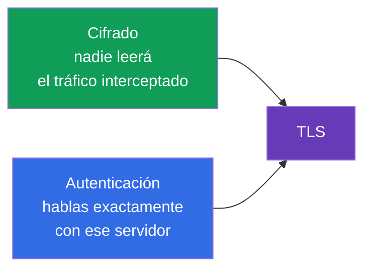
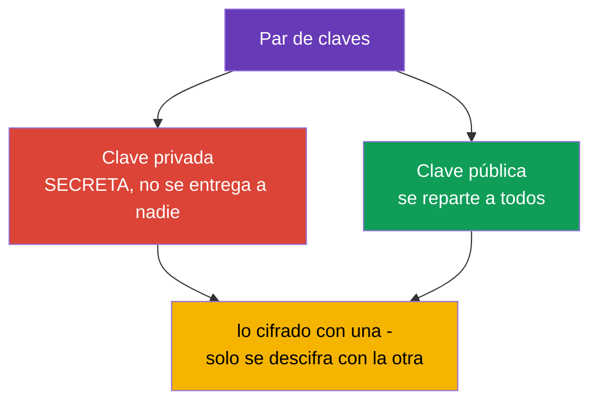
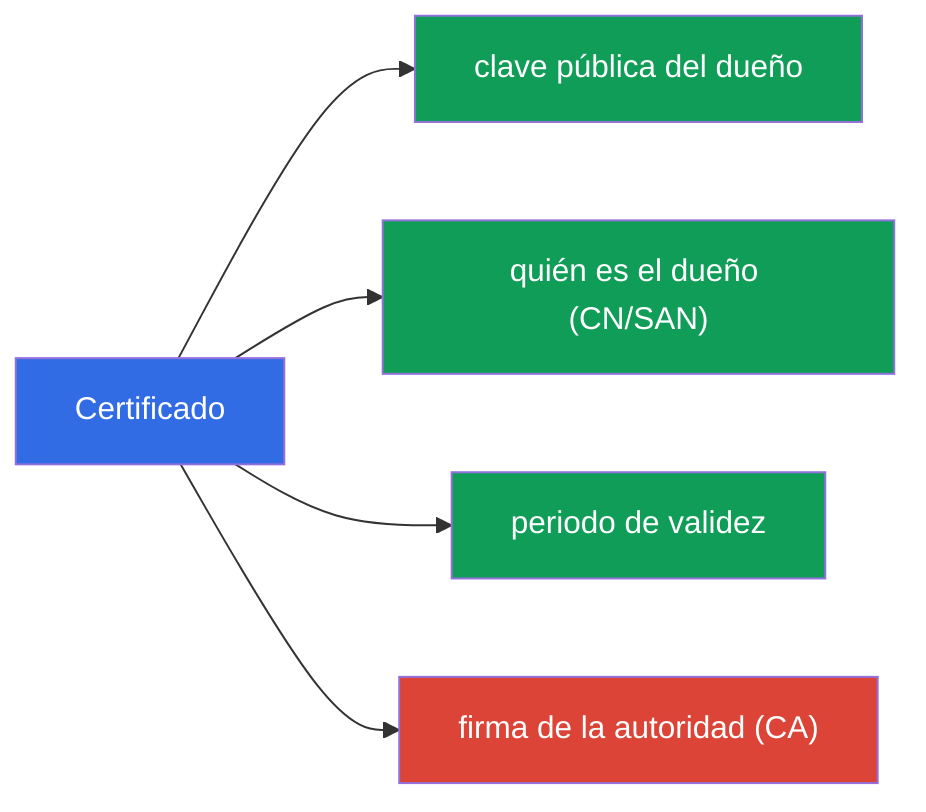
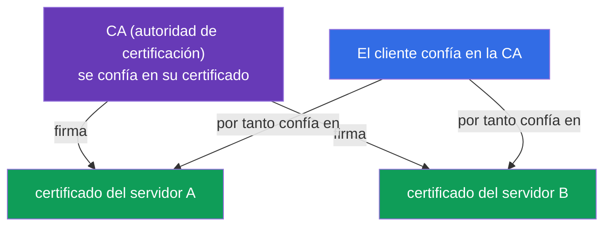
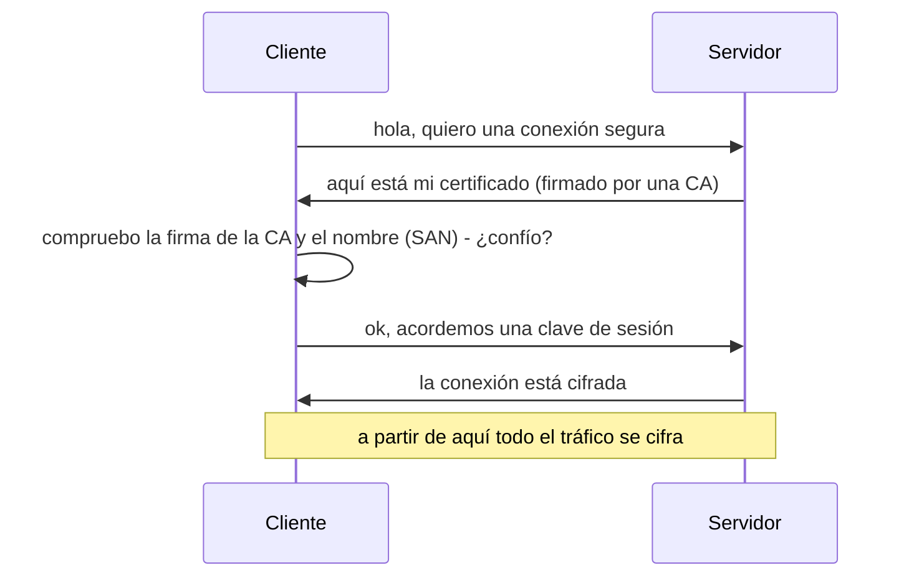

[Русская версия](ru.md) · [Eng version](README.md) · [Version française](fr.md) · [Deutsche Version](de.md) · [ქართული ვერსია](ge.md) · [繁體中文版](tw.md) · [日本語版](jp.md)

# Capítulo 0.3. TLS y certificados desde cero: HTTPS, claves y autoridades de certificación

> **Para quién es este capítulo.** El tercer ladrillo de la base. TLS parece "magia con
> un candadito en el navegador", pero sobre él se apoya toda la seguridad de Kubernetes:
> kube-apiserver, kubelet, etcd - todo se comunica por TLS, y el acceso del administrador
> se describe con certificados en kubeconfig. Si ya explicas con confianza en qué se
> diferencia una clave privada de un certificado y para qué sirve una CA - ve directo al
> Capítulo 0.4. Si no - este capítulo da el mínimo sin el cual los Capítulos 39 (TLS y la
> CSR API) y 21 (autenticación) se leen como un cifrado.

## 0.3.1. Dos problemas que resuelve TLS

Cuando los datos viajan por la red, hay dos riesgos: que los **espíen** y que los
**manipulen** (o que algo se haga pasar por otro servidor). **TLS (Transport Layer
Security)** es el protocolo que cierra ambos riesgos. Es esa misma "S" de HTTP**S**.

- **Cifrado** - el tráfico es ilegible para quien lo ha interceptado.
- **Autenticación** - te aseguras de que en el otro extremo está de verdad quien dice
  ser (y no un servidor suplantado).

## 0.3.2. El par de claves: privada y pública

En la base de TLS está la **criptografía asimétrica** - un par de claves relacionadas
matemáticamente:

La propiedad clave: lo que se cifra con la clave **pública** se descifra **solo con la
privada**, y viceversa. La clave privada **nunca** abandona a su dueño - su fuga equivale
a un compromiso. Esta regla se traslada directamente a Kubernetes: las claves privadas de
los componentes están en los nodos, en `/etc/kubernetes/pki`, y se custodian como lo más
valioso.

## 0.3.3. Certificado: una clave pública más una firma

Una clave pública por sí sola no dice **a quién** pertenece. Ese problema lo resuelve un
**certificado** - es una clave pública más información sobre el dueño (nombre, periodo de
validez), avalada por la firma de una parte de confianza.

Una analogía: la clave privada es tu firma, y el certificado es un pasaporte donde esa
firma está avalada por el Estado. El pasaporte puedes mostrarlo a todos, la firma la
guardas para ti.

## 0.3.4. Autoridad de certificación (CA): la raíz de confianza

¿Quién avala los certificados? Una **CA (Certificate Authority)** - una autoridad de
certificación en la que se confía. Con su clave privada **firma** los certificados
ajenos. Si confías en la CA, entonces confías automáticamente en todo lo que ella haya
firmado.

En internet la lista de CA de confianza está integrada en el navegador y el sistema
operativo. En Kubernetes es distinto y más simple: el clúster tiene **su propia CA** (se
crea en `kubeadm init`), y firma los certificados de todos los componentes - apiserver,
kubelet, etcd, así como los de los administradores. Esta CA del clúster es la raíz de
confianza de todo el clúster (Capítulos 35 y 39).

## 0.3.5. El handshake de TLS: cómo encaja todo

Cuando un cliente se conecta a un servidor por TLS, se produce un **handshake**
(saludo):

Desglosemos la comprobación del paso 3 - es justo la esencia de la seguridad:

- el cliente mira si el certificado del servidor está **firmado** por una CA de
  confianza;
- comprueba que el **nombre** del certificado (el campo SAN/CN) coincide con aquel al que
  se conecta;
- comprueba el **periodo de validez**.

Si algo no cuadra - la conexión se rechaza (esto es lo que es "certificado caducado" o
"certificado no confiable"). Un certificado caducado es una causa frecuente de "el
clúster de pronto dejó de funcionar"; en el Capítulo 39 veremos cómo renovarlos.

## 0.3.6. mTLS: ambas partes presentan certificado

El HTTPS normal comprueba solo al servidor (el cliente se asegura de que el servidor es
auténtico). En Kubernetes se usa a menudo **mTLS (mutual TLS)** - comprobación mutua:
**ambas** partes presentan certificados. Así el apiserver se asegura de que la petición
vino de un kubelet o un administrador de verdad, y no de un impostor.

Precisamente sobre mTLS se construye la autenticación por certificados (Capítulo 21): el
clúster entiende "quién eres" por el certificado con que se firmó tu petición, y el
"grupo/nombre" se toman de los campos del certificado.

## 0.3.7. Cómo se aplica esto en producción

- **Rotación de certificados.** Los certificados tienen fecha de caducidad; se
  **renuevan con antelación** (`kubeadm certs renew`, Capítulo 39). Si te pasas del plazo
  - el control plane se cae. En producción esto se vigila con monitorización "N días
  antes de la caducidad".
- **CA propia y protección de su clave.** La clave privada de la CA del clúster es el
  secreto más valioso: quien la posee puede emitir un certificado de "administrador" y
  obtener acceso total. Se protege de forma especial.
- **Terminación TLS en el Ingress.** El HTTPS externo suele descifrarse en el controlador
  de Ingress (Capítulo 32): el certificado está en un Secret de tipo `tls`, y más adentro
  del clúster el tráfico ya va por la red interna.
- **Automatización de la emisión.** Herramientas como cert-manager emiten y renuevan
  certificados automáticamente (incluidos los de Let's Encrypt), para no hacerlo a mano.

## 0.3.8. Miniglosario

- **TLS** - protocolo de cifrado y autenticación del tráfico (la letra "S" de HTTPS).
- **Criptografía asimétrica** - un par de claves relacionadas: privada y pública.
- **Clave privada** - la clave secreta del dueño, nunca se transmite.
- **Clave pública** - la clave abierta, se reparte a todos.
- **Certificado** - clave pública + datos del dueño + firma de la CA.
- **CA (Certificate Authority)** - la autoridad que firma certificados; la raíz de
  confianza.
- **Handshake** - el procedimiento para establecer una conexión TLS.
- **SAN / CN** - el nombre (o nombres) del dueño en el certificado, comprobados al
  conectarse.
- **mTLS** - TLS mutuo: los certificados los presentan ambas partes.
- **Terminación TLS** - el descifrado del HTTPS a la entrada (p. ej. en el Ingress).

## 0.3.9. Resumen del capítulo

- TLS resuelve dos problemas: cifrado (no espiarán) y autenticación (si es el servidor
  correcto).
- En la base está un par de claves: privada (secreta) y pública (abierta); lo cifrado con
  una se descifra solo con la otra.
- Certificado = clave pública + datos del dueño + firma de la CA; la clave por sí sola no
  revela a quién pertenece - de eso se encarga la firma.
- La CA es la raíz de confianza: confías en la CA - confías en todo lo que firmó. El
  clúster tiene su propia CA, creada en la instalación.
- En el handshake el cliente comprueba la firma de la CA, el nombre (SAN) y el plazo; una
  discrepancia - rechazo.
- mTLS (comprobación mutua) es la base de la autenticación de componentes y usuarios en
  el clúster (Capítulos 21, 39).

## 0.3.10. Para qué sirve: en el examen y en el trabajo real

**En el examen.** Sin la base de TLS no se entiende el Capítulo 39 (certificados,
kubeconfig, CSR API) ni el Capítulo 21 (autenticación por certificados). Las tareas
"emite un certificado vía CSR", "arregla un certificado caducado", "monta un kubeconfig"
se apoyan justo en los conceptos de clave privada / certificado / CA. Lo mismo hace falta
para un Ingress con TLS (un Secret de tipo `tls`).

**En el trabajo real.** La rotación de certificados, la protección de la clave de la CA,
la terminación TLS en el Ingress, la automatización con cert-manager - tareas constantes.
Un certificado caducado es un clásico incidente nocturno, y entender el modelo de
confianza acelera el análisis.

## 0.3.11. Preguntas de autoevaluación

1. ¿Qué dos problemas resuelve TLS?
2. ¿En qué se diferencia una clave privada de una pública y por qué la privada no se
   puede transmitir?
3. ¿Qué contiene un certificado y para qué sirve la firma de la CA?
4. ¿Cómo decide un cliente si confía en el certificado de un servidor durante el
   handshake?
5. ¿En qué se diferencia mTLS del HTTPS normal y dónde se usa en Kubernetes?
6. ¿Por qué un certificado caducado puede "tumbar" el control plane?

## Práctica

No hay una práctica aparte para la Parte 0. Con los certificados trabajarás a mano en las
prácticas de seguridad y administración (CSR API, kubeconfig, TLS en el Ingress). A
continuación - el último ladrillo de la base: contenedores e imágenes.

---
[Índice](../README_ES.md) · [Capítulo 0.2](../00-2-dns/es.md) · [Capítulo 0.4](../00-4-containers/es.md)
