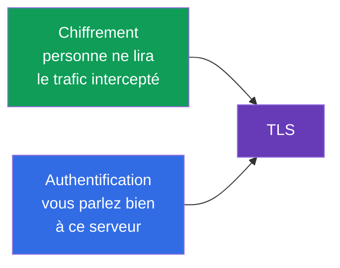
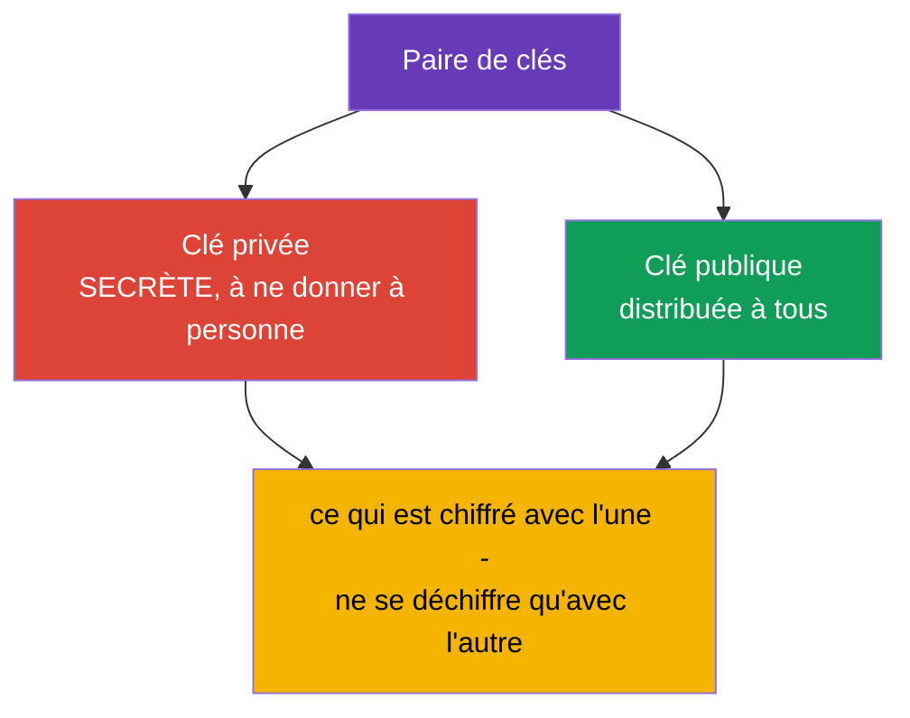
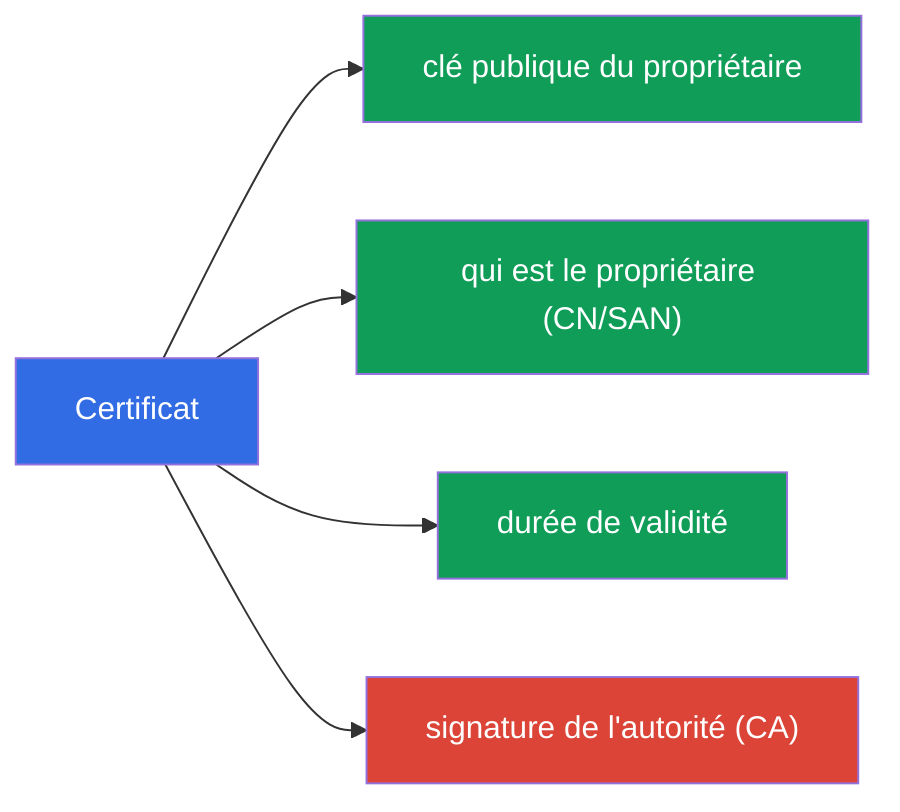
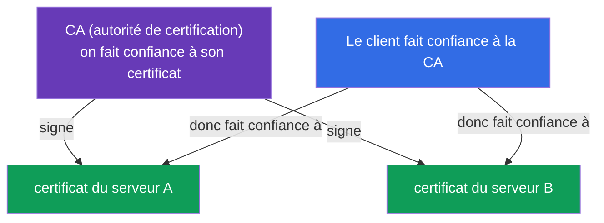
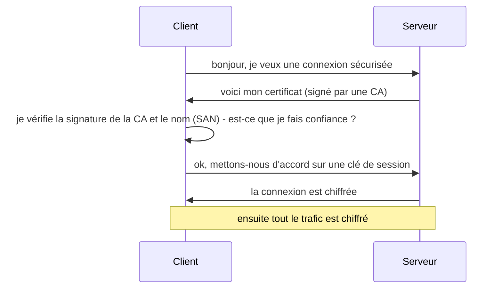

[Русская версия](ru.md) · [Eng version](README.md) · [Versión en español](es.md) · [Deutsche Version](de.md) · [ქართული ვერსია](ge.md)

# Chapitre 0.3. TLS et certificats depuis zéro : HTTPS, clés et autorités de certification

> **À qui s'adresse ce chapitre.** La troisième brique du socle. TLS semble être « une
> magie avec un petit cadenas dans le navigateur », mais toute la sécurité de Kubernetes
> repose dessus : kube-apiserver, kubelet, etcd - tout communique en TLS, et l'accès de
> l'administrateur est décrit par des certificats dans kubeconfig. Si vous savez déjà
> expliquer avec assurance en quoi une clé privée diffère d'un certificat et à quoi sert
> une CA - passez directement au Chapitre 0.4. Sinon - ce chapitre donne le minimum sans
> lequel les Chapitres 39 (TLS et l'API CSR) et 21 (authentification) se lisent comme un
> chiffre.

## 0.3.1. Deux problèmes que TLS résout

Quand des données circulent sur le réseau, il y a deux risques : qu'on les **espionne**
et qu'on les **altère** (ou que quelque chose se fasse passer pour un autre serveur).
**TLS (Transport Layer Security)** est le protocole qui ferme ces deux risques. C'est ce
fameux « S » de HTTP**S**.

- **Chiffrement** - le trafic est illisible pour celui qui l'a intercepté.
- **Authentification** - vous vous assurez qu'à l'autre bout se trouve vraiment celui
  qu'il prétend être (et non un serveur usurpateur).

## 0.3.2. La paire de clés : privée et publique

À la base de TLS se trouve la **cryptographie asymétrique** - une paire de clés liées
mathématiquement :

La propriété essentielle : ce qui est chiffré avec la clé **publique** ne se déchiffre
**qu'avec la privée**, et inversement. La clé privée **ne quitte jamais** son
propriétaire - sa fuite équivaut à une compromission. Cette règle se transpose
directement dans Kubernetes : les clés privées des composants se trouvent sur les nœuds
dans `/etc/kubernetes/pki` et sont gardées comme le bien le plus précieux.

## 0.3.3. Certificat : une clé publique plus une signature

Une clé publique à elle seule ne dit pas **à qui** elle appartient. Ce problème est
résolu par un **certificat** - c'est une clé publique plus des informations sur le
propriétaire (nom, durée de validité), attestées par la signature d'une partie de
confiance.

Une analogie : la clé privée est votre signature, et le certificat est un passeport où
cette signature est attestée par l'État. Le passeport peut être montré à tout le monde,
la signature se garde pour soi.

## 0.3.4. Autorité de certification (CA) : la racine de confiance

Qui atteste les certificats ? Une **CA (Certificate Authority)** - une autorité de
certification à laquelle on fait confiance. Avec sa clé privée elle **signe** les
certificats des autres. Si vous faites confiance à la CA, alors vous faites
automatiquement confiance à tout ce qu'elle a signé.

Sur internet, la liste des CA de confiance est intégrée au navigateur et à l'OS. Dans
Kubernetes c'est différent et plus simple : le cluster a **sa propre CA** (créée lors de
`kubeadm init`), et elle signe les certificats de tous les composants - apiserver,
kubelet, etcd, ainsi que ceux des administrateurs. Cette CA du cluster est la racine de
confiance de tout le cluster (Chapitres 35 et 39).

## 0.3.5. La poignée de main TLS : comment tout s'assemble

Quand un client se connecte à un serveur en TLS, il se produit un **handshake** (poignée
de main) :

Décortiquons la vérification de l'étape 3 - elle est l'essence même de la sécurité :

- le client regarde si le certificat du serveur est **signé** par une CA de confiance ;
- il vérifie que le **nom** du certificat (le champ SAN/CN) correspond à celui auquel il
  se connecte ;
- il vérifie la **durée de validité**.

Si quoi que ce soit ne concorde pas - la connexion est refusée (c'est ce qu'est «
certificat expiré » ou « certificat non fiable »). Un certificat expiré est une cause
fréquente de « le cluster a soudain cessé de fonctionner » ; au Chapitre 39 nous verrons
comment les renouveler.

## 0.3.6. mTLS : les deux parties présentent un certificat

Le HTTPS ordinaire ne vérifie que le serveur (le client s'assure que le serveur est
authentique). Dans Kubernetes on utilise souvent **mTLS (mutual TLS)** - une vérification
mutuelle : **les deux** parties présentent des certificats. Ainsi l'apiserver s'assure
que la requête vient d'un vrai kubelet ou administrateur, et non d'un imposteur.

C'est justement sur mTLS que repose l'authentification par certificats (Chapitre 21) : le
cluster comprend « qui vous êtes » d'après le certificat qui a signé votre requête, et le
« groupe/nom » sont tirés des champs du certificat.

## 0.3.7. Comment cela s'applique en production

- **Rotation des certificats.** Les certificats ont une date d'expiration ; on les
  **renouvelle à l'avance** (`kubeadm certs renew`, Chapitre 39). Rater l'échéance - et
  le control plane tombe. En production, cela se surveille par une supervision « N jours
  avant l'expiration ».
- **Sa propre CA et la protection de sa clé.** La clé privée de la CA du cluster est le
  secret le plus précieux : celui qui la détient peut émettre un certificat «
  administrateur » et obtenir un accès total. On la garde tout particulièrement.
- **Terminaison TLS sur l'Ingress.** Le HTTPS externe est généralement déchiffré au
  niveau du contrôleur Ingress (Chapitre 32) : le certificat se trouve dans un Secret de
  type `tls`, et plus loin dans le cluster le trafic circule déjà sur le réseau interne.
- **Automatisation de l'émission.** Des outils comme cert-manager émettent et
  renouvellent automatiquement les certificats (y compris ceux de Let's Encrypt), pour ne
  pas le faire à la main.

## 0.3.8. Mini-glossaire

- **TLS** - protocole de chiffrement et d'authentification du trafic (la lettre « S » de
  HTTPS).
- **Cryptographie asymétrique** - une paire de clés liées : privée et publique.
- **Clé privée** - la clé secrète du propriétaire, jamais transmise.
- **Clé publique** - la clé ouverte, distribuée à tous.
- **Certificat** - clé publique + données du propriétaire + signature de la CA.
- **CA (Certificate Authority)** - l'autorité qui signe les certificats ; la racine de
  confiance.
- **Handshake** - la procédure d'établissement d'une connexion TLS.
- **SAN / CN** - le(s) nom(s) du propriétaire dans le certificat, vérifiés lors de la
  connexion.
- **mTLS** - TLS mutuel : les certificats sont présentés par les deux parties.
- **Terminaison TLS** - le déchiffrement du HTTPS à l'entrée (p. ex. sur l'Ingress).

## 0.3.9. Récapitulatif du chapitre

- TLS résout deux problèmes : le chiffrement (personne n'espionne) et l'authentification
  (est-ce le bon serveur).
- À la base, une paire de clés : privée (secrète) et publique (ouverte) ; ce qui est
  chiffré avec l'une ne se déchiffre qu'avec l'autre.
- Certificat = clé publique + données du propriétaire + signature de la CA ; la clé
  elle-même ne révèle pas à qui elle appartient - c'est la signature qui s'en charge.
- La CA est la racine de confiance : vous faites confiance à la CA - vous faites confiance
  à tout ce qu'elle a signé. Le cluster a sa propre CA, créée à l'installation.
- Lors du handshake, le client vérifie la signature de la CA, le nom (SAN) et la durée ;
  une non-concordance - refus.
- mTLS (vérification mutuelle) est la base de l'authentification des composants et des
  utilisateurs dans le cluster (Chapitres 21, 39).

## 0.3.10. À quoi cela sert : à l'examen et dans le travail réel

**À l'examen.** Sans la base TLS on ne comprend pas le Chapitre 39 (certificats,
kubeconfig, API CSR) ni le Chapitre 21 (authentification par certificats). Les tâches «
émets un certificat via CSR », « répare un certificat expiré », « assemble un kubeconfig »
s'appuient exactement sur les notions de clé privée / certificat / CA. Il en va de même
pour un Ingress avec TLS (un Secret de type `tls`).

**Dans le travail réel.** La rotation des certificats, la protection de la clé de la CA,
la terminaison TLS sur l'Ingress, l'automatisation via cert-manager - des tâches
constantes. Un certificat expiré est un incident nocturne classique, et comprendre le
modèle de confiance accélère l'analyse.

## 0.3.11. Questions d'auto-évaluation

1. Quels sont les deux problèmes que TLS résout ?
2. En quoi une clé privée diffère-t-elle d'une clé publique et pourquoi la privée ne
   doit-elle pas être transmise ?
3. Que contient un certificat et à quoi sert la signature de la CA ?
4. Comment un client décide-t-il de faire confiance ou non au certificat d'un serveur
   pendant le handshake ?
5. En quoi mTLS diffère-t-il du HTTPS ordinaire et où est-il utilisé dans Kubernetes ?
6. Pourquoi un certificat expiré peut-il « faire tomber » le control plane ?

## Pratique

Il n'y a pas de TP à part pour la Partie 0. Vous manipulerez les certificats à la main
dans les TP de sécurité et d'administration (API CSR, kubeconfig, TLS sur l'Ingress).
Ensuite - la dernière brique du socle : conteneurs et images.

---
[Sommaire](../README_FR.md) · [Chapitre 0.2](../00-2-dns/fr.md) · [Chapitre 0.4](../00-4-containers/fr.md)
