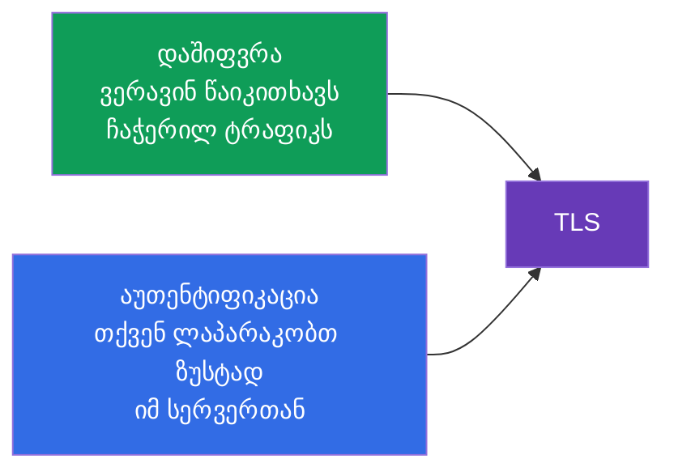
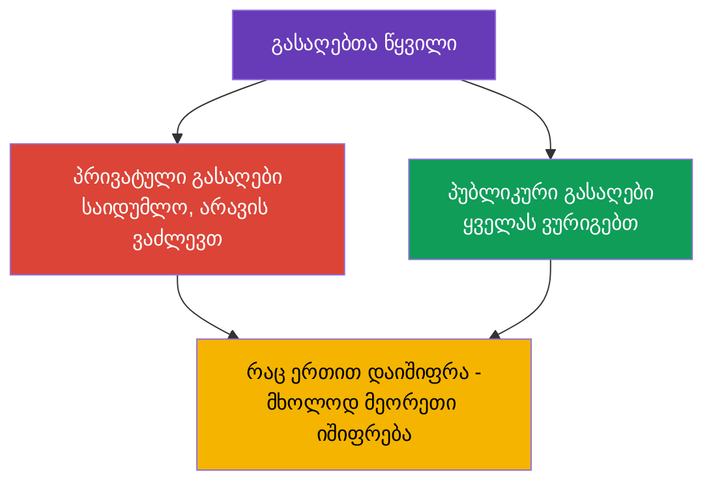
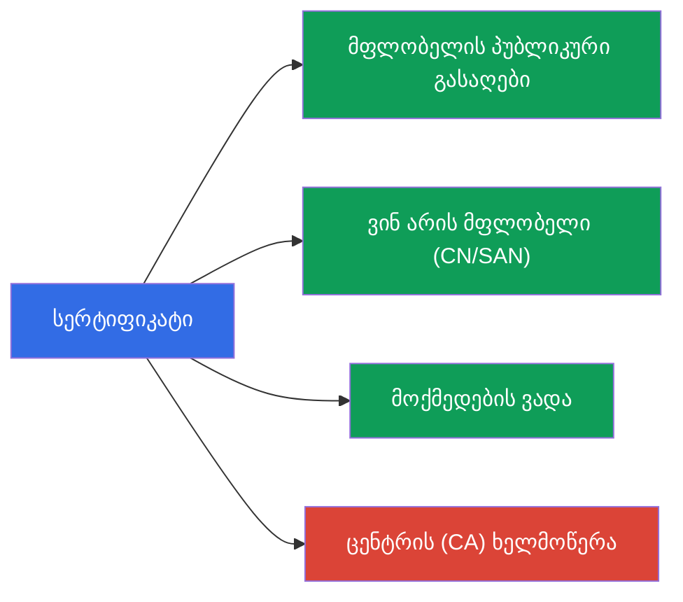
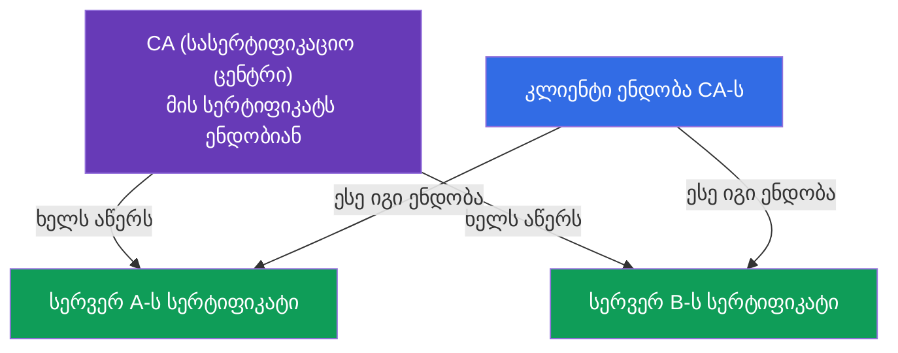
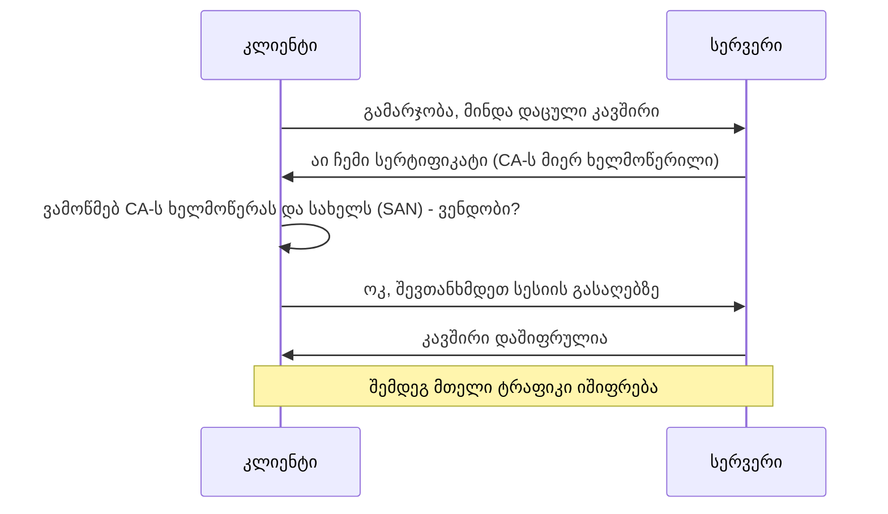

[Русская версия](ru.md) · [Eng version](README.md) · [Versión en español](es.md) · [Version française](fr.md) · [Deutsche Version](de.md)

# თავი 0.3. TLS და სერტიფიკატები ნულიდან: HTTPS, გასაღებები და სასერტიფიკაციო ცენტრები

> **ვისთვისაა ეს თავი.** საფუძვლის მესამე აგური. TLS „ბრაუზერში პატარა ბოქლომიან
> მაგიად“ გვეჩვენება, მაგრამ მასზე დგას Kubernetes-ის მთელი უსაფრთხოება: kube-apiserver,
> kubelet, etcd - ყველაფერი TLS-ით ურთიერთობს, ხოლო ადმინისტრატორის წვდომა აღწერილია
> სერტიფიკატებით kubeconfig-ში. თუ უკვე თავდაჯერებულად ხსნით, რით განსხვავდება პრივატული
> გასაღები სერტიფიკატისგან და რისთვისაა საჭირო CA, - გადადით 0.4 თავზე. თუ არა - ეს თავი
> მოგცემთ მინიმუმს, რომლის გარეშეც 39-ე (TLS და CSR API) და 21-ე (აუთენტიფიკაცია) თავები
> შიფრივით იკითხება.

## 0.3.1. ორი ამოცანა, რომელსაც TLS წყვეტს

როცა მონაცემები ქსელში მიდის, ორი რისკია: მათ შეიძლება **ჩაუჭვრიტონ** და შეიძლება
**შეუცვალონ** (ან თავი მოაჩვენონ, რომ სხვა სერვერია). **TLS (Transport Layer Security)** -
პროტოკოლი, რომელიც ორივე რისკს ხურავს. ეს არის ის „S“ HTTP**S**-ში.

- **დაშიფვრა** - ტრაფიკი წაუკითხავია იმისთვის, ვინც ის ჩაიჭირა.
- **აუთენტიფიკაცია** - დარწმუნდებით, რომ მეორე ბოლოში ნამდვილად ისაა, ვისაც თავს
  ასაღებს (და არა ყალბი სერვერი).

## 0.3.2. გასაღებთა წყვილი: პრივატული და პუბლიკური

TLS-ის საფუძველში დევს **ასიმეტრიული კრიპტოგრაფია** - მათემატიკურად დაკავშირებული
გასაღებების წყვილი:

მთავარი თვისება: ის, რაც **პუბლიკური** გასაღებით დაიშიფრა, იშიფრება **მხოლოდ
პრივატულით**, და პირიქით. პრივატული გასაღები **არასდროს** ტოვებს მფლობელს - მისი გაჟონვა
კომპრომეტაციის ტოლფასია. ეს წესი პირდაპირ გადადის Kubernetes-ში: კომპონენტების
პრივატული გასაღებები დევს კვანძებზე `/etc/kubernetes/pki`-ში და ყველაზე ძვირფასივით
იცავენ.

## 0.3.3. სერტიფიკატი: პუბლიკური გასაღები პლუს ხელმოწერა

პუბლიკური გასაღები თავისთავად არ ამბობს, **ვის** ეკუთვნის. ამ პრობლემას წყვეტს
**სერტიფიკატი** - ეს არის პუბლიკური გასაღები პლუს ინფორმაცია მფლობელზე (სახელი, მოქმედების
ვადა), დამოწმებული სანდო მხარის ხელმოწერით.

ანალოგია: პრივატული გასაღები - თქვენი ხელმოწერაა, ხოლო სერტიფიკატი - პასპორტი, სადაც ეს
ხელმოწერა სახელმწიფოს მიერაა დამოწმებული. პასპორტი ყველას შეიძლება უჩვენოთ, ხელმოწერა -
შეინახოთ.

## 0.3.4. სასერტიფიკაციო ცენტრი (CA): ნდობის ფესვი

ვინ ამოწმებს სერტიფიკატებს? **CA (Certificate Authority)** - სასერტიფიკაციო ცენტრი,
რომელსაც ენდობიან. ის თავისი პრივატული გასაღებით **ხელს აწერს** სხვის სერტიფიკატებს. თუ
ენდობით CA-ს, მაშინ ავტომატურად ენდობით ყველაფერს, რასაც მან ხელი მოაწერა.

ინტერნეტში სანდო CA-ების სია ჩაშენებულია ბრაუზერსა და OS-ში. Kubernetes-ში ყველაფერი
სხვაგვარია და მარტივი: კლასტერს **საკუთარი CA** აქვს (იქმნება `kubeadm init`-ისას), და ის
ხელს აწერს ყველა კომპონენტის სერტიფიკატებს - apiserver, kubelet, etcd, აგრეთვე
ადმინისტრატორებისას. ეს კლასტერული CA მთელი კლასტერის ნდობის ფესვია (თავები 35 და 39).

## 0.3.5. TLS-handshake: როგორ იკრიბება ეს ერთად

როცა კლიენტი TLS-ით უერთდება სერვერს, ხდება **handshake** (ხელის ჩამორთმევა):

გავარჩიოთ შემოწმება მე-3 საფეხურზე - სწორედ ესაა უსაფრთხოების არსი:

- კლიენტი უყურებს, **ხელმოწერილია** თუ არა სერვერის სერტიფიკატი სანდო CA-ს მიერ;
- ამოწმებს, რომ სერტიფიკატში მითითებული **სახელი** (ველი SAN/CN) ემთხვევა იმას, ვისაც ის
  უერთდება;
- ამოწმებს **მოქმედების ვადას**.

თუ რომელიმე არ დაემთხვა - კავშირი უარიყოფა (ეს არის „სერტიფიკატი ვადაგასულია“ ან
„არასანდო სერტიფიკატი“). ვადაგასული სერტიფიკატი ხშირი მიზეზია იმისა, რომ „კლასტერმა უცებ
მუშაობა შეწყვიტა“; 39-ე თავში გავარჩევთ, როგორ გავახანგრძლივოთ ისინი.

## 0.3.6. mTLS: ორივე მხარე წარადგენს სერტიფიკატს

ჩვეულებრივი HTTPS მხოლოდ სერვერს ამოწმებს (კლიენტი რწმუნდება, რომ სერვერი ნამდვილია).
Kubernetes-ში ხშირად იყენებენ **mTLS-ს (mutual TLS)** - ორმხრივ შემოწმებას: **ორივე**
მხარე წარადგენს სერტიფიკატებს. ასე apiserver რწმუნდება, რომ მოთხოვნა ნამდვილი kubelet-ის
ან ადმინისტრატორისგან მოვიდა, და არა თვითმარქვიისგან.

სწორედ mTLS-ზეა აგებული აუთენტიფიკაცია სერტიფიკატებით (თავი 21): „ვინ ხარ“ - ამას
კლასტერი იმით იგებს, რომელი სერტიფიკატითაა ხელმოწერილი თქვენი მოთხოვნა, ხოლო
„ჯგუფი/სახელი“ სერტიფიკატის ველებიდან იღება.

## 0.3.7. როგორ გამოიყენება ეს პროდაქშენში

- **სერტიფიკატების როტაცია.** სერტიფიკატებს ვარგისიანობის ვადა აქვს; მათ **წინასწარ
  ახანგრძლივებენ** (`kubeadm certs renew`, თავი 39). ვადა გაუშვი - control plane დგება.
  პროდში ამას აკონტროლებენ მონიტორინგით „ვადის გასვლამდე N დღით ადრე“.
- **საკუთარი CA და მისი გასაღების დაცვა.** კლასტერული CA-ს პრივატული გასაღები ყველაზე
  ძვირფასი საიდუმლოა: ვინც მას ფლობს, შეუძლია „ადმინისტრატორის“ სერტიფიკატი გამოუშვას და
  სრული წვდომა მიიღოს. მას განსაკუთრებით უფრთხილდებიან.
- **TLS-ტერმინაცია Ingress-ზე.** გარე HTTPS ჩვეულებრივ იშიფრება Ingress-კონტროლერზე
  (თავი 32): სერტიფიკატი დევს `tls` ტიპის Secret-ში, შემდეგ კლასტერის შიგნით ტრაფიკი უკვე
  შიდა ქსელით მიდის.
- **გაცემის ავტომატიზაცია.** cert-manager-ის მსგავსი ინსტრუმენტები ავტომატურად უშვებენ და
  ახანგრძლივებენ სერტიფიკატებს (მათ შორის Let's Encrypt-ისგან), რომ ეს ხელით არ გააკეთოთ.

## 0.3.8. მინი-ლექსიკონი

- **TLS** - ტრაფიკის დაშიფვრისა და აუთენტიფიკაციის პროტოკოლი (ასო „S“ HTTPS-ში).
- **ასიმეტრიული კრიპტოგრაფია** - დაკავშირებულ გასაღებთა წყვილი: პრივატული და პუბლიკური.
- **პრივატული გასაღები** - მფლობელის საიდუმლო გასაღები, არასდროს გადაიცემა.
- **პუბლიკური გასაღები** - ღია გასაღები, ყველას ურიგდება.
- **სერტიფიკატი** - პუბლიკური გასაღები + მფლობელის მონაცემები + CA-ს ხელმოწერა.
- **CA (Certificate Authority)** - ცენტრი, რომელიც ხელს აწერს სერტიფიკატებს; ნდობის
  ფესვი.
- **Handshake** - TLS-კავშირის დამყარების პროცედურა.
- **SAN / CN** - მფლობელის სახელი(ები) სერტიფიკატში, რომლებიც მოწმდება დაკავშირებისას.
- **mTLS** - ორმხრივი TLS: სერტიფიკატებს ორივე მხარე წარადგენს.
- **TLS-ტერმინაცია** - HTTPS-ის გაშიფვრა შესასვლელზე (მაგ. Ingress-ზე).

## 0.3.9. თავის შეჯამება

- TLS ორ ამოცანას წყვეტს: დაშიფვრა (ვერ ჩაუჭვრიტავენ) და აუთენტიფიკაცია (ის სერვერია თუ
  არა).
- საფუძველში - გასაღებთა წყვილი: პრივატული (საიდუმლო) და პუბლიკური (ღია); ერთით
  დაშიფრული მხოლოდ მეორეთი იშიფრება.
- სერტიფიკატი = პუბლიკური გასაღები + მფლობელის მონაცემები + CA-ს ხელმოწერა; თავად გასაღები
  არ ამხელს, ვის ეკუთვნის - ამაზე ხელმოწერაა პასუხისმგებელი.
- CA - ნდობის ფესვია: ენდობი CA-ს - ენდობი ყველაფერს, რასაც მან ხელი მოაწერა. კლასტერს
  საკუთარი CA აქვს, შექმნილი ინსტალაციისას.
- handshake-ისას კლიენტი ამოწმებს CA-ს ხელმოწერას, სახელს (SAN) და ვადას; შეუსაბამობა -
  უარი.
- mTLS (ორმხრივი შემოწმება) - კლასტერში კომპონენტებისა და მომხმარებლების
  აუთენტიფიკაციის საფუძველი (თავები 21, 39).

## 0.3.10. როგორ გამოგადგებათ: გამოცდაზე და რეალურ სამუშაოში

**გამოცდაზე.** TLS-ის ბაზის გარეშე ვერ გაიგებთ 39-ე თავს (სერტიფიკატები, kubeconfig, CSR
API) და 21-ე თავს (აუთენტიფიკაცია სერტიფიკატებით). ამოცანები „გამოუშვი სერტიფიკატი CSR-ით“,
„შეაკეთე ვადაგასული სერტიფიკატი“, „აწყე kubeconfig“ სწორედ ცნებებს - პრივატული გასაღები /
სერტიფიკატი / CA - ეყრდნობა. იგივე სჭირდება TLS-იან Ingress-ს (`tls` ტიპის Secret).

**რეალურ სამუშაოში.** სერტიფიკატების როტაცია, CA-ს გასაღების დაცვა, TLS-ტერმინაცია
Ingress-ზე, ავტომატიზაცია cert-manager-ით - მუდმივი ამოცანები. ვადაგასული სერტიფიკატი -
კლასიკური ღამის ინციდენტია, და ნდობის მოდელის გაგება აჩქარებს გარჩევას.

## 0.3.11. თვითშემოწმების კითხვები

1. რომელ ორ ამოცანას წყვეტს TLS?
2. რით განსხვავდება პრივატული გასაღები პუბლიკურისგან და რატომ არ შეიძლება პრივატულის
   გადაცემა?
3. რას შეიცავს სერტიფიკატი და რისთვისაა საჭირო CA-ს ხელმოწერა?
4. როგორ წყვეტს კლიენტი, ენდოს თუ არა სერვერის სერტიფიკატს handshake-ისას?
5. რით განსხვავდება mTLS ჩვეულებრივი HTTPS-ისგან და სად გამოიყენება ის Kubernetes-ში?
6. რატომ შეუძლია ვადაგასულ სერტიფიკატს control plane „ჩამოაგდოს“?

## პრაქტიკა

ნაწილ 0-ისთვის ცალკე ლაბი არ არის. სერტიფიკატებთან ხელით იმუშავებთ უსაფრთხოებისა და
ადმინისტრირების ლაბებში (CSR API, kubeconfig, TLS Ingress-ზე). შემდეგ - საფუძვლის ბოლო
აგური: კონტეინერები და იმიჯები.

---
[სარჩევი](../README_GE.md) · [თავი 0.2](../00-2-dns/ge.md) · [თავი 0.4](../00-4-containers/ge.md)
