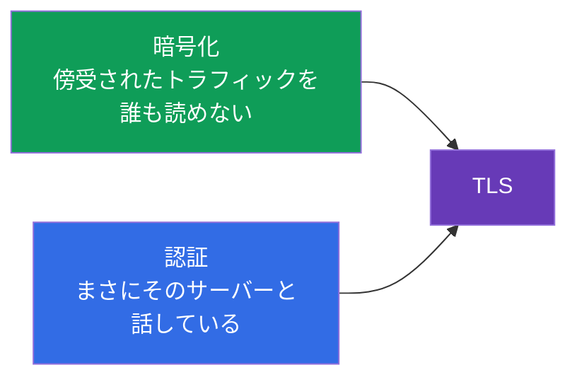
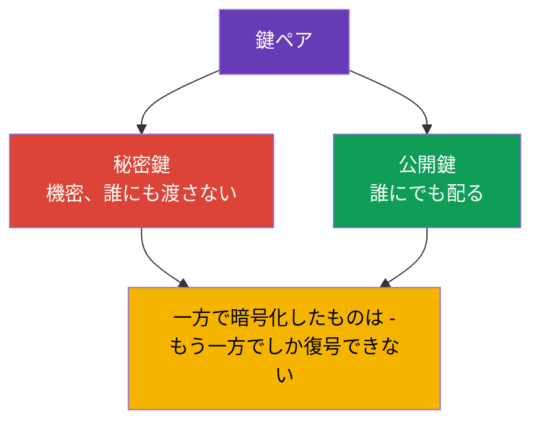
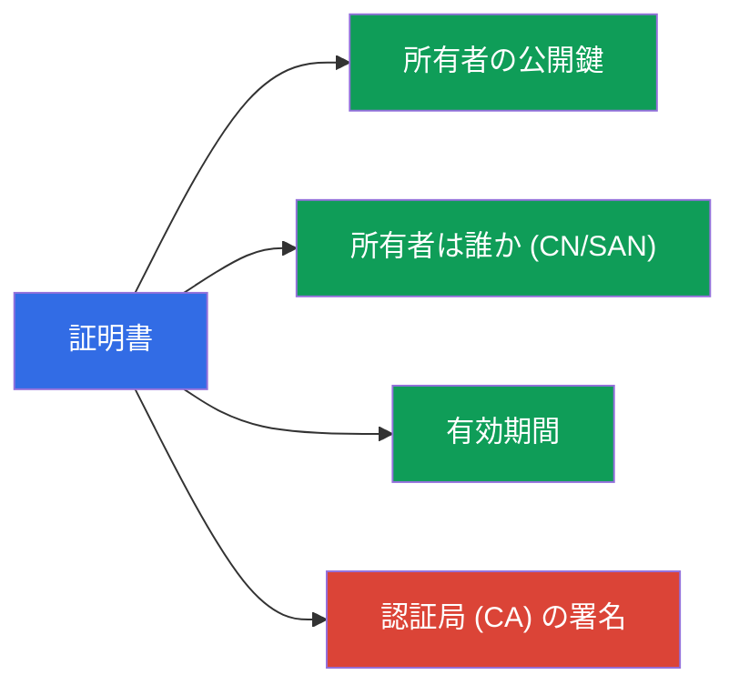
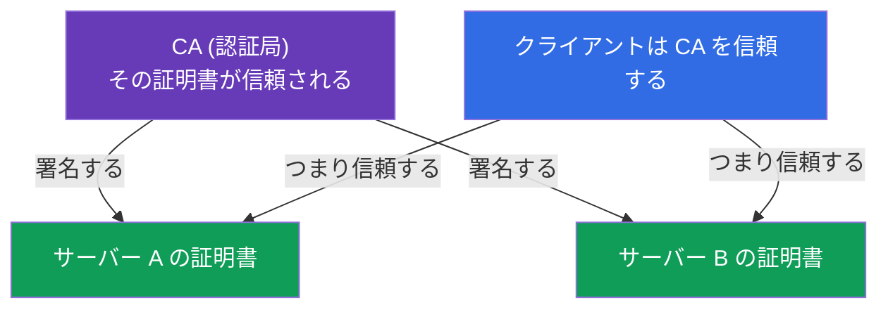
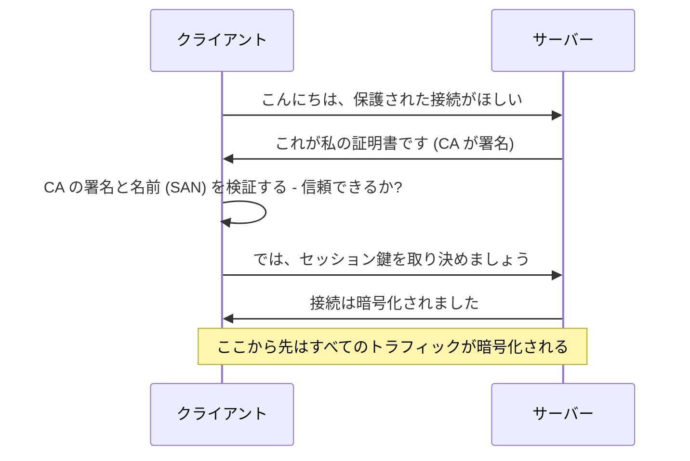

[Русская версия](ru.md) · [Eng version](README.md) · [Versión en español](es.md) · [Version française](fr.md) · [Deutsche Version](de.md) · [ქართული ვერსია](ge.md) · [繁體中文版](tw.md)

# 第 0.3 章。TLS と証明書をゼロから：HTTPS、鍵、認証局

> **この章は誰のためか。** 土台の三つ目のレンガです。TLS は「ブラウザの鍵アイコンの
> 魔法」のように見えますが、Kubernetes のセキュリティはすべてその上に成り立っています：
> kube-apiserver、kubelet、etcd - どれも TLS で通信し、管理者のアクセスは kubeconfig 内の
> 証明書で表されます。秘密鍵と証明書がどう違うのか、なぜ CA が必要なのかをすでに自信を
> もって説明できるなら、第 0.4 章へ進んでください。そうでなければ、この章では第 39 章
> （TLS と CSR API）と第 21 章（認証）が暗号文にならないための最小限を身につけます。

## 0.3.1. TLS が解決する 2 つの課題

データがネットワークを流れるとき、リスクは 2 つあります。**覗き見される**ことと、
**すり替えられる**こと（あるいは別のサーバーになりすまされること）です。
**TLS (Transport Layer Security)** は、その両方を防ぐプロトコルです。HTTP**S** の
あの「S」がまさにこれです。

- **暗号化** - 傍受した相手にはトラフィックが読めません。
- **認証** - 通信相手が本当に名乗っているとおりの相手である（偽のサーバーではない）と
  確認できます。

## 0.3.2. 鍵のペア：秘密鍵と公開鍵

TLS の土台にあるのは**非対称暗号**、すなわち数学的に結びついた 2 つの鍵のペアです：

肝心な性質はこうです。**公開**鍵で暗号化したものは**秘密**鍵でしか復号できず、その逆も
成り立ちます。秘密鍵は**決して**所有者の手元を離れません - 漏洩は侵害と同義です。この
ルールはそのまま Kubernetes に持ち込まれます：各コンポーネントの秘密鍵はノード上の
`/etc/kubernetes/pki` に置かれ、もっとも価値のあるものとして守られます。

## 0.3.3. 証明書：公開鍵に署名を加えたもの

公開鍵だけでは、それが**誰の**ものなのか分かりません。この問題を解くのが**証明書**です。
証明書とは、公開鍵に所有者の情報（名前、有効期間）を加え、信頼された第三者の署名で
裏づけたものです。

たとえるなら、秘密鍵はあなたの署名（サイン）で、証明書はその署名が国によって認証された
パスポートです。パスポートは誰に見せてもよく、署名は自分の手元に留めておきます。

## 0.3.4. 認証局 (CA)：信頼の起点

証明書を認証するのは誰でしょうか。**CA (Certificate Authority)** - 信頼される認証局です。
CA は自分の秘密鍵で他者の証明書に**署名**します。あなたが CA を信頼するなら、その CA が
署名したものすべてを自動的に信頼することになります。

インターネットでは、信頼された CA の一覧はブラウザと OS に組み込まれています。Kubernetes
では事情が違い、もっと単純です：クラスタは**自分専用の CA** を持ち（`kubeadm init` の際に
作られます）、その CA が全コンポーネント - apiserver、kubelet、etcd - および管理者の
証明書に署名します。このクラスタ CA がクラスタ全体の信頼の起点です（第 35 章と第 39 章）。

## 0.3.5. TLS ハンドシェイク：すべてが組み合わさる場面

クライアントが TLS でサーバーへ接続するとき、**handshake**（ハンドシェイク）が行われます：

ステップ 3 の検証を分解してみましょう - これがセキュリティの本質です：

- クライアントは、サーバーの証明書が信頼された CA に**署名されているか**を見ます。
- 証明書の**名前**（SAN/CN フィールド）が、接続しようとしている相手と一致するかを
  確認します。
- **有効期間**を確認します。

どれか一つでも合わなければ接続は拒否されます（これが「証明書の期限切れ」や
「信頼されていない証明書」です）。期限切れの証明書は「クラスタが突然動かなくなった」の
よくある原因です。更新の方法は第 39 章で扱います。

## 0.3.6. mTLS：双方が証明書を提示する

通常の HTTPS はサーバーだけを検証します（クライアントがサーバーの本物らしさを確かめる）。
Kubernetes では **mTLS (mutual TLS)** - 相互検証がよく使われます：**双方**が証明書を
提示します。これにより apiserver は、リクエストが本物の kubelet や管理者から来たもので、
なりすましではないと確認できます。

証明書による認証（第 21 章）は、まさにこの mTLS の上に築かれています：クラスタは
「あなたが誰か」をリクエストに添えられた証明書から判断し、「グループ/名前」は証明書の
フィールドから取られます。

## 0.3.7. 本番環境での使われ方

- **証明書のローテーション。** 証明書には有効期限があり、**期限前に更新**します
  （`kubeadm certs renew`、第 39 章）。期限を逃せば control plane が止まります。本番では
  「期限まで N 日」の監視で見張ります。
- **自前の CA とその鍵の保護。** クラスタ CA の秘密鍵はもっとも価値の高い秘密情報です：
  それを持つ者は「管理者」の証明書を発行して完全なアクセスを得られます。だから特別に
  厳重に守ります。
- **Ingress での TLS 終端。** 外部からの HTTPS は通常 Ingress コントローラーで復号されます
  （第 32 章）：証明書は `tls` タイプの Secret に置かれ、そこから先のクラスタ内部では
  トラフィックは内部ネットワークを流れます。
- **発行の自動化。** cert-manager のようなツールは証明書の発行と更新（Let's Encrypt から
  のものも含む）を自動化し、手作業を不要にします。

## 0.3.8. ミニ用語集

- **TLS** - トラフィックの暗号化と認証のためのプロトコル（HTTPS の「S」）。
- **非対称暗号** - 結びついた鍵のペア：秘密鍵と公開鍵。
- **秘密鍵** - 所有者の機密の鍵。決して渡さない。
- **公開鍵** - 公開される鍵。誰にでも配る。
- **証明書** - 公開鍵 + 所有者の情報 + CA の署名。
- **CA (Certificate Authority)** - 証明書に署名する認証局。信頼の起点。
- **Handshake** - TLS 接続を確立する手順。
- **SAN / CN** - 証明書に記された所有者の名前。接続時に検証される。
- **mTLS** - 相互 TLS：双方が証明書を提示する。
- **TLS 終端** - 入口（例えば Ingress）で HTTPS を復号すること。

## 0.3.9. 章のまとめ

- TLS は 2 つの課題を解決します：暗号化（覗き見されない）と認証（本当にそのサーバーか）。
- 土台にあるのは鍵のペア：秘密鍵（機密）と公開鍵（公開）。一方で暗号化したものは
  もう一方でしか復号できません。
- 証明書 = 公開鍵 + 所有者の情報 + CA の署名。鍵そのものは誰のものかを示さず、それを
  担うのが署名です。
- CA は信頼の起点です：CA を信頼するなら、CA が署名したすべてを信頼します。クラスタは
  インストール時に作られる自前の CA を持ちます。
- handshake でクライアントは CA の署名、名前 (SAN)、期限を検証します。一致しなければ拒否。
- mTLS（相互検証）は、クラスタ内のコンポーネントとユーザーの認証の土台です
  （第 21 章、第 39 章）。

## 0.3.10. どこで役に立つか：試験と実務

**試験では。** TLS の基礎がなければ第 39 章（証明書、kubeconfig、CSR API）と第 21 章
（証明書による認証）は理解できません。「CSR 経由で証明書を発行せよ」「期限切れの証明書を
直せ」「kubeconfig を組み立てよ」といった課題は、まさに秘密鍵 / 証明書 / CA という概念に
依っています。TLS 付きの Ingress（`tls` タイプの Secret）にも同じ理解が必要です。

**実務では。** 証明書のローテーション、CA 鍵の保護、Ingress での TLS 終端、cert-manager に
よる自動化 - どれも日常的な仕事です。期限切れの証明書は夜中に起こる古典的なインシデント
であり、信頼モデルを理解していれば切り分けが速くなります。

## 0.3.11. 自己確認のための質問

1. TLS はどの 2 つの課題を解決しますか。
2. 秘密鍵は公開鍵とどう違い、なぜ秘密鍵を渡してはいけないのですか。
3. 証明書には何が含まれ、CA の署名は何のために必要ですか。
4. handshake のとき、クライアントはサーバーの証明書を信頼するかどうかをどう判断しますか。
5. mTLS は通常の HTTPS とどう違い、Kubernetes のどこで使われますか。
6. 期限切れの証明書はなぜ control plane を「落とす」ことがあるのですか。

## 演習

パート 0 には専用のラボはありません。証明書は、セキュリティと運用管理のラボ（CSR API、
kubeconfig、Ingress の TLS）で実際に手を動かして扱います。次は土台の最後のレンガ：
コンテナとイメージです。

---
[目次](../README_JP.md) · [第 0.2 章](../00-2-dns/jp.md) · [第 0.4 章](../00-4-containers/jp.md)
