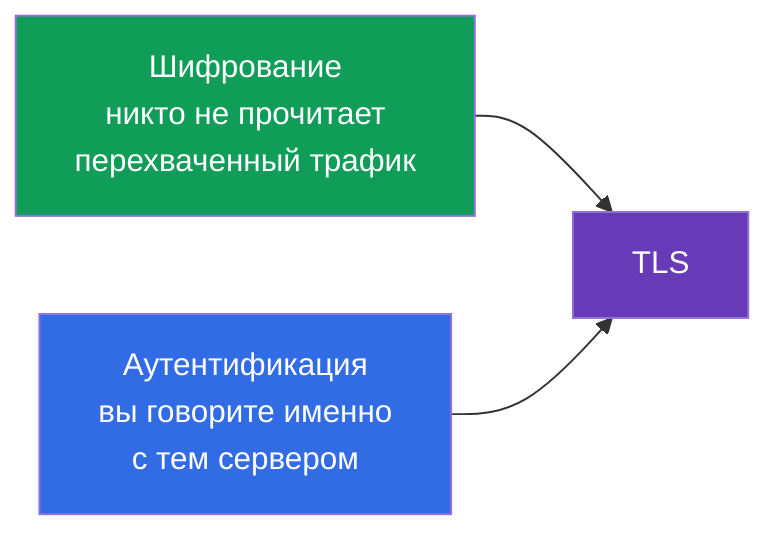
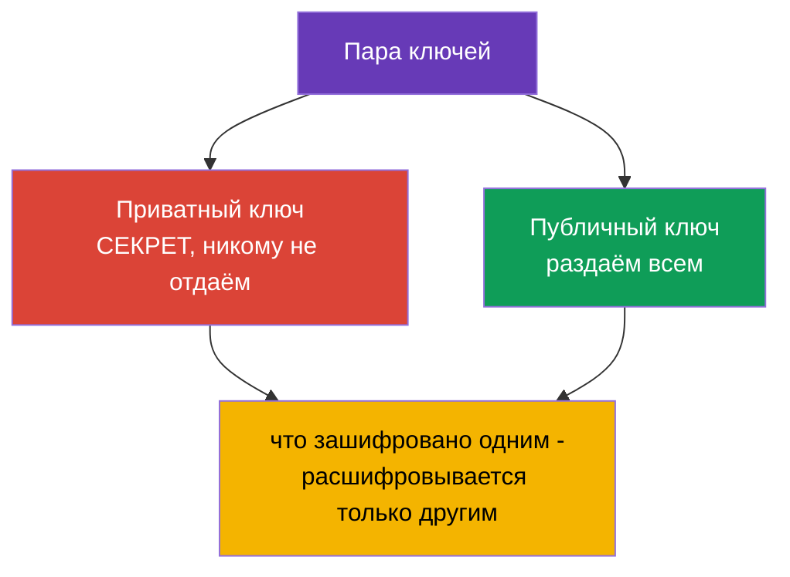
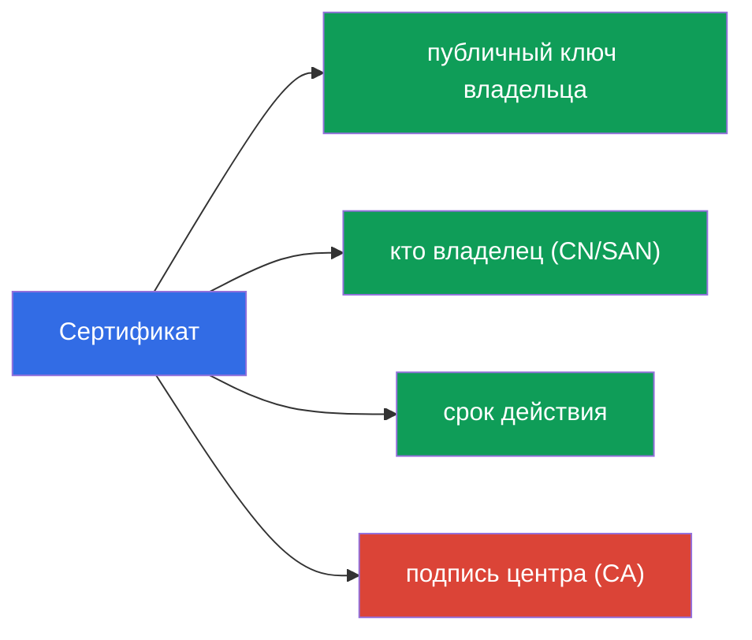
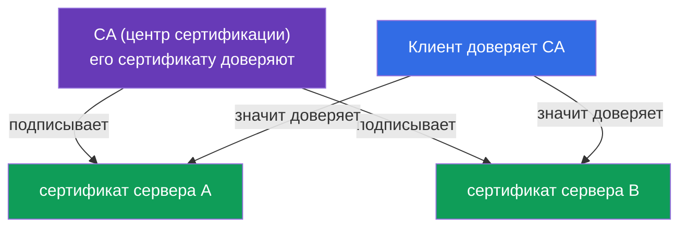
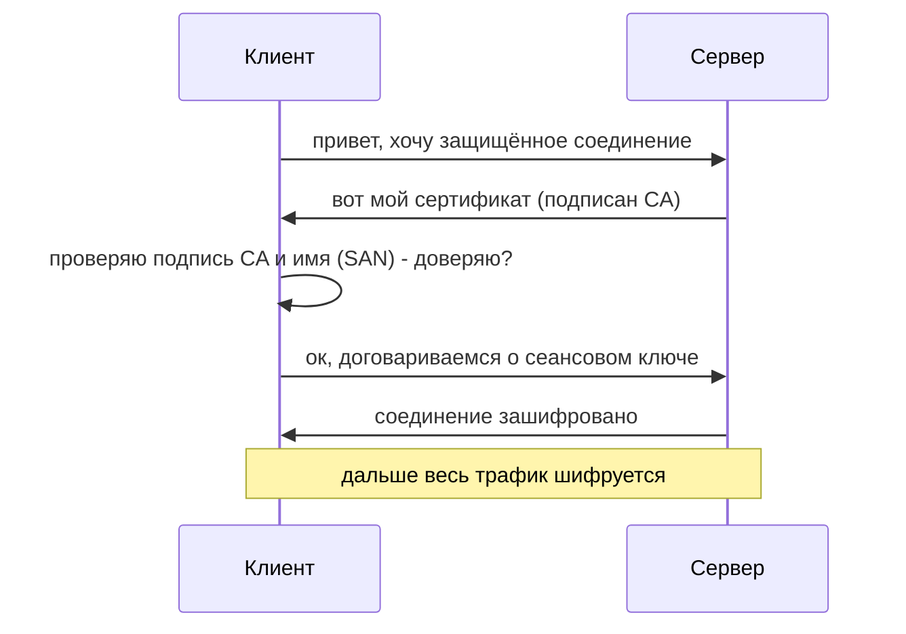

# Глава 0.3. TLS и сертификаты с нуля: HTTPS, ключи и центры сертификации

> **Для кого эта глава.** Третий кирпич фундамента. TLS кажется «магией с замочком в
> браузере», но на нём стоит вся безопасность Kubernetes: kube-apiserver, kubelet,
> etcd - всё общается по TLS, а доступ администратора описан сертификатами в
> kubeconfig. Если вы уже уверенно объясняете, чем приватный ключ отличается от
> сертификата и зачем нужен CA, - идите к главе 0.4. Если нет - эта глава даст
> минимум, без которого главы 39 (TLS и CSR API) и 21 (аутентификация) читаются как
> шифр.

## 0.3.1. Две задачи, которые решает TLS

Когда данные идут по сети, есть два риска: их могут **подсмотреть** и могут
**подменить** (или притвориться не тем сервером). **TLS (Transport Layer Security)** -
протокол, который закрывает оба риска. Это то самое «S» в HTTP**S**.

- **Шифрование** - трафик нечитаем для того, кто его перехватил.
- **Аутентификация** - вы убеждаетесь, что на том конце действительно тот, за кого он
  себя выдаёт (а не подставной сервер).

## 0.3.2. Пара ключей: приватный и публичный

В основе TLS лежит **асимметричная криптография** - пара математически связанных
ключей:

Главное свойство: то, что зашифровано **публичным** ключом, расшифровывается **только
приватным**, и наоборот. Приватный ключ **никогда** не покидает владельца - его утечка
равна компрометации. Это правило прямо переносится в Kubernetes: приватные ключи
компонентов лежат на нодах в `/etc/kubernetes/pki` и охраняются как самое ценное.

## 0.3.3. Сертификат: публичный ключ плюс подпись

Публичный ключ сам по себе не говорит, **кому** он принадлежит. Эту проблему решает
**сертификат** - это публичный ключ плюс информация о владельце (имя, срок действия),
заверенная подписью доверенной стороны.

Аналогия: приватный ключ - ваша подпись, а сертификат - паспорт, где эта подпись
заверена государством. Паспорт можно показывать всем, подпись - держать при себе.

## 0.3.4. Центр сертификации (CA): корень доверия

Кто заверяет сертификаты? **CA (Certificate Authority)** - центр сертификации,
которому доверяют. Он своим приватным ключом **подписывает** чужие сертификаты. Если
вы доверяете CA, то автоматически доверяете всему, что он подписал.

В интернете список доверенных CA встроен в браузер и ОС. В Kubernetes всё иначе и
проще: у кластера **свой собственный CA** (создаётся при `kubeadm init`), и он
подписывает сертификаты всех компонентов - apiserver, kubelet, etcd, а также
администраторов. Этот кластерный CA - корень доверия всего кластера (главы 35 и 39).

## 0.3.5. TLS-рукопожатие: как это складывается вместе

Когда клиент подключается к серверу по TLS, происходит **handshake** (рукопожатие):

Разберём проверку на шаге 3 - она и есть суть безопасности:

- клиент смотрит, **подписан ли** сертификат сервера доверенным CA;
- проверяет, что **имя** в сертификате (поле SAN/CN) совпадает с тем, к кому он
  подключается;
- проверяет **срок действия**.

Если любое не сошлось - соединение отклоняется (это и есть «сертификат просрочен» или
«недоверенный сертификат»). Просроченный сертификат - частая причина «кластер вдруг
перестал работать»; в главе 39 разберём, как их продлевать.

## 0.3.6. mTLS: обе стороны предъявляют сертификат

Обычный HTTPS проверяет только сервер (клиент убеждается, что сервер настоящий). В
Kubernetes часто используют **mTLS (mutual TLS)** - взаимную проверку: **обе** стороны
предъявляют сертификаты. Так apiserver убеждается, что запрос пришёл от настоящего
kubelet или администратора, а не от самозванца.

Именно на mTLS построена аутентификация по сертификатам (глава 21): «кто ты» кластер
понимает по тому, каким сертификатом подписан ваш запрос, а «группа/имя» берутся из
полей сертификата.

## 0.3.7. Как это применяют в продакшене

- **Ротация сертификатов.** Сертификаты имеют срок годности; их **продлевают заранее**
  (`kubeadm certs renew`, глава 39). Пропустил срок - control plane встаёт. В проде за
  этим следят мониторингом «до истечения N дней».
- **Свой CA и защита его ключа.** Приватный ключ кластерного CA - самый ценный секрет:
  тот, кто им владеет, может выпустить сертификат «администратора» и получить полный
  доступ. Его берегут особо.
- **TLS-терминация на Ingress.** Внешний HTTPS обычно расшифровывается на Ingress-
  контроллере (глава 32): сертификат лежит в Secret типа `tls`, дальше внутрь кластера
  трафик идёт уже по внутренней сети.
- **Автоматизация выдачи.** Инструменты вроде cert-manager автоматически выпускают и
  продлевают сертификаты (в т.ч. от Let's Encrypt), чтобы не делать это руками.

## 0.3.8. Мини-глоссарий

- **TLS** - протокол шифрования и аутентификации трафика (буква «S» в HTTPS).
- **Асимметричная криптография** - пара связанных ключей: приватный и публичный.
- **Приватный ключ** - секретный ключ владельца, никогда не передаётся.
- **Публичный ключ** - открытый ключ, раздаётся всем.
- **Сертификат** - публичный ключ + данные владельца + подпись CA.
- **CA (Certificate Authority)** - центр, подписывающий сертификаты; корень доверия.
- **Handshake** - процедура установления TLS-соединения.
- **SAN / CN** - имя(имена) владельца в сертификате, проверяемые при подключении.
- **mTLS** - взаимный TLS: сертификаты предъявляют обе стороны.
- **TLS-терминация** - расшифровка HTTPS на входе (напр. на Ingress).

## 0.3.9. Итоги главы

- TLS решает две задачи: шифрование (не подсмотрят) и аутентификация (тот ли сервер).
- В основе - пара ключей: приватный (секрет) и публичный (открытый); зашифрованное
  одним расшифровывается только другим.
- Сертификат = публичный ключ + данные владельца + подпись CA; сам ключ не выдаёт,
  кому принадлежит, - за это отвечает подпись.
- CA - корень доверия: доверяешь CA - доверяешь всему, что он подписал. У кластера
  свой CA, созданный при установке.
- При handshake клиент проверяет подпись CA, имя (SAN) и срок; несовпадение - отказ.
- mTLS (взаимная проверка) - основа аутентификации компонентов и пользователей в
  кластере (главы 21, 39).

## 0.3.10. Как это пригодится: на экзамене и в реальной работе

**На экзамене.** Без базы по TLS не понять главу 39 (сертификаты, kubeconfig, CSR
API) и главу 21 (аутентификация по сертификатам). Задачи «выпусти сертификат через
CSR», «почини истёкший сертификат», «собери kubeconfig» опираются ровно на понятия
приватный ключ / сертификат / CA. Это же нужно для Ingress с TLS (Secret типа `tls`).

**В реальной работе.** Ротация сертификатов, защита ключа CA, TLS-терминация на
Ingress, автоматизация через cert-manager - постоянные задачи. Просроченный сертификат
- классический ночной инцидент, и понимание модели доверия ускоряет разбор.

## 0.3.11. Вопросы для самопроверки

1. Какие две задачи решает TLS?
2. Чем приватный ключ отличается от публичного и почему приватный нельзя передавать?
3. Что содержит сертификат и зачем нужна подпись CA?
4. Как клиент решает, доверять ли сертификату сервера при handshake?
5. Чем mTLS отличается от обычного HTTPS и где он используется в Kubernetes?
6. Почему просроченный сертификат может «уронить» control plane?

## Практика

Отдельной лабы для части 0 нет. С сертификатами вы поработаете руками в лабах по
безопасности и администрированию (CSR API, kubeconfig, TLS на Ingress). Дальше -
последний кирпич фундамента: контейнеры и образы.

---
[Оглавление](../README_RU.md) · [Глава 0.2](../00-2-dns/ru.md) · [Глава 0.4](../00-4-containers/ru.md)
