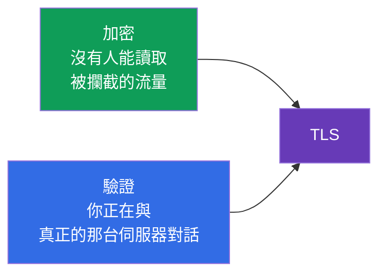
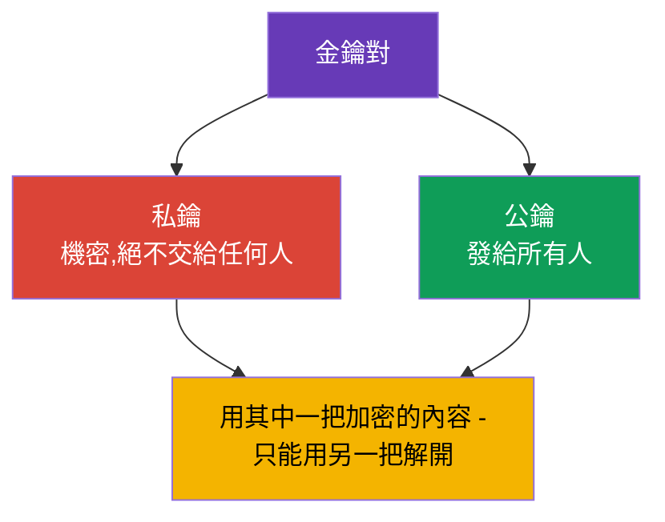
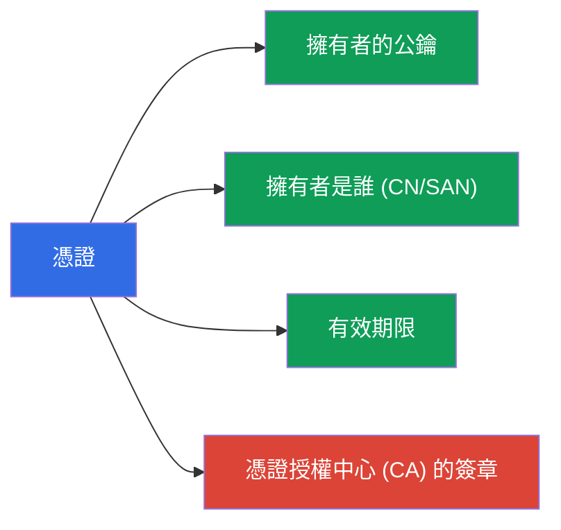
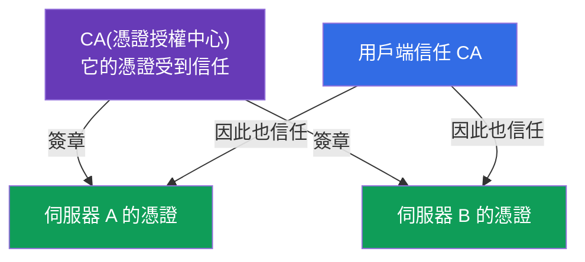
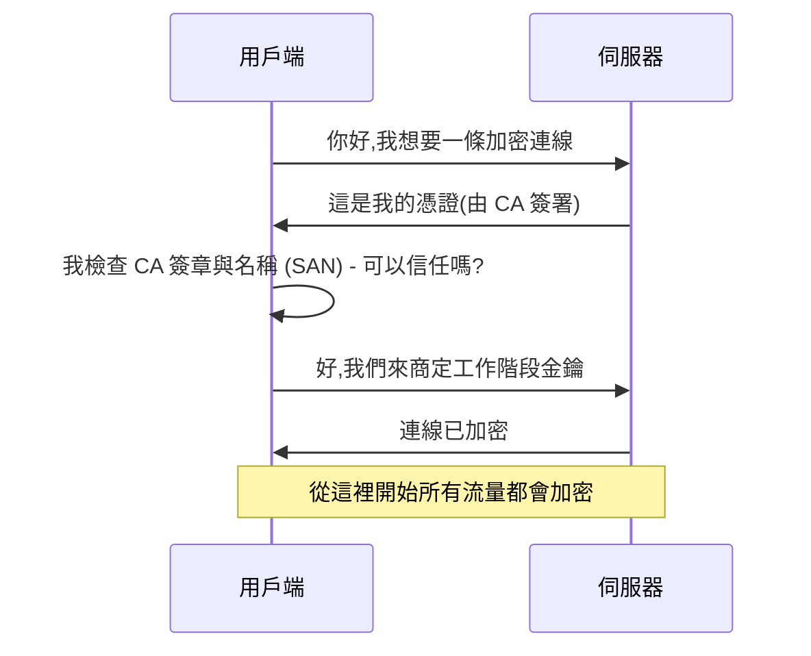

[Русская версия](ru.md) · [Eng version](README.md) · [Versión en español](es.md) · [Version française](fr.md) · [Deutsche Version](de.md) · [ქართული ვერსია](ge.md) · [日本語版](jp.md)

# 第 0.3 章。從零開始理解 TLS 與憑證:HTTPS、金鑰與憑證授權中心

> **這一章寫給誰。** 基礎的第三塊磚。TLS 看起來像是「瀏覽器上那個小鎖頭的
> 魔法」,但整個 Kubernetes 的安全性都建立在它之上:kube-apiserver、kubelet、
> etcd - 全部都透過 TLS 溝通,而管理員的存取權由 kubeconfig 中的憑證描述。
> 如果你已經能自信地說明私鑰與憑證的差別,以及為什麼需要 CA -
> 那就直接前往第 0.4 章。如果還不行 - 這一章會給你最基本的內容,
> 少了它,第 39 章(TLS 與 CSR API)和第 21 章(驗證)讀起來就像
> 一堆密碼。

## 0.3.1. TLS 解決的兩個問題

當資料在網路上傳輸時,有兩個風險:它可能被**偷看**,也可能被
**篡改**(或是有人假冒成別的伺服器)。**TLS (Transport Layer Security)** -
就是同時解決這兩個風險的協定。它就是 HTTP**S** 裡的那個「S」。

- **加密** - 流量對於攔截它的人來說是無法讀取的。
- **驗證** - 你可以確認另一端真的就是它自稱的那一方(而不是
  冒充的伺服器)。

## 0.3.2. 金鑰對:私鑰與公鑰

TLS 的基礎是**非對稱式密碼學** - 一對在數學上彼此關聯的
金鑰:

最重要的性質:用**公鑰**加密的內容,**只能用私鑰**解開,
反之亦然。私鑰**永遠**不會離開它的擁有者 - 一旦外洩就等於
被入侵。這條規則直接沿用到 Kubernetes:各元件的私鑰
放在節點的 `/etc/kubernetes/pki`,並被當成最珍貴的東西看守。

## 0.3.3. 憑證:公鑰加上簽章

公鑰本身並不能說明它**屬於誰**。解決這個問題的是
**憑證** - 它是公鑰加上擁有者的資訊(名稱、有效期限),
並由受信任的一方以簽章加以擔保。

一個類比:私鑰是你的簽名,而憑證則是護照 - 上面的簽名
由國家擔保。護照可以拿給所有人看,簽名要自己留著。

## 0.3.4. 憑證授權中心 (CA):信任的根

誰為憑證擔保?**CA (Certificate Authority)** - 就是受到信任的
憑證授權中心。它用自己的私鑰為別人的憑證**簽章**。如果
你信任這個 CA,那你就自動信任所有由它簽署的東西。

在網際網路上,受信任的 CA 清單內建在瀏覽器與作業系統中。在 Kubernetes 裡則不同,
也更簡單:叢集有**自己的 CA**(在 `kubeadm init` 時建立),它會
簽發所有元件的憑證 - apiserver、kubelet、etcd,以及
管理員的憑證。這個叢集 CA 就是整個叢集信任的根(第 35 章與第 39 章)。

## 0.3.5. TLS 交握:這些是怎麼拼在一起的

當用戶端透過 TLS 連到伺服器時,會發生 **handshake**(交握):

我們來拆解第 3 步的檢查 - 它正是安全性的核心:

- 用戶端會看伺服器的憑證是否由受信任的 CA **簽署**;
- 檢查憑證中的**名稱**(SAN/CN 欄位)是否與它要連線的
  對象相符;
- 檢查**有效期限**。

只要有一項不符 - 連線就會被拒絕(這就是所謂的「憑證已過期」或
「不受信任的憑證」)。過期的憑證是「叢集突然不能用了」的常見
原因;第 39 章會說明如何為它們續期。

## 0.3.6. mTLS:雙方都要出示憑證

一般的 HTTPS 只檢查伺服器(用戶端確認伺服器是真的)。在
Kubernetes 中經常使用 **mTLS (mutual TLS)** - 雙向檢查:**雙方**都要
出示憑證。這樣 apiserver 就能確認請求來自真正的
kubelet 或管理員,而不是冒充者。

憑證驗證(第 21 章)正是建立在 mTLS 之上:叢集透過你的請求
是用哪張憑證簽署的來判斷「你是誰」,而「群組/名稱」則取自
憑證的欄位。

## 0.3.7. 這在生產環境中怎麼用

- **憑證輪替。** 憑證有有效期限;要**提前續期**
  (`kubeadm certs renew`,第 39 章)。錯過期限 - control plane 就會停擺。生產環境會
  用「距到期 N 天」的監控盯著這件事。
- **自建 CA 與保護它的金鑰。** 叢集 CA 的私鑰是最珍貴的機密:
  誰握有它,就能簽發「管理員」憑證並取得完整的
  存取權。因此要特別看守。
- **在 Ingress 上做 TLS 終止。** 對外的 HTTPS 通常在 Ingress
  控制器上解密(第 32 章):憑證放在型別為 `tls` 的 Secret 中,再往叢集內部
  的流量就走內部網路。
- **自動化簽發。** 像 cert-manager 這類工具會自動簽發並
  續期憑證(包括來自 Let's Encrypt 的),讓你不必手動處理。

## 0.3.8. 迷你詞彙表

- **TLS** - 用於加密與驗證流量的協定(HTTPS 裡的那個「S」)。
- **非對稱式密碼學** - 一對彼此關聯的金鑰:私鑰與公鑰。
- **私鑰** - 擁有者的祕密金鑰,永遠不對外傳送。
- **公鑰** - 公開的金鑰,發給所有人。
- **憑證** - 公鑰 + 擁有者資料 + CA 的簽章。
- **CA (Certificate Authority)** - 為憑證簽章的中心;信任的根。
- **Handshake** - 建立 TLS 連線的流程。
- **SAN / CN** - 憑證中擁有者的名稱,連線時會被檢查。
- **mTLS** - 雙向 TLS:雙方都要出示憑證。
- **TLS 終止** - 在入口處解密 HTTPS(例如在 Ingress 上)。

## 0.3.9. 本章總結

- TLS 解決兩個問題:加密(不會被偷看)與驗證(是不是那台伺服器)。
- 基礎是一對金鑰:私鑰(祕密)與公鑰(公開);用其中一把加密的
  內容只能用另一把解開。
- 憑證 = 公鑰 + 擁有者資料 + CA 的簽章;金鑰本身不會說明
  它屬於誰 - 這是簽章負責的事。
- CA 是信任的根:信任 CA - 就信任所有它簽署的東西。叢集有
  自己的 CA,在安裝時建立。
- 交握時用戶端會檢查 CA 簽章、名稱 (SAN) 與有效期限;不相符 - 就拒絕。
- mTLS(雙向檢查)是叢集中元件與使用者驗證的
  基礎(第 21、39 章)。

## 0.3.10. 這些能用在哪裡:考試與實際工作

**在考試中。** 沒有 TLS 的基礎,就看不懂第 39 章(憑證、kubeconfig、CSR
API)和第 21 章(憑證驗證)。像「透過 CSR 簽發憑證」、
「修好過期的憑證」、「組出一份 kubeconfig」這類題目,正好就靠
私鑰 / 憑證 / CA 這些概念。帶 TLS 的 Ingress(型別為 `tls` 的 Secret)也需要這些。

**在實際工作中。** 憑證輪替、保護 CA 的金鑰、在 Ingress 上做 TLS
終止、用 cert-manager 自動化 - 都是日常任務。過期的憑證
- 是經典的半夜事故,而理解信任模型能加快排查速度。

## 0.3.11. 自我檢查問題

1. TLS 解決哪兩個問題?
2. 私鑰和公鑰有什麼不同,為什麼私鑰不能對外傳送?
3. 憑證包含什麼,為什麼需要 CA 的簽章?
4. 交握時用戶端如何決定要不要信任伺服器的憑證?
5. mTLS 和一般的 HTTPS 有什麼不同,它在 Kubernetes 中用在哪裡?
6. 為什麼過期的憑證可能「弄垮」control plane?

## 實作練習

第 0 部分沒有獨立的實驗。你會在安全性與管理相關的實驗中親手
操作憑證(CSR API、kubeconfig、Ingress 上的 TLS)。接下來 -
基礎的最後一塊磚:容器與映像。

---
[目錄](../README_TW.md) · [第 0.2 章](../00-2-dns/tw.md) · [第 0.4 章](../00-4-containers/tw.md)
