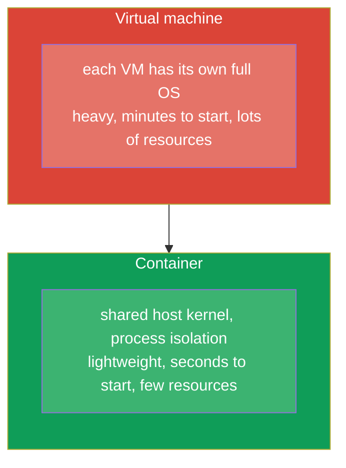
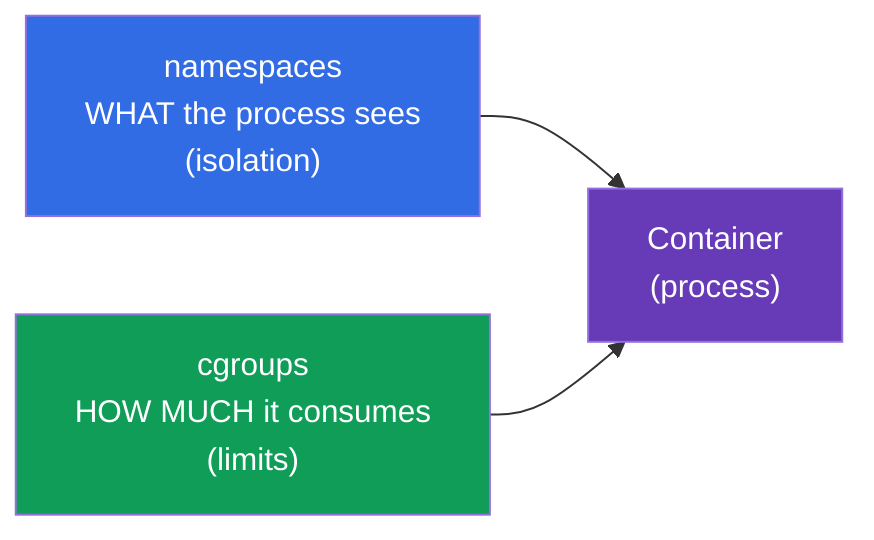
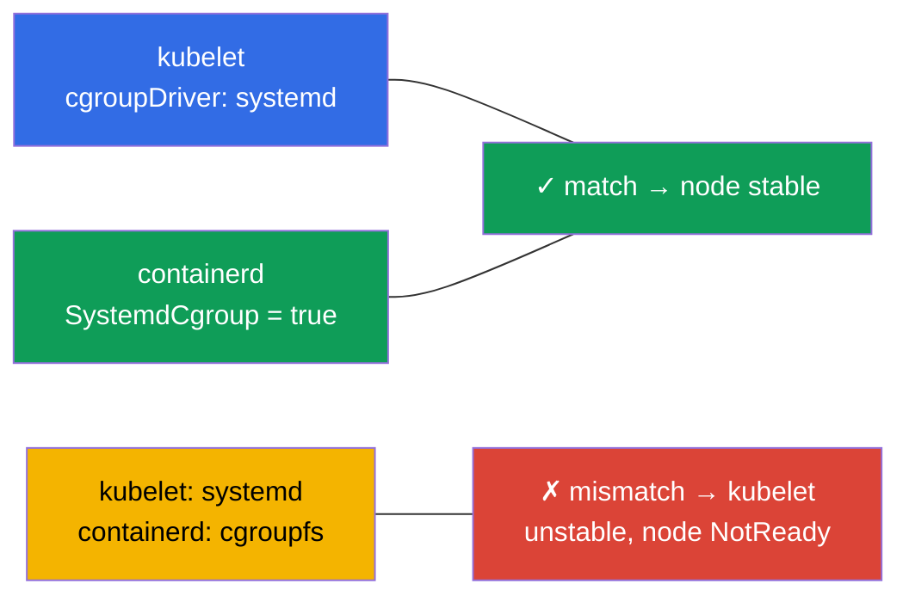
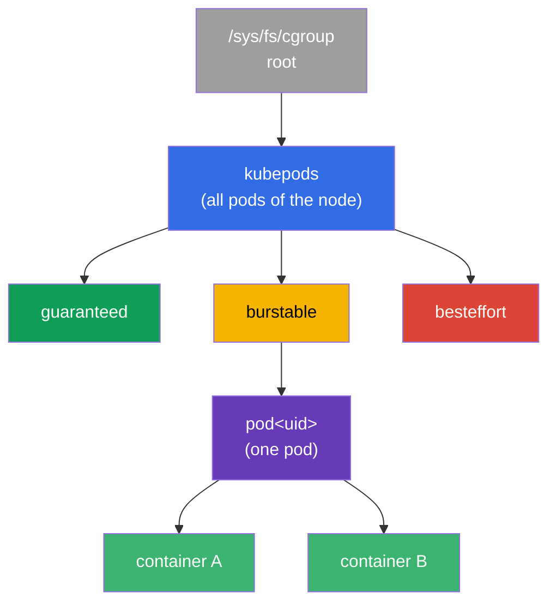
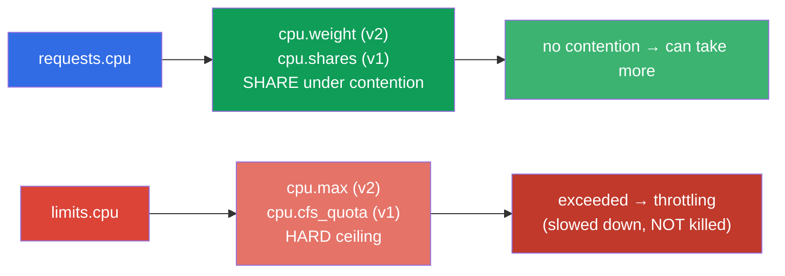
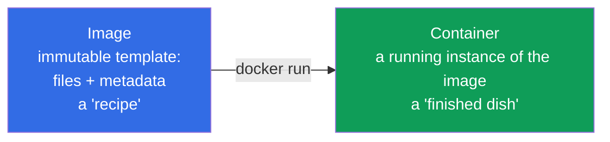
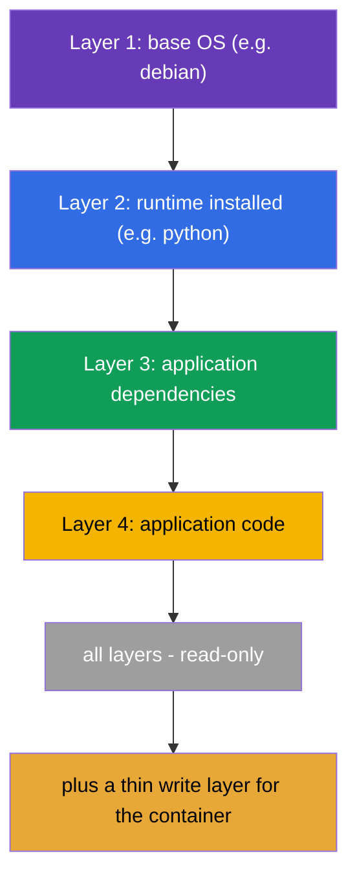
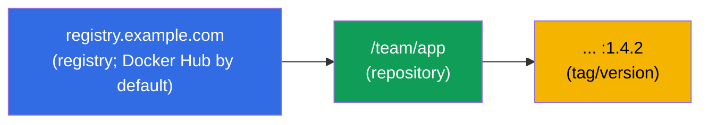
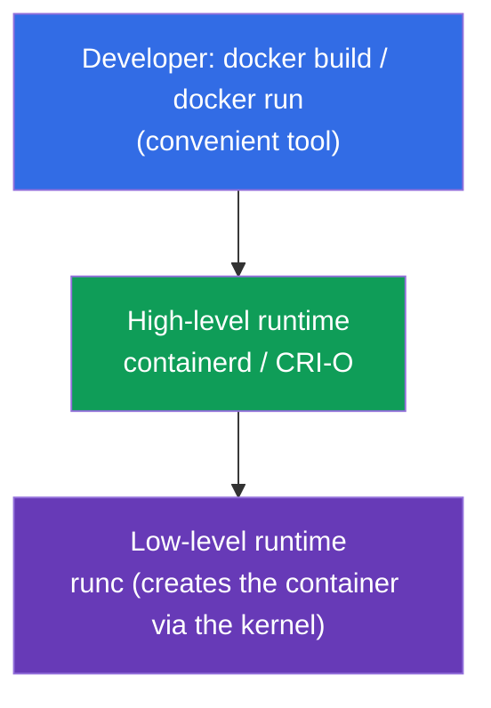
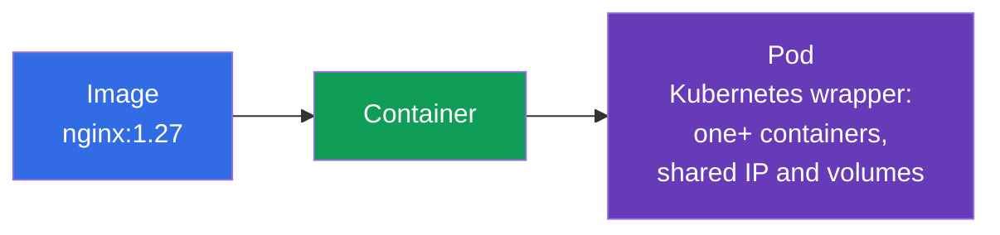

[Русская версия](ru.md) · [Versión en español](es.md) · [Version française](fr.md) · [Deutsche Version](de.md) · [ქართული ვერსია](ge.md)

# Chapter 0.4. Containers and Docker from scratch: images, layers, registries, and runtime

> **Who this chapter is for.** The last brick of the zero foundation - and the most
> important one: Kubernetes orchestrates exactly containers, and a pod is a wrapper
> around them. If you can already confidently explain how a container differs from an
> image and from a virtual machine, what layers and a registry are, feel free to jump
> straight to Chapter 1. If containers are still fuzzy for you - this chapter gives you
> the base that literally every other chapter of the course rests on.

## 0.4.1. What a container is and what it is not

A **container** is an isolated process (or group of processes) that uses the **shared
kernel** of the host system but lives in its own "bubble": its own files, its own
network, its own limits. It is not a "small virtual machine" - and the difference is
fundamental.



The isolation is provided by Linux kernel features: **namespaces** (isolate what a
process sees: its own PID, network, mount points) and **cgroups** (limit how much a
process consumes: CPU, memory). Don't confuse these Linux namespaces with Kubernetes
namespaces (Chapter 6) - only the word is the same. Let's look at both mechanisms in
more detail - requests/limits and all pod isolation stand on them.

## 0.4.2. How the kernel limits a container: namespaces and cgroups

A container is an ordinary process, but the kernel puts two "muzzles" on it:



**namespaces** are responsible for **isolation** - a process sees only "its own". The
main types:

| Namespace | What it isolates |
|-----------|------------------|
| **PID** | process tree (inside the container its own PID 1) |
| **NET** | network interfaces, IP, ports (Chapter 0.7) |
| **MNT** | mount points, file system |
| **UTS** | hostname |
| **IPC** | inter-process communication |
| **USER** | user mapping (root in the container ≠ root on the host) |

**cgroups** (control groups) are responsible for **limits** - how many resources a
process can consume. Key controllers:

| Controller | What it limits | Where it maps in Kubernetes |
|------------|----------------|-----------------------------|
| **cpu** | CPU share/quota | `requests/limits.cpu` (Chapter 14) |
| **memory** | memory ceiling | `limits.memory` → exceeding = **OOMKilled** (Chapter 44) |
| **pids** | number of processes | protection against a fork bomb |
| **io** | disk throughput | I/O throttling |

The direct link to the course: when in Chapter 14 you write `limits: {cpu: 500m,
memory: 128Mi}`, the kubelet, through the runtime, translates this into the container's
cgroup settings. Exceed the CPU quota and the process is **throttled**; exceed the
memory limit and the kernel **kills** the container with `OOMKilled`. That is,
requests/limits are not "Kubernetes wishes" but real Linux kernel constraints through
cgroups.

## 0.4.3. cgroup v1 and v2: two versions of the mechanism

cgroups have two versions, and the difference matters for cluster nodes:

| | **cgroup v1** | **cgroup v2** |
|--|---------------|---------------|
| Hierarchy | separate per controller (cpu, memory... differently) | **single** unified hierarchy |
| Consistency | controllers configured inconsistently | one consistent interface |
| Memory | basic control | more precise (MemoryQoS), load accounting (PSI) |
| Status | legacy, gradually going away | **modern standard** |

For Kubernetes this is not an abstraction:

- **cgroup v2 support is stable (GA) since Kubernetes 1.25**.
- You need kernel **5.8+**, a container runtime with v2 support (containerd 1.4+, CRI-O
  1.20+) and the **systemd** cgroup driver.
- Some features (fine-grained memory control MemoryQoS, PSI pressure metrics) are
  available **only on v2**.

To check which version is on a node:

```bash
stat -fc %T /sys/fs/cgroup/     # cgroup2fs → v2 ; tmpfs → v1 (or hybrid)
```

## 0.4.4. Which distro versions default to cgroup v2

cgroup v2 has been available in the kernel since 4.5 (2016), but distributions enabled
it by default later. Reference points:

| Distribution | cgroup v2 by default since |
|--------------|----------------------------|
| **Fedora** | 31 (2019) - first among the major ones |
| **Ubuntu** | 21.10, and in LTS - since **22.04** |
| **Debian** | 11 (Bullseye) |
| **RHEL / CentOS Stream / Rocky / Alma** | **9** (in RHEL 8 v1 by default) |
| **Arch, openSUSE Tumbleweed** | 2021+ |

Practical takeaway: on modern nodes (Ubuntu 22.04, Debian 12, RHEL 9), which the course
labs use, - **cgroup v2**. On older ones (RHEL 8, Ubuntu 20.04) it may be v1 or hybrid,
which sometimes explains the difference in how limits behave.

## 0.4.5. cgroup driver: why this breaks nodes

Another practical point people like to ask about. Two parties can configure cgroups -
**systemd** itself and "raw" **cgroupfs**. That's why cgroups have a **driver**, and it
is critical that **the kubelet and the container runtime use the same one**:



- On systemd-based systems (all modern distributions) the **systemd** driver is
  recommended for both.
- In containerd this is the `SystemdCgroup = true` flag in the config - that's exactly
  what is set when preparing nodes (lab 116, Chapter 35).
- A driver mismatch is the classic cause of "node unstable / kubelet crashes" after a
  manual cluster install.

## 0.4.6. cgroups deeper: the tree, CPU quotas, and QoS

The sections above explained *what* cgroups do. Now - *how* exactly, because
requests/limits and QoS classes (Chapters 14, 44) stand on this, and on the exam and in
the field it explains why one pod "lags" and another is "killed".

### A cgroup is a node in a tree

A cgroup is not an abstraction but a directory in a special file system
`/sys/fs/cgroup`. Each directory is a group of processes with resource settings;
directories nest into a tree, and limits are inherited downward. The kubelet builds its
own hierarchy under the cluster's containers:



The `kubepods` branch splits by **QoS classes** (guaranteed/burstable/besteffort),
inside it - a directory per pod, inside that - one per container. So a pod's limit caps
the sum of its containers, and a QoS branch's limit shapes behavior when the node runs
short on resources.

### CPU: two different levers - weight and quota

The main thing people confuse: **requests.cpu and limits.cpu are two different cgroup
settings**.



- **requests.cpu → weight** (`cpu.weight` in v2, `cpu.shares` in v1). This is not a
  ceiling but a *share* of processor time **under contention**. If the CPU is free, the
  container takes more than its request.
- **limits.cpu → quota** (`cpu.max` in v2: `quota period`; `cpu.cfs_quota_us` in v1).
  This is a hard ceiling per period: exceed it and the process is **slowed down** (CPU
  throttling), but **not killed**. Hence the typical symptom "the app is slow even
  though CPU isn't 100%" - it's being cut by the quota.

### Memory: the limit kills, the request does not

With memory the logic is different: it can't be "slowed down", so exceeding the limit =
death.

- **limits.memory → `memory.max`** (v2) / `memory.limit_in_bytes` (v1). Exceed it and
  the kernel invokes the **OOM killer**, the container gets the status **OOMKilled**
  (Chapter 44).
- **requests.memory** creates no hard cgroup limit - it affects **scheduling** (where
  the pod fits) and the order of **eviction** when the node runs short on memory.

| Resource | requests → | limits → | Exceeding limits |
|----------|-----------|----------|------------------|
| CPU | weight (`cpu.weight`/`shares`) | quota (`cpu.max`/`cfs_quota`) | **throttling** (slowed down) |
| Memory | scheduling/eviction | `memory.max`/`limit_in_bytes` | **OOMKilled** (killed) |

### QoS classes = place in the tree

The combination of requests/limits determines a pod's **QoS class**, and it determines
the branch in the cgroup tree and the priority on eviction:

| QoS | Condition | When the node is short on memory |
|-----|-----------|----------------------------------|
| **Guaranteed** | requests == limits for all containers | evicted last |
| **Burstable** | requests < limits (at least something set) | evicted second |
| **BestEffort** | neither requests nor limits set | evicted **first** |

### PSI: resource pressure (v2 only)

cgroup v2 exposes **PSI (Pressure Stall Information)** - a metric of how much processes
*waited* for CPU, memory, or I/O. This is more precise than "100% load": it shows the
real shortage. PSI is used to build alerts (Chapter 28) and autoscaling decisions.

### How to look live

```bash
# cgroup version on the node
stat -fc %T /sys/fs/cgroup/            # cgroup2fs → v2

# container CPU settings (v2): "max 100000" = limit 1 CPU; "max" = no limit
cat /sys/fs/cgroup/.../cpu.max
cat /sys/fs/cgroup/.../cpu.weight

# memory (v2): current consumption and limit
cat /sys/fs/cgroup/.../memory.current
cat /sys/fs/cgroup/.../memory.max

# how many times the container was throttled by the quota (diagnosing "slow, but CPU isn't 100%")
cat /sys/fs/cgroup/.../cpu.stat        # look at nr_throttled / throttled_usec

# resource pressure (PSI, v2 only)
cat /sys/fs/cgroup/.../cpu.pressure
cat /sys/fs/cgroup/.../memory.pressure
```

Takeaway for the course: `requests` and `limits` from Chapter 14 are exactly the
`cpu.weight`/`cpu.max` and `memory.max` of a specific container in the cgroup tree.
Understanding the difference between "weight vs quota" and "throttling vs OOMKilled"
removes most of the questions when debugging performance.

## 0.4.7. Image versus container

Two concepts that beginners confuse most often:



- An **image** is an immutable template: the application's file system plus metadata
  (which command to run, which ports, variables). It's a "recipe" or a "class".
- A **container** is an instance launched from an image. From one image you can launch
  as many identical containers as you like. It's a "finished dish" or an "object".

In Kubernetes you always specify an **image** (`image: nginx:1.27`), and the cluster
launches **containers** from it inside pods.

## 0.4.8. Image layers and why they matter

An image is assembled from **layers** - each layer is a set of file system changes on
top of the previous one. Layers are **reused** and cached: if two images start with the
same base layer, it is stored and pulled once.



Practical consequence: image layers are **read-only**, and the container adds a thin
**write layer** on top. That's why data written inside a container disappears when it
is recreated - for persistent data you need volumes (Chapters 24-26). The order of
layers in the Dockerfile affects build speed: rarely changing things first, code at the
end (in detail in Chapter 23).

## 0.4.9. Dockerfile: how an image is born

An image is described by a text file, the **Dockerfile** - a list of instructions. Each
instruction usually produces a layer.

```dockerfile
FROM python:3.12-slim        # base image (foundation layer)
WORKDIR /app                 # working directory
COPY requirements.txt .      # copy the dependency list
RUN pip install -r requirements.txt   # install dependencies (layer)
COPY . .                     # copy the application code (layer)
EXPOSE 8080                  # document the port
CMD ["python", "app.py"]     # default startup command
```

Key instructions to recognize:

| Instruction | What it does |
|-------------|--------------|
| `FROM` | base image the build starts from |
| `RUN` | run a command at build time (creates a layer) |
| `COPY` / `ADD` | add files to the image |
| `WORKDIR` | working directory inside the image |
| `EXPOSE` | document a port (does not open it itself) |
| `ENV` | environment variable |
| `CMD` | default command when the container starts |
| `ENTRYPOINT` | the fixed part of the startup command |

The link to Kubernetes is direct: an image's `CMD`/`ENTRYPOINT` is what the pod
manifest overrides with the `command` and `args` fields (Chapter 17), and `ENV` is what
is supplemented via `env` and ConfigMap/Secret (Chapters 17-19).

## 0.4.10. Registry: where images are stored

A built image is placed in a **registry** - an image store from which nodes pull them.
The full image name reads like this:



- If no registry is specified - **Docker Hub** is implied.
- A **tag** is the image version (`nginx:1.27`). The `latest` tag is not "the newest
  version forever" but simply the default tag; in production it's dangerous to do that,
  better to pin the version.
- Private registries require authentication - in Kubernetes it's set via
  `imagePullSecrets` (Chapters 19, 23).

## 0.4.11. Docker and container runtime: who actually runs the containers

Docker made containers mainstream, but it's important to understand the division of
roles, because **Kubernetes does not use Docker directly**.



- **Docker** is a convenient tool for a human: build an image, run it locally.
- **containerd / CRI-O** are the "engines" (high-level runtimes) that actually manage
  containers. It's exactly these that the kubelet talks to through the **CRI**
  interface (Container Runtime Interface, Chapter 40).
- **runc** is the low-level tool that creates a container using kernel facilities.

A historical detail people like to ask about: the kubelet used to reach Docker through
a `dockershim` shim, but it was removed. Today cluster nodes usually use **containerd**
directly. Images stay compatible with this (the OCI standard), so an image built by
`docker build` runs perfectly in a cluster on containerd.

## 0.4.12. Bridge to the pod (Chapter 4)



The chain to keep in mind the whole course: **image → container → pod**. Kubernetes does
not manage containers one by one - its minimal unit is the **pod**, a wrapper around one
or more containers with shared IP and volumes. In detail - in Chapter 4.

## 0.4.13. How this is applied in production

- **Small images.** The smaller the image, the faster the rollout and the fewer
  vulnerabilities. Slim/alpine bases and multi-stage builds are used (Chapter 23).
- **Pinning versions, not `latest`.** In production images are tagged with specific
  versions - otherwise "the same thing" deploys differently and breaks unpredictably.
- **Image scanning.** Images are checked for vulnerabilities before deployment; base
  images are updated regularly.
- **Your own registry.** Companies keep a private registry (Harbor, ECR, GAR): access
  control, cache, scanning, independence from Docker Hub's public limits.
- **containerd on nodes.** Understanding that under the hood it's containerd + runc (not
  Docker) is needed for node troubleshooting: container logs and status are viewed with
  `crictl`, not `docker`.

## 0.4.14. Mini-glossary

- **Container** - an isolated process on the host's shared kernel (namespaces +
  cgroups).
- **namespaces (Linux)** - isolation of what a process sees (PID, NET, MNT, UTS, IPC, USER).
- **cgroups** - limiting how much a process consumes (cpu, memory, pids, io).
- **cgroup v1 / v2** - old (hierarchy per controller) / modern (single hierarchy) versions; v2 is needed for some features (K8s cgroup v2 GA since 1.25).
- **OOMKilled** - a container killed by the kernel for exceeding the cgroup memory limit.
- **cgroup driver** - who configures cgroups: `systemd` or `cgroupfs`; the kubelet and the runtime must match (`SystemdCgroup=true`).
- **cpu.weight / cpu.shares** - the CPU weight (from `requests.cpu`): a share of the processor under contention, not a ceiling.
- **cpu.max / cfs_quota** - the hard CPU quota (from `limits.cpu`); exceeding = **throttling**.
- **CPU throttling** - forced slowdown of a process for exceeding the CPU quota (not killing).
- **memory.max** - the cgroup memory ceiling (from `limits.memory`); exceeding = OOMKilled.
- **kubepods** - the kubelet's root cgroup branch: `kubepods → QoS → pod → container`.
- **QoS class** - Guaranteed/Burstable/BestEffort; determines the cgroup branch and the eviction order.
- **PSI (Pressure Stall Information)** - a metric of waiting for CPU/memory/I/O (cgroup v2 only).
- **Image** - an immutable template of the application's file system + metadata.
- **Layer** - a set of FS changes; layers are reused and cached.
- **Write layer** - the container's thin mutable layer on top of the image's read-only layers.
- **Dockerfile** - a text description of an image build from instructions.
- **Registry** - an image store (Docker Hub by default).
- **Tag** - the image version; `latest` is only the default tag, not "always fresh".
- **OCI** - an open standard for the image and container format.
- **containerd / CRI-O** - high-level runtimes the kubelet works with.
- **CRI** - the interface between the kubelet and the container runtime (Chapter 40).
- **runc** - the low-level tool that launches containers via the kernel.

## 0.4.15. Chapter summary

- A container is an isolated process on a shared kernel (namespaces + cgroups), not a
  mini-VM: lighter, faster, more economical.
- namespaces isolate (what is visible: PID/NET/MNT/...), cgroups limit (how many
  resources: cpu/memory/pids/io); Kubernetes requests/limits are real cgroup settings,
  hence throttling by CPU and OOMKilled by memory (Chapters 14, 44).
- `requests.cpu` → weight (`cpu.weight`/`shares`, a share under contention), `limits.cpu`
  → quota (`cpu.max`/`cfs_quota`, a hard ceiling → throttling); `limits.memory` →
  `memory.max` (exceeding → OOMKilled). The kubelet builds the tree `kubepods → QoS →
  pod → container`, and the QoS class (Guaranteed/Burstable/BestEffort) sets the
  eviction order.
- cgroup v2 - a single hierarchy (modern standard, K8s GA since 1.25, needs kernel
  5.8+); default in Fedora 31+, Ubuntu 22.04+, Debian 11+, RHEL 9+ (in RHEL 8 - v1);
  only v2 provides PSI (the resource pressure metric).
- The cgroup driver of the kubelet and the runtime must match (systemd,
  `SystemdCgroup=true`) - otherwise the node is unstable (lab 116, Chapter 35).
- An image is an immutable "recipe", a container is an instance launched from it; from
  one image many containers are launched.
- An image consists of read-only layers (cached and reused); a container adds a write
  layer that is lost on recreation - hence the need for volumes.
- The Dockerfile describes the build; `CMD`/`ENV`/`EXPOSE` map directly to pod fields.
- Images are stored in registries; the name = registry/repository:tag; in production
  versions are pinned.
- Kubernetes uses not Docker but a container runtime (usually containerd) through CRI;
  images are compatible thanks to the OCI standard.
- The key chain of the course: image → container → pod.

## 0.4.16. How this helps: on the exam and in real work

**On the exam.** Containers are the foundation of everything: the pod (Chapter 4),
`command`/`args` (Chapter 17), images and the Dockerfile (Chapter 23), CRI (Chapter 40),
node troubleshooting via `crictl` (Chapter 45). Understanding "image ≠ container" and
layers is needed so you don't get confused in every other CKAD task.

**In real work.** Building compact secure images, working with registries, pinning
versions, diagnosing containers on nodes via containerd/`crictl` - everyday tasks. A
foundation in containers separates those who "copy-paste manifests" from those who
understand what is happening.

## 0.4.17. Self-check questions

1. How does a container fundamentally differ from a virtual machine? What provides the
   isolation?
2. What do namespaces do, and what do cgroups do? How are Kubernetes requests/limits
   related to cgroups and what is OOMKilled?
3. How does cgroup v2 differ from v1, and from which distro versions does v2 come by
   default?
4. How do `requests.cpu` and `limits.cpu` map into cgroups and what is the difference
   between "weight" and "quota"? Why is a container throttled when it exceeds the CPU
   limit but killed when it exceeds the memory limit?
5. How is the cgroup tree that the kubelet builds structured (kubepods → QoS → pod →
   container), and how is the QoS class related to the pod eviction order?
6. What is the cgroup driver and why does a mismatch between the kubelet and the runtime
   break a node?
7. What is the difference between an image and a container? How many containers can be
   launched from one image?
8. What are image layers and why does data inside a container not survive recreation?
9. How is the full image name read and why is `latest` dangerous in production?
10. Does Kubernetes use Docker to run containers? What does it use and through which
   interface?
11. How are an image, a container, and a pod related?

## Practice

Containers are the last "infrastructure" brick. Next in Part 0 - three practical skills
without which labs stall: working with a node in Linux (0.5), YAML (0.6), and Linux
networking under the hood (0.7). Then - the main course from Chapter 1.

---
[Contents](../README.md) · [Chapter 0.3](../00-3-tls/README.md) · [Chapter 0.5](../00-5-linux/README.md)
