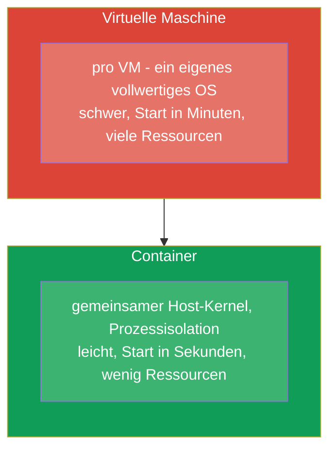
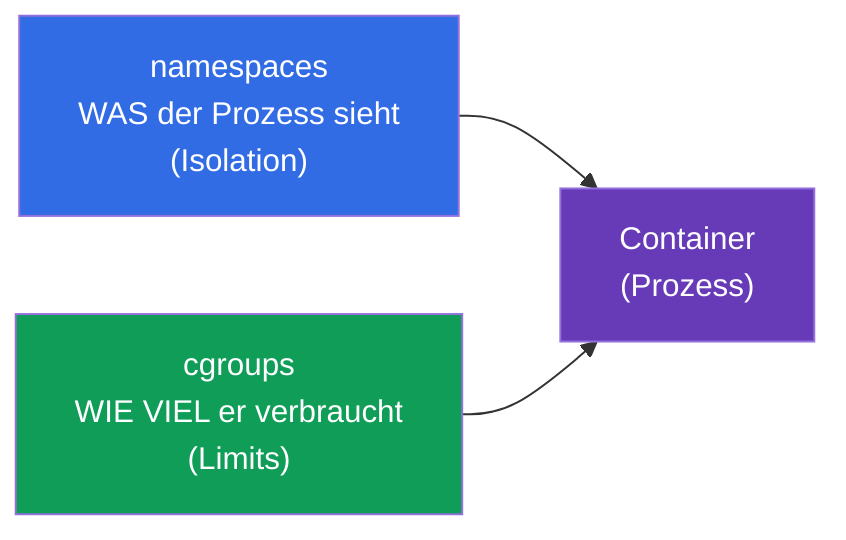
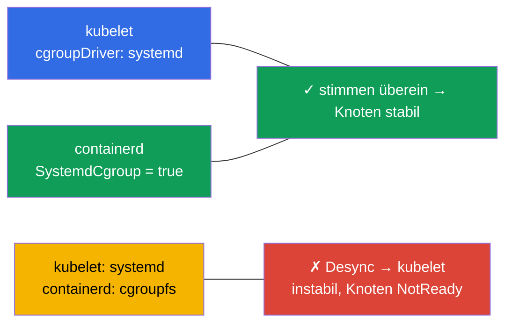
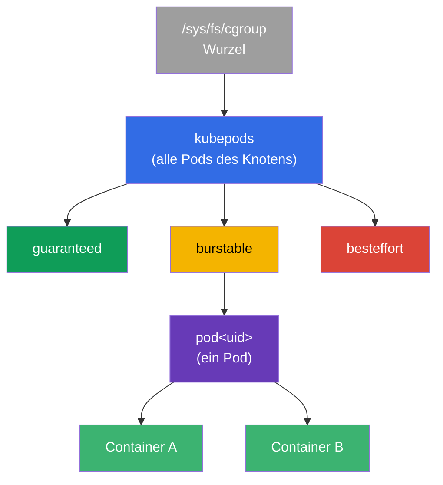
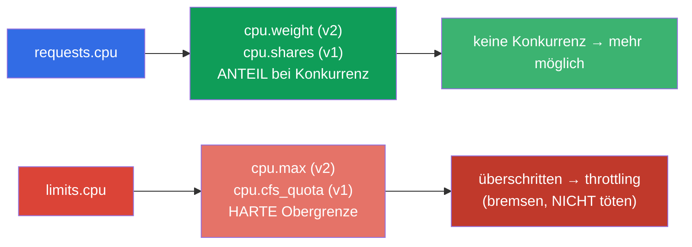
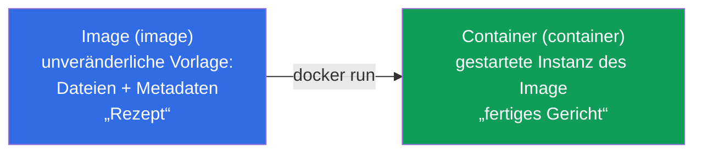
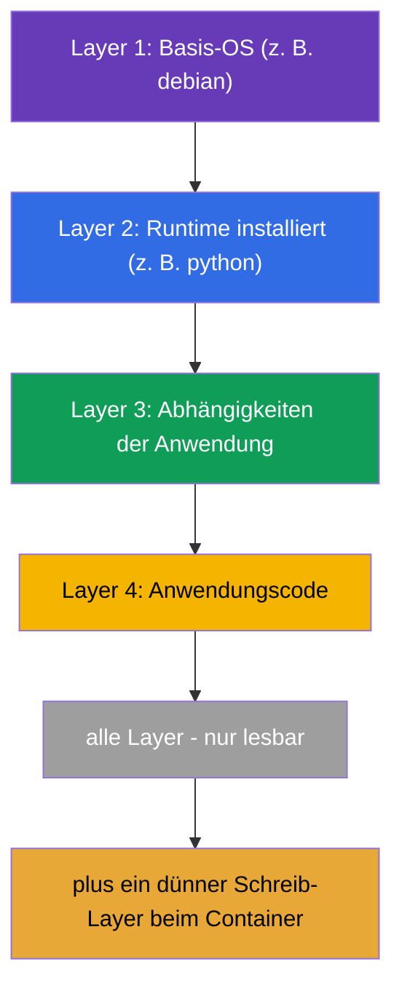
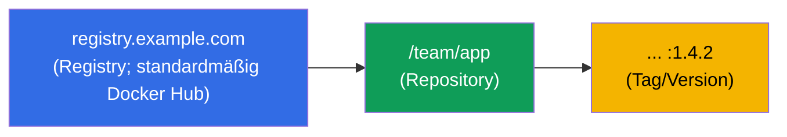
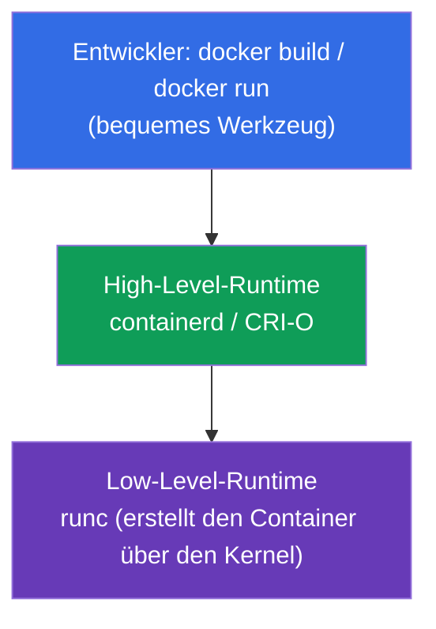
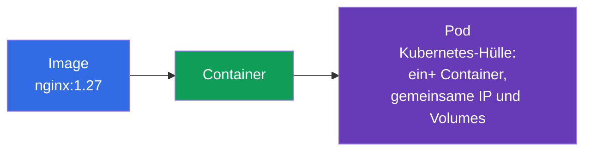

[Русская версия](ru.md) · [Eng version](README.md) · [Versión en español](es.md) · [Version française](fr.md) · [ქართული ვერსია](ge.md) · [繁體中文版](tw.md) · [日本語版](jp.md)

# Kapitel 0.4. Container und Docker von Grund auf: Images, Layer, Registries und Runtime

> **Für wen dieses Kapitel ist.** Der letzte Baustein des Null-Fundaments - und der
> wichtigste: Kubernetes orchestriert genau Container, und ein Pod ist eine Hülle um
> sie herum. Wenn Sie schon sicher erklären können, worin sich ein Container von einem
> Image und von einer virtuellen Maschine unterscheidet, was Layer und eine Registry
> sind, - dann gleich weiter zu Kapitel 1. Wenn Container für Sie noch verschwommen
> sind - gibt dieses Kapitel die Basis, auf die sich buchstäblich alle übrigen Kapitel
> des Kurses stützen.

## 0.4.1. Was ein Container ist und was er nicht ist

Ein **Container** ist ein isolierter Prozess (oder eine Gruppe von Prozessen), der den
**gemeinsamen Kernel** des Host-Systems nutzt, aber in seiner eigenen „Blase“ lebt:
eigene Dateien, eigenes Netzwerk, eigene Limits. Das ist keine „kleine virtuelle
Maschine“ - und der Unterschied ist grundlegend.



Die Isolation gewährleisten Fähigkeiten des Linux-Kernels: **namespaces** (isolieren,
was ein Prozess sieht: eigene PID, Netzwerk, Mountpunkte) und **cgroups** (begrenzen,
wie viel ein Prozess verbraucht: CPU, Speicher). Verwechseln Sie diese Linux-namespaces
nicht mit den Namespaces von Kubernetes (Kapitel 6) - es stimmt nur das Wort überein.
Sehen wir uns beide Mechanismen genauer an - auf ihnen stehen requests/limits und die
gesamte Pod-Isolation.

## 0.4.2. Wie der Kernel einen Container begrenzt: namespaces und cgroups

Ein Container ist ein gewöhnlicher Prozess, aber der Kernel legt ihm zwei „Maulkörbe“
an:



**namespaces** sorgen für die **Isolation** - der Prozess sieht nur „das Eigene“.
Wichtigste Typen:

| Namespace | Was es isoliert |
|-----------|-----------------|
| **PID** | Prozessbaum (innerhalb des Containers eigene PID 1) |
| **NET** | Netzwerkschnittstellen, IP, Ports (Kapitel 0.7) |
| **MNT** | Mountpunkte, Dateisystem |
| **UTS** | hostname |
| **IPC** | Interprozesskommunikation |
| **USER** | Benutzer-Mapping (root im Container ≠ root auf dem Host) |

**cgroups** (control groups) sorgen für die **Limits** - wie viele Ressourcen ein
Prozess verbrauchen darf. Zentrale Controller:

| Controller | Was es begrenzt | Wohin es in Kubernetes gemappt wird |
|------------|-----------------|-------------------------------------|
| **cpu** | CPU-Anteil/Quote | `requests/limits.cpu` (Kapitel 14) |
| **memory** | Speichergrenze | `limits.memory` → Überschreitung = **OOMKilled** (Kapitel 44) |
| **pids** | Anzahl der Prozesse | Schutz vor Fork-Bombe |
| **io** | Festplatten-Durchsatz | I/O-Throttling |

Direkter Bezug zum Kurs: Wenn Sie in Kapitel 14 `limits: {cpu: 500m, memory: 128Mi}`
schreiben, übersetzt kubelet dies über die Runtime in cgroup-Einstellungen des
Containers. CPU-Quote überschritten - der Prozess wird **gebremst** (throttling);
memory-Limit überschritten - der Kernel **tötet** den Container mit `OOMKilled`. Das
heißt, requests/limits sind keine „Wünsche von Kubernetes“, sondern reale Grenzen des
Linux-Kernels über cgroups.

## 0.4.3. cgroup v1 und v2: zwei Versionen des Mechanismus

cgroups gibt es in zwei Versionen, und der Unterschied ist für Cluster-Knoten wichtig:

| | **cgroup v1** | **cgroup v2** |
|--|---------------|---------------|
| Hierarchie | separat pro Controller (cpu, memory... unterschiedlich) | **einheitliche** vereinheitlichte Hierarchie |
| Konsistenz | Controller werden uneinheitlich konfiguriert | einheitliche, konsistente Schnittstelle |
| Speicher | grundlegende Kontrolle | genauer (MemoryQoS), Lasterfassung (PSI) |
| Status | Erbe, wird schrittweise abgelöst | **moderner Standard** |

Für Kubernetes ist das keine Abstraktion:

- Die Unterstützung für **cgroup v2 ist stabil (GA) seit Kubernetes 1.25**.
- Benötigt werden Kernel **5.8+**, eine Container-Runtime mit v2-Unterstützung
  (containerd 1.4+, CRI-O 1.20+) und der **systemd** cgroup-Treiber.
- Ein Teil der Fähigkeiten (feine Speichersteuerung MemoryQoS, Druckmetriken PSI) ist
  **nur auf v2** verfügbar.

Welche Version auf dem Knoten läuft, prüfen:

```bash
stat -fc %T /sys/fs/cgroup/     # cgroup2fs → v2 ; tmpfs → v1 (oder Hybrid)
```

## 0.4.4. Ab welcher Distributionsversion cgroup v2 standardmäßig aktiv ist

cgroup v2 ist im Kernel seit 4.5 (2016) verfügbar, aber Distributionen aktivierten es
später standardmäßig. Anhaltspunkte:

| Distribution | cgroup v2 standardmäßig ab |
|--------------|---------------------------|
| **Fedora** | 31 (2019) - als erste unter den großen |
| **Ubuntu** | 21.10, und in LTS - ab **22.04** |
| **Debian** | 11 (Bullseye) |
| **RHEL / CentOS Stream / Rocky / Alma** | **9** (in RHEL 8 standardmäßig v1) |
| **Arch, openSUSE Tumbleweed** | 2021+ |

Praktisches Fazit: Auf modernen Knoten (Ubuntu 22.04, Debian 12, RHEL 9), die die Übungen
des Kurses nutzen, - **cgroup v2**. Auf älteren (RHEL 8, Ubuntu 20.04) kann es v1 oder
ein Hybrid sein, was manchmal Unterschiede im Verhalten der Limits erklärt.

## 0.4.5. cgroup-Treiber: warum das Knoten kaputt macht

Noch ein praktischer Punkt, nach dem gern gefragt wird. cgroups können zwei einstellen -
der **systemd** selbst und das „rohe“ **cgroupfs**. Deshalb haben cgroups einen
**Treiber**, und es ist kritisch, dass **kubelet und die Container-Runtime denselben
verwenden**:



- Auf Systemen mit systemd (alle modernen Distributionen) wird für beide der Treiber
  **systemd** empfohlen.
- In containerd ist das das Flag `SystemdCgroup = true` in der Konfiguration - genau das
  setzt man bei der Vorbereitung der Knoten (Lab 116, Kapitel 35).
- Ein Treiber-Desync ist die klassische Ursache für „Knoten instabil / kubelet stürzt
  ab“ nach manueller Cluster-Installation.

## 0.4.6. cgroups tiefer: Baum, CPU-Quoten und QoS

Die Abschnitte oben haben erklärt, *was* cgroups tun. Jetzt - *wie* genau, denn darauf
stehen requests/limits und die QoS-Klassen (Kapitel 14, 44), und in der Prüfung wie im
Einsatz erklärt das, warum ein Pod „bremst“ und ein anderer „getötet“ wird.

### cgroup ist ein Knoten im Baum

cgroup ist keine Abstraktion, sondern ein Verzeichnis in einem speziellen Dateisystem
`/sys/fs/cgroup`. Jedes Verzeichnis ist eine Gruppe von Prozessen mit
Ressourceneinstellungen; die Verzeichnisse sind in einem Baum verschachtelt, und die
Beschränkungen werden nach unten vererbt. kubelet baut für die Cluster-Container eine
eigene Hierarchie:



Der Zweig `kubepods` teilt sich nach **QoS-Klassen** (guaranteed/burstable/besteffort),
darin - ein Verzeichnis pro Pod, darin - eines pro Container. So begrenzt das Limit des
Pods die Summe seiner Container, und das Limit des QoS-Zweigs - das Verhalten bei
Ressourcenmangel auf dem Knoten.

### CPU: zwei verschiedene Hebel - Gewicht und Quote

Das Wichtigste, was verwechselt wird: **requests.cpu und limits.cpu sind zwei
verschiedene cgroup-Einstellungen**.



- **requests.cpu → Gewicht** (`cpu.weight` in v2, `cpu.shares` in v1). Das ist keine
  Obergrenze, sondern ein *Anteil* an der Prozessorzeit **bei Konkurrenz**. Ist die CPU
  frei, nimmt der Container mehr als seinen request.
- **limits.cpu → Quote** (`cpu.max` in v2: `quota period`; `cpu.cfs_quota_us` in v1).
  Das ist eine harte Obergrenze pro Periode: überschritten - der Prozess wird
  **gebremst** (CPU throttling), aber **nicht getötet**. Daher das typische Symptom „die
  Anwendung ist langsam, obwohl die CPU nicht bei 100 % ist“ - die Quote drosselt sie.

### Memory: das Limit tötet, der request nicht

Beim Speicher ist die Logik anders: Man kann ihn nicht „drosseln“, deshalb ist eine
Überschreitung des Limits = Tod.

- **limits.memory → `memory.max`** (v2) / `memory.limit_in_bytes` (v1). Überschritten -
  der Kernel ruft den **OOM-killer** auf, der Container erhält den Status **OOMKilled**
  (Kapitel 44).
- **requests.memory** erzeugt kein hartes cgroup-Limit - es beeinflusst das
  **Scheduling** (wohin der Pod passt) und die Reihenfolge der **Verdrängung**
  (eviction) bei Speichermangel auf dem Knoten.

| Ressource | requests → | limits → | Überschreitung der limits |
|-----------|-----------|----------|---------------------------|
| CPU | Gewicht (`cpu.weight`/`shares`) | Quote (`cpu.max`/`cfs_quota`) | **throttling** (bremsen) |
| Memory | Scheduling/eviction | `memory.max`/`limit_in_bytes` | **OOMKilled** (töten) |

### QoS-Klassen = Platz im Baum

Die Kombination aus requests/limits bestimmt die **QoS-Klasse** des Pods, und diese - den
Zweig im cgroup-Baum und die Priorität bei der Verdrängung:

| QoS | Bedingung | Bei Speichermangel auf dem Knoten |
|-----|-----------|-----------------------------------|
| **Guaranteed** | requests == limits für alle Container | wird zuletzt verdrängt |
| **Burstable** | requests < limits (zumindest etwas gesetzt) | wird als Zweites verdrängt |
| **BestEffort** | weder requests noch limits gesetzt | wird als **Erstes** verdrängt |

### PSI: Ressourcendruck (nur v2)

cgroup v2 liefert **PSI (Pressure Stall Information)** - eine Metrik dafür, wie lange
Prozesse auf CPU, Speicher oder I/O *gewartet* haben. Das ist genauer als „Auslastung
100 %“: Es zeigt den realen Mangel. Auf PSI baut man Alerts (Kapitel 28) und
Entscheidungen zum Autoscaling.

### Wie man es live anschaut

```bash
# cgroup-Version auf dem Knoten
stat -fc %T /sys/fs/cgroup/            # cgroup2fs → v2

# CPU-Einstellungen des Containers (v2): "max 100000" = Limit 1 CPU; "max" = kein Limit
cat /sys/fs/cgroup/.../cpu.max
cat /sys/fs/cgroup/.../cpu.weight

# Speicher (v2): aktueller Verbrauch und Limit
cat /sys/fs/cgroup/.../memory.current
cat /sys/fs/cgroup/.../memory.max

# Wie oft der Container durch die Quote gebremst wurde (Diagnose "langsam, aber CPU nicht 100%")
cat /sys/fs/cgroup/.../cpu.stat        # nr_throttled / throttled_usec ansehen

# Ressourcendruck (PSI, nur v2)
cat /sys/fs/cgroup/.../cpu.pressure
cat /sys/fs/cgroup/.../memory.pressure
```

Fazit für den Kurs: `requests` und `limits` aus Kapitel 14 sind genau `cpu.weight`/
`cpu.max` und `memory.max` des konkreten Containers im cgroup-Baum. Das Verständnis des
Unterschieds „Gewicht gegen Quote“ und „throttling gegen OOMKilled“ nimmt einen großen
Teil der Fragen beim Debuggen der Performance.

## 0.4.7. Image gegen Container

Zwei Begriffe, die Neulinge am häufigsten verwechseln:



- **Image** - eine unveränderliche Vorlage: das Dateisystem der Anwendung plus Metadaten
  (welchen Befehl starten, welche Ports, Variablen). Das ist ein „Rezept“ oder eine
  „Klasse“.
- **Container** - eine aus dem Image gestartete Instanz. Aus einem Image kann man
  beliebig viele gleiche Container starten. Das ist ein „fertiges Gericht“ oder ein
  „Objekt“.

In Kubernetes geben Sie immer ein **Image** an (`image: nginx:1.27`), und der Cluster
startet daraus **Container** innerhalb von Pods.

## 0.4.8. Layer eines Image und warum das wichtig ist

Ein Image setzt sich aus **Layern (layers)** zusammen - jeder Layer ist eine Menge von
Änderungen am Dateisystem über dem vorherigen. Layer werden **wiederverwendet** und
gecacht: Wenn zwei Images mit demselben Basis-Layer beginnen, wird er einmal gespeichert
und einmal heruntergeladen.



Praktische Konsequenz: Die Layer eines Image sind **nur lesbar**, und der Container fügt
darüber einen dünnen **Schreib-Layer** hinzu. Deshalb verschwinden die in den Container
geschriebenen Daten bei seiner Neuerstellung - für persistente Daten braucht man Volumes
(Kapitel 24-26). Die Reihenfolge der Layer im Dockerfile beeinflusst die
Build-Geschwindigkeit: selten Änderndes - früher, Code - am Ende (ausführlich in Kapitel
23).

## 0.4.9. Dockerfile: wie ein Image entsteht

Ein Image beschreibt man mit einer Textdatei **Dockerfile** - einer Liste von
Anweisungen. Jede Anweisung erzeugt in der Regel einen Layer.

```dockerfile
FROM python:3.12-slim        # Basis-Image (Grund-Layer)
WORKDIR /app                 # Arbeitsverzeichnis
COPY requirements.txt .      # Abhängigkeitsliste kopieren
RUN pip install -r requirements.txt   # Abhängigkeiten installieren (Layer)
COPY . .                     # Anwendungscode kopieren (Layer)
EXPOSE 8080                  # Port dokumentieren
CMD ["python", "app.py"]     # Standard-Startbefehl
```

Zentrale Anweisungen, die man erkennen sollte:

| Anweisung | Was sie tut |
|-----------|-------------|
| `FROM` | Basis-Image, mit dem der Build beginnt |
| `RUN` | einen Befehl beim Build ausführen (erzeugt einen Layer) |
| `COPY` / `ADD` | Dateien ins Image hinzufügen |
| `WORKDIR` | Arbeitsverzeichnis im Image |
| `EXPOSE` | einen Port dokumentieren (öffnet ihn nicht selbst) |
| `ENV` | Umgebungsvariable |
| `CMD` | Standardbefehl beim Start des Containers |
| `ENTRYPOINT` | unveränderlicher Teil des Startbefehls |

Der Bezug zu Kubernetes ist direkt: `CMD`/`ENTRYPOINT` des Image sind das, was im
Manifest des Pods durch die Felder `command` und `args` überschrieben wird (Kapitel 17),
und `ENV` - das, was über `env` und ConfigMap/Secret ergänzt wird (Kapitel 17-19).

## 0.4.10. Registry: wo Images gespeichert werden

Das gebaute Image legt man in eine **Registry (registry)** - ein Image-Speicher, aus dem
die Knoten sie herunterladen. Der vollständige Image-Name liest sich so:



- Ist keine Registry angegeben - wird **Docker Hub** angenommen.
- Der **Tag** - die Version des Image (`nginx:1.27`). Der Tag `latest` ist nicht „für
  immer die neueste Version“, sondern nur der Standard-Tag; in Produktion ist das
  gefährlich, besser die Version festnageln.
- Private Registries erfordern Authentifizierung - in Kubernetes wird sie über
  `imagePullSecrets` festgelegt (Kapitel 19, 23).

## 0.4.11. Docker und Container-Runtime: wer die Container tatsächlich startet

Docker hat Container massentauglich gemacht, aber es ist wichtig, die Rollenverteilung
zu verstehen, denn **Kubernetes nutzt Docker nicht direkt**.



- **Docker** - ein bequemes Werkzeug für den Menschen: ein Image bauen, lokal starten.
- **containerd / CRI-O** - „Engines“ (High-Level-Runtimes), die die Container tatsächlich
  verwalten. Genau mit ihnen kommuniziert kubelet über die Schnittstelle **CRI**
  (Container Runtime Interface, Kapitel 40).
- **runc** - ein Low-Level-Werkzeug, das den Container mit den Mitteln des Kernels
  erstellt.

Ein historisches Detail, nach dem gern gefragt wird: Früher ging kubelet über die
Zwischenschicht `dockershim` zu Docker, aber sie wurde entfernt. Heute nutzen
Cluster-Knoten in der Regel **containerd** direkt. Die Images bleiben dabei kompatibel
(Standard OCI), deshalb läuft ein mit `docker build` gebautes Image bestens im Cluster
auf containerd.

## 0.4.12. Brücke zum Pod (Kapitel 4)



Die Kette, die man den ganzen Kurs über im Kopf behalten sollte: **Image → Container →
Pod**. Kubernetes verwaltet Container nicht einzeln - die minimale Einheit für es ist der
**Pod**, eine Hülle um einen oder mehrere Container mit gemeinsamer IP und Volumes.
Ausführlich - in Kapitel 4.

## 0.4.13. Wie das in der Produktion angewendet wird

- **Kleine Images.** Je kleiner das Image, desto schneller das Ausrollen und desto
  weniger Schwachstellen. Man nutzt slim/alpine-Basen und mehrstufige Builds (Kapitel
  23).
- **Versionen festnageln, nicht `latest`.** In Produktion taggt man konkrete Versionen -
  sonst wird „dasselbe“ unterschiedlich ausgerollt und bricht unvorhersehbar.
- **Image-Scanning.** Images werden vor dem Deployment auf Schwachstellen geprüft;
  Basis-Images regelmäßig aktualisiert.
- **Eigene Registry.** Unternehmen betreiben eine private Registry (Harbor, ECR, GAR):
  Zugriffskontrolle, Cache, Scanning, Unabhängigkeit von den öffentlichen Limits von
  Docker Hub.
- **containerd auf den Knoten.** Zu verstehen, dass unter der Haube containerd + runc
  (und nicht Docker) steckt, ist für das Troubleshooting der Knoten nötig: Logs und
  Status der Container schaut man über `crictl` an, nicht über `docker`.

## 0.4.14. Mini-Glossar

- **Container** - ein isolierter Prozess auf dem gemeinsamen Host-Kernel (namespaces + cgroups).
- **namespaces (Linux)** - Isolation dessen, was ein Prozess sieht (PID, NET, MNT, UTS, IPC, USER).
- **cgroups** - Beschränkung dessen, wie viel ein Prozess verbraucht (cpu, memory, pids, io).
- **cgroup v1 / v2** - alte (Hierarchie pro Controller) / moderne (einheitliche Hierarchie) Versionen; v2 wird für einen Teil der Fähigkeiten benötigt (K8s cgroup v2 GA seit 1.25).
- **OOMKilled** - der Container wurde vom Kernel wegen Überschreitung des cgroup-memory-Limits getötet.
- **cgroup-Treiber** - wer cgroups konfiguriert: `systemd` oder `cgroupfs`; kubelet und Runtime müssen übereinstimmen (`SystemdCgroup=true`).
- **cpu.weight / cpu.shares** - CPU-Gewicht (aus `requests.cpu`): Prozessoranteil bei Konkurrenz, keine Obergrenze.
- **cpu.max / cfs_quota** - harte CPU-Quote (aus `limits.cpu`); Überschreitung = **throttling**.
- **CPU throttling** - erzwungenes Bremsen des Prozesses wegen Überschreitung der CPU-Quote (kein Töten).
- **memory.max** - cgroup-Speichergrenze (aus `limits.memory`); Überschreitung = OOMKilled.
- **kubepods** - der Wurzelzweig der cgroups von kubelet: `kubepods → QoS → pod → Container`.
- **QoS-Klasse** - Guaranteed/Burstable/BestEffort; bestimmt den cgroup-Zweig und die Verdrängungsreihenfolge.
- **PSI (Pressure Stall Information)** - Metrik des Wartens auf CPU/Speicher/I/O (nur cgroup v2).
- **Image (image)** - unveränderliche Vorlage des Dateisystems der Anwendung + Metadaten.
- **Layer (layer)** - eine Menge von FS-Änderungen; Layer werden wiederverwendet und gecacht.
- **Schreib-Layer** - der dünne veränderliche Layer des Containers über den read-only Layern des Image.
- **Dockerfile** - textuelle Beschreibung des Image-Builds aus Anweisungen.
- **Registry (registry)** - ein Image-Speicher (standardmäßig Docker Hub).
- **Tag** - Version des Image; `latest` - nur der Standard-Tag, nicht „immer frisch“.
- **OCI** - offener Standard für das Format von Images und Containern.
- **containerd / CRI-O** - High-Level-Runtimes, mit denen kubelet arbeitet.
- **CRI** - Schnittstelle zwischen kubelet und Container-Runtime (Kapitel 40).
- **runc** - Low-Level-Werkzeug zum Starten von Containern über den Kernel.

## 0.4.15. Zusammenfassung des Kapitels

- Ein Container ist ein isolierter Prozess auf dem gemeinsamen Kernel (namespaces +
  cgroups), keine Mini-VM: leichter, schneller, sparsamer.
- namespaces isolieren (was sichtbar ist: PID/NET/MNT/...), cgroups begrenzen (wie viele
  Ressourcen: cpu/memory/pids/io); die requests/limits von Kubernetes sind reale
  cgroup-Einstellungen, daher CPU-throttling und OOMKilled beim Speicher (Kapitel 14,
  44).
- `requests.cpu` → Gewicht (`cpu.weight`/`shares`, Anteil bei Konkurrenz), `limits.cpu` →
  Quote (`cpu.max`/`cfs_quota`, harte Obergrenze → throttling); `limits.memory` →
  `memory.max` (Überschreitung → OOMKilled). kubelet baut den Baum `kubepods → QoS → Pod
  → Container`, und die QoS-Klasse (Guaranteed/Burstable/BestEffort) gibt die
  Verdrängungsreihenfolge vor.
- cgroup v2 - eine einheitliche Hierarchie (moderner Standard, K8s GA seit 1.25, braucht
  Kernel 5.8+); standardmäßig in Fedora 31+, Ubuntu 22.04+, Debian 11+, RHEL 9+ (in RHEL
  8 - v1); nur v2 liefert PSI (die Metrik des Ressourcendrucks).
- Der cgroup-Treiber von kubelet und Runtime müssen übereinstimmen (systemd,
  `SystemdCgroup=true`) - sonst ist der Knoten instabil (Lab 116, Kapitel 35).
- Ein Image ist ein unveränderliches „Rezept“, ein Container - eine daraus gestartete
  Instanz; aus einem Image startet man viele Container.
- Ein Image besteht aus read-only Layern (werden gecacht und wiederverwendet); der
  Container fügt einen Schreib-Layer hinzu, der bei der Neuerstellung verloren geht -
  daher der Bedarf an Volumes.
- Das Dockerfile beschreibt den Build; `CMD`/`ENV`/`EXPOSE` stehen in direktem Bezug zu
  den Feldern des Pods.
- Images werden in Registries gespeichert; Name = Registry/Repository:Tag; in Produktion
  werden Versionen festgenagelt.
- Kubernetes nutzt nicht Docker, sondern eine Container-Runtime (in der Regel containerd)
  über CRI; die Images sind dank des Standards OCI kompatibel.
- Die zentrale Kette des Kurses: Image → Container → Pod.

## 0.4.16. Wozu das nützt: in der Prüfung und im echten Arbeitsalltag

**In der Prüfung.** Container sind das Fundament von allem: der Pod (Kapitel 4),
`command`/`args` (Kapitel 17), Images und Dockerfile (Kapitel 23), CRI (Kapitel 40), das
Troubleshooting der Knoten über `crictl` (Kapitel 45). Das Verständnis von „Image ≠
Container“ und der Layer braucht man, um sich in jeder zweiten CKAD-Aufgabe nicht zu
verheddern.

**Im echten Arbeitsalltag.** Kompakte sichere Images bauen, mit Registries arbeiten,
Versionen festnageln, Container auf den Knoten über containerd/`crictl` diagnostizieren -
alltägliche Aufgaben. Die Container-Basis trennt die, die „Manifeste kopieren“, von
denen, die verstehen, was passiert.

## 0.4.17. Fragen zur Selbstüberprüfung

1. Worin unterscheidet sich ein Container grundlegend von einer virtuellen Maschine? Was
   gewährleistet die Isolation?
2. Womit befassen sich namespaces und womit cgroups? Wie hängen die requests/limits von
   Kubernetes mit cgroups zusammen und was ist OOMKilled?
3. Worin unterscheidet sich cgroup v2 von v1 und ab welchen Distributionsversionen ist v2
   standardmäßig aktiv?
4. Wie werden `requests.cpu` und `limits.cpu` in cgroups abgebildet und worin liegt der
   Unterschied zwischen „Gewicht“ und „Quote“? Warum wird der Container beim Überschreiten
   des CPU-Limits gebremst und beim Überschreiten des memory-Limits getötet?
5. Wie ist der cgroup-Baum aufgebaut, den kubelet baut (kubepods → QoS → Pod →
   Container), und wie hängt die QoS-Klasse mit der Verdrängungsreihenfolge der Pods
   zusammen?
6. Was ist der cgroup-Treiber und warum macht sein Desync zwischen kubelet und Runtime
   den Knoten kaputt?
7. Worin liegt der Unterschied zwischen einem Image und einem Container? Wie viele
   Container kann man aus einem Image starten?
8. Was sind die Layer eines Image und warum überleben die Daten innerhalb des Containers
   die Neuerstellung nicht?
9. Wie liest sich der vollständige Image-Name und warum ist `latest` in Produktion
   gefährlich?
10. Nutzt Kubernetes Docker zum Starten der Container? Was nutzt es und über welche
   Schnittstelle?
11. Wie hängen Image, Container und Pod zusammen?

## Praxis

Container sind der letzte „infrastrukturelle“ Baustein. Weiter in Teil 0 - drei
praktische Fähigkeiten, ohne die die Übungen ins Stocken geraten: der Umgang mit einem
Knoten unter Linux (0.5), YAML (0.6) und das Linux-Netzwerk unter der Haube (0.7).
Danach - der Hauptkurs ab Kapitel 1.

---
[Inhalt](../README_DE.md) · [Kapitel 0.3](../00-3-tls/de.md) · [Kapitel 0.5](../00-5-linux/de.md)
