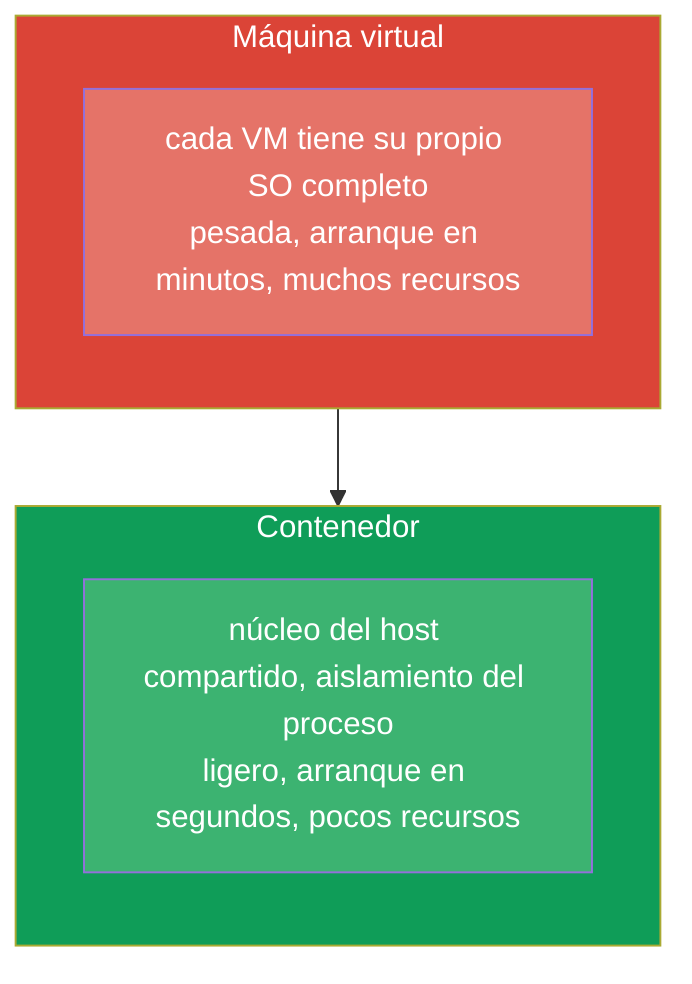
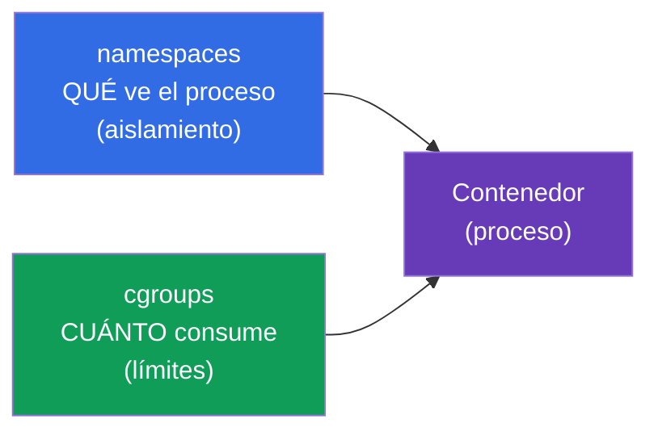
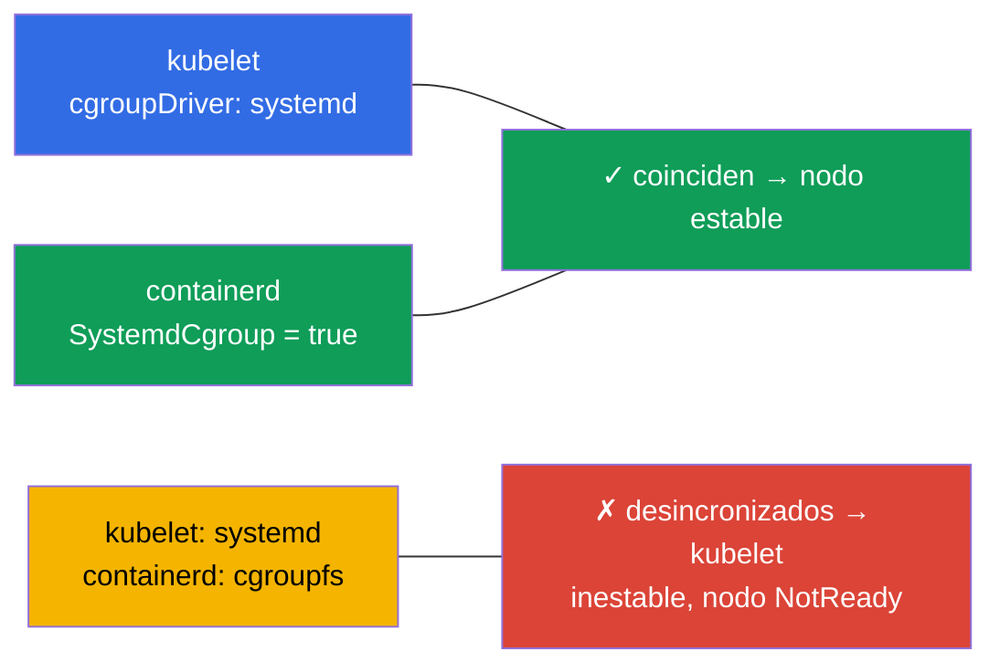
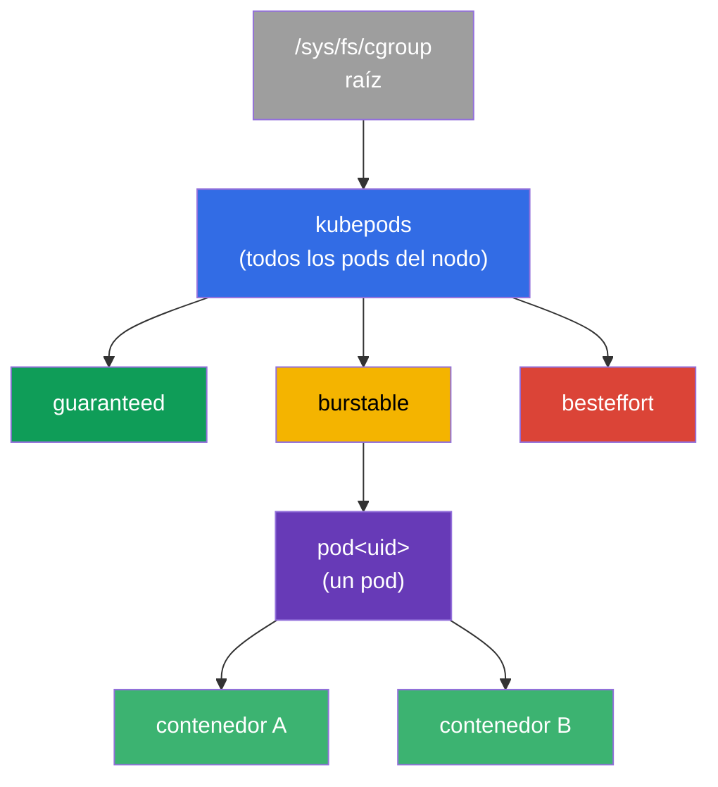
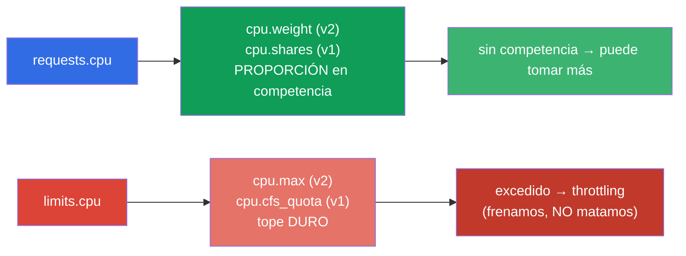
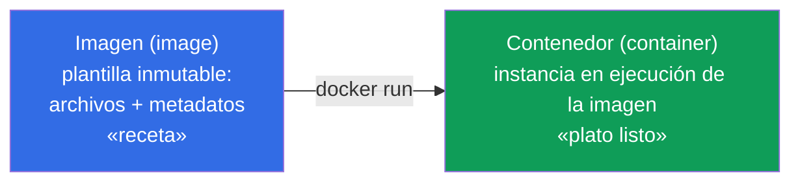
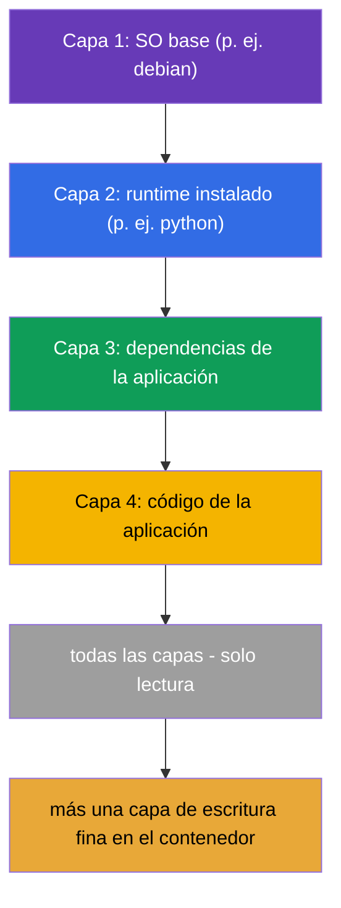
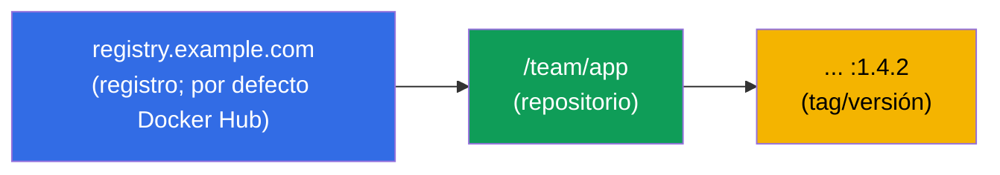
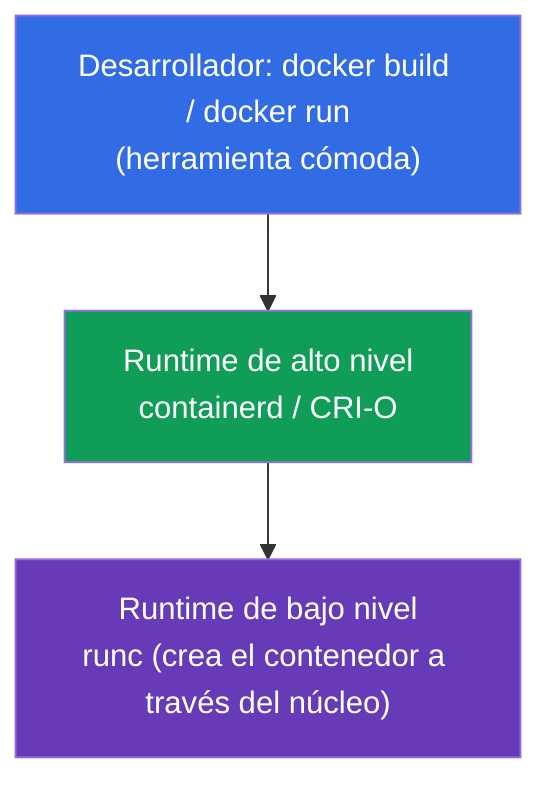
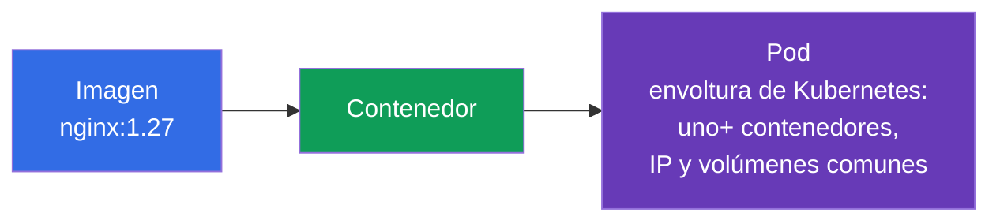

[Русская версия](ru.md) · [Eng version](README.md) · [Version française](fr.md) · [Deutsche Version](de.md) · [ქართული ვერსია](ge.md)

# Capítulo 0.4. Contenedores y Docker desde cero: imágenes, capas, registros y runtime

> **Para quién es este capítulo.** El último ladrillo de la base cero - y el más
> importante: Kubernetes orquesta precisamente contenedores, y un pod es una envoltura
> alrededor de ellos. Si ya explicas con confianza en qué se diferencia un contenedor
> de una imagen y de una máquina virtual, qué son las capas y un registro, salta
> directamente al Capítulo 1. Si los contenedores todavía te resultan difusos - este
> capítulo te da la base sobre la que se apoyan literalmente todos los demás capítulos
> del curso.

## 0.4.1. Qué es un contenedor y qué no es

Un **contenedor** es un proceso aislado (o un grupo de procesos) que usa el **núcleo
compartido** del sistema anfitrión, pero vive en su propia «burbuja»: sus propios
archivos, su propia red, sus propios límites. No es una «pequeña máquina virtual» - y la
diferencia es fundamental.



El aislamiento lo proporcionan las capacidades del núcleo de Linux: **namespaces**
(aíslan lo que ve un proceso: su propio PID, red, puntos de montaje) y **cgroups**
(limitan cuánto consume un proceso: CPU, memoria). No confundas estos Linux-namespaces
con los namespaces de Kubernetes (Capítulo 6) - solo coincide la palabra. Veamos ambos
mecanismos con más detalle - sobre ellos se apoyan requests/limits y todo el aislamiento
de los pods.

## 0.4.2. Cómo el núcleo limita un contenedor: namespaces y cgroups

Un contenedor es un proceso corriente, pero el núcleo le pone dos «bozales»:



Los **namespaces** se encargan del **aislamiento** - un proceso ve solo «lo suyo». Tipos
principales:

| Namespace | Qué aísla |
|-----------|-----------|
| **PID** | árbol de procesos (dentro del contenedor su propio PID 1) |
| **NET** | interfaces de red, IP, puertos (Capítulo 0.7) |
| **MNT** | puntos de montaje, sistema de archivos |
| **UTS** | hostname |
| **IPC** | comunicación entre procesos |
| **USER** | mapeo de usuarios (root en el contenedor ≠ root en el host) |

Las **cgroups** (control groups) se encargan de los **límites** - cuántos recursos puede
consumir un proceso. Controladores clave:

| Controlador | Qué limita | Adónde se mapea en Kubernetes |
|-------------|------------|-------------------------------|
| **cpu** | cuota/proporción de CPU | `requests/limits.cpu` (Capítulo 14) |
| **memory** | tope de memoria | `limits.memory` → excederlo = **OOMKilled** (Capítulo 44) |
| **pids** | número de procesos | protección contra una fork-bomb |
| **io** | ancho de banda de disco | throttling de entrada/salida |

El vínculo directo con el curso: cuando en el Capítulo 14 escribes `limits: {cpu: 500m,
memory: 128Mi}`, el kubelet, a través del runtime, lo traduce en la configuración de la
cgroup del contenedor. Si excedes la cuota de CPU, el proceso se **frena** (throttling);
si excedes el límite de memoria, el núcleo **mata** el contenedor con `OOMKilled`. Es
decir, requests/limits no son «deseos de Kubernetes», sino restricciones reales del
núcleo de Linux a través de cgroups.

## 0.4.3. cgroup v1 y v2: dos versiones del mecanismo

Las cgroups tienen dos versiones, y la diferencia importa para los nodos del clúster:

| | **cgroup v1** | **cgroup v2** |
|--|---------------|---------------|
| Jerarquía | separada por cada controlador (cpu, memory... de forma distinta) | jerarquía **única** unificada |
| Coherencia | los controladores se configuran de forma dispar | una interfaz única y coherente |
| Memoria | control básico | más preciso (MemoryQoS), contabilidad de carga (PSI) |
| Estado | heredado, en retirada gradual | **estándar moderno** |

Para Kubernetes esto no es una abstracción:

- El **soporte de cgroup v2 es estable (GA) desde Kubernetes 1.25**.
- Se necesita un núcleo **5.8+**, un container runtime con soporte de v2 (containerd
  1.4+, CRI-O 1.20+) y el cgroup-driver de **systemd**.
- Parte de las capacidades (control fino de memoria MemoryQoS, métricas de presión PSI)
  están disponibles **solo en v2**.

Comprobar qué versión hay en un nodo:

```bash
stat -fc %T /sys/fs/cgroup/     # cgroup2fs → v2 ; tmpfs → v1 (o híbrido)
```

## 0.4.4. Desde qué versiones de distribuciones cgroup v2 va por defecto

cgroup v2 está disponible en el núcleo desde 4.5 (2016), pero las distribuciones lo
activaron por defecto más tarde. Referencias:

| Distribución | cgroup v2 por defecto desde |
|--------------|-----------------------------|
| **Fedora** | 31 (2019) - la primera entre las grandes |
| **Ubuntu** | 21.10, y en LTS - desde **22.04** |
| **Debian** | 11 (Bullseye) |
| **RHEL / CentOS Stream / Rocky / Alma** | **9** (en RHEL 8 v1 por defecto) |
| **Arch, openSUSE Tumbleweed** | 2021+ |

Conclusión práctica: en los nodos modernos (Ubuntu 22.04, Debian 12, RHEL 9), que usan
las prácticas del curso, - **cgroup v2**. En los antiguos (RHEL 8, Ubuntu 20.04) puede
ser v1 o híbrido, lo que a veces explica la diferencia en el comportamiento de los
límites.

## 0.4.5. cgroup-driver: por qué esto rompe los nodos

Otro punto práctico sobre el que suelen preguntar. Pueden configurar cgroups dos
partes - el propio **systemd** y el «crudo» **cgroupfs**. Por eso las cgroups tienen un
**driver**, y es crítico que **el kubelet y el container runtime usen el mismo**:



- En sistemas con systemd (todas las distribuciones modernas) se recomienda el driver
  **systemd** para ambos.
- En containerd es el flag `SystemdCgroup = true` en la configuración - justo el que se
  establece al preparar los nodos (práctica 116, Capítulo 35).
- La desincronización de drivers es la causa clásica de «nodo inestable / kubelet se
  cae» tras una instalación manual del clúster.

## 0.4.6. cgroups más a fondo: árbol, cuotas de CPU y QoS

Las secciones anteriores explicaron *qué* hacen las cgroups. Ahora - *cómo* exactamente,
porque sobre esto se apoyan requests/limits y las clases QoS (Capítulos 14, 44), y en el
examen y en la batalla eso explica por qué un pod «va lento» y otro está «muerto».

### Una cgroup es un nodo en un árbol

Una cgroup no es una abstracción, sino un directorio en un sistema de archivos especial
`/sys/fs/cgroup`. Cada directorio es un grupo de procesos con configuración de recursos;
los directorios se anidan en un árbol, y las restricciones se heredan hacia abajo. El
kubelet construye su propia jerarquía bajo los contenedores del clúster:



La rama `kubepods` se divide por **clases QoS** (guaranteed/burstable/besteffort),
dentro - un directorio por cada pod, dentro - uno por cada contenedor. Así el límite del
pod acota la suma de sus contenedores, y el límite de la rama QoS - el comportamiento
ante la falta de recursos en el nodo.

### CPU: dos palancas distintas - peso y cuota

Lo principal que se confunde: **requests.cpu y limits.cpu son dos configuraciones
distintas de cgroup**.



- **requests.cpu → peso** (`cpu.weight` en v2, `cpu.shares` en v1). No es un tope, sino
  una *proporción* del tiempo de procesador **en competencia**. Si la CPU está libre, el
  contenedor toma más que su request.
- **limits.cpu → cuota** (`cpu.max` en v2: `quota period`; `cpu.cfs_quota_us` en v1). Es
  un tope duro por período: si lo excede, el proceso se **frena** (CPU throttling), pero
  **no lo matan**. De ahí el síntoma típico «la aplicación va lenta, aunque la CPU no
  está al 100%» - la corta la cuota.

### Memory: el límite mata, el request no

Con la memoria la lógica es distinta: no se puede «frenar», así que exceder el límite =
muerte.

- **limits.memory → `memory.max`** (v2) / `memory.limit_in_bytes` (v1). Si lo excede, el
  núcleo invoca al **OOM-killer**, el contenedor recibe el estado **OOMKilled**
  (Capítulo 44).
- **requests.memory** no crea un límite duro de cgroup - influye en la **planificación**
  (dónde cabe el pod) y en el orden de **desalojo** (eviction) cuando falta memoria en el
  nodo.

| Recurso | requests → | limits → | Exceder limits |
|---------|-----------|----------|----------------|
| CPU | peso (`cpu.weight`/`shares`) | cuota (`cpu.max`/`cfs_quota`) | **throttling** (frenamos) |
| Memory | planificación/eviction | `memory.max`/`limit_in_bytes` | **OOMKilled** (matamos) |

### Clases QoS = lugar en el árbol

La combinación de requests/limits determina la **clase QoS** del pod, y esta - la rama en
el árbol de cgroup y la prioridad al desalojar:

| QoS | Condición | Cuando falta memoria en el nodo |
|-----|-----------|----------------------------------|
| **Guaranteed** | requests == limits para todos los contenedores | se desaloja el último |
| **Burstable** | requests < limits (al menos algo definido) | se desaloja el segundo |
| **BestEffort** | ni requests ni limits definidos | se desaloja **el primero** |

### PSI: presión de recursos (solo v2)

cgroup v2 entrega **PSI (Pressure Stall Information)** - una métrica de cuánto los
procesos *esperaron* CPU, memoria o I/O. Es más precisa que «carga al 100%»: muestra la
falta real. Con PSI se construyen alertas (Capítulo 28) y decisiones de autoescalado.

### Cómo mirarlo en vivo

```bash
# Versión de cgroup en el nodo
stat -fc %T /sys/fs/cgroup/            # cgroup2fs → v2

# Configuración de CPU del contenedor (v2): "max 100000" = límite 1 CPU; "max" = sin límite
cat /sys/fs/cgroup/.../cpu.max
cat /sys/fs/cgroup/.../cpu.weight

# Memoria (v2): consumo actual y límite
cat /sys/fs/cgroup/.../memory.current
cat /sys/fs/cgroup/.../memory.max

# Cuántas veces frenaron al contenedor por la cuota (diagnóstico "lento, pero la CPU no está al 100%")
cat /sys/fs/cgroup/.../cpu.stat        # mirar nr_throttled / throttled_usec

# Presión de recursos (PSI, solo v2)
cat /sys/fs/cgroup/.../cpu.pressure
cat /sys/fs/cgroup/.../memory.pressure
```

Conclusión para el curso: `requests` y `limits` del Capítulo 14 son exactamente
`cpu.weight`/`cpu.max` y `memory.max` de un contenedor concreto en el árbol de cgroup.
Entender la diferencia «peso frente a cuota» y «throttling frente a OOMKilled» elimina la
mayor parte de las preguntas al depurar el rendimiento.

## 0.4.7. Imagen frente a contenedor

Dos conceptos que los principiantes confunden con más frecuencia:



- Una **imagen** es una plantilla inmutable: el sistema de archivos de la aplicación más
  metadatos (qué comando ejecutar, qué puertos, variables). Es una «receta» o una
  «clase».
- Un **contenedor** es una instancia lanzada desde una imagen. Desde una sola imagen se
  pueden lanzar tantos contenedores idénticos como se quiera. Es un «plato listo» o un
  «objeto».

En Kubernetes siempre indicas una **imagen** (`image: nginx:1.27`), y el clúster lanza a
partir de ella **contenedores** dentro de los pods.

## 0.4.8. Capas de la imagen y por qué importan

La imagen se ensambla a partir de **capas (layers)** - cada capa es un conjunto de
cambios del sistema de archivos sobre la anterior. Las capas se **reutilizan** y se
cachean: si dos imágenes empiezan con la misma capa base, esta se almacena y se descarga
una sola vez.



Consecuencia práctica: las capas de la imagen son de **solo lectura**, y el contenedor
añade encima una **capa de escritura** fina. Por eso los datos escritos dentro de un
contenedor desaparecen al recrearlo - para datos persistentes hacen falta volúmenes
(Capítulos 24-26). El orden de las capas en el Dockerfile influye en la velocidad de
construcción: lo que cambia poco, antes; el código, al final (en detalle en el Capítulo
23).

## 0.4.9. Dockerfile: cómo nace una imagen

La imagen se describe con un archivo de texto **Dockerfile** - una lista de
instrucciones. Cada instrucción suele generar una capa.

```dockerfile
FROM python:3.12-slim        # imagen base (capa de cimiento)
WORKDIR /app                 # directorio de trabajo
COPY requirements.txt .      # copiamos la lista de dependencias
RUN pip install -r requirements.txt   # instalamos dependencias (capa)
COPY . .                     # copiamos el código de la aplicación (capa)
EXPOSE 8080                  # documentamos el puerto
CMD ["python", "app.py"]     # comando de arranque por defecto
```

Instrucciones clave que hay que reconocer:

| Instrucción | Qué hace |
|-------------|----------|
| `FROM` | imagen base con la que empieza la construcción |
| `RUN` | ejecutar un comando durante la construcción (crea una capa) |
| `COPY` / `ADD` | añadir archivos a la imagen |
| `WORKDIR` | directorio de trabajo dentro de la imagen |
| `EXPOSE` | documentar un puerto (no lo abre por sí mismo) |
| `ENV` | variable de entorno |
| `CMD` | comando por defecto al arrancar el contenedor |
| `ENTRYPOINT` | parte inmutable del comando de arranque |

El vínculo con Kubernetes es directo: el `CMD`/`ENTRYPOINT` de la imagen es lo que en el
manifiesto del pod se sobrescribe con los campos `command` y `args` (Capítulo 17), y
`ENV` es lo que se complementa mediante `env` y ConfigMap/Secret (Capítulos 17-19).

## 0.4.10. Registro: dónde se almacenan las imágenes

La imagen construida se coloca en un **registro (registry)** - un almacén de imágenes
desde donde los nodos las descargan. El nombre completo de la imagen se lee así:



- Si no se indica el registro - se sobreentiende **Docker Hub**.
- El **tag** es la versión de la imagen (`nginx:1.27`). El tag `latest` no es «la versión
  más nueva para siempre», sino simplemente el tag por defecto; en producción hacerlo así
  es peligroso, mejor fijar la versión.
- Los registros privados requieren autenticación - en Kubernetes se define mediante
  `imagePullSecrets` (Capítulos 19, 23).

## 0.4.11. Docker y container runtime: quién ejecuta realmente los contenedores

Docker hizo masivos los contenedores, pero es importante entender el reparto de roles,
porque **Kubernetes no usa Docker directamente**.



- **Docker** es una herramienta cómoda para la persona: construir una imagen, ejecutarla
  en local.
- **containerd / CRI-O** son los «motores» (runtimes de alto nivel) que realmente
  gestionan los contenedores. Es justo con ellos con los que el kubelet se comunica a
  través de la interfaz **CRI** (Container Runtime Interface, Capítulo 40).
- **runc** es la herramienta de bajo nivel que crea el contenedor con medios del núcleo.

Un detalle histórico sobre el que gusta preguntar: antes el kubelet accedía a Docker a
través de una capa intermedia `dockershim`, pero la quitaron. Hoy los nodos del clúster
suelen usar **containerd** directamente. Las imágenes siguen siendo compatibles
(estándar OCI), por eso una imagen construida con `docker build` se ejecuta
perfectamente en un clúster sobre containerd.

## 0.4.12. Puente hacia el pod (Capítulo 4)



La cadena que hay que tener en la cabeza todo el curso: **imagen → contenedor → pod**.
Kubernetes no gestiona los contenedores uno a uno - su unidad mínima es el **pod**, una
envoltura alrededor de uno o varios contenedores con IP y volúmenes comunes. En detalle -
en el Capítulo 4.

## 0.4.13. Cómo se aplica esto en producción

- **Imágenes pequeñas.** Cuanto menor es la imagen, más rápido el despliegue y menos
  vulnerabilidades. Se usan bases slim/alpine y construcción multietapa (Capítulo 23).
- **Fijar versiones, no `latest`.** En producción se etiqueta con versiones concretas -
  de lo contrario «lo mismo» se despliega de forma distinta y se rompe de manera
  impredecible.
- **Escaneo de imágenes.** Las imágenes se revisan en busca de vulnerabilidades antes del
  despliegue; las imágenes base se actualizan con regularidad.
- **Registro propio.** Las empresas mantienen un registro privado (Harbor, ECR, GAR):
  control de acceso, caché, escaneo, independencia de los límites públicos de Docker Hub.
- **containerd en los nodos.** Entender que bajo el capó está containerd + runc (y no
  Docker) es necesario para el troubleshooting de los nodos: los logs y el estado de los
  contenedores se miran con `crictl`, no con `docker`.

## 0.4.14. Miniglosario

- **Contenedor** - un proceso aislado sobre el núcleo compartido del host (namespaces +
  cgroups).
- **namespaces (Linux)** - aislamiento de lo que ve un proceso (PID, NET, MNT, UTS, IPC, USER).
- **cgroups** - limitación de cuánto consume un proceso (cpu, memory, pids, io).
- **cgroup v1 / v2** - versiones antigua (jerarquía por controlador) / moderna (jerarquía única); v2 hace falta para parte de las capacidades (K8s cgroup v2 GA desde 1.25).
- **OOMKilled** - contenedor matado por el núcleo por exceder el límite de memoria de cgroup.
- **cgroup-driver** - quién configura las cgroups: `systemd` o `cgroupfs`; el kubelet y el runtime deben coincidir (`SystemdCgroup=true`).
- **cpu.weight / cpu.shares** - el peso de CPU (de `requests.cpu`): proporción del procesador en competencia, no un tope.
- **cpu.max / cfs_quota** - la cuota dura de CPU (de `limits.cpu`); excederla = **throttling**.
- **CPU throttling** - ralentización forzada del proceso por exceder la cuota de CPU (no muerte).
- **memory.max** - el tope de memoria de cgroup (de `limits.memory`); excederlo = OOMKilled.
- **kubepods** - la rama raíz de cgroup del kubelet: `kubepods → QoS → pod → contenedor`.
- **Clase QoS** - Guaranteed/Burstable/BestEffort; determina la rama de cgroup y el orden de desalojo.
- **PSI (Pressure Stall Information)** - métrica de espera de CPU/memoria/I/O (solo cgroup v2).
- **Imagen (image)** - plantilla inmutable del sistema de archivos de la aplicación + metadatos.
- **Capa (layer)** - conjunto de cambios del SA; las capas se reutilizan y se cachean.
- **Capa de escritura** - la fina capa mutable del contenedor sobre las capas de solo lectura de la imagen.
- **Dockerfile** - descripción en texto de la construcción de la imagen a partir de instrucciones.
- **Registro (registry)** - almacén de imágenes (por defecto Docker Hub).
- **Tag** - versión de la imagen; `latest` es solo el tag por defecto, no «siempre reciente».
- **OCI** - estándar abierto del formato de imágenes y contenedores.
- **containerd / CRI-O** - runtimes de alto nivel con los que trabaja el kubelet.
- **CRI** - interfaz entre el kubelet y el container runtime (Capítulo 40).
- **runc** - herramienta de bajo nivel de lanzamiento de contenedores a través del núcleo.

## 0.4.15. Resumen del capítulo

- Un contenedor es un proceso aislado sobre un núcleo compartido (namespaces + cgroups),
  no una mini-VM: más ligero, más rápido, más económico.
- namespaces aíslan (qué se ve: PID/NET/MNT/...), cgroups limitan (cuántos recursos:
  cpu/memory/pids/io); requests/limits de Kubernetes son configuraciones reales de
  cgroup, de ahí el throttling por CPU y el OOMKilled por memoria (Capítulos 14, 44).
- `requests.cpu` → peso (`cpu.weight`/`shares`, proporción en competencia), `limits.cpu`
  → cuota (`cpu.max`/`cfs_quota`, tope duro → throttling); `limits.memory` → `memory.max`
  (excederlo → OOMKilled). El kubelet construye el árbol `kubepods → QoS → pod →
  contenedor`, y la clase QoS (Guaranteed/Burstable/BestEffort) define el orden de
  desalojo.
- cgroup v2 - jerarquía única (estándar moderno, K8s GA desde 1.25, hace falta núcleo
  5.8+); por defecto en Fedora 31+, Ubuntu 22.04+, Debian 11+, RHEL 9+ (en RHEL 8 - v1);
  solo v2 da PSI (la métrica de presión de recursos).
- El cgroup-driver del kubelet y del runtime deben coincidir (systemd,
  `SystemdCgroup=true`) - de lo contrario el nodo es inestable (práctica 116, Capítulo
  35).
- Una imagen es una «receta» inmutable, un contenedor es una instancia lanzada a partir
  de ella; desde una imagen se lanzan muchos contenedores.
- Una imagen consta de capas de solo lectura (se cachean y reutilizan); un contenedor
  añade una capa de escritura que se pierde al recrearlo - de ahí la necesidad de
  volúmenes.
- El Dockerfile describe la construcción; `CMD`/`ENV`/`EXPOSE` se corresponden
  directamente con campos del pod.
- Las imágenes se almacenan en registros; el nombre = registro/repositorio:tag; en
  producción se fijan las versiones.
- Kubernetes usa no Docker, sino un container runtime (normalmente containerd) a través
  de CRI; las imágenes son compatibles gracias al estándar OCI.
- La cadena clave del curso: imagen → contenedor → pod.

## 0.4.16. Para qué sirve: en el examen y en el trabajo real

**En el examen.** Los contenedores son el fundamento de todo: el pod (Capítulo 4),
`command`/`args` (Capítulo 17), imágenes y Dockerfile (Capítulo 23), CRI (Capítulo 40),
troubleshooting de nodos con `crictl` (Capítulo 45). Entender «imagen ≠ contenedor» y las
capas hace falta para no liarse en una de cada dos tareas de CKAD.

**En el trabajo real.** Construir imágenes compactas y seguras, trabajar con registros,
fijar versiones, diagnosticar contenedores en los nodos con containerd/`crictl` - tareas
cotidianas. La base sobre contenedores separa a quienes «copipegan manifiestos» de
quienes entienden lo que ocurre.

## 0.4.17. Preguntas de autoevaluación

1. ¿En qué se diferencia fundamentalmente un contenedor de una máquina virtual? ¿Qué
   proporciona el aislamiento?
2. ¿De qué se ocupan los namespaces y de qué las cgroups? ¿Cómo se relacionan
   requests/limits de Kubernetes con las cgroups y qué es OOMKilled?
3. ¿En qué se diferencia cgroup v2 de v1 y desde qué versiones de distribuciones va v2
   por defecto?
4. ¿Cómo se mapean `requests.cpu` y `limits.cpu` en la cgroup y cuál es la diferencia
   entre «peso» y «cuota»? ¿Por qué al exceder el límite de CPU se frena al contenedor y
   al exceder el límite de memoria se le mata?
5. ¿Cómo está estructurado el árbol de cgroup que construye el kubelet (kubepods → QoS →
   pod → contenedor) y cómo se relaciona la clase QoS con el orden de desalojo de los
   pods?
6. ¿Qué es el cgroup-driver y por qué su desincronización entre el kubelet y el runtime
   rompe un nodo?
7. ¿Cuál es la diferencia entre una imagen y un contenedor? ¿Cuántos contenedores se
   pueden lanzar desde una sola imagen?
8. ¿Qué son las capas de la imagen y por qué los datos dentro de un contenedor no
   sobreviven a la recreación?
9. ¿Cómo se lee el nombre completo de una imagen y por qué `latest` es peligroso en
   producción?
10. ¿Usa Kubernetes Docker para ejecutar contenedores? ¿Qué usa y a través de qué
   interfaz?
11. ¿Cómo se relacionan la imagen, el contenedor y el pod?

## Práctica

Los contenedores son el último ladrillo «de infraestructura». A continuación, en la
Parte 0 - tres habilidades prácticas sin las que las prácticas se atascan: trabajar con
un nodo en Linux (0.5), YAML (0.6) y la red de Linux por dentro (0.7). Luego - el curso
principal a partir del Capítulo 1.

---
[Índice](../README_ES.md) · [Capítulo 0.3](../00-3-tls/es.md) · [Capítulo 0.5](../00-5-linux/es.md)
