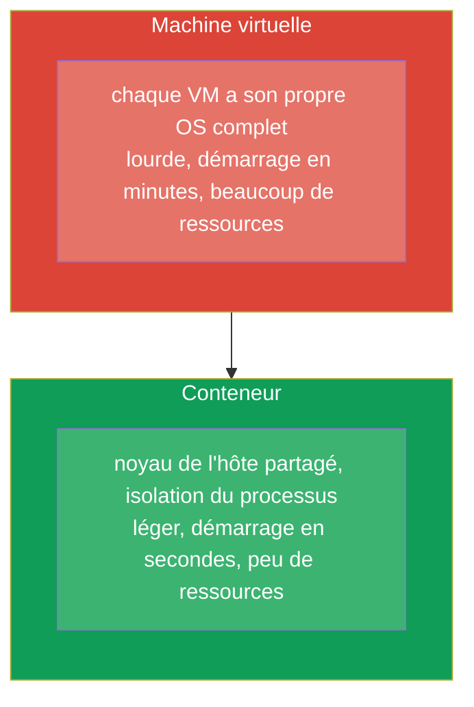
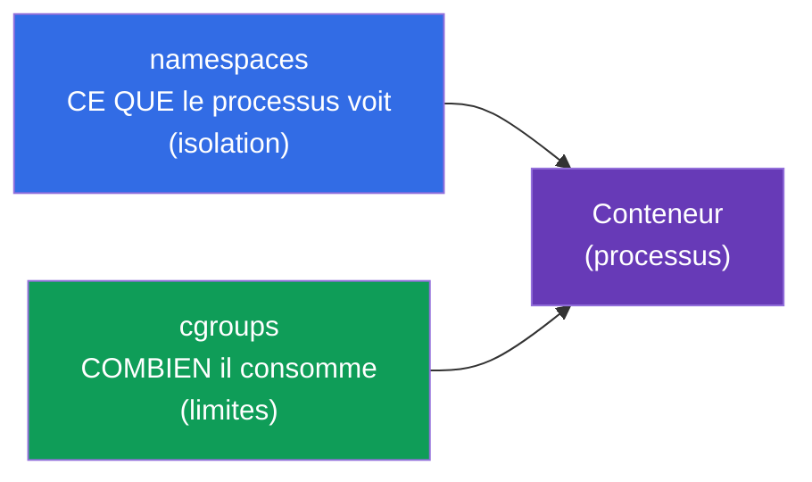
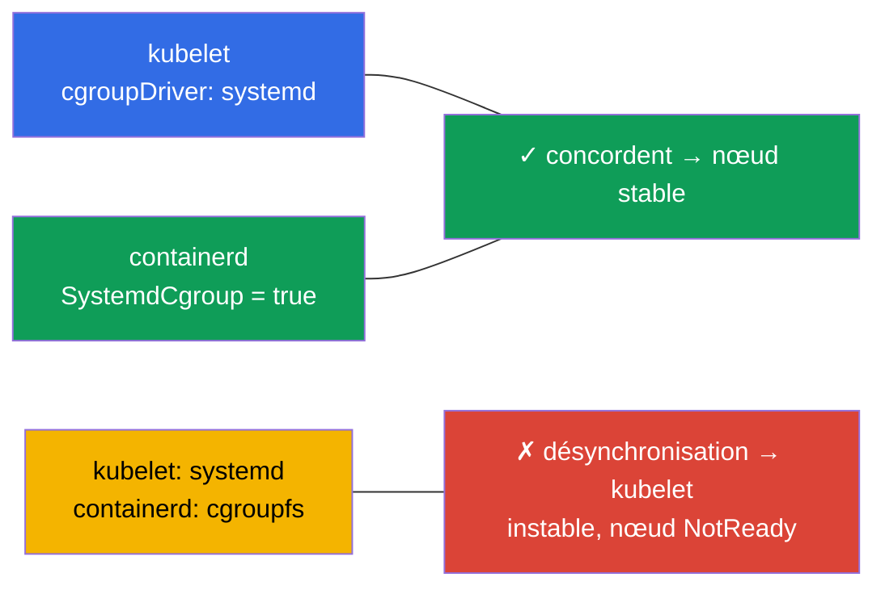
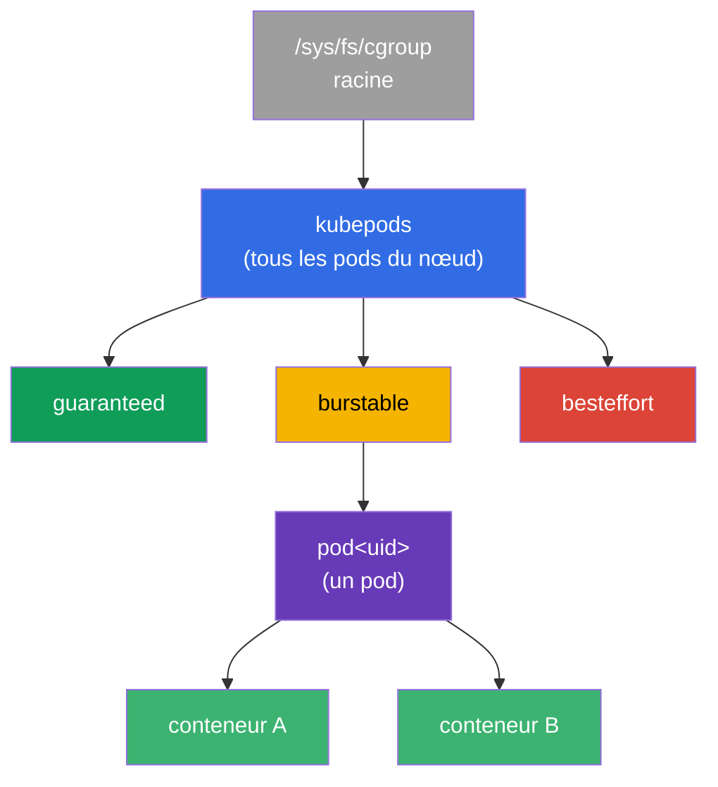
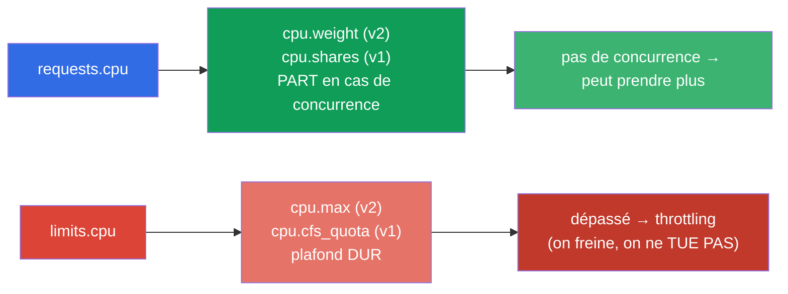
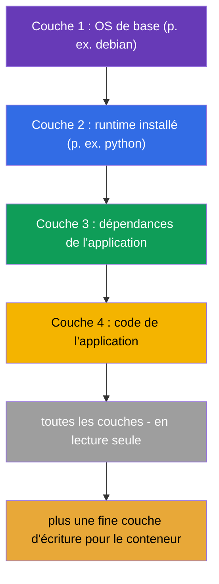
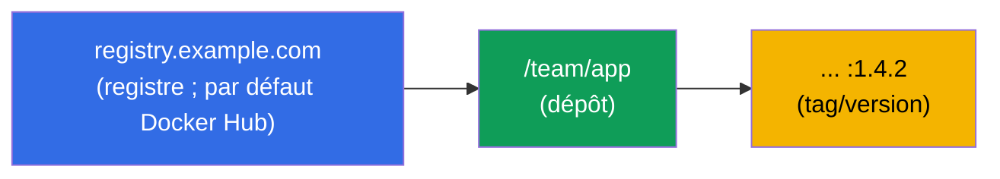
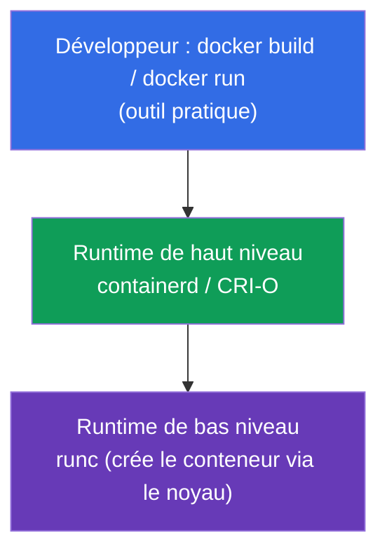
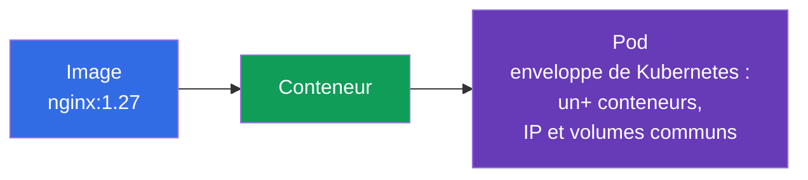

[Русская версия](ru.md) · [Eng version](README.md) · [Versión en español](es.md) · [Deutsche Version](de.md) · [ქართული ვერსია](ge.md)

# Chapitre 0.4. Conteneurs et Docker depuis zéro : images, couches, registres et runtime

> **À qui s'adresse ce chapitre.** La dernière brique du socle zéro - et la plus
> importante : Kubernetes orchestre précisément des conteneurs, et un pod est une
> enveloppe autour d'eux. Si vous savez déjà expliquer avec assurance en quoi un
> conteneur diffère d'une image et d'une machine virtuelle, ce que sont les couches et
> un registre, passez directement au Chapitre 1. Si les conteneurs restent flous pour
> vous - ce chapitre vous donne la base sur laquelle reposent littéralement tous les
> autres chapitres du cours.

## 0.4.1. Ce qu'est un conteneur et ce qu'il n'est pas

Un **conteneur** est un processus isolé (ou un groupe de processus) qui utilise le
**noyau partagé** du système hôte, mais vit dans sa propre « bulle » : ses propres
fichiers, son propre réseau, ses propres limites. Ce n'est pas une « petite machine
virtuelle » - et la différence est fondamentale.



L'isolation est assurée par des fonctionnalités du noyau Linux : les **namespaces**
(isolent ce que voit un processus : son propre PID, réseau, points de montage) et les
**cgroups** (limitent ce que consomme un processus : CPU, mémoire). Ne confondez pas ces
Linux-namespaces avec les namespaces de Kubernetes (Chapitre 6) - seul le mot coïncide.
Examinons les deux mécanismes plus en détail - c'est sur eux que reposent
requests/limits et toute l'isolation des pods.

## 0.4.2. Comment le noyau limite un conteneur : namespaces et cgroups

Un conteneur est un processus ordinaire, mais le noyau lui met deux « muselières » :



Les **namespaces** sont responsables de l'**isolation** - un processus ne voit que « le
sien ». Types principaux :

| Namespace | Ce qu'il isole |
|-----------|----------------|
| **PID** | arbre des processus (dans le conteneur son propre PID 1) |
| **NET** | interfaces réseau, IP, ports (Chapitre 0.7) |
| **MNT** | points de montage, système de fichiers |
| **UTS** | hostname |
| **IPC** | communication interprocessus |
| **USER** | mappage des utilisateurs (root dans le conteneur ≠ root sur l'hôte) |

Les **cgroups** (control groups) sont responsables des **limites** - combien de
ressources un processus peut consommer. Contrôleurs clés :

| Contrôleur | Ce qu'il limite | Où cela se mappe dans Kubernetes |
|------------|-----------------|----------------------------------|
| **cpu** | part/quota de CPU | `requests/limits.cpu` (Chapitre 14) |
| **memory** | plafond de mémoire | `limits.memory` → dépassement = **OOMKilled** (Chapitre 44) |
| **pids** | nombre de processus | protection contre une fork-bomb |
| **io** | débit disque | throttling des entrées-sorties |

Le lien direct avec le cours : quand, au Chapitre 14, vous écrivez `limits: {cpu: 500m,
memory: 128Mi}`, le kubelet, via le runtime, le traduit en réglages de la cgroup du
conteneur. Dépassez le quota CPU et le processus est **freiné** (throttling) ; dépassez
la limite de mémoire et le noyau **tue** le conteneur avec `OOMKilled`. Autrement dit,
requests/limits ne sont pas des « souhaits de Kubernetes », mais de vraies contraintes du
noyau Linux via les cgroups.

## 0.4.3. cgroup v1 et v2 : deux versions du mécanisme

Les cgroups ont deux versions, et la différence compte pour les nœuds du cluster :

| | **cgroup v1** | **cgroup v2** |
|--|---------------|---------------|
| Hiérarchie | séparée par contrôleur (cpu, memory... différemment) | hiérarchie **unique** unifiée |
| Cohérence | contrôleurs configurés de façon disparate | une interface unique et cohérente |
| Mémoire | contrôle basique | plus précis (MemoryQoS), comptabilité de charge (PSI) |
| Statut | hérité, en retrait progressif | **standard moderne** |

Pour Kubernetes ce n'est pas une abstraction :

- La **prise en charge de cgroup v2 est stable (GA) depuis Kubernetes 1.25**.
- Il faut un noyau **5.8+**, un container runtime prenant en charge v2 (containerd 1.4+,
  CRI-O 1.20+) et le cgroup-driver **systemd**.
- Une partie des fonctionnalités (contrôle fin de la mémoire MemoryQoS, métriques de
  pression PSI) sont disponibles **uniquement sur v2**.

Vérifier quelle version est présente sur un nœud :

```bash
stat -fc %T /sys/fs/cgroup/     # cgroup2fs → v2 ; tmpfs → v1 (ou hybride)
```

## 0.4.4. À partir de quelles versions de distributions cgroup v2 est par défaut

cgroup v2 est disponible dans le noyau depuis 4.5 (2016), mais les distributions l'ont
activé par défaut plus tard. Repères :

| Distribution | cgroup v2 par défaut depuis |
|--------------|-----------------------------|
| **Fedora** | 31 (2019) - la première parmi les grandes |
| **Ubuntu** | 21.10, et en LTS - depuis **22.04** |
| **Debian** | 11 (Bullseye) |
| **RHEL / CentOS Stream / Rocky / Alma** | **9** (dans RHEL 8 v1 par défaut) |
| **Arch, openSUSE Tumbleweed** | 2021+ |

Conclusion pratique : sur les nœuds modernes (Ubuntu 22.04, Debian 12, RHEL 9),
qu'utilisent les TP du cours, - **cgroup v2**. Sur les anciens (RHEL 8, Ubuntu 20.04) ce
peut être v1 ou hybride, ce qui explique parfois la différence de comportement des
limites.

## 0.4.5. cgroup-driver : pourquoi cela casse les nœuds

Un autre point pratique sur lequel on aime poser des questions. Deux parties peuvent
configurer les cgroups - **systemd** lui-même et le « brut » **cgroupfs**. C'est pourquoi
les cgroups ont un **driver**, et il est crucial que **le kubelet et le container runtime
utilisent le même** :



- Sur les systèmes avec systemd (toutes les distributions modernes) le driver
  **systemd** est recommandé pour les deux.
- Dans containerd c'est le flag `SystemdCgroup = true` dans la configuration - c'est
  justement celui qu'on positionne lors de la préparation des nœuds (TP 116, Chapitre
  35).
- La désynchronisation des drivers est la cause classique de « nœud instable / kubelet
  plante » après une installation manuelle du cluster.

## 0.4.6. Les cgroups plus en profondeur : arbre, quotas CPU et QoS

Les sections ci-dessus ont expliqué *ce que* font les cgroups. Maintenant - *comment*
exactement, car c'est là-dessus que reposent requests/limits et les classes QoS
(Chapitres 14, 44), et à l'examen comme sur le terrain cela explique pourquoi un pod
« rame » et un autre est « tué ».

### Une cgroup est un nœud dans un arbre

Une cgroup n'est pas une abstraction, mais un répertoire dans un système de fichiers
spécial `/sys/fs/cgroup`. Chaque répertoire est un groupe de processus avec des réglages
de ressources ; les répertoires s'imbriquent en un arbre, et les contraintes s'héritent
vers le bas. Le kubelet construit sa propre hiérarchie sous les conteneurs du cluster :



La branche `kubepods` se divise par **classes QoS** (guaranteed/burstable/besteffort), à
l'intérieur - un répertoire par pod, à l'intérieur - un par conteneur. Ainsi la limite du
pod borne la somme de ses conteneurs, et la limite de la branche QoS - le comportement en
cas de manque de ressources sur le nœud.

### CPU : deux leviers différents - poids et quota

Ce qu'on confond le plus : **requests.cpu et limits.cpu sont deux réglages de cgroup
différents**.



- **requests.cpu → poids** (`cpu.weight` en v2, `cpu.shares` en v1). Ce n'est pas un
  plafond, mais une *part* du temps processeur **en cas de concurrence**. Si le CPU est
  libre, le conteneur prend plus que son request.
- **limits.cpu → quota** (`cpu.max` en v2 : `quota period` ; `cpu.cfs_quota_us` en v1).
  C'est un plafond dur par période : dépassez-le et le processus est **freiné** (CPU
  throttling), mais **pas tué**. D'où le symptôme typique « l'application est lente alors
  que le CPU n'est pas à 100 % » - le quota la bride.

### Memory : la limite tue, le request non

Avec la mémoire la logique est différente : on ne peut pas la « freiner », donc dépasser
la limite = mort.

- **limits.memory → `memory.max`** (v2) / `memory.limit_in_bytes` (v1). Dépassez-la et le
  noyau invoque l'**OOM-killer**, le conteneur reçoit le statut **OOMKilled** (Chapitre
  44).
- **requests.memory** ne crée pas de limite dure de cgroup - il influe sur la
  **planification** (où le pod tient) et sur l'ordre d'**éviction** (eviction) en cas de
  manque de mémoire sur le nœud.

| Ressource | requests → | limits → | Dépassement de limits |
|-----------|-----------|----------|-----------------------|
| CPU | poids (`cpu.weight`/`shares`) | quota (`cpu.max`/`cfs_quota`) | **throttling** (on freine) |
| Memory | planification/eviction | `memory.max`/`limit_in_bytes` | **OOMKilled** (on tue) |

### Classes QoS = place dans l'arbre

La combinaison de requests/limits détermine la **classe QoS** du pod, et celle-ci - la
branche dans l'arbre de cgroup et la priorité à l'éviction :

| QoS | Condition | En cas de manque de mémoire sur le nœud |
|-----|-----------|-----------------------------------------|
| **Guaranteed** | requests == limits pour tous les conteneurs | évincé en dernier |
| **Burstable** | requests < limits (au moins quelque chose défini) | évincé en deuxième |
| **BestEffort** | ni requests ni limits définis | évincé **en premier** |

### PSI : pression des ressources (v2 uniquement)

cgroup v2 fournit **PSI (Pressure Stall Information)** - une métrique de combien les
processus ont *attendu* le CPU, la mémoire ou l'I/O. C'est plus précis que « charge à
100 % » : cela montre le manque réel. À partir du PSI on construit des alertes (Chapitre
28) et des décisions d'autoscaling.

### Comment regarder en direct

```bash
# Version de cgroup sur le nœud
stat -fc %T /sys/fs/cgroup/            # cgroup2fs → v2

# Réglages CPU du conteneur (v2) : "max 100000" = limite 1 CPU ; "max" = sans limite
cat /sys/fs/cgroup/.../cpu.max
cat /sys/fs/cgroup/.../cpu.weight

# Mémoire (v2) : consommation actuelle et limite
cat /sys/fs/cgroup/.../memory.current
cat /sys/fs/cgroup/.../memory.max

# Combien de fois le conteneur a été freiné par le quota (diagnostic "lent, mais CPU pas à 100%")
cat /sys/fs/cgroup/.../cpu.stat        # regarder nr_throttled / throttled_usec

# Pression des ressources (PSI, v2 uniquement)
cat /sys/fs/cgroup/.../cpu.pressure
cat /sys/fs/cgroup/.../memory.pressure
```

Conclusion pour le cours : `requests` et `limits` du Chapitre 14 sont exactement les
`cpu.weight`/`cpu.max` et `memory.max` d'un conteneur précis dans l'arbre de cgroup.
Comprendre la différence « poids contre quota » et « throttling contre OOMKilled » lève
l'essentiel des questions lors du débogage des performances.

## 0.4.7. Image contre conteneur

Deux notions que les débutants confondent le plus souvent :


- Une **image** est un modèle immuable : le système de fichiers de l'application plus des
  métadonnées (quelle commande lancer, quels ports, variables). C'est une « recette » ou
  une « classe ».
- Un **conteneur** est une instance lancée à partir d'une image. À partir d'une seule
  image, on peut lancer autant de conteneurs identiques qu'on veut. C'est un « plat prêt »
  ou un « objet ».

Dans Kubernetes vous indiquez toujours une **image** (`image: nginx:1.27`), et le cluster
lance à partir d'elle des **conteneurs** à l'intérieur des pods.

## 0.4.8. Les couches de l'image et pourquoi c'est important

L'image est assemblée à partir de **couches (layers)** - chaque couche est un ensemble de
modifications du système de fichiers par-dessus la précédente. Les couches sont
**réutilisées** et mises en cache : si deux images commencent par la même couche de base,
celle-ci est stockée et téléchargée une seule fois.



Conséquence pratique : les couches de l'image sont en **lecture seule**, et le conteneur
ajoute par-dessus une fine **couche d'écriture**. C'est pourquoi les données écrites dans
un conteneur disparaissent lors de sa recréation - pour des données persistantes il faut
des volumes (Chapitres 24-26). L'ordre des couches dans le Dockerfile influe sur la
vitesse de construction : ce qui change rarement, plus tôt ; le code, à la fin (en détail
au Chapitre 23).

## 0.4.9. Dockerfile : comment naît une image

L'image est décrite par un fichier texte **Dockerfile** - une liste d'instructions.
Chaque instruction engendre généralement une couche.

```dockerfile
FROM python:3.12-slim        # image de base (couche de fondation)
WORKDIR /app                 # répertoire de travail
COPY requirements.txt .      # on copie la liste des dépendances
RUN pip install -r requirements.txt   # on installe les dépendances (couche)
COPY . .                     # on copie le code de l'application (couche)
EXPOSE 8080                  # on documente le port
CMD ["python", "app.py"]     # commande de démarrage par défaut
```

Instructions clés à reconnaître :

| Instruction | Ce qu'elle fait |
|-------------|-----------------|
| `FROM` | image de base par laquelle commence la construction |
| `RUN` | exécuter une commande à la construction (crée une couche) |
| `COPY` / `ADD` | ajouter des fichiers à l'image |
| `WORKDIR` | répertoire de travail dans l'image |
| `EXPOSE` | documenter un port (ne l'ouvre pas lui-même) |
| `ENV` | variable d'environnement |
| `CMD` | commande par défaut au démarrage du conteneur |
| `ENTRYPOINT` | partie immuable de la commande de démarrage |

Le lien avec Kubernetes est direct : le `CMD`/`ENTRYPOINT` de l'image est ce que le
manifeste du pod redéfinit avec les champs `command` et `args` (Chapitre 17), et `ENV`
est ce qui se complète via `env` et ConfigMap/Secret (Chapitres 17-19).

## 0.4.10. Registre : où sont stockées les images

L'image construite est placée dans un **registre (registry)** - un stockage d'images
d'où les nœuds les téléchargent. Le nom complet de l'image se lit ainsi :



- Si le registre n'est pas indiqué - on sous-entend **Docker Hub**.
- Le **tag** est la version de l'image (`nginx:1.27`). Le tag `latest` n'est pas « la
  version la plus récente pour toujours », mais simplement le tag par défaut ; en
  production, procéder ainsi est dangereux, mieux vaut figer la version.
- Les registres privés exigent une authentification - dans Kubernetes on la définit via
  `imagePullSecrets` (Chapitres 19, 23).

## 0.4.11. Docker et container runtime : qui exécute réellement les conteneurs

Docker a rendu les conteneurs grand public, mais il est important de comprendre la
répartition des rôles, car **Kubernetes n'utilise pas Docker directement**.



- **Docker** est un outil pratique pour l'humain : construire une image, l'exécuter en
  local.
- **containerd / CRI-O** sont les « moteurs » (runtimes de haut niveau) qui gèrent
  réellement les conteneurs. C'est justement avec eux que le kubelet communique via
  l'interface **CRI** (Container Runtime Interface, Chapitre 40).
- **runc** est l'outil de bas niveau qui crée le conteneur avec les moyens du noyau.

Un détail historique sur lequel on aime poser des questions : autrefois le kubelet
accédait à Docker via une couche intermédiaire `dockershim`, mais elle a été supprimée.
Aujourd'hui les nœuds du cluster utilisent généralement **containerd** directement. Les
images restent alors compatibles (standard OCI), c'est pourquoi une image construite par
`docker build` s'exécute parfaitement dans un cluster sur containerd.

## 0.4.12. Passerelle vers le pod (Chapitre 4)



La chaîne à garder en tête tout le cours : **image → conteneur → pod**. Kubernetes ne gère
pas les conteneurs un par un - son unité minimale est le **pod**, une enveloppe autour
d'un ou plusieurs conteneurs avec IP et volumes communs. En détail - au Chapitre 4.

## 0.4.13. Comment cela s'applique en production

- **Petites images.** Plus l'image est petite, plus le déploiement est rapide et moins il
  y a de vulnérabilités. On utilise des bases slim/alpine et la construction multi-étapes
  (Chapitre 23).
- **Figer les versions, pas `latest`.** En production on tague avec des versions
  concrètes - sinon « la même chose » se déploie différemment et casse de manière
  imprévisible.
- **Scan des images.** Les images sont vérifiées pour les vulnérabilités avant le
  déploiement ; les images de base sont mises à jour régulièrement.
- **Son propre registre.** Les entreprises tiennent un registre privé (Harbor, ECR, GAR)
  : contrôle d'accès, cache, scan, indépendance vis-à-vis des limites publiques de Docker
  Hub.
- **containerd sur les nœuds.** Comprendre que sous le capot c'est containerd + runc (et
  non Docker) est nécessaire au troubleshooting des nœuds : les logs et le statut des
  conteneurs se regardent avec `crictl`, pas avec `docker`.

## 0.4.14. Mini-glossaire

- **Conteneur** - un processus isolé sur le noyau partagé de l'hôte (namespaces +
  cgroups).
- **namespaces (Linux)** - isolation de ce que voit un processus (PID, NET, MNT, UTS, IPC, USER).
- **cgroups** - limitation de ce que consomme un processus (cpu, memory, pids, io).
- **cgroup v1 / v2** - versions ancienne (hiérarchie par contrôleur) / moderne (hiérarchie unique) ; v2 est nécessaire pour une partie des fonctionnalités (K8s cgroup v2 GA depuis 1.25).
- **OOMKilled** - conteneur tué par le noyau pour dépassement de la limite de mémoire de cgroup.
- **cgroup-driver** - qui configure les cgroups : `systemd` ou `cgroupfs` ; le kubelet et le runtime doivent concorder (`SystemdCgroup=true`).
- **cpu.weight / cpu.shares** - le poids CPU (de `requests.cpu`) : part du processeur en cas de concurrence, pas un plafond.
- **cpu.max / cfs_quota** - le quota dur de CPU (de `limits.cpu`) ; dépassement = **throttling**.
- **CPU throttling** - ralentissement forcé du processus pour dépassement du quota CPU (pas la mise à mort).
- **memory.max** - le plafond de mémoire de cgroup (de `limits.memory`) ; dépassement = OOMKilled.
- **kubepods** - la branche racine de cgroup du kubelet : `kubepods → QoS → pod → conteneur`.
- **Classe QoS** - Guaranteed/Burstable/BestEffort ; détermine la branche de cgroup et l'ordre d'éviction.
- **PSI (Pressure Stall Information)** - métrique d'attente du CPU/de la mémoire/de l'I/O (cgroup v2 uniquement).
- **Image** - modèle immuable du système de fichiers de l'application + métadonnées.
- **Couche (layer)** - ensemble de modifications du SF ; les couches sont réutilisées et mises en cache.
- **Couche d'écriture** - la fine couche mutable du conteneur par-dessus les couches en lecture seule de l'image.
- **Dockerfile** - description en texte de la construction de l'image à partir d'instructions.
- **Registre (registry)** - stockage d'images (par défaut Docker Hub).
- **Tag** - version de l'image ; `latest` n'est que le tag par défaut, pas « toujours frais ».
- **OCI** - standard ouvert du format d'images et de conteneurs.
- **containerd / CRI-O** - runtimes de haut niveau avec lesquels travaille le kubelet.
- **CRI** - interface entre le kubelet et le container runtime (Chapitre 40).
- **runc** - outil de bas niveau de lancement de conteneurs via le noyau.

## 0.4.15. Récapitulatif du chapitre

- Un conteneur est un processus isolé sur un noyau partagé (namespaces + cgroups), pas une
  mini-VM : plus léger, plus rapide, plus économe.
- namespaces isolent (ce qui est visible : PID/NET/MNT/...), cgroups limitent (combien de
  ressources : cpu/memory/pids/io) ; requests/limits de Kubernetes sont de vrais réglages
  de cgroup, d'où le throttling par CPU et l'OOMKilled par mémoire (Chapitres 14, 44).
- `requests.cpu` → poids (`cpu.weight`/`shares`, part en cas de concurrence), `limits.cpu`
  → quota (`cpu.max`/`cfs_quota`, plafond dur → throttling) ; `limits.memory` →
  `memory.max` (dépassement → OOMKilled). Le kubelet construit l'arbre `kubepods → QoS →
  pod → conteneur`, et la classe QoS (Guaranteed/Burstable/BestEffort) fixe l'ordre
  d'éviction.
- cgroup v2 - hiérarchie unique (standard moderne, K8s GA depuis 1.25, il faut un noyau
  5.8+) ; par défaut dans Fedora 31+, Ubuntu 22.04+, Debian 11+, RHEL 9+ (dans RHEL 8 -
  v1) ; seul v2 donne le PSI (la métrique de pression des ressources).
- Le cgroup-driver du kubelet et du runtime doivent concorder (systemd,
  `SystemdCgroup=true`) - sinon le nœud est instable (TP 116, Chapitre 35).
- Une image est une « recette » immuable, un conteneur est une instance lancée à partir
  d'elle ; à partir d'une image on lance beaucoup de conteneurs.
- Une image est constituée de couches en lecture seule (mises en cache et réutilisées) ;
  un conteneur ajoute une couche d'écriture qui se perd à la recréation - d'où le besoin
  de volumes.
- Le Dockerfile décrit la construction ; `CMD`/`ENV`/`EXPOSE` correspondent directement à
  des champs du pod.
- Les images sont stockées dans des registres ; le nom = registre/dépôt:tag ; en
  production on fige les versions.
- Kubernetes utilise non pas Docker, mais un container runtime (généralement containerd)
  via CRI ; les images sont compatibles grâce au standard OCI.
- La chaîne clé du cours : image → conteneur → pod.

## 0.4.16. À quoi cela sert : à l'examen et dans le travail réel

**À l'examen.** Les conteneurs sont le fondement de tout : le pod (Chapitre 4),
`command`/`args` (Chapitre 17), les images et le Dockerfile (Chapitre 23), CRI (Chapitre
40), le troubleshooting des nœuds via `crictl` (Chapitre 45). Comprendre « image ≠
conteneur » et les couches est nécessaire pour ne pas s'embrouiller dans une tâche CKAD
sur deux.

**Dans le travail réel.** Construire des images compactes et sûres, travailler avec les
registres, figer les versions, diagnostiquer les conteneurs sur les nœuds via
containerd/`crictl` - des tâches quotidiennes. La base sur les conteneurs sépare ceux qui
« copient-collent des manifestes » de ceux qui comprennent ce qui se passe.

## 0.4.17. Questions d'auto-évaluation

1. En quoi un conteneur diffère-t-il fondamentalement d'une machine virtuelle ? Qu'est-ce
   qui assure l'isolation ?
2. De quoi s'occupent les namespaces, et de quoi les cgroups ? Comment requests/limits de
   Kubernetes sont-ils liés aux cgroups et qu'est-ce que l'OOMKilled ?
3. En quoi cgroup v2 diffère-t-il de v1 et à partir de quelles versions de distributions
   v2 est-il par défaut ?
4. Comment `requests.cpu` et `limits.cpu` se mappent-ils dans la cgroup et quelle est la
   différence entre « poids » et « quota » ? Pourquoi, en cas de dépassement de la limite
   CPU, le conteneur est-il freiné, alors qu'en cas de dépassement de la limite de mémoire
   il est tué ?
5. Comment est structuré l'arbre de cgroup que construit le kubelet (kubepods → QoS → pod
   → conteneur), et comment la classe QoS est-elle liée à l'ordre d'éviction des pods ?
6. Qu'est-ce que le cgroup-driver et pourquoi sa désynchronisation entre le kubelet et le
   runtime casse-t-elle un nœud ?
7. Quelle est la différence entre une image et un conteneur ? Combien de conteneurs
   peut-on lancer à partir d'une seule image ?
8. Que sont les couches de l'image et pourquoi les données à l'intérieur d'un conteneur ne
   survivent-elles pas à la recréation ?
9. Comment se lit le nom complet d'une image et pourquoi `latest` est-il dangereux en
   production ?
10. Kubernetes utilise-t-il Docker pour exécuter les conteneurs ? Qu'utilise-t-il et via
   quelle interface ?
11. Comment l'image, le conteneur et le pod sont-ils liés ?

## Pratique

Les conteneurs sont la dernière brique « d'infrastructure ». Ensuite, dans la Partie 0 -
trois compétences pratiques sans lesquelles les TP patinent : travailler avec un nœud sous
Linux (0.5), le YAML (0.6) et le réseau Linux sous le capot (0.7). Puis - le cours
principal à partir du Chapitre 1.

---
[Sommaire](../README_FR.md) · [Chapitre 0.3](../00-3-tls/fr.md) · [Chapitre 0.5](../00-5-linux/fr.md)
