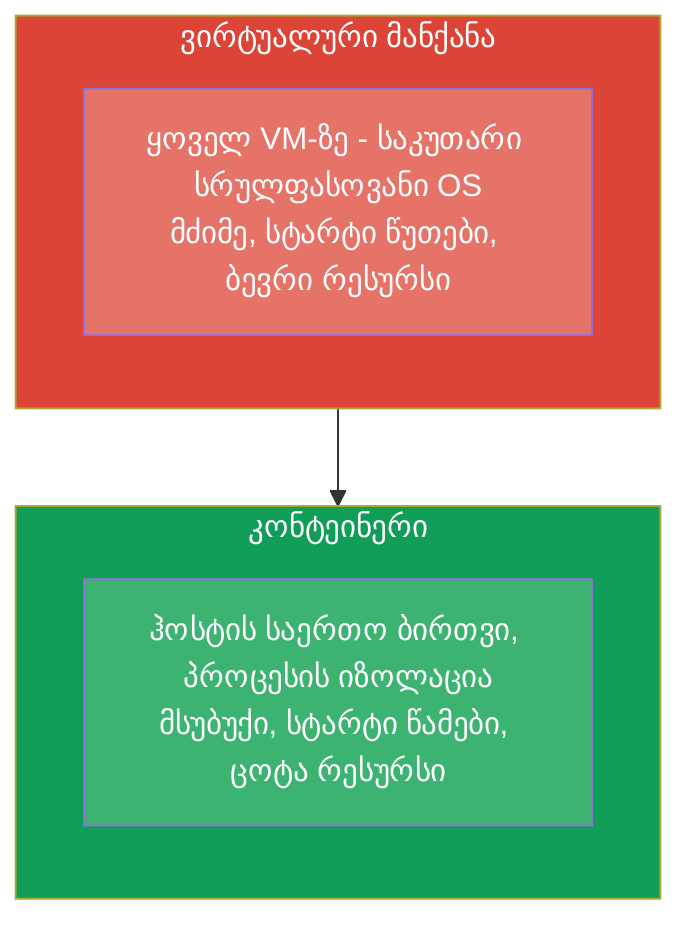
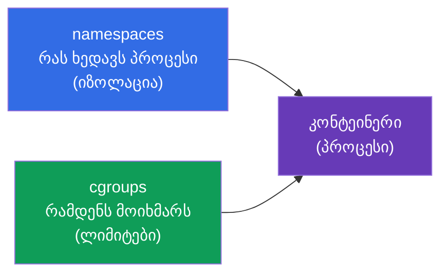
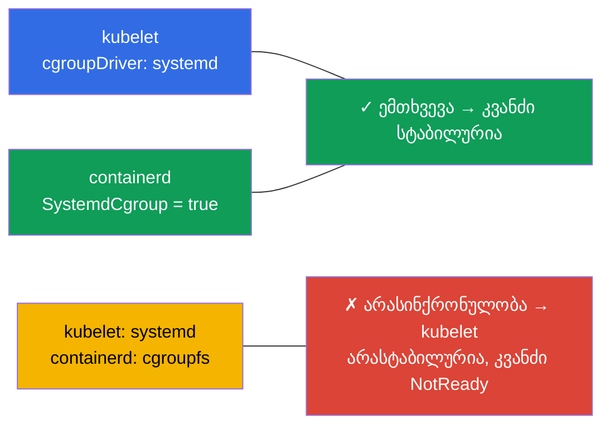
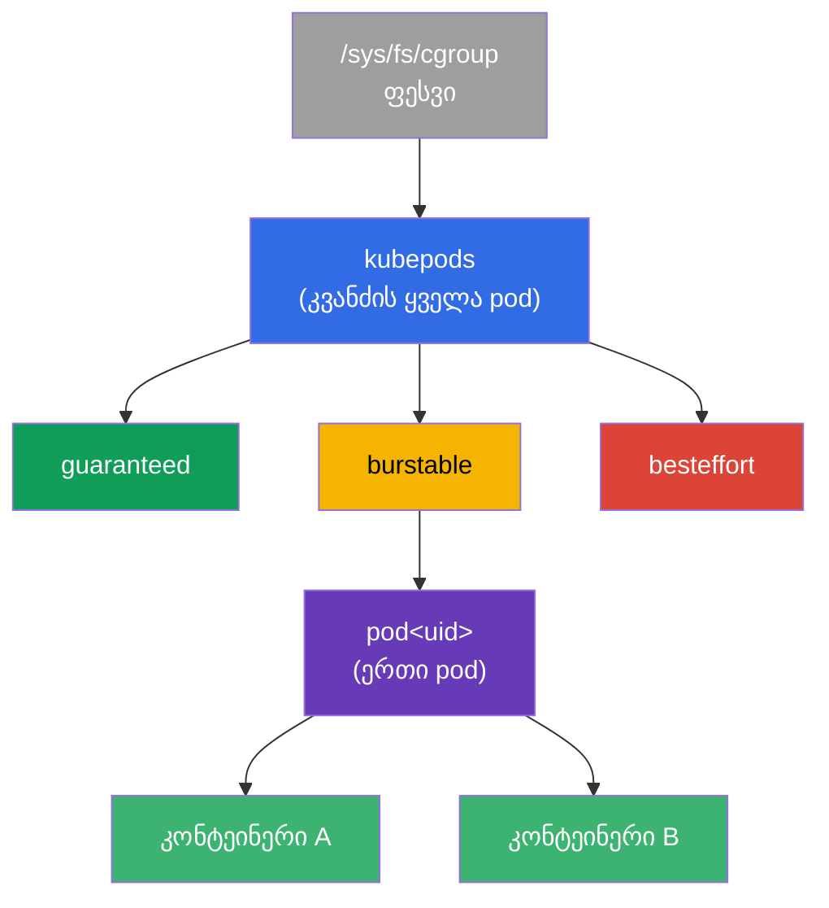
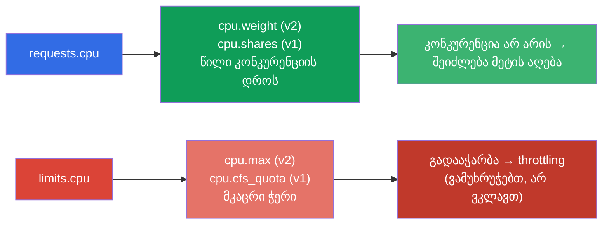
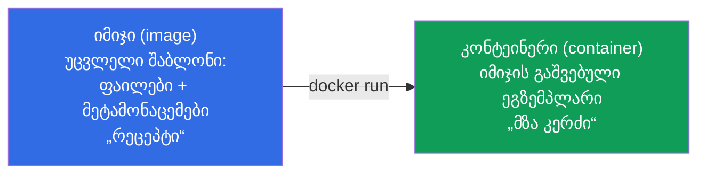
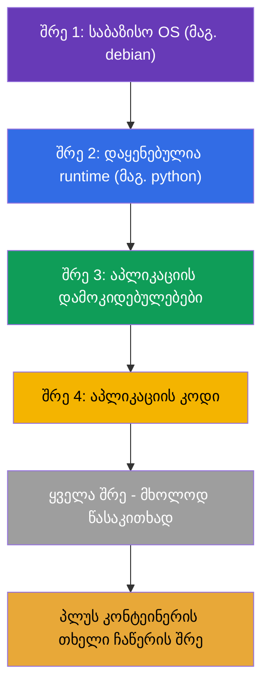
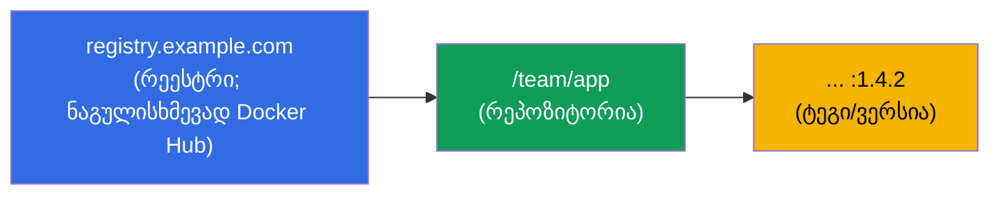
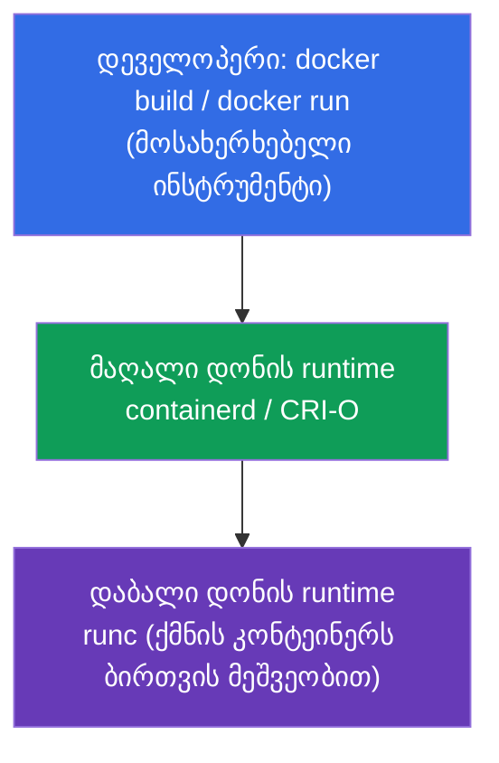
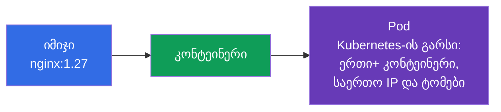

[Русская версия](ru.md) · [Eng version](README.md) · [Versión en español](es.md) · [Version française](fr.md) · [Deutsche Version](de.md)

# თავი 0.4. კონტეინერები და Docker ნულიდან: იმიჯები, შრეები, რეესტრები და runtime

> **ვისთვისაა ეს თავი.** ნულოვანი საფუძვლის ბოლო აგური - და ყველაზე მნიშვნელოვანი:
> Kubernetes აორკესტრირებს სწორედ კონტეინერებს, ხოლო pod არის მათ გარშემო გარსი. თუ
> უკვე თავდაჯერებულად ხსნით, რით განსხვავდება კონტეინერი იმიჯისგან და ვირტუალური
> მანქანისგან, რა არის შრეები და რეესტრი, - შეგიძლიათ მაშინვე პირველ თავზე გადახვიდეთ.
> თუ კონტეინერები ჯერჯერობით ბუნდოვანია - ეს თავი იძლევა ბაზას, რომელსაც ეყრდნობა
> ფაქტობრივად კურსის ყველა დანარჩენი თავი.

## 0.4.1. რა არის კონტეინერი და რა არ არის ის

**კონტეინერი** არის იზოლირებული პროცესი (ან პროცესების ჯგუფი), რომელიც იყენებს
ჰოსტ-სისტემის **საერთო ბირთვს**, მაგრამ ცხოვრობს საკუთარ „ბუშტში“: საკუთარი ფაილები,
საკუთარი ქსელი, საკუთარი ლიმიტები. ეს არ არის „პატარა ვირტუალური მანქანა“ - და
განსხვავება პრინციპულია.



იზოლაციას უზრუნველყოფს Linux-ის ბირთვის შესაძლებლობები: **namespaces** (იზოლირებს იმას,
რასაც პროცესი ხედავს: საკუთარი PID, ქსელი, მონტირების წერტილები) და **cgroups**
(ზღუდავს, რამდენს მოიხმარს პროცესი: CPU, მეხსიერება). არ აურიოთ ეს Linux-namespaces
Kubernetes-ის ნეიმსფეისებთან (თავი 6) - ემთხვევა მხოლოდ სიტყვა. განვიხილოთ ორივე
მექანიზმი დაწვრილებით - მათზე დგას requests/limits და pod-ების მთელი იზოლაცია.

## 0.4.2. როგორ ზღუდავს ბირთვი კონტეინერს: namespaces და cgroups

კონტეინერი არის ჩვეულებრივი პროცესი, მაგრამ ბირთვი მას ორ „აღვირს“ ადებს:



**namespaces** პასუხისმგებელია **იზოლაციაზე** - პროცესი ხედავს მხოლოდ „საკუთარს“.
ძირითადი ტიპები:

| Namespace | რას იზოლირებს |
|-----------|---------------|
| **PID** | პროცესების ხე (კონტეინერის შიგნით საკუთარი PID 1) |
| **NET** | ქსელური ინტერფეისები, IP, პორტები (თავი 0.7) |
| **MNT** | მონტირების წერტილები, ფაილური სისტემა |
| **UTS** | hostname |
| **IPC** | პროცესთაშორისი ურთიერთქმედება |
| **USER** | მომხმარებლების მეპინგი (root კონტეინერში ≠ root ჰოსტზე) |

**cgroups** (control groups) პასუხისმგებელია **ლიმიტებზე** - რამდენი რესურსის მოხმარება
შეუძლია პროცესს. ძირითადი კონტროლერები:

| კონტროლერი | რას ზღუდავს | სად მეპდება Kubernetes-ში |
|------------|------------------|---------------------------|
| **cpu** | CPU-ს წილი/კვოტა | `requests/limits.cpu` (თავი 14) |
| **memory** | მეხსიერების ზღვარი | `limits.memory` → გადაჭარბება = **OOMKilled** (თავი 44) |
| **pids** | პროცესების რაოდენობა | დაცვა fork-ბომბისგან |
| **io** | დისკის გამტარუნარიანობა | შეტანა-გამოტანის თროთლინგი |

პირდაპირი კავშირი კურსთან: როცა 14-ე თავში წერთ `limits: {cpu: 500m, memory: 128Mi}`-ს,
kubelet runtime-ის მეშვეობით ამას კონტეინერის cgroup-ის პარამეტრებში თარგმნის. გადააჭარბა
CPU-კვოტას - პროცესი **მუხრუჭდება** (throttling); გადააჭარბა memory-ლიმიტს - ბირთვი
**კლავს** კონტეინერს `OOMKilled`-ით. ესე იგი requests/limits არ არის „Kubernetes-ის
სურვილები“, არამედ Linux-ის ბირთვის რეალური შეზღუდვები cgroups-ის გავლით.

## 0.4.3. cgroup v1 და v2: მექანიზმის ორი ვერსია

cgroups-ს აქვს ორი ვერსია, და განსხვავება მნიშვნელოვანია კლასტერის კვანძებისთვის:

| | **cgroup v1** | **cgroup v2** |
|--|---------------|---------------|
| იერარქია | ცალკე ყოველ კონტროლერზე (cpu, memory... სხვადასხვაგვარად) | **ერთიანი** უნიფიცირებული იერარქია |
| შეთანხმებულობა | კონტროლერები არაერთგვაროვნად კონფიგურირდება | ერთიანი თანმიმდევრული ინტერფეისი |
| მეხსიერება | საბაზისო კონტროლი | უფრო ზუსტი (MemoryQoS), დატვირთვის აღრიცხვა (PSI) |
| სტატუსი | მემკვიდრეობა, თანდათან ქრება | **თანამედროვე სტანდარტი** |

Kubernetes-ისთვის ეს აბსტრაქცია არ არის:

- **cgroup v2**-ის მხარდაჭერა **სტაბილურია (GA) Kubernetes 1.25-დან**.
- საჭიროა ბირთვი **5.8+**, container runtime v2-ის მხარდაჭერით (containerd 1.4+, CRI-O 1.20+)
  და **systemd** cgroup-დრაივერი.
- შესაძლებლობების ნაწილი (მეხსიერების ზუსტი კონტროლი MemoryQoS, ზეწოლის მეტრიკები PSI) ხელმისაწვდომია
  **მხოლოდ v2-ზე**.

შეამოწმეთ, რომელი ვერსიაა კვანძზე:

```bash
stat -fc %T /sys/fs/cgroup/     # cgroup2fs → v2 ; tmpfs → v1 (ან ჰიბრიდი)
```

## 0.4.4. დისტრიბუტივების რომელი ვერსიიდან არის cgroup v2 ნაგულისხმევად

cgroup v2 ბირთვში ხელმისაწვდომია 4.5-დან (2016), მაგრამ დისტრიბუტივები მას ნაგულისხმევად
მოგვიანებით რთავდნენ. ორიენტირები:

| დისტრიბუტივი | cgroup v2 ნაგულისხმევად ვერსიიდან |
|-------------|--------------------------|
| **Fedora** | 31 (2019) - პირველი მსხვილთა შორის |
| **Ubuntu** | 21.10, ხოლო LTS-ში - **22.04**-დან |
| **Debian** | 11 (Bullseye) |
| **RHEL / CentOS Stream / Rocky / Alma** | **9** (RHEL 8-ში ნაგულისხმევად v1) |
| **Arch, openSUSE Tumbleweed** | 2021+ |

პრაქტიკული დასკვნა: თანამედროვე კვანძებზე (Ubuntu 22.04, Debian 12, RHEL 9), რომლებსაც
კურსის ლაბები იყენებს, - **cgroup v2**. ძველებზე (RHEL 8, Ubuntu 20.04) შეიძლება იყოს v1
ან ჰიბრიდი, რაც ხანდახან ხსნის ლიმიტების ქცევის განსხვავებას.

## 0.4.5. cgroup-დრაივერი: რატომ ამტვრევს ეს კვანძებს

კიდევ ერთი პრაქტიკული მომენტი, რომლის შესახებაც უყვართ კითხვა. cgroups-ის კონფიგურაცია
ორს შეუძლია - თავად **systemd**-ს და „ნედლ“ **cgroupfs**-ს. ამიტომ cgroups-ს აქვს
**დრაივერი**, და კრიტიკულია, რომ **kubelet-მა და container runtime-მა ერთი და იგივე
გამოიყენონ**:



- systemd-ის მქონე სისტემებზე (ყველა თანამედროვე დისტრიბუტივი) რეკომენდებულია დრაივერი
  **systemd** ორივესთვის.
- containerd-ში ეს არის დროშა `SystemdCgroup = true` კონფიგში - სწორედ მას აყენებენ
  კვანძების მომზადებისას (ლაბი 116, თავი 35).
- დრაივერების არასინქრონულობა კლასიკური მიზეზია „კვანძი არასტაბილურია / kubelet ვარდება“
  კლასტერის ხელით ინსტალაციის შემდეგ.

## 0.4.6. cgroups უფრო ღრმად: ხე, CPU-კვოტები და QoS

ზემოთ მოცემულმა სექციებმა ახსნა, *რას* აკეთებს cgroups. ახლა - *როგორ* ზუსტად, რადგან ამაზე
დგას requests/limits და QoS-კლასები (თავები 14, 44), ხოლო გამოცდაზე და ბრძოლაში ეს ხსნის,
რატომ „მუხრუჭდება“ ერთი pod, ხოლო მეორე „მოკლულია“.

### cgroup არის კვანძი ხეში

cgroup არ არის აბსტრაქცია, არამედ კატალოგი სპეციალურ ფაილურ სისტემაში `/sys/fs/cgroup`.
ყოველი კატალოგი არის პროცესების ჯგუფი რესურსების პარამეტრებით; კატალოგები ჩალაგებულია ხეში, და
შეზღუდვები მემკვიდრეობით გადადის ქვევით. kubelet კლასტერის კონტეინერებისთვის აშენებს საკუთარ იერარქიას:



ტოტი `kubepods` იყოფა **QoS-კლასების** მიხედვით (guaranteed/burstable/besteffort), შიგნით -
კატალოგი ყოველ pod-ზე, შიგნით - ყოველ კონტეინერზე. ასე pod-ის ლიმიტი ზღუდავს მისი
კონტეინერების ჯამს, ხოლო QoS-ტოტის ლიმიტი - ქცევას კვანძზე რესურსების უკმარისობის დროს.

### CPU: ორი განსხვავებული ბერკეტი - წონა და კვოტა

მთავარი, რასაც ურევენ: **requests.cpu და limits.cpu არის cgroup-ის ორი განსხვავებული პარამეტრი**.



- **requests.cpu → წონა** (`cpu.weight` v2-ში, `cpu.shares` v1-ში). ეს არ არის ჭერი, არამედ
  პროცესორული დროის *წილი* **კონკურენციის დროს**. თუ CPU თავისუფალია, კონტეინერი იღებს
  მეტს, ვიდრე მისი request.
- **limits.cpu → კვოტა** (`cpu.max` v2-ში: `quota period`; `cpu.cfs_quota_us` v1-ში). ეს
  არის მკაცრი ჭერი პერიოდზე: გადააჭარბა - პროცესს **ამუხრუჭებენ** (CPU throttling), მაგრამ
  **არ კლავენ**. აქედან მოდის ტიპური სიმპტომი „აპლიკაცია ნელია, თუმცა CPU არ არის 100%“ - მას
  კვოტა ჭრის.

### Memory: ლიმიტი კლავს, request - არა

მეხსიერებასთან ლოგიკა სხვაა: მას ვერ „დაამუხრუჭებ“, ამიტომ ლიმიტის გადაჭარბება = სიკვდილი.

- **limits.memory → `memory.max`** (v2) / `memory.limit_in_bytes` (v1). გადააჭარბა - ბირთვი
  იძახებს **OOM-killer**-ს, კონტეინერი იღებს სტატუსს **OOMKilled** (თავი 44).
- **requests.memory** cgroup-ის მკაცრ ლიმიტს არ ქმნის - ის გავლენას ახდენს **დაგეგმვაზე**
  (სად ჩაეტევა pod) და **გამოძევების** (eviction) რიგზე კვანძზე მეხსიერების უკმარისობის დროს.

| რესურსი | requests → | limits → | limits-ის გადაჭარბება |
|--------|-----------|----------|-------------------|
| CPU | წონა (`cpu.weight`/`shares`) | კვოტა (`cpu.max`/`cfs_quota`) | **throttling** (ვამუხრუჭებთ) |
| Memory | დაგეგმვა/eviction | `memory.max`/`limit_in_bytes` | **OOMKilled** (ვკლავთ) |

### QoS-კლასები = ადგილი ხეში

requests/limits-ის კომბინაცია განსაზღვრავს pod-ის **QoS-კლასს**, ხოლო ის - ტოტს cgroup-ის ხეში და
პრიორიტეტს გამოძევებისას:

| QoS | პირობა | კვანძზე მეხსიერების უკმარისობის დროს |
|-----|---------|------------------------------|
| **Guaranteed** | requests == limits ყველა კონტეინერისთვის | ძევებენ ბოლოს |
| **Burstable** | requests < limits (რაღაც ერთი მაინც მითითებულია) | ძევებენ მეორეებს |
| **BestEffort** | არც requests, არც limits არ არის მითითებული | ძევებენ **პირველებს** |

### PSI: რესურსების ზეწოლა (მხოლოდ v2)

cgroup v2 იძლევა **PSI (Pressure Stall Information)**-ს - მეტრიკას იმის შესახებ, რამდენ ხანს
*ელოდნენ* პროცესები CPU-ს, მეხსიერებას ან I/O-ს. ეს უფრო ზუსტია, ვიდრე „დატვირთვა 100%“:
აჩვენებს რეალურ უკმარისობას. PSI-ზე აშენებენ ალერტებს (თავი 28) და ავტოსკეილინგის გადაწყვეტილებებს.

### როგორ ვნახოთ ცოცხლად

```bash
# cgroup-ის ვერსია კვანძზე
stat -fc %T /sys/fs/cgroup/            # cgroup2fs → v2

# კონტეინერის CPU-პარამეტრები (v2): "max 100000" = ლიმიტი 1 CPU; "max" = ლიმიტის გარეშე
cat /sys/fs/cgroup/.../cpu.max
cat /sys/fs/cgroup/.../cpu.weight

# მეხსიერება (v2): მიმდინარე მოხმარება და ლიმიტი
cat /sys/fs/cgroup/.../memory.current
cat /sys/fs/cgroup/.../memory.max

# რამდენჯერ დაამუხრუჭა კვოტამ კონტეინერი (დიაგნოსტიკა "ნელია, მაგრამ CPU არ არის 100%")
cat /sys/fs/cgroup/.../cpu.stat        # უყუროთ nr_throttled / throttled_usec

# რესურსების ზეწოლა (PSI, მხოლოდ v2)
cat /sys/fs/cgroup/.../cpu.pressure
cat /sys/fs/cgroup/.../memory.pressure
```

დასკვნა კურსისთვის: `requests` და `limits` 14-ე თავიდან არის ზუსტად `cpu.weight`/`cpu.max` და
კონკრეტული კონტეინერის `memory.max` cgroup-ის ხეში. განსხვავების გაგება „წონა კვოტის
წინააღმდეგ“ და „throttling OOMKilled-ის წინააღმდეგ“ ხსნის კითხვების დიდ ნაწილს
წარმადობის გამართვისას.

## 0.4.7. იმიჯი კონტეინერის წინააღმდეგ

ორი ცნება, რომლებსაც დამწყებები ყველაზე ხშირად ურევენ:



- **იმიჯი** - უცვლელი შაბლონი: აპლიკაციის ფაილური სისტემა პლუს მეტამონაცემები (რომელი
  ბრძანება გაუშვას, რომელი პორტები, ცვლადები). ეს არის „რეცეპტი“ ან „კლასი“.
- **კონტეინერი** - იმიჯიდან გაშვებული ეგზემპლარი. ერთი იმიჯიდან შეიძლება გაუშვათ
  რამდენიც გინდათ ერთნაირი კონტეინერი. ეს არის „მზა კერძი“ ან „ობიექტი“.

Kubernetes-ში ყოველთვის მიუთითებთ **იმიჯს** (`image: nginx:1.27`), ხოლო კლასტერი მისგან
უშვებს **კონტეინერებს** pod-ების შიგნით.

## 0.4.8. იმიჯის შრეები და რატომ არის ეს მნიშვნელოვანი

იმიჯი აიგება **შრეებისგან (layers)** - ყოველი შრე არის ფაილური სისტემის ცვლილებების
ნაკრები წინაზე ზემოდან. შრეები **ხელახლა გამოიყენება** და ქეშირდება: თუ ორი იმიჯი
ერთი და იმავე საბაზისო შრით იწყება, ის ინახება და ჩამოიტვირთება ერთხელ.



პრაქტიკული შედეგი: იმიჯის შრეები არის **მხოლოდ წასაკითხად**, ხოლო კონტეინერი ამატებს
ზემოდან თხელ **ჩაწერის შრეს**. ამიტომ კონტეინერის შიგნით ჩაწერილი მონაცემები
ქრება მისი ხელახლა შექმნისას - მუდმივი მონაცემებისთვის საჭიროა ტომები (თავები 24-26).
შრეების რიგი Dockerfile-ში გავლენას ახდენს აგების სიჩქარეზე: იშვიათად ცვალებადი - უფრო წინ,
კოდი - ბოლოში (დაწვრილებით 23-ე თავში).

## 0.4.9. Dockerfile: როგორ იბადება იმიჯი

იმიჯს აღწერენ ტექსტური ფაილით **Dockerfile** - ინსტრუქციების სიით. ყოველი ინსტრუქცია
ჩვეულებრივ შრეს წარმოშობს.

```dockerfile
FROM python:3.12-slim        # საბაზისო იმიჯი (შრე-საფუძველი)
WORKDIR /app                 # სამუშაო დირექტორია
COPY requirements.txt .      # ვაკოპირებთ დამოკიდებულებების სიას
RUN pip install -r requirements.txt   # ვაყენებთ დამოკიდებულებებს (შრე)
COPY . .                     # ვაკოპირებთ აპლიკაციის კოდს (შრე)
EXPOSE 8080                  # ვადოკუმენტირებთ პორტს
CMD ["python", "app.py"]     # ნაგულისხმევი გაშვების ბრძანება
```

ძირითადი ინსტრუქციები, რომლებიც უნდა იცნობდეთ:

| ინსტრუქცია | რას აკეთებს |
|------------|------------|
| `FROM` | საბაზისო იმიჯი, რომლითაც იწყება აგება |
| `RUN` | ბრძანების შესრულება აგებისას (ქმნის შრეს) |
| `COPY` / `ADD` | ფაილების დამატება იმიჯში |
| `WORKDIR` | სამუშაო დირექტორია იმიჯის შიგნით |
| `EXPOSE` | პორტის დოკუმენტირება (თავად არ ხსნის მას) |
| `ENV` | გარემოს ცვლადი |
| `CMD` | ნაგულისხმევი ბრძანება კონტეინერის გაშვებისას |
| `ENTRYPOINT` | გაშვების ბრძანების უცვლელი ნაწილი |

კავშირი Kubernetes-თან პირდაპირია: იმიჯის `CMD`/`ENTRYPOINT` არის ის, რაც pod-ის მანიფესტში
გადაიწერება ველებით `command` და `args` (თავი 17), ხოლო `ENV` - ის, რაც ემატება
`env`-ისა და ConfigMap/Secret-ის მეშვეობით (თავები 17-19).

## 0.4.10. რეესტრი: სად ინახება იმიჯები

აგებულ იმიჯს დებენ **რეესტრში (registry)** - იმიჯების საცავში, საიდანაც მათ
ჩამოტვირთავენ კვანძები. იმიჯის სრული სახელი ასე იკითხება:



- თუ რეესტრი არ არის მითითებული - იგულისხმება **Docker Hub**.
- **ტეგი** - იმიჯის ვერსია (`nginx:1.27`). ტეგი `latest` არ არის „სამუდამოდ ყველაზე ახალი
  ვერსია“, არამედ უბრალოდ ნაგულისხმევი ტეგი; პროდში ასე მოქცევა საშიშია, უკეთესია ვერსიის
  ფიქსაცია.
- პრივატული რეესტრები მოითხოვს აუთენტიფიკაციას - Kubernetes-ში მას აყენებენ
  `imagePullSecrets`-ის მეშვეობით (თავები 19, 23).

## 0.4.11. Docker და container runtime: ვინ სინამდვილეში უშვებს კონტეინერებს

Docker-მა კონტეინერები მასობრივი გახადა, მაგრამ მნიშვნელოვანია გავიგოთ როლების გადანაწილება, რადგან
**Kubernetes არ იყენებს Docker-ს პირდაპირ**.



- **Docker** - მოსახერხებელი ინსტრუმენტი ადამიანისთვის: იმიჯის აგება, ლოკალურად გაშვება.
- **containerd / CRI-O** - „ძრავები“ (მაღალი დონის runtime), რომლებიც რეალურად
  მართავენ კონტეინერებს. სწორედ მათთან ურთიერთობს kubelet ინტერფეისის **CRI**-ის მეშვეობით
  (Container Runtime Interface, თავი 40).
- **runc** - დაბალი დონის ინსტრუმენტი, რომელიც ბირთვის საშუალებებით ქმნის კონტეინერს.

ისტორიული დეტალი, რომლის შესახებაც უყვართ კითხვა: ადრე kubelet Docker-ში შუამავალი
`dockershim`-ის გავლით მიდიოდა, მაგრამ ის მოაშორეს. დღეს კლასტერის კვანძები ჩვეულებრივ იყენებენ
**containerd**-ს პირდაპირ. იმიჯები ამის დროს რჩება თავსებადი (სტანდარტი OCI), ამიტომ
`docker build`-ით აგებული იმიჯი მშვენივრად ეშვება კლასტერში containerd-ზე.

## 0.4.12. ხიდი pod-ისკენ (თავი 4)



ჯაჭვი, რომელიც თავში უნდა გეჭიროთ მთელი კურსის განმავლობაში: **იმიჯი → კონტეინერი → pod**.
Kubernetes კონტეინერებს ცალ-ცალკე არ მართავს - მისთვის მინიმალური ერთეული არის
**pod**, გარსი ერთი ან რამდენიმე კონტეინერის გარშემო საერთო IP-ითა და ტომებით.
დაწვრილებით - მე-4 თავში.

## 0.4.13. როგორ გამოიყენება ეს პროდაქშენში

- **პატარა იმიჯები.** რაც უფრო პატარაა იმიჯი, მით უფრო სწრაფია გაშვება და ნაკლებია სისუსტეები.
  იყენებენ slim/alpine-საბაზისოებს და მრავალსაფეხურიან აგებას (თავი 23).
- **ვერსიების ფიქსაცია, არა `latest`.** პროდში ტეგავენ კონკრეტული ვერსიებით - თორემ
  „იგივე რაღაც“ სხვადასხვაგვარად იშლება და არაპროგნოზირებადად იმტვრევა.
- **იმიჯების სკანირება.** იმიჯებს ამოწმებენ სისუსტეებზე დეპლოიმდე; საბაზისო
  იმიჯებს რეგულარულად აახლებენ.
- **საკუთარი რეესტრი.** კომპანიები ინახავენ პრივატულ რეესტრს (Harbor, ECR, GAR): წვდომის
  კონტროლი, ქეში, სკანირება, დამოუკიდებლობა Docker Hub-ის საჯარო ლიმიტებისგან.
- **containerd კვანძებზე.** იმის გაგება, რომ ქვეშ არის containerd + runc (და არა Docker),
  საჭიროა კვანძების troubleshooting-ისთვის: კონტეინერების ლოგებსა და სტატუსს უყურებენ `crictl`-ით, და
  არა `docker`-ით.

## 0.4.14. მინი-ლექსიკონი

- **კონტეინერი** - იზოლირებული პროცესი ჰოსტის საერთო ბირთვზე (namespaces + cgroups).
- **namespaces (Linux)** - იმის იზოლაცია, რასაც პროცესი ხედავს (PID, NET, MNT, UTS, IPC, USER).
- **cgroups** - იმის შეზღუდვა, რამდენს მოიხმარს პროცესი (cpu, memory, pids, io).
- **cgroup v1 / v2** - ძველი (იერარქია კონტროლერზე) / თანამედროვე (ერთიანი იერარქია) ვერსიები; v2 საჭიროა შესაძლებლობების ნაწილისთვის (K8s cgroup v2 GA 1.25-დან).
- **OOMKilled** - კონტეინერი მოკლულია ბირთვის მიერ cgroup-ის memory-ლიმიტის გადაჭარბებისთვის.
- **cgroup-დრაივერი** - ვინ აყენებს cgroups-ს: `systemd` თუ `cgroupfs`; kubelet და runtime უნდა ემთხვეოდეს (`SystemdCgroup=true`).
- **cpu.weight / cpu.shares** - CPU-ს წონა (`requests.cpu`-დან): პროცესორის წილი კონკურენციის დროს, არა ჭერი.
- **cpu.max / cfs_quota** - მკაცრი CPU-კვოტა (`limits.cpu`-დან); გადაჭარბება = **throttling**.
- **CPU throttling** - პროცესის იძულებითი შენელება CPU-კვოტის გადაჭარბებისთვის (არა მოკვლა).
- **memory.max** - cgroup-ის მეხსიერების ზღვარი (`limits.memory`-დან); გადაჭარბება = OOMKilled.
- **kubepods** - kubelet-ის ძირეული cgroup-ტოტი: `kubepods → QoS → pod → კონტეინერი`.
- **QoS-კლასი** - Guaranteed/Burstable/BestEffort; განსაზღვრავს cgroup-ის ტოტს და გამოძევების რიგს.
- **PSI (Pressure Stall Information)** - CPU/მეხსიერების/I/O-ს ლოდინის მეტრიკა (მხოლოდ cgroup v2).
- **იმიჯი (image)** - აპლიკაციის ფაილური სისტემის უცვლელი შაბლონი + მეტამონაცემები.
- **შრე (layer)** - ფს-ის ცვლილებების ნაკრები; შრეები ხელახლა გამოიყენება და ქეშირდება.
- **ჩაწერის შრე** - კონტეინერის თხელი ცვალებადი შრე იმიჯის read-only შრეებზე ზემოდან.
- **Dockerfile** - იმიჯის აგების ტექსტური აღწერა ინსტრუქციებისგან.
- **რეესტრი (registry)** - იმიჯების საცავი (ნაგულისხმევად Docker Hub).
- **ტეგი** - იმიჯის ვერსია; `latest` არის მხოლოდ ნაგულისხმევი ტეგი, არა „ყოველთვის სვეჟი“.
- **OCI** - იმიჯებისა და კონტეინერების ფორმატის ღია სტანდარტი.
- **containerd / CRI-O** - მაღალი დონის runtime-ები, რომლებთანაც მუშაობს kubelet.
- **CRI** - ინტერფეისი kubelet-სა და container runtime-ს შორის (თავი 40).
- **runc** - დაბალი დონის ინსტრუმენტი კონტეინერების ბირთვის მეშვეობით გაშვებისთვის.

## 0.4.15. თავის შეჯამება

- კონტეინერი არის იზოლირებული პროცესი საერთო ბირთვზე (namespaces + cgroups), და არა მინი-VM:
  უფრო მსუბუქი, სწრაფი, ეკონომიური.
- namespaces იზოლირებს (რა ჩანს: PID/NET/MNT/...), cgroups ზღუდავს (რამდენი
  რესურსი: cpu/memory/pids/io); Kubernetes-ის requests/limits არის cgroup-ის რეალური პარამეტრები,
  აქედან CPU-ს throttling და მეხსიერების OOMKilled (თავები 14, 44).
- `requests.cpu` → წონა (`cpu.weight`/`shares`, წილი კონკურენციის დროს), `limits.cpu` → კვოტა
  (`cpu.max`/`cfs_quota`, მკაცრი ჭერი → throttling); `limits.memory` → `memory.max`
  (გადაჭარბება → OOMKilled). kubelet აშენებს ხეს `kubepods → QoS → pod → კონტეინერი`, ხოლო
  QoS-კლასი (Guaranteed/Burstable/BestEffort) აყენებს გამოძევების რიგს.
- cgroup v2 არის ერთიანი იერარქია (თანამედროვე სტანდარტი, K8s GA 1.25-დან, საჭიროა ბირთვი 5.8+);
  ნაგულისხმევად Fedora 31+, Ubuntu 22.04+, Debian 11+, RHEL 9+-ში (RHEL 8-ში - v1); მხოლოდ v2
  იძლევა PSI-ს (რესურსების ზეწოლის მეტრიკას).
- kubelet-ისა და runtime-ის cgroup-დრაივერი უნდა ემთხვეოდეს (systemd, `SystemdCgroup=true`) -
  თორემ კვანძი არასტაბილურია (ლაბი 116, თავი 35).
- იმიჯი არის უცვლელი „რეცეპტი“, კონტეინერი - მისგან გაშვებული ეგზემპლარი; ერთი
  იმიჯიდან უშვებენ ბევრ კონტეინერს.
- იმიჯი შედგება read-only შრეებისგან (ქეშირდება და ხელახლა გამოიყენება); კონტეინერი ამატებს
  ჩაწერის შრეს, რომელიც იკარგება ხელახლა შექმნისას - აქედან მოდის ტომების საჭიროება.
- Dockerfile აღწერს აგებას; `CMD`/`ENV`/`EXPOSE` პირდაპირ შეესაბამება pod-ის ველებს.
- იმიჯები ინახება რეესტრებში; სახელი = რეესტრი/რეპოზიტორია:ტეგი; პროდში ვერსიებს აფიქსირებენ.
- Kubernetes იყენებს არა Docker-ს, არამედ container runtime-ს (ჩვეულებრივ containerd) CRI-ის გავლით;
  იმიჯები თავსებადია სტანდარტ OCI-ის წყალობით.
- კურსის ძირითადი ჯაჭვი: იმიჯი → კონტეინერი → pod.

## 0.4.16. როგორ გამოგადგებათ: გამოცდაზე და რეალურ სამუშაოში

**გამოცდაზე.** კონტეინერები არის ყველაფრის საფუძველი: pod (თავი 4), `command`/`args`
(თავი 17), იმიჯები და Dockerfile (თავი 23), CRI (თავი 40), კვანძების troubleshooting
`crictl`-ით (თავი 45). „იმიჯი ≠ კონტეინერი“-ს და შრეების გაგება საჭიროა, რომ არ აირიოთ
CKAD-ის ყოველ მეორე ამოცანაში.

**რეალურ სამუშაოში.** კომპაქტური უსაფრთხო იმიჯების აგება, რეესტრებთან მუშაობა,
ვერსიების ფიქსაცია, კვანძებზე კონტეინერების დიაგნოსტიკა containerd/`crictl`-ის მეშვეობით -
ყოველდღიური ამოცანებია. კონტეინერების ბაზა გამოყოფს მათ, ვინც „მანიფესტებს კოპიპასტავს“, მათგან,
ვინც ესმის, რა ხდება.

## 0.4.17. თვითშემოწმების კითხვები

1. რით განსხვავდება კონტეინერი პრინციპულად ვირტუალური მანქანისგან? რა უზრუნველყოფს
   იზოლაციას?
2. რით არიან დაკავებული namespaces და რით cgroups? როგორ არის Kubernetes-ის requests/limits დაკავშირებული
   cgroups-თან და რა არის OOMKilled?
3. რით განსხვავდება cgroup v2 v1-სგან და დისტრიბუტივების რომელი ვერსიებიდან მიდის v2 ნაგულისხმევად?
4. როგორ აისახება `requests.cpu` და `limits.cpu` cgroup-ში და რაშია განსხვავება „წონასა“ და
   „კვოტას“ შორის? რატომ ამუხრუჭებენ კონტეინერს CPU-ლიმიტის გადაჭარბებისას, ხოლო memory-ლიმიტის
   გადაჭარბებისას - კლავენ?
5. როგორ არის აწყობილი cgroup-ის ხე, რომელსაც kubelet აშენებს (kubepods → QoS → pod → კონტეინერი),
   და როგორ არის QoS-კლასი დაკავშირებული pod-ების გამოძევების რიგთან?
6. რა არის cgroup-დრაივერი და რატომ ამტვრევს კვანძს მისი არასინქრონულობა kubelet-სა და runtime-ს შორის?
7. რაშია განსხვავება იმიჯსა და კონტეინერს შორის? რამდენი კონტეინერის გაშვება შეიძლება
   ერთი იმიჯიდან?
8. რა არის იმიჯის შრეები და რატომ ვერ გადაიტანს კონტეინერის შიგნით მონაცემები ხელახლა შექმნას?
9. როგორ იკითხება იმიჯის სრული სახელი და რატომ არის `latest` საშიში პროდში?
10. იყენებს თუ არა Kubernetes Docker-ს კონტეინერების გაშვებისთვის? რას იყენებს ის და რომელი
   ინტერფეისის გავლით?
11. როგორ არიან დაკავშირებული იმიჯი, კონტეინერი და pod?

## პრაქტიკა

კონტეინერები არის ბოლო „ინფრასტრუქტურული“ აგური. შემდეგ ნაწილ 0-ში - სამი პრაქტიკული
უნარი, რომელთა გარეშე ლაბები ვერ მიდის: კვანძთან მუშაობა Linux-ში (0.5), YAML (0.6) და Linux-ის ქსელი
ქვეშ (0.7). შემდეგ - ძირითადი კურსი პირველი თავიდან.

---
[სარჩევი](../README_GE.md) · [თავი 0.3](../00-3-tls/ge.md) · [თავი 0.5](../00-5-linux/ge.md)
