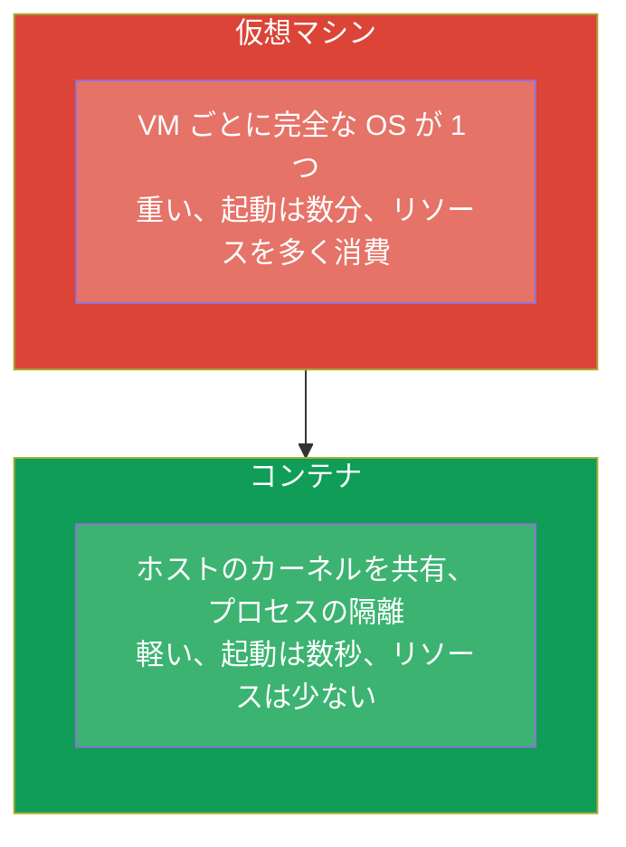
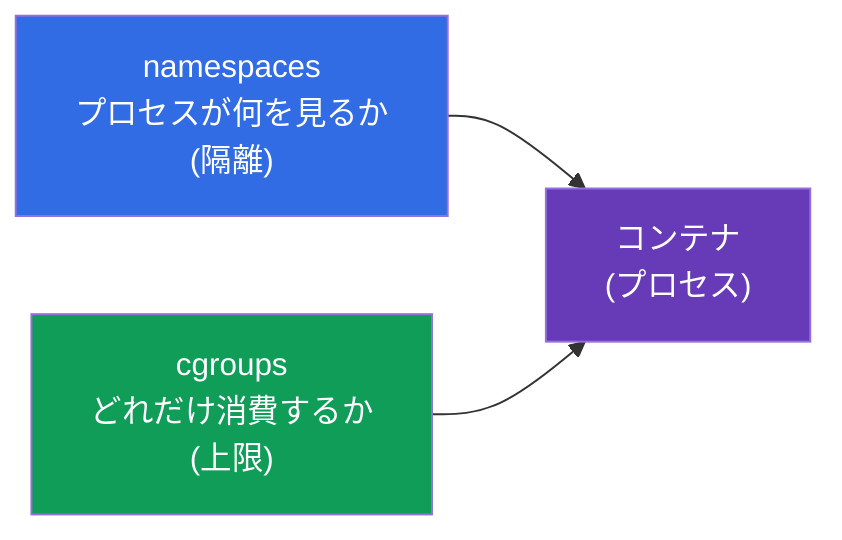
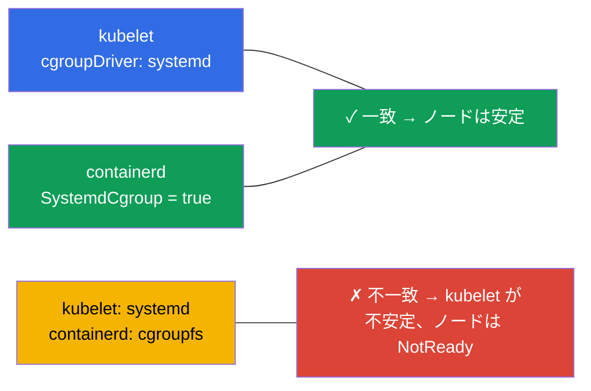
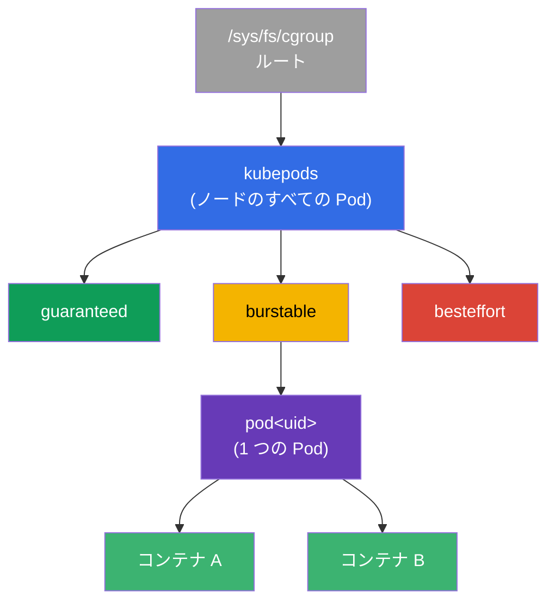
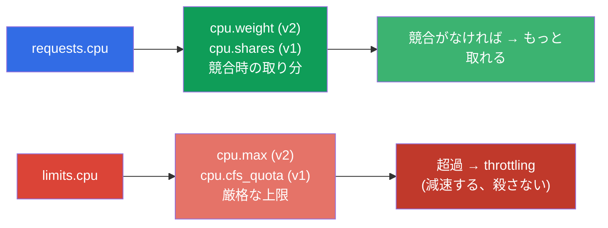
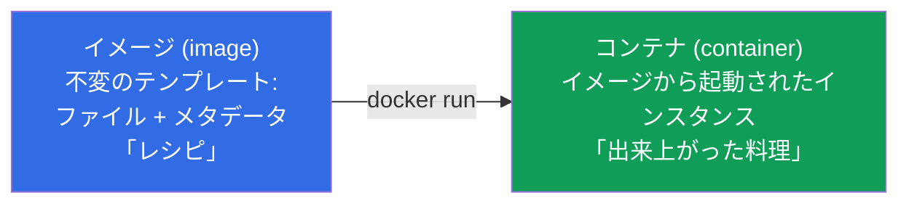
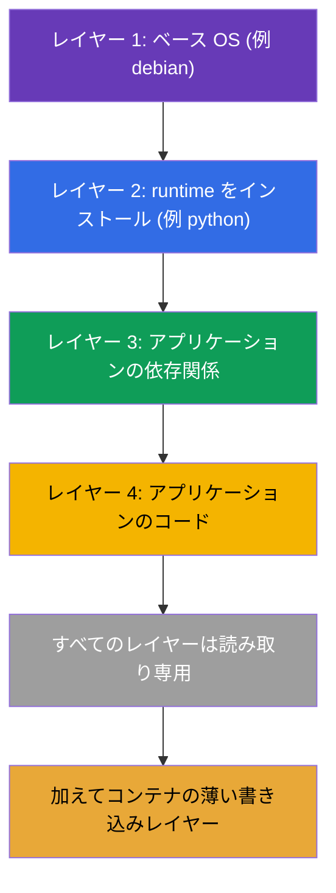
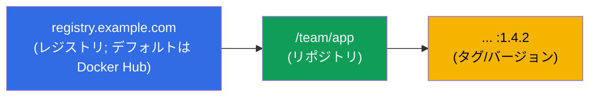
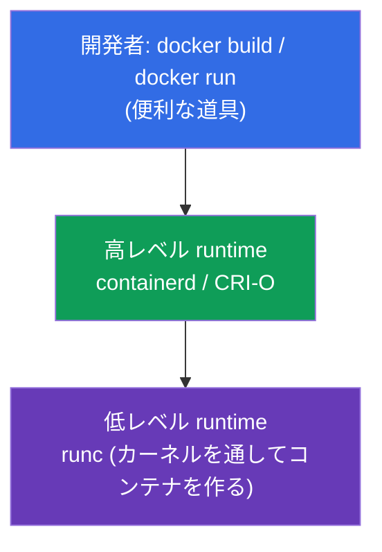
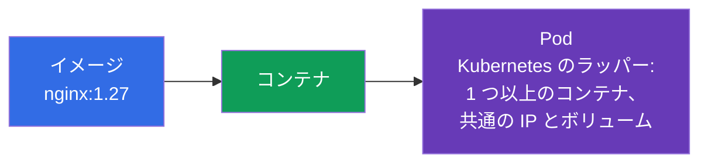

[Русская версия](ru.md) · [Eng version](README.md) · [Versión en español](es.md) · [Version française](fr.md) · [Deutsche Version](de.md) · [ქართული ვერსია](ge.md) · [繁體中文版](tw.md)

# 第 0.4 章。ゼロから学ぶコンテナと Docker：イメージ、レイヤー、レジストリ、runtime

> **この章は誰のためか。** ゼロ番目の土台の最後のレンガ - そしてもっとも重要な
> ものです：Kubernetes がオーケストレーションするのはまさにコンテナであり、Pod は
> その周りのラッパーです。コンテナがイメージや仮想マシンとどう違うのか、レイヤーと
> レジストリとは何かを、すでに自信をもって説明できるなら、そのまま第 1 章へ進んで
> かまいません。コンテナがまだぼんやりしているなら - この章が土台を与えます。
> コースの残りのほぼすべての章が、文字どおりその土台の上に立っています。

## 0.4.1. コンテナとは何か、そして何ではないのか

**コンテナ** とは、ホストシステムの **共通のカーネル** を使いながら、自分だけの
「泡」の中で生きる隔離されたプロセス（またはプロセスのグループ）です：自分の
ファイル、自分のネットワーク、自分の上限。これは「小さな仮想マシン」ではありません -
そしてこの違いは本質的です。



隔離を提供するのは Linux カーネルの機能です：**namespaces**（プロセスが何を見るかを
隔離します：自分の PID、ネットワーク、マウントポイント）と **cgroups**（プロセスが
どれだけ消費するかを制限します：CPU、メモリ）。この Linux の namespaces を
Kubernetes の Namespace（第 6 章）と混同しないでください - 一致するのは単語だけです。
両方の仕組みをもっと詳しく見ていきましょう - requests/limits と Pod の隔離の
すべてが、この上に立っています。

## 0.4.2. カーネルはどうやってコンテナを制限するか：namespaces と cgroups

コンテナは普通のプロセスですが、カーネルはそれに 2 つの「口輪」を付けます：



**namespaces** が担うのは **隔離** です - プロセスは「自分のもの」だけを見ます。
主な種類：

| Namespace | 何を隔離するか |
|-----------|---------------|
| **PID** | プロセスツリー（コンテナの内部には自分の PID 1 がある） |
| **NET** | ネットワークインターフェース、IP、ポート（第 0.7 章） |
| **MNT** | マウントポイント、ファイルシステム |
| **UTS** | hostname |
| **IPC** | プロセス間通信 |
| **USER** | ユーザーのマッピング（コンテナ内の root ≠ ホストの root） |

**cgroups** (control groups) が担うのは **上限** です - プロセスがどれだけの
リソースを消費できるか。主要なコントローラー：

| コントローラー | 何を制限するか | Kubernetes でのマッピング先 |
|------------|------------------|---------------------------|
| **cpu** | CPU の割合/クォータ | `requests/limits.cpu`（第 14 章） |
| **memory** | メモリの上限 | `limits.memory` → 超過 = **OOMKilled**（第 44 章） |
| **pids** | プロセス数 | fork 爆弾からの保護 |
| **io** | ディスクの帯域 | 入出力のスロットリング |

コースとの直接のつながり：第 14 章で `limits: {cpu: 500m, memory: 128Mi}` と書くとき、
kubelet は runtime を通してそれをコンテナの cgroup の設定に変換します。CPU クォータを
超えたら - プロセスは **減速されます**（throttling）；memory の上限を超えたら -
カーネルはコンテナを `OOMKilled` で **殺します**。つまり requests/limits は
「Kubernetes へのお願い」ではなく、cgroups を通した Linux カーネルの実際の制限です。

## 0.4.3. cgroup v1 と v2：仕組みの 2 つのバージョン

cgroups には 2 つのバージョンがあり、その違いはクラスタのノードにとって重要です：

| | **cgroup v1** | **cgroup v2** |
|--|---------------|---------------|
| 階層 | コントローラーごとに別々（cpu、memory... それぞれ違う） | **単一** の統一された階層 |
| 一貫性 | コントローラーの設定がバラバラ | 統一された一貫したインターフェース |
| メモリ | 基本的な制御 | より正確（MemoryQoS）、負荷の計測（PSI） |
| ステータス | レガシー、徐々に消えていく | **現代の標準** |

Kubernetes にとってこれは抽象論ではありません：

- **cgroup v2 のサポートは Kubernetes 1.25 から安定版 (GA)** です。
- カーネル **5.8 以降**、v2 をサポートする container runtime（containerd 1.4 以降、
  CRI-O 1.20 以降）、そして **systemd** cgroup ドライバーが必要です。
- 一部の機能（きめ細かいメモリ制御 MemoryQoS、圧力メトリクス PSI）は
  **v2 でのみ** 利用できます。

ノードのバージョンを確認する方法：

```bash
stat -fc %T /sys/fs/cgroup/     # cgroup2fs → v2 ; tmpfs → v1 (またはハイブリッド)
```

## 0.4.4. ディストリビューションのどのバージョンから cgroup v2 がデフォルトか

cgroup v2 はカーネル 4.5 (2016) から利用できますが、ディストリビューションが
デフォルトで有効にしたのはもっと後です。目安：

| ディストリビューション | cgroup v2 がデフォルトになったバージョン |
|-------------|--------------------------|
| **Fedora** | 31 (2019) - 大手の中で最初 |
| **Ubuntu** | 21.10、LTS では **22.04** から |
| **Debian** | 11 (Bullseye) |
| **RHEL / CentOS Stream / Rocky / Alma** | **9**（RHEL 8 ではデフォルトは v1） |
| **Arch, openSUSE Tumbleweed** | 2021 年以降 |

実践的な結論：コースのラボが使う現代のノード（Ubuntu 22.04、Debian 12、RHEL 9）では -
**cgroup v2** です。古いもの（RHEL 8、Ubuntu 20.04）では v1 やハイブリッドの
ことがあり、それが limits の挙動の違いを説明する場合もあります。

## 0.4.5. cgroup ドライバー：なぜこれがノードを壊すのか

もう 1 つ、よく質問される実践的なポイントです。cgroups を設定できるのは 2 者 -
**systemd** 自身と「生の」**cgroupfs** です。そのため cgroups には **ドライバー** が
あり、**kubelet と container runtime が同じものを使う** ことが決定的に重要です：



- systemd のあるシステム（現代のすべてのディストリビューション）では、両方に
  **systemd** ドライバーが推奨されます。
- containerd ではこれは設定ファイルの `SystemdCgroup = true` フラグです - ノードの
  準備のときにまさにこれを設定します（ラボ 116、第 35 章）。
- ドライバーの不一致は、手動でクラスタをインストールしたあとの
  「ノードが不安定 / kubelet が落ちる」の古典的な原因です。

## 0.4.6. cgroups をさらに深く：ツリー、CPU クォータ、QoS

上の節では cgroups が *何を* するのかを説明しました。次は *どうやって* です。なぜなら
その上に requests/limits と QoS クラス（第 14、44 章）が立っており、試験でも実戦でも、
ある Pod が「遅い」のに別の Pod が「殺される」理由を説明してくれるからです。

### cgroup はツリー上のノード

cgroup は抽象概念ではなく、特別なファイルシステム `/sys/fs/cgroup` の中のディレクトリ
です。それぞれのディレクトリがリソース設定を持つプロセスのグループで、ディレクトリは
ツリー状に入れ子になり、制限は下へ継承されます。kubelet はクラスタのコンテナのために
自分の階層を作ります：



`kubepods` の枝は **QoS クラス**（guaranteed/burstable/besteffort）で分かれ、その中に
Pod ごとのディレクトリ、その中にコンテナごとのディレクトリがあります。こうして Pod の
上限がその配下のコンテナの合計を制限し、QoS の枝の上限がノードのリソース不足時の
挙動を決めます。

### CPU：2 つの異なるレバー - 重みとクォータ

いちばん混同されるのはここです：**requests.cpu と limits.cpu は 2 つの異なる cgroup の
設定です**。



- **requests.cpu → 重み** (v2 では `cpu.weight`、v1 では `cpu.shares`)。これは上限では
  なく、**競合しているとき** のプロセッサ時間の *取り分* です。CPU が空いていれば、
  コンテナは自分の request より多く取ります。
- **limits.cpu → クォータ** (v2 では `cpu.max`：`quota period`；v1 では
  `cpu.cfs_quota_us`)。これは期間あたりの厳格な上限です：超えたらプロセスは
  **減速されます** (CPU throttling) が、**殺されません**。ここから
  「CPU は 100% ではないのにアプリケーションが遅い」という典型的な症状が生まれます -
  クォータに削られているのです。

### Memory：limit は殺し、request は殺さない

メモリでは論理が違います：メモリは「減速」できないので、上限の超過 = 死です。

- **limits.memory → `memory.max`** (v2) / `memory.limit_in_bytes` (v1)。超えたら
  カーネルは **OOM-killer** を呼び、コンテナは **OOMKilled** というステータスに
  なります（第 44 章）。
- **requests.memory** は cgroup の厳格な上限を作りません - **スケジューリング**
  （どこに Pod が収まるか）と、ノードのメモリ不足時の **退避** (eviction) の
  順序に影響します。

| リソース | requests → | limits → | limits の超過 |
|--------|-----------|----------|-------------------|
| CPU | 重み (`cpu.weight`/`shares`) | クォータ (`cpu.max`/`cfs_quota`) | **throttling**（減速する） |
| Memory | スケジューリング/eviction | `memory.max`/`limit_in_bytes` | **OOMKilled**（殺す） |

### QoS クラス = ツリー上の場所

requests/limits の組み合わせが Pod の **QoS クラス** を決め、それが cgroup ツリーの
枝と退避時の優先度を決めます：

| QoS | 条件 | ノードのメモリ不足時 |
|-----|---------|------------------------------|
| **Guaranteed** | すべてのコンテナで requests == limits | 最後に退避される |
| **Burstable** | requests < limits（何かしら指定されている） | 2 番目に退避される |
| **BestEffort** | requests も limits も指定されていない | **最初に** 退避される |

### PSI：リソースの圧力（v2 のみ）

cgroup v2 は **PSI (Pressure Stall Information)** を提供します - プロセスが CPU、
メモリ、I/O をどれだけ *待たされたか* のメトリクスです。これは「使用率 100%」より
正確で、実際の不足を示します。PSI を使ってアラート（第 28 章）やオートスケーリングの
判断を組み立てます。

### 実際に見てみる方法

```bash
# ノードの cgroup バージョン
stat -fc %T /sys/fs/cgroup/            # cgroup2fs → v2

# コンテナの CPU 設定 (v2): "max 100000" = 上限 1 CPU; "max" = 上限なし
cat /sys/fs/cgroup/.../cpu.max
cat /sys/fs/cgroup/.../cpu.weight

# メモリ (v2): 現在の消費量と上限
cat /sys/fs/cgroup/.../memory.current
cat /sys/fs/cgroup/.../memory.max

# コンテナがクォータで何回減速されたか ("遅いのに CPU は 100% でない" の診断)
cat /sys/fs/cgroup/.../cpu.stat        # nr_throttled / throttled_usec を見る

# リソースの圧力 (PSI, v2 のみ)
cat /sys/fs/cgroup/.../cpu.pressure
cat /sys/fs/cgroup/.../memory.pressure
```

コースとしての結論：第 14 章の `requests` と `limits` は、cgroup ツリー上の具体的な
コンテナの `cpu.weight`/`cpu.max` と `memory.max` にちょうど対応します。「重み対
クォータ」と「throttling 対 OOMKilled」の違いを理解すれば、パフォーマンスの
デバッグ時の疑問の大部分が解消します。

## 0.4.7. イメージ対コンテナ

初心者がもっとも頻繁に混同する 2 つの概念です：



- **イメージ** - 不変のテンプレート：アプリケーションのファイルシステムとメタデータ
  （どのコマンドを起動するか、どのポート、どの変数）。これは「レシピ」または
  「クラス」です。
- **コンテナ** - イメージから起動されたインスタンス。1 つのイメージから同じコンテナを
  いくつでも起動できます。これは「出来上がった料理」または「オブジェクト」です。

Kubernetes では常に **イメージ** を指定し (`image: nginx:1.27`)、クラスタが
そこから Pod の中に **コンテナ** を起動します。

## 0.4.8. イメージのレイヤーと、それが重要な理由

イメージは **レイヤー (layers)** から組み立てられます - 各レイヤーは、前のレイヤーの
上に重ねられたファイルシステムの変更の集合です。レイヤーは **再利用** され、
キャッシュされます：2 つのイメージが同じベースレイヤーから始まっていれば、それは
1 回だけ保存され 1 回だけダウンロードされます。



実践的な帰結：イメージのレイヤーは **読み取り専用** で、コンテナはその上に薄い
**書き込みレイヤー** を追加します。だからコンテナの内部に書き込まれたデータは、
再作成のときに消えます - 永続データにはボリュームが必要です（第 24-26 章）。
Dockerfile でのレイヤーの順序はビルドの速さに影響します：めったに変わらないものを
先に、コードを最後に（詳しくは第 23 章）。

## 0.4.9. Dockerfile：イメージはどう生まれるか

イメージは **Dockerfile** というテキストファイル - 命令のリスト - で記述します。
ふつう 1 つの命令が 1 つのレイヤーを生みます。

```dockerfile
FROM python:3.12-slim        # ベースイメージ (土台となるレイヤー)
WORKDIR /app                 # 作業ディレクトリ
COPY requirements.txt .      # 依存関係のリストをコピー
RUN pip install -r requirements.txt   # 依存関係をインストール (レイヤー)
COPY . .                     # アプリケーションのコードをコピー (レイヤー)
EXPOSE 8080                  # ポートを文書化する
CMD ["python", "app.py"]     # デフォルトの起動コマンド
```

見て分かるようになっておくべき主要な命令：

| 命令 | 何をするか |
|------------|------------|
| `FROM` | ビルドの出発点となるベースイメージ |
| `RUN` | ビルド時にコマンドを実行する（レイヤーを作る） |
| `COPY` / `ADD` | ファイルをイメージに追加する |
| `WORKDIR` | イメージ内の作業ディレクトリ |
| `EXPOSE` | ポートを文書化する（自分でポートを開くわけではない） |
| `ENV` | 環境変数 |
| `CMD` | コンテナ起動時のデフォルトコマンド |
| `ENTRYPOINT` | 起動コマンドの変わらない部分 |

Kubernetes とのつながりは直接的です：イメージの `CMD`/`ENTRYPOINT` は、Pod の
マニフェストで `command` と `args` フィールドによって上書きされるもの（第 17 章）で、
`ENV` は `env` と ConfigMap/Secret によって補われるもの（第 17-19 章）です。

## 0.4.10. レジストリ：イメージはどこに保存されるか

ビルドしたイメージは **レジストリ (registry)** - ノードがイメージをダウンロードして
くる保管庫 - に置きます。イメージの完全な名前はこう読みます：



- レジストリを指定しない場合 - **Docker Hub** が想定されます。
- **タグ** はイメージのバージョンです (`nginx:1.27`)。`latest` タグは
  「永遠にいちばん新しいバージョン」ではなく、単なるデフォルトのタグです。本番で
  そうするのは危険で、バージョンを固定するほうがよいです。
- プライベートなレジストリは認証を要求します - Kubernetes では
  `imagePullSecrets` で指定します（第 19、23 章）。

## 0.4.11. Docker と container runtime：実際にコンテナを起動しているのは誰か

Docker はコンテナを大衆的なものにしましたが、役割の分担を理解しておくことが重要です。
なぜなら **Kubernetes は Docker を直接は使わない** からです。



- **Docker** - 人間にとって便利な道具です：イメージをビルドし、ローカルで起動する。
- **containerd / CRI-O** - 実際にコンテナを管理する「エンジン」（高レベル runtime）
  です。kubelet が **CRI** (Container Runtime Interface、第 40 章) というインター
  フェースを通して話しかけるのは、まさにこれらです。
- **runc** - カーネルの機能でコンテナを作る低レベルの道具です。

よく質問される歴史的な細部：以前は kubelet は `dockershim` という中間層を通して
Docker に話しかけていましたが、それは削除されました。今日のクラスタのノードは
ふつう **containerd** を直接使います。そのときイメージには互換性が保たれるので
(OCI 標準)、`docker build` でビルドしたイメージは containerd のクラスタでも
問題なく起動します。

## 0.4.12. Pod への橋渡し（第 4 章）



コースの全体を通して頭に入れておくべき連鎖：**イメージ → コンテナ → Pod**。
Kubernetes はコンテナを 1 つずつ管理するわけではありません - Kubernetes にとっての
最小単位は **Pod**、つまり共通の IP とボリュームを持つ 1 つまたは複数のコンテナの
ラッパーです。詳しくは第 4 章で。

## 0.4.13. 本番環境でこれをどう使うか

- **小さいイメージ。** イメージが小さいほど、ロールアウトは速く、脆弱性は少なく
  なります。slim/alpine ベースとマルチステージビルドを使います（第 23 章）。
- **`latest` ではなくバージョンの固定。** 本番では具体的なバージョンでタグを付け
  ます - さもないと「同じもの」が違うようにデプロイされ、予測できない形で壊れます。
- **イメージのスキャン。** デプロイの前にイメージの脆弱性を検査し、ベースイメージは
  定期的に更新します。
- **自社のレジストリ。** 企業はプライベートなレジストリ (Harbor、ECR、GAR) を
  持ちます：アクセス制御、キャッシュ、スキャン、Docker Hub の公開レート制限からの
  独立です。
- **ノードでの containerd。** 内部は（Docker ではなく）containerd + runc だと理解して
  おくことは、ノードの troubleshooting に必要です：コンテナのログとステータスは
  `docker` ではなく `crictl` で見ます。

## 0.4.14. ミニ用語集

- **コンテナ** - ホストの共通カーネル上の隔離されたプロセス (namespaces + cgroups)。
- **namespaces (Linux)** - プロセスが何を見るかの隔離 (PID, NET, MNT, UTS, IPC, USER)。
- **cgroups** - プロセスがどれだけ消費するかの制限 (cpu, memory, pids, io)。
- **cgroup v1 / v2** - 古い（コントローラーごとの階層）/ 現代の（単一の階層）バージョン。一部の機能には v2 が必要 (K8s の cgroup v2 は 1.25 から GA)。
- **OOMKilled** - cgroup の memory 上限を超えてカーネルに殺されたコンテナ。
- **cgroup ドライバー** - 誰が cgroups を設定するか：`systemd` か `cgroupfs`。kubelet と runtime は一致しなければなりません (`SystemdCgroup=true`)。
- **cpu.weight / cpu.shares** - CPU の重み (`requests.cpu` から)：競合時のプロセッサの取り分で、上限ではありません。
- **cpu.max / cfs_quota** - 厳格な CPU クォータ (`limits.cpu` から)；超過 = **throttling**。
- **CPU throttling** - CPU クォータの超過による強制的なプロセスの減速（殺すことではない）。
- **memory.max** - cgroup のメモリ上限 (`limits.memory` から)；超過 = OOMKilled。
- **kubepods** - kubelet の cgroup のルートの枝：`kubepods → QoS → pod → コンテナ`。
- **QoS クラス** - Guaranteed/Burstable/BestEffort；cgroup の枝と退避の順序を決めます。
- **PSI (Pressure Stall Information)** - CPU/メモリ/I/O の待ちのメトリクス (cgroup v2 のみ)。
- **イメージ (image)** - アプリケーションのファイルシステムの不変のテンプレート + メタデータ。
- **レイヤー (layer)** - ファイルシステムの変更の集合；レイヤーは再利用されキャッシュされます。
- **書き込みレイヤー** - イメージの読み取り専用レイヤーの上に載るコンテナの薄い可変レイヤー。
- **Dockerfile** - 命令によるイメージのビルドのテキストによる記述。
- **レジストリ (registry)** - イメージの保管庫（デフォルトは Docker Hub）。
- **タグ** - イメージのバージョン；`latest` は単なるデフォルトのタグで、「常に最新」ではありません。
- **OCI** - イメージとコンテナのフォーマットの公開標準。
- **containerd / CRI-O** - kubelet が相手にする高レベル runtime。
- **CRI** - kubelet と container runtime の間のインターフェース（第 40 章）。
- **runc** - カーネルを通してコンテナを起動する低レベルの道具。

## 0.4.15. 本章のまとめ

- コンテナはミニ VM ではなく、共通のカーネル上の隔離されたプロセス
  (namespaces + cgroups) です：より軽く、より速く、より経済的です。
- namespaces は隔離し（何が見えるか：PID/NET/MNT/...）、cgroups は制限します
  （どれだけのリソースか：cpu/memory/pids/io）。Kubernetes の requests/limits は
  実際の cgroup の設定であり、そこから CPU の throttling とメモリの OOMKilled が
  生まれます（第 14、44 章）。
- `requests.cpu` → 重み (`cpu.weight`/`shares`、競合時の取り分)、`limits.cpu` →
  クォータ (`cpu.max`/`cfs_quota`、厳格な上限 → throttling)；`limits.memory` →
  `memory.max`（超過 → OOMKilled）。kubelet は
  `kubepods → QoS → Pod → コンテナ` というツリーを作り、QoS クラス
  (Guaranteed/Burstable/BestEffort) が退避の順序を決めます。
- cgroup v2 は単一の階層（現代の標準、K8s では 1.25 から GA、カーネル 5.8 以降が
  必要）です；デフォルトになっているのは Fedora 31 以降、Ubuntu 22.04 以降、
  Debian 11 以降、RHEL 9 以降（RHEL 8 では v1）；v2 だけが PSI
  （リソースの圧力のメトリクス）を提供します。
- kubelet と runtime の cgroup ドライバーは一致しなければなりません
  (systemd、`SystemdCgroup=true`) - さもないとノードは不安定になります
  （ラボ 116、第 35 章）。
- イメージは不変の「レシピ」、コンテナはそこから起動されたインスタンスです。1 つの
  イメージから多数のコンテナを起動します。
- イメージは読み取り専用のレイヤーからなります（キャッシュされ再利用されます）；
  コンテナは書き込みレイヤーを追加し、それは再作成で失われます - だからボリュームが
  必要になります。
- Dockerfile はビルドを記述します；`CMD`/`ENV`/`EXPOSE` は Pod のフィールドに
  直接対応します。
- イメージはレジストリに保存されます；名前 = レジストリ/リポジトリ:タグ；本番では
  バージョンを固定します。
- Kubernetes は Docker ではなく container runtime（ふつう containerd）を CRI 経由で
  使います；イメージは OCI 標準のおかげで互換です。
- コースの鍵となる連鎖：イメージ → コンテナ → Pod。

## 0.4.16. これがどう役に立つか：試験と実際の仕事で

**試験では。** コンテナはすべての土台です：Pod（第 4 章）、`command`/`args`
（第 17 章）、イメージと Dockerfile（第 23 章）、CRI（第 40 章）、`crictl` による
ノードの troubleshooting（第 45 章）。「イメージ ≠ コンテナ」とレイヤーの理解は、
CKAD の 2 問に 1 問で迷わないために必要です。

**実際の仕事では。** コンパクトで安全なイメージのビルド、レジストリの扱い、
バージョンの固定、containerd/`crictl` によるノード上のコンテナの診断 - これらは
日常業務です。コンテナの基礎は「マニフェストをコピペする人」と、何が起きているか
理解している人を分けます。

## 0.4.17. 自己チェックの質問

1. コンテナは仮想マシンと本質的にどう違いますか？隔離を提供しているのは何ですか？
2. namespaces は何をし、cgroups は何をしますか？Kubernetes の requests/limits は
   cgroups とどう関係し、OOMKilled とは何ですか？
3. cgroup v2 は v1 とどう違い、どのディストリビューションのどのバージョンから v2 が
   デフォルトですか？
4. `requests.cpu` と `limits.cpu` は cgroup にどうマッピングされ、「重み」と
   「クォータ」の違いは何ですか？なぜ CPU の上限を超えるとコンテナは減速され、
   memory の上限を超えると殺されるのですか？
5. kubelet が作る cgroup のツリー (kubepods → QoS → Pod → コンテナ) はどうなって
   いて、QoS クラスは Pod の退避の順序とどう関係しますか？
6. cgroup ドライバーとは何で、なぜ kubelet と runtime の間の不一致がノードを
   壊すのですか？
7. イメージとコンテナの違いは何ですか？1 つのイメージからいくつのコンテナを
   起動できますか？
8. イメージのレイヤーとは何で、なぜコンテナ内部のデータは再作成を生き延びないの
   ですか？
9. イメージの完全な名前はどう読み、なぜ本番で `latest` は危険なのですか？
10. Kubernetes はコンテナの起動に Docker を使いますか？何を、どのインターフェースを
   通して使いますか？
11. イメージ、コンテナ、Pod はどう関係しますか？

## 演習

コンテナは最後の「インフラ」のレンガです。パート 0 の次は - ラボで足を取られない
ために欠かせない 3 つの実践スキル：Linux でのノードの扱い (0.5)、YAML (0.6)、
そして内側から見た Linux のネットワーク (0.7)。そのあとは第 1 章から本編です。

---
[目次](../README_JP.md) · [第 0.3 章](../00-3-tls/jp.md) · [第 0.5 章](../00-5-linux/jp.md)
