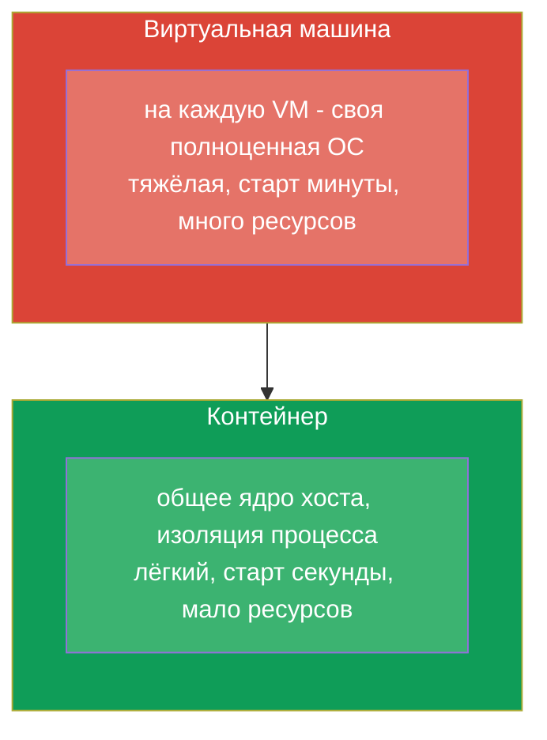
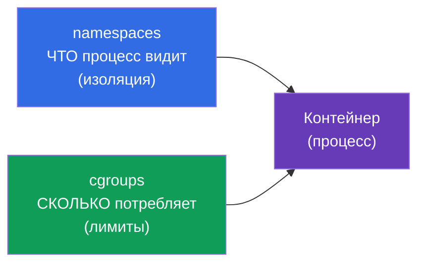
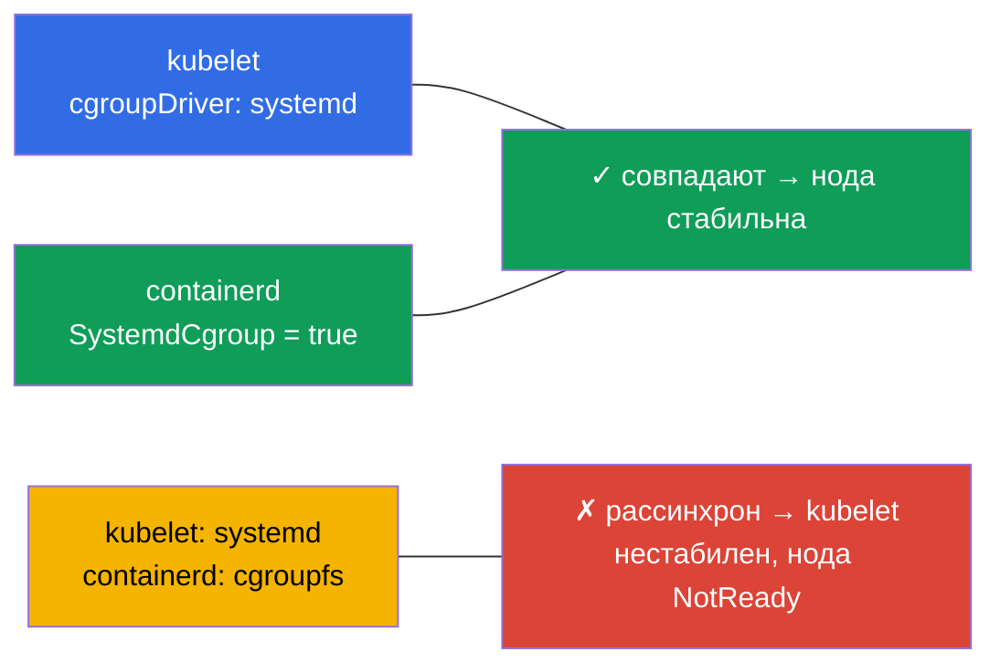
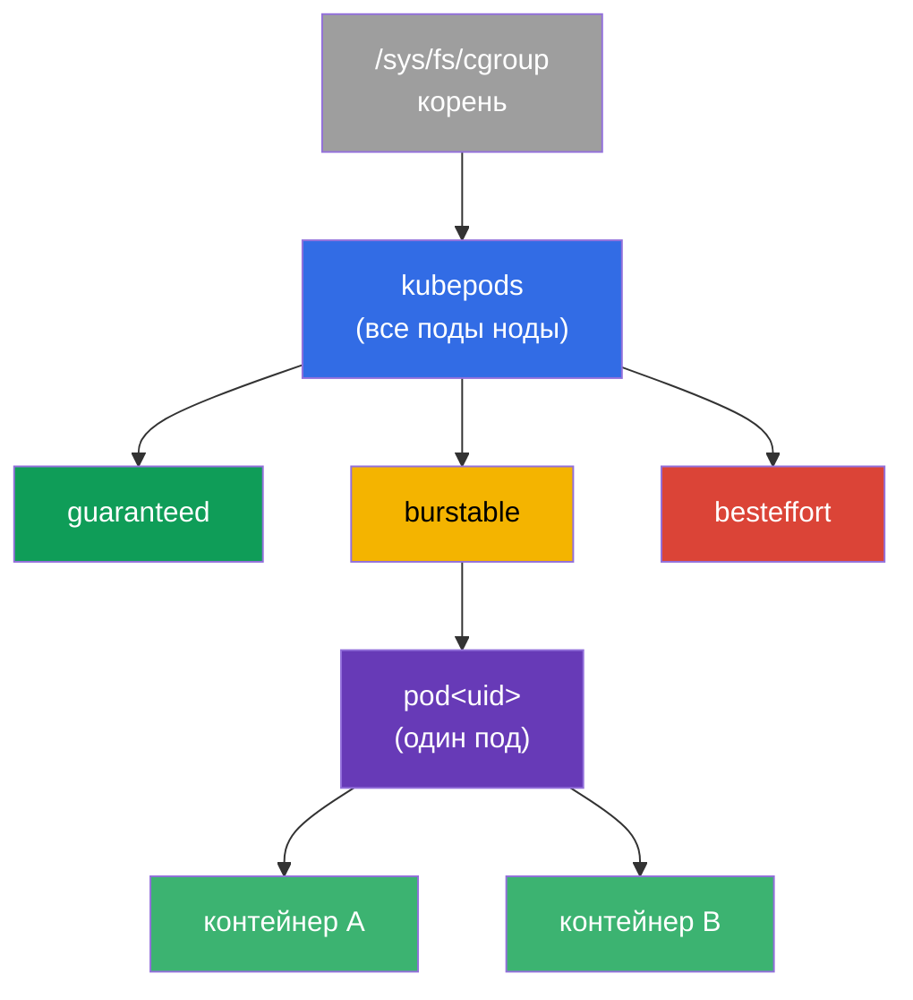
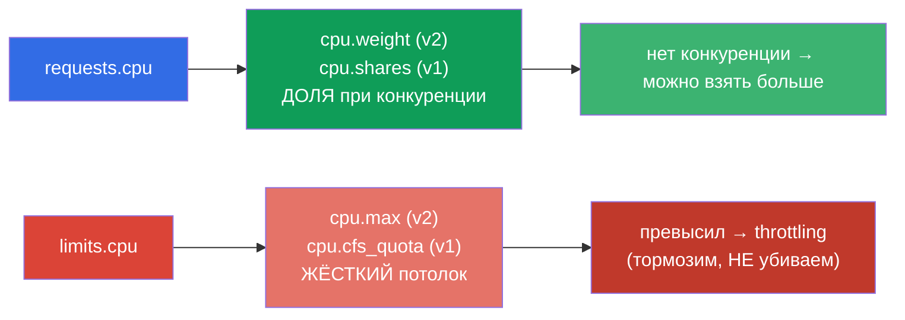
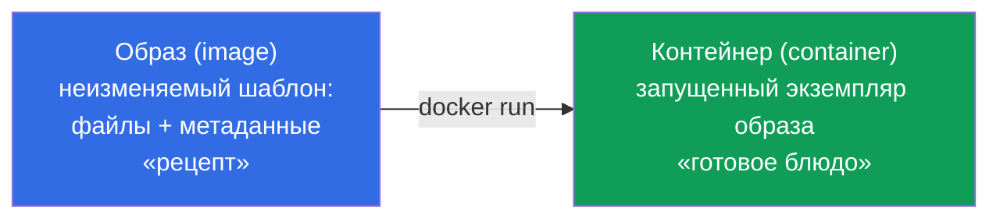
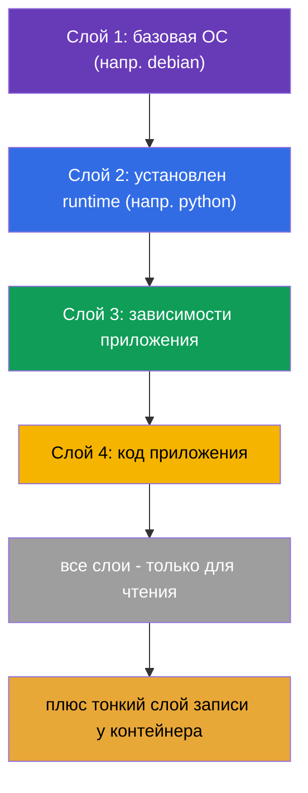
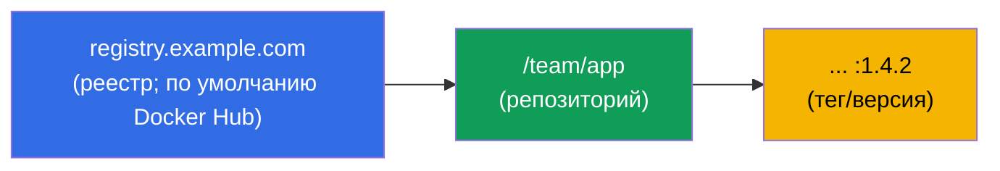
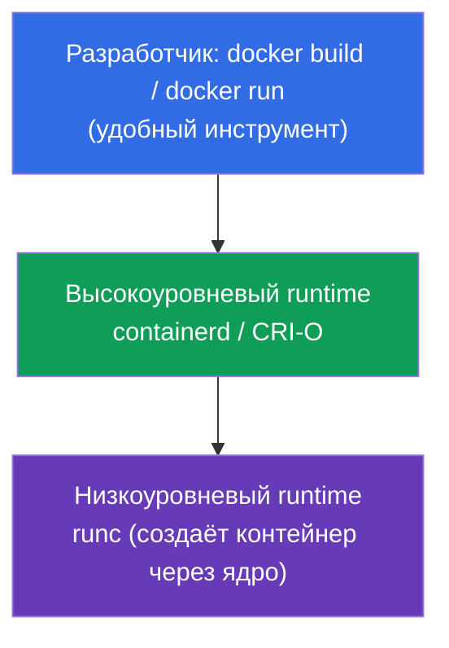
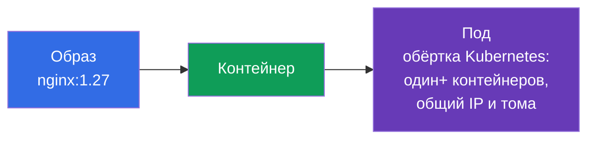

# Глава 0.4. Контейнеры и Docker с нуля: образы, слои, реестры и runtime

> **Для кого эта глава.** Последний кирпич нулевого фундамента - и самый важный:
> Kubernetes оркестрирует именно контейнеры, а под - это обёртка вокруг них. Если вы
> уже уверенно объясняете, чем контейнер отличается от образа и от виртуальной машины,
> что такое слои и реестр, - можно сразу к главе 1. Если контейнеры для вас пока
> расплывчаты - эта глава даёт базу, на которую опираются буквально все остальные
> главы курса.

## 0.4.1. Что такое контейнер и чем он не является

**Контейнер** - это изолированный процесс (или группа процессов), который использует
**общее ядро** хост-системы, но живёт в собственном «пузыре»: свои файлы, своя сеть,
свои лимиты. Это не «маленькая виртуальная машина» - и разница принципиальна.



Изоляцию обеспечивают возможности ядра Linux: **namespaces** (изолируют то, что
процесс видит: свои PID, сеть, точки монтирования) и **cgroups** (ограничивают, сколько
процесс потребляет: CPU, память). Не путайте эти Linux-namespaces с неймспейсами
Kubernetes (глава 6) - совпадает только слово. Разберём оба механизма подробнее - на
них стоят requests/limits и вся изоляция подов.

## 0.4.2. Как ядро ограничивает контейнер: namespaces и cgroups

Контейнер - это обычный процесс, но ядро надевает на него два «намордника»:



**namespaces** отвечают за **изоляцию** - процесс видит только «своё». Основные типы:

| Namespace | Что изолирует |
|-----------|---------------|
| **PID** | дерево процессов (внутри контейнера свой PID 1) |
| **NET** | сетевые интерфейсы, IP, порты (глава 0.7) |
| **MNT** | точки монтирования, файловая система |
| **UTS** | hostname |
| **IPC** | межпроцессное взаимодействие |
| **USER** | маппинг пользователей (root в контейнере ≠ root на хосте) |

**cgroups** (control groups) отвечают за **лимиты** - сколько ресурсов процесс может
потребить. Ключевые контроллеры:

| Контроллер | Что ограничивает | Куда мапится в Kubernetes |
|------------|------------------|---------------------------|
| **cpu** | доля/квота CPU | `requests/limits.cpu` (глава 14) |
| **memory** | предел памяти | `limits.memory` → превышение = **OOMKilled** (глава 44) |
| **pids** | число процессов | защита от fork-бомбы |
| **io** | пропускная способность диска | троттлинг ввода-вывода |

Прямая связь с курсом: когда в главе 14 вы пишете `limits: {cpu: 500m, memory: 128Mi}`,
kubelet через runtime переводит это в настройки cgroup контейнера. Превысил CPU-квоту -
процесс **тормозится** (throttling); превысил memory-лимит - ядро **убивает** контейнер
с `OOMKilled`. То есть requests/limits - это не «пожелания Kubernetes», а реальные
ограничения ядра Linux через cgroups.

## 0.4.3. cgroup v1 и v2: две версии механизма

У cgroups есть две версии, и разница важна для нод кластера:

| | **cgroup v1** | **cgroup v2** |
|--|---------------|---------------|
| Иерархия | отдельная на каждый контроллер (cpu, memory... по-разному) | **единая** унифицированная иерархия |
| Согласованность | контроллеры настраиваются вразнобой | единый последовательный интерфейс |
| Память | базовый контроль | точнее (MemoryQoS), учёт нагрузки (PSI) |
| Статус | наследие, постепенно уходит | **современный стандарт** |

Для Kubernetes это не абстракция:

- Поддержка **cgroup v2 стабильна (GA) с Kubernetes 1.25**.
- Нужны ядро **5.8+**, container runtime с поддержкой v2 (containerd 1.4+, CRI-O 1.20+)
  и **systemd** cgroup-драйвер.
- Часть возможностей (тонкий контроль памяти MemoryQoS, метрики давления PSI) доступна
  **только на v2**.

Проверить, какая версия на ноде:

```bash
stat -fc %T /sys/fs/cgroup/     # cgroup2fs → v2 ; tmpfs → v1 (или гибрид)
```

## 0.4.4. С какой версии дистрибутивов cgroup v2 по умолчанию

cgroup v2 доступен в ядре с 4.5 (2016), но дистрибутивы включали его по умолчанию
позже. Ориентиры:

| Дистрибутив | cgroup v2 по умолчанию с |
|-------------|--------------------------|
| **Fedora** | 31 (2019) - первым среди крупных |
| **Ubuntu** | 21.10, и в LTS - с **22.04** |
| **Debian** | 11 (Bullseye) |
| **RHEL / CentOS Stream / Rocky / Alma** | **9** (в RHEL 8 по умолчанию v1) |
| **Arch, openSUSE Tumbleweed** | 2021+ |

Практический вывод: на современных нодах (Ubuntu 22.04, Debian 12, RHEL 9), которые
используют лабы курса, - **cgroup v2**. На старых (RHEL 8, Ubuntu 20.04) может быть v1
или гибрид, что иногда объясняет разницу в поведении лимитов.

## 0.4.5. cgroup-драйвер: почему это ломает ноды

Ещё один практический момент, о котором любят спрашивать. Настраивать cgroups могут
двое - сам **systemd** и «сырой» **cgroupfs**. Поэтому у cgroups есть **драйвер**, и
критично, чтобы **kubelet и container runtime использовали один и тот же**:



- На системах с systemd (все современные дистрибутивы) рекомендуется драйвер
  **systemd** для обоих.
- В containerd это флаг `SystemdCgroup = true` в конфиге - именно его выставляют при
  подготовке нод (лаба 116, глава 35).
- Рассинхрон драйверов - классическая причина «нода нестабильна / kubelet падает» после
  ручной установки кластера.

## 0.4.6. cgroups глубже: дерево, CPU-квоты и QoS

Разделы выше объяснили, *что* делают cgroups. Теперь - *как* именно, потому что на этом
стоят requests/limits и QoS-классы (главы 14, 44), а на экзамене и в бою это объясняет,
почему один под «тормозит», а другой «убит».

### cgroup - это узел в дереве

cgroup - не абстракция, а каталог в специальной файловой системе `/sys/fs/cgroup`.
Каждый каталог - группа процессов с настройками ресурсов; каталоги вложены в дерево, и
ограничения наследуются вниз. kubelet строит под контейнеры кластера свою иерархию:



Ветка `kubepods` делится по **QoS-классам** (guaranteed/burstable/besteffort), внутри -
каталог на каждый под, внутри - на каждый контейнер. Так лимит пода ограничивает сумму
его контейнеров, а лимит QoS-ветки - поведение при нехватке ресурсов на ноде.

### CPU: два разных рычага - вес и квота

Главное, что путают: **requests.cpu и limits.cpu - это две разные настройки cgroup**.



- **requests.cpu → вес** (`cpu.weight` в v2, `cpu.shares` в v1). Это не потолок, а
  *доля* процессорного времени **при конкуренции**. Если CPU свободен, контейнер берёт
  больше своего request.
- **limits.cpu → квота** (`cpu.max` в v2: `quota period`; `cpu.cfs_quota_us` в v1). Это
  жёсткий потолок за период: превысил - процесс **тормозят** (CPU throttling), но **не
  убивают**. Отсюда типичный симптом «приложение медленное, хотя CPU не 100%» - его
  режет квота.

### Memory: лимит убивает, request - нет

С памятью логика другая: её нельзя «притормозить», поэтому превышение лимита = смерть.

- **limits.memory → `memory.max`** (v2) / `memory.limit_in_bytes` (v1). Превысил - ядро
  вызывает **OOM-killer**, контейнер получает статус **OOMKilled** (глава 44).
- **requests.memory** жёсткого лимита cgroup не создаёт - он влияет на **планирование**
  (куда влезет под) и на порядок **вытеснения** (eviction) при нехватке памяти на ноде.

| Ресурс | requests → | limits → | Превышение limits |
|--------|-----------|----------|-------------------|
| CPU | вес (`cpu.weight`/`shares`) | квота (`cpu.max`/`cfs_quota`) | **throttling** (тормозим) |
| Memory | планирование/eviction | `memory.max`/`limit_in_bytes` | **OOMKilled** (убиваем) |

### QoS-классы = место в дереве

Комбинация requests/limits определяет **QoS-класс** пода, а он - ветку в дереве cgroup и
приоритет при вытеснении:

| QoS | Условие | При нехватке памяти на ноде |
|-----|---------|------------------------------|
| **Guaranteed** | requests == limits для всех контейнеров | вытесняют последним |
| **Burstable** | requests < limits (хоть что-то задано) | вытесняют вторыми |
| **BestEffort** | ни requests, ни limits не заданы | вытесняют **первыми** |

### PSI: давление ресурсов (только v2)

cgroup v2 отдаёт **PSI (Pressure Stall Information)** - метрику того, сколько процессы
*ждали* CPU, память или I/O. Это точнее, чем «загрузка 100%»: показывает реальную
нехватку. По PSI строят алерты (глава 28) и решения об автоскейлинге.

### Как посмотреть вживую

```bash
# Версия cgroup на ноде
stat -fc %T /sys/fs/cgroup/            # cgroup2fs → v2

# CPU-настройки контейнера (v2): "max 100000" = лимит 1 CPU; "max" = без лимита
cat /sys/fs/cgroup/.../cpu.max
cat /sys/fs/cgroup/.../cpu.weight

# Память (v2): текущее потребление и лимит
cat /sys/fs/cgroup/.../memory.current
cat /sys/fs/cgroup/.../memory.max

# Сколько раз контейнер тормозили квотой (диагностика "медленно, но CPU не 100%")
cat /sys/fs/cgroup/.../cpu.stat        # смотреть nr_throttled / throttled_usec

# Давление ресурсов (PSI, только v2)
cat /sys/fs/cgroup/.../cpu.pressure
cat /sys/fs/cgroup/.../memory.pressure
```

Вывод для курса: `requests` и `limits` из главы 14 - это ровно `cpu.weight`/`cpu.max` и
`memory.max` конкретного контейнера в дереве cgroup. Понимание разницы «вес против
квоты» и «throttling против OOMKilled» снимает большую часть вопросов при отладке
производительности.

## 0.4.7. Образ против контейнера

Два понятия, которые новички путают чаще всего:



- **Образ** - неизменяемый шаблон: файловая система приложения плюс метаданные (какую
  команду запускать, какие порты, переменные). Это «рецепт» или «класс».
- **Контейнер** - запущенный из образа экземпляр. Из одного образа можно запустить
  сколько угодно одинаковых контейнеров. Это «готовое блюдо» или «объект».

В Kubernetes вы всегда указываете **образ** (`image: nginx:1.27`), а кластер запускает
из него **контейнеры** внутри подов.

## 0.4.8. Слои образа и почему это важно

Образ собирается из **слоёв (layers)** - каждый слой это набор изменений файловой
системы поверх предыдущего. Слои **переиспользуются** и кэшируются: если два образа
начинаются с одного базового слоя, он хранится и качается один раз.



Практическое следствие: слои образа - **только для чтения**, а контейнер добавляет
поверх тонкий **слой записи**. Поэтому данные, записанные внутрь контейнера,
исчезают при его пересоздании - для постоянных данных нужны тома (главы 24-26).
Порядок слоёв в Dockerfile влияет на скорость сборки: редко меняющееся - раньше,
код - в конце (подробно в главе 23).

## 0.4.9. Dockerfile: как рождается образ

Образ описывают текстовым файлом **Dockerfile** - списком инструкций. Каждая инструкция
обычно порождает слой.

```dockerfile
FROM python:3.12-slim        # базовый образ (слой-основа)
WORKDIR /app                 # рабочая директория
COPY requirements.txt .      # копируем список зависимостей
RUN pip install -r requirements.txt   # ставим зависимости (слой)
COPY . .                     # копируем код приложения (слой)
EXPOSE 8080                  # документируем порт
CMD ["python", "app.py"]     # команда запуска по умолчанию
```

Ключевые инструкции, которые надо узнавать:

| Инструкция | Что делает |
|------------|------------|
| `FROM` | базовый образ, с которого начинается сборка |
| `RUN` | выполнить команду при сборке (создаёт слой) |
| `COPY` / `ADD` | добавить файлы в образ |
| `WORKDIR` | рабочая директория внутри образа |
| `EXPOSE` | задокументировать порт (не открывает его сам) |
| `ENV` | переменная окружения |
| `CMD` | команда по умолчанию при запуске контейнера |
| `ENTRYPOINT` | неизменяемая часть команды запуска |

Связь с Kubernetes прямая: `CMD`/`ENTRYPOINT` образа - это то, что в манифесте пода
переопределяется полями `command` и `args` (глава 17), а `ENV` - то, что дополняется
через `env` и ConfigMap/Secret (главы 17-19).

## 0.4.10. Реестр: где хранятся образы

Собранный образ кладут в **реестр (registry)** - хранилище образов, откуда их
скачивают ноды. Полное имя образа читается так:



- Если реестр не указан - подразумевается **Docker Hub**.
- **Тег** - версия образа (`nginx:1.27`). Тег `latest` - не «самая новая версия
  навсегда», а просто тег по умолчанию; в проде так делать опасно, лучше фиксировать
  версию.
- Приватные реестры требуют аутентификации - в Kubernetes её задают через
  `imagePullSecrets` (главы 19, 23).

## 0.4.11. Docker и container runtime: кто на самом деле запускает контейнеры

Docker сделал контейнеры массовыми, но важно понимать разделение ролей, потому что
**Kubernetes не использует Docker напрямую**.



- **Docker** - удобный инструмент для человека: собрать образ, запустить локально.
- **containerd / CRI-O** - «движки» (высокоуровневые runtime), которые реально
  управляют контейнерами. Именно с ними kubelet общается через интерфейс **CRI**
  (Container Runtime Interface, глава 40).
- **runc** - низкоуровневый инструмент, создающий контейнер средствами ядра.

Историческая деталь, о которой любят спрашивать: раньше kubelet ходил в Docker через
прослойку `dockershim`, но её убрали. Сегодня ноды кластера обычно используют
**containerd** напрямую. Образы при этом остаются совместимыми (стандарт OCI), поэтому
собранный `docker build` образ прекрасно запускается в кластере на containerd.

## 0.4.12. Мостик к поду (глава 4)



Цепочка, которую надо держать в голове весь курс: **образ → контейнер → под**.
Kubernetes не управляет контейнерами поштучно - минимальная единица для него это
**под**, обёртка вокруг одного или нескольких контейнеров с общими IP и томами.
Подробно - в главе 4.

## 0.4.13. Как это применяют в продакшене

- **Маленькие образы.** Чем меньше образ, тем быстрее выкатка и меньше уязвимостей.
  Используют slim/alpine-базы и многоступенчатую сборку (глава 23).
- **Фиксация версий, а не `latest`.** В проде тегируют конкретными версиями - иначе
  «то же самое» разворачивается по-разному и ломается непредсказуемо.
- **Сканирование образов.** Образы проверяют на уязвимости перед деплоем; базовые
  образы регулярно обновляют.
- **Свой реестр.** Компании держат приватный реестр (Harbor, ECR, GAR): контроль
  доступа, кэш, сканирование, независимость от публичных лимитов Docker Hub.
- **containerd на нодах.** Понимание, что под капотом containerd + runc (а не Docker),
  нужно для troubleshooting нод: логи и статус контейнеров смотрят через `crictl`, а
  не `docker`.

## 0.4.14. Мини-глоссарий

- **Контейнер** - изолированный процесс на общем ядре хоста (namespaces + cgroups).
- **namespaces (Linux)** - изоляция того, что процесс видит (PID, NET, MNT, UTS, IPC, USER).
- **cgroups** - ограничение того, сколько процесс потребляет (cpu, memory, pids, io).
- **cgroup v1 / v2** - старая (иерархия на контроллер) / современная (единая иерархия) версии; v2 нужна для части возможностей (K8s cgroup v2 GA с 1.25).
- **OOMKilled** - контейнер убит ядром за превышение memory-лимита cgroup.
- **cgroup-драйвер** - кто настраивает cgroups: `systemd` или `cgroupfs`; kubelet и runtime должны совпадать (`SystemdCgroup=true`).
- **cpu.weight / cpu.shares** - вес CPU (из `requests.cpu`): доля процессора при конкуренции, не потолок.
- **cpu.max / cfs_quota** - жёсткая CPU-квота (из `limits.cpu`); превышение = **throttling**.
- **CPU throttling** - принудительное замедление процесса за превышение CPU-квоты (не убийство).
- **memory.max** - предел памяти cgroup (из `limits.memory`); превышение = OOMKilled.
- **kubepods** - корневая cgroup-ветка kubelet: `kubepods → QoS → pod → контейнер`.
- **QoS-класс** - Guaranteed/Burstable/BestEffort; определяет ветку cgroup и порядок вытеснения.
- **PSI (Pressure Stall Information)** - метрика ожидания CPU/памяти/I/O (только cgroup v2).
- **Образ (image)** - неизменяемый шаблон файловой системы приложения + метаданные.
- **Слой (layer)** - набор изменений ФС; слои переиспользуются и кэшируются.
- **Слой записи** - тонкий изменяемый слой контейнера поверх read-only слоёв образа.
- **Dockerfile** - текстовое описание сборки образа из инструкций.
- **Реестр (registry)** - хранилище образов (по умолчанию Docker Hub).
- **Тег** - версия образа; `latest` - лишь тег по умолчанию, не «всегда свежий».
- **OCI** - открытый стандарт формата образов и контейнеров.
- **containerd / CRI-O** - высокоуровневые runtime, с которыми работает kubelet.
- **CRI** - интерфейс между kubelet и container runtime (глава 40).
- **runc** - низкоуровневый инструмент запуска контейнеров через ядро.

## 0.4.15. Итоги главы

- Контейнер - изолированный процесс на общем ядре (namespaces + cgroups), а не мини-VM:
  легче, быстрее, экономичнее.
- namespaces изолируют (что видно: PID/NET/MNT/...), cgroups ограничивают (сколько
  ресурсов: cpu/memory/pids/io); requests/limits Kubernetes - это реальные настройки
  cgroup, отсюда throttling по CPU и OOMKilled по памяти (главы 14, 44).
- `requests.cpu` → вес (`cpu.weight`/`shares`, доля при конкуренции), `limits.cpu` → квота
  (`cpu.max`/`cfs_quota`, жёсткий потолок → throttling); `limits.memory` → `memory.max`
  (превышение → OOMKilled). kubelet строит дерево `kubepods → QoS → под → контейнер`, а
  QoS-класс (Guaranteed/Burstable/BestEffort) задаёт порядок вытеснения.
- cgroup v2 - единая иерархия (современный стандарт, K8s GA с 1.25, нужно ядро 5.8+); по
  умолчанию в Fedora 31+, Ubuntu 22.04+, Debian 11+, RHEL 9+ (в RHEL 8 - v1); только v2
  даёт PSI (метрику давления ресурсов).
- cgroup-драйвер kubelet и runtime должны совпадать (systemd, `SystemdCgroup=true`) -
  иначе нода нестабильна (лаба 116, глава 35).
- Образ - неизменяемый «рецепт», контейнер - запущенный из него экземпляр; из одного
  образа запускают много контейнеров.
- Образ состоит из read-only слоёв (кэшируются и переиспользуются); контейнер добавляет
  слой записи, который теряется при пересоздании - отсюда потребность в томах.
- Dockerfile описывает сборку; `CMD`/`ENV`/`EXPOSE` напрямую соотносятся с полями пода.
- Образы хранятся в реестрах; имя = реестр/репозиторий:тег; в проде фиксируют версии.
- Kubernetes использует не Docker, а container runtime (обычно containerd) через CRI;
  образы совместимы благодаря стандарту OCI.
- Ключевая цепочка курса: образ → контейнер → под.

## 0.4.16. Как это пригодится: на экзамене и в реальной работе

**На экзамене.** Контейнеры - фундамент всего: под (глава 4), `command`/`args`
(глава 17), образы и Dockerfile (глава 23), CRI (глава 40), troubleshooting нод через
`crictl` (глава 45). Понимание «образ ≠ контейнер» и слоёв нужно, чтобы не путаться в
каждой второй задаче CKAD.

**В реальной работе.** Сборка компактных безопасных образов, работа с реестрами,
фиксация версий, диагностика контейнеров на нодах через containerd/`crictl` -
повседневные задачи. База по контейнерам отделяет тех, кто «копипастит манифесты», от
тех, кто понимает, что происходит.

## 0.4.17. Вопросы для самопроверки

1. Чем контейнер принципиально отличается от виртуальной машины? Что обеспечивает
   изоляцию?
2. Чем занимаются namespaces, а чем cgroups? Как requests/limits Kubernetes связаны с
   cgroups и что такое OOMKilled?
3. Чем cgroup v2 отличается от v1 и с каких версий дистрибутивов v2 идёт по умолчанию?
4. Как `requests.cpu` и `limits.cpu` отображаются в cgroup и в чём разница между «весом» и
   «квотой»? Почему при превышении CPU-лимита контейнер тормозят, а при превышении
   memory-лимита - убивают?
5. Как устроено дерево cgroup, которое строит kubelet (kubepods → QoS → под → контейнер),
   и как QoS-класс связан с порядком вытеснения подов?
6. Что такое cgroup-драйвер и почему его рассинхрон между kubelet и runtime ломает ноду?
7. В чём разница между образом и контейнером? Сколько контейнеров можно запустить из
   одного образа?
8. Что такое слои образа и почему данные внутри контейнера не переживают пересоздание?
9. Как читается полное имя образа и почему `latest` опасен в проде?
10. Использует ли Kubernetes Docker для запуска контейнеров? Что он использует и через
   какой интерфейс?
11. Как связаны образ, контейнер и под?

## Практика

Контейнеры - последний «инфраструктурный» кирпич. Дальше в части 0 - три практических
навыка, без которых буксуют лабы: работа с нодой в Linux (0.5), YAML (0.6) и сеть Linux
под капотом (0.7). Затем - основной курс с главы 1.

---
[Оглавление](../README_RU.md) · [Глава 0.3](../00-3-tls/ru.md) · [Глава 0.5](../00-5-linux/ru.md)
