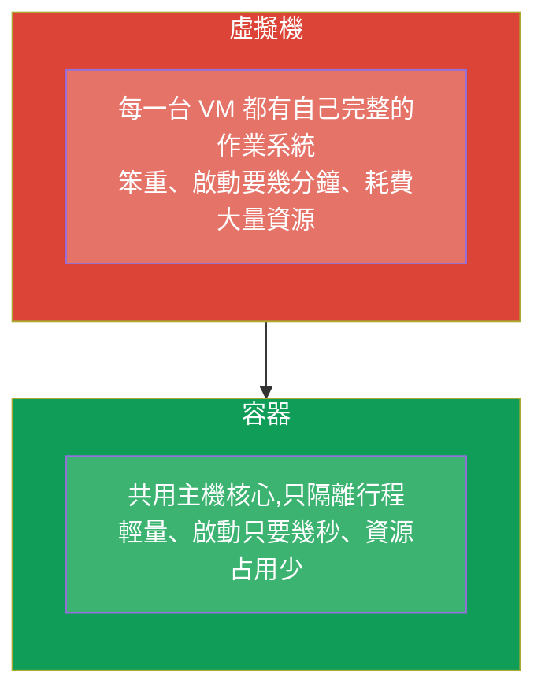
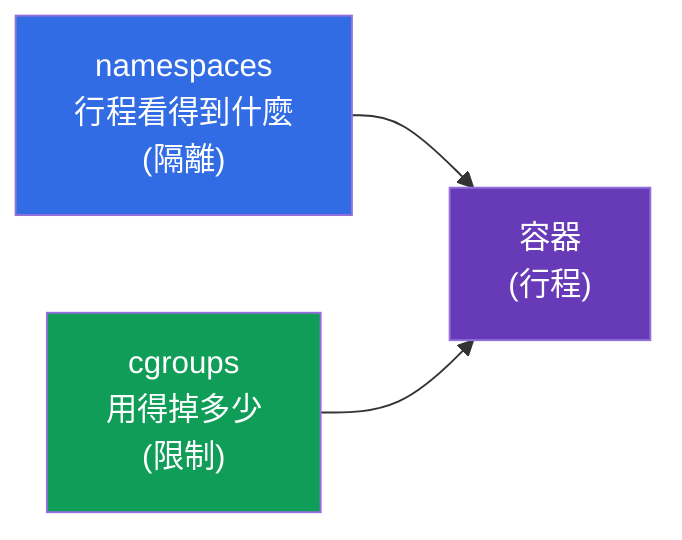
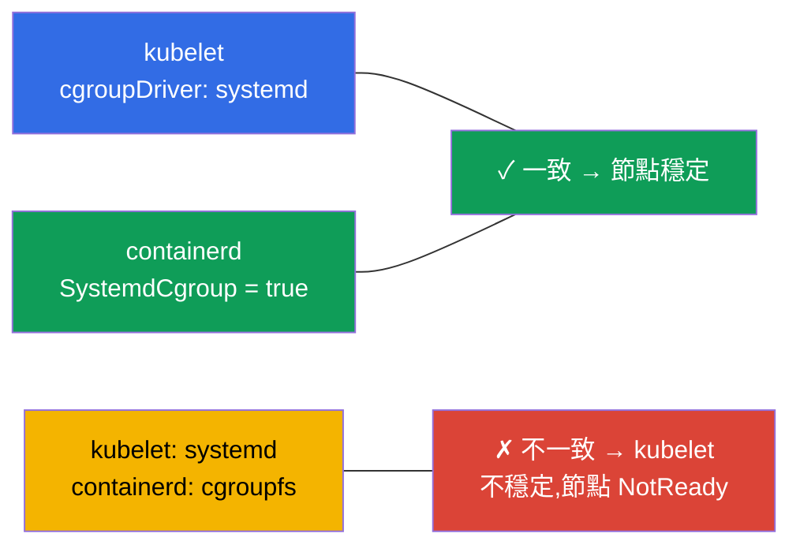
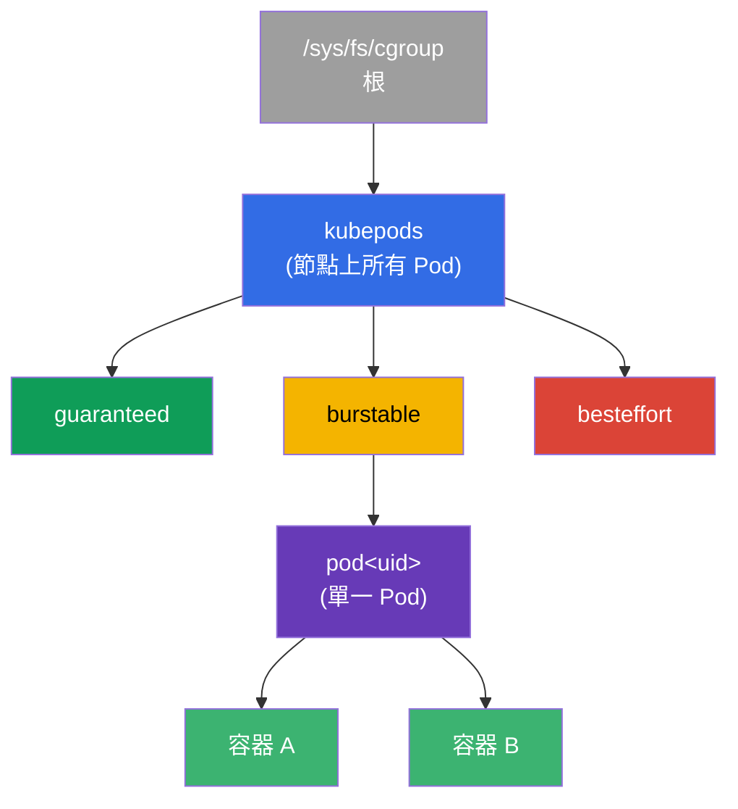
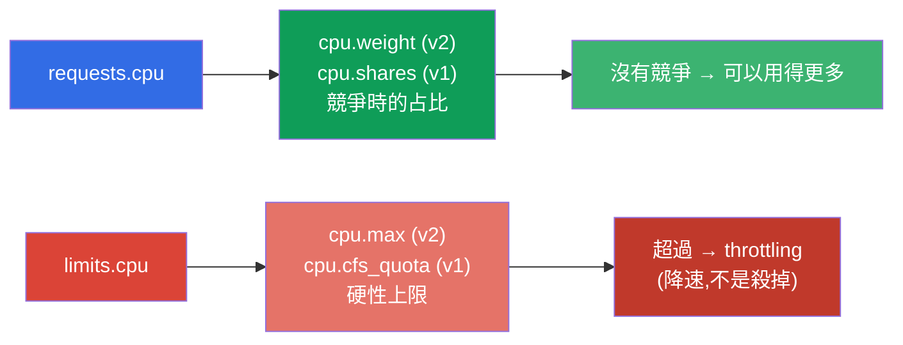
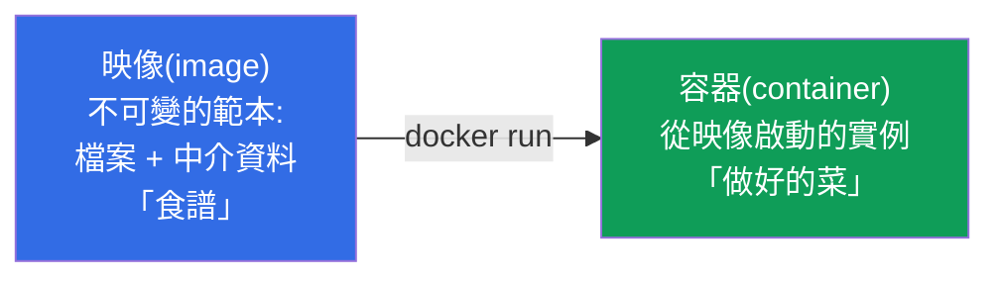
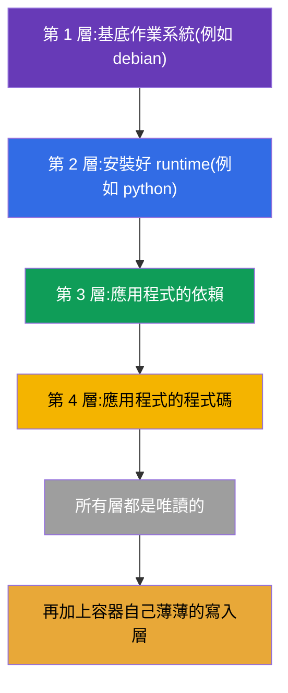
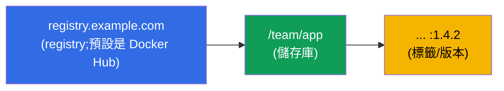
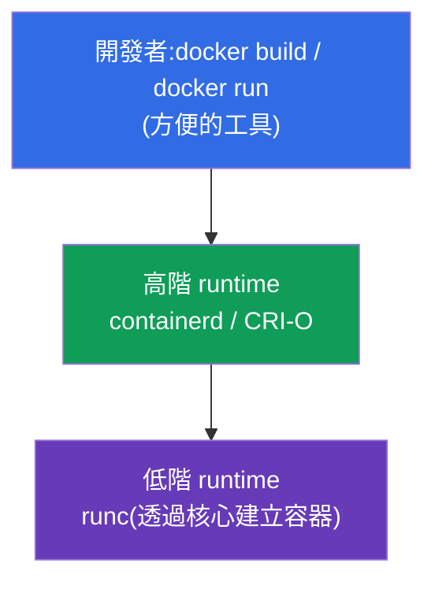
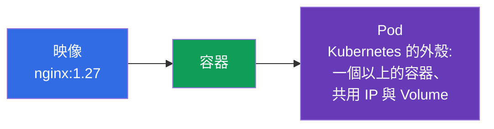

[Русская версия](ru.md) · [Eng version](README.md) · [Versión en español](es.md) · [Version française](fr.md) · [Deutsche Version](de.md) · [ქართული ვერსია](ge.md) · [日本語版](jp.md)

# 第 0.4 章。從零開始的容器與 Docker:映像、層、registry 與 runtime

> **這一章寫給誰。** 零基礎地基的最後一塊磚 - 也是最重要的一塊:
> Kubernetes 編排的對象正是容器,而 Pod 只是包在容器外面的一層外殼。
> 如果你已經能自信地說清楚容器與映像、容器與虛擬機之間的差別,
> 也知道什麼是層、什麼是 registry - 那就可以直接跳到第 1 章。
> 如果容器對你來說還很模糊 - 這一章會給你一個基礎,
> 課程裡其他幾乎每一章都建立在它之上。

## 0.4.1. 容器是什麼,又不是什麼

**容器**是一個被隔離的行程(或一組行程),它使用主機系統的**共用核心**,
但活在自己的「泡泡」裡:自己的檔案、自己的網路、自己的資源上限。它不是
「小型虛擬機」 - 這個差別非常關鍵。



隔離由 Linux 核心的能力提供:**namespaces**(隔離行程看得到什麼:
自己的 PID、網路、掛載點)與 **cgroups**(限制行程用得掉多少:CPU、
記憶體)。不要把這些 Linux namespaces 和 Kubernetes 的 Namespace(第 6 章)
搞混 - 只是名字一樣而已。下面把兩個機制講得更細一些 - requests/limits
與 Pod 的所有隔離都建立在它們之上。

## 0.4.2. 核心如何限制容器:namespaces 與 cgroups

容器就是一個普通的行程,只是核心給它戴上了兩副「口罩」:



**namespaces** 負責**隔離** - 行程只看得到「屬於自己的東西」。主要類型:

| Namespace | 隔離什麼 |
|-----------|---------------|
| **PID** | 行程樹(容器內有自己的 PID 1) |
| **NET** | 網路介面、IP、埠(第 0.7 章) |
| **MNT** | 掛載點、檔案系統 |
| **UTS** | hostname |
| **IPC** | 行程間通訊 |
| **USER** | 使用者對應(容器內的 root ≠ 主機上的 root) |

**cgroups**(control groups)負責**限制** - 行程可以消耗多少資源。
關鍵的控制器:

| 控制器 | 限制什麼 | 在 Kubernetes 中對應到哪裡 |
|------------|------------------|---------------------------|
| **cpu** | CPU 占比/配額 | `requests/limits.cpu`(第 14 章) |
| **memory** | 記憶體上限 | `limits.memory` → 超過 = **OOMKilled**(第 44 章) |
| **pids** | 行程數量 | 防止 fork 炸彈 |
| **io** | 磁碟吞吐量 | I/O 節流 |

與課程的直接關聯:當你在第 14 章寫下 `limits: {cpu: 500m, memory: 128Mi}` 時,
kubelet 會透過 runtime 把它翻譯成容器的 cgroup 設定。超過 CPU 配額 -
行程會被**降速**(throttling);超過 memory 上限 - 核心會**殺掉**容器,
狀態是 `OOMKilled`。也就是說,requests/limits 不是「Kubernetes 的願望」,
而是透過 cgroups 落實的 Linux 核心限制。

## 0.4.3. cgroup v1 與 v2:機制的兩個版本

cgroups 有兩個版本,而這個差別對叢集節點很重要:

| | **cgroup v1** | **cgroup v2** |
|--|---------------|---------------|
| 階層 | 每個控制器各自一套(cpu、memory... 各做各的) | **單一**統一階層 |
| 一致性 | 控制器的設定方式各不相同 | 統一且一致的介面 |
| 記憶體 | 基本控制 | 更精確(MemoryQoS)、可統計壓力(PSI) |
| 狀態 | 舊有遺留,正逐步退場 | **現代標準** |

對 Kubernetes 來說,這不是抽象概念:

- **cgroup v2 的支援從 Kubernetes 1.25 起穩定(GA)**。
- 需要核心 **5.8+**、支援 v2 的 container runtime(containerd 1.4+、CRI-O 1.20+)
  以及 **systemd** cgroup 驅動。
- 部分功能(精細的記憶體控制 MemoryQoS、壓力指標 PSI)**只在 v2 上**
  才有。

檢查節點上是哪個版本:

```bash
stat -fc %T /sys/fs/cgroup/     # cgroup2fs → v2 ; tmpfs → v1(或混合模式)
```

## 0.4.4. 各發行版從哪個版本起預設使用 cgroup v2

cgroup v2 從核心 4.5(2016)就已經存在,但各發行版預設啟用它的時間
比較晚。參考時間點:

| 發行版 | 從哪個版本起預設 cgroup v2 |
|-------------|--------------------------|
| **Fedora** | 31(2019) - 大型發行版中的第一個 |
| **Ubuntu** | 21.10,LTS 則從 **22.04** 起 |
| **Debian** | 11(Bullseye) |
| **RHEL / CentOS Stream / Rocky / Alma** | **9**(RHEL 8 預設是 v1) |
| **Arch, openSUSE Tumbleweed** | 2021+ |

實務結論:課程實驗用的現代節點(Ubuntu 22.04、Debian 12、RHEL 9)上
一律是 **cgroup v2**。在較舊的系統(RHEL 8、Ubuntu 20.04)上可能是 v1
或混合模式,這有時可以解釋資源上限行為上的差異。

## 0.4.5. cgroup 驅動:為什麼它會弄壞節點

還有一個很常被問到的實務重點。能設定 cgroups 的有兩方 - **systemd** 本身
和「原始的」**cgroupfs**。所以 cgroups 有**驅動(driver)**的概念,而且
關鍵在於**kubelet 與 container runtime 必須使用同一個**:



- 在使用 systemd 的系統上(所有現代發行版)建議兩邊都用
  **systemd** 驅動。
- 在 containerd 裡就是設定檔中的 `SystemdCgroup = true` 旗標 - 準備節點時
  設定的正是它(實驗 116、第 35 章)。
- 驅動不一致是手動安裝叢集之後「節點不穩定 / kubelet 掛掉」的
  經典原因。

## 0.4.6. 更深入的 cgroups:樹狀結構、CPU 配額與 QoS

上面的章節說明了 cgroups *做什麼*。現在講 *怎麼做* - 因為 requests/limits
與 QoS 類別(第 14、44 章)都建立在這上面,而且在考試與實戰中,它可以解釋
為什麼一個 Pod「變慢」,另一個卻「被殺掉」。

### cgroup 就是樹上的一個節點

cgroup 不是抽象概念,而是特殊檔案系統 `/sys/fs/cgroup` 裡的一個目錄。
每個目錄就是一組帶著資源設定的行程;目錄彼此嵌套成一棵樹,限制會向下繼承。
kubelet 會為叢集的容器建立自己的一套階層:



分支 `kubepods` 按 **QoS 類別**(guaranteed/burstable/besteffort)劃分,裡面
每個 Pod 一個目錄,再往裡每個容器一個目錄。因此 Pod 的上限限制的是其所有
容器的總和,而 QoS 分支的上限決定節點資源不足時的行為。

### CPU:兩個不同的槓桿 - 權重與配額

最常被搞混的一點:**requests.cpu 和 limits.cpu 是兩個不同的 cgroup 設定**。



- **requests.cpu → 權重**(v2 的 `cpu.weight`,v1 的 `cpu.shares`)。它不是上限,
  而是**競爭時**的處理器時間*占比*。如果 CPU 空閒,容器可以用得比自己的
  request 更多。
- **limits.cpu → 配額**(v2 的 `cpu.max`:`quota period`;v1 的 `cpu.cfs_quota_us`)。
  這是每個週期的硬性上限:超過就會被**降速**(CPU throttling),但**不會
  被殺掉**。這也是典型症狀「應用程式很慢,但 CPU 又不到 100%」的來源 -
  它被配額砍了。

### Memory:上限會殺掉行程,request 不會

記憶體的邏輯不同:它沒辦法「降速」,所以超過上限就等於死亡。

- **limits.memory → `memory.max`**(v2)/ `memory.limit_in_bytes`(v1)。超過 -
  核心就會呼叫 **OOM-killer**,容器拿到 **OOMKilled** 狀態(第 44 章)。
- **requests.memory** 不會建立硬性的 cgroup 上限 - 它影響的是**排程**
  (Pod 放得進哪裡)以及節點記憶體不足時的**驅逐**(eviction)順序。

| 資源 | requests → | limits → | 超過 limits |
|--------|-----------|----------|-------------------|
| CPU | 權重(`cpu.weight`/`shares`) | 配額(`cpu.max`/`cfs_quota`) | **throttling**(降速) |
| Memory | 排程/eviction | `memory.max`/`limit_in_bytes` | **OOMKilled**(殺掉) |

### QoS 類別 = 樹上的位置

requests/limits 的組合決定 Pod 的 **QoS 類別**,而它又決定 cgroup 樹上的分支
以及驅逐時的優先順序:

| QoS | 條件 | 節點記憶體不足時 |
|-----|---------|------------------------------|
| **Guaranteed** | 所有容器的 requests == limits | 最後才被驅逐 |
| **Burstable** | requests < limits(至少設了一項) | 第二順位被驅逐 |
| **BestEffort** | requests 與 limits 都沒設 | **最先**被驅逐 |

### PSI:資源壓力(僅 v2)

cgroup v2 提供 **PSI(Pressure Stall Information)** - 一個衡量行程*等待* CPU、
記憶體或 I/O 多久的指標。它比「負載 100%」更精確:它顯示真正的資源不足。
PSI 可以用來建立告警(第 28 章)與自動擴縮的決策。

### 如何實際查看

```bash
# 節點上的 cgroup 版本
stat -fc %T /sys/fs/cgroup/            # cgroup2fs → v2

# 容器的 CPU 設定(v2):"max 100000" = 上限 1 CPU;"max" = 沒有上限
cat /sys/fs/cgroup/.../cpu.max
cat /sys/fs/cgroup/.../cpu.weight

# 記憶體(v2):目前用量與上限
cat /sys/fs/cgroup/.../memory.current
cat /sys/fs/cgroup/.../memory.max

# 容器被配額降速過幾次(診斷「很慢,但 CPU 不到 100%」)
cat /sys/fs/cgroup/.../cpu.stat        # 看 nr_throttled / throttled_usec

# 資源壓力(PSI,僅 v2)
cat /sys/fs/cgroup/.../cpu.pressure
cat /sys/fs/cgroup/.../memory.pressure
```

對課程的結論:第 14 章的 `requests` 與 `limits`,就正好是 cgroup 樹上某個具體
容器的 `cpu.weight`/`cpu.max` 與 `memory.max`。理解「權重對配額」以及
「throttling 對 OOMKilled」的差別,可以解掉效能除錯時的大部分
疑問。

## 0.4.7. 映像與容器的差別

新手最常搞混的兩個概念:



- **映像**是不可變的範本:應用程式的檔案系統加上中介資料(要執行什麼
  指令、哪些埠、哪些變數)。它就是「食譜」或「類別」。
- **容器**是從映像啟動起來的實例。同一個映像可以啟動任意多個一樣的
  容器。它就是「做好的菜」或「物件」。

在 Kubernetes 裡你指定的一律是**映像**(`image: nginx:1.27`),而叢集會從它
啟動 Pod 內的**容器**。

## 0.4.8. 映像的層,以及為什麼它很重要

映像由**層(layers)**組成 - 每一層都是疊在前一層之上的一組檔案系統變更。
層會被**重複使用**並快取:如果兩個映像從同一個基底層開始,這個層只會
儲存與下載一次。



實務推論:映像的層是**唯讀**的,而容器會在最上面
再加一層薄薄的**寫入層**。因此寫進容器裡的資料在容器被重新建立時就會消失 -
需要持久保存的資料就得用 Volume(第 24-26 章)。Dockerfile 裡層的順序
會影響建置速度:很少變動的東西放前面,
程式碼放最後面(細節在第 23 章)。

## 0.4.9. Dockerfile:映像是怎麼誕生的

映像用一個文字檔 **Dockerfile** 來描述 - 也就是一串指令。每一條指令
通常都會產生一層。

```dockerfile
FROM python:3.12-slim        # 基底映像(基礎層)
WORKDIR /app                 # 工作目錄
COPY requirements.txt .      # 複製依賴清單
RUN pip install -r requirements.txt   # 安裝依賴(層)
COPY . .                     # 複製應用程式的程式碼(層)
EXPOSE 8080                  # 記錄埠號
CMD ["python", "app.py"]     # 預設的啟動指令
```

需要認得的關鍵指令:

| 指令 | 做什麼 |
|------------|------------|
| `FROM` | 建置起點的基底映像 |
| `RUN` | 在建置時執行指令(會產生一層) |
| `COPY` / `ADD` | 把檔案加進映像 |
| `WORKDIR` | 映像內的工作目錄 |
| `EXPOSE` | 記錄埠號(它本身不會開啟埠) |
| `ENV` | 環境變數 |
| `CMD` | 容器啟動時的預設指令 |
| `ENTRYPOINT` | 啟動指令中不可變的部分 |

與 Kubernetes 的關聯很直接:映像的 `CMD`/`ENTRYPOINT` 正是 Pod 清單中
由 `command` 與 `args` 欄位覆寫的東西(第 17 章),而 `ENV` 則是透過 `env`
以及 ConfigMap/Secret 補充的東西(第 17-19 章)。

## 0.4.10. Registry:映像存放在哪裡

建置好的映像會放進 **registry(映像倉庫)** - 一個映像存放處,節點從那裡
把映像拉下來。完整的映像名稱這樣讀:



- 如果沒有指定 registry - 就代表 **Docker Hub**。
- **標籤(tag)**是映像的版本(`nginx:1.27`)。`latest` 標籤不是「永遠最新的
  版本」,只是預設標籤而已;在生產環境這樣做很危險,最好固定
  版本。
- 私有 registry 需要驗證 - 在 Kubernetes 中透過 `imagePullSecrets` 設定
  (第 19、23 章)。

## 0.4.11. Docker 與 container runtime:實際執行容器的是誰

Docker 讓容器普及開來,但了解角色分工很重要,因為
**Kubernetes 並不直接使用 Docker**。



- **Docker** 是給人用的方便工具:建置映像、在本機執行。
- **containerd / CRI-O** 是真正管理容器的「引擎」(高階 runtime)。
  kubelet 正是透過 **CRI** 介面和它們溝通
  (Container Runtime Interface,第 40 章)。
- **runc** 是低階工具,用核心的機制把容器建立出來。

一個很常被問到的歷史細節:以前 kubelet 是透過 `dockershim` 這層墊片去找
Docker,但它已經被移除了。今天叢集節點通常直接使用 **containerd**。
映像在這過程中仍然是相容的(OCI 標準),所以用 `docker build` 建出來的
映像在跑 containerd 的叢集裡也能完美執行。

## 0.4.12. 通往 Pod 的橋樑(第 4 章)



整個課程都要記在腦子裡的一條鏈:**映像 → 容器 → Pod**。
Kubernetes 不會一個一個管理容器 - 對它來說最小的單位是 **Pod**,
也就是包住一個或多個容器、共用 IP 與 Volume 的外殼。
細節在第 4 章。

## 0.4.13. 這些在生產環境怎麼用

- **小映像。** 映像越小,發布越快,漏洞也越少。
  會用 slim/alpine 基底以及多階段建置(第 23 章)。
- **固定版本,不要用 `latest`。** 生產環境會用具體版本打標籤 - 否則
  「同一個東西」每次部署出來都不一樣,壞掉也難以預測。
- **掃描映像。** 部署前會檢查映像有沒有漏洞;基底映像
  要定期更新。
- **自己的 registry。** 公司會維護私有 registry(Harbor、ECR、GAR):存取
  控制、快取、掃描,而且不受 Docker Hub 公開限額的影響。
- **節點上是 containerd。** 了解底層是 containerd + runc(而不是 Docker),
  對節點的 troubleshooting 很重要:容器的日誌與狀態要用 `crictl` 看,
  而不是 `docker`。

## 0.4.14. 迷你詞彙表

- **容器** - 在主機共用核心上被隔離的行程(namespaces + cgroups)。
- **namespaces(Linux)** - 隔離行程看得到什麼(PID、NET、MNT、UTS、IPC、USER)。
- **cgroups** - 限制行程消耗多少(cpu、memory、pids、io)。
- **cgroup v1 / v2** - 舊版(每個控制器一套階層)/ 現代版(單一階層)兩個版本;部分功能需要 v2(K8s 的 cgroup v2 自 1.25 起 GA)。
- **OOMKilled** - 容器因超過 cgroup 的 memory 上限而被核心殺掉。
- **cgroup 驅動** - 由誰設定 cgroups:`systemd` 或 `cgroupfs`;kubelet 與 runtime 必須一致(`SystemdCgroup=true`)。
- **cpu.weight / cpu.shares** - CPU 權重(來自 `requests.cpu`):競爭時的處理器占比,不是上限。
- **cpu.max / cfs_quota** - 硬性的 CPU 配額(來自 `limits.cpu`);超過 = **throttling**。
- **CPU throttling** - 因超過 CPU 配額而被強制降速(不是殺掉)。
- **memory.max** - cgroup 的記憶體上限(來自 `limits.memory`);超過 = OOMKilled。
- **kubepods** - kubelet 的根 cgroup 分支:`kubepods → QoS → pod → 容器`。
- **QoS 類別** - Guaranteed/Burstable/BestEffort;決定 cgroup 分支與驅逐順序。
- **PSI(Pressure Stall Information)** - 等待 CPU/記憶體/I/O 的指標(僅 cgroup v2)。
- **映像(image)** - 應用程式檔案系統的不可變範本 + 中介資料。
- **層(layer)** - 一組檔案系統的變更;層會被重複使用並快取。
- **寫入層** - 容器疊在映像唯讀層之上、薄薄的可變層。
- **Dockerfile** - 用指令描述映像建置過程的文字檔。
- **Registry** - 映像的存放處(預設是 Docker Hub)。
- **標籤(tag)** - 映像的版本;`latest` 只是預設標籤,不代表「永遠最新」。
- **OCI** - 映像與容器格式的開放標準。
- **containerd / CRI-O** - kubelet 打交道的高階 runtime。
- **CRI** - kubelet 與 container runtime 之間的介面(第 40 章)。
- **runc** - 透過核心啟動容器的低階工具。

## 0.4.15. 本章總結

- 容器是在共用核心上被隔離的行程(namespaces + cgroups),而不是迷你 VM:
  更輕、更快、更省資源。
- namespaces 負責隔離(看得到什麼:PID/NET/MNT/...),cgroups 負責限制(用掉
  多少資源:cpu/memory/pids/io);Kubernetes 的 requests/limits 就是真實的
  cgroup 設定,所以才有 CPU 的 throttling 與記憶體的 OOMKilled(第 14、44 章)。
- `requests.cpu` → 權重(`cpu.weight`/`shares`,競爭時的占比),`limits.cpu` → 配額
  (`cpu.max`/`cfs_quota`,硬性上限 → throttling);`limits.memory` → `memory.max`
  (超過 → OOMKilled)。kubelet 會建立 `kubepods → QoS → Pod → 容器` 這棵樹,而
  QoS 類別(Guaranteed/Burstable/BestEffort)決定驅逐的順序。
- cgroup v2 是單一階層(現代標準,K8s 自 1.25 起 GA,需要核心 5.8+);
  Fedora 31+、Ubuntu 22.04+、Debian 11+、RHEL 9+ 預設就是它(RHEL 8 是 v1);只有 v2
  才提供 PSI(資源壓力指標)。
- kubelet 與 runtime 的 cgroup 驅動必須一致(systemd,`SystemdCgroup=true`) -
  否則節點會不穩定(實驗 116、第 35 章)。
- 映像是不可變的「食譜」,容器是從它啟動起來的實例;一個映像可以
  啟動很多容器。
- 映像由唯讀層組成(會快取並重複使用);容器會加上一層寫入層,
  它在重新建立時就會遺失 - 所以才需要 Volume。
- Dockerfile 描述建置過程;`CMD`/`ENV`/`EXPOSE` 直接對應到 Pod 的欄位。
- 映像存放在 registry;名稱 = registry/儲存庫:標籤;生產環境要固定版本。
- Kubernetes 用的不是 Docker,而是透過 CRI 使用 container runtime(通常是 containerd);
  映像因為 OCI 標準而彼此相容。
- 課程的關鍵鏈:映像 → 容器 → Pod。

## 0.4.16. 這些能派上什麼用場:考試中與真實工作中

**在考試中。** 容器是一切的基礎:Pod(第 4 章)、`command`/`args`
(第 17 章)、映像與 Dockerfile(第 23 章)、CRI(第 40 章)、透過 `crictl` 排查
節點問題(第 45 章)。理解「映像 ≠ 容器」與層的概念,才不會在 CKAD
每隔一題就卡住。

**在真實工作中。** 建置精簡又安全的映像、使用 registry、固定版本、
透過 containerd/`crictl` 診斷節點上的容器 - 都是日常工作。
容器的基礎知識,把「複製貼上清單檔」的人和真正理解發生了什麼事的人
區分開來。

## 0.4.17. 自我檢查問題

1. 容器與虛擬機在本質上有什麼不同?是什麼提供了
   隔離?
2. namespaces 做什麼,cgroups 又做什麼?Kubernetes 的 requests/limits 與
   cgroups 有什麼關聯,OOMKilled 是什麼?
3. cgroup v2 與 v1 有什麼差別,各發行版從哪些版本起預設使用 v2?
4. `requests.cpu` 與 `limits.cpu` 如何對應到 cgroup,「權重」與「配額」
   差在哪裡?為什麼超過 CPU 上限時容器只是被降速,而超過記憶體
   上限時卻會被殺掉?
5. kubelet 建立的 cgroup 樹(kubepods → QoS → Pod → 容器)是怎麼組織的,
   QoS 類別又和 Pod 的驅逐順序有什麼關係?
6. 什麼是 cgroup 驅動,為什麼它在 kubelet 與 runtime 之間不一致會弄壞節點?
7. 映像與容器的差別是什麼?同一個映像可以啟動
   多少個容器?
8. 什麼是映像的層,為什麼容器內部的資料撐不過重新建立?
9. 完整的映像名稱怎麼讀,為什麼 `latest` 在生產環境很危險?
10. Kubernetes 是用 Docker 來執行容器的嗎?它用的是什麼,透過
   哪個介面?
11. 映像、容器與 Pod 之間有什麼關聯?

## 實作

容器是最後一塊「基礎設施」磚。第 0 部分接下來還有三個實務技能,
少了它們實驗就會卡住:在 Linux 中操作節點(0.5)、YAML(0.6)以及底層的
Linux 網路(0.7)。之後就從第 1 章開始正式課程。

---
[目錄](../README_TW.md) · [第 0.3 章](../00-3-tls/tw.md) · [第 0.5 章](../00-5-linux/tw.md)
