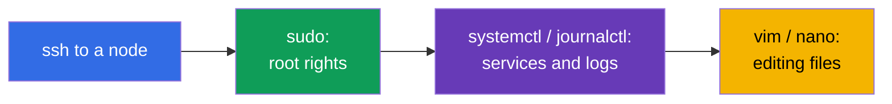
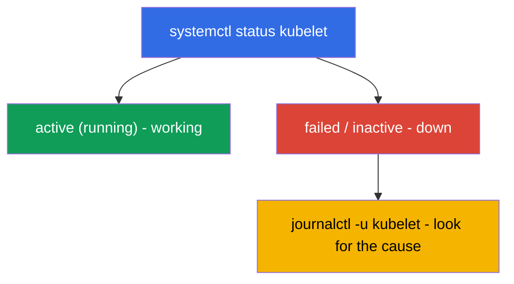

[Русская версия](ru.md) · [Versión en español](es.md) · [Version française](fr.md) · [Deutsche Version](de.md) · [ქართული ვერსია](ge.md) · [繁體中文版](tw.md) · [日本語版](jp.md)

# Chapter 0.5. Linux and node tools from scratch: SSH, sudo, systemd, logs, files

> **Who this chapter is for.** Part 0, a foundation for beginners. The CKA exam and half
> the labs are work **on the nodes themselves** over SSH: bring up a cluster, fix the
> kubelet, take an etcd snapshot, edit a manifest. If you confidently move around over
> SSH, use `sudo`, read logs with `journalctl`, and edit files in `vim`/`nano` - go
> straight to Chapter 0.6. But if the Linux command line still scares you, spend half
> an hour here: without these skills the most valuable CKA labs (111, 112, 116, 117,
> 118) stall not because of Kubernetes, but because of Linux.

## 0.5.1. Why this is in a Kubernetes course

CKAD mostly lives in `kubectl`, but CKA (the Installation 25% and Troubleshooting 30%
domains) forces you to **get onto the nodes**: the control plane components are files in
`/etc/kubernetes/`, the kubelet is a system service, the logs are in `journalctl`, and
`kubectl` is useless when the API server is down. All of this is ordinary Linux.



## 0.5.2. SSH: how to get onto a node

**SSH** (Secure Shell) is a secure login to a remote machine over the network. In the
labs you log into a work machine, and from there onto the cluster nodes:

```bash
ssh user@node          # log into machine node as user user
ssh node               # if the node name is set in the config (as in the labs)
exit                   # go back to the previous machine
```

> **Important for CKA.** After working on a node, **don't forget to return** to "your"
> machine (`exit`), otherwise the next `kubectl` commands will go to the wrong place. A
> common time sink on the exam is "why isn't this working", while you're still on
> another node.

## 0.5.3. sudo: commands as root

Much on a node requires administrator (root) rights: reading certificates, editing
system files, restarting services. That's what **`sudo`** is for (run a command as
root):

```bash
sudo cat /etc/kubernetes/manifests/etcd.yaml   # read a protected file
sudo systemctl restart kubelet                 # restart the service
sudo -i                                         # become root for the whole session
```

The sign that you need `sudo` is a **`Permission denied`** error. On exam nodes `sudo`
usually works without a password.

## 0.5.4. systemd: the cluster services

**systemd** is the system that starts and watches over background services (daemons) in
Linux. The **`systemctl`** command manages them. For Kubernetes the key service is the
**kubelet** (the agent on every node); **containerd** (the runtime) also matters.

```bash
systemctl status kubelet        # is the service running (active/failed)
sudo systemctl restart kubelet  # restart
sudo systemctl enable kubelet   # autostart at boot
sudo systemctl daemon-reload    # re-read changed unit files
```



It's exactly the chain "status → failed → check the logs → fix it" that is the basis of
node troubleshooting (lab 117, Chapter 45).

## 0.5.5. journalctl: where to read the logs

The logs of systemd services live in journald and are read via **`journalctl`**:

```bash
journalctl -u kubelet                 # all kubelet logs
journalctl -u kubelet -f              # follow in real time (follow)
journalctl -u kubelet --no-pager | tail -50   # the last lines
journalctl -u kubelet --since "5 min ago"     # over the last 5 minutes
```

The kubelet logs are the **main source** of reasons why a node is `NotReady` or a pod
won't start. You must be able to read them by heart.

## 0.5.6. Editing files: vim and nano

On a node you edit manifests and configs with a text editor. The survival minimum for
**`vim`** (it's everywhere):

| Action | Keys |
|--------|------|
| enter insert mode | `i` |
| exit insert mode | `Esc` |
| save and quit | `Esc`, then `:wq`, Enter |
| quit without saving | `Esc`, then `:q!`, Enter |

If **`nano`** is available - it's simpler: arrows to navigate, `Ctrl+O` to save, `Ctrl+X`
to quit. The choice of editor is set by the `KUBE_EDITOR` variable (for `kubectl edit`):

```bash
export KUBE_EDITOR=nano   # so kubectl edit opens nano instead of vim
```

## 0.5.7. The filesystem and paths you need to know

Linux is a tree from the root `/`. A few paths come up in every CKA task:

| Path | What's there |
|------|--------------|
| `/etc/kubernetes/manifests/` | static pods control plane (apiserver, etcd, scheduler, cm) |
| `/etc/kubernetes/*.conf` | component kubeconfigs |
| `/etc/kubernetes/pki/` | cluster certificates and keys |
| `/var/lib/etcd/` | etcd data |
| `/var/lib/kubelet/` | kubelet data and config |
| `/var/log/` | system logs |

Basic navigation: `cd` (go there), `ls -l` (a detailed listing), `pwd` (where am I),
`cat`/`less` (view a file), `cp`/`mv`/`rm` (copy/move/delete), `find` (search).

## 0.5.8. Processes, ports, and networking on a node

Sometimes you need to figure out what is actually running on a node and listening on a
port:

```bash
ps aux | grep kube             # processes
sudo ss -ltnp | grep 6443      # who is listening on port 6443 (apiserver)
sudo crictl ps                 # containers on the node (when kubectl is unavailable, Chapter 40)
curl -k https://localhost:6443/healthz   # is the apiserver alive locally
```

`crictl` (not `docker`!) is the way to see the containers on a node directly, bypassing
the API - which saves you when `kubectl` is dead (lab 117, Chapter 45).

## 0.5.9. How this is applied in production

- **On-call on the nodes.** When "everything is down", the engineer goes over SSH to a
  node and works with exactly these tools: `systemctl status`, `journalctl`, `crictl`,
  editing manifests. This is a basic on-call skill.
- **Automation on top of the manual.** In production, node preparation (swap, modules,
  containerd, kube*) is done with Ansible/images, but understanding what the script does
  by hand is a must - otherwise you can't fix it when the automation fails.
- **Security of sudo and keys.** SSH-key access, `sudo` under audit, least privilege -
  the operational standard. Private keys and `/etc/kubernetes/pki` are guarded
  especially carefully.
- **Logs are the first step of diagnosis.** `journalctl -u kubelet` and component logs
  via `crictl` are where the investigation of almost any node incident begins.

## 0.5.10. Mini-glossary

- **SSH** - a secure login to a remote machine; `exit` - go back.
- **sudo** - run a command as root; `sudo -i` - become root for the session.
- **systemd / systemctl** - the service management system and the command for it.
- **kubelet** - the Kubernetes agent on a node (a system service).
- **journalctl** - reading the logs of systemd services (`-u <service>`, `-f` - follow).
- **unit / daemon** - a service description / a background process.
- **vim / nano** - text editors in the terminal.
- **KUBE_EDITOR** - the variable that sets the editor for `kubectl edit`.
- **crictl** - a CLI to the containers on a node via CRI (works without the API server).
- **ss / ps** - who is listening on ports / which processes are running.

## 0.5.11. Chapter summary

- CKA is largely work on the nodes over SSH; `kubectl` isn't always available there.
- `sudo` grants root rights; `Permission denied` is the signal that it's needed.
- systemd manages services: `systemctl status/restart kubelet`, `daemon-reload`.
- Service logs are read via `journalctl -u <service>` (`-f` - in real time); the kubelet
  logs are the main source of NotReady causes.
- Files are edited in vim (`i` → edit → `Esc` → `:wq`) or nano; know the paths
  `/etc/kubernetes/...`, `/var/lib/etcd`, `/var/lib/kubelet`.
- The containers on a node are viewed via `crictl` (not `docker`), ports - via `ss`.

## 0.5.12. How this helps: on the exam and in real work

**On the exam (CKA).** Cluster installation, upgrade, etcd backup, fixing the control
plane/nodes - all of it is done on the nodes with these commands. Being able to quickly
log in over SSH, raise privileges, read `journalctl`, edit a manifest, and return
directly saves minutes in the most expensive tasks (the 25% + 30% domains).

**In real work.** This is the operations foundation of any self-managed cluster: on-call
on the nodes, reading logs, restarting services, editing configs. Without it Kubernetes
remains a "black box" that there's no way to fix when the API is unavailable.

## 0.5.13. Self-check questions

1. How do you get onto a node over SSH, and why is it important to return afterwards?
2. When do you need `sudo`, and how do you tell that you lack rights?
3. How do you check the kubelet status and restart it? What does `daemon-reload` do?
4. Where do you look for the reason a node is `NotReady`?
5. How do you enter insert mode in vim, save, and quit?
6. Where are the control plane manifests, certificates, and etcd data located?
7. What do you view the containers on a node with when `kubectl` is unavailable?

## Practice

There's no separate lab for Part 0 - it's a foundation. You'll apply all these commands
by hand in the node labs: 111 (upgrade), 112 (etcd), 116 (install from scratch), 117
(control plane/node troubleshooting), 118 (certificates and networking). Next up - the
language of all manifests: YAML.

---
[Contents](../README.md) · [Chapter 0.4](../00-4-containers/README.md) · [Chapter 0.6](../00-6-yaml/README.md)
