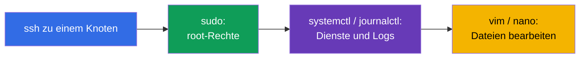
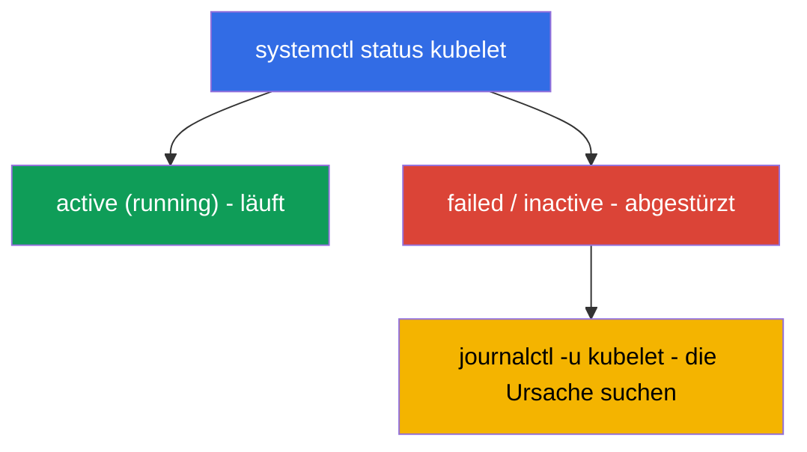

[Русская версия](ru.md) · [Eng version](README.md) · [Versión en español](es.md) · [Version française](fr.md) · [ქართული ვერსია](ge.md)

# Kapitel 0.5. Linux und Node-Werkzeuge von Grund auf: SSH, sudo, systemd, Logs, Dateien

> **Für wen dieses Kapitel ist.** Teil 0, ein Fundament für Einsteiger. Die CKA-Prüfung
> und die Hälfte der Übungen bestehen aus der Arbeit **auf den Knoten selbst** über SSH:
> einen Cluster hochfahren, den kubelet reparieren, einen etcd-Snapshot ziehen, ein
> Manifest korrigieren. Wenn Sie sich sicher über SSH bewegen, `sudo` verwenden, Logs
> mit `journalctl` lesen und Dateien in `vim`/`nano` bearbeiten - gehen Sie gleich zu
> Kapitel 0.6. Wenn Ihnen aber die Linux-Kommandozeile noch Angst macht, investieren Sie
> hier eine halbe Stunde: ohne diese Fertigkeiten hängen die für die CKA wertvollsten
> Übungen (111, 112, 116, 117, 118) nicht wegen Kubernetes, sondern wegen Linux.

## 0.5.1. Warum das in einem Kubernetes-Kurs steht

CKAD lebt hauptsächlich in `kubectl`, aber CKA (die Domänen Installation 25 % und
Troubleshooting 30 %) zwingt Sie, **auf die Knoten zu steigen**: die Control-Plane-
Komponenten sind Dateien in `/etc/kubernetes/`, der kubelet ist ein Systemdienst, die
Logs stehen in `journalctl`, und `kubectl` ist nutzlos, wenn der API-Server liegt. All
das ist gewöhnliches Linux.



## 0.5.2. SSH: wie man auf einen Knoten kommt

**SSH** (Secure Shell) ist eine sichere Anmeldung an einer entfernten Maschine über das
Netzwerk. In den Übungen melden Sie sich an einer Arbeitsmaschine an und von dort an den
Cluster-Knoten:

```bash
ssh user@node          # Anmeldung an der Maschine node als Benutzer user
ssh node               # wenn der Knotenname in der Config steht (wie in den Übungen)
exit                   # zurück zur vorherigen Maschine
```

> **Wichtig für die CKA.** Nach der Arbeit auf einem Knoten **vergessen Sie nicht, auf
> „Ihre“ Maschine zurückzukehren** (`exit`), sonst gehen die nächsten
> `kubectl`-Befehle an die falsche Stelle. Ein häufiger Zeitfresser in der Prüfung ist
> „warum funktioniert das nicht“, während Sie noch auf einem anderen Knoten sind.

## 0.5.3. sudo: Befehle als root

Vieles auf einem Knoten erfordert Administrator-Rechte (root): Zertifikate lesen,
Systemdateien bearbeiten, Dienste neu starten. Dafür gibt es **`sudo`** (einen Befehl
als root ausführen):

```bash
sudo cat /etc/kubernetes/manifests/etcd.yaml   # eine geschützte Datei lesen
sudo systemctl restart kubelet                 # den Dienst neu starten
sudo -i                                         # für die ganze Sitzung root werden
```

Das Zeichen dafür, dass Sie `sudo` brauchen, ist ein **`Permission denied`**-Fehler. Auf
Prüfungsknoten funktioniert `sudo` in der Regel ohne Passwort.

## 0.5.4. systemd: die Cluster-Dienste

**systemd** ist das System, das Hintergrunddienste (Daemons) unter Linux startet und
überwacht. Der Befehl **`systemctl`** verwaltet sie. Für Kubernetes ist der zentrale
Dienst der **kubelet** (der Agent auf jedem Knoten); auch **containerd** (das Runtime)
ist wichtig.

```bash
systemctl status kubelet        # läuft der Dienst (active/failed)
sudo systemctl restart kubelet  # neu starten
sudo systemctl enable kubelet   # Autostart beim Booten
sudo systemctl daemon-reload    # geänderte unit-Dateien neu einlesen
```



Genau die Kette „status → failed → Logs ansehen → reparieren“ ist die Grundlage des
Node-Troubleshootings (Übung 117, Kapitel 45).

## 0.5.5. journalctl: wo man die Logs liest

Die Logs der systemd-Dienste liegen in journald und werden über **`journalctl`**
gelesen:

```bash
journalctl -u kubelet                 # alle kubelet-Logs
journalctl -u kubelet -f              # in Echtzeit verfolgen (follow)
journalctl -u kubelet --no-pager | tail -50   # die letzten Zeilen
journalctl -u kubelet --since "5 min ago"     # die letzten 5 Minuten
```

Die kubelet-Logs sind die **Hauptquelle** der Ursachen dafür, warum ein Knoten
`NotReady` ist oder ein Pod nicht startet. Man muss sie aus dem Effeff lesen können.

## 0.5.6. Dateien bearbeiten: vim und nano

Auf einem Knoten bearbeitet man Manifeste und Configs mit einem Texteditor. Das
Überlebensminimum in **`vim`** (er ist überall vorhanden):

| Aktion | Tasten |
|--------|--------|
| in den Einfügemodus wechseln | `i` |
| den Einfügemodus verlassen | `Esc` |
| speichern und beenden | `Esc`, dann `:wq`, Enter |
| ohne Speichern beenden | `Esc`, dann `:q!`, Enter |

Wenn **`nano`** verfügbar ist - er ist einfacher: Pfeiltasten zum Navigieren, `Ctrl+O`
zum Speichern, `Ctrl+X` zum Beenden. Die Wahl des Editors legt die Variable
`KUBE_EDITOR` fest (für `kubectl edit`):

```bash
export KUBE_EDITOR=nano   # damit kubectl edit nano statt vim öffnet
```

## 0.5.7. Das Dateisystem und die Pfade, die man kennen muss

Linux ist ein Baum ab der Wurzel `/`. Einige Pfade kommen in jeder CKA-Aufgabe vor:

| Pfad | Was dort ist |
|------|--------------|
| `/etc/kubernetes/manifests/` | static pods control plane (apiserver, etcd, scheduler, cm) |
| `/etc/kubernetes/*.conf` | kubeconfigs der Komponenten |
| `/etc/kubernetes/pki/` | Zertifikate und Schlüssel des Clusters |
| `/var/lib/etcd/` | etcd-Daten |
| `/var/lib/kubelet/` | kubelet-Daten und -Config |
| `/var/log/` | Systemlogs |

Grundlegende Navigation: `cd` (wechseln), `ls -l` (Liste mit Details), `pwd` (wo bin
ich), `cat`/`less` (eine Datei ansehen), `cp`/`mv`/`rm`
(kopieren/verschieben/löschen), `find` (suchen).

## 0.5.8. Prozesse, Ports und Netzwerk auf einem Knoten

Manchmal muss man verstehen, was auf einem Knoten tatsächlich läuft und auf einem Port
lauscht:

```bash
ps aux | grep kube             # Prozesse
sudo ss -ltnp | grep 6443      # wer auf Port 6443 lauscht (apiserver)
sudo crictl ps                 # Container auf dem Knoten (wenn kubectl nicht verfügbar ist, Kapitel 40)
curl -k https://localhost:6443/healthz   # ist der apiserver lokal am Leben
```

`crictl` (nicht `docker`!) ist der Weg, die Container auf einem Knoten direkt zu sehen,
unter Umgehung der API - was Sie rettet, wenn `kubectl` tot ist (Übung 117, Kapitel 45).

## 0.5.9. Wie das in der Produktion angewendet wird

- **Bereitschaftsdienst auf den Knoten.** Wenn „alles liegt“, geht der Ingenieur über
  SSH auf einen Knoten und arbeitet genau mit diesen Werkzeugen: `systemctl status`,
  `journalctl`, `crictl`, dem Bearbeiten von Manifesten. Das ist eine grundlegende
  On-Call-Fertigkeit.
- **Automatisierung über dem Manuellen.** In der Produktion erfolgt die Vorbereitung der
  Knoten (Swap, Module, containerd, kube*) mit Ansible/Images, aber zu verstehen, was
  das Skript von Hand macht, ist Pflicht - sonst kann man es nicht reparieren, wenn die
  Automatisierung versagt.
- **Sicherheit von sudo und Schlüsseln.** Zugriff per SSH-Schlüssel, `sudo` unter Audit,
  minimale Rechte - der Betriebsstandard. Private Schlüssel und `/etc/kubernetes/pki`
  werden besonders sorgfältig gehütet.
- **Logs sind der erste Schritt der Diagnose.** `journalctl -u kubelet` und die
  Komponentenlogs über `crictl` sind das, womit die Analyse fast jedes Vorfalls auf
  einem Knoten beginnt.

## 0.5.10. Mini-Glossar

- **SSH** - sichere Anmeldung an einer entfernten Maschine; `exit` - zurückkehren.
- **sudo** - einen Befehl als root ausführen; `sudo -i` - für die Sitzung root werden.
- **systemd / systemctl** - das Dienstverwaltungssystem und der Befehl dazu.
- **kubelet** - der Kubernetes-Agent auf einem Knoten (ein Systemdienst).
- **journalctl** - Lesen der Logs von systemd-Diensten (`-u <Dienst>`, `-f` - verfolgen).
- **unit / daemon** - die Beschreibung eines Dienstes / ein Hintergrundprozess.
- **vim / nano** - Texteditoren im Terminal.
- **KUBE_EDITOR** - die Variable, die den Editor für `kubectl edit` festlegt.
- **crictl** - eine CLI zu den Containern auf einem Knoten über CRI (funktioniert ohne
  API-Server).
- **ss / ps** - wer auf Ports lauscht / welche Prozesse laufen.

## 0.5.11. Zusammenfassung des Kapitels

- CKA ist zum großen Teil Arbeit auf den Knoten über SSH; `kubectl` ist dort nicht immer
  verfügbar.
- `sudo` gibt root-Rechte; `Permission denied` ist das Signal, dass es nötig ist.
- systemd verwaltet die Dienste: `systemctl status/restart kubelet`, `daemon-reload`.
- Die Dienstlogs werden über `journalctl -u <Dienst>` gelesen (`-f` - in Echtzeit); die
  kubelet-Logs sind die Hauptquelle der NotReady-Ursachen.
- Dateien werden in vim (`i` → bearbeiten → `Esc` → `:wq`) oder nano bearbeitet; kennen
  Sie die Pfade `/etc/kubernetes/...`, `/var/lib/etcd`, `/var/lib/kubelet`.
- Die Container auf einem Knoten sieht man über `crictl` (nicht `docker`), die Ports -
  über `ss`.

## 0.5.12. Wozu das nützt: in der Prüfung und im echten Arbeitsalltag

**In der Prüfung (CKA).** Cluster-Installation, Upgrade, etcd-Backup, Reparatur des
Control Plane/der Knoten - all das wird auf den Knoten mit diesen Befehlen erledigt. Sich
schnell über SSH anmelden, die Rechte erhöhen, `journalctl` lesen, ein Manifest
korrigieren und zurückkehren zu können, spart direkt Minuten in den teuersten Aufgaben
(die Domänen 25 % + 30 %).

**Im echten Arbeitsalltag.** Das ist das Betriebsfundament jedes selbstverwalteten
Clusters: Bereitschaftsdienst auf den Knoten, Logs lesen, Dienste neu starten, Configs
bearbeiten. Ohne es bleibt Kubernetes eine „Blackbox“, die es nichts zu reparieren gibt,
wenn die API nicht verfügbar ist.

## 0.5.13. Fragen zur Selbstüberprüfung

1. Wie meldet man sich über SSH an einem Knoten an, und warum ist es wichtig, danach
   zurückzukehren?
2. Wann braucht man `sudo`, und woran erkennt man, dass die Rechte fehlen?
3. Wie prüft man den kubelet-Status und startet ihn neu? Was macht `daemon-reload`?
4. Wo sucht man die Ursache dafür, dass ein Knoten `NotReady` ist?
5. Wie wechselt man in vim in den Einfügemodus, speichert und beendet?
6. Wo liegen die Control-Plane-Manifeste, die Zertifikate und die etcd-Daten?
7. Womit sieht man die Container auf einem Knoten, wenn `kubectl` nicht verfügbar ist?

## Praxis

Für Teil 0 gibt es keine eigene Übung - es ist ein Fundament. All diese Befehle wenden
Sie von Hand in den Node-Übungen an: 111 (Upgrade), 112 (etcd), 116 (Installation von
Grund auf), 117 (Control-Plane-/Node-Troubleshooting), 118 (Zertifikate und Netzwerk).
Als Nächstes - die Sprache aller Manifeste: YAML.

---
[Inhalt](../README_DE.md) · [Kapitel 0.4](../00-4-containers/de.md) · [Kapitel 0.6](../00-6-yaml/de.md)
