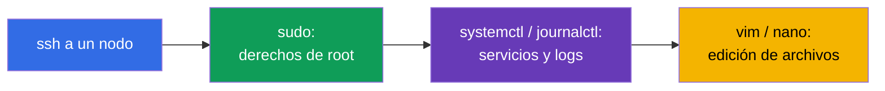
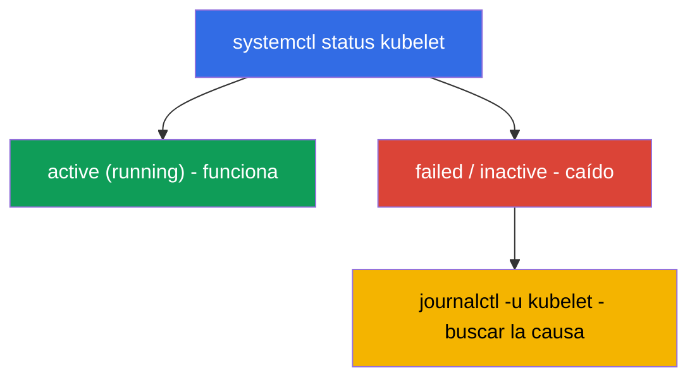

[Русская версия](ru.md) · [Eng version](README.md) · [Version française](fr.md) · [Deutsche Version](de.md) · [ქართული ვერსია](ge.md) · [繁體中文版](tw.md) · [日本語版](jp.md)

# Capítulo 0.5. Linux y las herramientas del nodo desde cero: SSH, sudo, systemd, logs, archivos

> **Para quién es este capítulo.** Parte 0, la base para principiantes. El examen CKA y
> la mitad de las prácticas son trabajo **en los propios nodos** por SSH: levantar un
> clúster, arreglar el kubelet, tomar un snapshot de etcd, corregir un manifiesto. Si te
> mueves con soltura por SSH, usas `sudo`, lees los logs con `journalctl` y editas
> archivos en `vim`/`nano` - ve directo al Capítulo 0.6. Pero si la línea de comandos de
> Linux todavía te asusta, dedica aquí media hora: sin estas destrezas las prácticas más
> valiosas para el CKA (111, 112, 116, 117, 118) se atascan no por Kubernetes, sino por
> Linux.

## 0.5.1. Por qué esto está en un curso de Kubernetes

CKAD vive sobre todo en `kubectl`, pero CKA (los dominios Installation 25% y
Troubleshooting 30%) te obliga a **meterte en los nodos**: los componentes del control
plane son archivos en `/etc/kubernetes/`, el kubelet es un servicio del sistema, los
logs están en `journalctl`, y `kubectl` es inútil cuando el servidor de API está caído.
Todo esto es Linux corriente.



## 0.5.2. SSH: cómo llegar a un nodo

**SSH** (Secure Shell) es un acceso seguro a una máquina remota por la red. En las
prácticas entras en una máquina de trabajo y, desde ella, en los nodos del clúster:

```bash
ssh user@node          # entrar en la máquina node con el usuario user
ssh node               # si el nombre del nodo está en el config (como en las prácticas)
exit                   # volver a la máquina anterior
```

> **Importante para el CKA.** Después de trabajar en un nodo, **no olvides volver** a
> "tu" máquina (`exit`), o los siguientes comandos `kubectl` irán al lugar equivocado.
> Una pérdida de tiempo frecuente en el examen es "por qué no funciona", mientras sigues
> en otro nodo.

## 0.5.3. sudo: comandos como root

Muchas cosas en un nodo requieren derechos de administrador (root): leer certificados,
editar archivos del sistema, reiniciar servicios. Para eso está **`sudo`** (ejecutar un
comando como root):

```bash
sudo cat /etc/kubernetes/manifests/etcd.yaml   # leer un archivo protegido
sudo systemctl restart kubelet                 # reiniciar el servicio
sudo -i                                         # ser root durante toda la sesión
```

La señal de que necesitas `sudo` es un error **`Permission denied`**. En los nodos del
examen `sudo` suele funcionar sin contraseña.

## 0.5.4. systemd: los servicios del clúster

**systemd** es el sistema que arranca y vigila los servicios en segundo plano (demonios)
en Linux. Los gestiona el comando **`systemctl`**. Para Kubernetes el servicio clave es
el **kubelet** (el agente en cada nodo); también importa **containerd** (el runtime).

```bash
systemctl status kubelet        # si el servicio funciona (active/failed)
sudo systemctl restart kubelet  # reiniciar
sudo systemctl enable kubelet   # autoarranque al iniciar
sudo systemctl daemon-reload    # releer los archivos unit modificados
```



Precisamente la cadena "status → failed → miramos los logs → arreglamos" es la base del
troubleshooting del nodo (práctica 117, Capítulo 45).

## 0.5.5. journalctl: dónde leer los logs

Los logs de los servicios de systemd están en journald y se leen con **`journalctl`**:

```bash
journalctl -u kubelet                 # todos los logs del kubelet
journalctl -u kubelet -f              # seguir en tiempo real (follow)
journalctl -u kubelet --no-pager | tail -50   # las últimas líneas
journalctl -u kubelet --since "5 min ago"     # los últimos 5 minutos
```

Los logs del kubelet son la **fuente principal** de las causas de por qué un nodo está
`NotReady` o un pod no arranca. Hay que saber leerlos de memoria.

## 0.5.6. Edición de archivos: vim y nano

En un nodo los manifiestos y configs se editan con un editor de texto. El mínimo para
sobrevivir en **`vim`** (está en todas partes):

| Acción | Teclas |
|--------|--------|
| entrar en modo inserción | `i` |
| salir del modo inserción | `Esc` |
| guardar y salir | `Esc`, luego `:wq`, Enter |
| salir sin guardar | `Esc`, luego `:q!`, Enter |

Si está disponible **`nano`** - es más sencillo: flechas para navegar, `Ctrl+O` para
guardar, `Ctrl+X` para salir. La elección del editor la fija la variable `KUBE_EDITOR`
(para `kubectl edit`):

```bash
export KUBE_EDITOR=nano   # para que kubectl edit abra nano en vez de vim
```

## 0.5.7. El sistema de archivos y las rutas que hay que conocer

Linux es un árbol desde la raíz `/`. Varias rutas aparecen en cada tarea del CKA:

| Ruta | Qué hay ahí |
|------|-------------|
| `/etc/kubernetes/manifests/` | static pods control plane (apiserver, etcd, scheduler, cm) |
| `/etc/kubernetes/*.conf` | kubeconfigs de los componentes |
| `/etc/kubernetes/pki/` | certificados y claves del clúster |
| `/var/lib/etcd/` | datos de etcd |
| `/var/lib/kubelet/` | datos y config del kubelet |
| `/var/log/` | logs del sistema |

Navegación básica: `cd` (ir), `ls -l` (listado con detalles), `pwd` (dónde estoy),
`cat`/`less` (ver un archivo), `cp`/`mv`/`rm` (copiar/mover/borrar), `find` (buscar).

## 0.5.8. Procesos, puertos y red en un nodo

A veces hay que entender qué está funcionando realmente en un nodo y qué escucha en un
puerto:

```bash
ps aux | grep kube             # procesos
sudo ss -ltnp | grep 6443      # quién escucha en el puerto 6443 (apiserver)
sudo crictl ps                 # contenedores del nodo (cuando kubectl no está disponible, Capítulo 40)
curl -k https://localhost:6443/healthz   # si el apiserver está vivo localmente
```

`crictl` (¡no `docker`!) es la forma de ver los contenedores de un nodo directamente,
sin pasar por la API - lo que te salva cuando `kubectl` está muerto (práctica 117,
Capítulo 45).

## 0.5.9. Cómo se aplica esto en producción

- **Guardia en los nodos.** Cuando "todo se cae", el ingeniero entra por SSH en un nodo
  y trabaja justo con estas herramientas: `systemctl status`, `journalctl`, `crictl`,
  edición de manifiestos. Es una destreza básica de on-call.
- **Automatización sobre lo manual.** En producción la preparación de los nodos (swap,
  módulos, containerd, kube*) se hace con Ansible/imágenes, pero entender lo que el
  script hace a mano es obligatorio - si no, no lo arreglas cuando la automatización
  falla.
- **Seguridad de sudo y las claves.** Acceso por claves SSH, `sudo` bajo auditoría,
  mínimo de privilegios - el estándar de explotación. Las claves privadas y
  `/etc/kubernetes/pki` se cuidan de forma especial.
- **Los logs son el primer paso del diagnóstico.** `journalctl -u kubelet` y los logs de
  los componentes vía `crictl` son con lo que empieza el análisis de casi cualquier
  incidente en un nodo.

## 0.5.10. Miniglosario

- **SSH** - acceso seguro a una máquina remota; `exit` - volver atrás.
- **sudo** - ejecutar un comando como root; `sudo -i` - ser root durante la sesión.
- **systemd / systemctl** - el sistema de gestión de servicios y el comando para él.
- **kubelet** - el agente de Kubernetes en un nodo (un servicio del sistema).
- **journalctl** - lectura de los logs de los servicios de systemd (`-u <servicio>`,
  `-f` - seguir).
- **unit / daemon** - la descripción de un servicio / un proceso en segundo plano.
- **vim / nano** - editores de texto en el terminal.
- **KUBE_EDITOR** - la variable que fija el editor para `kubectl edit`.
- **crictl** - una CLI a los contenedores de un nodo vía CRI (funciona sin el servidor
  de API).
- **ss / ps** - quién escucha en los puertos / qué procesos están en ejecución.

## 0.5.11. Resumen del capítulo

- CKA es en buena parte trabajo en los nodos por SSH; `kubectl` no siempre está
  disponible ahí.
- `sudo` da derechos de root; `Permission denied` es la señal de que hace falta.
- systemd gestiona los servicios: `systemctl status/restart kubelet`, `daemon-reload`.
- Los logs de los servicios se leen con `journalctl -u <servicio>` (`-f` - en tiempo
  real); los logs del kubelet son la fuente principal de las causas de NotReady.
- Los archivos se editan en vim (`i` → editar → `Esc` → `:wq`) o nano; conoce las rutas
  `/etc/kubernetes/...`, `/var/lib/etcd`, `/var/lib/kubelet`.
- Los contenedores de un nodo se miran con `crictl` (no `docker`), los puertos - con
  `ss`.

## 0.5.12. Para qué sirve: en el examen y en el trabajo real

**En el examen (CKA).** La instalación del clúster, la actualización, el backup de etcd,
la reparación del control plane/nodos - todo se hace en los nodos con estos comandos.
Saber entrar rápido por SSH, elevar privilegios, leer `journalctl`, corregir un
manifiesto y volver atrás ahorra directamente minutos en las tareas más caras (los
dominios 25% + 30%).

**En el trabajo real.** Es la base de la explotación de cualquier clúster
self-managed: on-call en los nodos, lectura de logs, reinicio de servicios, edición de
configs. Sin ella Kubernetes sigue siendo una "caja negra" que no hay con qué arreglar
cuando la API no está disponible.

## 0.5.13. Preguntas de autoevaluación

1. ¿Cómo se entra en un nodo por SSH y por qué es importante volver atrás después?
2. ¿Cuándo hace falta `sudo` y cómo se sabe que faltan permisos?
3. ¿Cómo se comprueba el estado del kubelet y se reinicia? ¿Qué hace `daemon-reload`?
4. ¿Dónde se busca la causa de por qué un nodo está `NotReady`?
5. ¿Cómo se entra en modo inserción en vim, se guarda y se sale?
6. ¿Dónde están los manifiestos del control plane, los certificados y los datos de etcd?
7. ¿Con qué se miran los contenedores de un nodo cuando `kubectl` no está disponible?

## Práctica

No hay una práctica aparte para la Parte 0 - es una base. Todos estos comandos los
aplicarás a mano en las prácticas de nodos: 111 (actualización), 112 (etcd), 116
(instalación desde cero), 117 (troubleshooting del control plane/nodos), 118
(certificados y red). A continuación - el idioma de todos los manifiestos: YAML.

---
[Índice](../README_ES.md) · [Capítulo 0.4](../00-4-containers/es.md) · [Capítulo 0.6](../00-6-yaml/es.md)
