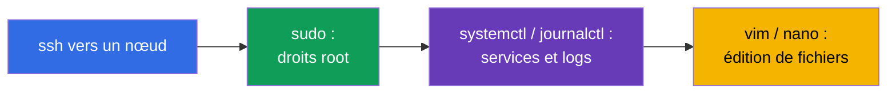
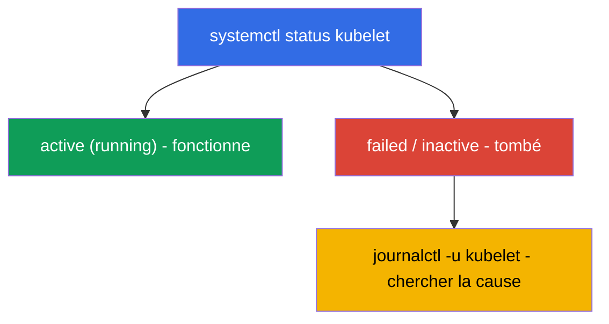

[Русская версия](ru.md) · [Eng version](README.md) · [Versión en español](es.md) · [Deutsche Version](de.md) · [ქართული ვერსია](ge.md)

# Chapitre 0.5. Linux et les outils du nœud depuis zéro : SSH, sudo, systemd, logs, fichiers

> **À qui s'adresse ce chapitre.** Partie 0, une base pour les débutants. L'examen CKA et
> la moitié des TP consistent à travailler **sur les nœuds eux-mêmes** en SSH : monter un
> cluster, réparer le kubelet, prendre un snapshot d'etcd, corriger un manifeste. Si vous
> vous déplacez avec aisance en SSH, utilisez `sudo`, lisez les logs avec `journalctl` et
> éditez des fichiers dans `vim`/`nano` - filez droit au Chapitre 0.6. Mais si la ligne
> de commande Linux vous fait encore peur, passez une demi-heure ici : sans ces
> compétences, les TP CKA les plus précieux (111, 112, 116, 117, 118) coincent non pas à
> cause de Kubernetes, mais à cause de Linux.

## 0.5.1. Pourquoi c'est dans un cours Kubernetes

CKAD vit surtout dans `kubectl`, mais CKA (les domaines Installation 25 % et
Troubleshooting 30 %) vous force à **monter sur les nœuds** : les composants du control
plane sont des fichiers dans `/etc/kubernetes/`, le kubelet est un service système, les
logs sont dans `journalctl`, et `kubectl` est inutile quand le serveur d'API est à
terre. Tout cela, c'est du Linux ordinaire.



## 0.5.2. SSH : comment arriver sur un nœud

**SSH** (Secure Shell) est une connexion sécurisée à une machine distante par le réseau.
Dans les TP, vous vous connectez à une machine de travail, et depuis elle aux nœuds du
cluster :

```bash
ssh user@node          # se connecter à la machine node en tant qu'utilisateur user
ssh node               # si le nom du nœud est dans la config (comme dans les TP)
exit                   # revenir à la machine précédente
```

> **Important pour le CKA.** Après avoir travaillé sur un nœud, **n'oubliez pas de
> revenir** sur « votre » machine (`exit`), sinon les commandes `kubectl` suivantes
> iront au mauvais endroit. Une perte de temps fréquente à l'examen, c'est « pourquoi ça
> ne marche pas », alors que vous êtes encore sur un autre nœud.

## 0.5.3. sudo : les commandes en tant que root

Beaucoup de choses sur un nœud exigent les droits d'administrateur (root) : lire les
certificats, éditer les fichiers système, redémarrer les services. C'est à ça que sert
**`sudo`** (exécuter une commande en tant que root) :

```bash
sudo cat /etc/kubernetes/manifests/etcd.yaml   # lire un fichier protégé
sudo systemctl restart kubelet                 # redémarrer le service
sudo -i                                         # devenir root pour toute la session
```

Le signe qu'il faut `sudo`, c'est une erreur **`Permission denied`**. Sur les nœuds
d'examen, `sudo` fonctionne généralement sans mot de passe.

## 0.5.4. systemd : les services du cluster

**systemd** est le système qui démarre et surveille les services en arrière-plan
(démons) sous Linux. La commande **`systemctl`** les gère. Pour Kubernetes, le service
clé est le **kubelet** (l'agent sur chaque nœud) ; **containerd** (le runtime) compte
aussi.

```bash
systemctl status kubelet        # le service fonctionne-t-il (active/failed)
sudo systemctl restart kubelet  # redémarrer
sudo systemctl enable kubelet   # démarrage auto au boot
sudo systemctl daemon-reload    # relire les fichiers unit modifiés
```



C'est justement la chaîne « status → failed → on regarde les logs → on répare » qui est
la base du troubleshooting du nœud (TP 117, Chapitre 45).

## 0.5.5. journalctl : où lire les logs

Les logs des services systemd se trouvent dans journald et se lisent via
**`journalctl`** :

```bash
journalctl -u kubelet                 # tous les logs du kubelet
journalctl -u kubelet -f              # suivre en temps réel (follow)
journalctl -u kubelet --no-pager | tail -50   # les dernières lignes
journalctl -u kubelet --since "5 min ago"     # les 5 dernières minutes
```

Les logs du kubelet sont la **source principale** des raisons pour lesquelles un nœud
est `NotReady` ou un pod ne démarre pas. Il faut savoir les lire par cœur.

## 0.5.6. Édition de fichiers : vim et nano

Sur un nœud, les manifestes et les configs s'éditent avec un éditeur de texte. Le
minimum de survie dans **`vim`** (il est partout) :

| Action | Touches |
|--------|---------|
| entrer en mode insertion | `i` |
| sortir du mode insertion | `Esc` |
| enregistrer et quitter | `Esc`, puis `:wq`, Entrée |
| quitter sans enregistrer | `Esc`, puis `:q!`, Entrée |

Si **`nano`** est disponible - il est plus simple : les flèches pour naviguer, `Ctrl+O`
pour enregistrer, `Ctrl+X` pour quitter. Le choix de l'éditeur est fixé par la variable
`KUBE_EDITOR` (pour `kubectl edit`) :

```bash
export KUBE_EDITOR=nano   # pour que kubectl edit ouvre nano au lieu de vim
```

## 0.5.7. Le système de fichiers et les chemins à connaître

Linux est un arbre depuis la racine `/`. Plusieurs chemins reviennent dans chaque tâche
du CKA :

| Chemin | Ce qu'il y a |
|--------|--------------|
| `/etc/kubernetes/manifests/` | static pods control plane (apiserver, etcd, scheduler, cm) |
| `/etc/kubernetes/*.conf` | kubeconfigs des composants |
| `/etc/kubernetes/pki/` | certificats et clés du cluster |
| `/var/lib/etcd/` | données d'etcd |
| `/var/lib/kubelet/` | données et config du kubelet |
| `/var/log/` | logs système |

Navigation de base : `cd` (aller), `ls -l` (liste détaillée), `pwd` (où suis-je),
`cat`/`less` (voir un fichier), `cp`/`mv`/`rm` (copier/déplacer/supprimer), `find`
(chercher).

## 0.5.8. Processus, ports et réseau sur un nœud

Parfois, il faut comprendre ce qui tourne réellement sur un nœud et ce qui écoute sur un
port :

```bash
ps aux | grep kube             # processus
sudo ss -ltnp | grep 6443      # qui écoute sur le port 6443 (apiserver)
sudo crictl ps                 # conteneurs du nœud (quand kubectl est indisponible, Chapitre 40)
curl -k https://localhost:6443/healthz   # l'apiserver est-il vivant en local
```

`crictl` (pas `docker` !) est le moyen de voir les conteneurs d'un nœud directement, en
contournant l'API - ce qui vous sauve quand `kubectl` est mort (TP 117, Chapitre 45).

## 0.5.9. Comment cela s'applique en production

- **Astreinte sur les nœuds.** Quand « tout est tombé », l'ingénieur se connecte en SSH
  à un nœud et travaille exactement avec ces outils : `systemctl status`, `journalctl`,
  `crictl`, l'édition des manifestes. C'est une compétence d'astreinte de base.
- **Automatisation par-dessus le manuel.** En production, la préparation des nœuds (swap,
  modules, containerd, kube*) se fait avec Ansible/des images, mais comprendre ce que le
  script fait à la main est indispensable - sinon impossible de réparer quand
  l'automatisation flanche.
- **Sécurité de sudo et des clés.** Accès par clés SSH, `sudo` sous audit, minimum de
  privilèges - le standard d'exploitation. Les clés privées et `/etc/kubernetes/pki` se
  protègent tout particulièrement.
- **Les logs sont la première étape du diagnostic.** `journalctl -u kubelet` et les logs
  des composants via `crictl` sont ce par quoi commence l'analyse de presque tout
  incident sur un nœud.

## 0.5.10. Mini-glossaire

- **SSH** - connexion sécurisée à une machine distante ; `exit` - revenir en arrière.
- **sudo** - exécuter une commande en tant que root ; `sudo -i` - devenir root pour la
  session.
- **systemd / systemctl** - le système de gestion des services et la commande associée.
- **kubelet** - l'agent Kubernetes sur un nœud (un service système).
- **journalctl** - lecture des logs des services systemd (`-u <service>`, `-f` -
  suivre).
- **unit / daemon** - la description d'un service / un processus en arrière-plan.
- **vim / nano** - éditeurs de texte dans le terminal.
- **KUBE_EDITOR** - la variable qui fixe l'éditeur pour `kubectl edit`.
- **crictl** - une CLI vers les conteneurs d'un nœud via CRI (fonctionne sans le serveur
  d'API).
- **ss / ps** - qui écoute sur les ports / quels processus sont lancés.

## 0.5.11. Récapitulatif du chapitre

- CKA, c'est en grande partie du travail sur les nœuds en SSH ; `kubectl` n'y est pas
  toujours disponible.
- `sudo` donne les droits root ; `Permission denied` est le signal qu'il est nécessaire.
- systemd gère les services : `systemctl status/restart kubelet`, `daemon-reload`.
- Les logs des services se lisent via `journalctl -u <service>` (`-f` - en temps réel) ;
  les logs du kubelet sont la source principale des causes de NotReady.
- Les fichiers s'éditent dans vim (`i` → édition → `Esc` → `:wq`) ou nano ; connaissez
  les chemins `/etc/kubernetes/...`, `/var/lib/etcd`, `/var/lib/kubelet`.
- Les conteneurs d'un nœud se regardent avec `crictl` (pas `docker`), les ports - avec
  `ss`.

## 0.5.12. À quoi cela sert : à l'examen et dans le travail réel

**À l'examen (CKA).** L'installation du cluster, la mise à niveau, la sauvegarde d'etcd,
la réparation du control plane/des nœuds - tout se fait sur les nœuds avec ces commandes.
Savoir se connecter vite en SSH, élever les privilèges, lire `journalctl`, corriger un
manifeste et revenir en arrière fait directement gagner des minutes dans les tâches les
plus chères (les domaines 25 % + 30 %).

**Dans le travail réel.** C'est la base de l'exploitation de tout cluster self-managed :
astreinte sur les nœuds, lecture des logs, redémarrage des services, édition des configs.
Sans elle, Kubernetes reste une « boîte noire » qu'on n'a aucun moyen de réparer quand
l'API est indisponible.

## 0.5.13. Questions d'auto-évaluation

1. Comment se connecter à un nœud en SSH et pourquoi est-il important de revenir ensuite ?
2. Quand a-t-on besoin de `sudo` et comment savoir que les droits manquent ?
3. Comment vérifier l'état du kubelet et le redémarrer ? Que fait `daemon-reload` ?
4. Où chercher la cause pour laquelle un nœud est `NotReady` ?
5. Comment entrer en mode insertion dans vim, enregistrer et quitter ?
6. Où se trouvent les manifestes du control plane, les certificats et les données
   d'etcd ?
7. Avec quoi regarde-t-on les conteneurs d'un nœud quand `kubectl` est indisponible ?

## Pratique

Il n'y a pas de TP à part pour la Partie 0 - c'est un socle. Vous appliquerez toutes ces
commandes à la main dans les TP sur les nœuds : 111 (mise à niveau), 112 (etcd), 116
(installation depuis zéro), 117 (troubleshooting du control plane/des nœuds), 118
(certificats et réseau). Ensuite - le langage de tous les manifestes : YAML.

---
[Sommaire](../README_FR.md) · [Chapitre 0.4](../00-4-containers/fr.md) · [Chapitre 0.6](../00-6-yaml/fr.md)
