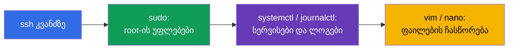
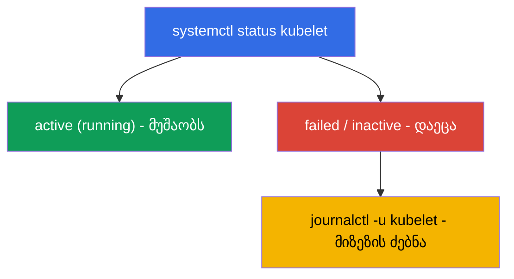

[Русская версия](ru.md) · [Eng version](README.md) · [Versión en español](es.md) · [Version française](fr.md) · [Deutsche Version](de.md)

# თავი 0.5. Linux და კვანძის ხელსაწყოები ნულიდან: SSH, sudo, systemd, ლოგები, ფაილები

> **ვისთვისაა ეს თავი.** ნაწილი 0, საფუძველი დამწყებთათვის. CKA გამოცდა და ლაბების ნახევარი
> - ეს არის მუშაობა **თავად კვანძებზე** SSH-ით: კლასტერის აწევა, kubelet-ის შეკეთება,
> etcd-ის სნეპშოტის აღება, მანიფესტის ჩასწორება. თუ თავდაჯერებულად დადიხართ SSH-ით,
> იყენებთ `sudo`-ს, კითხულობთ ლოგებს `journalctl`-ით და ასწორებთ ფაილებს `vim`/`nano`-ში -
> თამამად გადადით 0.6 თავზე. მაგრამ თუ Linux-ის ბრძანების ხაზი ჯერ კიდევ გაშინებთ, დაუთმეთ
> აქ ნახევარი საათი: ამ უნარების გარეშე CKA-სთვის ყველაზე წონადი ლაბები (111, 112, 116,
> 117, 118) ბუქსავს არა Kubernetes-ის გამო, არამედ Linux-ის გამო.

## 0.5.1. რატომაა ეს Kubernetes-ის კურსში

CKAD ძირითადად `kubectl`-ში ცხოვრობს, ხოლო CKA (დომენები Installation 25% და
Troubleshooting 30%) გაიძულებთ **კვანძებზე ასვლას**: control plane-ის კომპონენტები არის
ფაილები `/etc/kubernetes/`-ში, kubelet - სისტემური სერვისი, ლოგები - `journalctl`-ში,
ხოლო `kubectl` უსარგებლოა, როცა API-სერვერი წევს. ეს ყველაფერი - ჩვეულებრივი Linux-ია.



## 0.5.2. SSH: როგორ მოვხვდეთ კვანძზე

**SSH** (Secure Shell) - დაცული შესვლა დისტანციურ მანქანაზე ქსელით. ლაბებში შედიხართ
სამუშაო მანქანაზე, ხოლო იქიდან - კლასტერის კვანძებზე:

```bash
ssh user@node          # შესვლა მანქანა node-ზე მომხმარებელ user-ით
ssh node               # თუ კვანძის სახელი კონფიგშია (როგორც ლაბებში)
exit                   # წინა მანქანაზე დაბრუნება
```

> **მნიშვნელოვანია CKA-სთვის.** კვანძზე მუშაობის შემდეგ **არ დაგავიწყდეთ დაბრუნება** „თქვენ“
> მანქანაზე (`exit`), თორემ შემდეგი `kubectl`-ბრძანებები არასწორ ადგილას წავა. გამოცდაზე
> დროის ხშირი დანაკარგია „რატომ არ მუშაობს“, ხოლო თქვენ ჯერ კიდევ სხვა კვანძზე ხართ.

## 0.5.3. sudo: ბრძანებები root-ის სახელით

ბევრი რამ კვანძზე მოითხოვს ადმინისტრატორის (root) უფლებებს: სერტიფიკატების წაკითხვა,
სისტემური ფაილების ჩასწორება, სერვისების გადატვირთვა. ამისთვისაა **`sudo`** (ბრძანების
შესრულება root-ის სახელით):

```bash
sudo cat /etc/kubernetes/manifests/etcd.yaml   # დაცული ფაილის წაკითხვა
sudo systemctl restart kubelet                 # სერვისის გადატვირთვა
sudo -i                                         # მთელ სესიაზე root-ად გახდომა
```

ნიშანი, რომ `sudo` გჭირდებათ, - შეცდომა **`Permission denied`**. საგამოცდო კვანძებზე
`sudo` ჩვეულებრივ პაროლის გარეშე მუშაობს.

## 0.5.4. systemd: კლასტერის სერვისები

**systemd** - სისტემა, რომელიც უშვებს და ადევნებს თვალს ფონურ სერვისებს (დემონებს)
Linux-ში. მათ მართავს ბრძანება **`systemctl`**. Kubernetes-ისთვის მთავარი სერვისია
**kubelet** (აგენტი ყოველ კვანძზე); ასევე მნიშვნელოვანია **containerd** (runtime).

```bash
systemctl status kubelet        # მუშაობს თუ არა სერვისი (active/failed)
sudo systemctl restart kubelet  # გადატვირთვა
sudo systemctl enable kubelet   # ავტოგაშვება ჩატვირთვისას
sudo systemctl daemon-reload    # შეცვლილი unit-ფაილების ხელახლა წაკითხვა
```



სწორედ ჯაჭვი „status → failed → ვუყურებთ ლოგებს → ვასწორებთ“ არის კვანძის
troubleshooting-ის საფუძველი (ლაბი 117, თავი 45).

## 0.5.5. journalctl: სად წავიკითხოთ ლოგები

systemd-სერვისების ლოგები დევს journald-ში, მათ კითხულობენ **`journalctl`**-ით:

```bash
journalctl -u kubelet                 # kubelet-ის ყველა ლოგი
journalctl -u kubelet -f              # რეალურ დროში დევნება (follow)
journalctl -u kubelet --no-pager | tail -50   # ბოლო სტრიქონები
journalctl -u kubelet --since "5 min ago"     # ბოლო 5 წუთი
```

kubelet-ის ლოგები - **მთავარი წყაროა** იმ მიზეზების, თუ რატომაა კვანძი `NotReady` ან
pod არ იშვება. მათი წაკითხვა ზეპირად უნდა შეგეძლოთ.

## 0.5.6. ფაილების ჩასწორება: vim და nano

კვანძზე მანიფესტებსა და კონფიგებს ასწორებენ ტექსტური რედაქტორით. მინიმუმი გადასარჩენად
**`vim`**-ში (ის ყველგანაა):

| მოქმედება | კლავიშები |
|-----------|-----------|
| შესვლა შეყვანის რეჟიმში | `i` |
| შეყვანის რეჟიმიდან გამოსვლა | `Esc` |
| შენახვა და გამოსვლა | `Esc`, შემდეგ `:wq`, Enter |
| გამოსვლა შენახვის გარეშე | `Esc`, შემდეგ `:q!`, Enter |

თუ ხელმისაწვდომია **`nano`** - ის უფრო მარტივია: ისრები ნავიგაციისთვის, `Ctrl+O` შესანახად,
`Ctrl+X` გამოსასვლელად. რედაქტორის არჩევანს განსაზღვრავს ცვლადი `KUBE_EDITOR` (`kubectl
edit`-ისთვის):

```bash
export KUBE_EDITOR=nano   # რომ kubectl edit-მა nano გახსნას vim-ის ნაცვლად
```

## 0.5.7. ფაილური სისტემა და გზები, რომლებიც უნდა იცოდეთ

Linux - ეს არის ხე ფესვ `/`-დან. რამდენიმე გზა გვხვდება ყოველ CKA-ამოცანაში:

| გზა | რა არის იქ |
|-----|-----------|
| `/etc/kubernetes/manifests/` | static pods control plane (apiserver, etcd, scheduler, cm) |
| `/etc/kubernetes/*.conf` | კომპონენტების kubeconfig-ები |
| `/etc/kubernetes/pki/` | კლასტერის სერტიფიკატები და გასაღებები |
| `/var/lib/etcd/` | etcd-ის მონაცემები |
| `/var/lib/kubelet/` | kubelet-ის მონაცემები და კონფიგი |
| `/var/log/` | სისტემური ლოგები |

ბაზისური ნავიგაცია: `cd` (გადასვლა), `ls -l` (სია დეტალებით), `pwd` (სად ვარ),
`cat`/`less` (ფაილის ნახვა), `cp`/`mv`/`rm` (კოპირება/გადატანა/წაშლა), `find` (ძებნა).

## 0.5.8. პროცესები, პორტები და ქსელი კვანძზე

ზოგჯერ საჭიროა გავიგოთ, რა მუშაობს რეალურად კვანძზე და უსმენს პორტს:

```bash
ps aux | grep kube             # პროცესები
sudo ss -ltnp | grep 6443      # ვინ უსმენს პორტ 6443-ს (apiserver)
sudo crictl ps                 # კონტეინერები კვანძზე (როცა kubectl მიუწვდომელია, თავი 40)
curl -k https://localhost:6443/healthz   # ცოცხალია თუ არა apiserver ლოკალურად
```

`crictl` (და არა `docker`!) - გზა, რომ კვანძზე კონტეინერები პირდაპირ დაინახოთ, API-ს
გვერდის ავლით - ეს გიხსნით, როცა `kubectl` მკვდარია (ლაბი 117, თავი 45).

## 0.5.9. როგორ გამოიყენება ეს პროდაქშენში

- **მორიგეობა კვანძებზე.** როცა „ყველაფერი დაწვა“, ინჟინერი SSH-ით შედის კვანძზე და
  მუშაობს ზუსტად ამ ხელსაწყოებით: `systemctl status`, `journalctl`, `crictl`, მანიფესტების
  ჩასწორება. ეს on-call-ის ბაზისური უნარია.
- **ავტომატიზაცია ხელით საქმის ზემოთ.** პროდში კვანძების მომზადებას (swap, მოდულები,
  containerd, kube*) აკეთებენ Ansible-ით/იმიჯებით, მაგრამ იმის გაგება, რას აკეთებს
  სკრიპტი ხელით, სავალდებულოა - თორემ ვერ შეაკეთებთ, როცა ავტომატიკა გაფუჭდა.
- **sudo-სა და გასაღებების უსაფრთხოება.** წვდომა SSH-გასაღებებით, `sudo` აუდიტის ქვეშ,
  უფლებების მინიმუმი - ექსპლუატაციის სტანდარტი. პრივატულ გასაღებებსა და
  `/etc/kubernetes/pki`-ს განსაკუთრებით უფრთხილდებიან.
- **ლოგები - დიაგნოსტიკის პირველი ნაბიჯი.** `journalctl -u kubelet` და კომპონენტების
  ლოგები `crictl`-ით - ის, რითაც იწყება კვანძზე თითქმის ნებისმიერი ინციდენტის გარჩევა.

## 0.5.10. მინი-ლექსიკონი

- **SSH** - დაცული შესვლა დისტანციურ მანქანაზე; `exit` - უკან დაბრუნება.
- **sudo** - ბრძანების შესრულება root-ის სახელით; `sudo -i` - სესიაზე root-ად გახდომა.
- **systemd / systemctl** - სერვისების მართვის სისტემა და მისი ბრძანება.
- **kubelet** - Kubernetes-ის აგენტი კვანძზე (სისტემური სერვისი).
- **journalctl** - systemd-სერვისების ლოგების წაკითხვა (`-u <სერვისი>`, `-f` - თვალყურის
  დევნება).
- **unit / daemon** - სერვისის აღწერა / ფონური პროცესი.
- **vim / nano** - ტექსტური რედაქტორები ტერმინალში.
- **KUBE_EDITOR** - ცვლადი, რომელიც აყენებს რედაქტორს `kubectl edit`-ისთვის.
- **crictl** - CLI კვანძზე კონტეინერებთან CRI-ს გავლით (მუშაობს API-სერვერის გარეშე).
- **ss / ps** - ვინ უსმენს პორტებს / რომელი პროცესებია გაშვებული.

## 0.5.11. თავის შეჯამება

- CKA - ეს დიდწილად მუშაობაა კვანძებზე SSH-ით; `kubectl` იქ ყოველთვის ხელმისაწვდომი არაა.
- `sudo` აძლევს root-ის უფლებებს; `Permission denied` - სიგნალი, რომ ის საჭიროა.
- systemd მართავს სერვისებს: `systemctl status/restart kubelet`, `daemon-reload`.
- სერვისების ლოგებს კითხულობენ `journalctl -u <სერვისი>`-ით (`-f` - რეალურ დროში);
  kubelet-ის ლოგები - NotReady-ის მიზეზების მთავარი წყარო.
- ფაილებს ასწორებენ vim-ში (`i` → ჩასწორება → `Esc` → `:wq`) ან nano-ში; იცოდეთ გზები
  `/etc/kubernetes/...`, `/var/lib/etcd`, `/var/lib/kubelet`.
- კვანძზე კონტეინერებს უყურებენ `crictl`-ით (და არა `docker`), პორტებს - `ss`-ით.

## 0.5.12. როგორ გამოგადგებათ: გამოცდაზე და რეალურ სამუშაოში

**გამოცდაზე (CKA).** კლასტერის ინსტალაცია, აპგრეიდი, etcd-ის ბექაფი, control plane-ის/
კვანძების შეკეთება - ყველაფერი კვანძებზე კეთდება ამ ბრძანებებით. SSH-ით სწრაფად შესვლის,
უფლებების აწევის, `journalctl`-ის წაკითხვის, მანიფესტის ჩასწორებისა და უკან დაბრუნების
უნარი პირდაპირ ზოგავს წუთებს ყველაზე ძვირ ამოცანებში (დომენები 25% + 30%).

**რეალურ სამუშაოში.** ეს ნებისმიერი self-managed კლასტერის ექსპლუატაციის ბაზაა: on-call
კვანძებზე, ლოგების წაკითხვა, სერვისების გადატვირთვა, კონფიგების ჩასწორება. მის გარეშე
Kubernetes რჩება „შავ ყუთად“, რომლის შეკეთებაც ვერაფრით ხერხდება, როცა API მიუწვდომელია.

## 0.5.13. თვითშემოწმების კითხვები

1. როგორ შევიდეთ კვანძზე SSH-ით და რატომაა მნიშვნელოვანი შემდეგ უკან დაბრუნება?
2. როდის გჭირდებათ `sudo` და როგორ მიხვდეთ, რომ უფლებები არ გყოფნით?
3. როგორ შევამოწმოთ kubelet-ის სტატუსი და გადავტვირთოთ იგი? რას აკეთებს `daemon-reload`?
4. სად ვეძებოთ მიზეზი, რატომაა კვანძი `NotReady`?
5. როგორ შევიდეთ vim-ში შეყვანის რეჟიმში, შევინახოთ და გამოვიდეთ?
6. სად დევს control plane-ის მანიფესტები, სერტიფიკატები და etcd-ის მონაცემები?
7. რითი უყურებენ კვანძზე კონტეინერებს, როცა `kubectl` მიუწვდომელია?

## პრაქტიკა

ნაწილ 0-ისთვის ცალკე ლაბი არ არის - ეს საფუძველია. ყველა ამ ბრძანებას ხელით გამოიყენებთ
კვანძოვან ლაბებში: 111 (აპგრეიდი), 112 (etcd), 116 (ინსტალაცია ნულიდან), 117 (control
plane-ის/კვანძების troubleshooting), 118 (სერტიფიკატები და ქსელი). შემდეგ - ყველა
მანიფესტის ენა: YAML.

---
[სარჩევი](../README_GE.md) · [თავი 0.4](../00-4-containers/ge.md) · [თავი 0.6](../00-6-yaml/ge.md)
