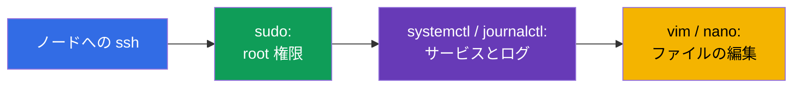
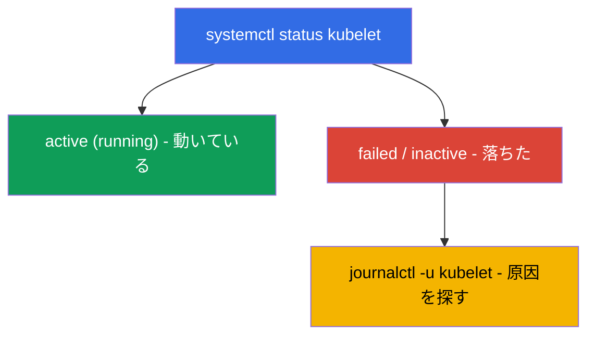

[Русская версия](ru.md) · [Eng version](README.md) · [Versión en español](es.md) · [Version française](fr.md) · [Deutsche Version](de.md) · [ქართული ვერსია](ge.md) · [繁體中文版](tw.md)

# 第 0.5 章。ゼロから学ぶ Linux とノードのツール：SSH、sudo、systemd、ログ、ファイル

> **この章は誰のためか。** パート 0、初心者のための土台です。CKA 試験とラボの半分は、
> SSH を使った **ノードそのものの上での作業** です：クラスタを立ち上げる、kubelet を
> 直す、etcd のスナップショットを取る、マニフェストを修正する。SSH で自信をもって
> 動きまわれて、`sudo` を使い、`journalctl` でログを読み、`vim`/`nano` でファイルを
> 編集できるなら、遠慮なく第 0.6 章へ進んでください。逆に Linux のコマンドラインが
> まだ怖いなら、ここに 30 分使ってください：これらのスキルがないと、CKA でもっとも
> 比重の大きいラボ (111、112、116、117、118) が、Kubernetes のせいではなく Linux の
> せいで進まなくなります。

## 0.5.1. なぜ Kubernetes のコースにこれが入っているのか

CKAD はおもに `kubectl` の中で完結しますが、CKA（Installation 25% と Troubleshooting
30% の領域）は **ノードに入ること** を強います：control plane のコンポーネントは
`/etc/kubernetes/` の中のファイルであり、kubelet はシステムサービス、ログは
`journalctl` の中、そして API サーバーが落ちているときに `kubectl` は役に立ちません。
そのすべてが普通の Linux です。



## 0.5.2. SSH：ノードに入る方法

**SSH** (Secure Shell) とは、ネットワーク越しにリモートマシンへ安全にログインする
仕組みです。ラボでは作業マシンにログインし、そこからクラスタのノードへ入ります：

```bash
ssh user@node          # ユーザー user としてマシン node にログインする
ssh node               # ノード名が設定ファイルに書かれている場合（ラボと同じ）
exit                   # 前のマシンへ戻る
```

> **CKA で重要。** ノードでの作業が終わったら、**「自分の」マシンへ戻るのを忘れない**
> でください (`exit`)。さもないと次の `kubectl` コマンドが違う場所へ飛んでいきます。
> 試験でよくある時間の浪費が「なぜ動かないのか」で、実は別のノードにいたままという
> ものです。

## 0.5.3. sudo：root としてのコマンド実行

ノード上の多くのことには管理者 (root) 権限が必要です：証明書を読む、システムファイルを
編集する、サービスを再起動する。そのためにあるのが **`sudo`**（コマンドを root として
実行する）です：

```bash
sudo cat /etc/kubernetes/manifests/etcd.yaml   # 保護されたファイルを読む
sudo systemctl restart kubelet                 # サービスを再起動する
sudo -i                                         # セッション全体で root になる
```

`sudo` が必要だというサインは **`Permission denied`** というエラーです。試験のノードでは
`sudo` はふつうパスワードなしで通ります。

## 0.5.4. systemd：クラスタのサービス

**systemd** とは、Linux でバックグラウンドのサービス（デーモン）を起動し監視する
システムです。それらを管理するのが **`systemctl`** コマンドです。Kubernetes にとって
鍵となるサービスは **kubelet**（各ノード上のエージェント）で、**containerd**
(runtime) も重要です。

```bash
systemctl status kubelet        # サービスが動いているか (active/failed)
sudo systemctl restart kubelet  # 再起動する
sudo systemctl enable kubelet   # 起動時に自動で立ち上げる
sudo systemctl daemon-reload    # 変更した unit ファイルを読み直す
```



まさにこの「status → failed → ログを見る → 直す」というつながりが、ノードの
troubleshooting の基礎です（ラボ 117、第 45 章）。

## 0.5.5. journalctl：ログをどこで読むか

systemd サービスのログは journald の中にあり、**`journalctl`** で読みます：

```bash
journalctl -u kubelet                 # kubelet のすべてのログ
journalctl -u kubelet -f              # リアルタイムで追いかける (follow)
journalctl -u kubelet --no-pager | tail -50   # 最後の数行
journalctl -u kubelet --since "5 min ago"     # 直近 5 分ぶん
```

kubelet のログは、ノードが `NotReady` になる理由や Pod が起動しない理由の
**主要な情報源** です。これを読めることは体に染み込ませておく必要があります。

## 0.5.6. ファイルの編集：vim と nano

ノード上ではマニフェストや設定ファイルをテキストエディタで編集します。**`vim`**
（どこにでもあります）で生き残るための最小限：

| 操作 | キー |
|----------|---------|
| 入力モードに入る | `i` |
| 入力モードから出る | `Esc` |
| 保存して終了する | `Esc`、続けて `:wq`、Enter |
| 保存せずに終了する | `Esc`、続けて `:q!`、Enter |

**`nano`** が使えるなら、そちらのほうが簡単です：矢印キーで移動、`Ctrl+O` で保存、
`Ctrl+X` で終了。エディタの選択は `KUBE_EDITOR` 変数で決まります（`kubectl edit` 用）：

```bash
export KUBE_EDITOR=nano   # kubectl edit が vim ではなく nano を開くようにする
```

## 0.5.7. 知っておくべきファイルシステムとパス

Linux はルート `/` から始まる木です。いくつかのパスは、どの CKA の問題にも出てきます：

| パス | そこにあるもの |
|------|---------|
| `/etc/kubernetes/manifests/` | static pods control plane (apiserver, etcd, scheduler, cm) |
| `/etc/kubernetes/*.conf` | 各コンポーネントの kubeconfig |
| `/etc/kubernetes/pki/` | クラスタの証明書と鍵 |
| `/var/lib/etcd/` | etcd のデータ |
| `/var/lib/kubelet/` | kubelet のデータと設定 |
| `/var/log/` | システムのログ |

基本の移動：`cd`（移動する）、`ls -l`（詳細付きの一覧）、`pwd`（今どこにいるか）、
`cat`/`less`（ファイルを見る）、`cp`/`mv`/`rm`（コピー/移動/削除）、
`find`（探す）。

## 0.5.8. ノード上のプロセス、ポート、ネットワーク

ときには、ノード上で実際に何が動きどのポートを待ち受けているのかを知る必要が
あります：

```bash
ps aux | grep kube             # プロセス
sudo ss -ltnp | grep 6443      # ポート 6443 を待ち受けているのは誰か (apiserver)
sudo crictl ps                 # ノード上のコンテナ（kubectl が使えないとき、第 40 章）
curl -k https://localhost:6443/healthz   # apiserver がローカルで生きているか
```

`crictl`（`docker` ではありません！）は、API を通さずにノード上のコンテナを直接見る
手段です - これが `kubectl` が死んでいるときに助けになります（ラボ 117、第 45 章）。

## 0.5.9. 本番環境でこれをどう使うか

- **ノードでの当番。** 「すべてが落ちた」とき、エンジニアは SSH でノードに入り、まさに
  これらのツールで作業します：`systemctl status`、`journalctl`、`crictl`、マニフェストの
  編集。これは on-call の基本スキルです。
- **手作業の上に載る自動化。** 本番ではノードの準備 (swap、モジュール、containerd、
  kube*) を Ansible やイメージで行いますが、スクリプトが手で何をしているのかを理解して
  おくことは必須です - でなければ自動化が失敗したときに直せません。
- **sudo と鍵のセキュリティ。** SSH 鍵でのアクセス、監査下の `sudo`、最小権限 - これが
  運用の標準です。秘密鍵と `/etc/kubernetes/pki` はとくに厳重に守ります。
- **ログは診断の第一歩。** `journalctl -u kubelet` と `crictl` 経由のコンポーネントの
  ログは、ノードでのほぼすべてのインシデントの調査がそこから始まる場所です。

## 0.5.10. ミニ用語集

- **SSH** - リモートマシンへの安全なログイン。`exit` - 戻る。
- **sudo** - コマンドを root として実行する。`sudo -i` - セッションのあいだ root になる。
- **systemd / systemctl** - サービス管理のシステムと、そのためのコマンド。
- **kubelet** - ノード上の Kubernetes のエージェント（システムサービス）。
- **journalctl** - systemd サービスのログを読むこと (`-u <サービス>`、`-f` - 追いかける)。
- **unit / daemon** - サービスの記述 / バックグラウンドのプロセス。
- **vim / nano** - ターミナルのテキストエディタ。
- **KUBE_EDITOR** - `kubectl edit` 用のエディタを指定する変数。
- **crictl** - CRI 経由でノード上のコンテナを操作する CLI（API サーバーなしで動きます）。
- **ss / ps** - どのポートを誰が待ち受けているか / どのプロセスが動いているか。

## 0.5.11. 本章のまとめ

- CKA は多くの部分が SSH でのノード上の作業です。そこでは `kubectl` が常に使えるとは限りません。
- `sudo` は root 権限を与えます。`Permission denied` はそれが必要だというサインです。
- systemd がサービスを管理します：`systemctl status/restart kubelet`、`daemon-reload`。
- サービスのログは `journalctl -u <サービス>` で読みます (`-f` - リアルタイムで)。
  kubelet のログは NotReady の原因の主要な情報源です。
- ファイルは vim (`i` → 編集 → `Esc` → `:wq`) または nano で編集します。パス
  `/etc/kubernetes/...`、`/var/lib/etcd`、`/var/lib/kubelet` を知っておきましょう。
- ノード上のコンテナは `crictl`（`docker` ではありません）で見て、ポートは `ss` で見ます。

## 0.5.12. これがどう役に立つか：試験と実際の仕事で

**試験では (CKA)。** クラスタのインストール、アップグレード、etcd のバックアップ、
control plane やノードの修理 - すべてノード上でこれらのコマンドを使って行います。
SSH で素早く入り、権限を上げ、`journalctl` を読み、マニフェストを直して戻ってくる
という一連の動きは、もっとも配点の高い問題（25% + 30% の領域）で直接分単位の時間を
節約します。

**実際の仕事では。** これは self-managed なクラスタの運用の基礎そのものです：ノードでの
on-call、ログの読み方、サービスの再起動、設定ファイルの編集。それがないと Kubernetes は
「ブラックボックス」のままで、API が使えなくなったときに直す手段がありません。

## 0.5.13. 自己チェックの質問

1. SSH でノードに入る方法は？そしてなぜそのあと戻ってくることが重要なのですか？
2. `sudo` はいつ必要ですか。そして権限が足りないことをどう見分けますか？
3. kubelet の状態を確認して再起動するには？`daemon-reload` は何をしますか？
4. ノードが `NotReady` である原因は、どこで探しますか？
5. vim で入力モードに入り、保存して終了するにはどうしますか？
6. control plane のマニフェスト、証明書、etcd のデータはどこにありますか？
7. `kubectl` が使えないとき、ノード上のコンテナは何で見ますか？

## 演習

パート 0 には独立したラボはありません - これは土台です。これらのコマンドはすべて、
ノード関連のラボで手を動かして使います：111（アップグレード）、112 (etcd)、
116（ゼロからのインストール）、117 (control plane / ノードの troubleshooting)、
118（証明書とネットワーク）。次は - すべてのマニフェストの言語、YAML です。

---
[目次](../README_JP.md) · [第 0.4 章](../00-4-containers/jp.md) · [第 0.6 章](../00-6-yaml/jp.md)
