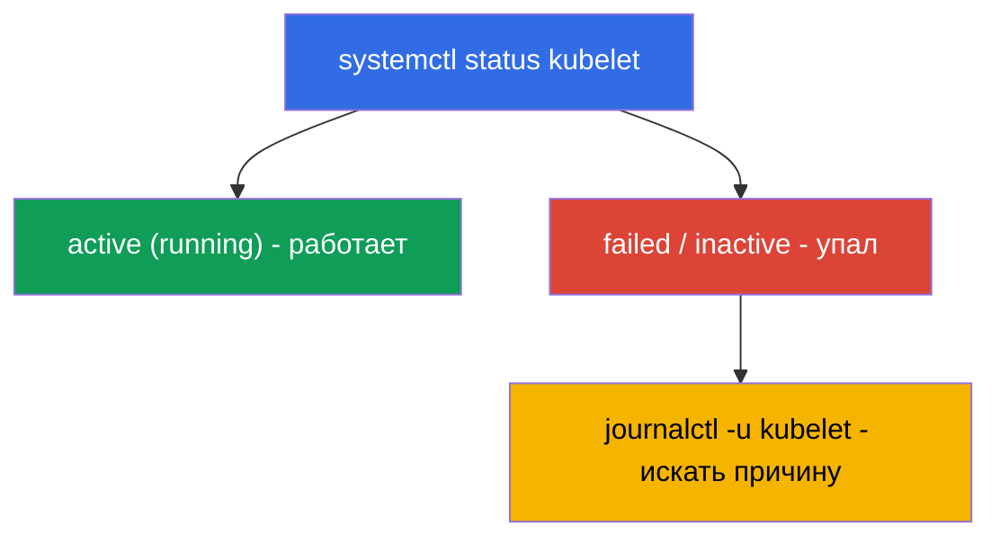

# Глава 0.5. Linux и инструменты ноды с нуля: SSH, sudo, systemd, логи, файлы

> **Для кого эта глава.** Часть 0, фундамент для новичков. Экзамен CKA и половина лаб -
> это работа **на самих нодах** по SSH: поднять кластер, починить kubelet, снять
> снапшот etcd, поправить манифест. Если вы уверенно ходите по SSH, пользуетесь `sudo`,
> читаете логи через `journalctl` и правите файлы в `vim`/`nano` - смело к главе 0.6.
> Если же командная строка Linux пока пугает, потратьте здесь полчаса: без этих навыков
> самые весомые для CKA лабы (111, 112, 116, 117, 118) буксуют не из-за Kubernetes, а
> из-за Linux.

## 0.5.1. Почему это в курсе по Kubernetes

CKAD в основном живёт в `kubectl`, а вот CKA (домены Installation 25% и Troubleshooting
30%) заставляет **лезть на ноды**: компоненты control plane - это файлы в
`/etc/kubernetes/`, kubelet - системный сервис, логи - в `journalctl`, а `kubectl`
бесполезен, когда лежит API-сервер. Всё это - обычный Linux.


## 0.5.2. SSH: как попасть на ноду

**SSH** (Secure Shell) - защищённый вход на удалённую машину по сети. В лабах вы
заходите на рабочую машину, а с неё - на ноды кластера:

```bash
ssh user@node          # вход на машину node под пользователем user
ssh node               # если имя ноды прописано в конфиге (как в лабах)
exit                   # выйти обратно на предыдущую машину
```

> **Важно для CKA.** После работы на ноде **не забудьте вернуться** на «свою» машину
> (`exit`), иначе следующие `kubectl`-команды уйдут не туда. Частая потеря времени на
> экзамене - «почему не работает», а вы всё ещё на другой ноде.

## 0.5.3. sudo: команды от имени root

Многое на ноде требует прав администратора (root): читать сертификаты, править
системные файлы, перезапускать сервисы. Для этого - **`sudo`** (выполнить команду от
root):

```bash
sudo cat /etc/kubernetes/manifests/etcd.yaml   # читать защищённый файл
sudo systemctl restart kubelet                 # перезапустить сервис
sudo -i                                         # стать root на всю сессию
```

Признак, что нужен `sudo`, - ошибка **`Permission denied`**. На экзаменационных нодах
`sudo` обычно без пароля.

## 0.5.4. systemd: сервисы кластера

**systemd** - система, которая запускает и следит за фоновыми сервисами (демонами) в
Linux. Управляет ими команда **`systemctl`**. Для Kubernetes ключевой сервис -
**kubelet** (агент на каждой ноде); также важен **containerd** (runtime).

```bash
systemctl status kubelet        # работает ли сервис (active/failed)
sudo systemctl restart kubelet  # перезапустить
sudo systemctl enable kubelet   # автозапуск при загрузке
sudo systemctl daemon-reload    # перечитать изменённые unit-файлы
```



Именно связка «status → failed → смотрим логи → чиним» - основа troubleshooting ноды
(лаба 117, глава 45).

## 0.5.5. journalctl: где читать логи

Логи systemd-сервисов лежат в journald, читают их через **`journalctl`**:

```bash
journalctl -u kubelet                 # все логи kubelet
journalctl -u kubelet -f              # следить в реальном времени (follow)
journalctl -u kubelet --no-pager | tail -50   # последние строки
journalctl -u kubelet --since "5 min ago"     # за последние 5 минут
```

Логи kubelet - **главный источник** причин, почему нода `NotReady` или под не
стартует. Читать их надо уметь наизусть.

## 0.5.6. Правка файлов: vim и nano

На ноде манифесты и конфиги правят текстовым редактором. Минимум для выживания в
**`vim`** (он есть везде):

| Действие | Клавиши |
|----------|---------|
| войти в режим ввода | `i` |
| выйти из режима ввода | `Esc` |
| сохранить и выйти | `Esc`, затем `:wq`, Enter |
| выйти без сохранения | `Esc`, затем `:q!`, Enter |

Если доступен **`nano`** - он проще: стрелки для навигации, `Ctrl+O` сохранить,
`Ctrl+X` выйти. Выбор редактора задаёт переменная `KUBE_EDITOR` (для `kubectl edit`):

```bash
export KUBE_EDITOR=nano   # чтобы kubectl edit открывал nano вместо vim
```

## 0.5.7. Файловая система и пути, которые надо знать

Linux - это дерево от корня `/`. Несколько путей встречаются в каждой CKA-задаче:

| Путь | Что там |
|------|---------|
| `/etc/kubernetes/manifests/` | static pods control plane (apiserver, etcd, scheduler, cm) |
| `/etc/kubernetes/*.conf` | kubeconfig'и компонентов |
| `/etc/kubernetes/pki/` | сертификаты и ключи кластера |
| `/var/lib/etcd/` | данные etcd |
| `/var/lib/kubelet/` | данные и конфиг kubelet |
| `/var/log/` | системные логи |

Базовая навигация: `cd` (перейти), `ls -l` (список с деталями), `pwd` (где я),
`cat`/`less` (посмотреть файл), `cp`/`mv`/`rm` (копировать/переместить/удалить),
`find` (искать).

## 0.5.8. Процессы, порты и сеть на ноде

Иногда надо понять, что реально работает на ноде и слушает порт:

```bash
ps aux | grep kube             # процессы
sudo ss -ltnp | grep 6443      # кто слушает порт 6443 (apiserver)
sudo crictl ps                 # контейнеры на ноде (когда kubectl недоступен, глава 40)
curl -k https://localhost:6443/healthz   # жив ли apiserver локально
```

`crictl` (не `docker`!) - способ увидеть контейнеры на ноде напрямую, минуя API - это
спасает, когда `kubectl` мёртв (лаба 117, глава 45).

## 0.5.9. Как это применяют в продакшене

- **Дежурство на нодах.** Когда «всё легло», инженер идёт по SSH на ноду и работает
  ровно этими инструментами: `systemctl status`, `journalctl`, `crictl`, правка
  манифестов. Это базовый навык on-call.
- **Автоматизация поверх ручного.** В проде подготовку нод (swap, модули, containerd,
  kube*) делают Ansible/образами, но понимать, что скрипт делает руками, обязательно -
  иначе не починить, когда автоматика дала сбой.
- **Безопасность sudo и ключей.** Доступ по SSH-ключам, `sudo` под аудитом, минимум
  прав - стандарт эксплуатации. Приватные ключи и `/etc/kubernetes/pki` берегут особо.
- **Логи - первый шаг диагностики.** `journalctl -u kubelet` и логи компонентов через
  `crictl` - то, с чего начинается разбор почти любого инцидента на ноде.

## 0.5.10. Мини-глоссарий

- **SSH** - защищённый вход на удалённую машину; `exit` - вернуться назад.
- **sudo** - выполнить команду от имени root; `sudo -i` - стать root на сессию.
- **systemd / systemctl** - система управления сервисами и команда к ней.
- **kubelet** - агент Kubernetes на ноде (системный сервис).
- **journalctl** - чтение логов systemd-сервисов (`-u <сервис>`, `-f` - следить).
- **unit / daemon** - описание сервиса / фоновый процесс.
- **vim / nano** - текстовые редакторы в терминале.
- **KUBE_EDITOR** - переменная, задающая редактор для `kubectl edit`.
- **crictl** - CLI к контейнерам на ноде через CRI (работает без API-сервера).
- **ss / ps** - кто слушает порты / какие процессы запущены.

## 0.5.11. Итоги главы

- CKA - это во многом работа на нодах по SSH; `kubectl` там не всегда доступен.
- `sudo` даёт права root; `Permission denied` - сигнал, что он нужен.
- systemd управляет сервисами: `systemctl status/restart kubelet`, `daemon-reload`.
- Логи сервисов читают через `journalctl -u <сервис>` (`-f` - в реальном времени);
  логи kubelet - главный источник причин NotReady.
- Файлы правят в vim (`i` → правка → `Esc` → `:wq`) или nano; знать пути
  `/etc/kubernetes/...`, `/var/lib/etcd`, `/var/lib/kubelet`.
- Контейнеры на ноде смотрят через `crictl` (не `docker`), порты - через `ss`.

## 0.5.12. Как это пригодится: на экзамене и в реальной работе

**На экзамене (CKA).** Установка кластера, апгрейд, бэкап etcd, починка control
plane/нод - всё делается на нодах этими командами. Умение быстро зайти по SSH,
поднять права, прочитать `journalctl`, поправить манифест и вернуться назад напрямую
экономит минуты в самых дорогих задачах (домены 25% + 30%).

**В реальной работе.** Это база эксплуатации любого self-managed кластера: on-call на
нодах, чтение логов, перезапуск сервисов, правка конфигов. Без неё Kubernetes остаётся
«чёрным ящиком», который нечем чинить, когда API недоступен.

## 0.5.13. Вопросы для самопроверки

1. Как зайти на ноду по SSH и почему важно потом вернуться назад?
2. Когда нужен `sudo` и как понять, что прав не хватает?
3. Как проверить статус kubelet и перезапустить его? Что делает `daemon-reload`?
4. Где искать причину, почему нода `NotReady`?
5. Как в vim войти в режим ввода, сохранить и выйти?
6. Где лежат манифесты control plane, сертификаты и данные etcd?
7. Чем смотрят контейнеры на ноде, когда `kubectl` недоступен?

## Практика

Отдельной лабы для части 0 нет - это фундамент. Все эти команды вы примените руками в
нодовых лабах: 111 (апгрейд), 112 (etcd), 116 (установка с нуля), 117 (troubleshooting
control plane/нод), 118 (сертификаты и сеть). Дальше - язык всех манифестов: YAML.

---
[Оглавление](../README_RU.md) · [Глава 0.4](../00-4-containers/ru.md) · [Глава 0.6](../00-6-yaml/ru.md)
