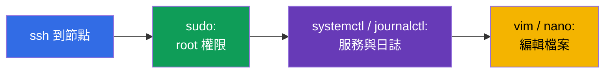
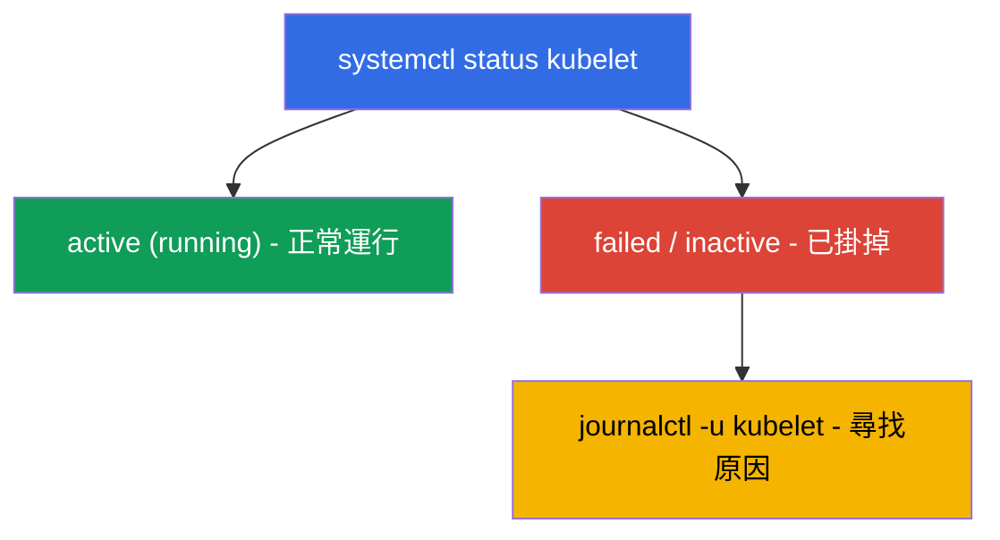

[Русская версия](ru.md) · [Eng version](README.md) · [Versión en español](es.md) · [Version française](fr.md) · [Deutsche Version](de.md) · [ქართული ვერსია](ge.md) · [日本語版](jp.md)

# 第 0.5 章。從零開始的 Linux 與節點工具:SSH、sudo、systemd、日誌、檔案

> **這一章適合誰。** 第 0 部分,為新手打的基礎。CKA 考試和一半的實驗
> 都是透過 SSH **在節點本身上**操作:架起叢集、修好 kubelet、
> 取得 etcd 快照、修改 manifest。如果你能熟練地用 SSH 連線、使用 `sudo`、
> 透過 `journalctl` 讀日誌,並用 `vim`/`nano` 編輯檔案 - 那就直接前往第 0.6 章。
> 如果 Linux 命令列目前還讓你害怕,就在這裡花上半個小時:少了這些技能,
> 對 CKA 最有價值的那些實驗(111、112、116、117、118)卡住的原因
> 不是 Kubernetes,而是 Linux。

## 0.5.1. 為什麼 Kubernetes 課程要講這個

CKAD 主要活在 `kubectl` 裡,而 CKA(Installation 佔 25%、Troubleshooting 佔
30% 這兩個領域)則會逼你**登上節點**:control plane 元件就是
`/etc/kubernetes/` 裡的檔案,kubelet 是系統服務,日誌在 `journalctl` 中,而當
API server 掛掉時 `kubectl` 毫無用處。這一切都是普通的 Linux。



## 0.5.2. SSH:如何進到節點

**SSH**(Secure Shell)- 透過網路安全登入遠端機器。在實驗中你會先
登入工作機,再從它連到叢集的節點:

```bash
ssh user@node          # 以使用者 user 登入機器 node
ssh node               # 如果節點名稱寫在設定檔中(如實驗裡那樣)
exit                   # 回到上一台機器
```

> **CKA 重點。** 在節點上操作完之後,**別忘了回到**「自己的」機器
> (`exit`),否則接下來的 `kubectl` 指令會跑到錯誤的地方。考試中常見的時間
> 浪費就是「為什麼不能運作」,而你其實還在另一台節點上。

## 0.5.3. sudo:以 root 身分執行指令

節點上有許多操作需要管理員(root)權限:讀取憑證、修改
系統檔案、重啟服務。這就是 **`sudo`** 的用途(以 root 身分
執行指令):

```bash
sudo cat /etc/kubernetes/manifests/etcd.yaml   # 讀取受保護的檔案
sudo systemctl restart kubelet                 # 重啟服務
sudo -i                                         # 在整個工作階段中成為 root
```

需要 `sudo` 的徵兆就是 **`Permission denied`** 錯誤。在考試用的節點上,
`sudo` 通常不需要密碼。

## 0.5.4. systemd:叢集的服務

**systemd** - 在 Linux 中啟動並看管背景服務(daemon)的系統。管理它們的
指令是 **`systemctl`**。對 Kubernetes 來說關鍵的服務是 **kubelet**
(每個節點上的代理程式);**containerd**(runtime)同樣重要。

```bash
systemctl status kubelet        # 服務是否在運行(active/failed)
sudo systemctl restart kubelet  # 重啟
sudo systemctl enable kubelet   # 開機時自動啟動
sudo systemctl daemon-reload    # 重新讀取修改過的 unit 檔案
```



「status → failed → 看日誌 → 修好」這條鏈路正是節點 troubleshooting 的
基礎(實驗 117、第 45 章)。

## 0.5.5. journalctl:去哪裡讀日誌

systemd 服務的日誌存放在 journald 中,透過 **`journalctl`** 讀取:

```bash
journalctl -u kubelet                 # kubelet 的所有日誌
journalctl -u kubelet -f              # 即時追蹤(follow)
journalctl -u kubelet --no-pager | tail -50   # 最後幾行
journalctl -u kubelet --since "5 min ago"     # 最近 5 分鐘的內容
```

kubelet 的日誌是節點為何 `NotReady`、Pod 為何無法啟動的**主要來源**。
讀懂它們必須熟練到不用思考。

## 0.5.6. 編輯檔案:vim 與 nano

在節點上要用文字編輯器修改 manifest 和設定檔。**`vim`** 的生存最低要求
(它到處都有):

| 動作 | 按鍵 |
|----------|---------|
| 進入輸入模式 | `i` |
| 離開輸入模式 | `Esc` |
| 儲存並離開 | `Esc`,接著 `:wq`,Enter |
| 不儲存離開 | `Esc`,接著 `:q!`,Enter |

如果有 **`nano`** - 它更簡單:用方向鍵導覽、`Ctrl+O` 儲存、
`Ctrl+X` 離開。編輯器的選擇由 `KUBE_EDITOR` 變數決定(給 `kubectl edit` 用):

```bash
export KUBE_EDITOR=nano   # 讓 kubectl edit 開啟 nano 而不是 vim
```

## 0.5.7. 必須知道的檔案系統與路徑

Linux 是從根目錄 `/` 開始的一棵樹。有幾個路徑在每一道 CKA 題目中都會遇到:

| 路徑 | 裡面有什麼 |
|------|---------|
| `/etc/kubernetes/manifests/` | control plane 的 static pods(apiserver、etcd、scheduler、cm) |
| `/etc/kubernetes/*.conf` | 各元件的 kubeconfig |
| `/etc/kubernetes/pki/` | 叢集的憑證與金鑰 |
| `/var/lib/etcd/` | etcd 的資料 |
| `/var/lib/kubelet/` | kubelet 的資料與設定 |
| `/var/log/` | 系統日誌 |

基本導覽:`cd`(切換目錄)、`ls -l`(帶細節的列表)、`pwd`(我在哪裡)、
`cat`/`less`(查看檔案)、`cp`/`mv`/`rm`(複製/移動/刪除)、
`find`(搜尋)。

## 0.5.8. 節點上的行程、埠與網路

有時你需要弄清楚節點上實際在運行什麼、以及誰在監聽某個埠:

```bash
ps aux | grep kube             # 行程
sudo ss -ltnp | grep 6443      # 誰在監聽 6443 埠(apiserver)
sudo crictl ps                 # 節點上的容器(當 kubectl 不可用時,第 40 章)
curl -k https://localhost:6443/healthz   # apiserver 在本機上是否還活著
```

`crictl`(不是 `docker`!)- 直接看到節點上容器的方法,繞過 API - 當
`kubectl` 死掉時這能救命(實驗 117、第 45 章)。

## 0.5.9. 這在生產環境中如何應用

- **在節點上待命。**「全部掛掉」的時候,工程師會透過 SSH 進到節點,
  用的正是這些工具:`systemctl status`、`journalctl`、`crictl`、修改
  manifest。這是 on-call 的基本技能。
- **手動之上的自動化。** 生產環境中節點的準備(swap、模組、containerd、
  kube*)是用 Ansible/映像檔完成的,但一定要理解腳本手動做了什麼 -
  否則自動化出錯時就修不好。
- **sudo 與金鑰的安全。** 以 SSH 金鑰存取、`sudo` 納入稽核、最小
  權限 - 這是營運標準。私鑰和 `/etc/kubernetes/pki` 要特別小心保護。
- **日誌是診斷的第一步。** `journalctl -u kubelet` 以及透過 `crictl` 看元件
  日誌 - 幾乎任何節點事故的排查都是從這裡開始。

## 0.5.10. 小詞彙表

- **SSH** - 安全登入遠端機器;`exit` - 返回上一層。
- **sudo** - 以 root 身分執行指令;`sudo -i` - 在整個工作階段成為 root。
- **systemd / systemctl** - 服務管理系統,以及操作它的指令。
- **kubelet** - 節點上的 Kubernetes 代理程式(系統服務)。
- **journalctl** - 讀取 systemd 服務的日誌(`-u <服務>`,`-f` - 追蹤)。
- **unit / daemon** - 服務的描述 / 背景行程。
- **vim / nano** - 終端機中的文字編輯器。
- **KUBE_EDITOR** - 指定 `kubectl edit` 使用哪個編輯器的變數。
- **crictl** - 透過 CRI 操作節點上容器的 CLI(沒有 API server 也能用)。
- **ss / ps** - 誰在監聽埠 / 有哪些行程在運行。

## 0.5.11. 本章總結

- CKA 在很大程度上就是透過 SSH 在節點上工作;那裡不一定有 `kubectl` 可用。
- `sudo` 給你 root 權限;`Permission denied` 就是需要它的信號。
- systemd 管理服務:`systemctl status/restart kubelet`、`daemon-reload`。
- 服務的日誌透過 `journalctl -u <服務>` 讀取(`-f` - 即時);
  kubelet 的日誌是 NotReady 原因的主要來源。
- 檔案用 vim(`i` → 編輯 → `Esc` → `:wq`)或 nano 修改;要知道路徑
  `/etc/kubernetes/...`、`/var/lib/etcd`、`/var/lib/kubelet`。
- 節點上的容器用 `crictl` 查看(不是 `docker`),埠則用 `ss`。

## 0.5.12. 這會有什麼用:考試中與實際工作中

**在考試中(CKA)。** 叢集安裝、升級、etcd 備份、修復 control
plane/節點 - 全都是在節點上用這些指令完成的。能夠快速透過 SSH 登入、
提升權限、讀 `journalctl`、修改 manifest 再返回,可以在最值錢的題目上
直接省下好幾分鐘(25% + 30% 這兩個領域)。

**在實際工作中。** 這是營運任何 self-managed 叢集的基礎:在節點上
待命、讀日誌、重啟服務、修改設定。少了它,Kubernetes 就仍是一個
「黑盒子」,當 API 不可用時完全無從修復。

## 0.5.13. 自我檢查問題

1. 如何透過 SSH 進到節點,以及為什麼之後一定要返回?
2. 什麼時候需要 `sudo`,又要怎麼看出權限不足?
3. 如何檢查 kubelet 的狀態並重啟它?`daemon-reload` 做了什麼?
4. 節點為何 `NotReady`,要去哪裡找原因?
5. 在 vim 中如何進入輸入模式、儲存並離開?
6. control plane 的 manifest、憑證和 etcd 的資料放在哪裡?
7. 當 `kubectl` 不可用時,用什麼查看節點上的容器?

## 練習

第 0 部分沒有單獨的實驗 - 這是基礎。所有這些指令你都會在節點相關的實驗中
親手用到:111(升級)、112(etcd)、116(從零安裝)、117(control
plane/節點的 troubleshooting)、118(憑證與網路)。接下來 - 所有 manifest 的語言:YAML。

---
[目錄](../README_TW.md) · [第 0.4 章](../00-4-containers/tw.md) · [第 0.6 章](../00-6-yaml/tw.md)
