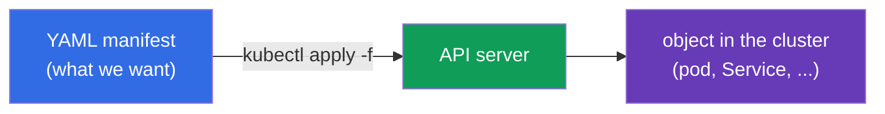
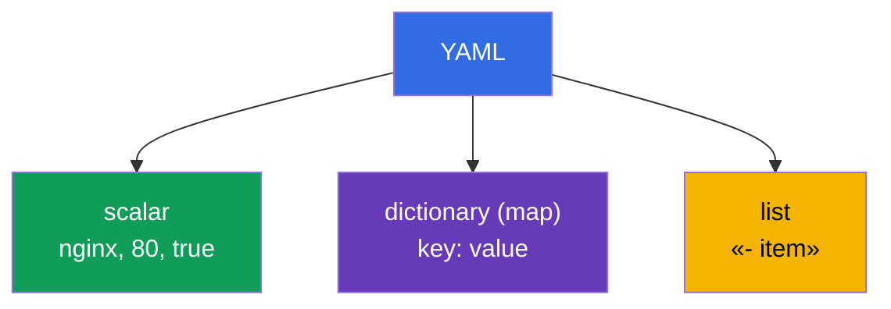
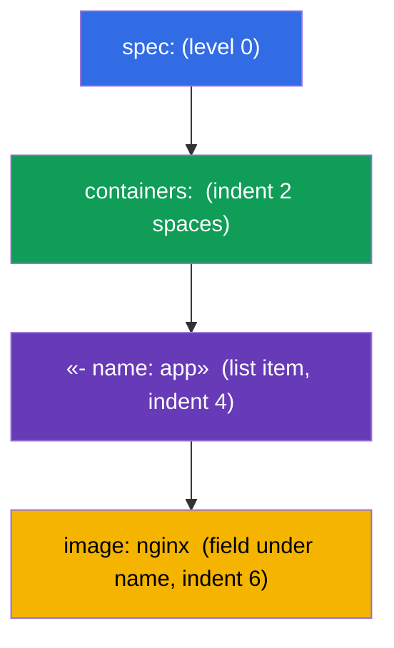
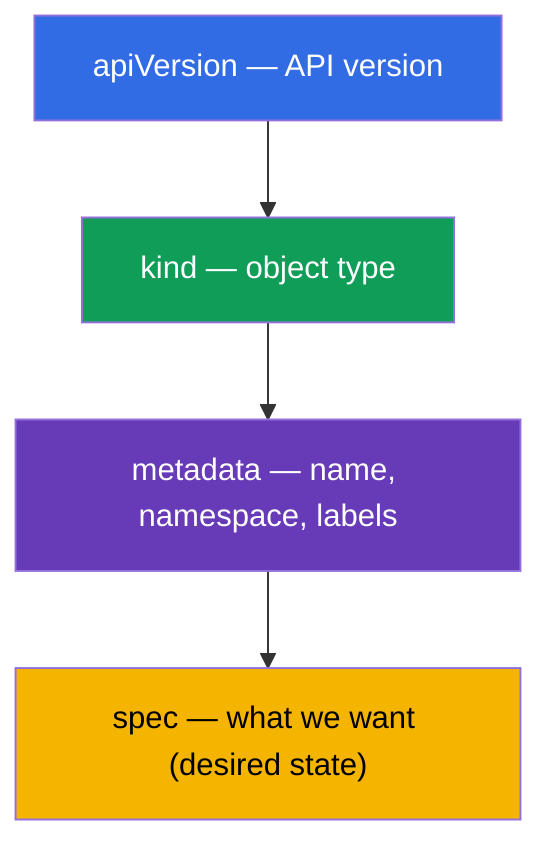

[Русская версия](ru.md) · [Versión en español](es.md) · [Version française](fr.md) · [Deutsche Version](de.md) · [ქართული ვერსია](ge.md)

# Chapter 0.6. YAML from scratch: indentation, lists, dictionaries, and Kubernetes manifests

> **Who this chapter is for.** Part 0, the foundation. Everything in Kubernetes is
> described in **YAML**: pods, Deployment, Service, ConfigMap are YAML manifests. If you
> confidently read nesting by indentation and tell a list from a dictionary - move on to
> Chapter 0.7. But if YAML is to you "a bunch of spaces where something keeps breaking"
> - this chapter removes the newcomer's main barrier on CKAD: most manifest errors are
> not Kubernetes, but wrong indentation or a mixed-up list/dictionary.

## 0.6.1. Why YAML and what it is

**YAML** is a human-readable data format. Kubernetes accepts manifests in YAML (and
JSON, but YAML is written almost always). The idea: you **declaratively** describe the
desired state of an object, and the cluster creates it.



## 0.6.2. The three pillars of YAML: scalars, dictionaries, lists

YAML is built from three things:

- **Scalar** - a simple value: string, number, boolean (`nginx`, `80`, `true`).
- **Dictionary (map)** - `key: value` pairs (note the **space** after the colon).
- **List** - items, each with a dash `-`.

```yaml
# dictionary: key-value pairs
name: web
replicas: 3
enabled: true

# list of simple values
ports:
  - 80
  - 443

# list of dictionaries (a common case in Kubernetes)
containers:
  - name: app
    image: nginx
  - name: sidecar
    image: busybox
```



## 0.6.3. Indentation is the structure (the main rule)

In YAML **nesting is set by space indentation**, not by brackets. This is the source of
almost all newcomer errors.

Ironclad rules:

- **Only spaces, never tabs.** A tab = parse error.
- Usually **2 spaces** per nesting level (that's the convention in Kubernetes).
- Items at the same level are aligned **identically**.

```yaml
spec:
  containers:        # 2 spaces to the right of spec
    - name: app      # list item inside containers
      image: nginx   # item fields aligned under name
```



> **Pitfall #1.** Shift a line by one space - and the field "drifts" into the wrong
> object. Kubernetes will either reject the manifest or (worse) create something other
> than what you meant.

## 0.6.4. List versus dictionary: where `-` goes and where it doesn't

The most common confusion. The rule is simple:

- if **several items of the same kind** go under a key - it's a **list**, each with
  `-`;
- if **a set of named fields** goes under a key - it's a **dictionary**, without `-`.

```yaml
# containers - a LIST (there can be many containers) → with dashes
containers:
  - name: app
    image: nginx

# resources - a DICTIONARY (named fields) → without dashes
resources:
  requests:
    cpu: 100m
    memory: 64Mi
```

`env` is a telling case: it's a **list of dictionaries**, each variable a separate item
with fields `name`/`value`:

```yaml
env:
  - name: APP_COLOR
    value: blue
  - name: APP_MODE
    value: prod
```

## 0.6.5. The anatomy of any Kubernetes manifest

Almost every Kubernetes object has the same four top-level fields:

```yaml
apiVersion: v1          # API version (which "language" of the object)
kind: Pod               # object type
metadata:               # name, namespace, labels
  name: web
  labels:
    app: web
spec:                   # desired state (the biggest part)
  containers:
    - name: web
      image: nginx:1.27
      ports:
        - containerPort: 80
```



Once you remember these four (`apiVersion`, `kind`, `metadata`, `spec`), you recognize
the structure of any manifest - only the content of `spec` changes.

## 0.6.6. Several objects in one file: `---`

The separator `---` lets you describe several objects in one file (for example, PV +
PVC + pod at once):

```yaml
apiVersion: v1
kind: ConfigMap
metadata:
  name: cfg
data:
  color: blue
---
apiVersion: v1
kind: Pod
metadata:
  name: web
spec:
  containers:
    - name: web
      image: nginx
```

`kubectl apply -f file.yaml` will create both objects. This is handy for labs and the
exam, where related resources are kept together.

## 0.6.7. Don't write from scratch: generation and validation

On the exam YAML is **not typed by hand** - it's generated imperatively and edited:

```bash
# generate a manifest skeleton without creating an object
kubectl run web --image=nginx --dry-run=client -o yaml > pod.yaml

# create a deployment skeleton
kubectl create deployment api --image=nginx --dry-run=client -o yaml > dep.yaml

# apply and check
kubectl apply -f pod.yaml
kubectl explain pod.spec.containers   # what fields exist at all
```

Useful habits:
- `--dry-run=client -o yaml` - the golden trick: a quick skeleton without manual
  indentation.
- `kubectl explain <path>` - help on an object's fields straight from the cluster.
- on an apply error, read the message: it points to the line/field with the problem.

## 0.6.8. How this is applied in production

- **GitOps and versioning.** Manifests are kept in Git; changes go through review and
  are rolled out automatically (Argo CD, Flux). YAML is the "source code" of the
  infrastructure.
- **Templating.** Uniform manifests for different environments are not copied but
  generated by Helm (Chapter 42) or Kustomize (Chapter 43) - to avoid multiplying YAML
  by hand.
- **Validation before applying.** In CI, manifests are checked with linters and
  `kubectl apply --dry-run=server` to catch indentation and schema errors before the
  cluster.
- **Readability over brevity.** Clear names, labels, and comments in YAML are what
  separate a maintainable configuration from "magic that's scary to touch".

## 0.6.9. Mini-glossary

- **YAML** - a human-readable data description format; the main language of manifests.
- **Scalar** - a simple value (string, number, boolean).
- **Dictionary (map)** - a set of `key: value` pairs.
- **List** - a sequence of items, each with `-`.
- **Indentation** - spaces that set the nesting (only spaces, usually 2).
- **apiVersion / kind / metadata / spec** - the four top-level fields of any object.
- **`---`** - a separator of several objects in one file.
- **`--dry-run=client -o yaml`** - generate a manifest without creating an object.
- **`kubectl explain`** - help on an object's fields.

## 0.6.10. Chapter summary

- YAML describes the desired state of objects; `kubectl apply -f` creates them in the
  cluster.
- Three pillars: scalars, dictionaries (`key: value`), lists (items with `-`).
- Nesting is set by **space indentation** (never tabs, usually 2 spaces) - this is the
  source of most errors.
- A list is when there are many items (with `-`); a dictionary is named fields (without
  `-`); `env` is a list of dictionaries.
- Any object has `apiVersion`, `kind`, `metadata`, `spec` - mostly `spec` changes.
- `---` separates several objects in a file.
- On the exam YAML is generated (`--dry-run=client -o yaml`) and validated
  (`kubectl explain`), not written by hand.

## 0.6.11. How this helps: on the exam and in real work

**On the exam (CKAD/CKA).** Every task is creating or editing a manifest. Being able to
instantly generate a skeleton with `--dry-run` and fix indentation without errors
directly affects your speed. A mixed-up list/dictionary or a tab instead of spaces is
the most annoying loss of points, which this chapter teaches you to avoid.

**In real work.** YAML is the source code of the infrastructure: GitOps, review,
Helm/Kustomize templating. Clean, readable manifests are the foundation of a
maintainable platform.

## 0.6.12. Self-check questions

1. How does a scalar differ from a dictionary and a list? Give an example of each.
2. How is nesting set in YAML and why can't you use tabs?
3. When is a field written as a list (with `-`), and when as a dictionary (without `-`)?
4. Why is `env` a list of dictionaries? Write an example with two variables.
5. Name the four top-level fields of any Kubernetes manifest.
6. Why do you need `---` and what does `--dry-run=client -o yaml` do?

## Practice

There's no separate lab for Part 0. You'll write and generate YAML in every lab,
starting with 101 (basics) and drills 119-122 (speed). Next up - how a container and a
pod connect to the node's network: network namespaces and veth.

---
[Contents](../README.md) · [Chapter 0.5](../00-5-linux/README.md) · [Chapter 0.7](../00-7-netns/README.md)
